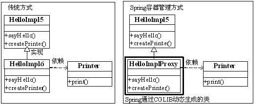
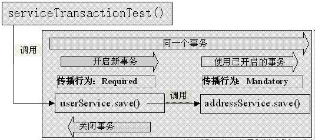
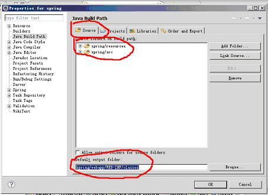
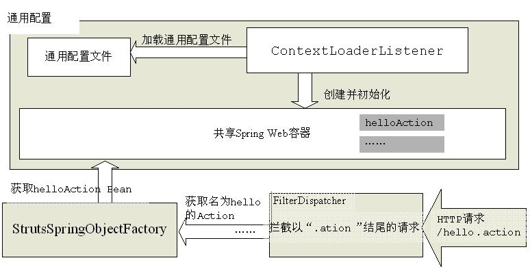

# 跟我学 Spring3

> 作者：开涛
> 
> 来源：[跟我学 spring3](http://www.iteye.com/blogs/subjects/spring3)

# 【第二章】 IoC 之 2.1 IoC 基础 ——跟我学 Spring3

### 2.1.1 IoC 是什么

Ioc—Inversion of Control，即“控制反转”，不是什么技术，而是一种设计思想。在 Java 开发中，Ioc 意味着将你设计好的对象交给容器控制，而不是传统的在你的对象内部直接控制。如何理解好 Ioc 呢？理解好 Ioc 的关键是要明确“谁控制谁，控制什么，为何是反转（有反转就应该有正转了），哪些方面反转了”，那我们来深入分析一下：

●**谁控制谁，控制什么：**传统 Java SE 程序设计，我们直接在对象内部通过 new 进行创建对象，是程序主动去创建依赖对象；而 IoC 是有专门一个容器来创建这些对象，即由 Ioc 容器来控制对象的创建；谁控制谁？当然是 IoC 容器控制了对象；控制什么？那就是主要控制了外部资源获取（不只是对象包括比如文件等）。

●**为何是反转，哪些方面反转了：**有反转就有正转，传统应用程序是由我们自己在对象中主动控制去直接获取依赖对象，也就是正转；而反转则是由容器来帮忙创建及注入依赖对象；为何是反转？因为由容器帮我们查找及注入依赖对象，对象只是被动的接受依赖对象，所以是反转；哪些方面反转了？依赖对象的获取被反转了。

用图例说明一下，传统程序设计如图 2-1，都是主动去创建相关对象然后再组合起来：


图 2-1 传统应用程序示意图

当有了 IoC/DI 的容器后，在客户端类中不再主动去创建这些对象了，如图 2-2 所示:


图 2-2 有 IoC/DI 容器后程序结构示意图

### 1.1.2 IoC 能做什么

IoC 不是一种技术，只是一种思想，一个重要的面向对象编程的法则，它能指导我们如何设计出松耦合、更优良的程序。传统应用程序都是由我们在类内部主动创建依赖对象，从而导致类与类之间高耦合，难于测试；有了 IoC 容器后，把创建和查找依赖对象的控制权交给了容器，由容器进行注入组合对象，所以对象与对象之间是松散耦合，这样也方便测试，利于功能复用，更重要的是使得程序的整个体系结构变得非常灵活。

其实 IoC 对编程带来的最大改变不是从代码上，而是从思想上，发生了“主从换位”的变化。应用程序原本是老大，要获取什么资源都是主动出击，但是在 IoC/DI 思想中，应用程序就变成被动的了，被动的等待 IoC 容器来创建并注入它所需要的资源了。

IoC 很好的体现了面向对象设计法则之一—— 好莱坞法则：“别找我们，我们找你”；即由 IoC 容器帮对象找相应的依赖对象并注入，而不是由对象主动去找。

### 2.1.3 IoC 和 DI

DI—Dependency Injection，即“依赖注入”：是组件之间依赖关系由容器在运行期决定，形象的说，即由容器动态的将某个依赖关系注入到组件之中。依赖注入的目的并非为软件系统带来更多功能，而是为了提升组件重用的频率，并为系统搭建一个灵活、可扩展的平台。通过依赖注入机制，我们只需要通过简单的配置，而无需任何代码就可指定目标需要的资源，完成自身的业务逻辑，而不需要关心具体的资源来自何处，由谁实现。

理解 DI 的关键是：“谁依赖谁，为什么需要依赖，谁注入谁，注入了什么”，那我们来深入分析一下：

●**谁依赖于谁：**当然是应用程序依赖于 IoC 容器；

●**为什么需要依赖：**应用程序需要 IoC 容器来提供对象需要的外部资源；

●**谁注入谁：**很明显是 IoC 容器注入应用程序某个对象，应用程序依赖的对象；

**●注入了什么：**就是注入某个对象所需要的外部资源（包括对象、资源、常量数据）。

IoC 和 DI 由什么关系呢？其实它们是同一个概念的不同角度描述，由于控制反转概念比较含糊（可能只是理解为容器控制对象这一个层面，很难让人想到谁来维护对象关系），所以 2004 年大师级人物 Martin Fowler 又给出了一个新的名字：“依赖注入”，相对 IoC 而言，**“依赖注入”明确描述了“被注入对象依赖 IoC 容器配置依赖对象”。**

注：如果想要更加深入的了解 IoC 和 DI，请参考大师级人物 Martin Fowler 的一篇经典文章《Inversion of Control Containers and the Dependency Injection pattern》，原文地址：[`www.martinfowler.com/articles/injection.html。`](http://www.martinfowler.com/articles/injection.html。)

转自【[`sishuok.com/forum/blogPost/list/2427.html`](http://sishuok.com/forum/blogPost/list/2427.html)】

# 【第二章】 IoC 之 2.2 IoC 容器基本原理 ——跟我学 Spring3

### 2.2.1 IoC 容器的概念

IoC 容器就是具有依赖注入功能的容器，IoC 容器负责实例化、定位、配置应用程序中的对象及建立这些对象间的依赖。应用程序无需直接在代码中 new 相关的对象，应用程序由 IoC 容器进行组装。在 Spring 中 BeanFactory 是 IoC 容器的实际代表者。

Spring IoC 容器如何知道哪些是它管理的对象呢？这就需要配置文件，Spring IoC 容器通过读取配置文件中的配置元数据，通过元数据对应用中的各个对象进行实例化及装配。一般使用基于 xml 配置文件进行配置元数据，而且 Spring 与配置文件完全解耦的，可以使用其他任何可能的方式进行配置元数据，比如注解、基于 java 文件的、基于属性文件的配置都可以。

那 Spring IoC 容器管理的对象叫什么呢？

### 2.2.2 Bean 的概念

由 IoC 容器管理的那些组成你应用程序的对象我们就叫它 Bean， Bean 就是由 Spring*容器*初始化、装配及管理的对象，除此之外，bean 就与应用程序中的其他对象没有什么区别了。那 IoC 怎样确定如何实例化 Bean、管理 Bean 之间的依赖关系以及管理 Bean 呢？这就需要配置元数据，在 Spring 中由 BeanDefinition 代表，后边会详细介绍，配置元数据指定如何实例化 Bean、如何组装 Bean 等。概念知道的差不多了，让我们来做个简单的例子。

### 2.2.3 Hello World

一、配置环境：

l **JDK 安装：**安装最新的 JDK，至少需要 Java 1.5 及以上环境；

l **开发工具：**SpringSource Tool Suite，简称 STS，是个基于 Eclipse 的开发环境，用以构建 Spring 应用，其最新版开始支持 Spring 3.0 及 OSGi 开发工具，但由于其太庞大，很多功能不是我们所必需的所以我们选择 Eclipse+ SpringSource Tool 插件进行 Spring 应用开发；到 eclipse 官网下载最新的 Eclipse，注意我们使用的是 Eclipse IDE for Java EE Developers（eclipse-jee-helios-SR1）；

安装插件：启动 Eclipse，选择 Help->Install New Software，如图 2-3 所示


图 2-3 安装

2、首先安装 SpringSource Tool Suite 插件依赖，如图 2-4:

Name 为：SpringSource Tool Suite Dependencies

Location 为：[`dist.springsource.com/release/TOOLS/composite/e3.6`](http://dist.springsource.com/release/TOOLS/composite/e3.6)


图 2-4 安装

3、安装 SpringSource Tool Suite 插件，只需安装如图 2-5 所选中的就可以：

Name 为：SpringSource Tool Suite

Location 为：[`dist.springsource.com/release/TOOLS/update/e3.6`](http://dist.springsource.com/release/TOOLS/update/e3.6)


图 2-4 安装

4、安装完毕，开始项目搭建吧。

**Spring 依赖：**本书使用 spring-framework-3.0.5.RELEASE

spring-framework-3.0.5.RELEASE-with-docs.zip 表示此压缩包带有文档的；

spring-framework-3.0.5.RELEASE-dependencies.zip 表示此压缩包中是 spring 的依赖 jar 包，所以需要什么依赖从这里找就好了；

下载地址：[`www.springsource.org/download`](http://www.springsource.org/download)

二、开始 Spring Hello World 之旅

1、准备需要的 jar 包

**核心 jar 包：**从下载的 spring-framework-3.0.5.RELEASE-with-docs.zip 中 dist 目录查找如下 jar 包

```java
org.springframework.asm-3.0.5.RELEASE.jar

org.springframework.core-3.0.5.RELEASE.jar

org.springframework.beans-3.0.5.RELEASE.jar

org.springframework.context-3.0.5.RELEASE.jar

org.springframework.expression-3.0.5.RELEASE.jar 
```

**依赖的 jar 包：**从下载的 spring-framework-3.0.5.RELEASE-dependencies.zip 中查找如下依赖 jar 包

```java
com.springsource.org.apache.log4j-1.2.15.jar

com.springsource.org.apache.commons.logging-1.1.1.jar

com.springsource.org.apache.commons.collections-3.2.1.jar 
```

2、创建标准 Java 工程：

（1）选择“window”—> “Show View” —>“Package Explorer”，使用包结构视图；


图 2-5 包结构视图

（2）创建标准 Java 项目，选择“File”—>“New”—>“Other”；然后在弹出来的对话框中选择“Java Project”创建标准 Java 项目；


图 2-6 创建 Java 项目


图 2-7 创建 Java 项目


图 2-8 创建 Java 项目

（3）配置项目依赖库文件，右击项目选择“Properties”；然后在弹出的对话框中点击“Add JARS”在弹出的对话框中选择“lib”目录下的 jar 包；然后再点击“Add Library”，然后在弹出的对话框中选择“Junit”，选择“Junit4”；


图 2-9 配置项目依赖库文件


图 2-10 配置项目依赖库文件


图 2-11 配置项目依赖库文件

（4）项目目录结构如下图所示，其中“src”用于存放 java 文件；“lib”用于存放 jar 文件；“resources”用于存放配置文件；


图 2-12 项目目录结构

3、项目搭建好了，让我们来开发接口，此处我们只需实现打印“Hello World!”，所以我们定义一个“sayHello”接口，代码如下：

1.  package cn.javass.spring.chapter2.helloworld;
2.  public interface HelloApi {
3.  public void sayHello();
4.  }

4、接口开发好了，让我们来通过实现接口来完成打印“Hello World!”功能；

1.  package cn.javass.spring.chapter2.helloworld;
2.  public class HelloImpl implements HelloApi {
3.  @Override
4.  public void sayHello() {
5.  System.out.println("Hello World!");
6.  }
7.  }

5、接口和实现都开发好了，那如何使用 Spring IoC 容器来管理它们呢？这就需要配置文件，让 IoC 容器知道要管理哪些对象。让我们来看下配置文件 chapter2/helloworld.xml（放到 resources 目录下）：

1.  <?xml version="1.0" encoding="UTF-8"?>
2.  <beans
3.  _blank" href="http://www.springframework.org/schema/beans" class="pcalibre2 pcalibre pcalibre1 calibre8">http://www.springframework.org/schema/beans"
4.  _blank" href="http://www.w3.org/2001/XMLSchema-instance" class="pcalibre2 pcalibre pcalibre1 calibre8">http://www.w3.org/2001/XMLSchema-instance"
5.  _blank" href="http://www.springframework.org/schema/context" class="pcalibre2 pcalibre pcalibre1 calibre8">http://www.springframework.org/schema/context"
6.  xsi:schemaLocation="
7.  [`www.springframework.org/schema/beans`](http://www.springframework.org/schema/beans) [`www.springframework.org/schema/beans/spring-beans-3.0.xsd`](http://www.springframework.org/schema/beans/spring-beans-3.0.xsd)
8.  [`www.springframework.org/schema/context`](http://www.springframework.org/schema/context) [`www.springframework.org/schema/context/spring-context-3.0.xsd"&gt`](http://www.springframework.org/schema/context/spring-context-3.0.xsd"&gt);
9.  <!-- id 表示你这个组件的名字，class 表示组件类 -->
10.  <bean id="hello" class="cn.javass.spring.chapter2.helloworld.HelloImpl"></bean>
11.  </beans>

6、现在万一具备，那如何获取 IoC 容器并完成我们需要的功能呢？首先应该实例化一个 IoC 容器，然后从容器中获取需要的对象，然后调用接口完成我们需要的功能，代码示例如下：

1.  package cn.javass.spring.chapter2.helloworld;
2.  import org.junit.Test;
3.  import org.springframework.context.ApplicationContext;
4.  import org.springframework.context.support.ClassPathXmlApplicationContext;
5.  public class HelloTest {
6.  @Test
7.  public void testHelloWorld() {
8.  //1、读取配置文件实例化一个 IoC 容器
9.  ApplicationContext context = new ClassPathXmlApplicationContext("helloworld.xml");
10.  //2、从容器中获取 Bean，注意此处完全“面向接口编程，而不是面向实现”
11.  HelloApi helloApi = context.getBean("hello", HelloApi.class);
12.  //3、执行业务逻辑
13.  helloApi.sayHello();
14.  }
15.  }

7、自此一个完整的 Spring Hello World 已完成，是不是很简单，让我们深入理解下容器和 Bean 吧。

### 2.2.4 详解 IoC 容器

在 Spring Ioc 容器的代表就是 org.springframework.beans 包中的 BeanFactory 接口，BeanFactory 接口提供了 IoC 容器最基本功能；而 org.springframework.context 包下的 ApplicationContext 接口扩展了 BeanFactory，还提供了与 Spring AOP 集成、国际化处理、事件传播及提供不同层次的 context 实现 (如针对 web 应用的 WebApplicationContext)。简单说， BeanFactory 提供了 IoC 容器最基本功能，而 ApplicationContext 则增加了更多支持企业级功能支持。ApplicationContext 完全继承 BeanFactory，因而 BeanFactory 所具有的语义也适用于 ApplicationContext。

容器实现一览：

• **XmlBeanFactory：**BeanFactory 实现，提供基本的 IoC 容器功能，可以从 classpath 或文件系统等获取资源；

（1） File file = new File("fileSystemConfig.xml");

Resource resource = new FileSystemResource(file);

BeanFactory beanFactory = new XmlBeanFactory(resource);

（2）

Resource resource = new ClassPathResource("classpath.xml");

BeanFactory beanFactory = new XmlBeanFactory(resource);

• **ClassPathXmlApplicationContext：**ApplicationContext 实现，从 classpath 获取配置文件；

BeanFactory beanFactory = new ClassPathXmlApplicationContext("classpath.xml");

• **FileSystemXmlApplicationContext：**ApplicationContext 实现，从文件系统获取配置文件。

BeanFactory beanFactory = new FileSystemXmlApplicationContext("fileSystemConfig.xml");

具体代码请参考 cn.javass.spring.chapter2.InstantiatingContainerTest.java。

ApplicationContext 接口获取 Bean 方法简介：

• Object getBean(String name) 根据名称返回一个 Bean，客户端需要自己进行类型转换；

• T getBean(String name, Class<T> requiredType) 根据名称和指定的类型返回一个 Bean，客户端无需自己进行类型转换，如果类型转换失败，容器抛出异常；

• T getBean(Class<T> requiredType) 根据指定的类型返回一个 Bean，客户端无需自己进行类型转换，如果没有或有多于一个 Bean 存在容器将抛出异常；

• Map<String, T> getBeansOfType(Class<T> type) 根据指定的类型返回一个键值为名字和值为 Bean 对象的 Map，如果没有 Bean 对象存在则返回空的 Map。

让我们来看下 IoC 容器到底是如何工作。在此我们以 xml 配置方式来分析一下：

**一、准备配置文件**：就像前边 Hello World 配置文件一样，在配置文件中声明 Bean 定义也就是为 Bean 配置元数据。

**二、由 IoC 容器进行解析元数据：** IoC 容器的 Bean Reader 读取并解析配置文件，根据定义生成 BeanDefinition 配置元数据对象，IoC 容器根据 BeanDefinition 进行实例化、配置及组装 Bean。

**三、实例化 IoC 容器：**由客户端实例化容器，获取需要的 Bean。

整个过程是不是很简单，执行过程如图 2-5，其实 IoC 容器很容易使用，主要是如何进行 Bean 定义。下一章我们详细介绍定义 Bean。


图 2-5 Spring Ioc 容器

### 2.2.5 小结

除了测试程序的代码外，也就是程序入口，所有代码都没有出现 Spring 任何组件，而且所有我们写的代码没有实现框架拥有的接口，因而能非常容易的替换掉 Spring，是不是非入侵。

客户端代码完全面向接口编程，无需知道实现类，可以通过修改配置文件来更换接口实现，客户端代码不需要任何修改。是不是低耦合。

如果在开发初期没有真正的实现，我们可以模拟一个实现来测试，不耦合代码，是不是很方便测试。

Bean 之间几乎没有依赖关系，是不是很容易重用。

[转自【http://sishuok.com/forum/blogPost/list/2428.html](http://sishuok.com/forum/blogPost/list/2428.html)】

# 【第二章】 IoC 之 2.3 IoC 的配置使用——跟我学 Spring3

### 2.3.1 XML 配置的结构

一般配置文件结构如下：

1.  <beans>
2.  <import resource=”resource1.xml”/>
3.  <bean id=”bean1”class=””></bean>
4.  <bean id=”bean2”class=””></bean>
5.  <bean name=”bean2”class=””></bean>
6.  <alias alias="bean3" name="bean2"/>
7.  <import resource=”resource2.xml”/>
8.  </beans>

1、<bean>标签主要用来进行 Bean 定义；

2、alias 用于定义 Bean 别名的；

3、import 用于导入其他配置文件的 Bean 定义，这是为了加载多个配置文件，当然也可以把这些配置文件构造为一个数组（new String[] {“config1.xml”, config2.xml}）传给 ApplicationContext 实现进行加载多个配置文件，那一个更适合由用户决定；这两种方式都是通过调用 Bean Definition Reader 读取 Bean 定义，内部实现没有任何区别。<import>标签可以放在<beans>下的任何位置，没有顺序关系。

### 2.3.2 Bean 的配置

Spring IoC 容器目的就是管理 Bean，这些 Bean 将根据配置文件中的 Bean 定义进行创建，而 Bean 定义在容器内部由 BeanDefinition 对象表示，该定义主要包含以下信息：

●全限定类名（FQN）：用于定义 Bean 的实现类;

●Bean 行为定义：这些定义了 Bean 在容器中的行为；包括作用域（单例、原型创建）、是否惰性初始化及生命周期等；

●Bean 创建方式定义：说明是通过构造器还是工厂方法创建 Bean；

●Bean 之间关系定义：即对其他 bean 的引用，也就是依赖关系定义，这些引用 bean 也可以称之为同事 bean 或依赖 bean，也就是依赖注入。

Bean 定义只有“全限定类名”在当使用构造器或静态工厂方法进行实例化 bean 时是必须的，其他都是可选的定义。难道 Spring 只能通过配置方式来创建 Bean 吗？回答当然不是，某些 SingletonBeanRegistry 接口实现类实现也允许将那些非 BeanFactory 创建的、已有的用户对象注册到容器中，这些对象必须是共享的，比如使用 DefaultListableBeanFactory 的 registerSingleton() 方法。不过建议采用元数据定义。

### 2.3.3 Bean 的命名

每个 Bean 可以有一个或多个 id（或称之为标识符或名字），在这里我们把**第一个 id 称为“标识符”，其余 id 叫做“别名”**；这些 id 在 IoC 容器中必须唯一。如何为 Bean 指定 id 呢，有以下几种方式；

一、 不指定 id，只配置必须的全限定类名，由 IoC 容器为其生成一个标识，客户端必须通过接口“T getBean(Class<T> requiredType)”获取 Bean；

1.  <bean class=” cn.javass.spring.chapter2.helloworld.HelloImpl”/> （1）

测试代码片段如下：

1.  @Test
2.  public void test1() {
3.  BeanFactory beanFactory =
4.  new ClassPathXmlApplicationContext("chapter2/namingbean1.xml");
5.  //根据类型获取 bean
6.  HelloApi helloApi = beanFactory.getBean(HelloApi.class);
7.  helloApi.sayHello();
8.  }

二、指定 id，必须在 Ioc 容器中唯一；

1.  <bean id=” bean” class=” cn.javass.spring.chapter2.helloworld.HelloImpl”/> （2）

测试代码片段如下：

1.  @Test
2.  public void test2() {
3.  BeanFactory beanFactory =
4.  new ClassPathXmlApplicationContext("chapter2/namingbean2.xml");
5.  //根据 id 获取 bean
6.  HelloApi bean = beanFactory.getBean("bean", HelloApi.class);
7.  bean.sayHello();
8.  }

三、指定 name，这样 name 就是“标识符”，必须在 Ioc 容器中唯一；

1.  <bean name=” bean” class=” cn.javass.spring.chapter2.helloworld.HelloImpl”/> （3）

测试代码片段如下：

1.  @Test
2.  public void test3() {
3.  BeanFactory beanFactory =
4.  new ClassPathXmlApplicationContext("chapter2/namingbean3.xml");
5.  //根据 name 获取 bean
6.  HelloApi bean = beanFactory.getBean("bean", HelloApi.class);
7.  bean.sayHello();
8.  }

四、指定 id 和 name，id 就是标识符，而 name 就是别名，必须在 Ioc 容器中唯一；

1.  <bean id=”bean1”name=”alias1”
2.  class=” cn.javass.spring.chapter2.helloworld.HelloImpl”/>
3.  <!-- 如果 id 和 name 一样，IoC 容器能检测到，并消除冲突 -->
4.  <bean id="bean3" name="bean3" class="cn.javass.spring.chapter2.helloworld.HelloImpl"/> （4）

测试代码片段如下：

1.  @Test
2.  public void test4() {
3.  BeanFactory beanFactory =
4.  new ClassPathXmlApplicationContext("chapter2/namingbean4.xml");
5.  //根据 id 获取 bean
6.  HelloApi bean1 = beanFactory.getBean("bean1", HelloApi.class);
7.  bean1.sayHello();
8.  //根据别名获取 bean
9.  HelloApi bean2 = beanFactory.getBean("alias1", HelloApi.class);
10.  bean2.sayHello();
11.  //根据 id 获取 bean
12.  HelloApi bean3 = beanFactory.getBean("bean3", HelloApi.class);
13.  bean3.sayHello();
14.  String[] bean3Alias = beanFactory.getAliases("bean3");
15.  //因此别名不能和 id 一样，如果一样则由 IoC 容器负责消除冲突
16.  Assert.assertEquals(0, bean3Alias.length);
17.  }

五、指定多个 name，多个 name 用“，”、“；”、“ ”分割，第一个被用作标识符，其他的（alias1、alias2、alias3）是别名，所有标识符也必须在 Ioc 容器中唯一；

1.  <bean name=” bean1;alias11,alias12;alias13 alias14”
2.  class=” cn.javass.spring.chapter2.helloworld.HelloImpl”/>
3.  <!-- 当指定 id 时，name 指定的标识符全部为别名 -->
4.  <bean id="bean2" name="alias21;alias22"
5.  class="cn.javass.spring.chapter2.helloworld.HelloImpl"/> （5）

测试代码片段如下：

1.  @Test
2.  public void test5() {
3.  BeanFactory beanFactory =
4.  new ClassPathXmlApplicationContext("chapter2/namingbean5.xml");
5.  //1 根据 id 获取 bean
6.  HelloApi bean1 = beanFactory.getBean("bean1", HelloApi.class);
7.  bean1.sayHello();
8.  //2 根据别名获取 bean
9.  HelloApi alias11 = beanFactory.getBean("alias11", HelloApi.class);
10.  alias11.sayHello();
11.  //3 验证确实是四个别名
12.  String[] bean1Alias = beanFactory.getAliases("bean1");
13.  System.out.println("=======namingbean5.xml bean1 别名========");
14.  for(String alias : bean1Alias) {
15.  System.out.println(alias);
16.  }
17.  Assert.assertEquals(4, bean1Alias.length);
18.  //根据 id 获取 bean
19.  HelloApi bean2 = beanFactory.getBean("bean2", HelloApi.class);
20.  bean2.sayHello();
21.  //2 根据别名获取 bean
22.  HelloApi alias21 = beanFactory.getBean("alias21", HelloApi.class);
23.  alias21.sayHello();
24.  //验证确实是两个别名
25.  String[] bean2Alias = beanFactory.getAliases("bean2");
26.  System.out.println("=======namingbean5.xml bean2 别名========");
27.  for(String alias : bean2Alias) {
28.  System.out.println(alias);
29.  }
30.  Assert.assertEquals(2, bean2Alias.length);
31.  }

六、使用<alias>标签指定别名，别名也必须在 IoC 容器中唯一

1.  <bean name="bean" class="cn.javass.spring.chapter2.helloworld.HelloImpl"/>
2.  <alias alias="alias1" name="bean"/>
3.  <alias alias="alias2" name="bean"/> （6）

测试代码片段如下：

1.  @Test
2.  public void test6() {
3.  BeanFactory beanFactory =
4.  new ClassPathXmlApplicationContext("chapter2/namingbean6.xml");
5.  //根据 id 获取 bean
6.  HelloApi bean = beanFactory.getBean("bean", HelloApi.class);
7.  bean.sayHello();
8.  //根据别名获取 bean
9.  HelloApi alias1 = beanFactory.getBean("alias1", HelloApi.class);
10.  alias1.sayHello();
11.  HelloApi alias2 = beanFactory.getBean("alias2", HelloApi.class);
12.  alias2.sayHello();
13.  String[] beanAlias = beanFactory.getAliases("bean");
14.  System.out.println("=======namingbean6.xml bean 别名========");
15.  for(String alias : beanAlias) {
16.  System.out.println(alias);
17.  }
18.  System.out.println("=======namingbean6.xml bean 别名========");
19.  Assert.assertEquals(2, beanAlias.length);
20.  }

以上测试代码在 cn.javass.spring.chapter2.NamingBeanTest.java 文件中。

从定义来看，name 或 id 如果指定它们中的一个时都作为“标识符”，那为什么还要有 id 和 name 同时存在呢？这是因为当使用基于 XML 的配置元数据时，在 XML 中 id 是一个真正的 XML id 属性，因此当其他的定义来引用这个 id 时就体现出 id 的好处了，可以利用 XML 解析器来验证引用的这个 id 是否存在，从而更早的发现是否引用了一个不存在的 bean，而使用 name，则可能要在真正使用 bean 时才能发现引用一个不存在的 bean。

●**Bean 命名约定：**Bean 的命名遵循 XML 命名规范，但最好符合 Java 命名规范，由“字母、数字、下划线组成“，而且应该养成一个良好的命名习惯， 比如采用“驼峰式”，即第一个单词首字母开始，从第二个单词开始首字母大写开始，这样可以增加可读性。

### 2.3.4 实例化 Bean

Spring IoC 容器如何实例化 Bean 呢？传统应用程序可以通过 new 和反射方式进行实例化 Bean。而 Spring IoC 容器则需要根据 Bean 定义里的配置元数据使用反射机制来创建 Bean。在 Spring IoC 容器中根据 Bean 定义创建 Bean 主要有以下几种方式：

一、使用构造器实例化 Bean：这是最简单的方式，Spring IoC 容器即能使用默认空构造器也能使用有参数构造器两种方式创建 Bean，如以下方式指定要创建的 Bean 类型：

使用空构造器进行定义，使用此种方式，class 属性指定的类必须有空构造器

1.  <bean name="bean1" class="cn.javass.spring.chapter2.HelloImpl2"/>

使用有参数构造器进行定义，使用此中方式，可以使用< constructor-arg >标签指定构造器参数值，其中 index 表示位置，value 表示常量值，也可以指定引用，指定引用使用 ref 来引用另一个 Bean 定义，后边会详细介绍：

1.  <bean name="bean2" class="cn.javass.spring.chapter2.HelloImpl2">
2.  <!-- 指定构造器参数 -->
3.  <constructor-arg index="0" value="Hello Spring!"/>
4.  </bean>

知道如何配置了，让我们做个例子的例子来实践一下吧：

（1）准备 Bean class(HelloImpl2.java)，该类有一个空构造器和一个有参构造器：

1.  package cn.javass.spring.chapter2;
2.  public class HelloImpl2 implements HelloApi {
3.  private String message;
4.  public HelloImpl2() {
5.  this.message = "Hello World!";
6.  }
7.  Public HelloImpl2(String message) {
8.  this.message = message;
9.  }
10.  @Override
11.  public void sayHello() {
12.  System.out.println(message);
13.  }
14.  }

（2）在配置文件(resources/chapter2/instantiatingBean.xml)配置 Bean 定义，如下所示：

1.  <!--使用默认构造参数-->
2.  <bean name="bean1" class="cn.javass.spring.chapter2.HelloImpl2"/>
3.  <!--使用有参数构造参数-->

4.  <bean name="bean2" class="cn.javass.spring.chapter2.HelloImpl2">

5.  <!-- 指定构造器参数 -->
6.  <constructor-arg index="0" value="Hello Spring!"/>
7.  </bean>

（3）配置完了，让我们写段测试代码（InstantiatingContainerTest）来看下是否工作吧：

1.  @Test
2.  public void testInstantiatingBeanByConstructor() {
3.  //使用构造器
4.  BeanFactory beanFactory =
5.  new ClassPathXmlApplicationContext("chapter2/instantiatingBean.xml");
6.  HelloApi bean1 = beanFactory.getBean("bean1", HelloApi.class);
7.  bean1.sayHello();
8.  HelloApi bean2 = beanFactory.getBean("bean2", HelloApi.class);
9.  bean2.sayHello();
10.  }

二、使用静态工厂方式实例化 Bean，使用这种方式除了指定必须的 class 属性，还要指定 factory-method 属性来指定实例化 Bean 的方法，而且使用静态工厂方法也允许指定方法参数，spring IoC 容器将调用此属性指定的方法来获取 Bean，配置如下所示：

（1）先来看看静态工厂类代码吧 HelloApiStaticFactory：

1.  public class HelloApiStaticFactory {
2.  //工厂方法
3.  public static HelloApi newInstance(String message) {
4.  //返回需要的 Bean 实例
5.  return new HelloImpl2(message);
6.  }
7.  }

（2）静态工厂写完了，让我们在配置文件(resources/chapter2/instantiatingBean.xml)配置 Bean 定义：

1.  <!-- 使用静态工厂方法 -->
2.  <bean id="bean3" class="cn.javass.spring.chapter2.HelloApiStaticFactory" factory-method="newInstance">
3.  <constructor-arg index="0" value="Hello Spring!"/>
4.  </bean>

（3）配置完了，写段测试代码来测试一下吧，InstantiatingBeanTest：

1.  @Test
2.  public void testInstantiatingBeanByStaticFactory() {
3.  //使用静态工厂方法
4.  BeanFactory beanFactory =
5.  new ClassPathXmlApplicationContext("chaper2/instantiatingBean.xml");
6.  HelloApi bean3 = beanFactory.getBean("bean3", HelloApi.class);
7.  bean3.sayHello();
8.  }

三、使用实例工厂方法实例化 Bean，使用这种方式不能指定 class 属性，此时必须使用 factory-bean 属性来指定工厂 Bean，factory-method 属性指定实例化 Bean 的方法，而且使用实例工厂方法允许指定方法参数，方式和使用构造器方式一样，配置如下：

（1）实例工厂类代码（HelloApiInstanceFactory.java）如下：

1.  package cn.javass.spring.chapter2;
2.  public class HelloApiInstanceFactory {
3.  public HelloApi newInstance(String message) {
4.  return new HelloImpl2(message);
5.  }
6.  }

（2）让我们在配置文件(resources/chapter2/instantiatingBean.xml)配置 Bean 定义：

1.  <!—1、定义实例工厂 Bean -->
2.  <bean id="beanInstanceFactory"
3.  class="cn.javass.spring.chapter2.HelloApiInstanceFactory"/>
4.  <!—2、使用实例工厂 Bean 创建 Bean -->
5.  <bean id="bean4"
6.  factory-bean="beanInstanceFactory"
7.  factory-method="newInstance">
8.  <constructor-arg index="0" value="Hello Spring!"></constructor-arg>
9.  </bean>

（3）测试代码 InstantiatingBeanTest：

1.  @Test
2.  public void testInstantiatingBeanByInstanceFactory() {
3.  //使用实例工厂方法
4.  BeanFactory beanFactory =
5.  new ClassPathXmlApplicationContext("chapter2/instantiatingBean.xml");
6.  HelloApi bean4 = beanFactory.getBean("bean4", HelloApi.class);
7.  bean4.sayHello();
8.  }

通过以上例子我们已经基本掌握了如何实例化 Bean 了，大家是否注意到？这三种方式只是配置不一样，从获取方式看完全一样，没有任何不同。这也是 Spring IoC 的魅力，Spring IoC 帮你创建 Bean，我们只管使用就可以了，是不是很简单。

### 2.3.5 小结

到此我们已经讲完了 Spring IoC 基础部分，包括 IoC 容器概念，如何实例化容器，Bean 配置、命名及实例化，Bean 获取等等。不知大家是否注意到到目前为止，我们只能通过简单的实例化 Bean，没有涉及 Bean 之间关系。接下来一章让我们进入配置 Bean 之间关系章节，也就是依赖注入。

# 【第三章】 DI 之 3.1 DI 的配置使用 ——跟我学 spring3

### 3.1.1 依赖和依赖注入

传统应用程序设计中所说的依赖一般指“类之间的关系”，那先让我们复习一下类之间的关系：

**泛化：**表示类与类之间的继承关系、接口与接口之间的继承关系；

**实现：**表示类对接口的实现；

**依赖：**当类与类之间有使用关系时就属于依赖关系，不同于关联关系，依赖不具有“拥有关系”，而是一种“相识关系”，只在某个特定地方（比如某个方法体内）才有关系。

**关联：**表示类与类或类与接口之间的依赖关系，表现为“拥有关系”；具体到代码可以用实例变量来表示；

**聚合：**属于是关联的特殊情况，体现部分-整体关系，是一种弱拥有关系；整体和部分可以有不一样的生命周期；是一种弱关联；

**组合：**属于是关联的特殊情况，也体现了体现部分-整体关系，是一种强“拥有关系”；整体与部分有相同的生命周期，是一种强关联；

Spring IoC 容器的依赖有两层含义：**Bean 依赖容器**和**容器注入 Bean 的依赖资源**：

**Bean 依赖容器：**也就是说 Bean 要依赖于容器，这里的依赖是指容器负责创建 Bean 并管理 Bean 的生命周期，正是由于由容器来控制创建 Bean 并注入依赖，也就是控制权被反转了，这也正是 IoC 名字的由来，**此处的有依赖是指 Bean 和容器之间的依赖关系**。

**容器注入 Bean 的依赖资源：**容器负责注入 Bean 的依赖资源，依赖资源可以是 Bean、外部文件、常量数据等，在 Java 中都反映为对象，并且由容器负责组装 Bean 之间的依赖关系，**此处的依赖是指 Bean 之间的依赖关系**，**可以认为是传统类与类之间的“关联”、“聚合”、“组合”关系**。

为什么要应用依赖注入，应用依赖注入能给我们带来哪些好处呢？

**动态替换 Bean 依赖对象，程序更灵活：**替换 Bean 依赖对象，无需修改源文件：应用依赖注入后，由于可以采用配置文件方式实现，从而能随时动态的替换 Bean 的依赖对象，无需修改 java 源文件；

**更好实践面向接口编程，代码更清晰：**在 Bean 中只需指定依赖对象的接口，接口定义依赖对象完成的功能，通过容器注入依赖实现；

**更好实践优先使用对象组合，而不是类继承：**因为 IoC 容器采用注入依赖，也就是组合对象，从而更好的实践对象组合。

*   采用对象组合，Bean 的功能可能由几个依赖 Bean 的功能组合而成，其 Bean 本身可能只提供少许功能或根本无任何功能，全部委托给依赖 Bean，对象组合具有动态性，能更方便的替换掉依赖 Bean，从而改变 Bean 功能；
*   而如果采用类继承，Bean 没有依赖 Bean，而是采用继承方式添加新功能，，而且功能是在编译时就确定了，不具有动态性，而且采用类继承导致 Bean 与子 Bean 之间高度耦合，难以复用。

**增加 Bean 可复用性：**依赖于对象组合，Bean 更可复用且复用更简单；

**降低 Bean 之间耦合：**由于我们完全采用面向接口编程，在代码中没有直接引用 Bean 依赖实现，全部引用接口，而且不会出现显示的创建依赖对象代码，而且这些依赖是由容器来注入，很容易替换依赖实现类，从而降低 Bean 与依赖之间耦合；

**代码结构更清晰：**要应用依赖注入，代码结构要按照规约方式进行书写，从而更好的应用一些最佳实践，因此代码结构更清晰。

从以上我们可以看出，其实依赖注入只是一种装配对象的手段，设计的类结构才是基础，如果设计的类结构不支持依赖注入，Spring IoC 容器也注入不了任何东西，从而从根本上说**“如何设计好类结构才是关键，依赖注入只是一种装配对象手段”。**

前边 IoC 一章我们已经了解了 Bean 依赖容器，那容器如何注入 Bean 的依赖资源，Spring IoC 容器注入依赖资源主要有以下两种基本实现方式：

**构造器注入：**就是容器实例化 Bean 时注入那些依赖，通过在在 Bean 定义中指定构造器参数进行注入依赖，包括实例工厂方法参数注入依赖，但静态工厂方法参数不允许注入依赖；

**setter 注入**：通过 setter 方法进行注入依赖；

**方法注入**：能通过配置方式替换掉 Bean 方法，也就是通过配置改变 Bean 方法 功能。

我们已经知道注入实现方式了，接下来让我们来看看具体配置吧。

### 3.1.2 构造器注入

使用构造器注入通过配置构造器参数实现，构造器参数就是依赖。除了构造器方式，还有静态工厂、实例工厂方法可以进行构造器注入。如图 3-1 所示：


图 3-1 实例化

构造器注入可以根据参数索引注入、参数类型注入或 Spring3 支持的参数名注入，但参数名注入是有限制的，需要使用在编译程序时打开调试模式（即在编译时使用“javac –g:vars”在 class 文件中生成变量调试信息，默认是不包含变量调试信息的，从而能获取参数名字，否则获取不到参数名字）或在构造器上使用@ConstructorProperties（java.beans.ConstructorProperties）注解来指定参数名。

首先让我们准备测试构造器类 HelloImpl3.java，该类只有一个包含两个参数的构造器：

1.  package cn.javass.spring.chapter3.helloworld;
2.  public class HelloImpl3 implements HelloApi {
3.  private String message;
4.  private int index;
5.  //@java.beans.ConstructorProperties({"message", "index"})
6.  public HelloImpl3(String message, int index) {
7.  this.message = message;
8.  this.index = index;
9.  }
10.  @Override
11.  public void sayHello() {
12.  System.out.println(index + ":" + message);
13.  }
14.  }

一、根据参数索引注入，使用标签“<constructor-arg index="1" value="1"/>”来指定注入的依赖，其中“index”表示索引，从 0 开始，即第一个参数索引为 0，“value”来指定注入的常量值，配置方式如下：


二、根据参数类型进行注入，使用标签“<constructor-arg type="java.lang.String" value="Hello World!"/>”来指定注入的依赖，其中“type”表示需要匹配的参数类型，可以是基本类型也可以是其他类型，如“int”、“java.lang.String”，“value”来指定注入的常量值，配置方式如下：


三、根据参数名进行注入，使用标签“<constructor-arg name="message" value="Hello World!"/>”来指定注入的依赖，其中“name”表示需要匹配的参数名字，“value”来指定注入的常量值，配置方式如下：


四、让我们来用具体的例子来看一下构造器注入怎么使用吧。

（1）首先准备 Bean 类，在此我们就使用“HelloImpl3”这个类。

（2）有了 Bean 类，接下来要进行 Bean 定义配置，我们需要配置三个 Bean 来完成上述三种依赖注入测试，其中 Bean ”byIndex”是通过索引注入依赖；Bean ”byType”是根据类型进行注入依赖；Bean ”byName”是根据参数名字进行注入依赖，具体配置文件（resources/chapter3/ constructorDependencyInject.xml）如下：

1.  <!-- 通过构造器参数索引方式依赖注入 -->
2.  <bean id="byIndex" class="cn.javass.spring.chapter3.HelloImpl3">
3.  <constructor-arg index="0" value="Hello World!"/>
4.  <constructor-arg index="1" value="1"/>
5.  </bean>
6.  <!-- 通过构造器参数类型方式依赖注入 -->
7.  <bean id="byType" class="cn.javass.spring.chapter3.HelloImpl3">
8.  <constructor-arg type="java.lang.String" value="Hello World!"/>
9.  <constructor-arg type="int" value="2"/>
10.  </bean>
11.  <!-- 通过构造器参数名称方式依赖注入 -->
12.  <bean id="byName" class="cn.javass.spring.chapter3.HelloImpl3">
13.  <constructor-arg name="message" value="Hello World!"/>
14.  <constructor-arg name="index" value="3"/>
15.  </bean>

（3）配置完毕后，在测试之前，因为我们使用了通过构造器参数名字注入方式，请确保编译时 class 文件包含“变量信息”，具体查看编译时是否包含“变量调试信息”请右击项目，在弹出的对话框选择属性；然后在弹出的对话框选择“Java Compiler”条目，在“Class 文件 生成”框中选择“添加变量信息到 Class 文件（调试器使用）”，具体如图 3-2：


图 3-2 编译时打开“添加变量信息选项”

（4）接下来让我们测试一下配置是否工作，具体测试代码（cn.javass.spring.chapter3\. DependencyInjectTest）如下：

1.  @Test
2.  public void testConstructorDependencyInjectTest() {
3.  BeanFactory beanFactory = new ClassPathXmlApplicationContext("chapter3/constructorDependencyInject.xml");
4.  //获取根据参数索引依赖注入的 Bean
5.  HelloApi byIndex = beanFactory.getBean("byIndex", HelloApi.class);
6.  byIndex.sayHello();
7.  //获取根据参数类型依赖注入的 Bean
8.  HelloApi byType = beanFactory.getBean("byType", HelloApi.class);
9.  byType.sayHello();
10.  //获取根据参数名字依赖注入的 Bean
11.  HelloApi byName = beanFactory.getBean("byName", HelloApi.class);
12.  byName.sayHello();
13.  }

通过以上测试我们已经会基本的构造器注入配置了，在测试通过参数名字注入时，除了可以使用以上方式，还可以通过在构造器上添加@java.beans.ConstructorProperties({"message", "index"})注解来指定参数名字，在 HelloImpl3 构造器上把注释掉的“ConstructorProperties”打开就可以了，这个就留给大家做练习，自己配置然后测试一下。

五、大家已经会了构造器注入，那让我们再看一下静态工厂方法注入和实例工厂注入吧，其实它们注入配置是完全一样，在此我们只示范一下静态工厂注入方式和实例工厂方式配置，测试就留给大家自己练习：

（1）静态工厂类

1.  //静态工厂类
2.  package cn.javass.spring.chapter3;
3.  import cn.javass.spring.chapter2.helloworld.HelloApi;
4.  public class DependencyInjectByStaticFactory {
5.  public static HelloApi newInstance(String message, int index) {
6.  return new HelloImpl3(message, index);
7.  }
8.  }

静态工厂类 Bean 定义配置文件（chapter3/staticFactoryDependencyInject.xml）

1.  <bean id="byIndex"
2.  class="cn.javass.spring.chapter3.DependencyInjectByStaticFactory" factory-method="newInstance">
3.  <constructor-arg index="0" value="Hello World!"/>
4.  <constructor-arg index="1" value="1"/>
5.  </bean>
6.  <bean id="byType"
7.  class="cn.javass.spring.chapter3.DependencyInjectByStaticFactory" factory-method="newInstance">
8.  <constructor-arg type="java.lang.String" value="Hello World!"/>
9.  <constructor-arg type="int" value="2"/>
10.  </bean>
11.  <bean id="byName"
12.  class="cn.javass.spring.chapter3.DependencyInjectByStaticFactory" factory-method="newInstance">
13.  <constructor-arg name="message" value="Hello World!"/>
14.  <constructor-arg name="index" value="3"/>
15.  </bean>

（2）实例工厂类

1.  //实例工厂类
2.  package cn.javass.spring.chapter3;
3.  import cn.javass.spring.chapter2.helloworld.HelloApi;
4.  public class DependencyInjectByInstanceFactory {
5.  public HelloApi newInstance(String message, int index) {
6.  return new HelloImpl3(message, index);
7.  }
8.  }

实例工厂类 Bean 定义配置文件（chapter3/instanceFactoryDependencyInject.xml）

1.  <bean id="instanceFactory"
2.  class="cn.javass.spring.chapter3.DependencyInjectByInstanceFactory"/>

3.  <bean id="byIndex"

4.  factory-bean="instanceFactory" factory-method="newInstance">
5.  <constructor-arg index="0" value="Hello World!"/>
6.  <constructor-arg index="1" value="1"/>
7.  </bean>
8.  <bean id="byType"
9.  factory-bean="instanceFactory" factory-method="newInstance">
10.  <constructor-arg type="java.lang.String" value="Hello World!"/>
11.  <constructor-arg type="int" value="2"/>
12.  </bean>
13.  <bean id="byName"
14.  factory-bean="instanceFactory" factory-method="newInstance">
15.  <constructor-arg name="message" value="Hello World!"/>
16.  <constructor-arg name="index" value="3"/>
17.  </bean>

（3）测试代码和构造器方式完全一样，只是配置文件不一样，大家只需把测试文件改一下就可以了。还有一点需要大家注意就是静态工厂方式和实例工厂方式根据参数名字注入的方式只支持通过在 class 文件中添加“变量调试信息”方式才能运行，ConstructorProperties 注解方式不能工作，它只对构造器方式起作用，**不建议使用根据参数名进行构造器注入**。

### 3.1.3 setter 注入

setter 注入，是通过在通过构造器、静态工厂或实例工厂实例好 Bean 后，通过调用 Bean 类的 setter 方法进行注入依赖，如图 3-3 所示：


图 3-3 setter 注入方式

setter 注入方式只有一种根据 setter 名字进行注入：


知道配置方式了，接下来先让我们来做个简单例子吧。

（1）准备测试类 HelloImpl4，需要两个 setter 方法“setMessage”和“setIndex”：

1.  package cn.javass.spring.chapter3;
2.  import cn.javass.spring.chapter2.helloworld.HelloApi;
3.  public class HelloImpl4 implements HelloApi {
4.  private String message;
5.  private int index;
6.  //setter 方法
7.  public void setMessage(String message) {
8.  this.message = message;
9.  }
10.  public void setIndex(int index) {
11.  this.index = index;
12.  }
13.  @Override
14.  public void sayHello() {
15.  System.out.println(index + ":" + message);
16.  }
17.  }

（2）配置 Bean 定义，具体配置文件（resources/chapter3/setterDependencyInject.xml）片段如下：

1.  <!-- 通过 setter 方式进行依赖注入 -->
2.  <bean id="bean" class="cn.javass.spring.chapter3.HelloImpl4">
3.  <property name="message" value="Hello World!"/>
4.  <property name="index">
5.  <value>1</value>
6.  </property>
7.  </bean>

（3）该写测试进行测试一下是否满足能工作了，其实测试代码一点没变，变的是配置：

1.  @Test
2.  public void testSetterDependencyInject() {
3.  BeanFactory beanFactory =
4.  new ClassPathXmlApplicationContext("chapter3/setterDependencyInject.xml");
5.  HelloApi bean = beanFactory.getBean("bean", HelloApi.class);
6.  bean.sayHello();
7.  }

知道如何配置了，但 Spring 如何知道 setter 方法？如何将值注入进去的呢？其实方法名是要遵守约定的，setter 注入的方法名要遵循“JavaBean getter/setter 方法命名约定”：

JavaBean：是本质就是一个 POJO 类，但具有一下限制：

该类必须要**有公共的无参构造器**，如 public HelloImpl4() {}；

**属性为 private 访问级别**，不建议 public，如 private String message;

**属性必要时通过一组 setter（修改器）和 getter（访问器）方法来访问**；

**setter 方法，以“set” 开头，后跟首字母大写的属性名**，如“setMesssage”,简单属性一般只有一个方法参数，方法返回值通常为“void”;

g**etter 方法，一般属性以“get”开头，对于 boolean 类型一般以“is”开头，后跟首字母大写的属性名**，如“getMesssage”，“isOk”；

还有一些其他特殊情况，**比如属性有连续两个大写字母开头，如“URL”,则 setter/getter 方法为：“setURL”和“getURL”**，其他一些特殊情况请参看“Java Bean”命名规范。

### 3.1.4 注入常量

注入常量是依赖注入中最简单的。配置方式如下所示：

1.  <property name="message" value="Hello World!"/>
2.  或
3.  <property name="index"><value>1</value></property><span class="Apple-style-span" style="font-size: 14px; white-space: normal; background-color: #ffffff;"> </span>

以上两种方式都可以，从配置来看第一种更简洁。注意此处“value”中指定的全是字符串，由 Spring 容器将此字符串转换成属性所需要的类型，如果转换出错，将抛出相应的异常。

Spring 容器目前能对各种基本类型把配置的 String 参数转换为需要的类型。

注：Spring 类型转换系统对于 boolean 类型进行了容错处理，除了可以使用“true/false”标准的 Java 值进行注入，还能使用“yes/no”、“on/off”、“1/0”来代表“真/假”，所以大家在学习或工作中遇到这种类似问题不要觉得是人家配置错了，而是 Spring 容错做的非常好。

1.  测试类
2.  public class BooleanTestBean {
3.  private boolean success;
4.  public void setSuccess(boolean success) {
5.  this.success = success;
6.  }
7.  public boolean isSuccess() {
8.  return success;
9.  }
10.  }
11.  配置文件（chapter3/booleanInject.xml）片段：
12.  <!-- boolean 参数值可以用 on/off -->
13.  <bean id="bean2" class="cn.javass.spring.chapter3.bean.BooleanTestBean">
14.  <property name="success" value="on"/>
15.  </bean>
16.  <!-- boolean 参数值可以用 yes/no -->
17.  <bean id="bean3" class="cn.javass.spring.chapter3.bean.BooleanTestBean">
18.  <property name="success" value="yes"/>
19.  </bean>
20.  <!-- boolean 参数值可以用 1/0 -->
21.  <bean id="bean4" class="cn.javass.spring.chapter3.bean.BooleanTestBean">
22.  <property name="success" value="1"/>
23.  </bean>

### 3.1.5 注入 Bean ID

用于注入 Bean 的 ID，ID 是一个常量不是引用，且类似于注入常量，但提供错误验证功能，配置方式如下所示：

1.  <property name="id"><idref bean="bean1"/></property>

1.  <property name="id"><idref local="bean2"/></property>

两种方式都可以，上述配置本质上在运行时等于如下方式

1.  <bean id="bean1" class="……"/>
2.  <bean id="idrefBean1" class="……">
3.  <property name="id" value ="bean1"/>
4.  </bean>

第二种方式（<idref bean="bean1"/>）可以在容器初始化时校验被引用的 Bean 是否存在，如果不存在将抛出异常，而第一种方式（<idref local="bean2"/>）只有在 Bean 实际使用时才能发现传入的 Bean 的 ID 是否正确，可能发生不可预料的错误。因此如果想注入 Bean 的 ID，推荐使用第二种方式。

接下来学习一下如何使用吧：

首先定义测试 Bean：

1.  package cn.javass.spring.chapter3.bean
2.  public class IdRefTestBean {
3.  private String id;
4.  public String getId() {
5.  return id;
6.  }
7.  public void setId(String id) {
8.  this.id = id;
9.  }
10.  }

**其次定义配置文件（chapter3/idRefInject.xml）：**

1.  <bean id="bean1" class="java.lang.String">
2.  <constructor-arg index="0" value="test"/>
3.  </bean>
4.  <bean id="bean2" class="java.lang.String">
5.  <constructor-arg index="0" value="test"/>
6.  </bean>

1.  <bean id="idrefBean1" class="cn.javass.spring.chapter3.bean.IdRefTestBean">
2.  <property name="id"><idref bean="bean1"/></property>
3.  </bean>
4.  <bean id="idrefBean2" class="cn.javass.spring.chapter3.bean.IdRefTestBean">
5.  <property name="id"><idref local="bean2"/></property>
6.  </bean>

从配置中可以看出，注入的 Bean 的 ID 是一个 java.lang.String 类型，即字符串类型，因此注入的同样是常量，只是具有校验功能。

<idref bean="……"/>将在容器初始化时校验注入的 ID 对于的 Bean 是否存在，如果不存在将抛出异常。

<idref local="……"/>将在 XML 解析时校验注入的 ID 对于的 Bean 在当前配置文件中是否存在，如果不存在将抛出异常，它不同于<idref bean="……"/>，<idref local="……"/>是校验发生在 XML 解析式而非容器初始化时，且只检查当前配置文件中是否存在相应的 Bean。

### 3.1.6 注入集合、数组和字典

Spring 不仅能注入简单类型数据，还能注入集合（Collection、无序集合 Set、有序集合 List）类型、数组(Array)类型、字典(Map)类型数据、Properties 类型数据，接下来就让我们一个个看看如何注入这些数据类型的数据。

**一、注入集合类型：**包括 Collection 类型、Set 类型、List 类型数据：

**（1）List 类型：**需要使用<list>标签来配置注入，其具体配置如下：


让我们来写个测试来练习一下吧：

**准备测试类：**

1.  package cn.javass.spring.chapter3.bean;
2.  import java.util.List;
3.  public class ListTestBean {
4.  private List<String> values;
5.  public List<String> getValues() {
6.  return values;
7.  }
8.  public void setValues(List<String> values) {
9.  this.values = values;
10.  }
11.  }

**进行 Bean 定义，在配置文件（resources/chapter3/listInject.xml）中配置 list 注入：**

1.  <bean id="listBean" class="cn.javass.spring.chapter3.bean.ListTestBean">
2.  <property name="values">
3.  <list>
4.  <value>1</value>
5.  <value>2</value>
6.  <value>3</value>
7.  </list>
8.  </property>
9.  </bean>

**测试代码：**

1.  @Test
2.  public void testListInject() {
3.  BeanFactory beanFactory =
4.  new ClassPathXmlApplicationContext("chapter3/listInject.xml");
5.  ListTestBean listBean = beanFactory.getBean("listBean", ListTestBean.class);
6.  System.out.println(listBean.getValues().size());
7.  Assert.assertEquals(3, listBean.getValues().size());
8.  }

**（2）Set 类型：**需要使用<set>标签来配置注入，其配置参数及含义和<lsit>标签完全一样，在此就不阐述了：

**准备测试类：**

1.  package cn.javass.spring.chapter3.bean;
2.  import java.util.Collection;
3.  public class CollectionTestBean {
4.  private Collection<String> values;
5.  public void setValues(Collection<String> values) {
6.  this.values = values;
7.  }
8.  public Collection<String> getValues() {
9.  return values;
10.  }
11.  }

**进行 Bean 定义，在配置文件（resources/chapter3/listInject.xml）中配置 list 注入：**

1.  <bean id="setBean" class="cn.javass.spring.chapter3.bean.SetTestBean">
2.  <property name="values">
3.  <set>
4.  <value>1</value>
5.  <value>2</value>
6.  <value>3</value>
7.  </set>
8.  </property>
9.  </bean>

具体测试代码就不写了，和 listBean 测试代码完全一样。

**（2）Collection 类型：**因为 Collection 类型是 Set 和 List 类型的基类型，所以使用<set>或<list>标签都可以进行注入，配置方式完全和以上配置方式一样，只是将测试类属性改成“Collection”类型，如果配置有问题，可参考 cn.javass.spring.chapter3.DependencyInjectTest 测试类中的 testCollectionInject 测试方法中的代码。

二、**注入数组类型**：需要使用<array>标签来配置注入，其中标签属性“value-type”和“merge”和<list>标签含义完全一样，具体配置如下：


如果练习时遇到配置问题，可以参考“cn.javass.spring.chapter3.DependencyInjectTest”测试类中的 testArrayInject 测试方法中的代码。

**三、注入字典（Map）类型：**字典类型是包含键值对数据的数据结构，需要使用<map>标签来配置注入，其属性“key-type”和“value-type”分别指定“键”和“值”的数据类型，其含义和<list>标签的“value-type”含义一样，在此就不罗嗦了，并使用<key>子标签来指定键数据，<value>子标签来指定键对应的值数据，具体配置如下：


如果练习时遇到配置问题，可以参考“cn.javass.spring.chapter3.DependencyInjectTest”测试类中的 testMapInject 测试方法中的代码。

四、**Properties 注入**：Spring 能注入 java.util.Properties 类型数据，需要使用<props>标签来配置注入，键和值类型必须是 String，不能变，子标签<prop key=”键”>值</prop>来指定键值对，具体配置如下：


如果练习时遇到配置问题，可以参考 cn.javass.spring.chapter3.DependencyInjectTest 测试类中的 testPropertiesInject 测试方法中的代码。

到此我们已经把简单类型及集合类型介绍完了，大家可能会问怎么没见注入“Bean 之间关系”的例子呢？接下来就让我们来讲解配置 Bean 之间依赖关系，也就是注入依赖 Bean。

### 3.1.7 引用其它 Bean

上边章节已经介绍了注入常量、集合等基本数据类型和集合数据类型，本小节将介绍注入依赖 Bean 及注入内部 Bean。

引用其他 Bean 的步骤与注入常量的步骤一样，可以通过构造器注入及 setter 注入引用其他 Bean，只是引用其他 Bean 的注入配置稍微变化了一下：可以将“<constructor-arg index="0" value="Hello World!"/>”和“<property name="message" value="Hello World!"/>”中的 value 属性替换成 bean 属性，其中 bean 属性指定配置文件中的其他 Bean 的 id 或别名。另一种是把<value>标签替换为<.ref bean=”beanName”>，bean 属性也是指定配置文件中的其他 Bean 的 id 或别名。那让我们看一下具体配置吧：

**一、构造器注入方式：**

（1）通过” <constructor-arg>”标签的 ref 属性来引用其他 Bean，这是最简化的配置：


（2）通过” <constructor-arg>”标签的子<ref>标签来引用其他 Bean，使用 bean 属性来指定引用的 Bean：


**二、setter 注入方式：**

（1）通过” <property>”标签的 ref 属性来引用其他 Bean，这是最简化的配置：


（2）通过” <property>”标签的子<ref>标签来引用其他 Bean，使用 bean 属性来指定引用的 Bean：


三、接下来让我们用个具体例子来讲解一下具体使用吧：

（1）首先让我们定义测试引用 Bean 的类，在此我们可以使用原有的 HelloApi 实现，然后再定义一个装饰器来引用其他 Bean，具体装饰类如下：

1.  package cn.javass.spring.chapter3.bean;
2.  import cn.javass.spring.chapter2.helloworld.HelloApi;
3.  public class HelloApiDecorator implements HelloApi {
4.  private HelloApi helloApi;
5.  //空参构造器
6.  public HelloApiDecorator() {
7.  }
8.  //有参构造器
9.  public HelloApiDecorator(HelloApi helloApi) {
10.  this.helloApi = helloApi;
11.  }
12.  public void setHelloApi(HelloApi helloApi) {
13.  this.helloApi = helloApi;
14.  }
15.  @Override
16.  public void sayHello() {
17.  System.out.println("==========装饰一下===========");
18.  helloApi.sayHello();
19.  System.out.println("==========装饰一下===========");
20.  }
21.  }

（2）定义好了测试引用 Bean 接下来该在配置文件(resources/chapter3/beanInject.xml)进行配置 Bean 定义了，在此将演示通过构造器及 setter 方法方式注入依赖 Bean：

1.  <!-- 定义依赖 Bean -->
2.  <bean id="helloApi" class="cn.javass.spring.chapter2.helloworld.HelloImpl"/>
3.  <!-- 通过构造器注入 -->
4.  <bean id="bean1" class="cn.javass.spring.chapter3.bean.HelloApiDecorator">
5.  <constructor-arg index="0" ref="helloApi"/>
6.  </bean>
7.  <!-- 通过构造器注入 -->
8.  <bean id="bean2" class="cn.javass.spring.chapter3.bean.HelloApiDecorator">
9.  <property name="helloApi"><ref bean=" helloApi"/></property>
10.  </bean>

（3）测试一下吧，测试代码(cn.javass.spring.chapter3.DependencyInjectTest)片段如下：

1.  @Test
2.  public void testBeanInject() {
3.  BeanFactory beanFactory =
4.  new ClassPathXmlApplicationContext("chapter3/beanInject.xml");
5.  //通过构造器方式注入
6.  HelloApi bean1 = beanFactory.getBean("bean1", HelloApi.class);
7.  bean1.sayHello();
8.  //通过 setter 方式注入
9.  HelloApi bean2 = beanFactory.getBean("bean2", HelloApi.class);
10.  bean2.sayHello();
11.  }

**四、其他引用方式：**除了最基本配置方式以外，Spring 还提供了另外两种更高级的配置方式，<ref local=””/>和<ref parent=””/>**：**

（1）<ref local=””/>配置方式：用于引用通过<bean id=”beanName”>方式中通过 id 属性指定的 Bean，它能利用 XML 解析器的验证功能在读取配置文件时来验证引用的 Bean 是否存在。因此如果在当前配置文件中有相互引用的 Bean 可以采用<ref local>方式从而如果配置错误能在开发调试时就发现错误。

如果引用一个在当前配置文件中不存在的 Bean 将抛出如下异常：

org.springframework.beans.factory.xml.XmlBeanDefinitionStoreException: Line21 inXML document from class path resource [chapter3/beanInject2.xml] is invalid; nested exception is org.xml.sax.SAXParseException: cvc-id.1: There is no ID/IDREF binding for IDREF 'helloApi'.

<ref local>具体配置方式如下：


（2）<ref parent=””/>配置方式：用于引用父容器中的 Bean，不会引用当前容器中的 Bean，当然父容器中的 Bean 和当前容器的 Bean 是可以重名的，获取顺序是直接到父容器找。具体配置方式如下：


接下来让我们用个例子演示一下<ref local>和<ref parent>的配置过程：

首先还是准备测试类，在此我们就使用以前写好的 HelloApiDecorator 和 HelloImpl4 类；其次进行 Bean 定义，其中当前容器 bean1 引用本地的”helloApi”，而”bean2”将引用父容器的”helloApi”，配置如下：

1.  <!-- sources/chapter3/parentBeanInject.xml 表示父容器配置-->
2.  <!--注意此处可能子容器也定义一个该 Bean-->
3.  <bean id="helloApi" class="cn.javass.spring.chapter3.HelloImpl4">
4.  <property name="index" value="1"/>
5.  <property name="message" value="Hello Parent!"/>
6.  </bean>

1.  <!-- sources/chapter3/localBeanInject.xml 表示当前容器配置-->
2.  <!-- 注意父容器中也定义了 id 为 helloApi 的 Bean -->
3.  <bean id="helloApi" class="cn.javass.spring.chapter3.HelloImpl4">
4.  <property name="index" value="1"/>
5.  <property name="message" value="Hello Local!"/>
6.  </bean>
7.  <!-- 通过 local 注入 -->
8.  <bean id="bean1" class="cn.javass.spring.chapter3.bean.HelloApiDecorator">
9.  <constructor-arg index="0"><ref local="helloApi"/></constructor-arg>
10.  </bean>
11.  <!-- 通过 parent 注入 -->
12.  <bean id="bean2" class="cn.javass.spring.chapter3.bean.HelloApiDecorator">
13.  <property name="helloApi"><ref parent="helloApi"/></property>
14.  </bean>

（3）写测试类测试一下吧，具体代码片段如下：

1.  @Test
2.  public void testLocalAndparentBeanInject() {
3.  //初始化父容器
4.  ApplicationContext parentBeanContext =
5.  new ClassPathXmlApplicationContext("chapter3/parentBeanInject.xml");
6.  //初始化当前容器
7.  ApplicationContext beanContext = new ClassPathXmlApplicationContext(
8.  new String[] {"chapter3/localBeanInject.xml"}, parentBeanContext);
9.  HelloApi bean1 = beanContext.getBean("bean1", HelloApi.class);
10.  bean1.sayHello();//该 Bean 引用 local bean
11.  HelloApi bean2 = beanContext.getBean("bean2", HelloApi.class);
12.  bean2.sayHello();//该 Bean 引用 parent bean
13.  }

“bean1”将输出“Hello Local!”表示引用当前容器的 Bean，”bean2”将输出“Hello Paren!”，表示引用父容器的 Bean，如配置有问题请参考 cn.javass.spring.chapter3.DependencyInjectTest 中的 testLocalAndparentBeanInject 测试方法。

### 3.1.8 内部 Bean 定义

内部 Bean 就是在<property>或<constructor-arg>内通过<bean>标签定义的 Bean，该 Bean 不管是否指定 id 或 name，该 Bean 都会有唯一的匿名标识符，而且不能指定别名，该内部 Bean 对其他外部 Bean 不可见，具体配置如下：


（1）让我们写个例子测试一下吧，具体配置文件如下：

1.  <bean id="bean" class="cn.javass.spring.chapter3.bean.HelloApiDecorator">
2.  <property name="helloApi">
3.  <bean id="helloApi" class="cn.javass.spring.chapter2.helloworld.HelloImpl"/>
4.  </property>
5.  </bean>

（2）测试代码（cn.javass.spring.chapter3.DependencyInjectTest.testInnerBeanInject）：

1.  @Test
2.  public void testInnerBeanInject() {
3.  ApplicationContext context =
4.  new ClassPathXmlApplicationContext("chapter3/innerBeanInject.xml");
5.  HelloApi bean = context.getBean("bean", HelloApi.class);
6.  bean.sayHello();
7.  }

### 3.1.9 处理 null 值

Spring 通过<value>标签或 value 属性注入常量值，所有注入的数据都是字符串，那如何注入 null 值呢？通过“null”值吗？当然不是因为如果注入“null”则认为是字符串。Spring 通过<null/>标签注入 null 值。即可以采用如下配置方式：


### 3.1.10 对象图导航注入支持

所谓对象图导航是指类似 a.b.c 这种点缀访问形式的访问或修改值。Spring 支持对象图导航方式依赖注入。对象图导航依赖注入有一个限制就是比如 a.b.c 对象导航图注入中 a 和 b 必须为非 null 值才能注入 c，否则将抛出空指针异常。

Spring 不仅支持对象的导航，还支持数组、列表、字典、Properties 数据类型的导航，对 Set 数据类型无法支持，因为无法导航。

数组和列表数据类型可以用 array[0]、list[1]导航，注意”[]”里的必须是数字，因为是按照索引进行导航，对于数组类型注意不要数组越界错误。

字典 Map 数据类型可以使用 map[1]、map[str]进行导航，其中“[]”里的是基本类型，无法放置引用类型。

让我们来练习一下吧。首先准备测试类，在此我们需要三个测试类，以便实现对象图导航功能演示：

NavigationC 类用于打印测试代码，从而观察配置是否正确；具体类如下所示：

1.  package cn.javass.spring.chapter3.bean;
2.  public class NavigationC {
3.  public void sayNavigation() {
4.  System.out.println("===navigation c");
5.  }
6.  }

NavigationB 类，包含对象和列表、Properties、数组字典数据类型导航，而且这些复合数据类型保存的条目都是对象，正好练习一下如何往复合数据类型中注入对象依赖。具体类如下所示：

1.  package cn.javass.spring.chapter3.bean;
2.  import java.util.List;
3.  import java.util.Map;
4.  import java.util.Properties;
5.  public class NavigationB {
6.  private NavigationC navigationC;
7.  private List<NavigationC> list;
8.  private Properties properties;
9.  private NavigationC[] array = new NavigationC[1];
10.  private Map<String, NavigationC> map;
11.  //由于 setter 和 getter 方法占用太多空间，故省略，大家自己实现吧
12.  }

NavigationA 类是我们的前端类，通过对它的导航进行注入值，具体代码如下：

1.  package cn.javass.spring.chapter3.bean;
2.  public class NavigationA {
3.  private NavigationB navigationB;
4.  public void setNavigationB(NavigationB navigationB) {
5.  this.navigationB = navigationB;
6.  }
7.  public NavigationB getNavigationB() {
8.  return navigationB;
9.  }
10.  }

接下来该进行 Bean 定义配置（resources/chapter3/navigationBeanInject.xml）了，首先让我们配置一下需要被导航的数据，NavigationC 和 NavigationB 类，其中配置 NavigationB 时注意要确保比如 array 字段不为空值，这就需要或者在代码中赋值如“NavigationC[] array = new NavigationC[1];”，或者通过配置文件注入如“<list></list>”注入一个不包含条目的列表。具体配置如下：

1.  <bean id="c" class="cn.javass.spring.chapter3.bean.NavigationC"/>
2.  <bean id="b" class="cn.javass.spring.chapter3.bean.NavigationB">
3.  <property name="list"><list></list></property>
4.  <property name="map"><map></map></property>
5.  <property name="properties"><props></props></property>
6.  </bean>

配置完需要被导航的 Bean 定义了，该来配置 NavigationA 导航 Bean 了，在此需要注意，由于“navigationB”属性为空值，在此需要首先注入“navigationB”值；还有对于数组导航不能越界否则报错；具体配置如下：

1.  <bean id="a" class="cn.javass.spring.chapter3.bean.NavigationA">
2.  <!-- 首先注入 navigatiionB 确保它非空 -->
3.  <property name="navigationB" ref="b"/>
4.  <!-- 对象图导航注入 -->
5.  <property name="navigationB.navigationC" ref="c"/>
6.  <!-- 注入列表数据类型数据 -->
7.  <property name="navigationB.list[0]" ref="c"/>
8.  <!-- 注入 map 类型数据 -->
9.  <property name="navigationB.map[key]" ref="c"/>
10.  <!-- 注入 properties 类型数据 -->
11.  <property name="navigationB.properties[0]" ref="c"/>
12.  <!-- 注入 properties 类型数据 -->
13.  <property name="navigationB.properties[1]" ref="c"/>
14.  <!-- 注入数组类型数据 ，注意不要越界-->
15.  <property name="navigationB.array[0]" ref="c"/>
16.  </bean>

配置完毕，具体测试代码在 cn.javass.spring.chapter3\. DependencyInjectTest，让我们看下测试代码吧：

1.  //对象图导航
2.  @Test
3.  public void testNavigationBeanInject() {
4.  ApplicationContext context =
5.  new ClassPathXmlApplicationContext("chapter3/navigationBeanInject.xml");
6.  NavigationA navigationA = context.getBean("a", NavigationA.class);
7.  navigationA.getNavigationB().getNavigationC().sayNavigation();
8.  navigationA.getNavigationB().getList().get(0).sayNavigation();
9.  navigationA.getNavigationB().getMap().get("key").sayNavigation();
10.  navigationA.getNavigationB().getArray()[0].sayNavigation();
11.  ((NavigationC)navigationA.getNavigationB().getProperties().get("1"))
12.  .sayNavigation();
13.  }

测试完毕，应该输出 5 个“===navigation c”，是不是很简单，注意这种方式是不推荐使用的，了解一下就够了，最好使用 3.1.5 一节使用的配置方式。

### 3.1.11 配置简写

让我们来总结一下依赖注入配置及简写形式，其实我们已经在以上部分穿插着进行简化配置了：

**一、构造器注入：**

1）常量值

简写：<constructor-arg index="0" value="常量"/>

全写：<constructor-arg index="0"><value>常量</value></constructor-arg>

2）引用

简写：<constructor-arg index="0" ref="引用"/>

全写：<constructor-arg index="0"><ref bean="引用"/></constructor-arg>

**二、setter 注入：**

1）常量值

简写：<property name="message" value="常量"/>

全写：<property name="message"><value>常量</value></ property>

2）引用

简写：<property name="message" ref="引用"/>

全写：<property name="message"><ref bean="引用"/></ property>

3）数组：<array>没有简写形式

4）列表：<list>没有简写形式

5）集合：<set>没有简写形式

6）字典

简写：<map>

<entry key="键常量" value="值常量"/>

<entry key-ref="键引用" value-ref="值引用"/>

</map>

全写：<map>

<entry><key><value>键常量</value></key><value>值常量</value></entry>

<entry><key><ref bean="键引用"/></key><ref bean="值引用"/></entry>

</map>

7）Properties：没有简写形式

**三、使用 p 命名空间简化 setter 注入：**

使用 p 命名空间来简化 setter 注入，具体使用如下：

1.  <?xml version="1.0" encoding="UTF-8"?>
2.  <beans _blank" href="http://www.springframework.org/schema/beans" class="pcalibre2 pcalibre pcalibre1 calibre8">http://www.springframework.org/schema/beans"
3.  _blank" href="http://www.w3.org/2001/XMLSchema-instance" class="pcalibre2 pcalibre pcalibre1 calibre8">http://www.w3.org/2001/XMLSchema-instance"
4.  _blank" href="http://www.springframework.org/schema/p" class="pcalibre2 pcalibre pcalibre1 calibre8">http://www.springframework.org/schema/p"
5.  xsi:schemaLocation="
6.  [`www.springframework.org/schema/beans`](http://www.springframework.org/schema/beans)
7.  [`www.springframework.org/schema/beans/spring-beans-3.0.xsd"&gt`](http://www.springframework.org/schema/beans/spring-beans-3.0.xsd"&gt);
8.  <bean id="bean1" class="java.lang.String">
9.  <constructor-arg index="0" value="test"/>
10.  </bean>
11.  <bean id="idrefBean1" class="cn.javass.spring.chapter3.bean.IdRefTestBean"
12.  p:id="value"/>
13.  <bean id="idrefBean2" class="cn.javass.spring.chapter3.bean.IdRefTestBean"
14.  p:id-ref="bean1"/>
15.  </beans>

16.  **_blank" href="http://www.springframework.org/schema/p" class="pcalibre2 pcalibre pcalibre1 calibre8">http://www.springframework.org/schema/p" ：首先指定 p 命名空间；**

17.  **<bean id="……" class="……" p:id="value"/> ：**常量 setter 注入方式，其等价于<property name="id" value="value"/>；
    *   *   **<bean id="……" class="……" p:id-ref="bean1"/> ：**引用 setter 注入方式，其等价于<property name="id" ref="bean1"/>。

原创内容，转载请注明【[`sishuok.com/forum/posts/list/2447.html`](http://sishuok.com/forum/posts/list/2447.html)】

# 【第三章】 DI 之 3.2 循环依赖 ——跟我学 spring3

### 3.2.1 什么是循环依赖

循环依赖就是循环引用，就是两个或多个 Bean 相互之间的持有对方，比如 CircleA 引用 CircleB，CircleB 引用 CircleC，CircleC 引用 CircleA，则它们最终反映为一个环。此处不是循环调用，循环调用是方法之间的环调用。如图 3-5 所示：


图 3-5 循环引用

循环调用是无法解决的，除非有终结条件，否则就是死循环，最终导致内存溢出错误。

Spring 容器循环依赖包括构造器循环依赖和 setter 循环依赖，那 Spring 容器如何解决循环依赖呢？首先让我们来定义循环引用类：

1.  package cn.javass.spring.chapter3.bean;
2.  public class CircleA {
3.  private CircleB circleB;
4.  public CircleA() {
5.  }
6.  public CircleA(CircleB circleB) {
7.  this.circleB = circleB;
8.  }
9.  public void setCircleB(CircleB circleB)
10.  {
11.  this.circleB = circleB;
12.  }
13.  public void a() {
14.  circleB.b();
15.  }
16.  }

1.  package cn.javass.spring.chapter3.bean;
2.  public class CircleB {
3.  private CircleC circleC;
4.  public CircleB() {
5.  }
6.  public CircleB(CircleC circleC) {
7.  this.circleC = circleC;
8.  }
9.  public void setCircleC(CircleC circleC)
10.  {
11.  this.circleC = circleC;
12.  }
13.  public void b() {
14.  circleC.c();
15.  }
16.  }

1.  package cn.javass.spring.chapter3.bean;
2.  public class CircleC {
3.  private CircleA circleA;
4.  public CircleC() {
5.  }
6.  public CircleC(CircleA circleA) {
7.  this.circleA = circleA;
8.  }
9.  public void setCircleA(CircleA circleA)
10.  {
11.  this.circleA = circleA;
12.  }
13.  public void c() {
14.  circleA.a();
15.  }
16.  }

### 3.2.2 Spring 如何解决循环依赖

**一、构造器循环依赖：**表示通过构造器注入构成的循环依赖，此依赖是无法解决的，只能抛出 BeanCurrentlyInCreationException 异常表示循环依赖。

如在创建 CircleA 类时，构造器需要 CircleB 类，那将去创建 CircleB，在创建 CircleB 类时又发现需要 CircleC 类，则又去创建 CircleC，最终在创建 CircleC 时发现又需要 CircleA；从而形成一个环，没办法创建。

Spring 容器将每一个正在创建的 Bean 标识符放在一个“当前创建 Bean 池”中，Bean 标识符在创建过程中将一直保持在这个池中，因此如果在创建 Bean 过程中发现自己已经在“当前创建 Bean 池”里时将抛出 BeanCurrentlyInCreationException 异常表示循环依赖；而对于创建完毕的 Bean 将从“当前创建 Bean 池”中清除掉。

1）首先让我们看一下配置文件（chapter3/circleInjectByConstructor.xml）：

1.  <bean id="circleA" class="cn.javass.spring.chapter3.bean.CircleA">
2.  <constructor-arg index="0" ref="circleB"/>
3.  </bean>
4.  <bean id="circleB" class="cn.javass.spring.chapter3.bean.CircleB">
5.  <constructor-arg index="0" ref="circleC"/>
6.  </bean>
7.  <bean id="circleC" class="cn.javass.spring.chapter3.bean.CircleC">
8.  <constructor-arg index="0" ref="circleA"/>
9.  </bean>

2）写段测试代码（cn.javass.spring.chapter3.CircleTest）测试一下吧：

1.  @Test(expected = BeanCurrentlyInCreationException.class)
2.  public void testCircleByConstructor() throws Throwable {
3.  try {
4.  new ClassPathXmlApplicationContext("chapter3/circleInjectByConstructor.xml");
5.  }
6.  catch (Exception e) {
7.  //因为要在创建 circle3 时抛出；
8.  Throwable e1 = e.getCause().getCause().getCause();
9.  throw e1;
10.  }
11.  }

让我们分析一下吧：

1、Spring 容器创建“circleA” Bean，首先去“当前创建 Bean 池”查找是否当前 Bean 正在创建，如果没发现，则继续准备其需要的构造器参数“circleB”，并将“circleA” 标识符放到“当前创建 Bean 池”；

2、Spring 容器创建“circleB” Bean，首先去“当前创建 Bean 池”查找是否当前 Bean 正在创建，如果没发现，则继续准备其需要的构造器参数“circleC”，并将“circleB” 标识符放到“当前创建 Bean 池”；

3、Spring 容器创建“circleC” Bean，首先去“当前创建 Bean 池”查找是否当前 Bean 正在创建，如果没发现，则继续准备其需要的构造器参数“circleA”，并将“circleC” 标识符放到“当前创建 Bean 池”；

4、到此为止 Spring 容器要去创建“circleA”Bean，发现该 Bean 标识符在“当前创建 Bean 池”中，因为表示循环依赖，抛出 BeanCurrentlyInCreationException。

**二、setter 循环依赖：**表示通过 setter 注入方式构成的循环依赖。

对于 setter 注入造成的依赖是通过 Spring 容器提前暴露刚完成构造器注入但未完成其他步骤（如 setter 注入）的 Bean 来完成的，而且只能解决单例作用域的 Bean 循环依赖。

如下代码所示，通过提前暴露一个单例工厂方法，从而使其他 Bean 能引用到该 Bean。

1.  addSingletonFactory(beanName, new ObjectFactory() {
2.  public Object getObject() throws BeansException {
3.  return getEarlyBeanReference(beanName, mbd, bean);
4.  }
5.  });

具体步骤如下：

1、Spring 容器创建单例“circleA” Bean，首先根据无参构造器创建 Bean，并暴露一个“ObjectFactory ”用于返回一个提前暴露一个创建中的 Bean，并将“circleA” 标识符放到“当前创建 Bean 池”；然后进行 setter 注入“circleB”；

2、Spring 容器创建单例“circleB” Bean，首先根据无参构造器创建 Bean，并暴露一个“ObjectFactory”用于返回一个提前暴露一个创建中的 Bean，并将“circleB” 标识符放到“当前创建 Bean 池”，然后进行 setter 注入“circleC”；

3、Spring 容器创建单例“circleC” Bean，首先根据无参构造器创建 Bean，并暴露一个“ObjectFactory ”用于返回一个提前暴露一个创建中的 Bean，并将“circleC” 标识符放到“当前创建 Bean 池”，然后进行 setter 注入“circleA”；进行注入“circleA”时由于提前暴露了“ObjectFactory”工厂从而使用它返回提前暴露一个创建中的 Bean；

4、最后在依赖注入“circleB”和“circleA”，完成 setter 注入。

对于“prototype”作用域 Bean，Spring 容器无法完成依赖注入，因为“prototype”作用域的 Bean，Spring 容器不进行缓存，因此无法提前暴露一个创建中的 Bean。

1.  <!-- 定义 Bean 配置文件，注意 scope 都是“prototype”-->
2.  <bean id="circleA" class="cn.javass.spring.chapter3.bean.CircleA" scope="prototype">
3.  <property name="circleB" ref="circleB"/>
4.  </bean>
5.  <bean id="circleB" class="cn.javass.spring.chapter3.bean.CircleB" scope="prototype">
6.  <property name="circleC" ref="circleC"/>
7.  </bean>
8.  <bean id="circleC" class="cn.javass.spring.chapter3.bean.CircleC" scope="prototype">
9.  <property name="circleA" ref="circleA"/>
10.  </bean>

1.  //测试代码 cn.javass.spring.chapter3.CircleTest
2.  @Test(expected = BeanCurrentlyInCreationException.class)
3.  public void testCircleBySetterAndPrototype () throws Throwable {
4.  try {
5.  ClassPathXmlApplicationContext ctx = new ClassPathXmlApplicationContext(
6.  "chapter3/circleInjectBySetterAndPrototype.xml");
7.  System.out.println(ctx.getBean("circleA"));
8.  }
9.  catch (Exception e) {
10.  Throwable e1 = e.getCause().getCause().getCause();
11.  throw e1;
12.  }
13.  }

对于“singleton”作用域 Bean，可以通过“setAllowCircularReferences(false);”来禁用循环引用：

1.  @Test(expected = BeanCurrentlyInCreationException.class)
2.  public void testCircleBySetterAndSingleton2() throws Throwable {
3.  try {
4.  ClassPathXmlApplicationContext ctx =
5.  new ClassPathXmlApplicationContext();
6.  ctx.setConfigLocation("chapter3/circleInjectBySetterAndSingleton.xml");
7.  ctx.refresh();
8.  }
9.  catch (Exception e) {
10.  Throwable e1 = e.getCause().getCause().getCause();
11.  throw e1;
12.  }
13.  }

补充：出现循环依赖是设计上的问题，一定要避免！

请参考《敏捷软件开发：原则、模式与实践》中的“无环依赖”原则

包之间的依赖结构必须是一个直接的无环图形（DAG）。也就是说，在依赖结构中不允许出现环（循环依赖）。

原创内容 转载请注明出处【[`sishuok.com/forum/blogPost/list/0/2448.html#7070`](http://sishuok.com/forum/blogPost/list/0/2448.html#7070)】

# 【第三章】 DI 之 3.3 更多 DI 的知识 ——跟我学 spring3

### 3.3.1 延迟初始化 Bean

延迟初始化也叫做惰性初始化，指不提前初始化 Bean，而是只有在真正使用时才创建及初始化 Bean。

配置方式很简单只需在<bean>标签上指定 “lazy-init” 属性值为“true”即可延迟初始化 Bean。

Spring 容器会在创建容器时提前初始化“singleton”作用域的 Bean，“singleton”就是单例的意思即整个容器每个 Bean 只有一个实例，后边会详细介绍。Spring 容器预先初始化 Bean 通常能帮助我们提前发现配置错误，所以如果没有什么情况建议开启，除非有某个 Bean 可能需要加载很大资源，而且很可能在整个应用程序生命周期中很可能使用不到，可以设置为延迟初始化。

延迟初始化的 Bean 通常会在第一次使用时被初始化；或者在被非延迟初始化 Bean 作为依赖对象注入时在会随着初始化该 Bean 时被初始化，因为在这时使用了延迟初始化 Bean。

容器管理初始化 Bean 消除了编程实现延迟初始化，完全由容器控制，只需在需要延迟初始化的 Bean 定义上配置即可，比编程方式更简单，而且是无侵入代码的。

具体配置如下：

1.  <bean id="helloApi"
2.  class="cn.javass.spring.chapter2.helloworld.HelloImpl"
3.  lazy-init="true"/>

### 3.3.2 使用 depends-on

depends-on 是指指定 Bean 初始化及销毁时的顺序，使用 depends-on 属性指定的 Bean 要先初始化完毕后才初始化当前 Bean，由于只有“singleton”Bean 能被 Spring 管理销毁，所以当指定的 Bean 都是“singleton”时，使用 depends-on 属性指定的 Bean 要在指定的 Bean 之后销毁。

配置方式如下：

1.  <bean id="helloApi" class="cn.javass.spring.chapter2.helloworld.HelloImpl"/>
2.  <bean id="decorator"
3.  class="cn.javass.spring.chapter3.bean.HelloApiDecorator"
4.  depends-on="helloApi">
5.  <property name="helloApi"><ref bean="helloApi"/></property>
6.  </bean>

“decorator”指定了“depends-on”属性为“helloApi”，所以在“decorator”Bean 初始化之前要先初始化“helloApi”，而在销毁“helloApi”之前先要销毁“decorator”，大家注意一下销毁顺序，与文档上的不符。

“depends-on”属性可以指定多个 Bean，若指定多个 Bean 可以用“;”、“,”、空格分割。

那“depends-on”有什么好处呢？主要是给出明确的初始化及销毁顺序，比如要初始化“decorator”时要确保“helloApi”Bean 的资源准备好了，否则使用“decorator”时会看不到准备的资源；而在销毁时要先在“decorator”Bean 的把对“helloApi”资源的引用释放掉才能销毁“helloApi”，否则可能销毁 “helloApi”时而“decorator”还保持着资源访问，造成资源不能释放或释放错误。

让我们看个例子吧，在平常开发中我们可能需要访问文件系统，而文件打开、关闭是必须配对的，不能打开后不关闭，从而造成其他程序不能访问该文件。让我们来看具体配置吧：

1）准备测试类：

ResourceBean 从配置文件中配置文件位置，然后定义初始化方法 init 中打开指定的文件，然后获取文件流；最后定义销毁方法 destroy 用于在应用程序关闭时调用该方法关闭掉文件流。

DependentBean 中会注入 ResourceBean，并从 ResourceBean 中获取文件流写入内容；定义初始化方法 init 用来定义一些初始化操作并向文件中输出文件头信息；最后定义销毁方法用于在关闭应用程序时想文件中输出文件尾信息。

具体代码如下：

1.  package cn.javass.spring.chapter3.bean;
2.  import java.io.File;
3.  import java.io.FileNotFoundException;
4.  import java.io.FileOutputStream;
5.  import java.io.IOException;
6.  public class ResourceBean {
7.  private FileOutputStream fos;
8.  private File file;
9.  //初始化方法
10.  public void init() {
11.  System.out.println("ResourceBean:========初始化");
12.  //加载资源,在此只是演示
13.  System.out.println("ResourceBean:========加载资源，执行一些预操作");
14.  try {
15.  this.fos = new FileOutputStream(file);
16.  } catch (FileNotFoundException e) {
17.  e.printStackTrace();
18.  }
19.  }
20.  //销毁资源方法
21.  public void destroy() {
22.  System.out.println("ResourceBean:========销毁");
23.  //释放资源
24.  System.out.println("ResourceBean:========释放资源，执行一些清理操作");
25.  try {
26.  fos.close();
27.  } catch (IOException e) {
28.  e.printStackTrace();
29.  }
30.  }
31.  public FileOutputStream getFos() {
32.  return fos;
33.  }
34.  public void setFile(File file) {
35.  this.file = file;
36.  }
37.  }

1.  package cn.javass.spring.chapter3.bean;
2.  import java.io.IOException;
3.  public class DependentBean {
4.  ResourceBean resourceBean;
5.  public void write(String ss) throws IOException {
6.  System.out.println("DependentBean:=======写资源");
7.  resourceBean.getFos().write(ss.getBytes());
8.  }
9.  //初始化方法
10.  public void init() throws IOException {
11.  System.out.println("DependentBean:=======初始化");
12.  resourceBean.getFos().write("DependentBean:=======初始化=====".getBytes());
13.  }
14.  //销毁方法
15.  public void destroy() throws IOException {
16.  System.out.println("DependentBean:=======销毁");
17.  //在销毁之前需要往文件中写销毁内容
18.  resourceBean.getFos().write("DependentBean:=======销毁=====".getBytes());
19.  }

20.  public void setResourceBean(ResourceBean resourceBean) {

21.  this.resourceBean = resourceBean;
22.  }
23.  }

2）类定义好了，让我们来进行 Bean 定义吧，具体配置文件如下：

1.  <bean id="resourceBean"
2.  class="cn.javass.spring.chapter3.bean.ResourceBean"
3.  init-method="init" destroy-method="destroy">
4.  <property name="file" value="D:/test.txt"/>
5.  </bean>
6.  <bean id="dependentBean"
7.  class="cn.javass.spring.chapter3.bean.DependentBean"
8.  init-method="init" destroy-method="destroy" depends-on="resourceBean">
9.  <property name="resourceBean" ref="resourceBean"/>
10.  </bean>

**<property name="file" value="D:/test.txt"/>配置：**Spring 容器能自动把字符串转换为 java.io.File。

**init-method="init" ：**指定初始化方法，在构造器注入和 setter 注入完毕后执行。

**destroy-method="destroy"：**指定销毁方法，只有“singleton”作用域能销毁，“prototype”作用域的一定不能，其他作用域不一定能；后边再介绍。

在此配置中，resourceBean 初始化在 dependentBean 之前被初始化，resourceBean 销毁会在 dependentBean 销毁之后执行。

3）配置完毕，测试一下吧：

1.  package cn.javass.spring.chapter3;
2.  import java.io.IOException;
3.  import org.junit.Test;
4.  import org.springframework.context.support.ClassPathXmlApplicationContext;
5.  import cn.javass.spring.chapter3.bean.DependentBean;
6.  public class MoreDependencyInjectTest {
7.  @Test
8.  public void testDependOn() throws IOException {
9.  ClassPathXmlApplicationContext context =
10.  new ClassPathXmlApplicationContext("chapter3/depends-on.xml");
11.  //一点要注册销毁回调，否则我们定义的销毁方法不执行
12.  context.registerShutdownHook();
13.  DependentBean dependentBean =
14.  context.getBean("dependentBean", DependentBean.class);
15.  dependentBean.write("aaa");
16.  }
17.  }

测试跟其他测试完全一样，只是在此我们一定要注册销毁方法回调，否则销毁方法不会执行。

如果配置没问题会有如下输出：

1.  ResourceBean:========初始化
2.  ResourceBean:========加载资源，执行一些预操作
3.  DependentBean:=========初始化
4.  DependentBean:=========写资源
5.  DependentBean:=========销毁
6.  ResourceBean:========销毁
7.  ResourceBean:========释放资源，执行一些清理操作

### 3.3.3 自动装配

自动装配就是指由 Spring 来自动地注入依赖对象，无需人工参与。

目前 Spring3.0 支持“no”、“byName ”、“byType”、“constructor”四种自动装配，默认是“no”指不支持自动装配的，其中 Spring3.0 已不推荐使用之前版本的“autodetect”自动装配，推荐使用 Java 5+支持的（@Autowired）注解方式代替；如果想支持“autodetect”自动装配，请将 schema 改为“spring-beans-2.5.xsd”或去掉。

自动装配的好处是减少构造器注入和 setter 注入配置，减少配置文件的长度。自动装配通过配置<bean>标签的“autowire”属性来改变自动装配方式。接下来让我们挨着看下配置的含义。

**一、default：**表示使用默认的自动装配，默认的自动装配需要在<beans>标签中使用 default-autowire 属性指定，其支持“no”、“byName ”、“byType”、“constructor”四种自动装配，如果需要覆盖默认自动装配，请继续往下看；

**二、no：**意思是不支持自动装配，必须明确指定依赖。

**三、byName：**通过设置 Bean 定义属性 autowire="byName"，意思是根据名字进行自动装配，只能用于 setter 注入。比如我们有方法“setHelloApi”，则“byName”方式 Spring 容器将查找名字为 helloApi 的 Bean 并注入，如果找不到指定的 Bean，将什么也不注入。

例如如下 Bean 定义配置：

1.  <bean id="helloApi" class="cn.javass.spring.chapter2.helloworld.HelloImpl"/>
2.  <bean id="bean" class="cn.javass.spring.chapter3.bean.HelloApiDecorator"
3.  autowire="byName"/>

测试代码如下：

1.  package cn.javass.spring.chapter3;
2.  import java.io.IOException;
3.  import org.junit.Test;
4.  import org.springframework.context.support.ClassPathXmlApplicationContext;
5.  import cn.javass.spring.chapter2.helloworld.HelloApi;
6.  public class AutowireBeanTest {
7.  @Test
8.  public void testAutowireByName() throws IOException {
9.  ClassPathXmlApplicationContext context =
10.  new ClassPathXmlApplicationContext("chapter3/autowire-byName.xml");
11.  HelloApi helloApi = context.getBean("bean", HelloApi.class);
12.  helloApi.sayHello();
13.  }
14.  }

是不是不要配置<property>了，如果一个 bean 有很多 setter 注入，通过“byName”方式是不是能减少很多<property>配置。此处注意了，**在根据名字注入时，将把当前 Bean 自己排除在外：**比如“hello”Bean 类定义了“setHello”方法，则 hello 是不能注入到“setHello”的。

**四、“byType”：**通过设置 Bean 定义属性 autowire="byType"，意思是指根据类型注入，用于 setter 注入，比如如果指定自动装配方式为“byType”，而“setHelloApi”方法需要注入 HelloApi 类型数据，则 Spring 容器将查找 HelloApi 类型数据，如果找到一个则注入该 Bean，如果找不到将什么也不注入，如果找到多个 Bean 将优先注入<bean>标签“primary”属性为 true 的 Bean，否则抛出异常来表明有个多个 Bean 发现但不知道使用哪个。让我们用例子来讲解一下这几种情况吧。

1）根据类型只找到一个 Bean，此处注意了，**在根据类型注入时，将把当前 Bean 自己排除在外，**即如下配置中 helloApi 和 bean 都是 HelloApi 接口的实现，而“bean”通过类型进行注入“HelloApi”类型数据时自己是排除在外的，配置如下（具体测试请参考 AutowireBeanTest.testAutowireByType1 方法）：

1.  <bean class="cn.javass.spring.chapter2.helloworld.HelloImpl"/>
2.  <bean id="bean" class="cn.javass.spring.chapter3.bean.HelloApiDecorator"
3.  autowire="byType"/>

2）根据类型找到多个 Bean 时，对于集合类型（如 List、Set）将注入所有匹配的候选者，而对于其他类型遇到这种情况可能需要使用“autowire-candidate”属性为 false 来让指定的 Bean 放弃作为自动装配的候选者，或使用“primary”属性为 true 来指定某个 Bean 为首选 Bean：

2.1）通过设置 Bean 定义的“autowire-candidate”属性为 false 来把指定 Bean 后自动装配候选者中移除：

1.  <bean class="cn.javass.spring.chapter2.helloworld.HelloImpl"/>
2.  <!-- 从自动装配候选者中去除 -->
3.  <bean class="cn.javass.spring.chapter2.helloworld.HelloImpl"
4.  autowire-candidate="false"/>
5.  <bean id="bean1" class="cn.javass.spring.chapter3.bean.HelloApiDecorator"
6.  autowire="byType"/>

2.2）通过设置 Bean 定义的“primary”属性为 true 来把指定自动装配时候选者中首选 Bean：

1.  <bean class="cn.javass.spring.chapter2.helloworld.HelloImpl"/>
2.  <!-- 自动装配候选者中的首选 Bean-->
3.  <bean class="cn.javass.spring.chapter2.helloworld.HelloImpl" primary="true"/>
4.  <bean id="bean" class="cn.javass.spring.chapter3.bean.HelloApiDecorator"
5.  autowire="byType"/>

具体测试请参考 AutowireBeanTest 类的 testAutowireByType***方法。

**五、“constructor”：**通过设置 Bean 定义属性 autowire="constructor"，功能和“byType”功能一样，根据类型注入构造器参数，只是用于构造器注入方式，直接看例子吧：

1.  <bean class="cn.javass.spring.chapter2.helloworld.HelloImpl"/>
2.  <!-- 自动装配候选者中的首选 Bean-->
3.  <bean class="cn.javass.spring.chapter2.helloworld.HelloImpl" primary="true"/>
4.  <bean id="bean"
5.  class="cn.javass.spring.chapter3.bean.HelloApiDecorator"
6.  autowire="constructor"/>

测试代码如下：

1.  @Test
2.  public void testAutowireByConstructor() throws IOException {
3.  ClassPathXmlApplicationContext context =
4.  new ClassPathXmlApplicationContext("chapter3/autowire-byConstructor.xml");
5.  HelloApi helloApi = context.getBean("bean", HelloApi.class);
6.  helloApi.sayHello();
7.  }

**六、autodetect：**自动检测是使用“constructor”还是“byType”自动装配方式，已不推荐使用。如果 Bean 有空构造器那么将采用“byType”自动装配方式，否则使用“constructor”自动装配方式。此处要把 3.0 的 xsd 替换为 2.5 的 xsd，否则会报错。

1.  <?xml version="1.0" encoding="UTF-8"?>
2.  <beans _blank" href="http://www.springframework.org/schema/beans" class="pcalibre2 pcalibre pcalibre1 calibre8">http://www.springframework.org/schema/beans"
3.  _blank" href="http://www.w3.org/2001/XMLSchema-instance" class="pcalibre2 pcalibre pcalibre1 calibre8">http://www.w3.org/2001/XMLSchema-instance"
4.  _blank" href="http://www.springframework.org/schema/context" class="pcalibre2 pcalibre pcalibre1 calibre8">http://www.springframework.org/schema/context"
5.  xsi:schemaLocation="
6.  [`www.springframework.org/schema/beans`](http://www.springframework.org/schema/beans)
7.  [`www.springframework.org/schema/beans/spring-beans-2.5.xsd`](http://www.springframework.org/schema/beans/spring-beans-2.5.xsd)
8.  [`www.springframework.org/schema/context`](http://www.springframework.org/schema/context)
9.  [`www.springframework.org/schema/context/spring-context-2.5.xsd"&gt`](http://www.springframework.org/schema/context/spring-context-2.5.xsd"&gt);
10.  <bean class="cn.javass.spring.chapter2.helloworld.HelloImpl"/>
11.  <!-- 自动装配候选者中的首选 Bean-->
12.  <bean class="cn.javass.spring.chapter2.helloworld.HelloImpl" primary="true"/>
13.  <bean id="bean"
14.  class="cn.javass.spring.chapter3.bean.HelloApiDecorator"
15.  autowire="autodetect"/>
16.  </beans>

可以采用在“<beans>”标签中通过“default-autowire”属性指定全局的自动装配方式，即如果 default-autowire=”byName”，将对所有 Bean 进行根据名字进行自动装配。

**不是所有类型都能自动装配：**

*   不能自动装配的数据类型：Object、基本数据类型（Date、CharSequence、Number、URI、URL、Class、int）等；
*   通过“<beans>”标签 default-autowire-candidates 属性指定的匹配模式，不匹配的将不能作为自动装配的候选者，例如指定“*Service，*Dao”，将只把匹配这些模式的 Bean 作为候选者，而不匹配的不会作为候选者；
*   通过将“<bean>”标签的 autowire-candidate 属性可被设为 false，从而该 Bean 将不会作为依赖注入的候选者。

**数组、集合、字典类型的根据类型自动装配和普通类型的自动装配是有区别的：**

*   **数组类型、集合（Set、Collection、List）接口类型**：将根据泛型获取匹配的所有候选者并注入到数组或集合中，如“List<HelloApi> list”将选择所有的 HelloApi 类型 Bean 并注入到 list 中，而对于集合的具体类型将只选择一个候选者，“如 ArrayList<HelloApi> list”将选择一个类型为 ArrayList 的 Bean 注入，而不是选择所有的 HelloApi 类型 Bean 进行注入；
*   **字典（Map）接口类型：**同样根据泛型信息注入，键必须为 String 类型的 Bean 名字，值根据泛型信息获取，如“Map<String, HelloApi> map” 将选择所有的 HelloApi 类型 Bean 并注入到 map 中，而对于具体字典类型如“HashMap<String, HelloApi> map”将只选择类型为 HashMap 的 Bean 注入，而不是选择所有的 HelloApi 类型 Bean 进行注入。

自动装配我们已经介绍完了，自动装配能带给我们什么好处呢？首先，自动装配确实减少了配置文件的量；其次， “byType”自动装配能在相应的 Bean 更改了字段类型时自动更新，即修改 Bean 类不需要修改配置，确实简单了。

自动装配也是有缺点的，最重要的缺点就是没有了配置，在查找注入错误时非常麻烦，还有比如基本类型没法完成自动装配，所以可能经常发生一些莫名其妙的错误，在此我推荐大家不要使用该方式，最好是指定明确的注入方式，或者采用最新的 Java5+注解注入方式。所以大家在使用自动装配时应该考虑自己负责项目的复杂度来进行衡量是否选择自动装配方式。

自动装配注入方式能和配置注入方式一同工作吗？当然可以，大家只需记住**配置注入的数据会覆盖自动装配注入的数据。**

大家是否注意到对于采用自动装配方式时如果没找到合适的的 Bean 时什么也不做，这样在程序中总会莫名其妙的发生一些空指针异常，而且是在程序运行期间才能发现，有没有办法能在提前发现这些错误呢？接下来就让我来看下依赖检查吧。

### 3.3.4 依赖检查

上一节介绍的自动装配，很可能发生没有匹配的 Bean 进行自动装配，如果此种情况发生，只有在程序运行过程中发生了空指针异常才能发现错误，如果能提前发现该多好啊，这就是依赖检查的作用。

**依赖检查：**用于检查 Bean 定义的属性都注入数据了，不管是自动装配的还是配置方式注入的都能检查，如果没有注入数据将报错，从而提前发现注入错误，只检查具有 setter 方法的属性。

Spring3+也不推荐配置方式依赖检查了，建议采用 Java5+ @Required 注解方式，测试时请将 XML schema 降低为 2.5 版本的，和自动装配中“autodetect”配置方式的 xsd 一样。

1.  <?xml version="1.0" encoding="UTF-8"?>
2.  <beans _blank" href="http://www.springframework.org/schema/beans" class="pcalibre2 pcalibre pcalibre1 calibre8">http://www.springframework.org/schema/beans"
3.  _blank" href="http://www.w3.org/2001/XMLSchema-instance" class="pcalibre2 pcalibre pcalibre1 calibre8">http://www.w3.org/2001/XMLSchema-instance"
4.  xsi:schemaLocation="
5.  [`www.springframework.org/schema/beans`](http://www.springframework.org/schema/beans)
6.  [`www.springframework.org/schema/beans/spring-beans-2.5.xsd`](http://www.springframework.org/schema/beans/spring-beans-2.5.xsd)
7.  </beans>

依赖检查有 none、simple、object、all 四种方式，接下来让我们详细介绍一下：

**一、none：**默认方式，表示不检查；

**二、objects：**检查除基本类型外的依赖对象，配置方式为：dependency-check="objects"，此处我们为 HelloApiDecorator 添加一个 String 类型属性“message”，来测试如果有简单数据类型的属性为 null，也不报错；

1.  <bean id="helloApi" class="cn.javass.spring.chapter2.helloworld.HelloImpl"/>
2.  <!-- 注意我们没有注入 helloApi，所以测试时会报错 -->
3.  <bean id="bean"
4.  class="cn.javass.spring.chapter3.bean.HelloApiDecorator"
5.  dependency-check="objects">
6.  <property name="message" value="Haha"/>
7.  </bean>

注意由于我们没有注入 bean 需要的依赖“helloApi”，所以应该抛出异常 UnsatisfiedDependencyException，表示没有发现满足的依赖：

1.  package cn.javass.spring.chapter3;
2.  import java.io.IOException;
3.  import org.junit.Test;
4.  import org.springframework.beans.factory.UnsatisfiedDependencyException;
5.  import org.springframework.context.support.ClassPathXmlApplicationContext;
6.  public class DependencyCheckTest {
7.  @Test(expected = UnsatisfiedDependencyException.class)
8.  public void testDependencyCheckByObject() throws IOException {
9.  //将抛出异常
10.  new ClassPathXmlApplicationContext("chapter3/dependency-check-object.xml");
11.  }
12.  }

**三、simple：**对基本类型进行依赖检查，包括数组类型，其他依赖不报错；配置方式为：dependency-check="simple"，以下配置中没有注入 message 属性，所以会抛出异常：

1.  <bean id="helloApi" class="cn.javass.spring.chapter2.helloworld.HelloImpl"/>
2.  <!-- 注意我们没有注入 message 属性，所以测试时会报错 -->
3.  <bean id="bean"
4.  class="cn.javass.spring.chapter3.bean.HelloApiDecorator"
5.  dependency-check="simple">
6.  <property name="helloApi" ref="helloApi"/>
7.  </bean>

**四、all**：对所以类型进行依赖检查，配置方式为：dependency-check="all"，如下配置方式中如果两个属性其中一个没配置将报错。

1.  <bean id="helloApi" class="cn.javass.spring.chapter2.helloworld.HelloImpl"/>
2.  <bean id="bean"
3.  class="cn.javass.spring.chapter3.bean.HelloApiDecorator"
4.  dependency-check="all">
5.  <property name="helloApi" ref="helloApi"/>
6.  <property name="message" value="Haha"/>
7.  </bean>

依赖检查也可以通过“<beans>”标签中 default-dependency-check 属性来指定全局依赖检查配置。

### 3.3.5 方法注入

所谓方法注入其实就是通过配置方式覆盖或拦截指定的方法，通常通过代理模式实现。Spring 提供两种方法注入：查找方法注入和方法替换注入。

因为 Spring 是通过 CGLIB 动态代理方式实现方法注入，也就是通过动态修改类的字节码来实现的，本质就是生成需方法注入的类的子类方式实现。

在进行测试之前，我们需要确保将“com.springsource.cn.sf.cglib-2.2.0.jar”放到 lib 里并添加到“Java Build Path”中的 Libararies 中。否则报错，异常中包含**“nested exception is java.lang.NoClassDefFoundError: cn/sf/cglib/proxy/CallbackFilter”**。



传统方式和 Spring 容器管理方式唯一不同的是不需要我们手动生成子类，而是通过配置方式来实现；其中如果要替换 createPrinter()方法的返回值就使用查找方法注入；如果想完全替换 sayHello()方法体就使用方法替换注入。 接下来让我们看看具体实现吧。

**一、查找方法注入：**又称为 Lookup 方法注入，用于注入方法返回结果，也就是说能通过配置方式替换方法返回结果。使用<lookup-method name="方法名" bean="bean 名字"/>配置；其中 name 属性指定方法名，bean 属性指定方法需返回的 Bean。

**方法定义格式：**访问级别必须是 public 或 protected，保证能被子类重载，可以是抽象方法，必须有返回值，必须是无参数方法，查找方法的类和被重载的方法必须为非 final：

**<public|protected> [abstract] <return-type> theMethodName(no-arguments);**

因为“singleton”Bean 在容器中只有一个实例，而“prototype”Bean 是每次获取容器都返回一个全新的实例，所以如果“singleton”Bean 在使用“prototype” Bean 情况时，那么“prototype”Bean 由于是“singleton”Bean 的一个字段属性，所以获取的这个“prototype”Bean 就和它所在的“singleton”Bean 具有同样的生命周期，所以不是我们所期待的结果。因此查找方法注入就是用于解决这个问题。

1） 首先定义我们需要的类，Printer 类是一个有状态的类，counter 字段记录访问次数：

1.  package cn.javass.spring.chapter3.bean;
2.  public class Printer {
3.  private int counter = 0;
4.  public void print(String type) {
5.  System.out.println(type + " printer: " + counter++);
6.  }
7.  }

HelloImpl5 类用于打印欢迎信息，其中包括 setter 注入和方法注入，此处特别需要注意的是该类是抽象的，充分说明了需要容器对其进行子类化处理，还定义了一个抽象方法 createPrototypePrinter 用于创建“prototype”Bean，createSingletonPrinter 方法用于创建“singleton”Bean，此处注意方法会被 Spring 拦截，不会执行方法体代码：

1.  package cn.javass.spring.chapter3;
2.  import cn.javass.spring.chapter2.helloworld.HelloApi;
3.  import cn.javass.spring.chapter3.bean.Printer;
4.  public abstract class HelloImpl5 implements HelloApi {
5.  private Printer printer;
6.  public void sayHello() {
7.  printer.print("setter");
8.  createPrototypePrinter().print("prototype");
9.  createSingletonPrinter().print("singleton");
10.  }
11.  public abstract Printer createPrototypePrinter();
12.  public Printer createSingletonPrinter() {
13.  System.out.println("该方法不会被执行，如果输出就错了");
14.  return new Printer();
15.  }
16.  public void setPrinter(Printer printer) {
17.  this.printer = printer;
18.  }
19.  }

2） 开始配置了，配置文件在（resources/chapter3/lookupMethodInject.xml），其中“prototypePrinter”是“prototype”Printer，“singletonPrinter”是“singleton”Printer，“helloApi1”是“singleton”Bean，而“helloApi2”注入了“prototype”Bean：

1.  <bean id="prototypePrinter"
2.  class="cn.javass.spring.chapter3.bean.Printer" scope="prototype"/>
3.  <bean id="singletonPrinter"
4.  class="cn.javass.spring.chapter3.bean.Printer" scope="singleton"/>
5.  <bean id="helloApi1" class="cn.javass.spring.chapter3.HelloImpl5" scope="singleton">
6.  <property name="printer" ref="prototypePrinter"/>
7.  <lookup-method name="createPrototypePrinter" bean="prototypePrinter"/>
8.  <lookup-method name="createSingletonPrinter" bean="singletonPrinter"/>
9.  </bean>
10.  <bean id="helloApi2" class="cn.javass.spring.chapter3.HelloImpl5" scope="prototype">
11.  <property name="printer" ref="prototypePrinter"/>
12.  <lookup-method name="createPrototypePrinter" bean="prototypePrinter"/>
13.  <lookup-method name="createSingletonPrinter" bean="singletonPrinter"/>
14.  </bean>

3）测试代码如下：

1.  package cn.javass.spring.chapter3;
2.  import org.junit.Test;
3.  import org.springframework.context.support.ClassPathXmlApplicationContext;
4.  import cn.javass.spring.chapter2.helloworld.HelloApi;
5.  public class MethodInjectTest {
6.  @Test
7.  public void testLookup() {
8.  ClassPathXmlApplicationContext context =
9.  new ClassPathXmlApplicationContext("chapter3/lookupMethodInject.xml");
10.  System.out.println("=======singleton sayHello======");
11.  HelloApi helloApi1 = context.getBean("helloApi1", HelloApi.class);
12.  helloApi1.sayHello();
13.  helloApi1 = context.getBean("helloApi1", HelloApi.class);
14.  helloApi1.sayHello();
15.  System.out.println("=======prototype sayHello======");
16.  HelloApi helloApi2 = context.getBean("helloApi2", HelloApi.class);
17.  helloApi2.sayHello();
18.  helloApi2 = context.getBean("helloApi2", HelloApi.class);
19.  helloApi2.sayHello();
20.  }}

其中“helloApi1”测试中，其输出结果如下：

1.  =======singleton sayHello======
2.  setter printer: 0
3.  prototype printer: 0
4.  singleton printer: 0
5.  setter printer: 1
6.  prototype printer: 0
7.  singleton printer: 1

首先“helloApi1”是“singleton”，通过 setter 注入的“printer”是“prototypePrinter”，所以它应该输出“setter printer:0”和“setter printer:1”；而“createPrototypePrinter”方法注入了“prototypePrinter”，所以应该输出两次“prototype printer:0”；而“createSingletonPrinter”注入了“singletonPrinter”，所以应该输出“singleton printer:0”和“singleton printer:1”。

而“helloApi2”测试中，其输出结果如下：

1.  =======prototype sayHello======
2.  setter printer: 0
3.  prototype printer: 0
4.  singleton printer: 2
5.  setter printer: 0
6.  prototype printer: 0
7.  singleton printer: 3

首先“helloApi2”是“prototype”，通过 setter 注入的“printer”是“prototypePrinter”，所以它应该输出两次“setter printer:0”；而“createPrototypePrinter”方法注入了“prototypePrinter”，所以应该输出两次“prototype printer:0”；而“createSingletonPrinter”注入了“singletonPrinter”，所以应该输出“singleton printer:2”和“singleton printer:3”。

大家是否注意到“createSingletonPrinter”方法应该输出“该方法不会被执行，如果输出就错了”，而实际是没输出的，这说明 Spring 拦截了该方法并使用注入的 Bean 替换了返回结果。

方法注入主要用于处理“singleton”作用域的 Bean 需要其他作用域的 Bean 时，采用 Spring 查找方法注入方式无需修改任何代码即能获取需要的其他作用域的 Bean。

**二、替换方法注入：**也叫“MethodReplacer”注入，和查找注入方法不一样的是，他主要用来替换方法体。通过首先定义一个 MethodReplacer 接口实现，然后如下配置来实现：

1.  <replaced-method name="方法名" replacer="MethodReplacer 实现">
2.  <arg-type>参数类型</arg-type>
3.  </replaced-method>”

1）首先定义 MethodReplacer 实现，完全替换掉被替换方法的方法体及返回值，其中 reimplement 方法重定义方法 功能，参数 obj 为被替换方法的对象，method 为被替换方法，args 为方法参数；最需要注意的是不能再 通过“method.invoke(obj, new String[]{"hehe"});” 反射形式再去调用原来方法，这样会产生循环调用；如果返回值类型为 Void，请在实现中返回 null：

1.  package cn.javass.spring.chapter3.bean;
2.  import java.lang.reflect.Method;
3.  import org.springframework.beans.factory.support.MethodReplacer;
4.  public class PrinterReplacer implements MethodReplacer {
5.  @Override
6.  public Object reimplement(Object obj, Method method, Object[] args) throws Throwable {
7.  System.out.println("Print Replacer");
8.  //注意此处不能再通过反射调用了,否则会产生循环调用，知道内存溢出
9.  //method.invoke(obj, new String[]{"hehe"});
10.  return null;
11.  }
12.  }

2）配置如下，首先定义 MethodReplacer 实现，使用< replaced-method >标签来指定要进行替换方法，属性 name 指定替换的方法名字，replacer 指定该方法的重新实现者，子标签< arg-type >用来指定原来方法参数的类型，必须指定否则找不到原方法：

1.  <bean id="replacer" class="cn.javass.spring.chapter3.bean.PrinterReplacer"/>
2.  <bean id="printer" class="cn.javass.spring.chapter3.bean.Printer">
3.  <replaced-method name="print" replacer="replacer">
4.  <arg-type>java.lang.String</arg-type>
5.  </replaced-method>
6.  </bean>

3）测试代码将输出“Print Replacer ”，说明方法体确实被替换了：

1.  @Test
2.  public void testMethodReplacer() {
3.  ClassPathXmlApplicationContext context = new ClassPathXmlApplicationContext("chapter3/methodReplacerInject.xml");
4.  Printer printer = context.getBean("printer", Printer.class);
5.  printer.print("我将被替换");
6.  }

# 【第三章】 DI 之 3.4 Bean 的作用域 ——跟我学 spring3

## 3.4 Bean 的作用域

什么是作用域呢？即“scope”，在面向对象程序设计中一般指对象或变量之间的可见范围。而在 Spring 容器中是指其创建的 Bean 对象相对于其他 Bean 对象的请求可见范围。

Spring 提供“singleton”和“prototype”两种基本作用域，另外提供“request”、“session”、“global session”三种 web 作用域；Spring 还允许用户定制自己的作用域。

### 3.4.1 基本的作用域

**一、singleton：**指“singleton”作用域的 Bean 只会在每个 Spring IoC 容器中存在一个实例，而且其完整生命周期完全由 Spring 容器管理。对于所有获取该 Bean 的操作 Spring 容器将只返回同一个 Bean。

> |
> 
> GoF 单例设计模式指“**保证一个类仅有一个实例，并提供一个访问它的全局访问点**”，介绍了两种实现：通过在类上定义静态属性保持该实例和通过注册表方式。
> 
> |

**1）通过在类上定义静态属性保持该实例：**一般指一个 Java 虚拟机 ClassLoader 装载的类只有一个实例，一般通过类静态属性保持该实例，这样就造成需要单例的类都需要按照单例设计模式进行编码；Spring 没采用这种方式，因为该方式属于侵入式设计；代码样例如下：

1.  package cn.javass.spring.chapter3.bean;
2.  public class Singleton {
3.  //1.私有化构造器
4.  private Singleton() {}
5.  //2.单例缓存者，惰性初始化，第一次使用时初始化
6.  private static class InstanceHolder {
7.  private static final Singleton INSTANCE = new Singleton();
8.  }
9.  //3.提供全局访问点
10.  public static Singleton getInstance() {
11.  return InstanceHolder.INSTANCE;
12.  }
13.  //4.提供一个计数器来验证一个 ClassLoader 一个实例
14.  private int counter=0;
15.  }

以上定义个了个单例类，首先要私有化类构造器；其次使用 InstanceHolder 静态内部类持有单例对象，这样可以得到惰性初始化好处；最后提供全局访问点 getInstance，使得需要该单例实例的对象能获取到；我们在此还提供了一个 counter 计数器来验证一个 ClassLoader 一个实例。具体一个 ClassLoader 有一个单例实例测试请参考代码“cn.javass.spring.chapter3\. SingletonTest”中的“testSingleton”测试方法，里边详细演示了一个 ClassLoader 有一个单例实例。

1） **通过注册表方式：** 首先将需要单例的实例通过唯一键注册到注册表，然后通过键来获取单例，让我们直接看实现吧，注意本注册表实现了 Spring 接口“SingletonBeanRegistry”，该接口定义了操作共享的单例对象，Spring 容器实现将实现此接口；所以共享单例对象通过“registerSingleton”方法注册，通过“getSingleton”方法获取，消除了编程方式单例，注意在实现中不考虑并发：

1.  package cn.javass.spring.chapter3;
2.  import java.util.HashMap;
3.  import java.util.Map;
4.  import org.springframework.beans.factory.config.SingletonBeanRegistry;
5.  public class SingletonBeanRegister implements SingletonBeanRegistry {
6.  //单例 Bean 缓存池，此处不考虑并发
7.  private final Map<String, Object> BEANS = new HashMap<String, Object>();
8.  public boolean containsSingleton(String beanName) {
9.  return BEANS.containsKey(beanName);
10.  }
11.  public Object getSingleton(String beanName) {
12.  return BEANS.get(beanName);
13.  }
14.  @Override
15.  public int getSingletonCount() {
16.  return BEANS.size();
17.  }
18.  @Override
19.  public String[] getSingletonNames() {
20.  return BEANS.keySet().toArray(new String[0]);
21.  }
22.  @Override
23.  public void registerSingleton(String beanName, Object bean) {
24.  if(BEANS.containsKey(beanName)) {
25.  throw new RuntimeException("[" + beanName + "] 已存在");
26.  }
27.  BEANS.put(beanName, bean);
28.  }
29.  }

Spring 是注册表单例设计模式的实现，消除了编程式单例，而且对代码是非入侵式。

接下来让我们看看在 Spring 中如何配置单例 Bean 吧，在 Spring 容器中如果没指定作用域默认就是“singleton”，配置方式通过 scope 属性配置，具体配置如下：

1.  <bean class="cn.javass.spring.chapter3.bean.Printer" scope="singleton"/>

Spring 管理单例对象在 Spring 容器中存储如图 3-5 所示，Spring 不仅会缓存单例对象，Bean 定义也是会缓存的，对于惰性初始化的对象是在首次使用时根据 Bean 定义创建并存放于单例缓存池。


图 3-5 单例处理

**二、prototype：**即原型，指每次向 Spring 容器请求获取 Bean 都返回一个全新的 Bean，相对于“singleton”来说就是不缓存 Bean，每次都是一个根据 Bean 定义创建的全新 Bean。

> GoF 原型设计模式，指用原型实例指定创建对象的种类，并且通过拷贝这些原型创建新的对象。

Spring 中的原型和 GoF 中介绍的原型含义是不一样的：

GoF 通过用原型实例指定创建对象的种类，而 Spring 容器用 Bean 定义指定创建对象的种类；

GoF 通过拷贝这些原型创建新的对象，而 Spring 容器根据 Bean 定义创建新对象。

其相同地方都是根据某些东西创建新东西，而且 GoF 原型必须显示实现克隆操作，属于侵入式，而 Spring 容器只需配置即可，属于非侵入式。

接下来让我们看看 Spring 如何实现原型呢？

1）首先让我们来定义 Bean“原型”：Bean 定义，所有对象将根据 Bean 定义创建；在此我们只是简单示例一下，不会涉及依赖注入等复杂实现：BeanDefinition 类定义属性“class”表示原型类，“id”表示唯一标识，“scope”表示作用域，具体如下：

1.  package cn.javass.spring.chapter3;
2.  public class BeanDefinition {
3.  //单例
4.  public static final int SCOPE_SINGLETON = 0;
5.  //原型
6.  public static final int SCOPE_PROTOTYPE = 1;
7.  //唯一标识
8.  private String id;
9.  //class 全限定名
10.  private String clazz;
11.  //作用域
12.  private int scope = SCOPE_SINGLETON;
13.  //鉴于篇幅，省略 setter 和 getter 方法；
14.  }

2）接下来让我们看看 Bean 定义注册表，类似于单例注册表：

1.  package cn.javass.spring.chapter3;
2.  import java.util.HashMap;
3.  import java.util.Map;
4.  public class BeanDifinitionRegister {
5.  //bean 定义缓存，此处不考虑并发问题
6.  private final Map<String, BeanDefinition> DEFINITIONS =
7.  new HashMap<String, BeanDefinition>();
8.  public void registerBeanDefinition(String beanName, BeanDefinition bd) {
9.  //1.本实现不允许覆盖 Bean 定义
10.  if(DEFINITIONS.containsKey(bd.getId())) {
11.  throw new RuntimeException("已存在 Bean 定义，此实现不允许覆盖");
12.  }
13.  //2.将 Bean 定义放入 Bean 定义缓存池
14.  DEFINITIONS.put(bd.getId(), bd);
15.  }
16.  public BeanDefinition getBeanDefinition(String beanName) {
17.  return DEFINITIONS.get(beanName);
18.  }
19.  public boolean containsBeanDefinition(String beanName) {
20.  return DEFINITIONS.containsKey(beanName);
21.  }
22.  }

3）接下来应该来定义 BeanFactory 了：

1.  package cn.javass.spring.chapter3;
2.  import org.springframework.beans.factory.config.SingletonBeanRegistry;
3.  public class DefaultBeanFactory {
4.  //Bean 定义注册表
5.  private BeanDifinitionRegister DEFINITIONS = new BeanDifinitionRegister();

6.  //单例注册表

7.  private final SingletonBeanRegistry SINGLETONS = new SingletonBeanRegister();

8.  public Object getBean(String beanName) {

9.  //1.验证 Bean 定义是否存在
10.  if(!DEFINITIONS.containsBeanDefinition(beanName)) {
11.  throw new RuntimeException("不存在[" + beanName + "]Bean 定义");
12.  }
13.  //2.获取 Bean 定义
14.  BeanDefinition bd = DEFINITIONS.getBeanDefinition(beanName);
15.  //3.是否该 Bean 定义是单例作用域
16.  if(bd.getScope() == BeanDefinition.SCOPE_SINGLETON) {
17.  //3.1 如果单例注册表包含 Bean，则直接返回该 Bean
18.  if(SINGLETONS.containsSingleton(beanName)) {
19.  return SINGLETONS.getSingleton(beanName);
20.  }
21.  //3.2 单例注册表不包含该 Bean，
22.  //则创建并注册到单例注册表，从而缓存
23.  SINGLETONS.registerSingleton(beanName, createBean(bd));
24.  return SINGLETONS.getSingleton(beanName);
25.  }
26.  //4.如果是原型 Bean 定义,则直接返回根据 Bean 定义创建的新 Bean，
27.  //每次都是新的，无缓存
28.  if(bd.getScope() == BeanDefinition.SCOPE_PROTOTYPE) {
29.  return createBean(bd);
30.  }
31.  //5.其他情况错误的 Bean 定义
32.  throw new RuntimeException("错误的 Bean 定义");
33.  }

1.  public void registerBeanDefinition(BeanDefinition bd) {
2.  DEFINITIONS.registerBeanDefinition(bd.getId(), bd);
3.  }

4.  private Object createBean(BeanDefinition bd) {

5.  //根据 Bean 定义创建 Bean
6.  try {
7.  Class clazz = Class.forName(bd.getClazz());
8.  //通过反射使用无参数构造器创建 Bean
9.  return clazz.getConstructor().newInstance();
10.  } catch (ClassNotFoundException e) {
11.  throw new RuntimeException("没有找到 Bean[" + bd.getId() + "]类");
12.  } catch (Exception e) {
13.  throw new RuntimeException("创建 Bean[" + bd.getId() + "]失败");
14.  }
15.  }

其中方法 getBean 用于获取根据 beanName 对于的 Bean 定义创建的对象，有单例和原型两类 Bean；registerBeanDefinition 方法用于注册 Bean 定义，私有方法 createBean 用于根据 Bean 定义中的类型信息创建 Bean。

3）测试一下吧，在此我们只测试原型作用域 Bean，对于每次从 Bean 工厂中获取的 Bean 都是一个全新的对象，代码片段（BeanFatoryTest）如下：

1.  @Test
2.  public void testPrototype () throws Exception {
3.  //1.创建 Bean 工厂
4.  DefaultBeanFactory bf = new DefaultBeanFactory();
5.  //2.创建原型 Bean 定义
6.  BeanDefinition bd = new BeanDefinition();
7.  bd.setId("bean");
8.  bd.setScope(BeanDefinition.SCOPE_PROTOTYPE);
9.  bd.setClazz(HelloImpl2.class.getName());
10.  bf.registerBeanDefinition(bd);
11.  //对于原型 Bean 每次应该返回一个全新的 Bean
12.  System.out.println(bf.getBean("bean") != bf.getBean("bean"));
13.  }

最后让我们看看如何在 Spring 中进行配置吧，只需指定<bean>标签属性“scope”属性为“prototype”即可：

1.  <bean class="cn.javass.spring.chapter3.bean.Printer" scope="prototype"/>

Spring 管理原型对象在 Spring 容器中存储如图 3-6 所示，Spring 不会缓存原型对象，而是根据 Bean 定义每次请求返回一个全新的 Bean：


图 3-6 原型处理

单例和原型作用域我们已经讲完，接下来让我们学习一些在 Web 应用中有哪些作用域：

### 3.4.2 Web 应用中的作用域

在 Web 应用中，我们可能需要将数据存储到 request、session、 session。因此 Spring 提供了三种 Web 作用域：request、session、globalSession。

**一、request 作用域：表示每个请求需要容器创建一个全新 Bean。**比如提交表单的数据必须是对每次请求新建一个 Bean 来保持这些表单数据，请求结束释放这些数据。

**二、session 作用域：表示每个会话需要容器创建一个全新 Bean。**比如对于每个用户一般会有一个会话，该用户的用户信息需要存储到会话中，此时可以将该 Bean 配置为 web 作用域。

**三、globalSession：**类似于 session 作用域，只是其用于 portlet 环境的 web 应用。如果在非 portlet 环境将视为 session 作用域。

配置方式和基本的作用域相同，只是必须要有 web 环境支持，并配置相应的容器监听器或拦截器从而能应用这些作用域，我们会在集成 web 时讲解具体使用，大家只需要知道有这些作用域就可以了。

### 3.4.4 自定义作用域

在日常程序开发中，几乎用不到自定义作用域，除非又必要才进行自定义作用域。

首先让我们看下 Scope 接口吧：

1.  package org.springframework.beans.factory.config;
2.  import org.springframework.beans.factory.ObjectFactory;
3.  public interface Scope {
4.  Object get(String name, ObjectFactory<?> objectFactory);
5.  Object remove(String name);
6.  void registerDestructionCallback(String name, Runnable callback);
7.  Object resolveContextualObject(String key);
8.  String getConversationId();
9.  }

1）**Object get(String name, ObjectFactory<?> objectFactory)：**用于从作用域中获取 Bean，其中参数 objectFactory 是当在当前作用域没找到合适 Bean 时使用它创建一个新的 Bean；

2）**void registerDestructionCallback(String name, Runnable callback)：**用于注册销毁回调，如果想要销毁相应的对象则由 Spring 容器注册相应的销毁回调，而由自定义作用域选择是不是要销毁相应的对象；

3）**Object resolveContextualObject(String key)：**用于解析相应的上下文数据，比如 request 作用域将返回 request 中的属性。

4）**String getConversationId()：**作用域的会话标识，比如 session 作用域将是 sessionId。

1.  package cn.javass.spring.chapter3;
2.  import java.util.HashMap;
3.  import java.util.Map;
4.  import org.springframework.beans.factory.ObjectFactory;
5.  import org.springframework.beans.factory.config.Scope;
6.  public class ThreadScope implements Scope {
7.  private final ThreadLocal<Map<String, Object>> THREAD_SCOPE =
8.  new ThreadLocal<Map<String, Object>>() {
9.  protected Map<String, Object> initialValue() {
10.  //用于存放线程相关 Bean
11.  return new HashMap<String, Object>();
12.  }
13.  };

让我们来实现个简单的 thread 作用域，该作用域内创建的对象将绑定到 ThreadLocal 内。

1.  @Override
2.  public Object get(String name, ObjectFactory<?> objectFactory) {
3.  //如果当前线程已经绑定了相应 Bean，直接返回
4.  if(THREAD_SCOPE.get().containsKey(name)) {
5.  return THREAD_SCOPE.get().get(name);
6.  }
7.  //使用 objectFactory 创建 Bean 并绑定到当前线程上
8.  THREAD_SCOPE.get().put(name, objectFactory.getObject());
9.  return THREAD_SCOPE.get().get(name);
10.  }
11.  @Override
12.  public String getConversationId() {
13.  return null;
14.  }
15.  @Override
16.  public void registerDestructionCallback(String name, Runnable callback) {
17.  //此处不实现就代表类似 proytotype，容器返回给用户后就不管了
18.  }
19.  @Override
20.  public Object remove(String name) {
21.  return THREAD_SCOPE.get().remove(name);
22.  }
23.  @Override
24.  public Object resolveContextualObject(String key) {
25.  return null;
26.  }
27.  }

Scope 已经实现了，让我们将其注册到 Spring 容器，使其发挥作用：

1.  <bean class="org.springframework.beans.factory.config.CustomScopeConfigurer">
2.  <property name="scopes">
3.  <map><entry>
4.  <!-- 指定 scope 关键字 --><key><value>thread</value></key>
5.  <!-- scope 实现 --> <bean class="cn.javass.spring.chapter3.ThreadScope"/>
6.  </entry></map>
7.  </property>
8.  </bean>

通过 CustomScopeConfigurer 的 scopes 属性注册自定义作用域实现，在此需要指定使用作用域的关键字“thread”，并指定自定义作用域实现。来让我们来定义一个“thread”作用域的 Bean，配置（chapter3/threadScope.xml）如下：

1.  <bean id="helloApi"
2.  class="cn.javass.spring.chapter2.helloworld.HelloImpl"
3.  scope="thread"/>

最后测试（cn.javass.spring.chapter3.ThreadScopeTest）一下吧，首先在一个线程中测试，在同一线程中获取的 Bean 应该是一样的；再让我们开启两个线程，然后应该这两个线程创建的 Bean 是不一样：

自定义作用域实现其实是非常简单的，其实复杂的是如果需要销毁 Bean，自定义作用域如何正确的销毁 Bean。

原创内容 转载请注明出处【[`sishuok.com/forum/blogPost/list/2454.html`](http://sishuok.com/forum/blogPost/list/2454.html#7084)】

# 【第四章】 资源 之 4.1 基础知识 ——跟我学 spring3

### 4.1.1 概述

在日常程序开发中，处理外部资源是很繁琐的事情，我们可能需要处理 URL 资源、File 资源资源、ClassPath 相关资源、服务器相关资源（JBoss AS 5.x 上的 VFS 资源）等等很多资源。因此处理这些资源需要使用不同的接口，这就增加了我们系统的复杂性；而且处理这些资源步骤都是类似的（打开资源、读取资源、关闭资源），因此如果能抽象出一个统一的接口来对这些底层资源进行统一访问，是不是很方便，而且使我们系统更加简洁，都是对不同的底层资源使用同一个接口进行访问。

Spring 提供一个 Resource 接口来统一这些底层资源一致的访问，而且提供了一些便利的接口，从而能提供我们的生产力。

### 4.1.2 Resource 接口

Spring 的 Resource 接口代表底层外部资源，提供了对底层外部资源的一致性访问接口。

```java
public interface InputStreamSource {
    InputStream getInputStream() throws IOException;
} 
```

```java
public interface Resource extends InputStreamSource {
       boolean exists();
       boolean isReadable();
       boolean isOpen();
       URL getURL() throws IOException;
       URI getURI() throws IOException;
       File getFile() throws IOException;
       long contentLength() throws IOException;
       long lastModified() throws IOException;
       Resource createRelative(String relativePath) throws IOException;
       String getFilename();
       String getDescription();
} 
```

1）InputStreamSource 接口解析：

**getInputStream：**每次调用都将返回一个新鲜的资源对应的 java.io. InputStream 字节流，调用者在使用完毕后必须关闭该资源。

2）Resource 接口继承 InputStreamSource 接口，并提供一些便利方法：

**exists：**返回当前 Resource 代表的底层资源是否存在，true 表示存在。

**isReadable：**返回当前 Resource 代表的底层资源是否可读，true 表示可读。

**isOpen：**返回当前 Resource 代表的底层资源是否已经打开，如果返回 true，则只能被读取一次然后关闭以避免资源泄露；常见的 Resource 实现一般返回 false。

**getURL：**如果当前 Resource 代表的底层资源能由 java.util.URL 代表，则返回该 URL，否则抛出 IOException。

**getURI：**如果当前 Resource 代表的底层资源能由 java.util.URI 代表，则返回该 URI，否则抛出 IOException。

**getFile：**如果当前 Resource 代表的底层资源能由 java.io.File 代表，则返回该 File，否则抛出 IOException。

**contentLength：**返回当前 Resource 代表的底层文件资源的长度，一般是值代表的文件资源的长度。

**lastModified：**返回当前 Resource 代表的底层资源的最后修改时间。

**createRelative：**用于创建相对于当前 Resource 代表的底层资源的资源，比如当前 Resource 代表文件资源“d:/test/”则 createRelative（“test.txt”）将返回表文件资源“d:/test/test.txt”Resource 资源。

**getFilename：**返回当前 Resource 代表的底层文件资源的文件路径，比如 File 资源“file://d:/test.txt”将返回“d:/test.txt”，而 URL 资源[`www.javass.cn 将返回“”，因为只返回文件路径。`](http://www.javass.cn 将返回“”，因为只返回文件路径。)

**getDescription：**返回当前 Resource 代表的底层资源的描述符，通常就是资源的全路径（实际文件名或实际 URL 地址）。

Resource 接口提供了足够的抽象，足够满足我们日常使用。而且提供了很多内置 Resource 实现：ByteArrayResource、InputStreamResource 、FileSystemResource 、UrlResource 、ClassPathResource、ServletContextResource、VfsResource 等。

原创内容 转自请注明【[`sishuok.com/forum/blogPost/list/0/2455.html`](http://sishuok.com/forum/blogPost/list/0/2455.html#7103)】

# 【第四章】 资源 之 4.2 内置 Resource 实现 ——跟我学 spring3

## 4.2 内置 Resource 实现

### 4.2.1 ByteArrayResource

ByteArrayResource 代表 byte[]数组资源，对于“getInputStream”操作将返回一个 ByteArrayInputStream。

首先让我们看下使用 ByteArrayResource 如何处理 byte 数组资源：

```java
 package cn.javass.spring.chapter4;
import java.io.IOException;
import java.io.InputStream;
import org.junit.Test;
import org.springframework.core.io.ByteArrayResource;
import org.springframework.core.io.Resource;
public class ResourceTest {
@Test
public void testByteArrayResource() {
Resource resource = new ByteArrayResource("Hello World!".getBytes());
        if(resource.exists()) {
            dumpStream(resource);
        }
}
} 
```

是不是很简单，让我们看下“dumpStream”实现：

```java
private void dumpStream(Resource resource) {
        InputStream is = null;
        try {
            //1.获取文件资源
            is = resource.getInputStream();
            //2.读取资源
            byte[] descBytes = new byte[is.available()];
            is.read(descBytes);
            System.out.println(new String(descBytes));
        } catch (IOException e) {
            e.printStackTrace();
        }
        finally {
            try {
                //3.关闭资源
                is.close();
            } catch (IOException e) {
            }
        }
    } 
```

让我们来仔细看一下代码，dumpStream 方法很抽象定义了访问流的三部曲：打开资源、读取资源、关闭资源，所以 dunpStrean 可以再进行抽象从而能在自己项目中使用；byteArrayResourceTest 测试方法，也定义了基本步骤：定义资源、验证资源存在、访问资源。

ByteArrayResource 可多次读取数组资源，即 isOpen ()永远返回 false。

### 1.2.2 InputStreamResource

InputStreamResource 代表 java.io.InputStream 字节流，对于“getInputStream ”操作将直接返回该字节流，因此只能读取一次该字节流，即“isOpen”永远返回 true。

让我们看下测试代码吧：

```java
@Test
public void testInputStreamResource() {
   ByteArrayInputStream bis = new ByteArrayInputStream("Hello World!".getBytes());
   Resource resource = new InputStreamResource(bis);
    if(resource.exists()) {
       dumpStream(resource);
    }
    Assert.assertEquals(true, resource.isOpen());
} 
```

测试代码几乎和 ByteArrayResource 测试完全一样，注意“isOpen”此处用于返回 true。

### 4.2.3 FileSystemResource

FileSystemResource 代表 java.io.File 资源，对于“getInputStream ”操作将返回底层文件的字节流，“isOpen”将永远返回 false，从而表示可多次读取底层文件的字节流。

让我们看下测试代码吧：

```java
@Test
public void testFileResource() {
File file = new File("d:/test.txt");
    Resource resource = new FileSystemResource(file);
    if(resource.exists()) {
        dumpStream(resource);
    }
    Assert.assertEquals(false, resource.isOpen());
} 
```

注意由于“isOpen”将永远返回 false，所以可以多次调用 dumpStream(resource)。

### 4.2.4 ClassPathResource

ClassPathResource 代表 classpath 路径的资源，将使用 ClassLoader 进行加载资源。classpath 资源存在于类路径中的文件系统中或 jar 包里，且“isOpen”永远返回 false，表示可多次读取资源。

ClassPathResource 加载资源替代了 Class 类和 ClassLoader 类的“( name)”和“( name)”两个加载类路径资源方法，提供一致的访问方式。

ClassPathResource 提供了三个构造器：

**public ClassPathResource(String path)**：使用默认的 ClassLoader 加载“path”类路径资源；

**public ClassPathResource(String path, ClassLoader classLoader)：**使用指定的 ClassLoader 加载“path”类路径资源；

比如当前类路径是“cn.javass.spring.chapter4.ResourceTest”，而需要加载的资源路径是“cn/javass/spring/chapter4/test1.properties”，则将加载的资源在“cn/javass/spring/chapter4/test1.properties”；

**public ClassPathResource(String path, Class<?> clazz)：**使用指定的类加载“path”类路径资源，将加载相对于当前类的路径的资源；

比如当前类路径是“cn.javass.spring.chapter4.ResourceTest”，而需要加载的资源路径是“cn/javass/spring/chapter4/test1.properties”，则将加载的资源在“cn/javass/spring/chapter4/cn/javass/spring/chapter4/test1.properties”；

而如果需要 加载的资源路径为“test1.properties”，将加载的资源为“cn/javass/spring/chapter4/test1.properties”。

让我们直接看测试代码吧：

1）使用默认的加载器加载资源，将加载当前 ClassLoader 类路径上相对于根路径的资源：

```java
@Test
public void testClasspathResourceByDefaultClassLoader() throws IOException {
   Resource resource = new ClassPathResource("cn/javass/spring/chapter4/test1.properties");
    if(resource.exists()) {
        dumpStream(resource);
    }
    System.out.println("path:" + resource.getFile().getAbsolutePath());
    Assert.assertEquals(false, resource.isOpen());
} 
```

2）使用指定的 ClassLoader 进行加载资源，将加载指定的 ClassLoader 类路径上相对于根路径的资源：

```java
@Test
public void testClasspathResourceByClassLoader() throws IOException {
    ClassLoader cl = this.getClass().getClassLoader();
    Resource resource = new ClassPathResource("cn/javass/spring/chapter4/test1.properties" , cl);
    if(resource.exists()) {
        dumpStream(resource);
    }
    System.out.println("path:" + resource.getFile().getAbsolutePath());
    Assert.assertEquals(false, resource.isOpen());
} 
```

3）使用指定的类进行加载资源，将尝试加载相对于当前类的路径的资源：

```java
@Test
public void testClasspathResourceByClass() throws IOException {
   Class clazz = this.getClass();
    Resource resource1 = new ClassPathResource("cn/javass/spring/chapter4/test1.properties" , clazz);
    if(resource1.exists()) {
        dumpStream(resource1);
    }
    System.out.println("path:" + resource1.getFile().getAbsolutePath());
    Assert.assertEquals(false, resource1.isOpen());

    Resource resource2 = new ClassPathResource("test1.properties" , this.getClass());
    if(resource2.exists()) {
        dumpStream(resource2);
   }
    System.out.println("path:" + resource2.getFile().getAbsolutePath());
    Assert.assertEquals(false, resource2.isOpen());
} 
```

“resource1”将加载 cn/javass/spring/chapter4/cn/javass/spring/chapter4/test1.properties 资源；“resource2”将加载“cn/javass/spring/chapter4/test1.properties”；

4）加载 jar 包里的资源，首先在当前类路径下找不到，最后才到 Jar 包里找，而且在第一个 Jar 包里找到的将被返回：

```java
@Test
public void classpathResourceTestFromJar() throws IOException {
Resource resource = new ClassPathResource("overview.html");
    if(resource.exists()) {
        dumpStream(resource);
    }
    System.out.println("path:" + resource.getURL().getPath());
    Assert.assertEquals(false, resource.isOpen());
} 
```

如果当前类路径包含“overview.html”，在项目的“resources”目录下，将加载该资源，否则将加载 Jar 包里的“overview.html”，而且不能使用“resource.getFile()”，应该使用“resource.getURL()”，因为资源不存在于文件系统而是存在于 jar 包里，URL 类似于“file:/C:/.../***.jar!/overview.html”。

类路径一般都是相对路径，即相对于类路径或相对于当前类的路径，因此如果使用“/test1.properties”带前缀“/”的路径，将自动删除“/”得到“test1.properties”。

### 4.2.5 UrlResource

UrlResource 代表 URL 资源，用于简化 URL 资源访问。“isOpen”永远返回 false，表示可多次读取资源。

UrlResource 一般支持如下资源访问：

**http：**通过标准的 http 协议访问 web 资源，如 new UrlResource(“[`地址”)；`](http://地址”)；)

**ftp：**通过 ftp 协议访问资源，如 new UrlResource(“ftp://地址”)；

**file：**通过 file 协议访问本地文件系统资源，如 new UrlResource(“file:d:/test.txt”)；

具体使用方法在此就不演示了，可以参考 cn.javass.spring.chapter4.ResourceTest 中 urlResourceTest 测试方法。

### 4.2.6 ServletContextResource

ServletContextResource 代表 web 应用资源，用于简化 servlet 容器的 ServletContext 接口的 getResource 操作和 getResourceAsStream 操作；在此就不具体演示了。

### 4.2.7 VfsResource

VfsResource 代表 Jboss 虚拟文件系统资源。

Jboss VFS(Virtual File System)框架是一个文件系统资源访问的抽象层，它能一致的访问物理文件系统、jar 资源、zip 资源、war 资源等，VFS 能把这些资源一致的映射到一个目录上，访问它们就像访问物理文件资源一样，而其实这些资源不存在于物理文件系统。

在示例之前需要准备一些 jar 包，在此我们使用的是 Jboss VFS3 版本，可以下载最新的 Jboss AS 6x，拷贝 lib 目录下的“jboss-logging.jar”和“jboss-vfs.jar”两个 jar 包拷贝到我们项目的 lib 目录中并添加到“Java Build Path”中的“Libaries”中。

让我们看下示例（cn.javass.spring.chapter4.ResourceTest）：

```java
@Test
public void testVfsResourceForRealFileSystem() throws IOException {
//1.创建一个虚拟的文件目录
VirtualFile home = VFS.getChild("/home");
//2.将虚拟目录映射到物理的目录
VFS.mount(home, new RealFileSystem(new File("d:")));
//3.通过虚拟目录获取文件资源
VirtualFile testFile = home.getChild("test.txt");
//4.通过一致的接口访问
Resource resource = new VfsResource(testFile);
if(resource.exists()) {
        dumpStream(resource);
}
System.out.println("path:" + resource.getFile().getAbsolutePath());
Assert.assertEquals(false, resource.isOpen());       
}
@Test
public void testVfsResourceForJar() throws IOException {
//1.首先获取 jar 包路径
    File realFile = new File("lib/org.springframework.beans-3.0.5.RELEASE.jar");
    //2.创建一个虚拟的文件目录
    VirtualFile home = VFS.getChild("/home2");
    //3.将虚拟目录映射到物理的目录
VFS.mountZipExpanded(realFile, home,
TempFileProvider.create("tmp", Executors.newScheduledThreadPool(1)));
//4.通过虚拟目录获取文件资源
    VirtualFile testFile = home.getChild("META-INF/spring.handlers");
    Resource resource = new VfsResource(testFile);
    if(resource.exists()) {
            dumpStream(resource);
    }
    System.out.println("path:" + resource.getFile().getAbsolutePath());
    Assert.assertEquals(false, resource.isOpen());
} 
```

通过 VFS，对于 jar 里的资源和物理文件系统访问都具有一致性，此处只是简单示例，如果需要请到 Jboss 官网深入学习。

原创内容 转自请注明出处【[`sishuok.com/forum/blogPost/list/0/2456.html`](http://sishuok.com/forum/blogPost/list/0/2456.html#7104)】

# 【第四章】 资源 之 4.3 访问 Resource ——跟我学 spring3

### 4.3.1 ResourceLoader 接口

ResourceLoader 接口用于返回 Resource 对象；其实现可以看作是一个生产 Resource 的工厂类。

```java
public interface ResourceLoader {
       Resource getResource(String location);
       ClassLoader getClassLoader();
} 
```

getResource 接口用于根据提供的 location 参数返回相应的 Resource 对象；而 getClassLoader 则返回加载这些 Resource 的 ClassLoader。

Spring 提供了一个适用于所有环境的 DefaultResourceLoader 实现，可以返回 ClassPathResource、UrlResource；还提供一个用于 web 环境的 ServletContextResourceLoader，它继承了 DefaultResourceLoader 的所有功能，又额外提供了获取 ServletContextResource 的支持。

ResourceLoader 在进行加载资源时需要使用前缀来指定需要加载：“classpath:path”表示返回 ClasspathResource，“[`path”和“file:path”表示返回 UrlResource 资源，如果不加前缀则需要根据当前上下文来决定，DefaultResourceLoader 默认实现可以加载 classpath 资源，如代码所示（cn.javass.spring.chapter4.ResourceLoaderTest）：`](http://path”和“file:path”表示返回 UrlResource 资源，如果不加前缀则需要根据当前上下文来决定，DefaultResourceLoader 默认实现可以加载 classpath 资源，如代码所示（cn.javass.spring.chapter4.ResourceLoaderTest）：)

```java
@Test
public void testResourceLoad() {
    ResourceLoader loader = new DefaultResourceLoader();
    Resource resource = loader.getResource("classpath:cn/javass/spring/chapter4/test1.txt");
    //验证返回的是 ClassPathResource
    Assert.assertEquals(ClassPathResource.class, resource.getClass());
    Resource resource2 = loader.getResource("file:cn/javass/spring/chapter4/test1.txt");
    //验证返回的是 ClassPathResource
    Assert.assertEquals(UrlResource.class, resource2.getClass());
    Resource resource3 = loader.getResource("cn/javass/spring/chapter4/test1.txt");
    //验证返默认可以加载 ClasspathResource
    Assert.assertTrue(resource3 instanceof ClassPathResource);
} 
```

对于目前所有 ApplicationContext 都实现了 ResourceLoader，因此可以使用其来加载资源。

**ClassPathXmlApplicationContext：**不指定前缀将返回默认的 ClassPathResource 资源，否则将根据前缀来加载资源；

**FileSystemXmlApplicationContext：**不指定前缀将返回 FileSystemResource，否则将根据前缀来加载资源；

**WebApplicationContext：**不指定前缀将返回 ServletContextResource，否则将根据前缀来加载资源；

**其他：**不指定前缀根据当前上下文返回 Resource 实现，否则将根据前缀来加载资源。

### 4.3.2 ResourceLoaderAware 接口

ResourceLoaderAware 是一个标记接口，用于通过 ApplicationContext 上下文注入 ResourceLoader。

```java
public interface ResourceLoaderAware {
   void setResourceLoader(ResourceLoader resourceLoader);
} 
```

让我们看下测试代码吧：

1） 首先准备测试 Bean，我们的测试 Bean 还简单只需实现 ResourceLoaderAware 接口，然后通过回调将 ResourceLoader 保存下来就可以了：

```java
package cn.javass.spring.chapter4.bean;
import org.springframework.context.ResourceLoaderAware;
import org.springframework.core.io.ResourceLoader;
public class ResourceBean implements ResourceLoaderAware {
    private ResourceLoader resourceLoader;
    @Override
    public void setResourceLoader(ResourceLoader resourceLoader) {
        this.resourceLoader = resourceLoader;
    }
    public ResourceLoader getResourceLoader() {
        return resourceLoader;
    }
} 
```

2） 配置 Bean 定义（chapter4/resourceLoaderAware.xml）：

```java
 &lt;bean class="cn.javass.spring.chapter4.bean.ResourceBean"/&gt; 
```

3）测试(cn.javass.spring.chapter4.ResoureLoaderAwareTest)：

```java
@Test
public void test() {
    ApplicationContext ctx = new ClassPathXmlApplicationContext("chapter4/resourceLoaderAware.xml");
    ResourceBean resourceBean = ctx.getBean(ResourceBean.class);
    ResourceLoader loader = resourceBean.getResourceLoader();
    Assert.assertTrue(loader instanceof ApplicationContext);
} 
```

注意此处“loader instanceof ApplicationContext”，说明了 ApplicationContext 就是个 ResoureLoader。

由于上述实现回调接口注入 ResourceLoader 的方式属于侵入式，所以不推荐上述方法，可以采用更好的自动注入方式，如“byType”和“constructor”，此处就不演示了。

### 4.3.3 注入 Resource

通过回调或注入方式注入“ResourceLoader”，然后再通过“ResourceLoader”再来加载需要的资源对于只需要加载某个固定的资源是不是很麻烦，有没有更好的方法类似于前边实例中注入“java.io.File”类似方式呢？

Spring 提供了一个 PropertyEditor “ResourceEditor”用于在注入的字符串和 Resource 之间进行转换。因此可以使用注入方式注入 Resource。

ResourceEditor 完全使用 ApplicationContext 根据注入的路径字符串获取相应的 Resource，说白了还是自己做还是容器帮你做的问题。

接下让我们看下示例：

1）准备 Bean：

```java
package cn.javass.spring.chapter4.bean;
import org.springframework.core.io.Resource;
public class ResourceBean3 {
    private Resource resource;
    public Resource getResource() {
        return resource;
    }
    public void setResource(Resource resource) {
        this.resource = resource;
    }
} 
```

2）准备配置文件（chapter4/ resourceInject.xml）：

```java
&lt;bean id="resourceBean1" class="cn.javass.spring.chapter4.bean.ResourceBean3"&gt;
   &lt;property name="resource" value="cn/javass/spring/chapter4/test1.properties"/&gt;
&lt;/bean&gt;
&lt;bean id="resourceBean2" class="cn.javass.spring.chapter4.bean.ResourceBean3"&gt;
&lt;property name="resource"
value="classpath:cn/javass/spring/chapter4/test1.properties"/&gt;
&lt;/bean&gt; 
```

注意此处“resourceBean1”注入的路径没有前缀表示根据使用的 ApplicationContext 实现进行选择 Resource 实现。

3）让我们来看下测试代码（cn.javass.spring.chapter4.ResourceInjectTest）吧：

```java
@Test
public void test() {
    ApplicationContext ctx = new ClassPathXmlApplicationContext("chapter4/resourceInject.xml");
    ResourceBean3 resourceBean1 = ctx.getBean("resourceBean1", ResourceBean3.class);
    ResourceBean3 resourceBean2 = ctx.getBean("resourceBean2", ResourceBean3.class);
    Assert.assertTrue(resourceBean1.getResource() instanceof ClassPathResource);
    Assert.assertTrue(resourceBean2.getResource() instanceof ClassPathResource);
} 
```

接下来一节让我们深入 ApplicationContext 对各种 Resource 的支持，及如何使用更便利的资源加载方式。

原创内容 转自请注明出处【[`sishuok.com/forum/blogPost/list/0/2457.html`](http://sishuok.com/forum/blogPost/list/0/2457.html#7105)】

# 【第四章】 资源 之 4.4 Resource 通配符路径 ——跟我学 spring3

### 4.4.1 使用路径通配符加载 Resource

前面介绍的资源路径都是非常简单的一个路径匹配一个资源，Spring 还提供了一种更强大的 Ant 模式通配符匹配，从能一个路径匹配一批资源。

Ant 路径通配符支持“？”、“*”、“**”，注意通配符匹配不包括目录分隔符“/”：

**“?”：匹配一个字符**，如“config?.xml”将匹配“config1.xml”；

**“*”：匹配零个或多个字符串**，如“cn/*/config.xml”将匹配“cn/javass/config.xml”，但不匹配匹配“cn/config.xml”；而“cn/config-*.xml”将匹配“cn/config-dao.xml”；

**“**”：匹配路径中的零个或多个目录**，如“cn/**/config.xml”将匹配“cn /config.xml”，也匹配“cn/javass/spring/config.xml”；而“cn/javass/config-**.xml”将匹配“cn/javass/config-dao.xml”，即把“**”当做两个“*”处理。

Spring 提供 AntPathMatcher 来进行 Ant 风格的路径匹配。具体测试请参考 cn.javass.spring.chapter4\. AntPathMatcherTest。

Spring 在加载类路径资源时除了提供前缀“classpath:”的来支持加载一个 Resource，还提供一个前缀“classpath*:”来支持加载所有匹配的类路径 Resource。

Spring 提供 ResourcePatternResolver 接口来加载多个 Resource，该接口继承了 ResourceLoader 并添加了“Resource[] getResources(String locationPattern)”用来加载多个 Resource：

1.  public interface ResourcePatternResolver extends ResourceLoader {
2.  String CLASSPATH_ALL_URL_PREFIX = "classpath*:";
3.  Resource[] getResources(String locationPattern) throws IOException;
4.  }

Spring 提供了一个 ResourcePatternResolver 实现 PathMatchingResourcePatternResolver，它是基于模式匹配的，默认使用 AntPathMatcher 进行路径匹配，它除了支持 ResourceLoader 支持的前缀外，还额外支持“classpath*:”用于加载所有匹配的类路径 Resource，ResourceLoader 不支持前缀“classpath*:”：

首先做下准备工作，在项目的“resources”创建“META-INF”目录，然后在其下创建一个“INDEX.LIST”文件。同时在“org.springframework.beans-3.0.5.RELEASE.jar”和“org.springframework.context-3.0.5.RELEASE.jar”两个 jar 包里也存在相同目录和文件。然后创建一个“LICENSE”文件，该文件存在于“com.springsource.cn.sf.cglib-2.2.0.jar”里。

**一、“classpath”：** 用于加载类路径（包括 jar 包）中的一个且仅一个资源；对于多个匹配的也只返回一个，所以如果需要多个匹配的请考虑“classpath*:”前缀；

1.  @Test
2.  public void testClasspathPrefix() throws IOException {
3.  ResourcePatternResolver resolver = new PathMatchingResourcePatternResolver();
4.  //只加载一个绝对匹配 Resource，且通过 ResourceLoader.getResource 进行加载
5.  Resource[] resources=resolver.getResources("classpath:META-INF/INDEX.LIST");
6.  Assert.assertEquals(1, resources.length);
7.  //只加载一个匹配的 Resource，且通过 ResourceLoader.getResource 进行加载
8.  resources = resolver.getResources("classpath:META-INF/*.LIST");
9.  Assert.assertTrue(resources.length == 1);
10.  }

**二、“classpath*”：** 用于加载类路径（包括 jar 包）中的所有匹配的资源。带通配符的 classpath 使用“ClassLoader”的“<> ( name)”方法来查找通配符之前的资源，然后通过模式匹配来获取匹配的资源。如“classpath:META-INF/*.LIST”将首先加载通配符之前的目录“META-INF”，然后再遍历路径进行子路径匹配从而获取匹配的资源。

1.  @Test
2.  public void testClasspathAsteriskPrefix () throws IOException {
3.  ResourcePatternResolver resolver = new PathMatchingResourcePatternResolver();
4.  //将加载多个绝对匹配的所有 Resource
5.  //将首先通过 ClassLoader.getResources("META-INF")加载非模式路径部分
6.  //然后进行遍历模式匹配
7.  Resource[] resources=resolver.getResources("classpath*:META-INF/INDEX.LIST");
8.  Assert.assertTrue(resources.length > 1);
9.  //将加载多个模式匹配的 Resource
10.  resources = resolver.getResources("classpath*:META-INF/*.LIST");
11.  Assert.assertTrue(resources.length > 1);
12.  }

注意“resources.length >1”说明返回多个 Resource。不管模式匹配还是非模式匹配只要匹配的都将返回。

在“com.springsource.cn.sf.cglib-2.2.0.jar”里包含“asm-license.txt”文件，对于使用“classpath*: asm-*.txt”进行通配符方式加载资源将什么也加载不了“asm-license.txt”文件，注意一定是模式路径匹配才会遇到这种问题。这是由于“ClassLoader”的“( name)”方法的限制，对于 name 为“”的情况将只返回文件系统的类路径，不会包换 jar 包根路径。

1.  @Test
2.  public void testClasspathAsteriskPrefixLimit() throws IOException {
3.  ResourcePatternResolver resolver = new PathMatchingResourcePatternResolver(); //将首先通过 ClassLoader.getResources("")加载目录，
4.  //将只返回文件系统的类路径不返回 jar 的跟路径
5.  //然后进行遍历模式匹配
6.  Resource[] resources = resolver.getResources("classpath*:asm-*.txt");
7.  Assert.assertTrue(resources.length == 0);
8.  //将通过 ClassLoader.getResources("asm-license.txt")加载
9.  //asm-license.txt 存在于 com.springsource.net.sf.cglib-2.2.0.jar
10.  resources = resolver.getResources("classpath*:asm-license.txt");
11.  Assert.assertTrue(resources.length > 0);
12.  //将只加载文件系统类路径匹配的 Resource
13.  resources = resolver.getResources("classpath*:LICENS*");
14.  Assert.assertTrue(resources.length == 1);
15.  }

对于“resolver.getResources("classpath*:asm-*.txt");”，由于在项目“resources”目录下没有所以应该返回 0 个资源；“resolver.getResources("classpath*:asm-license.txt");”将返回 jar 包里的 Resource；“resolver.getResources("classpath*:LICENS*");”，因为将只返回文件系统类路径资源，所以返回 1 个资源。

因此加载通配符路径时（即路径中包含通配符），必须包含一个根目录才能保证加载的资源是所有的，而不是部分。

**三、“file”：**加载一个或多个文件系统中的 Resource。如“file:D:/*.txt”将返回 D 盘下的所有 txt 文件；

**四、无前缀**：通过 ResourceLoader 实现加载一个资源。

AppliacationContext 提供的 getResources 方法将获取资源委托给 ResourcePatternResolver 实现，默认使用 PathMatchingResourcePatternResolver。所有在此就无需介绍其使用方法了。

### 4.4.2 注入 Resource 数组

Spring 还支持注入 Resource 数组，直接看配置如下：

1.  <bean id="resourceBean1" class="cn.javass.spring.chapter4.bean.ResourceBean4">
2.  <property name="resources">
3.  <array>
4.  <value>cn/javass/spring/chapter4/test1.properties</value>
5.  <value>log4j.xml</value>
6.  </array>
7.  </property>
8.  </bean>
9.  <bean id="resourceBean2" class="cn.javass.spring.chapter4.bean.ResourceBean4">
10.  <property name="resources" value="classpath*:META-INF/INDEX.LIST"/>
11.  </bean>
12.  <bean id="resourceBean3" class="cn.javass.spring.chapter4.bean.ResourceBean4">
13.  <property name="resources">
14.  <array>
15.  <value>cn/javass/spring/chapter4/test1.properties</value>
16.  <value>classpath*:META-INF/INDEX.LIST</value>
17.  </array>
18.  </property>
19.  </bean>

“resourceBean1”就不用多介绍了，传统实现方式；对于“resourceBean2”则使用前缀“classpath*”，看到这大家应该懂的，加载匹配多个资源；“resourceBean3”是混合使用的；测试代码在“cn.javass.spring.chapter4.ResourceInjectTest.testResourceArrayInject”。

Spring 通过 ResourceArrayPropertyEditor 来进行类型转换的，而它又默认使用“PathMatchingResourcePatternResolver”来进行把路径解析为 Resource 对象。所有大家只要会使用“PathMatchingResourcePatternResolver”，其它一些实现都是委托给它的，比如 AppliacationContext 的“getResources”方法等。

### 4.4.3 AppliacationContext 实现对各种 Resource 的支持

**一、ClassPathXmlApplicationContext：**默认将通过 classpath 进行加载返回 ClassPathResource，提供两类构造器方法：

1.  public class ClassPathXmlApplicationContext {
2.  //1）通过 ResourcePatternResolver 实现根据 configLocation 获取资源
3.  public ClassPathXmlApplicationContext(String configLocation);
4.  public ClassPathXmlApplicationContext(String... configLocations)；
5.  public ClassPathXmlApplicationContext(String[] configLocations, ……);

6.  //2）通过直接根据 path 直接返回 ClasspathResource

7.  public ClassPathXmlApplicationContext(String path, Class clazz);
8.  public ClassPathXmlApplicationContext(String[] paths, Class clazz);
9.  public ClassPathXmlApplicationContext(String[] paths, Class clazz, ……);
10.  }

第一类构造器是根据提供的配置文件路径使用“ResourcePatternResolver ”的“getResources()”接口通过匹配获取资源；即如“classpath:config.xml”

第二类构造器则是根据提供的路径和 clazz 来构造 ClassResource 资源。即采用“public ClassPathResource(String path, Class<?> clazz)”构造器获取资源。

**二、FileSystemXmlApplicationContext：**将加载相对于当前工作目录的“configLocation”位置的资源，注意在 linux 系统上不管“configLocation”是否带“/”，都作为相对路径；而在 window 系统上如“D:/resourceInject.xml”是绝对路径。因此在除非很必要的情况下，不建议使用该 ApplicationContext。

1.  public class FileSystemXmlApplicationContext{
2.  public FileSystemXmlApplicationContext(String configLocation);
3.  public FileSystemXmlApplicationContext(String... configLocations,……);
4.  }

1.  //linux 系统，以下全是相对于当前 vm 路径进行加载
2.  new FileSystemXmlApplicationContext("chapter4/config.xml");
3.  new FileSystemXmlApplicationContext("/chapter4/confg.xml");

1.  //windows 系统，第一个将相对于当前 vm 路径进行加载；
2.  //第二个则是绝对路径方式加载
3.  new FileSystemXmlApplicationContext("chapter4/config.xml");
4.  new FileSystemXmlApplicationContext("d:/chapter4/confg.xml");

此处还需要注意：在 linux 系统上，构造器使用的是相对路径，而 ctx.getResource()方法如果以“/”开头则表示获取绝对路径资源，而不带前导“/”将返回相对路径资源。如下：

1.  //linux 系统，第一个将相对于当前 vm 路径进行加载；
2.  //第二个则是绝对路径方式加载
3.  ctx.getResource ("chapter4/config.xml");
4.  ctx.getResource ("/root/confg.xml");
5.  //windows 系统，第一个将相对于当前 vm 路径进行加载；
6.  //第二个则是绝对路径方式加载
7.  ctx.getResource ("chapter4/config.xml");
8.  ctx.getResource ("d:/chapter4/confg.xml");

因此如果需要加载绝对路径资源最好选择前缀“file”方式，将全部根据绝对路径加载。如在 linux 系统“ctx.getResource ("file:/root/confg.xml");”

原创内容，转自请注明出处【[`sishuok.com/forum/blogPost/list/0/2458.html`](http://sishuok.com/forum/blogPost/list/0/2458.html#7106)】

# 【第五章】Spring 表达式语言 之 5.1 概述 5.2 SpEL 基础 ——跟我学 spring3

## 5.1 概述

### 5.1.1 概述

Spring 表达式语言全称为“Spring Expression Language”，缩写为“SpEL”，类似于 Struts2x 中使用的 OGNL 表达式语言，能在运行时构建复杂表达式、存取对象图属性、对象方法调用等等，并且能与 Spring 功能完美整合，如能用来配置 Bean 定义。

表达式语言给静态 Java 语言增加了动态功能。

SpEL 是单独模块，只依赖于 core 模块，不依赖于其他模块，可以单独使用。

### 5.1.2 能干什么

表达式语言一般是用最简单的形式完成最主要的工作，减少我们的工作量。

SpEL 支持如下表达式：

**一、基本表达式：**字面量表达式、关系，逻辑与算数运算表达式、字符串连接及截取表达式、三目运算及 Elivis 表达式、正则表达式、括号优先级表达式；

**二、类相关表达式：**类类型表达式、类实例化、instanceof 表达式、变量定义及引用、赋值表达式、自定义函数、对象属性存取及安全导航表达式、对象方法调用、Bean 引用；

**三、集合相关表达式：**内联 List、内联数组、集合，字典访问、列表，字典，数组修改、集合投影、集合选择；不支持多维内联数组初始化；不支持内联字典定义；

**四、其他表达式**：模板表达式。

**注：SpEL 表达式中的关键字是不区分大小写的。**

## 5.2 SpEL 基础

### 5.2.1 HelloWorld

首先准备支持 SpEL 的 Jar 包：“org.springframework.expression-3.0.5.RELEASE.jar”将其添加到类路径中。

SpEL 在求表达式值时一般分为四步，其中第三步可选：首先构造一个解析器，其次解析器解析字符串表达式，在此构造上下文，最后根据上下文得到表达式运算后的值。

让我们看下代码片段吧：

```java
package cn.javass.spring.chapter5;
import junit.framework.Assert;
import org.junit.Test;
import org.springframework.expression.EvaluationContext;
import org.springframework.expression.Expression;
import org.springframework.expression.ExpressionParser;
import org.springframework.expression.spel.standard.SpelExpressionParser;
import org.springframework.expression.spel.support.StandardEvaluationContext;
public class SpELTest {
    @Test
    public void helloWorld() {
        ExpressionParser parser = new SpelExpressionParser();
        Expression expression =
parser.parseExpression("('Hello' + ' World').concat(#end)");
        EvaluationContext context = new StandardEvaluationContext();
        context.setVariable("end", "!");
        Assert.assertEquals("Hello World!", expression.getValue(context));
    }
} 
```

接下来让我们分析下代码：

1）创建解析器：SpEL 使用 ExpressionParser 接口表示解析器，提供 SpelExpressionParser 默认实现；

2）解析表达式：使用 ExpressionParser 的 parseExpression 来解析相应的表达式为 Expression 对象。

3）构造上下文：准备比如变量定义等等表达式需要的上下文数据。

4）求值：通过 Expression 接口的 getValue 方法根据上下文获得表达式值。

是不是很简单，接下来让我们看下其具体实现及原理吧。

### 5.2.3 SpEL 原理及接口

SpEL 提供简单的接口从而简化用户使用，在介绍原理前让我们学习下几个概念：

**一、表达式：**表达式是表达式语言的核心，所以表达式语言都是围绕表达式进行的，从我们角度来看是“干什么”；

**二、解析器：**用于将字符串表达式解析为表达式对象，从我们角度来看是“谁来干”；

**三、上下文：**表达式对象执行的环境，该环境可能定义变量、定义自定义函数、提供类型转换等等，从我们角度看是“在哪干”；

**四、根对象及活动上下文对象：**根对象是默认的活动上下文对象，活动上下文对象表示了当前表达式操作的对象，从我们角度看是“对谁干”。

理解了这些概念后，让我们看下 SpEL 如何工作的呢，如图 5-1 所示：


图 5-1 工作原理

1）首先定义表达式：“1+2”；

2）定义解析器 ExpressionParser 实现，SpEL 提供默认实现 SpelExpressionParser；

2.1）SpelExpressionParser 解析器内部使用 Tokenizer 类进行词法分析，即把字符串流分析为记号流，记号在 SpEL 使用 Token 类来表示；

2.2）有了记号流后，解析器便可根据记号流生成内部抽象语法树；在 SpEL 中语法树节点由 SpelNode 接口实现代表：如 OpPlus 表示加操作节点、IntLiteral 表示 int 型字面量节点；使用 SpelNodel 实现组成了抽象语法树；

2.3）对外提供 Expression 接口来简化表示抽象语法树，从而隐藏内部实现细节，并提供 getValue 简单方法用于获取表达式值；SpEL 提供默认实现为 SpelExpression；

3）定义表达式上下文对象（可选），SpEL 使用 EvaluationContext 接口表示上下文对象，用于设置根对象、自定义变量、自定义函数、类型转换器等，SpEL 提供默认实现 StandardEvaluationContext；

4）使用表达式对象根据上下文对象（可选）求值（调用表达式对象的 getValue 方法）获得结果。

接下来让我们看下 SpEL 的主要接口吧：

**1）ExpressionParser 接口**：表示解析器，默认实现是 org.springframework.expression.spel.standard 包中的 SpelExpressionParser 类，使用 parseExpression 方法将字符串表达式转换为 Expression 对象，对于 ParserContext 接口用于定义字符串表达式是不是模板，及模板开始与结束字符：

```java
public interface ExpressionParser {
       Expression parseExpression(String expressionString);
       Expression parseExpression(String expressionString, ParserContext context);
} 
```

来看下示例：

```java
 @Test
public void testParserContext() {
    ExpressionParser parser = new SpelExpressionParser();
    ParserContext parserContext = new ParserContext() {
        @Override
         public boolean isTemplate() {
            return true;
        }
        @Override
        public String getExpressionPrefix() {
            return "#{";
        }
        @Override
        public String getExpressionSuffix() {
            return "}";
        }
    };
    String template = "#{'Hello '}#{'World!'}";
    Expression expression = parser.parseExpression(template, parserContext);
    Assert.assertEquals("Hello World!", expression.getValue());
} 
```

在此我们演示的是使用 ParserContext 的情况，此处定义了 ParserContext 实现：定义表达式是模块，表达式前缀为“#{”，后缀为“}”；使用 parseExpression 解析时传入的模板必须以“#{”开头，以“}”结尾，如"#{'Hello '}#{'World!'}"。

默认传入的字符串表达式不是模板形式，如之前演示的 Hello World。

**2）EvaluationContext 接口**：表示上下文环境，默认实现是 org.springframework.expression.spel.support 包中的 StandardEvaluationContext 类，使用 setRootObject 方法来设置根对象，使用 setVariable 方法来注册自定义变量，使用 registerFunction 来注册自定义函数等等。

**3）Expression 接口：**表示表达式对象，默认实现是 org.springframework.expression.spel.standard 包中的 SpelExpression，提供 getValue 方法用于获取表达式值，提供 setValue 方法用于设置对象值。

了解了 SpEL 原理及接口，接下来的事情就是 SpEL 语法了。

# 【第五章】Spring 表达式语言 之 5.3 SpEL 语法 ——跟我学 spring3

## 5.3 SpEL 语法

### 5.3.1 基本表达式

**一、字面量表达式：** SpEL 支持的字面量包括：字符串、数字类型（int、long、float、double）、布尔类型、null 类型。

| 类型 | 示例 |
| --- | --- |
| 字符串 | String str1 = parser.parseExpression("'Hello World!'").getValue(String.class);String str2 = parser.parseExpression("\"Hello World!\"").getValue(String.class); |
| 数字类型 | int int1 = parser.parseExpression("1").getValue(Integer.class);long long1 = parser.parseExpression("-1L").getValue(long.class);float float1 = parser.parseExpression("1.1").getValue(Float.class);double double1 = parser.parseExpression("1.1E+2").getValue(double.class);int hex1 = parser.parseExpression("0xa").getValue(Integer.class);long hex2 = parser.parseExpression("0xaL").getValue(long.class); |
| 布尔类型 | boolean true1 = parser.parseExpression("true").getValue(boolean.class);boolean false1 = parser.parseExpression("false").getValue(boolean.class); |
| null 类型 | Object null1 = parser.parseExpression("null").getValue(Object.class); |

**二、算数运算表达式：** SpEL 支持加(+)、减(-)、乘(*)、除(/)、求余（%）、幂（^）运算。

| 类型 | 示例 |
| --- | --- |
| 加减乘除 | int result1 = parser.parseExpression("1+2-3*4/2").getValue(Integer.class);//-3 |
| 求余 | int result2 = parser.parseExpression("4%3").getValue(Integer.class);//1 |
| 幂运算 | int result3 = parser.parseExpression("2³").getValue(Integer.class);//8 |

SpEL 还提供求余（MOD）和除（DIV）而外两个运算符，与“%”和“/”等价，不区分大小写。

**三、关系表达式：**等于（==）、不等于(!=)、大于(>)、大于等于(>=)、小于(<)、小于等于(<=)，区间（between）运算，如“parser.parseExpression("1>2").getValue(boolean.class);”将返回 false；而“parser.parseExpression("1 between {1, 2}").getValue(boolean.class);”将返回 true。

between 运算符右边操作数必须是列表类型，且只能包含 2 个元素。第一个元素为开始，第二个元素为结束，区间运算是包含边界值的，即 xxx>=list.get(0) && xxx<=list.get(1)。

SpEL 同样提供了等价的“EQ” 、“NE”、 “GT”、“GE”、 “LT” 、“LE”来表示等于、不等于、大于、大于等于、小于、小于等于，不区分大小写。

**四、逻辑表达式：**且（and）、或(or)、非(!或 NOT)。

1.  String expression1 = "2>1 and (!true or !false)";
2.  boolean result1 = parser.parseExpression(expression1).getValue(boolean.class);
3.  Assert.assertEquals(true, result1);

4.  String expression2 = "2>1 and (NOT true or NOT false)";

5.  boolean result2 = parser.parseExpression(expression2).getValue(boolean.class);
6.  Assert.assertEquals(true, result2);

注：**逻辑运算符不支持 Java 中的 && 和 || 。**

**五、字符串连接及截取表达式：**使用“+”进行字符串连接，使用“'String'[0] [index]”来截取一个字符，目前只支持截取一个，如“'Hello ' + 'World!'”得到“Hello World!”；而“'Hello World!'[0]”将返回“H”。

**六、三目运算及 Elivis 运算表达式：**

三目运算符 **“表达式 1?表达式 2:表达式 3”**用于构造三目运算表达式，如“2>1?true:false”将返回 true；

Elivis 运算符**“表达式 1?:表达式 2”**从 Groovy 语言引入用于简化三目运算符的，当表达式 1 为非 null 时则返回表达式 1，当表达式 1 为 null 时则返回表达式 2，简化了三目运算符方式“表达式 1? 表达式 1:表达式 2”，如“null?:false”将返回 false，而“true?:false”将返回 true；

**七、正则表达式：**使用“str matches regex，如“'123' matches '\d{3}'”将返回 true；

**八、括号优先级表达式：**使用“(表达式)”构造，括号里的具有高优先级。

### 5.3.3 类相关表达式

**一、类类型表达式：**使用“T(Type)”来表示 java.lang.Class 实例，“Type”必须是类全限定名，“java.lang”包除外，即该包下的类可以不指定包名；使用类类型表达式还可以进行访问类静态方法及类静态字段。

具体使用方法如下：

1.  @Test
2.  public void testClassTypeExpression() {
3.  ExpressionParser parser = new SpelExpressionParser();
4.  //java.lang 包类访问
5.  Class<String> result1 = parser.parseExpression("T(String)").getValue(Class.class);
6.  Assert.assertEquals(String.class, result1);
7.  //其他包类访问
8.  String expression2 = "T(cn.javass.spring.chapter5.SpELTest)";
9.  Class<String> result2 = parser.parseExpression(expression2).getValue(Class.class); Assert.assertEquals(SpELTest.class, result2);
10.  //类静态字段访问
11.  int result3=parser.parseExpression("T(Integer).MAX_VALUE").getValue(int.class);
12.  Assert.assertEquals(Integer.MAX_VALUE, result3);
13.  //类静态方法调用
14.  int result4 = parser.parseExpression("T(Integer).parseInt('1')").getValue(int.class);
15.  Assert.assertEquals(1, result4);
16.  }

对于 java.lang 包里的可以直接使用“T(String)”访问；其他包必须是类全限定名；可以进行静态字段访问如“T(Integer).MAX_VALUE”；也可以进行静态方法访问如“T(Integer).parseInt('1')”。

**二、类实例化：**类实例化同样使用 java 关键字“new”，类名必须是全限定名，但 java.lang 包内的类型除外，如 String、Integer。

1.  @Test
2.  public void testConstructorExpression() {
3.  ExpressionParser parser = new SpelExpressionParser();
4.  String result1 = parser.parseExpression("new String('haha')").getValue(String.class);
5.  Assert.assertEquals("haha", result1);
6.  Date result2 = parser.parseExpression("new java.util.Date()").getValue(Date.class);
7.  Assert.assertNotNull(result2);
8.  }

实例化完全跟 Java 内方式一样。

**三、instanceof 表达式：**SpEL 支持 instanceof 运算符，跟 Java 内使用同义；如“'haha' instanceof T(String)”将返回 true。

**四、变量定义及引用：**变量定义通过 EvaluationContext 接口的 setVariable(variableName, value)方法定义；在表达式中使用“#variableName”引用；除了引用自定义变量，SpE 还允许引用根对象及当前上下文对象，使用“#root”引用根对象，使用“#this”引用当前上下文对象；

1.  @Test
2.  public void testVariableExpression() {
3.  ExpressionParser parser = new SpelExpressionParser();
4.  EvaluationContext context = new StandardEvaluationContext();
5.  context.setVariable("variable", "haha");
6.  context.setVariable("variable", "haha");
7.  String result1 = parser.parseExpression("#variable").getValue(context, String.class);
8.  Assert.assertEquals("haha", result1);

9.  context = new StandardEvaluationContext("haha");

10.  String result2 = parser.parseExpression("#root").getValue(context, String.class);
11.  Assert.assertEquals("haha", result2);
12.  String result3 = parser.parseExpression("#this").getValue(context, String.class);
13.  Assert.assertEquals("haha", result3);
14.  }

使用“#variable”来引用在 EvaluationContext 定义的变量；除了可以引用自定义变量，还可以使用“#root”引用根对象，“#this”引用当前上下文对象，此处“#this”即根对象。

**五、自定义函数：**目前只支持类静态方法注册为自定义函数；SpEL 使用 StandardEvaluationContext 的 registerFunction 方法进行注册自定义函数，其实完全可以使用 setVariable 代替，两者其实本质是一样的；

1.  @Test
2.  public void testFunctionExpression() throws SecurityException, NoSuchMethodException {
3.  ExpressionParser parser = new SpelExpressionParser();
4.  StandardEvaluationContext context = new StandardEvaluationContext();
5.  Method parseInt = Integer.class.getDeclaredMethod("parseInt", String.class);
6.  context.registerFunction("parseInt", parseInt);
7.  context.setVariable("parseInt2", parseInt);
8.  String expression1 = "#parseInt('3') == #parseInt2('3')";
9.  boolean result1 = parser.parseExpression(expression1).getValue(context, boolean.class);
10.  Assert.assertEquals(true, result1);
11.  }

此处可以看出“registerFunction”和“setVariable”都可以注册自定义函数，但是两个方法的含义不一样，推荐使用“registerFunction”方法注册自定义函数。

**六、赋值表达式：**SpEL 即允许给自定义变量赋值，也允许给跟对象赋值，直接使用“#variableName=value”即可赋值：

1.  @Test
2.  public void testAssignExpression() {
3.  ExpressionParser parser = new SpelExpressionParser();
4.  //1.给 root 对象赋值
5.  EvaluationContext context = new StandardEvaluationContext("aaaa");
6.  String result1 = parser.parseExpression("#root='aaaaa'").getValue(context, String.class);
7.  Assert.assertEquals("aaaaa", result1);
8.  String result2 = parser.parseExpression("#this='aaaa'").getValue(context, String.class);
9.  Assert.assertEquals("aaaa", result2);

10.  //2.给自定义变量赋值

11.  context.setVariable("#variable", "variable");
12.  String result3 = parser.parseExpression("#variable=#root").getValue(context, String.class);
13.  Assert.assertEquals("aaaa", result3);
14.  }

使用“#root='aaaaa'”给根对象赋值，使用“"#this='aaaa'”给当前上下文对象赋值，使用“#variable=#root”给自定义变量赋值，很简单。

**七、对象属性存取及安全导航表达式：**对象属性获取非常简单，即使用如“a.property.property”这种点缀式获取，SpEL 对于属性名首字母是不区分大小写的；SpEL 还引入了 Groovy 语言中的安全导航运算符“(对象|属性)?.属性”，用来避免但“?.”前边的表达式为 null 时抛出空指针异常，而是返回 null；修改对象属性值则可以通过赋值表达式或 Expression 接口的 setValue 方法修改。

1.  ExpressionParser parser = new SpelExpressionParser();
2.  //1.访问 root 对象属性
3.  Date date = new Date();
4.  StandardEvaluationContext context = new StandardEvaluationContext(date);
5.  int result1 = parser.parseExpression("Year").getValue(context, int.class);
6.  Assert.assertEquals(date.getYear(), result1);
7.  int result2 = parser.parseExpression("year").getValue(context, int.class);
8.  Assert.assertEquals(date.getYear(), result2);

对于**当前上下文对象属性及方法访问，可以直接使用属性或方法名访问**，比如此处根对象 date 属性“year”，注意此处属性名首字母不区分大小写。

1.  //2.安全访问
2.  context.setRootObject(null);
3.  Object result3 = parser.parseExpression("#root?.year").getValue(context, Object.class);
4.  Assert.assertEquals(null, result3);

SpEL 引入了 Groovy 的安全导航运算符，比如此处根对象为 null，所以如果访问其属性时肯定抛出空指针异常，而采用“?.”安全访问导航运算符将不抛空指针异常，而是简单的返回 null。

1.  //3.给 root 对象属性赋值
2.  context.setRootObject(date);
3.  int result4 = parser.parseExpression("Year = 4").getValue(context, int.class);
4.  Assert.assertEquals(4, result4);
5.  parser.parseExpression("Year").setValue(context, 5);
6.  int result5 = parser.parseExpression("Year").getValue(context, int.class);
7.  Assert.assertEquals(5, result5);

给对象属性赋值可以采用赋值表达式或 Expression 接口的 setValue 方法赋值，而且也可以采用点缀方式赋值。

**八、对象方法调用：**对象方法调用更简单，跟 Java 语法一样；如“'haha'.substring(2,4)”将返回“ha”；而对于根对象可以直接调用方法；

1.  Date date = new Date();
2.  StandardEvaluationContext context = new StandardEvaluationContext(date);
3.  int result2 = parser.parseExpression("getYear()").getValue(context, int.class);
4.  Assert.assertEquals(date.getYear(), result2);

比如根对象 date 方法“getYear”可以直接调用。

**九、Bean 引用：**SpEL 支持使用“@”符号来引用 Bean，在引用 Bean 时需要使用 BeanResolver 接口实现来查找 Bean，Spring 提供 BeanFactoryResolver 实现；

1.  @Test
2.  public void testBeanExpression() {
3.  ClassPathXmlApplicationContext ctx = new ClassPathXmlApplicationContext();
4.  ctx.refresh();
5.  ExpressionParser parser = new SpelExpressionParser();
6.  StandardEvaluationContext context = new StandardEvaluationContext();
7.  context.setBeanResolver(new BeanFactoryResolver(ctx));
8.  Properties result1 = parser.parseExpression("@systemProperties").getValue(context, Properties.class);
9.  Assert.assertEquals(System.getProperties(), result1);
10.  }

在示例中我们首先初始化了一个 IoC 容器，ClassPathXmlApplicationContext 实现默认会把“System.getProperties()”注册为“systemProperties”Bean，因此我们使用 “@systemProperties”来引用该 Bean。

### 5.3.3 集合相关表达式

**一、内联 List：**从 Spring3.0.4 开始支持内联 List，使用{表达式，……}定义内联 List，如“{1,2,3}”将返回一个整型的 ArrayList，而“{}”将返回空的 List，对于字面量表达式列表，SpEL 会使用 java.util.Collections.unmodifiableList 方法将列表设置为不可修改。

1.  //将返回不可修改的空 List
2.  List<Integer> result2 = parser.parseExpression("{}").getValue(List.class);

1.  //对于字面量列表也将返回不可修改的 List
2.  List<Integer> result1 = parser.parseExpression("{1,2,3}").getValue(List.class);
3.  Assert.assertEquals(new Integer(1), result1.get(0));
4.  try {
5.  result1.set(0, 2);
6.  //不可能执行到这，对于字面量列表不可修改
7.  Assert.fail();
8.  } catch (Exception e) {
9.  }

1.  //对于列表中只要有一个不是字面量表达式，将只返回原始 List，
2.  //不会进行不可修改处理
3.  String expression3 = "{{1+2,2+4},{3,4+4}}";
4.  List<List<Integer>> result3 = parser.parseExpression(expression3).getValue(List.class);
5.  result3.get(0).set(0, 1);
6.  Assert.assertEquals(2, result3.size());

1.  //声明一个大小为 2 的一维数组并初始化
2.  int[] result2 = parser.parseExpression("new int[2]{1,2}").getValue(int[].class);

1.  //定义一维数组但不初始化
2.  int[] result1 = parser.parseExpression("new int[1]").getValue(int[].class);

二、内联数组：和 Java 数组定义类似，只是在定义时进行多维数组初始化。

1.  //定义多维数组但不初始化
2.  int[][][] result3 = parser.parseExpression("new int[1][2][3]").getValue(int[][][].class);

1.  //错误的定义多维数组，多维数组不能初始化
2.  String expression4 = "new int[1][2][3]{{1}{2}{3}}";
3.  try {
4.  int[][][] result4 = parser.parseExpression(expression4).getValue(int[][][].class);
5.  Assert.fail();
6.  } catch (Exception e) {
7.  }

三、集合，字典元素访问：SpEL 目前支持所有集合类型和字典类型的元素访问，使用“集合[索引]”访问集合元素，使用“map[key]”访问字典元素；

1.  //SpEL 内联 List 访问
2.  int result1 = parser.parseExpression("{1,2,3}[0]").getValue(int.class);
3.  //即 list.get(0)
4.  Assert.assertEquals(1, result1);

1.  //SpEL 目前支持所有集合类型的访问
2.  Collection<Integer> collection = new HashSet<Integer>();
3.  collection.add(1);
4.  collection.add(2);
5.  EvaluationContext context2 = new StandardEvaluationContext();
6.  context2.setVariable("collection", collection);
7.  int result2 = parser.parseExpression("#collection[1]").getValue(context2, int.class);
8.  //对于任何集合类型通过 Iterator 来定位元素
9.  Assert.assertEquals(2, result2);

1.  //SpEL 对 Map 字典元素访问的支持
2.  Map<String, Integer> map = new HashMap<String, Integer>();
3.  map.put("a", 1);
4.  EvaluationContext context3 = new StandardEvaluationContext();
5.  context3.setVariable("map", map);
6.  int result3 = parser.parseExpression("#map['a']").getValue(context3, int.class);
7.  Assert.assertEquals(1, result3);

注：**集合元素访问是通过 Iterator 遍历来定位元素位置的**。

**四、列表，字典，数组元素修改：**可以使用赋值表达式或 Expression 接口的 setValue 方法修改；

1.  //1.修改数组元素值
2.  int[] array = new int[] {1, 2};
3.  EvaluationContext context1 = new StandardEvaluationContext();
4.  context1.setVariable("array", array);
5.  int result1 = parser.parseExpression("#array[1] = 3").getValue(context1, int.class);
6.  Assert.assertEquals(3, result1);

1.  //2.修改集合值
2.  Collection<Integer> collection = new ArrayList<Integer>();
3.  collection.add(1);
4.  collection.add(2);
5.  EvaluationContext context2 = new StandardEvaluationContext();
6.  context2.setVariable("collection", collection);
7.  int result2 = parser.parseExpression("#collection[1] = 3").getValue(context2, int.class);
8.  Assert.assertEquals(3, result2);
9.  parser.parseExpression("#collection[1]").setValue(context2, 4);
10.  result2 = parser.parseExpression("#collection[1]").getValue(context2, int.class);
11.  Assert.assertEquals(4, result2);

1.  //3.修改 map 元素值
2.  Map<String, Integer> map = new HashMap<String, Integer>();
3.  map.put("a", 1);
4.  EvaluationContext context3 = new StandardEvaluationContext();
5.  context3.setVariable("map", map);
6.  int result3 = parser.parseExpression("#map['a'] = 2").getValue(context3, int.class);
7.  Assert.assertEquals(2, result3);

对数组修改直接对“#array[index]”赋值即可修改元素值，同理适用于集合和字典类型。

**五、集合投影：**在 SQL 中投影指从表中选择出列，而在 SpEL 指根据集合中的元素中通过选择来构造另一个集合，该集合和原集合具有相同数量的元素；SpEL 使用“（list|map）.![投影表达式]”来进行投影运算：

1.  //1.首先准备测试数据
2.  Collection<Integer> collection = new ArrayList<Integer>();
3.  collection.add(4); collection.add(5);
4.  Map<String, Integer> map = new HashMap<String, Integer>();
5.  map.put("a", 1); map.put("b", 2);

1.  //2.测试集合或数组
2.  EvaluationContext context1 = new StandardEvaluationContext();
3.  context1.setVariable("collection", collection);
4.  Collection<Integer> result1 =
5.  parser.parseExpression("#collection.![#this+1]").getValue(context1, Collection.class);
6.  Assert.assertEquals(2, result1.size());
7.  Assert.assertEquals(new Integer(5), result1.iterator().next());

对于集合或数组使用如上表达式进行投影运算，其中投影表达式中“#this”代表每个集合或数组元素，可以使用比如“#this.property”来获取集合元素的属性，其中“#this”可以省略。

1.  //3.测试字典
2.  EvaluationContext context2 = new StandardEvaluationContext();
3.  context2.setVariable("map", map);
4.  List<Integer> result2 =
5.  parser.parseExpression("#map.![ value+1]").getValue(context2, List.class);
6.  Assert.assertEquals(2, result2.size());

SpEL 投影运算还支持 Map 投影，但 Map 投影最终只能得到 List 结果，如上所示，对于投影表达式中的“#this”将是 Map.Entry，所以可以使用“value”来获取值，使用“key”来获取键。

**六、集合选择：**在 SQL 中指使用 select 进行选择行数据，而在 SpEL 指根据原集合通过条件表达式选择出满足条件的元素并构造为新的集合，SpEL 使用“(list|map).?[选择表达式]”，其中选择表达式结果必须是 boolean 类型，如果 true 则选择的元素将添加到新集合中，false 将不添加到新集合中。

1.  //1.首先准备测试数据
2.  Collection<Integer> collection = new ArrayList<Integer>();
3.  collection.add(4); collection.add(5);
4.  Map<String, Integer> map = new HashMap<String, Integer>();
5.  map.put("a", 1); map.put("b", 2);

1.  //2.集合或数组测试
2.  EvaluationContext context1 = new StandardEvaluationContext();
3.  context1.setVariable("collection", collection);
4.  Collection<Integer> result1 =
5.  parser.parseExpression("#collection.?[#this>4]").getValue(context1, Collection.class);
6.  Assert.assertEquals(1, result1.size());
7.  Assert.assertEquals(new Integer(5), result1.iterator().next());

对于集合或数组选择，如“#collection.?[#this>4]”将选择出集合元素值大于 4 的所有元素。选择表达式必须返回布尔类型，使用“#this”表示当前元素。

1.  //3.字典测试
2.  EvaluationContext context2 = new StandardEvaluationContext();
3.  context2.setVariable("map", map);
4.  Map<String, Integer> result2 =
5.  parser.parseExpression("#map.?[#this.key != 'a']").getValue(context2, Map.class);
6.  Assert.assertEquals(1, result2.size());

7.  List<Integer> result3 =

8.  parser.parseExpression("#map.?[key != 'a'].![value+1]").getValue(context2, List.class);
9.  Assert.assertEquals(new Integer(3), result3.iterator().next());

对于字典选择，如“#map.?[#this.key != 'a']”将选择键值不等于”a”的，其中选择表达式中“#this”是 Map.Entry 类型，而最终结果还是 Map，这点和投影不同；集合选择和投影可以一起使用，如“#map.?[key != 'a'].![value+1]”将首先选择键值不等于”a”的，然后在选出的 Map 中再进行“value+1”的投影。

### 5.3.4 表达式模板

模板表达式就是由字面量与一个或多个表达式块组成。每个表达式块由“前缀+表达式+后缀”形式组成，如“${1+2}”即表达式块。在前边我们已经介绍了使用 ParserContext 接口实现来定义表达式是否是模板及前缀和后缀定义。在此就不多介绍了，如“Error ${#v0} ${#v1}”表达式表示由字面量“Error ”、模板表达式“#v0”、模板表达式“#v1”组成，其中 v0 和 v1 表示自定义变量，需要在上下文定义。

原创内容 转自请注明私塾在线【[`sishuok.com/forum/blogPost/list/0/2463.html`](http://sishuok.com/forum/blogPost/list/0/2463.html#7129)】

# 【第五章】Spring 表达式语言 之 5.4 在 Bean 定义中使用 EL—跟我学 spring3

### 5.4.1 xml 风格的配置

SpEL 支持在 Bean 定义时注入，默认使用“#{SpEL 表达式}”表示，其中“#root”根对象默认可以认为是 ApplicationContext，只有 ApplicationContext 实现默认支持 SpEL，获取根对象属性其实是获取容器中的 Bean。

首先看下配置方式（chapter5/el1.xml）吧：

1.  <bean id="world" class="java.lang.String">
2.  <constructor-arg value="#{' World!'}"/>
3.  </bean>
4.  <bean id="hello1" class="java.lang.String">
5.  <constructor-arg value="#{'Hello'}#{world}"/>
6.  </bean>
7.  <bean id="hello2" class="java.lang.String">
8.  <constructor-arg value="#{'Hello' + world}"/>
9.  <!-- 不支持嵌套的 -->
10.  <!--<constructor-arg value="#{'Hello'#{world}}"/>-->
11.  </bean>
12.  <bean id="hello3" class="java.lang.String">
13.  <constructor-arg value="#{'Hello' + @world}"/>
14.  </bean>

模板默认以前缀“#{”开头，以后缀“}”结尾，且不允许嵌套，如“#{'Hello'#{world}}”错误，如“#{'Hello' + world}”中“world”默认解析为 Bean。当然可以使用“@bean”引用了。

接下来测试一下吧：

1.  @Test
2.  public void testXmlExpression() {
3.  ApplicationContext ctx = new ClassPathXmlApplicationContext("chapter5/el1.xml");
4.  String hello1 = ctx.getBean("hello1", String.class);
5.  String hello2 = ctx.getBean("hello2", String.class);
6.  String hello3 = ctx.getBean("hello3", String.class);
7.  Assert.assertEquals("Hello World!", hello1);
8.  Assert.assertEquals("Hello World!", hello2);
9.  Assert.assertEquals("Hello World!", hello3);
10.  }

是不是很简单，除了 XML 配置方式，Spring 还提供一种注解方式@Value，接着往下看吧。

### 5.4.2 注解风格的配置

基于注解风格的 SpEL 配置也非常简单，使用@Value 注解来指定 SpEL 表达式，该注解可以放到字段、方法及方法参数上。

测试 Bean 类如下，使用@Value 来指定 SpEL 表达式：

1.  package cn.javass.spring.chapter5;
2.  import org.springframework.beans.factory.annotation.Value;
3.  public class SpELBean {
4.  @Value("#{'Hello' + world}")
5.  private String value;
6.  //setter 和 getter 由于篇幅省略，自己写上
7.  }

首先看下配置文件(chapter5/el2.xml)：

1.  <?xml version="1.0" encoding="UTF-8"?>
2.  <beans _blank" href="http://www.springframework.org/schema/beans" class="pcalibre2 pcalibre pcalibre1 calibre8">http://www.springframework.org/schema/beans"
3.  _blank" href="http://www.w3.org/2001/XMLSchema-instance" class="pcalibre2 pcalibre pcalibre1 calibre8">http://www.w3.org/2001/XMLSchema-instance"
4.  _blank" href="http://www.springframework.org/schema/context" class="pcalibre2 pcalibre pcalibre1 calibre8">http://www.springframework.org/schema/context"
5.  xsi:schemaLocation="
6.  [`www.springframework.org/schema/beans`](http://www.springframework.org/schema/beans)
7.  [`www.springframework.org/schema/beans/spring-beans-3.0.xsd`](http://www.springframework.org/schema/beans/spring-beans-3.0.xsd)
8.  [`www.springframework.org/schema/context`](http://www.springframework.org/schema/context)
9.  [`www.springframework.org/schema/context/spring-context-3.0.xsd"&gt`](http://www.springframework.org/schema/context/spring-context-3.0.xsd"&gt);
10.  <context:annotation-config/>
11.  <bean id="world" class="java.lang.String">
12.  <constructor-arg value="#{' World!'}"/>
13.  </bean>
14.  <bean id="helloBean1" class="cn.javass.spring.chapter5.SpELBean"/>
15.  <bean id="helloBean2" class="cn.javass.spring.chapter5.SpELBean">
16.  <property name="value" value="haha"/>
17.  </bean>
18.  </beans>

配置时必须使用“**<context:annotation-config/>**”来开启对注解的支持。

有了配置文件那开始测试吧：

1.  @Test
2.  public void testAnnotationExpression() {
3.  ApplicationContext ctx = new ClassPathXmlApplicationContext("chapter5/el2.xml");
4.  SpELBean helloBean1 = ctx.getBean("helloBean1", SpELBean.class);
5.  Assert.assertEquals("Hello World!", helloBean1.getValue());
6.  SpELBean helloBean2 = ctx.getBean("helloBean2", SpELBean.class);
7.  Assert.assertEquals("haha", helloBean2.getValue());
8.  }

其中“helloBean1 ”值是 SpEL 表达式的值，而“helloBean2”是通过 setter 注入的值，这说明 setter 注入将覆盖@Value 的值。

### 5.4.3 在 Bean 定义中 SpEL 的问题

如果有同学问“#{我不是 SpEL 表达式}”不是 SpEL 表达式，而是公司内部的模板，想换个前缀和后缀该如何实现呢？

那我们来看下 Spring 如何在 IoC 容器内使用 BeanExpressionResolver 接口实现来求值 SpEL 表达式，那如果我们通过某种方式获取该接口实现，然后把前缀后缀修改了不就可以了。

此处我们使用 BeanFactoryPostProcessor 接口提供 postProcessBeanFactory 回调方法，它是在 IoC 容器创建好但还未进行任何 Bean 初始化时被 ApplicationContext 实现调用，因此在这个阶段把 SpEL 前缀及后缀修改掉是安全的，具体代码如下：

1.  package cn.javass.spring.chapter5;
2.  import org.springframework.beans.BeansException;
3.  import org.springframework.beans.factory.config.BeanFactoryPostProcessor;
4.  import org.springframework.beans.factory.config.ConfigurableListableBeanFactory;
5.  import org.springframework.context.expression.StandardBeanExpressionResolver;
6.  public class SpELBeanFactoryPostProcessor implements BeanFactoryPostProcessor {
7.  @Override
8.  public void postProcessBeanFactory(ConfigurableListableBeanFactory beanFactory)
9.  throws BeansException {
10.  StandardBeanExpressionResolver resolver = (StandardBeanExpressionResolver) beanFactory.getBeanExpressionResolver();
11.  resolver.setExpressionPrefix("%{");
12.  resolver.setExpressionSuffix("}");
13.  }
14.  }

首先通过 ConfigurableListableBeanFactory 的 getBeanExpressionResolver 方法获取 BeanExpressionResolver 实现，其次强制类型转换为 StandardBeanExpressionResolver，其为 Spring 默认实现，然后改掉前缀及后缀。

开始测试吧，首先准备配置文件(chapter5/el3.xml)：

1.  <?xml version="1.0" encoding="UTF-8"?>
2.  <beans _blank" href="http://www.springframework.org/schema/beans" class="pcalibre2 pcalibre pcalibre1 calibre8">http://www.springframework.org/schema/beans"
3.  _blank" href="http://www.w3.org/2001/XMLSchema-instance" class="pcalibre2 pcalibre pcalibre1 calibre8">http://www.w3.org/2001/XMLSchema-instance"
4.  _blank" href="http://www.springframework.org/schema/context" class="pcalibre2 pcalibre pcalibre1 calibre8">http://www.springframework.org/schema/context"
5.  xsi:schemaLocation="
6.  [`www.springframework.org/schema/beans`](http://www.springframework.org/schema/beans)
7.  [`www.springframework.org/schema/beans/spring-beans-3.0.xsd`](http://www.springframework.org/schema/beans/spring-beans-3.0.xsd)
8.  [`www.springframework.org/schema/context`](http://www.springframework.org/schema/context)
9.  [`www.springframework.org/schema/context/spring-context-3.0.xsd"&gt`](http://www.springframework.org/schema/context/spring-context-3.0.xsd"&gt);
10.  <context:annotation-config/>
11.  <bean class="cn.javass.spring.chapter5.SpELBeanFactoryPostProcessor"/>
12.  <bean id="world" class="java.lang.String">
13.  <constructor-arg value="%{' World!'}"/>
14.  </bean>
15.  <bean id="helloBean1" class="cn.javass.spring.chapter5.SpELBean"/>
16.  <bean id="helloBean2" class="cn.javass.spring.chapter5.SpELBean">
17.  <property name="value" value="%{'Hello' + world}"/>
18.  </bean>
19.  </beans>

配置文件和注解风格的几乎一样，只有 SpEL 表达式前缀变为“%{”了，并且注册了“cn.javass.spring.chapter5.SpELBeanFactoryPostProcessor”Bean，用于修改前缀和后缀的。

写测试代码测试一下吧：

1.  @Test
2.  public void testPrefixExpression() {
3.  ApplicationContext ctx = new ClassPathXmlApplicationContext("chapter5/el3.xml");
4.  SpELBean helloBean1 = ctx.getBean("helloBean1", SpELBean.class);
5.  Assert.assertEquals("#{'Hello' + world}", helloBean1.getValue());
6.  SpELBean helloBean2 = ctx.getBean("helloBean2", SpELBean.class);
7.  Assert.assertEquals("Hello World!", helloBean2.getValue());
8.  }

此处 helloBean1 中通过@Value 注入的“#{'Hello' + world}”结果还是“#{'Hello' + world}”说明不对其进行 SpEL 表达式求值了，而 helloBean2 使用“%{'Hello' + world}”注入，得到正确的“"Hello World!”。

# 【第六章】 AOP 之 6.1 AOP 基础 ——跟我学 spring3

### 6.1.1 AOP 是什么

考虑这样一个问题：需要对系统中的某些业务做日志记录，比如支付系统中的支付业务需要记录支付相关日志，对于支付系统可能相当复杂，比如可能有自己的支付系统，也可能引入第三方支付平台，面对这样的支付系统该如何解决呢？

*   **传统解决方案**：

1）日志部分提前公共类 LogUtils，定义“longPayBegin”方法用于记录支付开始日志，“logPayEnd”用于记录支付结果：


2）支付部分，定义 IPayService 接口并定义支付方法“pay”，并定义了两个实现：“PointPayService”表示积分支付，“RMBPayService”表示人民币支付；并且在每个支付实现中支付逻辑和记录日志：


3）支付实现很明显有重复代码，这个重复很明显可以使用模板设计模式消除重复：


4）到此我们设计了一个可以复用的接口；但大家觉得这样记录日志会很好吗，有没有更好的解决方案？

如果对积分支付方式添加统计功能，比如在支付时记录下用户总积分数、当前消费的积分数，那我们该如何做呢？直接修改源代码添加日志记录，这完全违背了面向对象最重要的原则之一：开闭原则（对扩展开放，对修改关闭）？

*   **更好的解决方案**：在我们的支付组件中由于使用了日志组件，即日志模块横切于支付组件，在传统程序设计中很难将日志组件分离出来，即不耦合我们的支付组件；因此面向方面编程 AOP 就诞生了，它能分离我们的组件，使组件完全不耦合:

1）采用面向方面编程后，我们的支付组件看起来如下所示，代码中不再有日志组件的任何东西；


2）所以日志相关的提取到一个切面中，AOP 实现者会在合适的时候将日志功能织入到我们的支付组件中去，从而完全解耦支付组件和日志组件。


看到这大家可能不是很理解，没关系，先往下看。

> |
> 
> 面向方面编程(AOP)：也可称为面向切面编程，是一种编程范式，提供从另一个角度来考虑程序结构从而完善面向对象编程(OOP)。
> 
> |

在进行 OOP 开发时，都是基于对组件（比如类）进行开发，然后对组件进行组合，OOP 最大问题就是无法解耦组件进行开发，比如我们上边举例，而 AOP 就是为了克服这个问题而出现的，它来进行这种耦合的分离。

AOP 为开发者提供一种进行横切关注点（比如日志关注点横切了支付关注点）分离并织入的机制，把横切关注点分离，然后通过某种技术织入到系统中，从而无耦合的完成了我们的功能。

### 6.1.2 能干什么

AOP 主要用于横切关注点分离和织入，因此需要理解横切关注点和织入：

*   **关注点：**可以认为是所关注的任何东西，比如上边的支付组件；
*   **关注点分离：**将问题细化从而单独部分，即可以理解为不可再分割的组件，如上边的日志组件和支付组件；
*   **横切关注点：**一个组件无法完成需要的功能，需要其他组件协作完成，如日志组件横切于支付组件；
*   **织入：**横切关注点分离后，需要通过某种技术将横切关注点融合到系统中从而完成需要的功能，因此需要织入，织入可能在编译期、加载期、运行期等进行。

横切关注点可能包含很多，比如非业务的：日志、事务处理、缓存、性能统计、权限控制等等这些非业务的基础功能；还可能是业务的：如某个业务组件横切于多个模块。如图 6-1


图 6-1 关注点与横切关注点

传统支付形式，流水方式：


面向切面方式，先将横切关注点分离，再将横切关注点织入到支付系统中：


AOP 能干什么：

*   用于横切关注点的分离和织入横切关注点到系统；比如上边提到的日志等等；
*   完善 OOP；
*   降低组件和模块之间的耦合性；
*   使系统容易扩展；
*   而且由于关注点分离从而可以获得组件的更好复用。

### 6.1.3 AOP 的基本概念

在进行 AOP 开发前，先熟悉几个概念：

*   **连接点（Jointpoint）：**表示需要在程序中插入横切关注点的扩展点，连接点可能是类初始化、方法执行、方法调用、字段调用或处理异常等等，Spring 只支持方法执行连接点，**在 AOP 中表示为“在哪里干”**；
*   **切入点（Pointcut）：**选择一组相关连接点的模式，即可以认为连接点的集合，Spring 支持 perl5 正则表达式和 AspectJ 切入点模式，Spring 默认使用 AspectJ 语法，**在 AOP 中表示为“在哪里干的集合”**；
*   **通知（Advice）：**在连接点上执行的行为，通知提供了在 AOP 中需要在切入点所选择的连接点处进行扩展现有行为的手段；包括前置通知（before advice）、后置通知(after advice)、环绕通知（around advice），在 Spring 中通过代理模式实现 AOP，并通过拦截器模式以环绕连接点的拦截器链织入通知；**在 AOP 中表示为“干什么”；**
*   **方面/切面（Aspect）：**横切关注点的模块化，比如上边提到的日志组件。可以认为是通知、引入和切入点的组合；在 Spring 中可以使用 Schema 和@AspectJ 方式进行组织实现；**在 AOP 中表示为“在哪干和干什么集合”；**
*   **引入（inter-type declaration）：**也称为内部类型声明，为已有的类添加额外新的字段或方法，Spring 允许引入新的接口（必须对应一个实现）到所有被代理对象（目标对象）,**在 AOP 中表示为“干什么（引入什么）”**；
*   **目标对象（Target Object）：**需要被织入横切关注点的对象，即该对象是切入点选择的对象，需要被通知的对象，从而也可称为“被通知对象”；由于 Spring AOP 通过代理模式实现，从而这个对象永远是被代理对象，**在 AOP 中表示为“对谁干”**；
*   **AOP 代理（AOP Proxy）：**AOP 框架使用代理模式创建的对象，从而实现在连接点处插入通知（即应用切面），就是**通过代理来对目标对象应用切面**。在 Spring 中，AOP 代理可以用 JDK 动态代理或 CGLIB 代理实现，而通过拦截器模型应用切面。
*   **织入（Weaving）：**织入是一个过程，是将切面应用到目标对象从而创建出 AOP 代理对象的过程，织入可以在编译期、类装载期、运行期进行。

在 AOP 中，通过切入点选择目标对象的连接点，然后在目标对象的相应连接点处织入通知，而切入点和通知就是切面（横切关注点），而在目标对象连接点处应用切面的实现方式是通过 AOP 代理对象，如图 6-2 所示。


图 6-2 概念关系

接下来再让我们具体看看 Spring 有哪些通知类型：

*   **前置通知（Before Advice）:**在切入点选择的连接点处的方法之前执行的通知，该通知不影响正常程序执行流程（除非该通知抛出异常，该异常将中断当前方法链的执行而返回）。
*   **后置通知（After Advice）:**在切入点选择的连接点处的方法之后执行的通知，包括如下类型的后置通知：
    *   **后置返回通知（After returning Advice）:**在切入点选择的连接点处的方法正常执行完毕时执行的通知，必须是连接点处的方法没抛出任何异常正常返回时才调用后置通知。
    *   **后置异常通知（After throwing Advice）:** 在切入点选择的连接点处的方法抛出异常返回时执行的通知，必须是连接点处的方法抛出任何异常返回时才调用异常通知。
    *   **后置最终通知（After finally Advice）:** 在切入点选择的连接点处的方法返回时执行的通知，不管抛没抛出异常都执行，类似于 Java 中的 finally 块。
*   **环绕通知（Around Advices）：**环绕着在切入点选择的连接点处的方法所执行的通知，环绕通知可以在方法调用之前和之后自定义任何行为，并且可以决定是否执行连接点处的方法、替换返回值、抛出异常等等。

各种通知类型在 UML 序列图中的位置如图 6-3 所示：


图 6-3 通知类型

### 6.1.4 AOP 代理

AOP 代理就是 AOP 框架通过代理模式创建的对象，Spring 使用 JDK 动态代理或 CGLIB 代理来实现，Spring 缺省使用 JDK 动态代理来实现，从而任何接口都可别代理，如果被代理的对象实现不是接口将默认使用 CGLIB 代理，不过 CGLIB 代理当然也可应用到接口。

**AOP 代理的目的就是将切面织入到目标对象。**

概念都将完了，接下来让我们看一下 AOP 的 HelloWorld!吧。

原创内容 转自请注明出处【[`sishuok.com/forum/blogPost/list/2466.html`](http://sishuok.com/forum/blogPost/list/2466.html)】

# 【第六章】 AOP 之 6.2 AOP 的 HelloWorld ——跟我学 spring3

### 6.2.1 准备环境

首先准备开发需要的 jar 包，请到 spring-framework-3.0.5.RELEASE-dependencies.zip 和 spring-framework-3.0.5.RELEASE-with-docs 中查找如下 jar 包：

```java
org.springframework.aop-3.0.5.RELEASE.jar

com.springsource.org.aspectj.weaver-1.6.8.RELEASE.jar

com.springsource.org.aopalliance-1.0.0.jar

com.springsource.net.sf.cglib-2.2.0.jar 
```

将这些 jar 包添加到“Build Path”下。

### 6.2.2 定义目标类

1）定义目标接口：

1.  package cn.javass.spring.chapter6.service;
2.  public interface IHelloWorldService {
3.  public void sayHello();
4.  }

2）定义目标接口实现：

1.  package cn.javass.spring.chapter6.service.impl;
2.  import cn.javass.spring.chapter6.service.IHelloWorldService;
3.  public class HelloWorldService implements IHelloWorldService {
4.  @Override
5.  public void sayHello() {
6.  System.out.println("============Hello World!");
7.  }
8.  }

注：在日常开发中最后将业务逻辑定义在一个专门的 service 包下，而实现定义在 service 包下的 impl 包中，服务接口以 IXXXService 形式，而服务实现就是 XXXService，这就是规约设计，见名知义。当然可以使用公司内部更好的形式，只要大家都好理解就可以了。

### 6.2.2 定义切面支持类

有了目标类，该定义切面了，切面就是通知和切入点的组合，而切面是通过配置方式定义的，因此这定义切面前，我们需要定义切面支持类，切面支持类提供了通知实现：

1.  package cn.javass.spring.chapter6.aop;
2.  public class HelloWorldAspect {
3.  //前置通知
4.  public void beforeAdvice() {
5.  System.out.println("===========before advice");
6.  }
7.  //后置最终通知
8.  public void afterFinallyAdvice() {
9.  System.out.println("===========after finally advice");
10.  }
11.  }

此处 HelloWorldAspect 类不是真正的切面实现，只是定义了通知实现的类，在此我们可以把它看作就是缺少了切入点的切面。

注：对于 AOP 相关类最后专门放到一个包下，如“aop”包，因为 AOP 是动态织入的，所以如果某个目标类被 AOP 拦截了并应用了通知，可能很难发现这个通知实现在哪个包里，因此推荐使用规约命名，方便以后维护人员查找相应的 AOP 实现。

### 6.2.3 在 XML 中进行配置

有了通知实现，那就让我们来配置切面吧：

1）首先配置 AOP 需要 aop 命名空间，配置头如下：

1.  <?xml version="1.0" encoding="UTF-8"?>
2.  <beans _blank" href="http://www.springframework.org/schema/beans" class="pcalibre2 pcalibre pcalibre1 calibre8">http://www.springframework.org/schema/beans"
3.  _blank" href="http://www.w3.org/2001/XMLSchema-instance" class="pcalibre2 pcalibre pcalibre1 calibre8">http://www.w3.org/2001/XMLSchema-instance"
4.  _blank" href="http://www.springframework.org/schema/aop" class="pcalibre2 pcalibre pcalibre1 calibre8">http://www.springframework.org/schema/aop"
5.  xsi:schemaLocation="
6.  [`www.springframework.org/schema/beans`](http://www.springframework.org/schema/beans)
7.  [`www.springframework.org/schema/beans/spring-beans-3.0.xsd`](http://www.springframework.org/schema/beans/spring-beans-3.0.xsd)
8.  [`www.springframework.org/schema/aop`](http://www.springframework.org/schema/aop)
9.  [`www.springframework.org/schema/aop/spring-aop-3.0.xsd"&gt`](http://www.springframework.org/schema/aop/spring-aop-3.0.xsd"&gt);
10.  </beans>

2）配置目标类：

1.  <bean id="helloWorldService"
2.  class="cn.javass.spring.chapter6.service.impl.HelloWorldService"/>

3）配置切面：

1.  <bean id="aspect" class="cn.javass.spring.chapter6.aop.HelloWorldAspect"/>
2.  <aop:config>
3.  <aop:pointcut id="pointcut" expression="execution( *cn.javass..*.*(..))"/>
4.  <aop:aspect ref="aspect">
5.  <aop:before pointcut-ref="pointcut" method="beforeAdvice"/>
6.  <aop:after pointcut="execution( *cn.javass..*.*(..))" method="afterFinallyAdvice"/>
7.  </aop:aspect>
8.  </aop:config>

切入点使用<aop:config>标签下的<aop:pointcut>配置，expression 属性用于定义切入点模式，默认是 AspectJ 语法，“execution( *cn.javass..*.*(..))”表示匹配 cn.javass 包及子包下的任何方法执行。

切面使用<aop:config>标签下的<aop:aspect>标签配置，其中“ref”用来引用切面支持类的方法。

前置通知使用<aop:aspect>标签下的<aop:before>标签来定义，pointcut-ref 属性用于引用切入点 Bean，而 method 用来引用切面通知实现类中的方法，该方法就是通知实现，即在目标类方法执行之前调用的方法。

最终通知使用<aop:aspect>标签下的<aop:after >标签来定义，切入点除了使用 pointcut-ref 属性来引用已经存在的切入点，也可以使用 pointcut 属性来定义，如 pointcut="execution( *cn.javass..*.*(..))"，method 属性同样是指定通知实现，即在目标类方法执行之后调用的方法。

### 6.2.4 运行测试

测试类非常简单，调用被代理 Bean 跟调用普通 Bean 完全一样，Spring AOP 将为目标对象创建 AOP 代理，具体测试代码如下：

1.  package cn.javass.spring.chapter6;
2.  import org.junit.Test;
3.  import org.springframework.context.ApplicationContext;
4.  import org.springframework.context.support.ClassPathXmlApplicationContext;
5.  import cn.javass.spring.chapter6.service.IHelloWorldService;
6.  import cn.javass.spring.chapter6.service.IPayService;
7.  public class AopTest {
8.  @Test
9.  public void testHelloworld() {
10.  ApplicationContext ctx = new ClassPathXmlApplicationContext("chapter6/helloworld.xml");
11.  IHelloWorldService helloworldService =
12.  ctx.getBean("helloWorldService", IHelloWorldService.class);
13.  helloworldService.sayHello();
14.  }
15.  }

该测试将输出如下如下内容：

1.  ===========before advice
2.  ============Hello World!
3.  ===========after finally advice

从输出我们可以看出：前置通知在切入点选择的连接点（方法）之前允许，而后置通知将在连接点（方法）之后执行，具体生成 AOP 代理及执行过程如图 6-4 所示。


图 6-4 Spring AOP 框架生成 AOP 代理过程

原创内容 转自请注明出处【[`sishuok.com/forum/blogPost/list/2467.html`](http://sishuok.com/forum/blogPost/list/2467.html)】

# 【第六章】 AOP 之 6.3 基于 Schema 的 AOP ——跟我学 spring3

## 6.3 基于 Schema 的 AOP

基于 Schema 的 AOP 从 Spring2.0 之后通过“aop”命名空间来定义切面、切入点及声明通知。

在 Spring 配置文件中，所以 AOP 相关定义必须放在<aop:config>标签下，该标签下可以有<aop:pointcut>、<aop:advisor>、<aop:aspect>标签，配置顺序不可变。

*   <aop:pointcut>：用来定义切入点，该切入点可以重用；
*   <aop:advisor>：用来定义只有一个通知和一个切入点的切面；
*   <aop:aspect>：用来定义切面，该切面可以包含多个切入点和通知，而且标签内部的通知和切入点定义是无序的；和 advisor 的区别就在此，advisor 只包含一个通知和一个切入点。


6.3.1 声明切面

切面就是包含切入点和通知的对象，在 Spring 容器中将被定义为一个 Bean，Schema 方式的切面需要一个切面支持 Bean，该支持 Bean 的字段和方法提供了切面的状态和行为信息，并通过配置方式来指定切入点和通知实现。

切面使用<aop:aspect>标签指定，ref 属性用来引用切面支持 Bean。

切面支持 Bean“aspectSupportBean”跟普通 Bean 完全一样使用，切面使用“ref”属性引用它。

### 6.3.2 声明切入点

切入点在 Spring 中也是一个 Bean，Bean 定义方式可以有很三种方式：

**1）在<aop:config>标签下使用<aop:pointcut>声明一个切入点 Bean**，该切入点可以被多个切面使用，对于需要共享使用的切入点最好使用该方式，该切入点使用 id 属性指定 Bean 名字，在通知定义时使用 pointcut-ref 属性通过该 id 引用切入点，expression 属性指定切入点表达式：

1.  <aop:config>
2.  <aop:pointcut id="pointcut" expression="execution( *cn.javass..*.*(..))"/>
3.  <aop:aspect ref="aspectSupportBean">
4.  <aop:before pointcut-ref="pointcut" method="before"/>
5.  </aop:aspect>
6.  </aop:config>

**2）在<aop:aspect>标签下使用<aop:pointcut>声明一个切入点 Bean**，该切入点可以被多个切面使用，但一般该切入点只被该切面使用，当然也可以被其他切面使用，但最好不要那样使用，该切入点使用 id 属性指定 Bean 名字，在通知定义时使用 pointcut-ref 属性通过该 id 引用切入点，expression 属性指定切入点表达式：

1.  <aop:config>
2.  <aop:aspect ref="aspectSupportBean">
3.  <aop:pointcut id=" pointcut" expression="execution( *cn.javass..*.*(..))"/>
4.  <aop:before pointcut-ref="pointcut" method="before"/>
5.  </aop:aspect>
6.  </aop:config>

**3）匿名切入点 Bean，**可以在声明通知时通过 pointcut 属性指定切入点表达式，该切入点是匿名切入点，只被该通知使用：

1.  <aop:config>
2.  <aop:aspect ref="aspectSupportBean">
3.  <aop:after pointcut="execution( *cn.javass..*.*(..))" method="afterFinallyAdvice"/>
4.  </aop:aspect>
5.  </aop:config>

### 6.3.3 声明通知

基于 Schema 方式支持前边介绍的 5 中通知类型：

**一、前置通知：**在切入点选择的方法之前执行，通过<aop:aspect>标签下的<aop:before>标签声明：

1.  <aop:before pointcut="切入点表达式" pointcut-ref="切入点 Bean 引用"
2.  method="前置通知实现方法名"
3.  arg-names="前置通知实现方法参数列表参数名字"/>

**pointcut 和 pointcut-ref：**二者选一，指定切入点；

**method：**指定前置通知实现方法名，如果是多态需要加上参数类型，多个用“，”隔开，如 beforeAdvice(java.lang.String)；

**arg-names：**指定通知实现方法的参数名字，多个用“，”分隔，可选，类似于【3.1.2 构造器注入】中的参数名注入限制：**在 class 文件中没生成变量调试信息是获取不到方法参数名字的，因此只有在类没生成变量调试信息时才需要使用 arg-names 属性来指定参数名，如**arg-names="param"表示通知实现方法的参数列表的第一个参数名字为“param”。

首先在 cn.javass.spring.chapter6.service.IhelloWorldService 定义一个测试方法：

1.  public void sayBefore(String param);

其次在 cn.javass.spring.chapter6.service.impl. HelloWorldService 定义实现

1.  @Override
2.  public void sayBefore(String param) {
3.  System.out.println("============say " + param);
4.  }

第三在 cn.javass.spring.chapter6.aop. HelloWorldAspect 定义通知实现：

1.  public void beforeAdvice(String param) {
2.  System.out.println("===========before advice param:" + param);
3.  }

最后在 chapter6/advice.xml 配置文件中进行如下配置：

1.  <bean id="helloWorldService" class="cn.javass.spring.chapter6.service.impl.HelloWorldService"/>
2.  <bean id="aspect" class="cn.javass.spring.chapter6.aop.HelloWorldAspect"/>
3.  <aop:config>
4.  <aop:aspect ref="aspect">
5.  <aop:before pointcut="execution( *cn.javass..*.sayBefore(..)) and args(param)"
6.  method="beforeAdvice(java.lang.String)"
7.  arg-names="param"/>
8.  </aop:aspect>
9.  </aop:config>

测试代码 cn.javass.spring.chapter6.AopTest:

1.  @Test
2.  public void testSchemaBeforeAdvice(){
3.  System.out.println("======================================");
4.  ApplicationContext ctx = new ClassPathXmlApplicationContext("chapter6/advice.xml");
5.  IHelloWorldService helloworldService = ctx.getBean("helloWorldService", IHelloWorldService.class);
6.  helloworldService.sayBefore("before");
7.  System.out.println("======================================");
8.  }

将输入：

```java
==========================================

===========before advice param:before

============say before

========================================== 
```

分析一下吧：

**1）切入点匹配：**在配置中使用“execution( *cn.javass..*.sayBefore(..)) ”匹配目标方法 sayBefore，且使用“args(param)”匹配目标方法只有一个参数且传入的参数类型为通知实现方法中同名的参数类型；

**2）目标方法定义：**使用 method=" beforeAdvice(java.lang.String) "指定前置通知实现方法，且该通知有一个参数类型为 java.lang.String 参数；

**3）目标方法参数命名：**其中使用 arg-names=" param "指定通知实现方法参数名为“param”，切入点中使用“args(param)”匹配的目标方法参数将自动传递给通知实现方法同名参数。

**二、后置返回通知：**在切入点选择的方法正常返回时执行，通过<aop:aspect>标签下的<aop:after-returning>标签声明：

1.  <aop:after-returning pointcut="切入点表达式" pointcut-ref="切入点 Bean 引用"
2.  method="后置返回通知实现方法名"
3.  arg-names="后置返回通知实现方法参数列表参数名字"
4.  returning="返回值对应的后置返回通知实现方法参数名"
5.  />

**pointcut 和 pointcut-ref：**同前置通知同义；

**method：**同前置通知同义；

**arg-names：**同前置通知同义；

**returning：**定义一个名字，该名字用于匹配通知实现方法的一个参数名，当目标方法执行正常返回后，将把目标方法返回值传给通知方法；returning 限定了只有目标方法返回值匹配与通知方法相应参数类型时才能执行后置返回通知，否则不执行，对于 returning 对应的通知方法参数为 Object 类型将匹配任何目标返回值。

首先在 cn.javass.spring.chapter6.service.IhelloWorldService 定义一个测试方法：

1.  public boolean sayAfterReturning();

其次在 cn.javass.spring.chapter6.service.impl. HelloWorldService 定义实现

1.  @Override
2.  public boolean sayAfterReturning() {
3.  System.out.println("============after returning");
4.  return true;
5.  }

第三在 cn.javass.spring.chapter6.aop. HelloWorldAspect 定义通知实现：

1.  public void afterReturningAdvice(Object retVal) {
2.  System.out.println("===========after returning advice retVal:" + retVal);
3.  }

最后在 chapter6/advice.xml 配置文件中接着前置通知配置的例子添加如下配置：

1.  <aop:after-returning pointcut="execution( *cn.javass..*.sayAfterReturning(..))"
2.  method="afterReturningAdvice"
3.  arg-names="retVal"
4.  returning="retVal"/>

测试代码 cn.javass.spring.chapter6.AopTest:

1.  @Test
2.  public void testSchemaAfterReturningAdvice() {
3.  System.out.println("======================================");
4.  ApplicationContext ctx = new ClassPathXmlApplicationContext("chapter6/advice.xml");
5.  IHelloWorldService helloworldService = ctx.getBean("helloWorldService", IHelloWorldService.class);
6.  helloworldService.sayAfterReturning();
7.  System.out.println("======================================");
8.  }

将输入：

```java
======================================

============after returning

===========after returning advice retVal:true

====================================== 
```

分析一下吧：

**1）切入点匹配：**在配置中使用“execution( *cn.javass..*.sayAfterReturning(..)) ”匹配目标方法 sayAfterReturning，该方法返回 true；

**2）目标方法定义：**使用 method="afterReturningAdvice"指定后置返回通知实现方法；

**3）目标方法参数命名：**其中使用 arg-names="retVal"指定通知实现方法参数名为“retVal”；

**4）返回值命名：**returning="retVal"用于将目标返回值赋值给通知实现方法参数名为“retVal”的参数上。

**三、后置异常通知：**在切入点选择的方法抛出异常时执行，通过<aop:aspect>标签下的<aop:after-throwing>标签声明：

1.  <aop:after-throwing pointcut="切入点表达式" pointcut-ref="切入点 Bean 引用"
2.  method="后置异常通知实现方法名"
3.  arg-names="后置异常通知实现方法参数列表参数名字"
4.  throwing="将抛出的异常赋值给的通知实现方法参数名"/>

**pointcut 和 pointcut-ref：**同前置通知同义；

**method：**同前置通知同义；

**arg-names：**同前置通知同义；

**throwing：**定义一个名字，该名字用于匹配通知实现方法的一个参数名，当目标方法抛出异常返回后，将把目标方法抛出的异常传给通知方法；throwing 限定了只有目标方法抛出的异常匹配与通知方法相应参数异常类型时才能执行后置异常通知，否则不执行，对于 throwing 对应的通知方法参数为 Throwable 类型将匹配任何异常。

首先在 cn.javass.spring.chapter6.service.IhelloWorldService 定义一个测试方法：

1.  public void sayAfterThrowing();

其次在 cn.javass.spring.chapter6.service.impl. HelloWorldService 定义实现

1.  @Override
2.  public void sayAfterThrowing() {
3.  System.out.println("============before throwing");
4.  throw new RuntimeException();
5.  }

第三在 cn.javass.spring.chapter6.aop. HelloWorldAspect 定义通知实现：

1.  public void afterThrowingAdvice(Exception exception) {
2.  System.out.println("===========after throwing advice exception:" + exception);
3.  }

最后在 chapter6/advice.xml 配置文件中接着前置通知配置的例子添加如下配置：

1.  <aop:after-throwing pointcut="execution( *cn.javass..*.sayAfterThrowing(..))"
2.  method="afterThrowingAdvice"
3.  arg-names="exception"
4.  throwing="exception"/>

测试代码 cn.javass.spring.chapter6.AopTest:

1.  @Test(expected = RuntimeException.class)
2.  public void testSchemaAfterThrowingAdvice() {
3.  System.out.println("======================================");
4.  ApplicationContext ctx = new ClassPathXmlApplicationContext("chapter6/advice.xml");
5.  IHelloWorldService helloworldService = ctx.getBean("helloWorldService", IHelloWorldService.class);
6.  helloworldService.sayAfterThrowing();
7.  System.out.println("======================================");
8.  }

将输入：

```java
======================================

============before throwing

===========after throwing advice exception:java.lang.RuntimeException

====================================== 
```

分析一下吧：

**1）切入点匹配：**在配置中使用“execution( *cn.javass..*.sayAfterThrowing(..))”匹配目标方法 sayAfterThrowing，该方法将抛出 RuntimeException 异常；

**2）目标方法定义：**使用 method="afterThrowingAdvice"指定后置异常通知实现方法；

**3）目标方法参数命名：**其中使用 arg-names="exception"指定通知实现方法参数名为“exception”；

**4）异常命名：**returning="exception"用于将目标方法抛出的异常赋值给通知实现方法参数名为“exception”的参数上。

**四、后置最终通知：**在切入点选择的方法返回时执行，不管是正常返回还是抛出异常都执行，通过<aop:aspect>标签下的<aop:after >标签声明：

1.  <aop:after pointcut="切入点表达式" pointcut-ref="切入点 Bean 引用"
2.  method="后置最终通知实现方法名"
3.  arg-names="后置最终通知实现方法参数列表参数名字"/>

**pointcut 和 pointcut-ref：**同前置通知同义；

**method：**同前置通知同义；

**arg-names：**同前置通知同义；

首先在 cn.javass.spring.chapter6.service.IhelloWorldService 定义一个测试方法：

1.  public boolean sayAfterFinally();

其次在 cn.javass.spring.chapter6.service.impl. HelloWorldService 定义实现

1.  @Override
2.  public boolean sayAfterFinally() {
3.  System.out.println("============before finally");
4.  throw new RuntimeException();
5.  }

第三在 cn.javass.spring.chapter6.aop. HelloWorldAspect 定义通知实现：

1.  public void afterFinallyAdvice() {
2.  System.out.println("===========after finally advice");
3.  }

最后在 chapter6/advice.xml 配置文件中接着前置通知配置的例子添加如下配置：

1.  <aop:after pointcut="execution( *cn.javass..*.sayAfterFinally(..))"
2.  method="afterFinallyAdvice"/>

测试代码 cn.javass.spring.chapter6.AopTest:

1.  @Test(expected = RuntimeException.class)
2.  public void testSchemaAfterFinallyAdvice() {
3.  System.out.println("======================================");
4.  ApplicationContext ctx = new ClassPathXmlApplicationContext("chapter6/advice.xml");
5.  IHelloWorldService helloworldService = ctx.getBean("helloWorldService", IHelloWorldService.class);
6.  helloworldService.sayAfterFinally();
7.  System.out.println("======================================");
8.  }

将输入：

```java
======================================

============before finally

===========after finally advice

====================================== 
```

分析一下吧：

**1）切入点匹配：**在配置中使用“execution( *cn.javass..*.sayAfterFinally(..))”匹配目标方法 sayAfterFinally，该方法将抛出 RuntimeException 异常；

**2）目标方法定义：**使用 method=" afterFinallyAdvice "指定后置最终通知实现方法。

**五、环绕通知：**环绕着在切入点选择的连接点处的方法所执行的通知，环绕通知非常强大，可以决定目标方法是否执行，什么时候执行，执行时是否需要替换方法参数，执行完毕是否需要替换返回值，可通过<aop:aspect>标签下的<aop:around >标签声明：

1.  <aop:around pointcut="切入点表达式" pointcut-ref="切入点 Bean 引用"
2.  method="后置最终通知实现方法名"
3.  arg-names="后置最终通知实现方法参数列表参数名字"/>

**pointcut 和 pointcut-ref：**同前置通知同义；

**method：**同前置通知同义；

**arg-names：**同前置通知同义；

环绕通知第一个参数必须是 org.aspectj.lang.ProceedingJoinPoint 类型，在通知实现方法内部使用 ProceedingJoinPoint 的 proceed()方法使目标方法执行，proceed 方法可以传入可选的 Object[]数组，该数组的值将被作为目标方法执行时的参数。

首先在 cn.javass.spring.chapter6.service.IhelloWorldService 定义一个测试方法：

1.  public void sayAround(String param);

其次在 cn.javass.spring.chapter6.service.impl. HelloWorldService 定义实现

1.  @Override
2.  public void sayAround(String param) {
3.  System.out.println("============around param:" + param);
4.  }

第三在 cn.javass.spring.chapter6.aop. HelloWorldAspect 定义通知实现：

1.  public Object aroundAdvice(ProceedingJoinPoint pjp) throws Throwable {
2.  System.out.println("===========around before advice");
3.  Object retVal = pjp.proceed(new Object[] {"replace"});
4.  System.out.println("===========around after advice");
5.  return retVal;
6.  }

最后在 chapter6/advice.xml 配置文件中接着前置通知配置的例子添加如下配置：

1.  <aop:around pointcut="execution( *cn.javass..*.sayAround(..))"
2.  method="aroundAdvice"/>

测试代码 cn.javass.spring.chapter6.AopTest:

1.  @Test
2.  public void testSchemaAroundAdvice() {
3.  System.out.println("======================================");
4.  ApplicationContext ctx = new ClassPathXmlApplicationContext("chapter6/advice.xml");
5.  IHelloWorldService helloworldService =
6.  ctx.getBean("helloWorldService", IHelloWorldService.class);
7.  helloworldService.sayAround("haha");
8.  System.out.println("======================================");
9.  }

将输入：

```java
======================================

===========around before advice

============around param:replace

===========around after advice

====================================== 
```

分析一下吧：

**1）切入点匹配：**在配置中使用“execution( *cn.javass..*.sayAround(..))”匹配目标方法 sayAround；

**2）目标方法定义：**使用 method="aroundAdvice"指定环绕通知实现方法，在该实现中，第一个方法参数为 pjp，类型为 ProceedingJoinPoint，其中“Object retVal = pjp.proceed(new Object[] {"replace"});”，用于执行目标方法，且目标方法参数被“new Object[] {"replace"}”替换，最后返回“retVal ”返回值。

**3）测试：**我们使用“helloworldService.sayAround("haha");”传入参数为“haha”，但最终输出为“replace”，说明参数被替换了。

### 6.3.4 引入

Spring 引入允许为目标对象引入新的接口，通过在< aop:aspect>标签内使用< aop:declare-parents>标签进行引入，定义方式如下：

1.  <aop:declare-parents
2.  types-matching="AspectJ 语法类型表达式"
3.  implement-interface=引入的接口"
4.  default-impl="引入接口的默认实现"
5.  delegate-ref="引入接口的默认实现 Bean 引用"/>

**types-matching：**匹配需要引入接口的目标对象的 AspectJ 语法类型表达式；

**implement-interface：**定义需要引入的接口；

**default-impl 和 delegate-ref：**定义引入接口的默认实现，二者选一，default-impl 是接口的默认实现类全限定名，而 delegate-ref 是默认的实现的委托 Bean 名；

接下来让我们练习一下吧：

首先定义引入的接口及默认实现：

1.  package cn.javass.spring.chapter6.service;
2.  public interface IIntroductionService {
3.  public void induct();
4.  }

1.  package cn.javass.spring.chapter6.service.impl;
2.  import cn.javass.spring.chapter6.service.IIntroductionService;
3.  public class IntroductiondService implements IIntroductionService {
4.  @Override
5.  public void induct() {
6.  System.out.println("=========introduction");
7.  }
8.  }

其次在 chapter6/advice.xml 配置文件中接着前置通知配置的例子添加如下配置：

1.  <aop:declare-parents
2.  types-matching="cn.javass..*.IHelloWorldService+"
3.  implement-interface="cn.javass.spring.chapter6.service.IIntroductionService"
4.  default-impl="cn.javass.spring.chapter6.service.impl.IntroductiondService"/>

最后测试一下吧，测试代码 cn.javass.spring.chapter6.AopTest：

1.  @Test
2.  public void testSchemaIntroduction() {
3.  System.out.println("======================================");
4.  ApplicationContext ctx = new ClassPathXmlApplicationContext("chapter6/advice.xml");
5.  IIntroductionService introductionService =
6.  ctx.getBean("helloWorldService", IIntroductionService.class);
7.  introductionService.induct();
8.  System.out.println("======================================");
9.  }

将输入：

```java
======================================

=========introduction

====================================== 
```

分析一下吧：

**1）目标对象类型匹配：**使用 types-matching="cn.javass..*.IHelloWorldService+"匹配 IHelloWorldService 接口的子类型，如 HelloWorldService 实现；

**2）引入接口定义：**通过 implement-interface 属性表示引入的接口，如“cn.javass.spring.chapter6.service.IIntroductionService”。

**3）引入接口的实现：**通过 default-impl 属性指定，如“cn.javass.spring.chapter6.service.impl.IntroductiondService”，也可以使用“delegate-ref”来指定实现的 Bean。

**4）获取引入接口：**如使用“ctx.getBean("helloWorldService", IIntroductionService.class);”可直接获取到引入的接口。

### 6.3.5 Advisor

Advisor 表示只有一个通知和一个切入点的切面，由于 Spring AOP 都是基于 AOP 联盟的拦截器模型的环绕通知的，所以引入 Advisor 来支持各种通知类型（如前置通知等 5 种），Advisor 概念来自于 Spring1.2 对 AOP 的支持，在 AspectJ 中没有相应的概念对应。

Advisor 可以使用<aop:config>标签下的<aop:advisor>标签定义：

1.  <aop:advisor pointcut="切入点表达式" pointcut-ref="切入点 Bean 引用"
2.  advice-ref="通知 API 实现引用"/>

**pointcut 和 pointcut-ref：**二者选一，指定切入点表达式；

**advice-ref：**引用通知 API 实现 Bean，如前置通知接口为 MethodBeforeAdvice；

接下来让我们看一下示例吧：

首先在 cn.javass.spring.chapter6.service.IhelloWorldService 定义一个测试方法：

1.  public void sayAdvisorBefore(String param);

其次在 cn.javass.spring.chapter6.service.impl. HelloWorldService 定义实现

1.  @Override
2.  public void sayAdvisorBefore(String param) {
3.  System.out.println("============say " + param);
4.  }

第三定义前置通知 API 实现：

1.  package cn.javass.spring.chapter6.aop;
2.  import java.lang.reflect.Method;
3.  import org.springframework.aop.MethodBeforeAdvice;
4.  public class BeforeAdviceImpl implements MethodBeforeAdvice {
5.  @Override
6.  public void before(Method method, Object[] args, Object target) throws Throwable {
7.  System.out.println("===========before advice");
8.  }
9.  }

在 chapter6/advice.xml 配置文件中先添加通知实现 Bean 定义：

1.  <bean id="beforeAdvice" class="cn.javass.spring.chapter6.aop.BeforeAdviceImpl"/>

然后在<aop:config>标签下，添加 Advisor 定义，添加时注意顺序：

1.  <aop:advisor pointcut="execution( *cn.javass..*.sayAdvisorBefore(..))"
2.  advice-ref="beforeAdvice"/>

测试代码 cn.javass.spring.chapter6.AopTest:

1.  @Test
2.  public void testSchemaAdvisor() {
3.  System.out.println("======================================");
4.  ApplicationContext ctx = new ClassPathXmlApplicationContext("chapter6/advice.xml");
5.  IHelloWorldService helloworldService =
6.  ctx.getBean("helloWorldService", IHelloWorldService.class);
7.  helloworldService.sayAdvisorBefore("haha");
8.  System.out.println("======================================");
9.  }

将输入：

```java
======================================

===========before advice

============say haha

====================================== 
```

在此我们只介绍了前置通知 API，其他类型的在后边章节介绍。

不推荐使用 Advisor，除了在进行事务控制的情况下，其他情况一般不推荐使用该方式，该方式属于侵入式设计，必须实现通知 API。

# 【第六章】 AOP 之 6.4 基于@AspectJ 的 AOP ——跟我学 spring3

Spring 除了支持 Schema 方式配置 AOP，还支持注解方式：使用@AspectJ 风格的切面声明。

### 6.4.1 启用对@AspectJ 的支持

Spring 默认不支持@AspectJ 风格的切面声明，为了支持需要使用如下配置：

```java
<aop:aspectj-autoproxy/> 
```

这样 Spring 就能发现@AspectJ 风格的切面并且将切面应用到目标对象。

### 6.4.2 声明切面

@AspectJ 风格的声明切面非常简单，使用@Aspect 注解进行声明：

```java
@Aspect()
Public class Aspect{
……
} 
```

然后将该切面在配置文件中声明为 Bean 后，Spring 就能自动识别并进行 AOP 方面的配置：

```java
<bean id="aspect" class="……Aspect"/> 
```

该切面就是一个 POJO，可以在该切面中进行切入点及通知定义，接着往下看吧。

### 6.4.3 声明切入点

@AspectJ 风格的命名切入点使用 org.aspectj.lang.annotation 包下的@Pointcut+方法（方法必须是返回 void 类型）实现。

```java
@Pointcut(value="切入点表达式", argNames = "参数名列表")
public void pointcutName(……) {} 
```

**value：**指定切入点表达式；

**argNames：**指定命名切入点方法参数列表参数名字，可以有多个用“，”分隔，这些参数将传递给通知方法同名的参数，同时比如切入点表达式“args(param)”将匹配参数类型为命名切入点方法同名参数指定的参数类型。

**pointcutName：**切入点名字，可以使用该名字进行引用该切入点表达式。

```java
@Pointcut(value="execution(* cn.javass..*.sayAdvisorBefore(..)) && args(param)", argNames = "param")
public void beforePointcut(String param) {} 
```

定义了一个切入点，名字为“beforePointcut”，该切入点将匹配目标方法的第一个参数类型为通知方法实现中参数名为“param”的参数类型。

### 6.4.4 声明通知

@AspectJ 风格的声明通知也支持 5 种通知类型：

**一、前置通知：**使用 org.aspectj.lang.annotation 包下的@Before 注解声明；

```java
@Before(value = "切入点表达式或命名切入点", argNames = "参数列表参数名") 
```

**value：**指定切入点表达式或命名切入点；

**argNames：**与 Schema 方式配置中的同义。

接下来示例一下吧：

1、定义接口和实现，在此我们就使用 Schema 风格时的定义；

2、定义切面：

```java
package cn.javass.spring.chapter6.aop;
import org.aspectj.lang.annotation.Aspect;
@Aspect
public class HelloWorldAspect2 {

} 
```

3、定义切入点：

```java
@Pointcut(value="execution(* cn.javass..*.sayAdvisorBefore(..)) && args(param)", argNames = "param")
public void beforePointcut(String param) {} 
```

4、定义通知：

```java
@Before(value = "beforePointcut(param)", argNames = "param")
public void beforeAdvice(String param) {
    System.out.println("===========before advice param:" + param);
} 
```

5、在 chapter6/advice2.xml 配置文件中进行如下配置：

```java
<?xml version="1.0" encoding="UTF-8"?>
<beans  

        xsi:schemaLocation="
           http://www.springframework.org/schema/beans
           http://www.springframework.org/schema/beans/spring-beans-3.0.xsd
           http://www.springframework.org/schema/aop
           http://www.springframework.org/schema/aop/spring-aop-3.0.xsd">

  <aop:aspectj-autoproxy/>
  <bean id="helloWorldService"
            class="cn.javass.spring.chapter6.service.impl.HelloWorldService"/>

  <bean id="aspect"
             class="cn.javass.spring.chapter6.aop.HelloWorldAspect2"/>

</beans> 
```

6、测试代码 cn.javass.spring.chapter6.AopTest:

```java
@Test
public void testAnnotationBeforeAdvice() {
    System.out.println("======================================");
    ApplicationContext ctx = new ClassPathXmlApplicationContext("chapter6/advice2.xml");
    IHelloWorldService helloworldService = ctx.getBean("helloWorldService", IHelloWorldService.class);
    helloworldService.sayBefore("before");
    System.out.println("======================================");
} 
```

将输出：

```java
 ==========================================

===========before advice param:before

============say before

========================================== 
```

切面、切入点、通知全部使用注解完成：

1）使用@Aspect 将 POJO 声明为切面；

2）使用@Pointcut 进行命名切入点声明，同时指定目标方法第一个参数类型必须是 java.lang.String，对于其他匹配的方法但参数类型不一致的将也是不匹配的，通过 argNames = "param"指定了将把该匹配的目标方法参数传递给通知同名的参数上；

3）使用@Before 进行前置通知声明，其中 value 用于定义切入点表达式或引用命名切入点；

4）配置文件需要使用<aop:aspectj-autoproxy/>来开启注解风格的@AspectJ 支持；

5）需要将切面注册为 Bean，如“aspect”Bean；

6）测试代码完全一样。

**二、后置返回通知：**使用 org.aspectj.lang.annotation 包下的@AfterReturning 注解声明；

```java
@AfterReturning(
value="切入点表达式或命名切入点",
pointcut="切入点表达式或命名切入点",
argNames="参数列表参数名",
returning="返回值对应参数名") 
```

**value：**指定切入点表达式或命名切入点；

**pointcut：**同样是指定切入点表达式或命名切入点，如果指定了将覆盖 value 属性指定的，pointcut 具有高优先级；

**argNames：**与 Schema 方式配置中的同义；

**returning：**与 Schema 方式配置中的同义。

```java
@AfterReturning(
    value="execution(* cn.javass..*.sayBefore(..))",
    pointcut="execution(* cn.javass..*.sayAfterReturning(..))",
    argNames="retVal", returning="retVal")
public void afterReturningAdvice(Object retVal) {
    System.out.println("===========after returning advice retVal:" + retVal);
} 
```

其中测试代码与 Schema 方式几乎一样，在此就不演示了，如果需要请参考 AopTest.java 中的 testAnnotationAfterReturningAdvice 测试方法。

**三、后置异常通知：**使用 org.aspectj.lang.annotation 包下的@AfterThrowing 注解声明；

```java
@AfterThrowing (
value="切入点表达式或命名切入点",
pointcut="切入点表达式或命名切入点",
argNames="参数列表参数名",
throwing="异常对应参数名") 
```

**value：**指定切入点表达式或命名切入点；

**pointcut：**同样是指定切入点表达式或命名切入点，如果指定了将覆盖 value 属性指定的，pointcut 具有高优先级；

**argNames：**与 Schema 方式配置中的同义；

**throwing：**与 Schema 方式配置中的同义。

```java
@AfterThrowing(
    value="execution(* cn.javass..*.sayAfterThrowing(..))",
    argNames="exception", throwing="exception")
public void afterThrowingAdvice(Exception exception) {
    System.out.println("===========after throwing advice exception:" + exception);
} 
```

其中测试代码与 Schema 方式几乎一样，在此就不演示了，如果需要请参考 AopTest.java 中的 testAnnotationAfterThrowingAdvice 测试方法。

**四、后置最终通知：**使用 org.aspectj.lang.annotation 包下的@After 注解声明；

```java
@After (
value="切入点表达式或命名切入点",
argNames="参数列表参数名") 
```

**value：**指定切入点表达式或命名切入点；

**argNames：**与 Schema 方式配置中的同义；

```java
@After(value="execution(* cn.javass..*.sayAfterFinally(..))")
public void afterFinallyAdvice() {
    System.out.println("===========after finally advice");
} 
```

其中测试代码与 Schema 方式几乎一样，在此就不演示了，如果需要请参考 AopTest.java 中的 testAnnotationAfterFinallyAdvice 测试方法。

**五、环绕通知：**使用 org.aspectj.lang.annotation 包下的@Around 注解声明；

```java
@Around (
value="切入点表达式或命名切入点",
argNames="参数列表参数名") 
```

**value：**指定切入点表达式或命名切入点；

**argNames：**与 Schema 方式配置中的同义；

```java
@Around(value="execution(* cn.javass..*.sayAround(..))")
public Object aroundAdvice(ProceedingJoinPoint pjp) throws Throwable {
    System.out.println("===========around before advice");
    Object retVal = pjp.proceed(new Object[] {"replace"});
    System.out.println("===========around after advice");
    return retVal;
} 
```

其中测试代码与 Schema 方式几乎一样，在此就不演示了，如果需要请参考 AopTest.java 中的 annotationAroundAdviceTest 测试方法。

### 6.4.5 引入

@AspectJ 风格的引入声明在切面中使用 org.aspectj.lang.annotation 包下的@DeclareParents 声明：

```java
@DeclareParents(
value=" AspectJ 语法类型表达式",
defaultImpl=引入接口的默认实现类)
private Interface interface; 
```

**value：**匹配需要引入接口的目标对象的 AspectJ 语法类型表达式；与 Schema 方式中的 types-matching 属性同义；

private Interface interface**：**指定需要引入的接口；

defaultImpl**：**指定引入接口的默认实现类，没有与 Schema 方式中的 delegate-ref 属性同义的定义方式；

```java
@DeclareParents(
    value="cn.javass..*.IHelloWorldService+", defaultImpl=cn.javass.spring.chapter6.service.impl.IntroductiondService.class)
private IIntroductionService introductionService; 
```

其中测试代码与 Schema 方式几乎一样，在此就不演示了，如果需要请参考 AopTest.java 中的 testAnnotationIntroduction 测试方法。

原创内容，转载请注明出处【[`sishuok.com/forum/blogPost/list/0/2471.html`](http://sishuok.com/forum/blogPost/list/0/2471.html#7143)】

# 【第六章】 AOP 之 6.5 AspectJ 切入点语法详解 ——跟我学 spring3

### 6.5.1 Spring AOP 支持的 AspectJ 切入点指示符

切入点指示符用来指示切入点表达式目的，，在 Spring AOP 中目前只有执行方法这一个连接点，Spring AOP 支持的 AspectJ 切入点指示符如下：

**execution：**用于匹配方法执行的连接点；

***within******：****用于匹配指定类型内的方法执行；*

***this******：****用于匹配当前**AOP**代理对象类型的执行方法；注意是**AOP**代理对象的类型匹配，这样就可能包括引入接口也类型匹配；*

***target******：****用于匹配当前目标对象类型的执行方法；注意是目标对象的类型匹配，这样就不包括引入接口也类型匹配；*

***args******：****用于匹配当前执行的方法传入的参数为指定类型的执行方法；*

***@within******：****用于匹配所以持有指定注解类型内的方法 __；*

***@target******：****用于匹配当前目标对象类型的执行方法，其中目标对象持有指定的注解；*

***@args******：****用于匹配当前执行的方法传入的参数持有指定注解的执行；*

***@annotation******：****用于匹配当前执行方法持有指定注解的方法；*

***bean******：****Spring AOP**扩展的，**AspectJ**没有对于指示符，用于匹配特定名称的**Bean__ 对象的执行方法；*

***reference pointcut******：****表示引用其他命名切入点，只有**@ApectJ**风格支持，**Schema**风格不支持。*

AspectJ 切入点支持的切入点指示符还有： call、get、set、preinitialization、staticinitialization、initialization、handler、adviceexecution、withincode、cflow、cflowbelow、if、@this、@withincode；但 Spring AOP 目前不支持这些指示符，使用这些指示符将抛出 IllegalArgumentException 异常。这些指示符 Spring AOP 可能会在以后进行扩展。

### 6.5.1 命名及匿名切入点

命名切入点可以被其他切入点引用，而匿名切入点是不可以的。

只有@AspectJ 支持命名切入点，而 Schema 风格不支持命名切入点。

如下所示，@AspectJ 使用如下方式引用命名切入点：

### 

### 6.5.2 ；类型匹配语法

首先让我们来了解下 AspectJ 类型匹配的通配符：

*   ：匹配任何数量字符；

.. ：（两个点）匹配任何数量字符的重复，如在类型模式中匹配任何数量子包；而在方法参数模式中匹配任何数量参数。

**+ ：**匹配指定类型的子类型；仅能作为后缀放在类型模式后边。

> **java.lang.String** 匹配 String 类型；
> 
> **java.*.String** 匹配 java 包下的任何“一级子包”下的 String 类型；
> 
> ```java
>  如匹配 java.lang.String，但不匹配 java.lang.ss.String 
> ```
> 
> **java..*** 匹配 java 包及任何子包下的任何类型;
> 
> ```java
>  如匹配 java.lang.String、java.lang.annotation.Annotation 
> ```
> 
> **java.lang.*ing** 匹配任何 java.lang 包下的以 ing 结尾的类型；
> 
> **java.lang.Number+** 匹配 java.lang 包下的任何 Number 的自类型；
> 
> ```java
>  如匹配 java.lang.Integer，也匹配 java.math.BigInteger 
> ```

接下来再看一下具体的匹配表达式类型吧：

**匹配类型：**使用如下方式匹配

```java
注解？ 类的全限定名字 
```

*   **注解：**可选，类型上持有的注解，如@Deprecated；
*   **类的全限定名：**必填，可以是任何类全限定名。

**匹配方法执行：**使用如下方式匹配：

```java
注解？ 修饰符? 返回值类型 类型声明?方法名(参数列表) 异常列表？ 
```

*   **注解：**可选，方法上持有的注解，如@Deprecated；
*   **修饰符：**可选，如 public、protected；
*   **返回值类型：**必填，可以是任何类型模式；“*”表示所有类型；
*   **类型声明：**可选，可以是任何类型模式；
*   **方法名：**必填，可以使用“*”进行模式匹配；
*   **参数列表：**“()”表示方法没有任何参数；“(..)”表示匹配接受任意个参数的方法，“(..,java.lang.String)”表示匹配接受 java.lang.String 类型的参数结束，且其前边可以接受有任意个参数的方法；“(java.lang.String,..)” 表示匹配接受 java.lang.String 类型的参数开始，且其后边可以接受任意个参数的方法；“(*,java.lang.String)” 表示匹配接受 java.lang.String 类型的参数结束，且其前边接受有一个任意类型参数的方法；
*   **异常列表：**可选，以“throws 异常全限定名列表”声明，异常全限定名列表如有多个以“，”分割，如 throws java.lang.IllegalArgumentException, java.lang.ArrayIndexOutOfBoundsException。

**匹配 Bean 名称：**可以使用 Bean 的 id 或 name 进行匹配，并且可使用通配符“*”；

### 6.5.3 组合切入点表达式

AspectJ 使用 且（&&）、或（||）、非（！）来组合切入点表达式。

在 Schema 风格下，由于在 XML 中使用“&&”需要使用转义字符“&&”来代替之，所以很不方便，因此 Spring ASP 提供了 and、or、not 来代替&&、||、！。

### 6.5.4 切入点使用示例

**一、execution：**使用“execution(方法表达式)”匹配方法执行；

| **模式** | **描述** |
| --- | --- |
| public (..) | 任何公共方法的执行 |
| *cn.javass..IPointcutService.*() | cn.javass 包及所有子包下 IPointcutService 接口中的任何无参方法 |
| *cn.javass..*.*(..) | cn.javass 包及所有子包下任何类的任何方法 |
| *cn.javass..IPointcutService.*(*) | cn.javass 包及所有子包下 IPointcutService 接口的任何只有一个参数方法 |
| *(!cn.javass..IPointcutService+).*(..) | 非“cn.javass 包及所有子包下 IPointcutService 接口及子类型”的任何方法 |
| *cn.javass..IPointcutService+.*() | cn.javass 包及所有子包下 IPointcutService 接口及子类型的的任何无参方法 |
| *cn.javass..IPointcut*.test*(java.util.Date) | cn.javass 包及所有子包下 IPointcut 前缀类型的的以 test 开头的只有一个参数类型为 java.util.Date 的方法，注意该匹配是根据方法签名的参数类型进行匹配的，而不是根据执行时传入的参数类型决定的如定义方法：public void test(Object obj);即使执行时传入 java.util.Date，也不会匹配的； |
| *cn.javass..IPointcut*.test*(..) throws IllegalArgumentException, ArrayIndexOutOfBoundsException | cn.javass 包及所有子包下 IPointcut 前缀类型的的任何方法，且抛出 IllegalArgumentException 和 ArrayIndexOutOfBoundsException 异常 |
| *(cn.javass..IPointcutService+&& java.io.Serializable+).*(..) | 任何实现了 cn.javass 包及所有子包下 IPointcutService 接口和 java.io.Serializable 接口的类型的任何方法 |
| @java.lang.Deprecated (..) | 任何持有@java.lang.Deprecated 注解的方法 |
| @java.lang.Deprecated @cn.javass..Secure (..) | 任何持有@java.lang.Deprecated 和@cn.javass..Secure 注解的方法 |
| @(java.lang.Deprecated &#124;&#124; cn.javass..Secure) (..) | 任何持有@java.lang.Deprecated 或@ cn.javass..Secure 注解的方法 |
| (@cn.javass..Secure *)* (..) | 任何返回值类型持有@cn.javass..Secure 的方法 |
| *(@cn.javass..Secure* ).*(..) | 任何定义方法的类型持有@cn.javass..Secure 的方法 |
| (@cn.javass..Secure (*) , @cn.javass..Secure (*)) | 任何签名带有两个参数的方法，且这个两个参数都被@ Secure 标记了，如 public void test(@Secure String str1, @Secure String str1); |
| ((@ cn.javass..Secure *))或* *(@ cn.javass..Secure* ) | 任何带有一个参数的方法，且该参数类型持有@ cn.javass..Secure；如 public void test(Model model);且 Model 类上持有@Secure 注解 |
| (@cn.javass..Secure (@cn.javass..Secure *) ,@ cn.javass..Secure (@cn.javass..Secure* )) | 任何带有两个参数的方法，且这两个参数都被@ cn.javass..Secure 标记了；且这两个参数的类型上都持有@ cn.javass..Secure； |
| (java.util.Map<cn.javass..Model, cn.javass..Model>, ..) | 任何带有一个 java.util.Map 参数的方法，且该参数类型是以< cn.javass..Model, cn.javass..Model >为泛型参数；注意只匹配第一个参数为 java.util.Map,不包括子类型；如 public void test(HashMap<Model, Model> map, String str);将不匹配，必须使用“(java.util.HashMap<cn.javass..Model,cn.javass..Model>, ..)”进行匹配；而 public void test(Map map, int i);也将不匹配，因为泛型参数不匹配 |
| (java.util.Collection<@cn.javass..Secure *>) | 任何带有一个参数（类型为 java.util.Collection）的方法，且该参数类型是有一个泛型参数，该泛型参数类型上持有@cn.javass..Secure 注解；如 public void test(Collection<Model> collection);Model 类型上持有@cn.javass..Secure |
| (java.util.Set<? extends HashMap>) | 任何带有一个参数的方法，且传入的参数类型是有一个泛型参数，该泛型参数类型继承与 HashMap；**Spring AOP 目前测试不能正常工作** |
| (java.util.List<? super HashMap>) | 任何带有一个参数的方法，且传入的参数类型是有一个泛型参数，该泛型参数类型是 HashMap 的基类型；如 public voi test(Map map)；**Spring AOP 目前测试不能正常工作** |
| (*<@cn.javass..Secure* >) | 任何带有一个参数的方法，且该参数类型是有一个泛型参数，该泛型参数类型上持有@cn.javass..Secure 注解；**Spring AOP 目前测试不能正常工作** |

**二***、***within：使用“within(类型表达式)”***匹配指定类型内的方法执行；*

| **模式** | **描述** |
| --- | --- |
| within(cn.javass..*) | cn.javass 包及子包下的任何方法执行 |
| within(cn.javass..IPointcutService+) | cn.javass 包或所有子包下 IPointcutService 类型及子类型的任何方法 |
| within(@cn.javass..Secure *) | 持有 cn.javass..Secure 注解的任何类型的任何方法必须是在目标对象上声明这个注解，在接口上声明的对它不起作用 |

**三***、****this******：****使用“**this(**类型全限定名**)**”匹配当前**AOP**代理对象类型的执行方法；注意是**AOP**代理对象的类型匹配，这样就可能包括引入接口方法也可以匹配；注意**this__ 中使用的表达式必须是类型全限定名，不支持通配符；*

| **模式** | **描述** |
| --- | --- |
| this(cn.javass.spring.chapter6.service.IPointcutService) | 当前 AOP 对象实现了 IPointcutService 接口的任何方法 |
| this(cn.javass.spring.chapter6.service.IIntroductionService) | 当前 AOP 对象实现了 IIntroductionService 接口的任何方法也可能是引入接口 |

*四、****target******：****使用“**target(**类型全限定名**)**”匹配当前目标对象类型的执行方法；注意是目标对象的类型匹配，这样就不包括引入接口也类型匹配；注意**target__ 中使用的表达式必须是类型全限定名，不支持通配符；*

| **模式** | **描述** |
| --- | --- |
| target(cn.javass.spring.chapter6.service.IPointcutService) | 当前目标对象（非 AOP 对象）实现了 IPointcutService 接口的任何方法 |
| target(cn.javass.spring.chapter6.service.IIntroductionService) | 当前目标对象（非 AOP 对象） 实现了 IIntroductionService 接口的任何方法不可能是引入接口 |

*五、****args******：****使用“**args(**参数类型列表**)**”匹配当前执行的方法传入的参数为指定类型的执行方法；注意是匹配传入的参数类型，不是匹配方法签名的参数类型；参数类型列表中的参数必须是类型全限定名，通配符不支持；**args__ 属于动态切入点，这种切入点开销非常大，非特殊情况最好不要使用；*

| **模式** | **描述** |
| --- | --- |
| args (java.io.Serializable,..) | 任何一个以接受“传入参数类型为 java.io.Serializable” 开头，且其后可跟任意个任意类型的参数的方法执行，args 指定的参数类型是在运行时动态匹配的 |

***六、******@within******：****使用“**@within(**注解类型**)__”匹配所以持有指定注解类型内的方法；注解类型也必须是全限定类型名；*

| **模式** | **描述** |
| --- | --- |
| @within cn.javass.spring.chapter6.Secure) | 任何目标对象对应的类型持有 Secure 注解的类方法；必须是在目标对象上声明这个注解，在接口上声明的对它不起作用 |

***七、******@target******：****使用“**@target(**注解类型**)__”匹配当前目标对象类型的执行方法，其中目标对象持有指定的注解；注解类型也必须是全限定类型名；*

| **模式** | **描述** |
| --- | --- |
| @target (cn.javass.spring.chapter6.Secure) | 任何目标对象持有 Secure 注解的类方法；必须是在目标对象上声明这个注解，在接口上声明的对它不起作用 |

***八、******@args******：****使用“**@args(**注解列表**)__”匹配当前执行的方法传入的参数持有指定注解的执行；注解类型也必须是全限定类型名；*

| **模式** | **描述** |
| --- | --- |
| @args (cn.javass.spring.chapter6.Secure) | 任何一个只接受一个参数的方法，且方法运行时传入的参数持有注解 cn.javass.spring.chapter6.Secure；动态切入点，类似于 arg 指示符； |

***九、******@annotation******：****使用“**@annotation(**注解类型**)__”匹配当前执行方法持有指定注解的方法；注解类型也必须是全限定类型名；*

| **模式** | **描述** |
| --- | --- |
| @annotation(cn.javass.spring.chapter6.Secure ) | 当前执行方法上持有注解 cn.javass.spring.chapter6.Secure 将被匹配 |

***十、******bean******：****使用“**bean(Bean id**或名字通配符**)**”**匹配特定名称的**Bean**对象的执行方法；**Spring ASP**扩展的，在**AspectJ**中无相应概念；*

| **模式** | **描述** |
| --- | --- |
| bean(*Service) | 匹配所有以 Service 命名（id 或 name）结尾的 Bean |

**十一、reference pointcut：**表示引用其他命名切入点，只有@ApectJ 风格支持，Schema 风格不支持，如下所示：


比如我们定义如下切面：

```java
package cn.javass.spring.chapter6.aop;
import org.aspectj.lang.annotation.Aspect;
import org.aspectj.lang.annotation.Pointcut;
@Aspect
public class ReferencePointcutAspect {
    @Pointcut(value="execution(* *())")
    public void pointcut() {}
} 
```

可以通过如下方式引用：

```java
@Before(value = "cn.javass.spring.chapter6.aop.ReferencePointcutAspect.pointcut()")
public void referencePointcutTest2(JoinPoint jp) {} 
```

除了可以在@AspectJ 风格的切面内引用外，也可以在 Schema 风格的切面定义内引用，引用方式与@AspectJ 完全一样。

到此我们切入点表达式语法示例就介绍完了，我们这些示例几乎包含了日常开发中的所有情况，但当然还有更复杂的语法等等，如果以上介绍的不能满足您的需要，请参考 AspectJ 文档。

由于测试代码相当长，所以为了节约篇幅本示例代码在 cn.javass.spring.chapter6\. PointcutTest 文件中，需要时请参考该文件。

原创内容，转自请注明出处【[`sishuok.com/forum/blogPost/list/0/2472.html`](http://sishuok.com/forum/blogPost/list/0/2472.html#7144)】

# 【第六章】 AOP 之 6.6 通知参数 ——跟我学 spring3

前边章节已经介绍了声明通知，但如果想获取被被通知方法参数并传递给通知方法，该如何实现呢？接下来我们将介绍两种获取通知参数的方式。

*   **使用 JoinPoint 获取**：Spring AOP 提供使用 org.aspectj.lang.JoinPoint 类型获取连接点数据，任何通知方法的第一个参数都可以是 JoinPoint(环绕通知是 ProceedingJoinPoint，JoinPoint 子类)，当然第一个参数位置也可以是 JoinPoint.StaticPart 类型，这个只返回连接点的静态部分。

**1) JoinPoint：**提供访问当前被通知方法的目标对象、代理对象、方法参数等数据：

```java
package org.aspectj.lang;
import org.aspectj.lang.reflect.SourceLocation;
public interface JoinPoint {
    String toString();         //连接点所在位置的相关信息
    String toShortString();     //连接点所在位置的简短相关信息
    String toLongString();     //连接点所在位置的全部相关信息
    Object getThis();         //返回 AOP 代理对象
    Object getTarget();       //返回目标对象
    Object[] getArgs();       //返回被通知方法参数列表
    Signature getSignature();  //返回当前连接点签名
    SourceLocation getSourceLocation();//返回连接点方法所在类文件中的位置
    String getKind();        //连接点类型
    StaticPart getStaticPart(); //返回连接点静态部分
} 
```

**2）**ProceedingJoinPoint：用于环绕通知，使用 proceed()方法来执行目标方法：

```java
public interface ProceedingJoinPoint extends JoinPoint {
    public Object proceed() throws Throwable;
    public Object proceed(Object[] args) throws Throwable;
} 
```

**3) JoinPoint.StaticPart：**提供访问连接点的静态部分，如被通知方法签名、连接点类型等：

```java
public interface StaticPart {
    Signature getSignature();    //返回当前连接点签名
    String getKind();          //连接点类型
    int getId();               //唯一标识
    String toString();         //连接点所在位置的相关信息
    String toShortString();     //连接点所在位置的简短相关信息
    String toLongString();     //连接点所在位置的全部相关信息
} 
```

使用如下方式在通知方法上声明，必须是在第一个参数，然后使用 jp.getArgs()就能获取到被通知方法参数：

```java
@Before(value="execution(* sayBefore(*))")
public void before(JoinPoint jp) {}

@Before(value="execution(* sayBefore(*))")
public void before(JoinPoint.StaticPart jp) {} 
```

*   **自动获取：**通过切入点表达式可以将相应的参数自动传递给通知方法，例如前边章节讲过的返回值和异常是如何传递给通知方法的。

在 Spring AOP 中，除了 execution 和 bean 指示符不能传递参数给通知方法，其他指示符都可以将匹配的相应参数或对象自动传递给通知方法。

```java
@Before(value="execution(* test(*)) && args(param)", argNames="param")
public void before1(String param) {
    System.out.println("===param:" + param);
} 
```

切入点表达式 execution( *test(*)) && args(param) ：

1）首先 execution( *test(*))匹配任何方法名为 test，且有一个任何类型的参数；

2）args(param)将首先查找通知方法上同名的参数，并在方法执行时（运行时）匹配传入的参数是使用该同名参数类型，即 java.lang.String；如果匹配将把该被通知参数传递给通知方法上同名参数。

其他指示符（除了 execution 和 bean 指示符）都可以使用这种方式进行参数绑定。

在此有一个问题，即前边提到的类似于【3.1.2 构造器注入】中的参数名注入限制：**在 class 文件中没生成变量调试信息是获取不到方法参数名字的。**

所以我们可以使用策略来确定参数名：

1、如果我们通过“argNames”属性指定了参数名，那么就是要我们指定的；

```java
@Before(value=" args(param)", argNames="param") //明确指定了
public void before1(String param) {
    System.out.println("===param:" + param);
} 
```

2、如果第一个参数类型是 JoinPoint、ProceedingJoinPoint 或 JoinPoint.StaticPart 类型，应该从“argNames”属性省略掉该参数名（可选，写上也对），这些类型对象会自动传入的，但必须作为第一个参数；

```java
@Before(value=" args(param)", argNames="param") //明确指定了
public void before1(JoinPoint jp, String param) {
    System.out.println("===param:" + param);
} 
```

3、如果“**class 文件中含有变量调试信息**”将使用这些方法签名中的参数名来确定参数名；

```java
@Before(value=" args(param)") //不需要 argNames 了
public void before1(JoinPoint jp, String param) {
    System.out.println("===param:" + param);
} 
```

4、如果没有“**class 文件中含有变量调试信息**”，将尝试自己的参数匹配算法，如果发现参数绑定有二义性将抛出 AmbiguousBindingException 异常；对于只有一个绑定变量的切入点表达式，而通知方法只接受一个参数，说明绑定参数是明确的，从而能配对成功。

```java
@Before(value=" args(param)")
public void before1(JoinPoint jp, String param) {
    System.out.println("===param:" + param);
} 
```

5、以上策略失败将抛出 IllegalArgumentException。

接下来让我们示例一下组合情况吧：

```java
@Before(args(param) && target(bean) && @annotation(secure)",
        argNames="jp,param,bean,secure")
public void before5(JoinPoint jp, String param,
 IPointcutService pointcutService, Secure secure) {
……
} 
```

该示例的执行步骤如图 6-5 所示。


图 6-5 参数自动获取流程

除了上边介绍的普通方式，也可以对使用命名切入点自动获取参数：

```java
 @Pointcut(value="args(param)", argNames="param")
private void pointcut1(String param){}
@Pointcut(value="@annotation(secure)", argNames="secure")
private void pointcut2(Secure secure){}

@Before(value = "pointcut1(param) && pointcut2(secure)",
 argNames="param, secure")
public void before6(JoinPoint jp, String param, Secure secure) {
……
} 
```

自此给通知传递参数已经介绍完了，示例代码在 cn.javass.spring.chapter6.ParameterTest 文件中。

原创内容，转载请注明出处【[`sishuok.com/forum/blogPost/list/0/2473.html`](http://sishuok.com/forum/blogPost/list/0/2473.html#7145)】

# 【第六章】 AOP 之 6.7 通知顺序 ——跟我学 spring3

如果我们有多个通知想要在同一连接点执行，那执行顺序如何确定呢？Spring AOP 使用 AspectJ 的优先级规则来确定通知执行顺序。总共有两种情况：同一切面中通知执行顺序、不同切面中的通知执行顺序。

首先让我们看下

**1） 同一切面中通知执行顺序：**如图 6-6 所示。


图 6-6 同一切面中的通知执行顺序

而如果在同一切面中定义两个相同类型通知（如同是前置通知或环绕通知（proceed 之前））并在同一连接点执行时，其执行顺序是未知的，如果确实需要指定执行顺序需要将通知重构到两个切面，然后定义切面的执行顺序。

```java
错误“Advice precedence circularity error”：说明 AspectJ 无法决定通知的执行顺序，只要将通知方法分类并按照顺序排列即可解决。 
```

2）**不同切面中的通知执行顺序：**当定义在不同切面的相同类型的通知需要在同一个连接点执行，如果没指定切面的执行顺序，这两个通知的执行顺序将是未知的。

如果需要他们顺序执行，可以通过指定切面的优先级来控制通知的执行顺序。

Spring 中可以通过在切面实现类上实现 org.springframework.core.Ordered 接口或使用 Order 注解来指定切面优先级。在多个切面中，Ordered.getValue()方法返回值（或者注解值）较小值的那个切面拥有较高优先级，如图 6-7 所示。


图 6-7 两个切面指定了优先级

对于@AspectJ 风格和注解风格可分别用以下形式指定优先级：


在此我们不推荐使用实现 Ordered 接口方法，所以没介绍，示例代码在 cn.javass.spring.chapter6\. OrderAopTest 文件中。

原创内容，转载请注明出处【[`sishuok.com/forum/blogPost/list/0/2474.html`](http://sishuok.com/forum/blogPost/list/0/2474.html#7146)】

# 【第六章】 AOP 之 6.8 切面实例化模型 ——跟我学 spring3

所谓切面实例化模型指何时实例化切面。

Spring AOP 支持 AspectJ 的 singleton、perthis、pertarget 实例化模型（目前不支持 percflow、percflowbelow 和 pertypewithin）。

*   **singleton：**即切面只会有一个实例；
*   **perthis：**每个切入点表达式匹配的连接点对应的 AOP 对象都会创建一个新切面实例；
*   **pertarget：**每个切入点表达式匹配的连接点对应的目标对象都会创建一个新的切面实例；

默认是 singleton 实例化模型，Schema 风格只支持 singleton 实例化模型，而@AspectJ 风格支持这三种实例化模型。

**singleton：**使用@Aspect()指定，即默认就是单例实例化模式，在此就不演示示例了。

**perthis：**每个切入点表达式匹配的连接点对应的 AOP 对象都会创建一个新的切面实例，使用@Aspect("perthis(切入点表达式)")指定切入点表达式；

如@Aspect("perthis(this(cn.javass.spring.chapter6.service.IIntroductionService))")将对每个匹配“this(cn.javass.spring.chapter6.service.IIntroductionService)”切入点表达式的 AOP 代理对象创建一个切面实例，注意“IIntroductionService”可能是引入接口。

**pertarget：**每个切入点表达式匹配的连接点对应的目标对象都会创建一个新的切面实例，使用@Aspect("pertarget(切入点表达式)")指定切入点表达式；

如@Aspect("pertarget(target(cn.javass.spring.chapter6\. service.IPointcutService))")将对每个匹配“target(cn.javass.spring.chapter6.service. IPointcutService)”切入点表达式的目标对象创建一个切面，注意“IPointcutService”不可能是引入接口。

在进行切面定义时必须将切面 scope 定义为“prototype”，如“<bean class="……Aspect" scope="prototype"/>”，否则不能为每个匹配的连接点的目标对象或 AOP 代理对象创建一个切面。

示例请参考 cn.javass.spring.chapter6\. InstanceModelTest。

原创内容，转载请注明出处【[`sishuok.com/forum/blogPost/list/0/2475.html`](http://sishuok.com/forum/blogPost/list/0/2475.html#7147)】

# 【第六章】 AOP 之 6.9 代理机制 ——跟我学 spring3

Spring AOP 通过代理模式实现，目前支持两种代理：JDK 动态代理、CGLIB 代理来创建 AOP 代理，Spring 建议优先使用 JDK 动态代理。

*   **JDK 动态代理：**使用 java.lang.reflect.Proxy 动态代理实现，即提取目标对象的接口，然后对接口创建 AOP 代理。
*   **CGLIB 代理：**CGLIB 代理不仅能进行接口代理，也能进行类代理，CGLIB 代理需要注意以下问题：

不能通知 final 方法，因为 final 方法不能被覆盖（CGLIB 通过生成子类来创建代理）。

会产生两次构造器调用，第一次是目标类的构造器调用，第二次是 CGLIB 生成的代理类的构造器调用。如果需要 CGLIB 代理方法，请确保两次构造器调用不影响应用。

Spring AOP 默认首先使用 JDK 动态代理来代理目标对象，如果目标对象没有实现任何接口将使用 CGLIB 代理，如果需要强制使用 CGLIB 代理，请使用如下方式指定：

对于 Schema 风格配置切面使用如下方式来指定使用 CGLIB 代理：

```java
<aop:config proxy-target-class="true">
</aop:config> 
```

而如果使用@AspectJ 风格使用如下方式来指定使用 CGLIB 代理：

```java
<aop:aspectj-autoproxy proxy-target-class="true"/> 
```

# 【第七章】 对 JDBC 的支持 之 7.1 概述 ——跟我学 spring3

## 7.1 概述

### 7.1.1 JDBC 回顾

传统应用程序开发中，进行 JDBC 编程是相当痛苦的，如下所示：

```java
//cn.javass.spring.chapter7\. TraditionalJdbcTest
@Test
public void test() throws Exception {
    Connection conn = null;
    PreparedStatement pstmt = null;
    try {
      conn = getConnection();              //1.获取 JDBC 连接
                                       //2.声明 SQL
      String sql = "select * from INFORMATION_SCHEMA.SYSTEM_TABLES";
      pstmt = conn.prepareStatement(sql);    //3.预编译 SQL
      ResultSet rs = pstmt.executeQuery();   //4.执行 SQL
      process(rs);                       //5.处理结果集
      closeResultSet(rs);                 //5.释放结果集
      closeStatement(pstmt);              //6.释放 Statement
      conn.commit();                    //8.提交事务
    } catch (Exception e) {
      //9.处理异常并回滚事务
      conn.rollback();
      throw e;
    } finally {
      //10.释放 JDBC 连接，防止 JDBC 连接不关闭造成的内存泄漏
      closeConnection(conn);
    }
} 
```

以上代码片段具有冗长、重复、容易忘记某一步骤从而导致出错、显示控制事务、显示处理受检查异常等等。

有朋友可能重构出自己的一套 JDBC 模板，从而能简化日常开发，但自己开发的 JDBC 模板不够通用，而且对于每一套 JDBC 模板实现都差不多，从而导致开发人员必须掌握每一套模板。

Spring JDBC 提供了一套 JDBC 抽象框架，用于简化 JDBC 开发，而且如果各个公司都使用该抽象框架，开发人员首先减少了学习成本，直接上手开发，如图 7-1 所示。


图 7-1 Spring JDBC 与传统 JDBC 编程对比

### 7.1.2 Spring 对 JDBC 的支持

Spring 通过抽象 JDBC 访问并提供一致的 API 来简化 JDBC 编程的工作量。我们只需要**声明 SQL、调用合适的 Spring JDBC 框架 API、处理结果集**即可。事务由 Spring 管理，并将 JDBC 受查异常转换为 Spring 一致的非受查异常，从而简化开发。

Spring 主要提供**JDBC 模板方式、关系数据库对象化方式和 SimpleJdbc**方式三种方式来简化 JDBC 编程，这三种方式就是 Spring JDBC 的工作模式：

*   **JDBC 模板方式：**Spring JDBC 框架提供以下几种模板类来简化 JDBC 编程，实现 GoF 模板设计模式，将可变部分和非可变部分分离，可变部分采用回调接口方式由用户来实现：如 JdbcTemplate、NamedParameterJdbcTemplate、SimpleJdbcTemplate。
*   **关系数据库操作对象化方式：**Spring JDBC 框架提供了将关系数据库操作对象化的表示形式，从而使用户可以采用面向对象编程来完成对数据库的访问；如 MappingSqlQuery、SqlUpdate、SqlCall、SqlFunction、StoredProcedure 等类。这些类的实现一旦建立即可重用并且是线程安全的。
*   **SimpleJdbc 方式：**Spring JDBC 框架还提供了**SimpleJdbc 方式**来简化 JDBC 编程，SimpleJdbcInsert 、 SimpleJdbcCall 用来简化数据库表插入、存储过程或函数访问。

Spring JDBC 还提供了一些强大的工具类，如 DataSourceUtils 来在必要的时候手工获取数据库连接等。

### 7.1.4 Spring 的 JDBC 架构

Spring JDBC 抽象框架由四部分组成：datasource、support、core、object。如图 7-2 所示。


图 7-2 Spring JDBC 架构图

**support 包：**提供将 JDBC 异常转换为 DAO 非检查异常转换类、一些工具类如 JdbcUtils 等。

**datasource 包：**提供简化访问 JDBC 数据源（javax.sql.DataSource 实现）工具类，并提供了一些 DataSource 简单实现类从而能使从这些 DataSource 获取的连接能自动得到 Spring 管理事务支持。

**core 包：**提供 JDBC 模板类实现及可变部分的回调接口，还提供 SimpleJdbcInsert 等简单辅助类。

**object 包：**提供关系数据库的对象表示形式，如 MappingSqlQuery、SqlUpdate、SqlCall、SqlFunction、StoredProcedure 等类，该包是基于 core 包 JDBC 模板类实现。

原创内容，转载请注明 出处【[`sishuok.com/forum/blogPost/list/0/2489.html`](http://sishuok.com/forum/blogPost/list/0/2489.html#7197)】

# 【第七章】 对 JDBC 的支持 之 7.2 JDBC 模板类 ——跟我学 spring3

## 7.2 JDBC 模板类

### 7.2.1 概述

Spring JDBC 抽象框架 core 包提供了 JDBC 模板类，其中 JdbcTemplate 是 core 包的核心类，所以其他模板类都是基于它封装完成的，JDBC 模板类是第一种工作模式。

JdbcTemplate 类通过模板设计模式帮助我们消除了冗长的代码，只做需要做的事情（即可变部分），并且帮我们做哪些固定部分，如连接的创建及关闭。

JdbcTemplate 类对可变部分采用回调接口方式实现，如 ConnectionCallback 通过回调接口返回给用户一个连接，从而可以使用该连接做任何事情、StatementCallback 通过回调接口返回给用户一个 Statement，从而可以使用该 Statement 做任何事情等等，还有其他一些回调接口如图 7-3 所示。


图 7-3 JdbcTemplate 支持的回调接口

Spring 除了提供 JdbcTemplate 核心类，还提供了基于 JdbcTemplate 实现的 NamedParameterJdbcTemplate 类用于支持命名参数绑定、 SimpleJdbcTemplate 类用于支持 Java5+的可变参数及自动装箱拆箱等特性。

### 7.2.3 传统 JDBC 编程替代方案

前边我们已经使用过传统 JDBC 编程方式，接下来让我们看下 Spring JDBC 框架提供的更好的解决方案。

1）准备需要的 jar 包并添加到类路径中：

```java
//JDBC 抽象框架模块
org.springframework.jdbc-3.0.5.RELEASE.jar     
//Spring 事务管理及一致的 DAO 访问及非检查异常模块 
org.springframework.transaction-3.0.5.RELEASE.jar 
//hsqldb 驱动，hsqldb 是一个开源的 Java 实现数据库，请下载 hsqldb2.0.0+版本
hsqldb.jar 
```

2）传统 JDBC 编程替代方案：

在使用 JdbcTemplate 模板类时必须通过 DataSource 获取数据库连接，Spring JDBC 提供了 DriverManagerDataSource 实现，它通过包装“DriverManager.getConnection”获取数据库连接，具体 DataSource 相关请参考【7.5.1 控制数据库连接】。

```java
package cn.javass.spring.chapter7;
import java.sql.ResultSet;
import java.sql.SQLException;
import org.junit.AfterClass;
import org.junit.BeforeClass;
import org.junit.Test;
import org.springframework.jdbc.core.JdbcTemplate;
import org.springframework.jdbc.core.RowCallbackHandler;
import org.springframework.jdbc.datasource.DriverManagerDataSource;
public class JdbcTemplateTest {
    private static JdbcTemplate jdbcTemplate;
    @BeforeClass
    public static void setUpClass() {
        String url = "jdbc:hsqldb:mem:test";
        String username = "sa";
        String password = "";
        DriverManagerDataSource dataSource = new DriverManagerDataSource(url, username, password);
        dataSource.setDriverClassName("org.hsqldb.jdbcDriver");
        jdbcTemplate = new JdbcTemplate(dataSource);
    }
    @Test
    public void test() {
        //1.声明 SQL
        String sql = "select * from INFORMATION_SCHEMA.SYSTEM_TABLES";
        jdbcTemplate.query(sql, new RowCallbackHandler() {
            @Override
            public void processRow(ResultSet rs) throws SQLException {
                //2.处理结果集
                String value = rs.getString("TABLE_NAME");
                System.out.println("Column TABLENAME:" + value);
            }
        });
    }
} 
```

接下来让我们具体分析一下：

1） **jdbc:hsqldb:mem:test：**表示使用 hsqldb 内存数据库，数据库名为“test”。

2） **public static void setUpClass()：**使用 junit 的@BeforeClass 注解，表示在所以测试方法之前执行，且只执行一次。在此方法中定义了 DataSource 并使用 DataSource 对象创建了 JdbcTemplate 对象。JdbcTemplate 对象是线程安全的。

3） **JdbcTemplate 执行流程：**首先定义 SQL，其次调用 JdbcTemplate 方法执行 SQL，最后通过 RowCallbackHandler 回调处理 ResultSet 结果集。

Spring JDBC 解决方法相比传统 JDBC 编程方式是不是简单多了，是不是只有可变部分需要我们来做，其他的都由 Spring JDBC 框架来实现了。

接下来让我们深入 JdbcTemplate 及其扩展吧。

### 7.2.4 JdbcTemplate

首先让我们来看下如何使用 JdbcTemplate 来实现增删改查。

一、首先创建表结构：

```java
//代码片段(cn.javass.spring.chapter7.JdbcTemplateTest)
@Before
public void setUp() {
   String createTableSql = "create memory table test" + "(id int GENERATED BY DEFAULT AS IDENTITY PRIMARY KEY, " + "name varchar(100))";
   jdbcTemplate.update(createTableSql);
}
@After
public void tearDown() {
  String dropTableSql = "drop table test";
  jdbcTemplate.execute(dropTableSql);
} 
```

1） org.junit 包下的**@Before 和@After**分别表示在测试方法之前和之后执行的方法，对于每个测试方法都将执行一次；

2） **create memory table test**表示创建 hsqldb 内存表，包含两个字段 id 和 name，其中 id 是具有自增功能的主键，如果有朋友对此不熟悉 hsqldb 可以换成熟悉的数据库。

二、定义测试骨架，该测试方法将用于实现增删改查测试：

```java
@Test
public void testCURD() {
    insert();
    delete();
    update();
    select();
} 
```

三、新增测试：

```java
private void insert() {
  jdbcTemplate.update("insert into test(name) values('name1')");
  jdbcTemplate.update("insert into test(name) values('name2')");
  Assert.assertEquals(2, jdbcTemplate.queryForInt("select count(*) from test"));
} 
```

四、删除测试：

```java
private void delete() {
  jdbcTemplate.update("delete from test where name=?", new Object[]{"name2"});
  Assert.assertEquals(1, jdbcTemplate.queryForInt("select count(*) from test"));
} 
```

五、更新测试：

```java
private void update() {
  jdbcTemplate.update("update test set name='name3' where name=?", new Object[]{"name1"});
  Assert.assertEquals(1, jdbcTemplate.queryForInt("select count(*) from test where name='name3'"));
} 
```

六、查询测试：

```java
private void select() {
  jdbcTemplate.query("select * from test", new RowCallbackHandler(){
    @Override
    public void processRow(ResultSet rs) throws SQLException {
      System.out.print("====id:" + rs.getInt("id"));
      System.out.println(",name:" + rs.getString("name"));
    }
  });
} 
```

看完以上示例，大家是否觉得 JdbcTemplate 简化了我们很多劳动力呢？接下来让我们深入学习一下 JdbcTemplate 提供的方法。

**JdbcTemplate 主要提供以下五类方法：**

*   **execute 方法：**可以用于执行任何 SQL 语句，一般用于执行 DDL 语句；
*   **update 方法及 batchUpdate 方法：**update 方法用于执行新增、修改、删除等语句；batchUpdate 方法用于执行批处理相关语句；
*   **query 方法及 queryForXXX 方法：**用于执行查询相关语句；
*   **call 方法：**用于执行存储过程、函数相关语句。

**JdbcTemplate 类支持的回调类：**

*   **预编译语句及存储过程创建回调：**用于根据 JdbcTemplate 提供的连接创建相应的语句；

**PreparedStatementCreator**：通过回调获取 JdbcTemplate 提供的 Connection，由用户使用该 Conncetion 创建相关的 PreparedStatement；

**CallableStatementCreator：**通过回调获取 JdbcTemplate 提供的 Connection，由用户使用该 Conncetion 创建相关的 CallableStatement；

*   **预编译语句设值回调：**用于给预编译语句相应参数设值；

**PreparedStatementSetter：**通过回调获取 JdbcTemplate 提供的 PreparedStatement，由用户来对相应的预编译语句相应参数设值；

**BatchPreparedStatementSetter：；**类似于 PreparedStatementSetter，但用于批处理，需要指定批处理大小；

*   **自定义功能回调：**提供给用户一个扩展点，用户可以在指定类型的扩展点执行任何数量需要的操作；

**ConnectionCallback：**通过回调获取 JdbcTemplate 提供的 Connection，用户可在该 Connection 执行任何数量的操作；

**StatementCallback：**通过回调获取 JdbcTemplate 提供的 Statement，用户可以在该 Statement 执行任何数量的操作；

**PreparedStatementCallback：**通过回调获取 JdbcTemplate 提供的 PreparedStatement，用户可以在该 PreparedStatement 执行任何数量的操作；

**CallableStatementCallback：**通过回调获取 JdbcTemplate 提供的 CallableStatement，用户可以在该 CallableStatement 执行任何数量的操作；

*   **结果集处理回调：**通过回调处理 ResultSet 或将 ResultSet 转换为需要的形式；

**RowMapper：**用于将结果集每行数据转换为需要的类型，用户需实现方法 mapRow(ResultSet rs, int rowNum)来完成将每行数据转换为相应的类型。

**RowCallbackHandler：**用于处理 ResultSet 的每一行结果，用户需实现方法 processRow(ResultSet rs)来完成处理，在该回调方法中无需执行 rs.next()，该操作由 JdbcTemplate 来执行，用户只需按行获取数据然后处理即可。

**ResultSetExtractor：**用于结果集数据提取，用户需实现方法 extractData(ResultSet rs)来处理结果集，用户必须处理整个结果集；

接下来让我们看下具体示例吧，在示例中不可能介绍到 JdbcTemplate 全部方法及回调类的使用方法，我们只介绍代表性的，其余的使用都是类似的；

**1）预编译语句及存储过程创建回调、自定义功能回调使用：**

```java
@Test
public void testPpreparedStatement1() {
  int count = jdbcTemplate.execute(new PreparedStatementCreator() {
     @Override
     public PreparedStatement createPreparedStatement(Connection conn)
         throws SQLException {
         return conn.prepareStatement("select count(*) from test");
     }}, new PreparedStatementCallback&lt;Integer&gt;() {
     @Override
     public Integer doInPreparedStatement(PreparedStatement pstmt)
         throws SQLException, DataAccessException {
         pstmt.execute();
         ResultSet rs = pstmt.getResultSet();
         rs.next();
         return rs.getInt(1);
      }});    
   Assert.assertEquals(0, count);
} 
```

首先使用 PreparedStatementCreator 创建一个预编译语句，其次由 JdbcTemplate 通过 PreparedStatementCallback 回调传回，由用户决定如何执行该 PreparedStatement。此处我们使用的是 execute 方法。

**2）预编译语句设值回调使用：**

```java
 @Test
public void testPreparedStatement2() {
  String insertSql = "insert into test(name) values (?)";
  int count = jdbcTemplate.update(insertSql, new PreparedStatementSetter() {
      @Override
      public void setValues(PreparedStatement pstmt) throws SQLException {
          pstmt.setObject(1, "name4");
  }});
  Assert.assertEquals(1, count);    
  String deleteSql = "delete from test where name=?";
  count = jdbcTemplate.update(deleteSql, new Object[] {"name4"});
  Assert.assertEquals(1, count);
} 
```

通过 JdbcTemplate 的 int update(String sql, PreparedStatementSetter pss)执行预编译 sql，其中 sql 参数为“insert into test(name) values (?) ”，该 sql 有一个占位符需要在执行前设值，PreparedStatementSetter 实现就是为了设值，使用 setValues(PreparedStatement pstmt)回调方法设值相应的占位符位置的值。JdbcTemplate 也提供一种更简单的方式“update(String sql, Object... args)”来实现设值，所以只要当使用该种方式不满足需求时才应使用 PreparedStatementSetter。

**3）结果集处理回调：**

```java
@Test
public void testResultSet1() {
  jdbcTemplate.update("insert into test(name) values('name5')");
  String listSql = "select * from test";
  List result = jdbcTemplate.query(listSql, new RowMapper&lt;Map&gt;() {
      @Override
      public Map mapRow(ResultSet rs, int rowNum) throws SQLException {
          Map row = new HashMap();
          row.put(rs.getInt("id"), rs.getString("name"));
          return row;
  }});
  Assert.assertEquals(1, result.size());
  jdbcTemplate.update("delete from test where name='name5'");     
} 
```

**RowMapper 接口提供**mapRow(ResultSet rs, int rowNum)方法将结果集的每一行转换为一个 Map，当然可以转换为其他类，如表的对象画形式。

```java
@Test
public void testResultSet2() {
  jdbcTemplate.update("insert into test(name) values('name5')");
  String listSql = "select * from test";
  final List result = new ArrayList();
  jdbcTemplate.query(listSql, new RowCallbackHandler() {
      @Override
      public void processRow(ResultSet rs) throws SQLException {
          Map row = new HashMap();
          row.put(rs.getInt("id"), rs.getString("name"));
          result.add(row);
  }});
  Assert.assertEquals(1, result.size());
  jdbcTemplate.update("delete from test where name='name5'");
} 
```

RowCallbackHandler 接口也提供方法 processRow(ResultSet rs)，能将结果集的行转换为需要的形式。

```java
@Test
public void testResultSet3() {
  jdbcTemplate.update("insert into test(name) values('name5')");
  String listSql = "select * from test";
  List result = jdbcTemplate.query(listSql, new ResultSetExtractor&lt;List&gt;() {
      @Override
      public List extractData(ResultSet rs)
     throws SQLException, DataAccessException {
          List result = new ArrayList();
          while(rs.next()) {
              Map row = new HashMap();
              row.put(rs.getInt("id"), rs.getString("name"));
              result.add(row);
           }
           return result;
  }});
  Assert.assertEquals(0, result.size());
  jdbcTemplate.update("delete from test where name='name5'");
} 
```

ResultSetExtractor 使用回调方法 extractData(ResultSet rs)提供给用户整个结果集，让用户决定如何处理该结果集。

当然 JdbcTemplate 提供更简单的 queryForXXX 方法，来简化开发：

```java
//1.查询一行数据并返回 int 型结果
jdbcTemplate.queryForInt("select count(*) from test");
//2\. 查询一行数据并将该行数据转换为 Map 返回
jdbcTemplate.queryForMap("select * from test where name='name5'");
//3.查询一行任何类型的数据，最后一个参数指定返回结果类型
jdbcTemplate.queryForObject("select count(*) from test", Integer.class);
//4.查询一批数据，默认将每行数据转换为 Map     
jdbcTemplate.queryForList("select * from test");
//5.只查询一列数据列表，列类型是 String 类型，列名字是 name
jdbcTemplate.queryForList("
select name from test where name=?", new Object[]{"name5"}, String.class);
//6.查询一批数据，返回为 SqlRowSet，类似于 ResultSet，但不再绑定到连接上
SqlRowSet rs = jdbcTemplate.queryForRowSet("select * from test"); 
```

**3） 存储过程及函数回调：**

首先修改 JdbcTemplateTest 的 setUp 方法，修改后如下所示：

```java
 @Before
public void setUp() {
    String createTableSql = "create memory table test" +
    "(id int GENERATED BY DEFAULT AS IDENTITY PRIMARY KEY, " +
    "name varchar(100))";
    jdbcTemplate.update(createTableSql);

    String createHsqldbFunctionSql =
      "CREATE FUNCTION FUNCTION_TEST(str CHAR(100)) " +
      "returns INT begin atomic return length(str);end";
    jdbcTemplate.update(createHsqldbFunctionSql);
    String createHsqldbProcedureSql =
      "CREATE PROCEDURE PROCEDURE_TEST" +
      "(INOUT inOutName VARCHAR(100), OUT outId INT) " +
      "MODIFIES SQL DATA " +
      "BEGIN ATOMIC " +
      "  insert into test(name) values (inOutName); " +
      "  SET outId = IDENTITY(); " +
      "  SET inOutName = 'Hello,' + inOutName; " +
    "END";
    jdbcTemplate.execute(createHsqldbProcedureSql);
} 
```

其中 CREATE FUNCTION FUNCTION_TEST 用于创建自定义函数，CREATE PROCEDURE PROCEDURE_TEST 用于创建存储过程，注意这些创建语句是数据库相关的，本示例中的语句只适用于 HSQLDB 数据库。

其次修改 JdbcTemplateTest 的 tearDown 方法，修改后如下所示：

```java
@After
public void tearDown() {
    jdbcTemplate.execute("DROP FUNCTION FUNCTION_TEST");
    jdbcTemplate.execute("DROP PROCEDURE PROCEDURE_TEST");
    String dropTableSql = "drop table test";
    jdbcTemplate.execute(dropTableSql);
} 
```

其中 drop 语句用于删除创建的存储过程、自定义函数及数据库表。

接下来看一下 hsqldb 如何调用自定义函数：

```java
@Test
public void testCallableStatementCreator1() {
    final String callFunctionSql = "{call FUNCTION_TEST(?)}";
    List&lt;SqlParameter&gt; params = new ArrayList&lt;SqlParameter&gt;();
    params.add(new SqlParameter(Types.VARCHAR));
    params.add(new SqlReturnResultSet("result",
       new ResultSetExtractor&lt;Integer&gt;() {
           @Override
           public Integer extractData(ResultSet rs) throws SQLException,
               DataAccessException {
               while(rs.next()) {
                   return rs.getInt(1);
               }
              return 0;
       }));
    Map&lt;String, Object&gt; outValues = jdbcTemplate.call(
       new CallableStatementCreator() {
            @Override
            public CallableStatement createCallableStatement(Connection conn) throws SQLException {
              CallableStatement cstmt = conn.prepareCall(callFunctionSql);
              cstmt.setString(1, "test");
              return cstmt;
    }}, params);
    Assert.assertEquals(4, outValues.get("result"));
} 
```

*   **{call FUNCTION_TEST(?)}：**定义自定义函数的 sql 语句，注意 hsqldb {?= call …}和{call …}含义是一样的，而比如 mysql 中两种含义是不一样的；
*   params：用于描述自定义函数占位符参数或命名参数类型；SqlParameter 用于描述 IN 类型参数、SqlOutParameter 用于描述 OUT 类型参数、SqlInOutParameter 用于描述 INOUT 类型参数、SqlReturnResultSet 用于描述调用存储过程或自定义函数返回的 ResultSet 类型数据，其中 SqlReturnResultSet 需要提供结果集处理回调用于将结果集转换为相应的形式，hsqldb 自定义函数返回值是 ResultSet 类型。
*   **CallableStatementCreator：**提供 Connection 对象用于创建 CallableStatement 对象
*   outValues：调用 call 方法将返回类型为 Map<String, Object>对象；
*   **outValues.get("result")：**获取结果，即通过 SqlReturnResultSet 对象转换过的数据；其中 SqlOutParameter、SqlInOutParameter、SqlReturnResultSet 指定的 name 用于从 call 执行后返回的 Map 中获取相应的结果，即 name 是 Map 的键。

注：因为 hsqldb {?= call …}和{call …}含义是一样的，因此调用自定义函数将返回一个包含结果的 ResultSet。

最后让我们示例下 mysql 如何调用自定义函数：

```java
@Test
public void testCallableStatementCreator2() {
    JdbcTemplate mysqlJdbcTemplate = new JdbcTemplate(getMysqlDataSource);
    //2.创建自定义函数
String createFunctionSql =
    "CREATE FUNCTION FUNCTION_TEST(str VARCHAR(100)) " +
     "returns INT return LENGTH(str)";
String dropFunctionSql = "DROP FUNCTION IF EXISTS FUNCTION_TEST";
mysqlJdbcTemplate.update(dropFunctionSql);       
mysqlJdbcTemplate.update(createFunctionSql);
//3.准备 sql,mysql 支持{?= call …}
final String callFunctionSql = "{?= call FUNCTION_TEST(?)}";
//4.定义参数
List&lt;SqlParameter&gt; params = new ArrayList&lt;SqlParameter&gt;();
params.add(new SqlOutParameter("result", Types.INTEGER));
params.add(new SqlParameter("str", Types.VARCHAR));
Map&lt;String, Object&gt; outValues = mysqlJdbcTemplate.call(
new CallableStatementCreator() {
    @Override
    public CallableStatement createCallableStatement(Connection conn) throws SQLException {
      CallableStatement cstmt = conn.prepareCall(callFunctionSql);
      cstmt.registerOutParameter(1, Types.INTEGER);
      cstmt.setString(2, "test");
        return cstmt;
    }}, params);
   Assert.assertEquals(4, outValues.get("result"));
}
public DataSource getMysqlDataSource() {
    String url = "jdbc:mysql://localhost:3306/test";
    DriverManagerDataSource dataSource =
        new DriverManagerDataSource(url, "root", "");     dataSource.setDriverClassName("com.mysql.jdbc.Driver");
    return dataSource;
} 
```

*   **getMysqlDataSource：**首先启动 mysql（本书使用 5.4.3 版本），其次登录 mysql 创建 test 数据库（“create database test;”），在进行测试前，请先下载并添加 mysql-connector-java-5.1.10.jar 到 classpath；
*   **{?= call FUNCTION_TEST(?)}：**可以使用{?= call …}形式调用自定义函数；
*   **params：**无需使用 SqlReturnResultSet 提取结果集数据，而是使用 SqlOutParameter 来描述自定义函数返回值；
*   **CallableStatementCreator：**同上个例子含义一样；
*   **cstmt.registerOutParameter(1, Types.INTEGER)：**将 OUT 类型参数注册为 JDBC 类型 Types.INTEGER，此处即返回值类型为 Types.INTEGER。
*   **outValues.get("result")：**获取结果，直接返回 Integer 类型，比 hsqldb 简单多了吧。

最后看一下如何如何调用存储过程：

```java
@Test
public void testCallableStatementCreator3() {
    final String callProcedureSql = "{call PROCEDURE_TEST(?, ?)}";
    List&lt;SqlParameter&gt; params = new ArrayList&lt;SqlParameter&gt;();
    params.add(new SqlInOutParameter("inOutName", Types.VARCHAR));
    params.add(new SqlOutParameter("outId", Types.INTEGER));
    Map&lt;String, Object&gt; outValues = jdbcTemplate.call(
      new CallableStatementCreator() {
        @Override
        public CallableStatement createCallableStatement(Connection conn) throws SQLException {
          CallableStatement cstmt = conn.prepareCall(callProcedureSql);
          cstmt.registerOutParameter(1, Types.VARCHAR);
          cstmt.registerOutParameter(2, Types.INTEGER);
          cstmt.setString(1, "test");
          return cstmt;
    }}, params);
    Assert.assertEquals("Hello,test", outValues.get("inOutName"));
    Assert.assertEquals(0, outValues.get("outId"));
} 
```

*   **{call PROCEDURE_TEST(?, ?)}：**定义存储过程 sql；
*   **params：**定义存储过程参数；SqlInOutParameter 描述 INOUT 类型参数、SqlOutParameter 描述 OUT 类型参数；
*   CallableStatementCreator：用于创建 CallableStatement，并设值及注册 OUT 参数类型；
*   outValues：通过 SqlInOutParameter 及 SqlOutParameter 参数定义的 name 来获取存储过程结果。

JdbcTemplate 类还提供了很多便利方法，在此就不一一介绍了，但这些方法是由规律可循的，第一种就是提供回调接口让用户决定做什么，第二种可以认为是便利方法（如 queryForXXX），用于那些比较简单的操作。

### 7.2.4 NamedParameterJdbcTemplate

NamedParameterJdbcTemplate 类是基于 JdbcTemplate 类，并对它进行了封装从而支持命名参数特性。

NamedParameterJdbcTemplate 主要提供以下三类方法：execute 方法、query 及 queryForXXX 方法、update 及 batchUpdate 方法。

首先让我们看个例子吧：

```java
@Test
public void testNamedParameterJdbcTemplate1() {
NamedParameterJdbcTemplate namedParameterJdbcTemplate = null;
//namedParameterJdbcTemplate =
//    new NamedParameterJdbcTemplate(dataSource);
namedParameterJdbcTemplate =
new NamedParameterJdbcTemplate(jdbcTemplate);
    String insertSql = "insert into test(name) values(:name)";
    String selectSql = "select * from test where name=:name";
    String deleteSql = "delete from test where name=:name";
    Map&lt;String, Object&gt; paramMap = new HashMap&lt;String, Object&gt;();
    paramMap.put("name", "name5");
    namedParameterJdbcTemplate.update(insertSql, paramMap);
    final List&lt;Integer&gt; result = new ArrayList&lt;Integer&gt;();
namedParameterJdbcTemplate.query(selectSql, paramMap,
new RowCallbackHandler() {
        @Override
        public void processRow(ResultSet rs) throws SQLException {
            result.add(rs.getInt("id"));
        }
    });
Assert.assertEquals(1, result.size());
SqlParameterSource paramSource = new MapSqlParameterSource(paramMap);
namedParameterJdbcTemplate.update(deleteSql, paramSource);
} 
```

接下来让我们分析一下代码吧：

**1）NamedParameterJdbcTemplate 初始化**：可以使用 DataSource 或 JdbcTemplate 对象作为构造器参数初始化；

**2）insert into test(name) values(:name)：**其中“:name”就是命名参数；

**3） update(insertSql, paramMap)：**其中 paramMap 是一个 Map 类型，包含键为“name”，值为“name5”的键值对，也就是为命名参数设值的数据；

**4）query(selectSql, paramMap, new RowCallbackHandler()……)：**类似于 JdbcTemplate 中介绍的，唯一不同是需要传入 paramMap 来为命名参数设值；

**5）update(deleteSql, paramSource)：**类似于“update(insertSql, paramMap)”，但使用 SqlParameterSource 参数来为命名参数设值，此处使用 MapSqlParameterSource 实现，其就是简单封装 java.util.Map。

NamedParameterJdbcTemplate 类为命名参数设值有两种方式：java.util.Map 和 SqlParameterSource：

**1）java.util.Map：**使用 Map 键数据来对于命名参数，而 Map 值数据用于设值；

**2）SqlParameterSource：**可以使用 SqlParameterSource 实现作为来实现为命名参数设值，默认有 MapSqlParameterSource 和 BeanPropertySqlParameterSource 实现；MapSqlParameterSource 实现非常简单，只是封装了 java.util.Map；而 BeanPropertySqlParameterSource 封装了一个 JavaBean 对象，通过 JavaBean 对象属性来决定命名参数的值。

```java
package cn.javass.spring.chapter7;
public class UserModel {
    private int id;
    private String myName;   
    //省略 getter 和 setter     
} 
```

```java
@Test
public void testNamedParameterJdbcTemplate2() {
    NamedParameterJdbcTemplate namedParameterJdbcTemplate = null;
    namedParameterJdbcTemplate = new NamedParameterJdbcTemplate(jdbcTemplate);
    UserModel model = new UserModel();
    model.setMyName("name5");
    String insertSql = "insert into test(name) values(:myName)";
    SqlParameterSource paramSource = new BeanPropertySqlParameterSource(model);
    namedParameterJdbcTemplate.update(insertSql, paramSource);
} 
```

可以看出 BeanPropertySqlParameterSource 使用能减少很多工作量，但命名参数必须和 JavaBean 属性名称相对应才可以。

### 7.2.5 SimpleJdbcTemplate

SimpleJdbcTemplate 类也是基于 JdbcTemplate 类，但利用 Java5+的可变参数列表和自动装箱和拆箱从而获取更简洁的代码。

SimpleJdbcTemplate 主要提供两类方法：query 及 queryForXXX 方法、update 及 batchUpdate 方法。

首先让我们看个例子吧：

```java
//定义 UserModel 的 RowMapper
package cn.javass.spring.chapter7;
import java.sql.ResultSet;
import java.sql.SQLException;
import org.springframework.jdbc.core.RowMapper;
public class UserRowMapper implements RowMapper&lt;UserModel&gt; {
    @Override
    public UserModel mapRow(ResultSet rs, int rowNum) throws SQLException {
        UserModel model = new UserModel();
        model.setId(rs.getInt("id"));
        model.setMyName(rs.getString("name"));
        return model;
    }
} 
```

```java
@Test
public void testSimpleJdbcTemplate() {
    //还支持 DataSource 和 NamedParameterJdbcTemplate 作为构造器参数
    SimpleJdbcTemplate simpleJdbcTemplate = new SimpleJdbcTemplate(jdbcTemplate);
    String insertSql = "insert into test(id, name) values(?, ?)";
    simpleJdbcTemplate.update(insertSql, 10, "name5");
    String selectSql = "select * from test where id=? and name=?";
    List&lt;Map&lt;String, Object&gt;&gt; result = simpleJdbcTemplate.queryForList(selectSql, 10, "name5");
    Assert.assertEquals(1, result.size());    
    RowMapper&lt;UserModel&gt; mapper = new UserRowMapper();      
    List&lt;UserModel&gt; result2 = simpleJdbcTemplate.query(selectSql, mapper, 10, "name5");
    Assert.assertEquals(1, result2.size());   
} 
```

**1）SimpleJdbcTemplate 初始化：**可以使用 DataSource、JdbcTemplate 或 NamedParameterJdbcTemplate 对象作为构造器参数初始化；

**2）update(insertSql, 10, "name5")：**采用 Java5+可变参数列表从而代替 new Object[]{10, "name5"}方式；

**3）query(selectSql, mapper, 10, "name5")：**使用 Java5+可变参数列表及 RowMapper 回调并利用泛型特性来指定返回值类型（List<UserModel>）。

SimpleJdbcTemplate 类还支持命名参数特性，如 queryForList(String sql, SqlParameterSource args)和 queryForList(String sql, Map<String, ?> args) ，类似于 NamedParameterJdbcTemplate 中使用，在此就不介绍了。

> | > > 注：SimpleJdbcTemplate 还提供类似于 ParameterizedRowMapper 用于泛型特性的支持，ParameterizedRowMapper 是 RowMapper 的子类，但从 Spring 3.0 由于允许环境需要 Java5+，因此不再需要 ParameterizedRowMapper ，而可以直接使用 RowMapper； > > **query(String sql, ParameterizedRowMapper<T> rm, SqlParameterSource args)** > > **query(String sql, RowMapper<T> rm, Object... args) //直接使用该语句** > > |

> | > > SimpleJdbcTemplate 还提供如下方法用于获取 JdbcTemplate 和 NamedParameterJdbcTemplate： > > 1）获取 JdbcTemplate 对象方法：JdbcOperations 是 JdbcTemplate 的接口 > > **JdbcOperations getJdbcOperations()** > > 2）获取 NamedParameterJdbcTemplate 对象方法：NamedParameterJdbcOperations 是 NamedParameterJdbcTemplate 的接口 > > **NamedParameterJdbcOperations getNamedParameterJdbcOperations()** > > |

原创内容，转载请注明出处【[`sishuok.com/forum/blogPost/list/0/2490.html`](http://sishuok.com/forum/blogPost/list/0/2490.html#7203)】

# 【第七章】 对 JDBC 的支持 之 7.3 关系数据库操作对象化 ——跟我学 spring3

### 7.3.1 概述

所谓**关系数据库对象化其实就是用面向对象方式表示关系数据库操作，从而可以复用。**

Spring JDBC 框架将数据库操作封装为一个 RdbmsOperation，该对象是线程安全的、可复用的对象，是所有数据库对象的父类。而 SqlOperation 继承了 RdbmsOperation，代表了数据库 SQL 操作，如 select、update、call 等，如图 7-4 所示。


图 7-4 关系数据库操作对象化支持类

数据库操作对象化只要有以下几种类型，所以类型是线程安全及可复用的：

*   **查询：**将数据库操作 select 封装为对象，查询操作的基类是 SqlQuery，所有查询都可以使用该类表示，Spring JDBC 还提供了一些更容易使用的 MappingSqlQueryWithParameters 和 MappingSqlQuery 用于将结果集映射为 Java 对象，查询对象类还提供了两个扩展 UpdatableSqlQuery 和 SqlFunction；
*   **更新：**即增删改操作，将数据库操作 insert 、update、delete 封装为对象，增删改基类是 SqlUpdate，当然还提供了 BatchSqlUpdate 用于批处理；
*   **存储过程及函数：**将存储过程及函数调用封装为对象，基类是 SqlCall 类，提供了 StoredProcedure 实现。

### 7.3.2 查询

**1）SqlQuery：**需要覆盖如下方法来定义一个 RowMapper，其中 parameters 参数表示命名参数或占位符参数值列表，而 context 是由用户传入的上下文数据。

```java
RowMapper<T> newRowMapper(Object[] parameters, Map context) 
```

SqlQuery 提供两类方法：

*   execute 及 executeByNamedParam 方法：用于查询多行数据，其中 executeByNamedParam 用于支持命名参数绑定参数；
*   findObject 及 findObjectByNamedParam 方法：用于查询单行数据，其中 findObjectByNamedParam 用于支持命名参数绑定。

演示一下 SqlQuery 如何使用：

```java
@Test
public void testSqlQuery() {
    SqlQuery query = new UserModelSqlQuery(jdbcTemplate);
    List<UserModel> result = query.execute("name5");
    Assert.assertEquals(0, result.size());
} 
```

从测试代码可以 SqlQuery 使用非常简单，创建 SqlQuery 实现对象，然后调用相应的方法即可，接下来看一下 SqlQuery 实现：

```java
package cn.javass.spring.chapter7;
//省略 import
public class UserModelSqlQuery extends SqlQuery<UserModel> {
    public UserModelSqlQuery(JdbcTemplate jdbcTemplate) {
        //super.setDataSource(jdbcTemplate.getDataSource());
        super.setJdbcTemplate(jdbcTemplate);
        super.setSql("select * from test where name=?");
        super.declareParameter(new SqlParameter(Types.VARCHAR));
        compile();
    }
    @Override
    protected RowMapper<UserModel> newRowMapper(Object[] parameters, Map context) {
        return new UserRowMapper();
    }
} 
```

从测试代码可以看出，具体步骤如下：

一、setJdbcTemplate/ setDataSource：首先设置数据源或 JdbcTemplate；

二、setSql("select * from test where name=?")：定义 sql 语句，所以定义的 sql 语句都将被编译为 PreparedStatement；

三、declareParameter(new SqlParameter(Types.VARCHAR))：对 PreparedStatement 参数描述，使用 SqlParameter 来描述参数类型，支持命名参数、占位符描述；

对于命名参数可以使用如 new SqlParameter("name", Types.VARCHAR)描述；注意占位符参数描述必须按占位符参数列表的顺序进行描述；

四、编译：可选，当执行相应查询方法时会自动编译，用于将 sql 编译为 PreparedStatement，对于编译的 SqlQuery 不能再对参数进行描述了。

五、以上步骤是不可变的，必须按顺序执行。

**2）MappingSqlQuery：**用于简化 SqlQuery 中 RowMapper 创建，可以直接在实现 mapRow(ResultSet rs, int rowNum)来将行数据映射为需要的形式；

MappingSqlQuery 所有查询方法完全继承于 SqlQuery。

演示一下 MappingSqlQuery 如何使用：

```java
@Test
public void testMappingSqlQuery() {
    jdbcTemplate.update("insert into test(name) values('name5')");
    SqlQuery<UserModel> query = new UserModelMappingSqlQuery(jdbcTemplate);
    Map<String, Object> paramMap = new HashMap<String, Object>();
    paramMap.put("name", "name5");
    UserModel result = query.findObjectByNamedParam(paramMap);
    Assert.assertNotNull(result);
} 
```

MappingSqlQuery 使用和 SqlQuery 完全一样，创建 MappingSqlQuery 实现对象，然后调用相应的方法即可，接下来看一下 MappingSqlQuery 实现，findObjectByNamedParam 方法用于执行命名参数查询：

```java
package cn.javass.spring.chapter7;
//省略 import
public class UserModelMappingSqlQuery extends MappingSqlQuery<UserModel> {
  public UserModelMappingSqlQuery(JdbcTemplate jdbcTemplate) {
    super.setDataSource(jdbcTemplate.getDataSource());
    super.setSql("select * from test where name=:name");
    super.declareParameter(new SqlParameter("name", Types.VARCHAR));
    compile();
  }
  @Override
  protected UserModel mapRow(ResultSet rs, int rowNum) throws SQLException {
    UserModel model = new UserModel();
    model.setId(rs.getInt("id"));
    model.setMyName(rs.getString("name"));
    return model;
  } 
} 
```

和 SqlQuery 唯一不同的是使用 mapRow 来讲每行数据转换为需要的形式，其他地方完全一样。

1） **UpdatableSqlQuery：**提供可更新结果集查询支持，子类实现 updateRow(ResultSet rs, int rowNum, Map context)对结果集进行更新。

2） **GenericSqlQuery：**提供 setRowMapperClass(Class rowMapperClass)方法用于指定 RowMapper 实现，在此就不演示了。具体请参考 testGenericSqlQuery()方法。

3） **SqlFunction：**SQL“函数”包装器，用于支持那些返回单行结果集的查询。该类主要用于返回单行单列结果集。

```java
@Test
public void testSqlFunction() {
    jdbcTemplate.update("insert into test(name) values('name5')");
    String countSql = "select count(*) from test";
    SqlFunction<Integer> sqlFunction1 = new SqlFunction<Integer>(jdbcTemplate.getDataSource(), countSql);
    Assert.assertEquals(1, sqlFunction1.run());
    String selectSql = "select name from test where name=?";
    SqlFunction<String> sqlFunction2 = new SqlFunction<String>(jdbcTemplate.getDataSource(), selectSql);
    sqlFunction2.declareParameter(new SqlParameter(Types.VARCHAR));
    String name = (String) sqlFunction2.runGeneric(new Object[] {"name5"});
    Assert.assertEquals("name5", name);
} 
```

如代码所示，SqlFunction 初始化时需要 DataSource 和相应的 sql 语句，如果有参数需要使用 declareParameter 对参数类型进行描述；run 方法默认返回 int 型，当然也可以使用 runGeneric 返回其他类型，如 String 等。

### 7.3.3 更新

SqlUpdate 类用于支持数据库更新操作，即增删改（insert、delete、update）操作，该方法类似于 SqlQuery，只是职责不一样。

SqlUpdate 提供了 update 及 updateByNamedParam 方法用于数据库更新操作，其中 updateByNamedParam 用于命名参数类型更新。

演示一下 SqlUpdate 如何使用：

```java
package cn.javass.spring.chapter7;
//省略 import
public class InsertUserModel extends SqlUpdate {
    public InsertUserModel(JdbcTemplate jdbcTemplate) {
        super.setJdbcTemplate(jdbcTemplate);
        super.setSql("insert into test(name) values(?)");
        super.declareParameter(new SqlParameter(Types.VARCHAR));
        compile();
    }
} 
```

```java
@Test
public void testSqlUpdate() {       
    SqlUpdate insert = new InsertUserModel(jdbcTemplate);
    insert.update("name5");

    String updateSql = "update test set name=? where name=?";
    SqlUpdate update = new SqlUpdate(jdbcTemplate.getDataSource(), updateSql, new int[]{Types.VARCHAR, Types.VARCHAR});
    update.update("name6", "name5");
    String deleteSql = "delete from test where name=:name";

    SqlUpdate delete = new SqlUpdate(jdbcTemplate.getDataSource(), deleteSql, new int[]{Types.VARCHAR});
    Map<String, Object> paramMap = new HashMap<String, Object>();
    paramMap.put("name", "name5");
    delete.updateByNamedParam(paramMap);
} 
```

InsertUserModel 类实现类似于 SqlQuery 实现，用于执行数据库插入操作，SqlUpdate 还提供一种更简洁的构造器 SqlUpdate(DataSource ds, String sql, int[] types)，其中 types 用于指定占位符或命名参数类型；SqlUpdate 还支持命名参数，使用 updateByNamedParam 方法来进行命名参数操作。

### 7.3.4 存储过程及函数

StoredProcedure 用于支持存储过程及函数，该类的使用同样类似于 SqlQuery。

StoredProcedure 提供 execute 方法用于执行存储过程及函数。

**一、StoredProcedure 如何调用自定义函数：**

```java
@Test
public void testStoredProcedure1() {
    StoredProcedure lengthFunction = new HsqldbLengthFunction(jdbcTemplate);
    Map<String,Object> outValues = lengthFunction.execute("test");
    Assert.assertEquals(4, outValues.get("result"));
} 
```

StoredProcedure 使用非常简单，定义 StoredProcedure 实现 HsqldbLengthFunction，并调用 execute 方法执行即可，接下来看一下 HsqldbLengthFunction 实现：

```java
package cn.javass.spring.chapter7;
//省略 import
public class HsqldbLengthFunction extends StoredProcedure {
    public HsqldbLengthFunction(JdbcTemplate jdbcTemplate) {
        super.setJdbcTemplate(jdbcTemplate);
        super.setSql("FUNCTION_TEST");
        super.declareParameter(
          new SqlReturnResultSet("result", new ResultSetExtractor<Integer>() {
            @Override
            public Integer extractData(ResultSet rs) throws SQLException, DataAccessException {
                while(rs.next()) {
                    return rs.getInt(1);
                }
                return 0;
            }
        }));
        super.declareParameter(new SqlParameter("str", Types.VARCHAR));
        compile();
    }
} 
```

StoredProcedure 自定义函数使用类似于 SqlQuery，首先设置数据源或 JdbcTemplate 对象，其次定义自定义函数，然后使用 declareParameter 进行参数描述，最后调用 compile（可选）编译自定义函数。

接下来看一下 mysql 自定义函数如何使用：

```java
@Test
public void testStoredProcedure2() {
    JdbcTemplate mysqlJdbcTemplate = new JdbcTemplate(getMysqlDataSource());
    String createFunctionSql =
        "CREATE FUNCTION FUNCTION_TEST(str VARCHAR(100)) " +
        "returns INT return LENGTH(str)";
    String dropFunctionSql = "DROP FUNCTION IF EXISTS FUNCTION_TEST";
    mysqlJdbcTemplate.update(dropFunctionSql);
    mysqlJdbcTemplate.update(createFunctionSql);
    StoredProcedure lengthFunction = new MysqlLengthFunction(mysqlJdbcTemplate);
    Map<String,Object> outValues = lengthFunction.execute("test");
    Assert.assertEquals(4, outValues.get("result"));
} 
```

MysqlLengthFunction 自定义函数使用与 HsqldbLengthFunction 使用完全一样，只是内部实现稍有差别：

```java
package cn.javass.spring.chapter7;
//省略 import
public class MysqlLengthFunction extends StoredProcedure {
    public MysqlLengthFunction(JdbcTemplate jdbcTemplate) {
        super.setJdbcTemplate(jdbcTemplate);
        super.setSql("FUNCTION_TEST");
        super.setFunction(true);
        super.declareParameter(new SqlOutParameter("result", Types.INTEGER));
        super.declareParameter(new SqlParameter("str", Types.VARCHAR));
        compile();
    }
} 
```

MysqlLengthFunction 与 HsqldbLengthFunction 实现不同的地方有两点：

*   **setFunction(true)：**表示是自定义函数调用，即编译后的 sql 为{?= call …}形式；如果使用 hsqldb 不能设置为 true，因为在 hsqldb 中{?= call …}和{call …}含义一样；
*   **declareParameter(new SqlOutParameter("result", Types.INTEGER))**：将自定义函数返回值类型直接描述为 Types.INTEGER；SqlOutParameter 必须指定 name，而不用使用 SqlReturnResultSet 首先获取结果集，然后再从结果集获取返回值，这是 mysql 与 hsqldb 的区别；

**一、StoredProcedure 如何调用存储过程：**

```java
@Test
public void testStoredProcedure3() {
    StoredProcedure procedure = new HsqldbTestProcedure(jdbcTemplate);
    Map<String,Object> outValues = procedure.execute("test");
    Assert.assertEquals(0, outValues.get("outId"));
    Assert.assertEquals("Hello,test", outValues.get("inOutName"));
} 
```

StoredProcedure 存储过程实现 HsqldbTestProcedure 调用与 HsqldbLengthFunction 调用完全一样，不同的是在实现时，参数描述稍有不同：

```java
package cn.javass.spring.chapter7;
//省略 import
public class HsqldbTestProcedure extends StoredProcedure {
    public HsqldbTestProcedure(JdbcTemplate jdbcTemplate) {
        super.setJdbcTemplate(jdbcTemplate);
        super.setSql("PROCEDURE_TEST");
        super.declareParameter(new SqlInOutParameter("inOutName", Types.VARCHAR));
        super.declareParameter(new SqlOutParameter("outId", Types.INTEGER));
        compile();
    }
} 
```

*   **declareParameter：**使用 SqlInOutParameter 描述 INOUT 类型参数，使用 SqlOutParameter 描述 OUT 类型参数，必须按顺序定义，不能颠倒。

原创内容，转载请注明出处【[`sishuok.com/forum/blogPost/list/0/2491.html`](http://sishuok.com/forum/blogPost/list/0/2491.html#7206)】

# 【第七章】 对 JDBC 的支持 之 7.4 Spring 提供的其它帮助 ——跟我学 spring3【私塾在线原创】

7.4 Spring 提供的其它帮助

### 7.4.1 **SimpleJdbc 方式**

Spring JDBC 抽象框架提供 SimpleJdbcInsert 和 SimpleJdbcCall 类，这两个类通过利用 JDBC 驱动提供的数据库元数据来简化 JDBC 操作。

1、SimpleJdbcInsert： 用于插入数据，根据数据库元数据进行插入数据，本类用于简化插入操作，提供三种类型方法：execute 方法用于普通插入、executeAndReturnKey 及 executeAndReturnKeyHolder 方法用于插入时获取主键值、executeBatch 方法用于批处理。

```java
@Test
public void testSimpleJdbcInsert() {
    SimpleJdbcInsert insert = new SimpleJdbcInsert(jdbcTemplate);
    insert.withTableName("test");
    Map<String, Object> args = new HashMap<String, Object>();
    args.put("name", "name5");
    insert.compile();
    //1.普通插入
    insert.execute(args);
    Assert.assertEquals(1, jdbcTemplate.queryForInt("select count(*) from test"));
    //2.插入时获取主键值
    insert = new SimpleJdbcInsert(jdbcTemplate);
    insert.withTableName("test");
    insert.setGeneratedKeyName("id");
    Number id = insert.executeAndReturnKey(args);
    Assert.assertEquals(1, id);
    //3.批处理
    insert = new SimpleJdbcInsert(jdbcTemplate);
    insert.withTableName("test");
    insert.setGeneratedKeyName("id");
    int[] updateCount = insert.executeBatch(new Map[] {args, args, args});
    Assert.assertEquals(1, updateCount[0]);
    Assert.assertEquals(5, jdbcTemplate.queryForInt("select count(*) from test"));
} 
```

*   **new SimpleJdbcInsert(jdbcTemplate)** **：** 首次通过 DataSource 对象或 JdbcTemplate 对象初始化 SimpleJdbcInsert；
*   **insert.withTableName("test")** **：** 用于设置数据库表名；
*   **args** **：** 用于指定插入时列名及值，如本例中只有 name 列名，即编译后的 sql 类似于“insert into test(name) values(?)”；
*   **insert.compile()** **：** 可选的编译步骤，在调用执行方法时自动编译，编译后不能再对 insert 对象修改；
*   **执行：** execute 方法用于执行普通插入；executeAndReturnKey 用于执行并获取自动生成主键（注意是 Number 类型），必须首先通过 setGeneratedKeyName 设置主键然后才能获取，如果想获取复合主键请使用 setGeneratedKeyNames 描述主键然后通过 executeReturningKeyHolder 获取复合主键 KeyHolder 对象；executeBatch 用于批处理；

2、SimpleJdbcCall： 用于调用存储过程及自定义函数，本类用于简化存储过程及自定义函数调用。

```java
@Test
public void testSimpleJdbcCall1() {
    //此处用 mysql,因为 hsqldb 调用自定义函数和存储过程一样
    SimpleJdbcCall call = new SimpleJdbcCall(getMysqlDataSource());
    call.withFunctionName("FUNCTION_TEST");
    call.declareParameters(new SqlOutParameter("result", Types.INTEGER));
    call.declareParameters(new SqlParameter("str", Types.VARCHAR));
    Map<String, Object> outVlaues = call.execute("test");
    Assert.assertEquals(4, outVlaues.get("result"));
} 
```

*   **new SimpleJdbcCall(getMysqlDataSource())** ：通过 DataSource 对象或 JdbcTemplate 对象初始化 SimpleJdbcCall；
*   **withFunctionName("FUNCTION_TEST")** **：** 定义自定义函数名；自定义函数 sql 语句将被编译为类似于{?= call …}形式；
*   **declareParameters** **：** 描述参数类型，使用方式与 StoredProcedure 对象一样；
*   **执行：** 调用 execute 方法执行自定义函数；

```java
@Test
public void testSimpleJdbcCall2() {
    //调用 hsqldb 自定义函数得使用如下方式
    SimpleJdbcCall call = new SimpleJdbcCall(jdbcTemplate);
    call.withProcedureName("FUNCTION_TEST");
call.declareParameters(new SqlReturnResultSet("result",
new ResultSetExtractor<Integer>() {
        @Override
        public Integer extractData(ResultSet rs)
throws SQLException, DataAccessException {
          while(rs.next()) {
            return rs.getInt(1);
          }
          return 0;
    }}));
    call.declareParameters(new SqlParameter("str", Types.VARCHAR));
    Map<String, Object> outVlaues = call.execute("test");
    Assert.assertEquals(4, outVlaues.get("result"));
} 
```

调用 hsqldb 数据库自定义函数与调用 mysql 自定义函数完全不同，详见 StoredProcedure 中的解释。

```java
@Test
public void testSimpleJdbcCall3() {
  SimpleJdbcCall call = new SimpleJdbcCall(jdbcTemplate);
  call.withProcedureName("PROCEDURE_TEST");
  call.declareParameters(new SqlInOutParameter("inOutName", Types.VARCHAR));
  call.declareParameters(new SqlOutParameter("outId", Types.INTEGER));
  SqlParameterSource params =
  new MapSqlParameterSource().addValue("inOutName", "test");
  Map<String, Object> outVlaues = call.execute(params);
  Assert.assertEquals("Hello,test", outVlaues.get("inOutName"));
  Assert.assertEquals(0, outVlaues.get("outId"));
} 
```

与自定义函数调用不同的是使用 withProcedureName 来指定存储过程名字；其他参数描述等完全一样。

### 7.4.2 控制数据库连接

Spring JDBC 通过 DataSource 控制数据库连接，即通过 DataSource 实现获取数据库连接。

Spring JDBC 提供了一下 DataSource 实现：

*   **DriverManagerDataSource** ：简单封装了 DriverManager 获取数据库连接；通过 DriverManager 的 getConnection 方法获取数据库连接；
*   **SingleConnectionDataSource** ：内部封装了一个连接，该连接使用后不会关闭，且不能在多线程环境中使用，一般用于测试；
*   **LazyConnectionDataSourceProxy** ：包装一个 DataSource，用于延迟获取数据库连接，只有在真正创建 Statement 等时才获取连接，因此再说实际项目中最后使用该代理包装原始 DataSource 从而使得只有在真正需要连接时才去获取。

第三方提供的 DataSource 实现主要有 C3P0、Proxool、DBCP 等，这些实现都具有数据库连接池能力。

**DataSourceUtils：** Spring JDBC 抽象框架内部都是通过它的 getConnection(DataSource dataSource)方法获取数据库连接，releaseConnection(Connection con, DataSource dataSource) 用于释放数据库连接，DataSourceUtils 用于支持 Spring 管理事务，只有使用 DataSourceUtils 获取的连接才具有 Spring 管理事务。

### 7.4.3 获取自动生成的主键

有许多数据库提供自动生成主键的能力，因此我们可能需要获取这些自动生成的主键，JDBC 3.0 标准支持获取自动生成的主键，且必须数据库支持自动生成键获取。

**1** **）JdbcTemplate** **获取自动生成主键方式：**

```java
@Test
public void testFetchKey1() throws SQLException {
    final String insertSql = "insert into test(name) values('name5')";
    KeyHolder generatedKeyHolder = new GeneratedKeyHolder();
    jdbcTemplate.update(new PreparedStatementCreator() {
        @Override
       public PreparedStatement createPreparedStatement(Connection conn)
            throws SQLException {
            return conn.prepareStatement(insertSql, new String[]{"ID"});
      }}, generatedKeyHolder);
    Assert.assertEquals(0, generatedKeyHolder.getKey());
} 
```

使用 JdbcTemplate 的 update(final PreparedStatementCreator psc, final KeyHolder generatedKeyHolder)方法执行需要返回自动生成主键的插入语句，其中 psc 用于创建 PreparedStatement 并指定自动生成键，如“prepareStatement(insertSql, new String[]{"ID"})”；generatedKeyHolder 是 KeyHolder 类型，用于获取自动生成的主键或复合主键；如使用 getKey 方法获取自动生成的主键。

**2** **）SqlUpdate** **获取自动生成主键方式：**

```java
@Test
public void testFetchKey2() {
    final String insertSql = "insert into test(name) values('name5')";
    KeyHolder generatedKeyHolder = new GeneratedKeyHolder();
    SqlUpdate update = new SqlUpdate();
    update.setJdbcTemplate(jdbcTemplate);
    update.setReturnGeneratedKeys(true);
    //update.setGeneratedKeysColumnNames(new String[]{"ID"});
    update.setSql(insertSql);
    update.update(null, generatedKeyHolder);
    Assert.assertEquals(0, generatedKeyHolder.getKey());
} 
```

SqlUpdate 获取自动生成主键方式和 JdbcTemplate 完全一样，可以使用 setReturnGeneratedKeys（true）表示要获取自动生成键；也可以使用 setGeneratedKeysColumnNames 指定自动生成键列名。

**3** **）SimpleJdbcInsert** **：** 前边示例已介绍，此处就不演示了。

### 7.4.4 JDBC 批量操作

JDBC 批处理用于减少与数据库交互的次数来提升性能，Spring JDBC 抽象框架通过封装批处理操作来简化批处理操作

**1** **）JdbcTemplate** **批处理：** 支持普通的批处理及占位符批处理；

```java
@Test
public void testBatchUpdate1() {
    String insertSql = "insert into test(name) values('name5')";
    String[] batchSql = new String[] {insertSql, insertSql};
    jdbcTemplate.batchUpdate(batchSql);
    Assert.assertEquals(2, jdbcTemplate.queryForInt("select count(*) from test"));
} 
```

直接调用 batchUpdate 方法执行需要批处理的语句即可。

```java
@Test
public void testBatchUpdate2() {
    String insertSql = "insert into test(name) values(?)";
    final String[] batchValues = new String[] {"name5", "name6"};
    jdbcTemplate.batchUpdate(insertSql, new BatchPreparedStatementSetter() {
        @Override
        public void setValues(PreparedStatement ps, int i) throws SQLException {
            ps.setString(1, batchValues[i]);
        }
        @Override
        public int getBatchSize() {
            return batchValues.length;
        }
    });
    Assert.assertEquals(2, jdbcTemplate.queryForInt("select count(*) from test"));
} 
```

JdbcTemplate 还可以通过 batchUpdate(String sql, final BatchPreparedStatementSetter pss)方法进行批处理，该方式使用预编译语句，然后通过 BatchPreparedStatementSetter 实现进行设值（setValues）及指定批处理大小（getBatchSize）。

**2** **）NamedParameterJdbcTemplate** **批处理：** 支持命名参数批处理；

```java
@Test
public void testBatchUpdate3() {
    NamedParameterJdbcTemplate namedParameterJdbcTemplate = new NamedParameterJdbcTemplate(jdbcTemplate);
    String insertSql = "insert into test(name) values(:myName)";
    UserModel model = new UserModel();
    model.setMyName("name5");
    SqlParameterSource[] params = SqlParameterSourceUtils.createBatch(new Object[] {model, model});
    namedParameterJdbcTemplate.batchUpdate(insertSql, params);
    Assert.assertEquals(2, jdbcTemplate.queryForInt("select count(*) from test"));
} 
```

通过 batchUpdate(String sql, SqlParameterSource[] batchArgs)方法进行命名参数批处理，batchArgs 指定批处理数据集。SqlParameterSourceUtils.createBatch 用于根据 JavaBean 对象或者 Map 创建相应的 BeanPropertySqlParameterSource 或 MapSqlParameterSource。

**3) SimpleJdbcTemplate** **批处理：** 已更简单的方式进行批处理；

```java
@Test
public void testBatchUpdate4() {
    SimpleJdbcTemplate simpleJdbcTemplate = new SimpleJdbcTemplate(jdbcTemplate);
    String insertSql = "insert into test(name) values(?)";
    List<Object[]> params = new ArrayList<Object[]>();
    params.add(new Object[]{"name5"});
    params.add(new Object[]{"name5"});
    simpleJdbcTemplate.batchUpdate(insertSql, params);
    Assert.assertEquals(2, jdbcTemplate.queryForInt("select count(*) from test"));
} 
```

本示例使用 batchUpdate(String sql, List<Object[]> batchArgs)方法完成占位符批处理，当然也支持命名参数批处理等。

**4** **）SimpleJdbcInsert** **批处理：**

```java
@Test
public void testBatchUpdate5() {
    SimpleJdbcInsert insert = new SimpleJdbcInsert(jdbcTemplate);
    insert.withTableName("test");
    Map<String, Object> valueMap = new HashMap<String, Object>();
    valueMap.put("name", "name5");
    insert.executeBatch(new Map[] {valueMap, valueMap});
   Assert.assertEquals(2, jdbcTemplate.queryForInt("select count(*) from test"));
} 
```

如代码所示，使用 executeBatch(Map<String, Object>[] batch)方法执行批处理。

# 【第七章】 对 JDBC 的支持 之 7.5 集成 Spring JDBC 及最佳实践 ——跟我学 spring3

## 7.5 集成 Spring JDBC 及最佳实践

大多数情况下 Spring JDBC 都是与 IOC 容器一起使用。通过配置方式使用 Spring JDBC。

而且大部分时间都是使用 JdbcTemplate 类（或 SimpleJdbcTemplate 和 NamedParameterJdbcTemplate）进行开发，即可能 80%时间使用 JdbcTemplate 类，而只有 20%时间使用其他类开发，符合**80/20 法则。**

Spring JDBC 通过实现 DaoSupport 来支持一致的数据库访问。

Spring JDBC 提供如下 DaoSupport 实现：

*   **JdbcDaoSupport：**用于支持一致的 JdbcTemplate 访问；
*   **NamedParameterJdbcDaoSupport:**继承 JdbcDaoSupport，同时提供 NamedParameterJdbcTemplate 访问；
*   **SimpleJdbcDaoSupport：**继承 JdbcDaoSupport，同时提供 SimpleJdbcTemplate 访问。

由于 JdbcTemplate、NamedParameterJdbcTemplate、SimpleJdbcTemplate 类使用 DataSourceUtils 获取及释放连接，而且连接是与线程绑定的，因此这些 JDBC 模板类是线程安全的，即 JdbcTemplate 对象可以在多线程中重用。

接下来看一下 Spring JDBC 框架的最佳实践：

**1)首先定义 Dao 接口**

```java
package cn.javass.spring.chapter7.dao;
import cn.javass.spring.chapter7.UserModel;
public interface IUserDao {
    public void save(UserModel model);
    public int countAll();
} 
```

**2）定义 Dao 实现，此处是使用 Spring JDBC 实现：**

```java
package cn.javass.spring.chapter7.dao.jdbc;
import org.springframework.jdbc.core.namedparam.BeanPropertySqlParameterSource;
import org.springframework.jdbc.core.simple.SimpleJdbcDaoSupport;
import cn.javass.spring.chapter7.UserModel;
import cn.javass.spring.chapter7.dao.IUserDao;
public class UserJdbcDaoImpl extends SimpleJdbcDaoSupport implements IUserDao {
  private static final String INSERT_SQL = "insert into test(name) values(:myName)";
  private static final String COUNT_ALL_SQL = "select count(*) from test";

  @Override
  public void save(UserModel model) {
      getSimpleJdbcTemplate().update(INSERT_SQL, new BeanPropertySqlParameterSource(model));
  }
  @Override
  public int countAll() {
      return getJdbcTemplate().queryForInt(COUNT_ALL_SQL);
  }
} 
```

此处注意首先 Spring JDBC 实现放在 dao.jdbc 包里，如果有 hibernate 实现就放在 dao.hibernate 包里；其次实现类命名如 UserJdbcDaoImpl，即×××JdbcDaoImpl，当然如果自己有更好的命名规范可以遵循自己的，此处只是提个建议。

**3）进行资源配置（resources/chapter7/applicationContext-resources.xml）：**

```java
<bean class="org.springframework.beans.factory.config.PropertyPlaceholderConfigurer">
    <property name="locations">
      <list>
          <value>classpath:chapter7/resources.properties</value>
      </list>
    </property>
</bean> 
```

PropertyPlaceholderConfigurer 用于替换配置元数据，如本示例中将对 bean 定义中的${…}占位符资源用“classpath:chapter7/resources.properties”中相应的元素替换。

```java
<bean id="dataSource" class="org.springframework.jdbc.datasource.LazyConnectionDataSourceProxy">
    <property name="targetDataSource">
      <bean class="org.logicalcobwebs.proxool.ProxoolDataSource">
          <property name="driver" value="${db.driver.class}" />
          <property name="driverUrl" value="${db.url}" />
          <property name="user" value="${db.username}" />
          <property name="password" value="${db.password}" />
          <property name="maximumConnectionCount"
                 value="${proxool.maxConnCount}" />
          <property name="minimumConnectionCount"
                 value="${proxool.minConnCount}" />
          <property name="statistics" value="${proxool.statistics}" />
          <property name="simultaneousBuildThrottle"
                   value="${proxool.simultaneousBuildThrottle}" />
          <property name="trace" value="${proxool.trace}" />
      </bean>
    </property>
</bean> 
```

dataSource 定义数据源，本示例使用 proxool 数据库连接池，并使用 LazyConnectionDataSourceProxy 包装它，从而延迟获取数据库连接；${db.driver.class}将被“classpath:chapter7/resources.properties”中的“db.driver.class”元素属性值替换。

proxool 数据库连接池：本示例使用 proxool-0.9.1 版本，请到 proxool 官网下载并添加 proxool-0.9.1.jar 和 proxool-cglib.jar 到类路径。

ProxoolDataSource 属性含义如下：

*   driver：指定数据库驱动；
*   driverUrl：数据库连接；
*   username：用户名；
*   password：密码；
*   maximumConnectionCount：连接池最大连接数量；
*   minimumConnectionCount：连接池最小连接数量；
*   statistics：连接池使用样本状况统计；如 1m,15m,1h,1d 表示没 1 分钟、15 分钟、1 小时及 1 天进行一次样本统计；
*   simultaneousBuildThrottle：一次可以创建连接的最大数量；
*   trace：true 表示被执行的每个 sql 都将被记录（DEBUG 级别时被打印到相应的日志文件）；

**4）定义资源文件（classpath:chapter7/resources.properties）：**

```java
proxool.maxConnCount=10
proxool.minConnCount=5
proxool.statistics=1m,15m,1h,1d
proxool.simultaneousBuildThrottle=30
proxool.trace=false
db.driver.class=org.hsqldb.jdbcDriver
db.url=jdbc:hsqldb:mem:test
db.username=sa
db.password= 
```

用于替换配置元数据中相应的占位符数据，如${db.driver.class}将被替换为“org.hsqldb.jdbcDriver”。

**5）dao 定义配置（chapter7/applicationContext-jdbc.xml）：**

```java
<bean id="abstractDao" abstract="true">
    <property name="dataSource" ref="dataSource"/>
</bean>   
<bean id="userDao"
     class="cn.javass.spring.chapter7.dao.jdbc.UserJdbcDaoImpl"
    parent="abstractDao"/> 
```

首先定义抽象的 abstractDao，其有一个 dataSource 属性，从而可以让继承的子类自动继承 dataSource 属性注入；然后定义 userDao，且继承 abstractDao，从而继承 dataSource 注入；我们在此给配置文件命名为 applicationContext-jdbc.xml 表示 Spring JDBC DAO 实现；如果使用 hibernate 实现可以给配置文件命名为 applicationContext-hibernate.xml。

**6） 最后测试一下吧（cn.javass.spring.chapter7\. JdbcTemplateTest）：**

```java
@Test
public void testBestPractice() {
    String[] configLocations = new String[] {
            "classpath:chapter7/applicationContext-resources.xml",
            "classpath:chapter7/applicationContext-jdbc.xml"};
    ApplicationContext ctx = new ClassPathXmlApplicationContext(configLocations);
    IUserDao userDao = ctx.getBean(IUserDao.class);
    UserModel model = new UserModel();
    model.setMyName("test");
    userDao.save(model);
     Assert.assertEquals(1, userDao.countAll());
} 
```

首先读取配置文件，获取 IUserDao 接口实现，然后再调用 IUserDao 接口方法，进行数据库操作，这样对于开发人员使用来说，只面向接口，不关心实现，因此很容易更换实现，比如像更换为 hibernate 实现非常简单。

原创内容，转载请注明出处【[`sishuok.com/forum/blogPost/list/0/2493.html`](http://sishuok.com/forum/blogPost/list/0/2493.html#7208)】

# 【第八章】 对 ORM 的支持 之 8.1 概述 ——跟我学 spring3

## 8.1 概述

### 8.1.1 ORM 框架

ORM 全称对象关系映射（Object/Relation Mapping），指将 Java 对象状态自动映射到关系数据库中的数据上，从而提供透明化的持久化支持，即把一种形式转化为另一种形式。

对象与关系数据库之间是不匹配，我们把这种不匹配称为阻抗失配，主要表现在：

*   关系数据库首先不支持面向对象技术如继承、多态，如何使关系数据库支持它们；
*   关系数据库是由表来存放数据，而面向对象使用对象来存放状态；其中表的列称为属性，而对象的属性就是属性，因此需要通过解决这种不匹配；
*   如何将对象透明的持久化到关系数据库表中；
*   如果一个对象存在横跨多个表的数据，应该如何为对象建模和映射。

其中这些阻抗失配只是其中的一小部分，比如还有如何将 SQL 集合函数结果集映射到对象，如何在对象中处理主键等。

ORM 框架就是用来解决这种阻抗失配，提供关系数据库的对象化支持。

ORM 框架不是万能的，同样符合**80/20 法则**，应解决的最核心问题是如何在关系数据库表中的行和对象进行映射，并自动持久化对象到关系数据库。

ORM 解决方案适用于解决透明持久化、小结果集查询等；对于复杂查询，大结果集数据处理还是没有任何帮助的。

目前已经有许多 ORM 框架产生，如 Hibernate、JDO、JPA、iBATIS 等等，这些 ORM 框架各有特色，Spring 对这些 ORM 框架提供了很好的支持，接下来首先让我们看一下 Spring 如何支持这些 ORM 框架。

### 8.1.2 Spring 对 ORM 的支持

Spring 对 ORM 的支持主要表现在以下方面：

*   一致的异常体系结构，对第三方 ORM 框架抛出的专有异常进行包装，从而在使我们在 Spring 中只看到 DataAccessException 异常体系；
*   一致的 DAO 抽象支持：提供类似与 JdbcSupport 的 DAO 支持类 HibernateDaoSupport，使用 HibernateTemplate 模板类来简化常用操作，HibernateTemplate 提供回调接口来支持复杂操作；
*   Spring 事务管理：Spring 对所有数据访问提供一致的事务管理，通过配置方式，简化事务管理。

Spring 还在测试、数据源管理方面提供支持，从而允许方便测试，简化数据源使用。

接下来让我们学习一下 Spring 如何集成 ORM 框架—Hibernate。

原创内容，转载请注明出处【[`sishuok.com/forum/blogPost/list/0/2495.html`](http://sishuok.com/forum/blogPost/list/0/2495.html#7212)】

# 【第八章】 对 ORM 的支持 之 8.2 集成 Hibernate3 ——跟我学 spring3

## 8.2 集成 Hibernate3

Hibernate 是全自动的 ORM 框架，能自动为对象生成相应 SQL 并透明的持久化对象到数据库。

**Spring2.5+版本支持 Hibernate 3.1+版本，不支持低版本，Spring3.0.5 版本提供对 Hibernate 3.6.0 Final 版本支持。**

### 8.2.1 如何集成

Spring 通过使用如下 Bean 进行集成 Hibernate：

*   LocalSessionFactoryBean ：用于支持 XML 映射定义读取：

configLocation 和 configLocations：用于定义 Hibernate 配置文件位置，一般使用如 classpath:hibernate.cfg.xml 形式指定；

mappingLocations ：用于指定 Hibenate 映射文件位置，如 chapter8/hbm/user.hbm.xml；

hibernateProperties：用于定义 Hibernate 属性，即 Hibernate 配置文件中的属性；

dataSource：定义数据源；

hibernateProperties、dataSource 用于消除 Hibernate 配置文件，因此如果使用 configLocations 指定配置文件，就不要设置这两个属性了，否则会产生重复配置。推荐使用 dataSource 来指定数据源，而使用 hibernateProperties 指定 Hibernate 属性。

*   AnnotationSessionFactoryBean：用于支持注解风格映射定义读取，该类继承 LocalSessionFactoryBean 并额外提供自动查找注解风格配置模型的能力：

annotatedClasses：设置注解了模型类，通过注解指定映射元数据。

packagesToScan：通过扫描指定的包获取注解模型类，而不是手工指定，如“cn.javass.**.model”将扫描 cn.javass 包及子包下的 model 包下的所有注解模型类。

接下来学习一下 Spring 如何集成 Hibernate 吧：

**1、准备 jar 包：**

首先准备 Spring 对 ORM 框架支持的 jar 包：

*   org.springframework.orm-3.0.5.RELEASE.jar //提供对 ORM 框架集成

下载 hibernate-distribution-3.6.0.Final 包，获取如下 Hibernate 需要的 jar 包：

*   hibernate3.jar //核心包
*   lib\required\antlr-2.7.6.jar //HQL 解析时使用的包
*   lib\required\javassist-3.9.0.GA.jar //字节码类库，类似于 cglib
*   lib\required\commons-collections-3.1.jar //对集合类型支持包，前边测试时已经提供过了，无需再拷贝该包了
*   lib\required\dom4j-1.6.1.jar //xml 解析包，用于解析配置使用
*   lib\required\jta-1.1.jar //JTA 事务支持包
*   lib\jpa\hibernate-jpa-2.0-api-1.0.0.Final.jar //用于支持 JPA

下载 slf4j-1.6.1.zip（[`www.slf4j.org/download.html），slf4j 是日志系统门面（Simple`](http://www.slf4j.org/download.html），slf4j 是日志系统门面（Simple) Logging Facade for Java），用于对各种日志框架提供给一致的日志访问接口，从而能随时替换日志框架（如 log4j、java.util.logging）：

*   slf4j-api-1.6.1.jar //核心 API
*   slf4j-log4j12-1.6.1.jar //log4j 实现

将这些 jar 包添加到类路径中。

**2、对象模型定义，此处使用第七章中的 UserModel：**

```java
package cn.javass.spring.chapter7;
public class UserModel {
    private int id;
    private String myName;
    //省略 getter 和 setter
} 
```

**3、Hibernate 映射定义（chapter8/hbm/user.hbm.xml），定义对象和数据库之间的映射：**

```java
&lt;?xml version="1.0" encoding="UTF-8"?&gt;
&lt;!DOCTYPE hibernate-mapping PUBLIC
        "-//Hibernate/Hibernate Mapping DTD 3.0//EN"
        "http://hibernate.sourceforge.net/hibernate-mapping-3.0.dtd"&gt;
&lt;hibernate-mapping&gt;
    &lt;class name="cn.javass.spring.chapter7.UserModel" table="test"&gt;
        &lt;id name="id" column="id"&gt;&lt;generator class="native"/&gt;&lt;/id&gt;
        &lt;property name="myName" column="name"/&gt;
    &lt;/class&gt;
&lt;/hibernate-mapping&gt; 
```

**4、 数据源定义，此处使用第七章的配置文件，即“chapter7/applicationContext-resources.xml”文件。**

**5、 SessionFactory 配置定义（chapter8/applicationContext-hibernate.xml）：**

```java
&lt;bean id="sessionFactory" class="org.springframework.orm.hibernate3.LocalSessionFactoryBean"&gt;
    &lt;property name="dataSource" ref="dataSource"/&gt; &lt;!-- 指定数据源 --&gt;
      &lt;property name="mappingResources"&gt;     &lt;!-- 指定映射定义 --&gt;
        &lt;list&gt;
          &lt;value&gt;chapter8/hbm/user.hbm.xml&lt;/value&gt;
        &lt;/list&gt;
      &lt;/property&gt;
      &lt;property name="hibernateProperties"&gt;   &lt;!--指定 Hibernate 属性 --&gt;
        &lt;props&gt;
          &lt;prop key="hibernate.dialect"&gt;
              org.hibernate.dialect.HSQLDialect
          &lt;/prop&gt;
        &lt;/props&gt;
      &lt;/property&gt;
&lt;/bean&gt; 
```

**6、 获取 SessionFactory：**

```java
package cn.javass.spring.chapter8;
//省略 import
public class HibernateTest {
    private static SessionFactory sessionFactory;
    @BeforeClass
    public static void beforeClass() {
        String[] configLocations = new String[] {
                "classpath:chapter7/applicationContext-resources.xml",
                "classpath:chapter8/applicationContext-hibernate.xml"};
        ApplicationContext ctx = new ClassPathXmlApplicationContext(configLocations);
        sessionFactory = ctx.getBean("sessionFactory", SessionFactory.class);
}
} 
```

此处我们使用了 chapter7/applicationContext-resources.xml 定义的“dataSource”数据源，通过 ctx.getBean("sessionFactory", SessionFactory.class)获取 SessionFactory。

**7、通过 SessionFactory 获取 Session 对象进行创建和删除表：**

```java
@Before
public void setUp() {
  //id 自增主键从 0 开始
  final String createTableSql = "create memory table test" + "(id int GENERATED BY DEFAULT AS IDENTITY PRIMARY KEY, " + "name varchar(100))";
  sessionFactory.openSession().
  createSQLQuery(createTableSql).executeUpdate();
}
@After
public void tearDown() {
    final String dropTableSql = "drop table test";
    sessionFactory.openSession().
    createSQLQuery(dropTableSql).executeUpdate();
} 
```

使用 SessionFactory 创建 Session，然后通过 Session 对象的 createSQLQuery 创建本地 SQL 执行创建和删除表。

**8、使用 SessionFactory 获取 Session 对象进行持久化数据：**

```java
@Test
public void testFirst() {
    Session session = sessionFactory.openSession();
    Transaction transaction = null;
    try {
        transaction = beginTransaction(session);
        UserModel model = new UserModel();
        model.setMyName("myName");
        session.save(model);
    } catch (RuntimeException e) {
        rollbackTransaction(transaction);
        throw e;
    } finally {
        commitTransaction(session);
    }
} 
```

```java
private Transaction beginTransaction(Session session) {
    Transaction transaction = session.beginTransaction();
    transaction.begin();
    return transaction;
}
private void rollbackTransaction(Transaction transaction) {
   if(transaction != null) {
        transaction.rollback();
    }
}
private void commitTransaction(Session session) {
    session.close();
} 
```

使用 SessionFactory 获取 Session 进行操作，必须自己控制事务，而且还要保证各个步骤不会出错，有没有更好的解决方案把我们从编程事务中解脱出来？Spring 提供了 HibernateTemplate 模板类用来简化事务处理和常见操作。

### 8.2.2 使用 HibernateTemplate

HibernateTimplate 模板类用于简化事务管理及常见操作，类似于 JdbcTemplate 模板类，对于复杂操作通过提供 HibernateCallback 回调接口来允许更复杂的操作。

接下来示例一下 HibernateTemplate 的使用：

```java
@Test
public void testHibernateTemplate() {
HibernateTemplate hibernateTemplate =
new HibernateTemplate(sessionFactory);
    final UserModel model = new UserModel();
    model.setMyName("myName");
    hibernateTemplate.save(model);
    //通过回调允许更复杂操作
    hibernateTemplate.execute(new HibernateCallback&lt;Void&gt;() {
        @Override
        public Void doInHibernate(Session session)
            throws HibernateException, SQLException {
            session.save(model);
            return null;
        }});
} 
```

通过 new HibernateTemplate(sessionFactory) 创建 HibernateTemplate 模板类对象，通过调用模板类的 save 方法持久化对象，并且自动享受到 Spring 管理事务的好处。

而且 HibernateTemplate 提供使用 HibernateCallback 回调接口的方法 execute 用来支持复杂操作，当然也自动享受到 Spring 管理事务的好处。

### 8.2.3 集成 Hibernate 及最佳实践

类似于 JdbcDaoSupport 类，Spring 对 Hibernate 也提供了 HibernateDaoSupport 类来支持一致的数据库访问。HibernateDaoSupport 也是 DaoSupport 实现：

接下来示例一下 Spring 集成 Hibernate 的最佳实践：

**1、 定义 Dao 接口，此处使用 cn.javass.spring.chapter7.dao. IUserDao：**

**2、 定义 Dao 接口实现，此处是 Hibernate 实现：**

```java
 package cn.javass.spring.chapter8.dao.hibernate;
import org.springframework.orm.hibernate3.support.HibernateDaoSupport;
import cn.javass.spring.chapter7.UserModel;
import cn.javass.spring.chapter7.dao.IUserDao;
public class UserHibernateDaoImpl extends HibernateDaoSupport implements IUserDao {
    private static final String COUNT_ALL_HQL = "select count(*) from UserModel";
    @Override
    public void save(UserModel model) {
        getHibernateTemplate().save(model);
    }
    @Override
    public int countAll() {
        Number count = (Number) getHibernateTemplate().find(COUNT_ALL_HQL).get(0);
        return count.intValue();
    }
} 
```

此处注意首先 Hibernate 实现放在 dao.hibernate 包里，其次实现类命名如 UserHibernateDaoImpl，即×××HibernateDaoImpl，当然如果自己有更好的命名规范可以遵循自己的，此处只是提个建议。

**3、进行资源配置，使用 resources/chapter7/applicationContext-resources.xml：**

**4、dao 定义配置，在 chapter8/applicationContext-hibernate.xml 中添加如下配置：**

```java
&lt;bean id="abstractDao" abstract="true"&gt;
    &lt;property name="sessionFactory" ref="sessionFactory"/&gt;
&lt;/bean&gt;   
&lt;bean id="userDao"  class="cn.javass.spring.chapter8.dao.hibernate.UserHibernateDaoImpl" parent="abstractDao"/&gt; 
```

首先定义抽象的 abstractDao，其有一个 sessionFactory 属性，从而可以让继承的子类自动继承 sessionFactory 属性注入；然后定义 userDao，且继承 abstractDao，从而继承 sessionFactory 注入；我们在此给配置文件命名为 applicationContext-hibernate.xml 表示 Hibernate 实现。

**5、 最后测试一下吧（cn.javass.spring.chapter8\. HibernateTest）：**

```java
@Test
public void testBestPractice() {
    String[] configLocations = new String[] {
            "classpath:chapter7/applicationContext-resources.xml",
            "classpath:chapter8/applicationContext-hibernate.xml"};
    ApplicationContext ctx = new ClassPathXmlApplicationContext(configLocations);
    IUserDao userDao = ctx.getBean(IUserDao.class);
    UserModel model = new UserModel();
    model.setMyName("test");
    userDao.save(model);
    Assert.assertEquals(1, userDao.countAll());
} 
```

和 Spring JDBC 框架的最佳实践完全一样，除了使用 applicationContext-hibernate.xml 代替了 applicationContext-jdbc.xml，其他完全一样。也就是说，DAO 层的实现替换可以透明化。

### 8.2.4 Spring+Hibernate 的 CRUD

Spring+Hibernate CRUD（增删改查）我们使用注解类来示例，让我们看具体示例吧：

**1、首先定义带注解的模型对象 UserModel2：**

*   使用 JPA 注解@Table 指定表名映射；
*   使用注解@Id 指定主键映射；
*   使用注解@ Column 指定数据库列映射；

```java
package cn.javass.spring.chapter8;
import javax.persistence.Column;
import javax.persistence.Entity;
import javax.persistence.GeneratedValue;
import javax.persistence.GenerationType;
import javax.persistence.Id;
import javax.persistence.Table;
@Entity
@Table(name = "test")
public class UserModel2 {
    @Id @GeneratedValue(strategy = GenerationType.AUTO)
    private int id;
    @Column(name = "name")
    private String myName;
    //省略 getter 和 setter
} 
```

**2、 定义配置文件（chapter8/applicationContext-hibernate2.xml）：**

**2.1、 定义 SessionFactory：**

此处使用 AnnotationSessionFactoryBean 通过 annotatedClasses 属性指定注解模型来定义映射元数据；

```java
&lt;bean id="sessionFactory" class="org.springframework.orm.hibernate3.annotation.AnnotationSessionFactoryBean"&gt;
&lt;property name="dataSource" ref="dataSource"/&gt;  &lt;!-- 1、指定数据源 --&gt;
  &lt;property name="annotatedClasses"&gt;           &lt;!-- 2、指定注解类 --&gt;
     &lt;list&gt;&lt;value&gt;cn.javass.spring.chapter8.UserModel2&lt;/value&gt;&lt;/list&gt;
&lt;/property&gt;
  &lt;property name="hibernateProperties"&gt;&lt;!-- 3、指定 Hibernate 属性 --&gt;
    &lt;props&gt;
     &lt;prop key="hibernate.dialect"&gt;
        org.hibernate.dialect.HSQLDialect
     &lt;/prop&gt;
    &lt;/props&gt;
  &lt;/property&gt;
&lt;/bean&gt; 
```

**2.2、定义 HibernateTemplate ：**

```java
&lt;bean id="hibernateTemplate" class="org.springframework.orm.hibernate3.HibernateTemplate"&gt;
    &lt;property name="sessionFactory" ref="sessionFactory"/&gt;
&lt;/bean&gt; 
```

**3、最后进行 CURD 测试吧：**

```java
@Test
public void testCURD() {
    String[] configLocations = new String[] {
            "classpath:chapter7/applicationContext-resources.xml",
            "classpath:chapter8/applicationContext-hibernate2.xml"};
    ApplicationContext ctx =  new ClassPathXmlApplicationContext(configLocations);
    HibernateTemplate hibernateTemplate =  ctx.getBean(HibernateTemplate.class);
    UserModel2 model = new UserModel2();
    model.setMyName("test");
    insert(hibernateTemplate, model);
    select(hibernateTemplate, model);
    update(hibernateTemplate, model);
    delete(hibernateTemplate, model);
}

private void insert(HibernateTemplate hibernateTemplate, UserModel2 model) {
    hibernateTemplate.save(model);
}
private void select(HibernateTemplate hibernateTemplate, UserModel2 model) {
    UserModel2 model2 = hibernateTemplate.get(UserModel2.class, 0);
    Assert.assertEquals(model2.getMyName(), model.getMyName());
    List&lt;UserModel2&gt; list = hibernateTemplate.find("from UserModel2");
    Assert.assertEquals(list.get(0).getMyName(), model.getMyName());
}
private void update(HibernateTemplate hibernateTemplate, UserModel2 model) {
    model.setMyName("test2");
    hibernateTemplate.update(model);
}
private void delete(HibernateTemplate hibernateTemplate, UserModel2 model) {
    hibernateTemplate.delete(model);
} 
```

Spring 集成 Hibernate 进行增删改查是不是比 Spring JDBC 方式简单许多，而且支持注解方式配置映射元数据，从而减少映射定义配置文件数量。

私塾在线原创内容 转载请注明出处【[`sishuok.com/forum/blogPost/list/0/2497.html`](http://sishuok.com/forum/blogPost/list/0/2497.html#7214)】

# 【第八章】 对 ORM 的支持 之 8.3 集成 iBATIS ——跟我学 spring3

8.3 集成 iBATIS

iBATIS 是一个半自动化的 ORM 框架，需要通过配置方式指定映射 SQL 语句，而不是由框架本身生成（如 Hibernate 自动生成对应 SQL 来持久化对象），即 Hibernate 属于全自动 ORM 框架。

Spring 提供对 iBATIS 2.X 的集成，提供一致的异常体系、一致的 DAO 访问支持、Spring 管理事务支持。

**Spring 2.5.5+版本支持 iBATIS 2.3+版本，不支持低版本。**

### 8.3.1 如何集成

Spring 通过使用如下 Bean 进行集成 iBATIS：

*   SqlMapClientFactoryBean：用于集成 iBATIS。

configLocation 和 configLocations：用于指定 SQL Map XML 配置文件，用于指定如数据源等配置信息；

mappingLocations：用于指定 SQL Map 映射文件，即半自动概念中的 SQL 语句定义；

sqlMapClientProperties：定义 iBATIS 配置文件配置信息；

dataSource：定义数据源。

如果在 Spring 配置文件中指定了 DataSource，就不要在 iBATIS 配置文件指定了，否则 Spring 配置文件指定的 DataSource 将覆盖 iBATIS 配置文件中定义的 DataSource。

接下来示例一下如何集成 iBATIS：

**1、准备需要的 jar 包，从 spring-framework-3.0.5.RELEASE-dependencies.zip 中拷贝如下 jar 包：**

com.springsource.com.ibatis-2.3.4.726.jar

**2、 对象模型定义，此处使用第七章中的 UserModel；**

**3、** iBATIS**映射定义（chapter8/sqlmaps/UserSQL.xml）：**

```java
<?xml version="1.0" encoding="UTF-8"?>
<!DOCTYPE sqlMap PUBLIC "-//ibatis.apache.org//DTD SQL Map 2.0//EN"
    "http://ibatis.apache.org/dtd/sql-map-2.dtd">
<sqlMap namespace="UserSQL">
  <statement id="createTable">
    <!--id 自增主键从 0 开始 -->
    <![CDATA[
        create memory table test(
          id int GENERATED BY DEFAULT AS IDENTITY PRIMARY KEY, 
          name varchar(100))
    ]]>
  </statement>
  <statement id="dropTable">
    <![CDATA[  drop table test  ]]>
  </statement>
  <insert id="insert" parameterClass="cn.javass.spring.chapter7.UserModel">
    <![CDATA[
      insert into test(name) values (#myName#)
    ]]>
    <selectKey resultClass="int" keyProperty="id" type="post">
      <!-- 获取 hsqldb 插入的主键 -->
      call identity();
      <!-- mysql 使用 select last_insert_id();获取插入的主键 -->
    </selectKey>
  </insert>
</sqlMap> 
```

**4、 iBATIS 配置文件（chapter8/sql-map-config.xml）定义：**

```java
<?xml version="1.0" encoding="UTF-8"?>
<!DOCTYPE sqlMapConfig PUBLIC "-//ibatis.apache.org//DTD SQL Map Config 2.0//EN"
    "http://ibatis.apache.org/dtd/sql-map-config-2.dtd">

<sqlMapConfig>
    <settings enhancementEnabled="true" useStatementNamespaces="true"
        maxTransactions="20" maxRequests="32" maxSessions="10"/>
    <sqlMap resource="chapter8/sqlmaps/UserSQL.xml"/>
</sqlMapConfig> 
```

**5、 数据源定义，此处使用第七章的配置文件，即“chapter7/applicationContext-resources.xml”文件。**

**6、 SqlMapClient 配置（chapter8/applicationContext-ibatis.xml）定义：**

```java
<bean id="sqlMapClient"
    class="org.springframework.orm.ibatis.SqlMapClientFactoryBean">
    <!-- 1、指定数据源 -->
    <property name="dataSource" ref="dataSource"/>
    <!-- 2、指定配置文件 -->
    <property name="configLocation" value="chapter8/sql-map-config.xml"/>
</bean> 
```

**7、 获取 SqlMapClient：**

```java
package cn.javass.spring.chapter8;
//省略 import
public class IbatisTest {
    private static SqlMapClient sqlMapClient;
    @BeforeClass
    public static void setUpClass() {
      String[] configLocations = new String[] {
          "classpath:chapter7/applicationContext-resources.xml",
          "classpath:chapter8/applicationContext-ibatis.xml"};
      ApplicationContext ctx = new ClassPathXmlApplicationContext(configLocations);
      sqlMapClient = ctx.getBean(SqlMapClient.class);
  }
} 
```

此处我们使用了 chapter7/applicationContext-resources.xml 定义的“dataSource”数据源，通过 ctx.getBean(SqlMapClient.class)获取 SqlMapClient。

**8、 通过 SqlMapClient 创建和删除表：**

```java
@Before
public void setUp() throws SQLException {
    sqlMapClient.update("UserSQL.createTable");
}
@After
public void tearDown() throws SQLException {
    sqlMapClient.update("UserSQL.dropTable");
} 
```

**9、 使用 SqlMapClient 进行对象持久化：**

```java
 @Test
public void testFirst() throws SQLException {
    UserModel model = new UserModel();
    model.setMyName("test");
    SqlMapSession session = null;
    try {
        session = sqlMapClient.openSession();
        beginTransaction(session);
        session.insert("UserSQL.insert", model);
        commitTransaction(session);
    } catch (SQLException e) {
        rollbackTransacrion(session);
        throw e;
    } finally {
        closeSession(session);
    }
}
private void closeSession(SqlMapSession session) {
   session.close();
}
private void rollbackTransacrion(SqlMapSession session) throws SQLException {
    if(session != null) {
        session.endTransaction();
    }         
}
private void commitTransaction(SqlMapSession session) throws SQLException {
    session.commitTransaction();
}
private void beginTransaction(SqlMapSession session) throws SQLException {
    session.startTransaction();
} 
```

同样令人心烦的事务管理和冗长代码，Spring 通用提供了 SqlMapClientTemplate 模板类来解决这些问题。

### 8.3.2 使用 SqlMapClientTemplate

SqlMapClientTemplate 模板类同样用于简化事务管理及常见操作，类似于 JdbcTemplate 模板类，对于复杂操作通过提供 SqlMapClientCallback 回调接口来允许更复杂的操作。

接下来示例一下 SqlMapClientTemplate 的使用：

```java
@Test
public void testSqlMapClientTemplate() {
SqlMapClientTemplate sqlMapClientTemplate =
new SqlMapClientTemplate(sqlMapClient);
    final UserModel model = new UserModel();
    model.setMyName("myName");
    sqlMapClientTemplate.insert("UserSQL.insert", model);
    //通过回调允许更复杂操作
    sqlMapClientTemplate.execute(new SqlMapClientCallback<Void>() {
        @Override
        public Void doInSqlMapClient(SqlMapExecutor session) throws SQLException {
            session.insert("UserSQL.insert", model);
            return null;
    }});
} 
```

通过 new SqlMapClientTemplate(sqlMapClient)创建 HibernateTemplate 模板类对象，通过调用模板类的 save 方法持久化对象，并且自动享受到 Spring 管理事务的好处。

而且 SqlMapClientTemplate 提供使用 SqlMapClientCallback 回调接口的方法 execute 用来支持复杂操作，当然也自动享受到 Spring 管理事务的好处。

### 8.3.3 集成 iBATIS 及最佳实践

类似于 JdbcDaoSupport 类，Spring 对 iBATIS 也提供了 SqlMapClientDaoSupport 类来支持一致的数据库访问。SqlMapClientDaoSupport 也是 DaoSupport 实现：

接下来示例一下 Spring 集成 iBATIS 的最佳实践：

**1、 定义 Dao 接口，此处使用 cn.javass.spring.chapter7.dao.IUserDao：**

**2、 定义 Dao 接口实现，此处是 iBATIS 实现：**

```java
package cn.javass.spring.chapter8.dao.ibatis;
//省略 import
public class UserIbatisDaoImpl extends SqlMapClientDaoSupport
    implements IUserDao {
    @Override
    public void save(UserModel model) {
        getSqlMapClientTemplate().insert("UserSQL.insert", model);
    }
    @Override
    public int countAll() {
        return (Integer) getSqlMapClientTemplate().queryForObject("UserSQL.countAll");
    }
} 
```

**3、修改 iBATS 映射文件（chapter8/sqlmaps/UserSQL.xml），添加 countAll 查询：**

```java
<select id="countAll" resultClass="java.lang.Integer">
    <![CDATA[ select count(*) from test ]]>   
</select> 
```

此处注意首先 iBATIS 实现放在 dao.ibaitis 包里，其次实现类命名如 UserIbatisDaoImpl，即×××IbatisDaoImpl，当然如果自己有更好的命名规范可以遵循自己的，此处只是提个建议。

**4、进行资源配置，使用 resources/chapter7/applicationContext-resources.xml：**

**5、dao 定义配置，在 chapter8/applicationContext-ibatis.xml 中添加如下配置：**

```java
<bean id="abstractDao" abstract="true">
    <property name="sqlMapClient" ref="sqlMapClient"/>
</bean>   
<bean id="userDao"
      class="cn.javass.spring.chapter8.dao.ibatis.UserIbatisDaoImpl"
      parent="abstractDao"/> 
```

首先定义抽象的 abstractDao，其有一个 sqlMapClient 属性，从而可以让继承的子类自动继承 sqlMapClient 属性注入；然后定义 userDao，且继承 abstractDao，从而继承 sqlMapClient 注入；我们在此给配置文件命名为 applicationContext-ibatis.xml 表示 iBAITIS 实现。

**5、 最后测试一下吧（cn.javass.spring.chapter8\. IbatisTest）：**

```java
@Test
public void testBestPractice() {
    String[] configLocations = new String[] {
            "classpath:chapter7/applicationContext-resources.xml",
            "classpath:chapter8/applicationContext-ibatis.xml"};
    ApplicationContext ctx = new ClassPathXmlApplicationContext(configLocations);
    IUserDao userDao = ctx.getBean(IUserDao.class);
    UserModel model = new UserModel();
    model.setMyName("test");
    userDao.save(model);
    Assert.assertEquals(1, userDao.countAll());
} 
```

和 Spring JDBC 框架的最佳实践完全一样，除了使用 applicationContext-ibatis.xml 代替了 applicationContext-jdbc.xml，其他完全一样。也就是说，DAO 层的实现替换可以透明化。

### 8.3.4Spring+iBATIS 的 CURD

Spring 集成 iBATIS 进行 CURD（增删改查），也非常简单，首先配置映射文件，然后调用 SqlMapClientTemplate 相应的函数进行操作即可，此处就不介绍了。

### 8.3.5 集成 MyBatis 及最佳实践

(本笔记写于 2010 年底)

2010 年 4 月份 iBATIS 团队发布 iBATIS 3.0 的 GA 版本的候选版本，在 iBATIS 3 中引入了泛型、注解支持等，因此需要 Java5+才能使用，但在 2010 年 6 月 16 日，iBATIS 团队决定从 apache 迁出并迁移到 Google Code，并更名为 MyBatis。目前新网站上文档并不完善。

目前 iBATIS 2.x 和 MyBatis 3 不是 100%兼容的，如配置文件的 DTD 变更，SqlMapClient 直接由 SqlSessionFactory 代替了，包名也有 com.ibatis 变成 org.ibatis 等等。

ibatis 3.x 和 MyBatis 是兼容的，只需要将 DTD 变更一下就可以了。

感兴趣的朋友可以到[`www.mybatis.org/官网去下载最新的文档学习，作者只使用过 iBATIS2.3.4 及以前版本，没在新项目使用过最新的 iBATIS`](http://www.mybatis.org/官网去下载最新的文档学习，作者只使用过 iBATIS2.3.4 及以前版本，没在新项目使用过最新的 iBATIS) 3.x 和 Mybatis，因此如果读者需要在项目中使用最新的 MyBatis，请先做好调研再使用。

接下来示例一下 Spring 集成 MyBatis 的最佳实践：

**1、准备需要的 jar 包，到 MyBatis 官网下载 mybatis 3.0.4 版本和 mybatis-spring 1.0.0 版本，并拷贝如下 jar 包到类路径：**

*   **mybatis-3.0.4\mybatis-3.0.4.jar //核心 MyBatis 包**
*   **mybatis-spring-1.0.0\mybatis-spring-1.0.0.jar //集成 Spring 包**

**2、对象模型定义，此处使用第七章中的 UserModel；**

**3、MyBatis 映射定义（chapter8/sqlmaps/UserSQL-mybatis.xml）：**

```java
<?xml version="1.0" encoding="UTF-8"?>
<!DOCTYPE mapper PUBLIC "-//mybatis.org//DTD Mapper 3.0//EN"
     "http://mybatis.org/dtd/mybatis-3-mapper.dtd">
<mapper namespace="UserSQL">
    <sql id="createTable">
    <!--id 自增主键从 0 开始 -->
    <![CDATA[
      create memory table test(
        id int GENERATED BY DEFAULT AS IDENTITY PRIMARY KEY, 
        name varchar(100))
    ]]>
    </sql>
    <sql id="dropTable">
    <![CDATA[ drop table test ]]>
    </sql>
    <insert id="insert" parameterType="cn.javass.spring.chapter7.UserModel">
    <![CDATA[ insert into test(name) values (#{myName}) ]]>
        <selectKey resultType="int" keyProperty="id" order="AFTER">
            <!-- 获取 hsqldb 插入的主键 -->
            call identity();
            <!-- mysql 使用 select last_insert_id();获取插入的主键 -->
        </selectKey>
    </insert>
    <select id="countAll" resultType="java.lang.Integer">
    <![CDATA[ select count(*) from test ]]>   
    </select>
</mapper> 
```

从映射定义中可以看出 MyBatis 与 iBATIS2.3.4 有如下不同：

*   [`ibatis.apache.org/dtd/sql-map-2.dtd`](http://ibatis.apache.org/dtd/sql-map-2.dtd) 废弃，而使用[`mybatis.org/dtd/mybatis-3-mapper.dtd`](http://mybatis.org/dtd/mybatis-3-mapper.dtd)。
*   <sqlMap>废弃，而使用<mapper>标签；
*   <statement>废弃了，而使用<sql>标签；
*   parameterClass 属性废弃，而使用 parameterType 属性；
*   resultClass 属性废弃，而使用 resultType 属性；
*   # myName#方式指定命名参数废弃，而使用#{myName}方式。

**3、 MyBatis 配置文件（chapter8/sql-map-config-mybatis.xml）定义：**

```java
<?xml version="1.0" encoding="UTF-8"?>
<!DOCTYPE configuration PUBLIC "-//mybatis.org//DTD Config 3.0//EN"
    "http://mybatis.org/dtd/mybatis-3-config.dtd">
<configuration>
    <settings>
        <setting name="cacheEnabled" value="false"/>
    </settings>
    <mappers>
        <mapper resource="chapter8/sqlmaps/UserSQL-mybatis.xml"/>
    </mappers>
</configuration> 
```

从配置定义中可以看出 MyBatis 与 iBATIS2.3.4 有如下不同：

*   [`ibatis.apache.org/dtd/sql-map-config-2.dtd`](http://ibatis.apache.org/dtd/sql-map-config-2.dtd)废弃，而使用[`mybatis.org/dtd/mybatis-3-config.dtd`](http://mybatis.org/dtd/mybatis-3-config.dtd)；
*   < sqlMapConfig >废弃，而使用<configuration>；
*   settings 属性配置方式废弃，而改用子标签< setting name=".." value=".."/>方式指定属性，且一些属性被废弃，如 maxTransactions；
*   < sqlMap>废弃，而采用<mappers>标签及其子标签<mapper>定义。

**4、 定义 Dao 接口，此处使用 cn.javass.spring.chapter7.dao. IUserDao：**

**5、 定义 Dao 接口实**现，**此处是 MyBatis 实现：**

```java
package cn.javass.spring.chapter8.dao.mybatis;
//省略 import
public class UserMybatisDaoImpl extends SqlSessionDaoSupport
implements IUserDao {
    @Override
    public void save(UserModel model) {
        getSqlSession().insert("UserSQL.insert", model);
    }
    @Override
    public int countAll() {
        return (Integer) getSqlSession().selectOne("UserSQL.countAll");
    }
} 
```

和 Ibatis 集成方式不同的有如下地方：

*   使用 SqlSessionDaoSupport 来支持一致性的 DAO 访问，该类位于 org.mybatis.spring.support 包中，非 Spring 提供；
*   使用 getSqlSession 方法获取 SqlSessionTemplate，在较早版本中是 getSqlSessionTemplate 方法名，不知为什么改成 getSqlSession 方法名，因此这个地方在使用时需要注意。
*   SqlSessionTemplate 是 SqlSession 接口的实现，并且自动享受 Spring 管理事务好处，因此从此处可以推断出为什么把获取模板类的方法名改为 getSqlSession 而不是 getSqlSessionTemplate。

**6、进行资源配置，使用 resources/chapter7/applicationContext-resources.xml：**

**7、dao 定义配置，在 chapter8/applicationContext-mybatis.xml 中添加如下配置：**

```java
<bean id="sqlSessionFactory" class="org.mybatis.spring.SqlSessionFactoryBean">
  <property name="dataSource" ref="dataSource"/><!-- 1、指定数据源 -->
  <property name="configLocation" value="chapter8/sql-map-config-mybatis.xml"/>
</bean>
<bean id="abstractDao" abstract="true">
   <property name="sqlSessionFactory" ref="sqlSessionFactory"/>
</bean>   
<bean id="userDao"
           class="cn.javass.spring.chapter8.dao.mybatis.UserMybatisDaoImpl"
           parent="abstractDao"/> 
```

和 Ibatis 集成方式不同的有如下地方：

*   SqlMapClient 类废弃，而使用 SqlSessionFactory 代替；
*   使用 SqlSessionFactoryBean 进行集成 MyBatis。

首先定义抽象的 abstractDao，其有一个 sqlSessionFactory 属性，从而可以让继承的子类自动继承 sqlSessionFactory 属性注入；然后定义 userDao，且继承 abstractDao，从而继承 sqlSessionFactory 注入；我们在此给配置文件命名为 applicationContext-mybatis.xml 表示 MyBatis 实现。

**8、最后测试一下吧（cn.javass.spring.chapter8\. IbatisTest）：**

```java
@Test
public void testMybatisBestPractice() {
    String[] configLocations = new String[] {
        "classpath:chapter7/applicationContext-resources.xml",
        "classpath:chapter8/applicationContext-mybatis.xml"};
     ApplicationContext ctx = new ClassPathXmlApplicationContext(configLocations);
    IUserDao userDao = ctx.getBean(IUserDao.class);
    UserModel model = new UserModel();
    model.setMyName("test");
    userDao.save(model);
    Assert.assertEquals(1, userDao.countAll());
} 
```

和 Spring 集成 Ibatis 的最佳实践完全一样，除了使用 applicationContext-mybatis.xml 代替了 applicationContext-ibatis.xml，其他完全一样，且 MyBatis 3.x 与 Spring 整合只能运行在 Spring3.x。

在写本书时，MyBatis 与 Spring 集成所定义的 API 不稳定，且期待 Spring 能在发布新版本时将加入对 MyBatis 的支持。

原创内容，转载请注明出处【[`sishuok.com/forum/blogPost/list/0/2498.html`](http://sishuok.com/forum/blogPost/list/0/2498.html#7216)】

# 【第八章】 对 ORM 的支持 之 8.4 集成 JPA ——跟我学 spring3

## 8.4 集成 JPA

JPA 全称为 Java 持久性 API（Java Persistence API），JPA 是 Java EE 5 标准之一，是一个 ORM 规范，由厂商来实现该规范，目前有 Hibernate、OpenJPA、TopLink、EclipseJPA 等实现。

### 8.4.1 如何集成

Spring 目前提供集成 Hibernate、OpenJPA、TopLink、EclipseJPA 四个 JPA 标准实现。

Spring 通过使用如下 Bean 进行集成 JPA（EntityManagerFactory）：

*   **LocalEntityManagerFactoryBean：**适用于那些仅使用 JPA 进行数据访问的项目，该 FactoryBean 将根据 JPA PersistenceProvider 自动检测配置文件进行工作，一般从“META-INF/persistence.xml”读取配置信息，这种方式最简单，但不能设置 Spring 中定义的 DataSource，且不支持 Spring 管理的全局事务，而且 JPA 实现商可能在 JVM 启动时依赖于 VM agent 从而允许它们进行持久化类字节码转换（不同的实现厂商要求不同，需要时阅读其文档），不建议使用这种方式；

persistenceUnitName：指定持久化单元的名称；

使用方式：

```java
<bean id="entityManagerFactory" class="org.springframework.orm.jpa.LocalEntityManagerFactoryBean">
    <property name="persistenceUnitName" value="persistenceUnit"/>
</bean> 
```

*   **从 JNDI 中获取：**用于从 Java EE 服务器获取指定的 EntityManagerFactory，这种方式在进行 Spring 事务管理时一般要使用 JTA 事务管理；

使用方式：

```java
<beans 

    xsi:schemaLocation="
       http://www.springframework.org/schema/beans
       http://www.springframework.org/schema/beans/spring-beans-3.0.xsd
       http://www.springframework.org/schema/jee
       http://www.springframework.org/schema/jee/spring-jee-3.0.xsd">
  <jee:jndi-lookup id="entityManagerFactory"  jndi-name="persistence/persistenceUnit"/>
</beans> 
```

此处需要使用“jee”命名标签，且使用<jee:jndi-lookup>标签进行 JNDI 查找，“jndi-name”属性用于指定 JNDI 名字。

*   **LocalContainerEntityManagerFactoryBean：**适用于所有环境的 FactoryBean，能全面控制 EntityManagerFactory 配置,如指定 Spring 定义的 DataSource 等等。

**persistenceUnitManager**：用于获取 JPA 持久化单元，默认实现 DefaultPersistenceUnitManager 用于解决多配置文件情况

**dataSource**：用于指定 Spring 定义的数据源；

**persistenceXmlLocation**：用于指定 JPA 配置文件，对于对配置文件情况请选择设置 persistenceUnitManager 属性来解决；

**persistenceUnitName**：用于指定持久化单元名字；

**persistenceProvider**：用于指定持久化实现厂商类；如 Hibernate 为 org.hibernate.ejb.HibernatePersistence 类；

**jpaVendorAdapter**：用于设置实现厂商 JPA 实现的特定属性，如设置 Hibernate 的是否自动生成 DDL 的属性 generateDdl；这些属性是厂商特定的，因此最好在这里设置；目前 Spring 提供 HibernateJpaVendorAdapter、OpenJpaVendorAdapter、EclipseLinkJpaVendorAdapter、TopLinkJpaVendorAdapter、OpenJpaVendorAdapter 四个实现。其中最重要的属性是“**database**”，用来指定使用的数据库类型，从而能根据数据库类型来决定比如如何将数据库特定异常转换为 Spring 的一致性异常，目前支持如下数据库（**DB2、DERBY、H2、HSQL、INFORMIX、MYSQL、ORACLE、POSTGRESQL、SQL_SERVER、SYBASE**）。

**jpaDialect**：用于指定一些高级特性，如事务管理，获取具有事务功能的连接对象等，目前 Spring 提供 HibernateJpaDialect、OpenJpaDialect 、EclipseLinkJpaDialect、TopLinkJpaDialect、和 DefaultJpaDialect 实现，注意 DefaultJpaDialect 不提供任何功能，因此在使用特定实现厂商 JPA 实现时需要指定 JpaDialect 实现，如使用 Hibernate 就使用 HibernateJpaDialect。当指定**jpaVendorAdapter 属性时可以不指定 jpaDialect，会自动设置相应的 JpaDialect 实现；**

**jpaProperties 和 jpaPropertyMap**：指定 JPA 属性；如 Hibernate 中指定是否显示 SQL 的“hibernate.show_sql”属性，对于 jpaProperties 设置的属性自动会放进 jpaPropertyMap 中；

loadTimeWeaver：用于指定 LoadTimeWeaver 实现，从而允许 JPA 加载时修改相应的类文件。具体使用得参考相应的 JPA 规范实现厂商文档，如 Hibernate 就不需要指定 loadTimeWeaver。

接下来学习一下 Spring 如何集成 JPA 吧：

**1、准备 jar 包，从下载的 hibernate-distribution-3.6.0.Final 包中获取如下 Hibernate 需要的 jar 包从而支持 JPA：**

*   lib\jpa\hibernate-jpa-2.0-api-1.0.0.Final.jar //用于支持 JPA

**2、对象模型定义，此处使用 UserModel2：**

```java
package cn.javass.spring.chapter8;
//省略 import
@Entity
@Table(name = "test")
public class UserModel2 {
    @Id @GeneratedValue(strategy = GenerationType.AUTO)
    private int id;
    @Column(name = "name")
    private String myName;
    //省略 getter 和 setter
} 
```

注意此处使用的所有注解都是位于 javax.persistence 包下，如使用@org.hibernate.annotations.Entity 而非@javax.persistence. Entity 将导致 JPA 不能正常工作。

**1、 JPA 配置定义（chapter8/persistence.xml），定义对象和数据库之间的映射：**

```java
<?xml version="1.0" encoding="UTF-8"?>
<persistence version="1.0"

    xsi:schemaLocation="http://java.sun.com/xml/ns/persistence                      http://java.sun.com/xml/ns/persistence/persistence_1_0.xsd">
    <persistence-unit name="persistenceUnit" transaction-type="RESOURCE_LOCAL"/>
</persistence> 
```

在 JPA 配置文件中，我们指定要持久化单元名字，和事务类型，其他都将在 Spring 中配置。

**2、 数据源定义，此处使用第七章的配置文件，即“chapter7/applicationContext-resources.xml”文件。**

**3、 EntityManagerFactory 配置定义（chapter8/applicationContext-jpa.xml）：**

```java
 <bean id="entityManagerFactory" class="org.springframework.orm.jpa.LocalContainerEntityManagerFactoryBean">
    <property name="dataSource" ref="dataSource"/>
    <property name="persistenceXmlLocation" value="chapter8/persistence.xml"/>
    <property name="persistenceUnitName" value="persistenceUnit"/>
    <property name="persistenceProvider" ref="persistenceProvider"/>
    <property name="jpaVendorAdapter" ref="jpaVendorAdapter"/>
    <property name="jpaDialect" ref="jpaDialect"/>
    <property name="jpaProperties">
        <props>
            <prop key="hibernate.show_sql">true</prop>
        </props>
    </property>
  </bean>
  <bean id="persistenceProvider" class="org.hibernate.ejb.HibernatePersistence"/> 
```

```java
<bean id="jpaVendorAdapter" class="org.springframework.orm.jpa.vendor.HibernateJpaVendorAdapter">
   <property name="generateDdl" value="false" />
   <property name="database" value="HSQL"/>
</bean>
<bean id="jpaDialect" class="org.springframework.orm.jpa.vendor.HibernateJpaDialect"/> 
```

*   **LocalContainerEntityManagerFactoryBean:**指定使用本地容器管理 EntityManagerFactory，从而进行细粒度控制；
*   **dataSource**属性指定使用 Spring 定义的数据源；
*   **persistenceXmlLocation**指定 JPA 配置文件为 chapter8/persistence.xml，且该配置文件非常简单，具体配置完全在 Spring 中进行；
*   **persistenceUnitName**指定持久化单元名字，即 JPA 配置文件中指定的;
*   **persistenceProvider**:指定 JPA 持久化提供商，此处使用 Hibernate 实现 HibernatePersistence 类；
*   **jpaVendorAdapter**：指定实现厂商专用特性，即 generateDdl= false 表示不自动生成 DDL，database= HSQL 表示使用 hsqldb 数据库；
*   **jpaDialect**：如果指定 jpaVendorAdapter 此属性可选，此处为 HibernateJpaDialect；
*   **jpaProperties**：此处指定“hibernate.show_sql =true”表示在日志系统 debug 级别下将打印所有生成的 SQL。

**4、 获取 EntityManagerFactory：**

```java
package cn.javass.spring.chapter8;
//省略 import
public class JPATest {
    private static EntityManagerFactory entityManagerFactory;
    @BeforeClass
    public static void setUpClass() {
        String[] configLocations = new String[] {
                "classpath:chapter7/applicationContext-resources.xml",
                "classpath:chapter8/applicationContext-jpa.xml"};
        ApplicationContext ctx = new ClassPathXmlApplicationContext(configLocations);
        entityManagerFactory = ctx.getBean(EntityManagerFactory.class);
    }
} 
```

此处我们使用了 chapter7/applicationContext-resources.xml 定义的“dataSource”数据源，通过 ctx.getBean(EntityManagerFactory.class)获取 EntityManagerFactory。

5、 通过 EntityManagerFactory 获取 EntityManager 进行创建和删除表：

```java
@Before
public void setUp() throws SQLException {
   //id 自增主键从 0 开始
   String createTableSql = "create memory table test" + "(id int GENERATED BY DEFAULT AS IDENTITY PRIMARY KEY, " + "name varchar(100))";
   executeSql(createTableSql);
}
@After
public void tearDown() throws SQLException {
    String dropTableSql = "drop table test";
    executeSql(dropTableSql);
}

private void executeSql(String sql) throws SQLException {
  EntityManager em = entityManagerFactory.createEntityManager();
  beginTransaction(em);
  em.createNativeQuery(sql).executeUpdate();
  commitTransaction(em);
  closeEntityManager(em);
}
private void closeEntityManager(EntityManager em) {
  em.close();
}
private void rollbackTransacrion(EntityManager em) throws SQLException {
  if(em != null) {
     em.getTransaction().rollback();
  }         
}
private void commitTransaction(EntityManager em) throws SQLException {
   em.getTransaction().commit();
}
private void beginTransaction(EntityManager em) throws SQLException {
   em.getTransaction().begin();
} 
```

使用 EntityManagerFactory 创建 EntityManager，然后通过 EntityManager 对象的 createNativeQuery 创建本地 SQL 执行创建和删除表。

**6、 使用 EntityManagerFactory 获取 EntityManager 对象进行持久化数据：**

```java
@Test
public void testFirst() throws SQLException {
    UserModel2 model = new UserModel2();
    model.setMyName("test");
    EntityManager em = null;
    try {
        em = entityManagerFactory.createEntityManager();
        beginTransaction(em);
        em.persist(model);
        commitTransaction(em);
    } catch (SQLException e) {
        rollbackTransacrion(em);
        throw e;
    } finally {
      closeEntityManager(em);
    }
} 
```

使用**EntityManagerFactory**获取**EntityManager**进行操作，看到这还能忍受冗长的代码和事务管理吗？Spring 同样提供 JpaTemplate 模板类来简化这些操作。

大家有没有注意到此处的模型对象能自动映射到数据库，这是因为 Hibernate JPA 实现默认自动扫描类路径中的@Entity 注解类及*.hbm.xml 映射文件，可以通过更改 Hibernate JPA 属性“hibernate.ejb.resource_scanner”，并指定 org.hibernate.ejb.packaging.Scanner 接口实现来定制新的扫描策略。

### 8.4.2 使用 JpaTemplate

JpaTemplate 模板类用于简化事务管理及常见操作，类似于 JdbcTemplate 模板类，对于复杂操作通过提供 JpaCallback 回调接口来允许更复杂的操作。

接下来示例一下 JpaTemplate 的使用：

**1、修改 Spring 配置文件（chapter8/applicationContext-jpa.xml），添加 JPA 事务管理器：**

```java
<bean id="txManager" class="org.springframework.orm.jpa.JpaTransactionManager">
    <property name="entityManagerFactory" ref="entityManagerFactory"/>
</bean> 
```

*   txManager：指定事务管理器，JPA 使用 JpaTransactionManager 事务管理器实现，通过 entityManagerFactory 指定 EntityManagerFactory；用于支持 Java SE 环境的**JPA 扩展的持久化上下文（EXTENDED Persistence Context）**。

**2、修改 JPATest 类，添加类变量 ctx，用于后边使用其获取事务管理器使用：**

```java
package cn.javass.spring.chapter8;
public class JPATest {
    private static EntityManagerFactory entityManagerFactory;
    private static ApplicationContext ctx;
    @BeforeClass
    public static void beforeClass() {
        String[] configLocations = new String[] {
                "classpath:chapter7/applicationContext-resources.xml",
                "classpath:chapter8/applicationContext-jpa.xml"};
        ctx = new ClassPathXmlApplicationContext(configLocations);
        entityManagerFactory = ctx.getBean(EntityManagerFactory.class);
}
} 
```

**3）JpaTemplate 模板类使用：**

```java
@Test
public void testJpaTemplate() {
final JpaTemplate jpaTemplate = new JpaTemplate(entityManagerFactory);
  final UserModel2 model = new UserModel2();
  model.setMyName("test1");
  PlatformTransactionManager txManager = ctx.getBean(PlatformTransactionManager.class);
  new TransactionTemplate(txManager).execute(
    new TransactionCallback<Void>() {
      @Override
      public Void doInTransaction(TransactionStatus status) {
        jpaTemplate.persist(model);
        return null;
      }
  });
  String COUNT_ALL = "select count(*) from UserModel";
  Number count = (Number) jpaTemplate.find(COUNT_ALL).get(0);
  Assert.assertEquals(1, count.intValue());
} 
```

*   **jpaTemplate**：可通过 new JpaTemplate(entityManagerFactory)方式创建；
*   **txManager：**通过 ctx.getBean(PlatformTransactionManager.class)获取事务管理器；
*   **TransactionTemplate：**通过 new TransactionTemplate(txManager)创建事务模板对象，并通过 execute 方法执行 TransactionCallback 回调中的 doInTransaction 方法中定义需要执行的操作，从而将由模板类通过 txManager 事务管理器来进行事务管理，此处是调用 jpaTemplate 对象的 persist 方法进行持久化；
*   **jpaTemplate.persist()**：根据 JPA 规范，在 JPA 扩展的持久化上下文，该操作必须运行在事务环境，还有 persist()、 merge()、remove()操作也必须运行在事务环境；
*   **jpaTemplate.find()：**根据 JPA 规范，该操作无需运行在事务环境，还有 find()、getReference()、 refresh()、detach()和查询操作都无需运行在事务环境。

此实例与 Hibernate 和 Ibatis 有所区别，通过 JpaTemplate 模板类进行如持久化等操作时必须有运行在事务环境中，否则可能抛出如下异常或警告：

*   **“javax.persistence.TransactionRequiredException：Executing an update/delete query”**：表示没有事务支持，不能执行更新或删除操作；
*   **警告“delaying identity-insert due to no transaction in progress”：**需要在日志系统启动 debug 模式才能看到，表示在无事务环境中无法进行持久化，而选择了延迟标识插入。

以上异常和警告是没有事务造成的，也是最让人困惑的问题，需要大家注意。

### 8.4.3 集成 JPA 及最佳实践

类似于 JdbcDaoSupport 类，Spring 对 JPA 也提供了 JpaDaoSupport 类来支持一致的数据库访问。JpaDaoSupport 也是 DaoSupport 实现：

接下来示例一下 Spring 集成 JPA 的最佳实践：

**1、 定义 Dao 接口，此处使用 cn.javass.spring.chapter7.dao. IUserDao：**

**2、 定义 Dao 接口实现，此处是 JPA 实现：**

```java
package cn.javass.spring.chapter8.dao.jpa;
//省略 import
@Transactional(propagation = Propagation.REQUIRED)
public class UserJpaDaoImpl extends JpaDaoSupport implements IUserDao {
    private static final String COUNT_ALL_JPAQL = "select count(*) from UserModel";
    @Override
    public void save(UserModel model) {
        getJpaTemplate().persist(model);
    }
    @Override
    public int countAll() {
        Number count =
           (Number) getJpaTemplate().find(COUNT_ALL_JPAQL).get(0);
        return count.intValue();
    }
} 
```

此处注意首先 JPA 实现放在 dao.jpa 包里，其次实现类命名如 UserJpaDaoImpl，即×××JpaDaoImpl，当然如果自己有更好的命名规范可以遵循自己的，此处只是提个建议。

另外在类上添加了**@Transactional**注解表示该类的所有方法将在调用时需要事务支持，propagation 传播属性为 Propagation.REQUIRED 表示事务是必需的，如果执行该类的方法没有开启事务，将开启一个新的事务。

**3、进行资源配置，使用 resources/chapter7/applicationContext-resources.xml：**

**4、dao 定义配置，在 chapter8/applicationContext-jpa.xml 中添加如下配置：**

**4.1、**首先添加 tx 命名空间用于支持事务：

```java
<?xml version="1.0" encoding="UTF-8"?>
<beans 

    xsi:schemaLocation="
       http://www.springframework.org/schema/beans
       http://www.springframework.org/schema/beans/spring-beans-3.0.xsd
       http://www.springframework.org/schema/tx
       http://www.springframework.org/schema/tx/spring-tx-3.0.xsd"> 
```

4.2、为**@Transactional**注解事务开启事务支持：

```java
<tx:annotation-driven transaction-manager="txManager"/> 
```

只为类添加**@Transactional** 注解是不能支持事务的，需要通过<tx:annotation-driven>标签来开启事务支持，其中 txManager 属性指定事务管理器。

4.3、配置 DAO Bean：

```java
<bean id="abstractDao" abstract="true">
    <property name="entityManagerFactory" ref="entityManagerFactory"/>
</bean>   
<bean id="userDao"
      class="cn.javass.spring.chapter8.dao.jpa.UserJpaDaoImpl"
      parent="abstractDao"/> 
```

首先定义抽象的 abstractDao，其有一个 entityManagerFactory 属性，从而可以让继承的子类自动继承 entityManagerFactory 属性注入；然后定义 userDao，且继承 abstractDao，从而继承 entityManagerFactory 注入；我们在此给配置文件命名为 applicationContext-jpa.xml 表示 JPA 实现。

**5、最后测试一下吧（cn.javass.spring.chapter8\. JPATest）：**

```java
@Test
public void testBestPractice() {
    String[] configLocations = new String[] {
            "classpath:chapter7/applicationContext-resources.xml",
            "classpath:chapter8/applicationContext-jpa.xml"};
    ApplicationContext ctx = new ClassPathXmlApplicationContext(configLocations);
    IUserDao userDao = ctx.getBean(IUserDao.class);
    UserModel model = new UserModel();
    model.setMyName("test");
    userDao.save(model);
    Assert.assertEquals(1, userDao.countAll());
} 
```

和 Spring JDBC 框架的最佳实践完全一样，除了使用 applicationContext-jpa.xml 代替了 applicationContext-jdbc.xml，其他完全一样。也就是说，DAO 层的实现替换可以透明化。

还有与集成其他 ORM 框架不同的是 JPA 在进行持久化或更新数据库操作时需要事务支持。

### 8.4.4 Spring+JPA 的 CRUD

Spring+JPA CRUD（增删改查）也相当简单，让我们直接看具体示例吧：

```java
@Test
public void testCRUD() {
    PlatformTransactionManager txManager = ctx.getBean(PlatformTransactionManager.class);
    final JpaTemplate jpaTemplate = new JpaTemplate(entityManagerFactory);
    TransactionTemplate tansactionTemplate = new TransactionTemplate(txManager);
    tansactionTemplate.execute(new TransactionCallback<Void>() {
        @Override
        public Void doInTransaction(TransactionStatus status) {
            UserModel model = new UserModel();
            model.setMyName("test");
            //新增
            jpaTemplate.persist(model);
            //修改
            model.setMyName("test2");
            jpaTemplate.flush();//可选
            //查询
            String sql = "from UserModel where myName=?";
            List result = jpaTemplate.find(sql, "test2");
            Assert.assertEquals(1, result.size());
            //删除
            jpaTemplate.remove(model);
            return null;
        }
    });
} 
```

*   对于增删改必须运行在事务环境，因此我们使用 TransactionTemplate 事务模板类来支持事务。
*   持久化：使用 JpaTemplate 类的 persist 方法持久化模型对象；
*   更新：对于持久化状态的模型对象直接修改属性，调用 flush 方法即可更新到数据库，在一些场合时 flush 方法调用可选，如执行一个查询操作等，具体请参考相关文档；
*   查询：可以使用 find 方法执行 JPA QL 查询；
*   删除：使用 remove 方法删除一个持久化状态的模型对象。

Spring 集成 JPA 进行增删改查也相当简单，但本文介绍的稍微复杂一点，因为牵扯到编程式事务，如果采用声明式事务将和集成 Hibernate 方式一样简洁。

原创内容，转载请注明出处【[`sishuok.com/forum/blogPost/list/0/2500.html`](http://sishuok.com/forum/blogPost/list/0/2500.html#7218)】

# 【第九章】 Spring 的事务 之 9.1 数据库事务概述 ——跟我学 spring3

## 9.1 数据库事务概述

事务首先是一系列操作组成的工作单元，该工作单元内的操作是不可分割的，即要么所有操作都做，要么所有操作都不做，这就是事务。

事务必需满足 ACID（原子性、一致性、隔离性和持久性）特性，缺一不可：

*   **原子性（Atomicity）：**即事务是不可分割的最小工作单元，事务内的操作要么全做，要么全不做；
*   **一致性（Consistency）：**在事务执行前数据库的数据处于正确的状态，而事务执行完成后数据库的数据还是处于正确的状态，即数据完整性约束没有被破坏；如银行转帐，A 转帐给 B，必须保证 A 的钱一定转给 B，一定不会出现 A 的钱转了但 B 没收到，否则数据库的数据就处于不一致（不正确）的状态。
*   **隔离性（Isolation）：**并发事务执行之间无影响，在一个事务内部的操作对其他事务是不产生影响，这需要事务隔离级别来指定隔离性；
*   **持久性（Durability）：**事务一旦执行成功，它对数据库的数据的改变必须是永久的，不会因比如遇到系统故障或断电造成数据不一致或丢失。

在实际项目开发中数据库操作一般都是并发执行的，即有多个事务并发执行，并发执行就可能遇到问题，目前常见的问题如下：

*   丢失更新：两个事务同时更新一行数据，最后一个事务的更新会覆盖掉第一个事务的更新，从而导致第一个事务更新的数据丢失，这是由于没有加锁造成的；
*   脏读：一个事务看到了另一个事务未提交的更新数据；
*   不可重复读：在同一事务中，多次读取同一数据却返回不同的结果；也就是有其他事务更改了这些数据；
*   幻读：一个事务在执行过程中读取到了另一个事务已提交的插入数据；即在第一个事务开始时读取到一批数据，但此后另一个事务又插入了新数据并提交，此时第一个事务又读取这批数据但发现多了一条，即好像发生幻觉一样。

为了解决这些并发问题，需要通过数据库隔离级别来解决，在标准 SQL 规范中定义了四种隔离级别：

*   **未提交读（Read Uncommitted）**：最低隔离级别，一个事务能读取到别的事务未提交的更新数据，很不安全，可能出现丢失更新、脏读、不可重复读、幻读；
*   **提交读（Read Committed）**：一个事务能读取到别的事务提交的更新数据，不能看到未提交的更新数据，不可能可能出现丢失更新、脏读，但可能出现不可重复读、幻读；
*   **可重复读（Repeatable Read）**：保证同一事务中先后执行的多次查询将返回同一结果，不受其他事务影响，可能可能出现丢失更新、脏读、不可重复读，但可能出现幻读；
*   **序列化（Serializable）**：最高隔离级别，不允许事务并发执行，而必须串行化执行，最安全，不可能出现更新、脏读、不可重复读、幻读。

隔离级别越高，数据库事务并发执行性能越差，能处理的操作越少。因此在实际项目开发中为了考虑并发性能一般使用**提交读**隔离级别，它能避免丢失更新和脏读，尽管不可重复读和幻读不能避免，但可以在可能出现的场合使用**悲观锁或乐观锁**来解决这些问题。

### 9.1.1 事务类型

数据库事务类型有本地事务和分布式事务：

*   本地事务：就是普通事务，能保证单台数据库上的操作的 ACID，被限定在一台数据库上；
*   分布式事务：涉及两个或多个数据库源的事务，即跨越多台同类或异类数据库的事务（由每台数据库的本地事务组成的），分布式事务旨在保证这些本地事务的所有操作的 ACID，使事务可以跨越多台数据库；

Java 事务类型有 JDBC 事务和 JTA 事务：

*   JDBC 事务：就是数据库事务类型中的本地事务，通过 Connection 对象的控制来管理事务；
*   JTA 事务：JTA 指 Java 事务 API(Java Transaction API)，是 Java EE 数据库事务规范， JTA 只提供了事务管理接口，由应用程序服务器厂商（如 WebSphere Application Server）提供实现，JTA 事务比 JDBC 更强大，支持分布式事务。

Java EE 事务类型有本地事务和全局事务：

*   本地事务：使用 JDBC 编程实现事务；
*   全局事务：由应用程序服务器提供，使用 JTA 事务；

按是否通过编程实现事务有声明式事务和编程式事务；

*   声明式事务： 通过注解或 XML 配置文件指定事务信息；
*   编程式事务：通过编写代码实现事务。

### 9.1.2 Spring 提供的事务管理

Spring 框架最核心功能之一就是事务管理，而且提供一致的事务管理抽象，这能帮助我们：

*   提供一致的编程式事务管理 API，不管使用 Spring JDBC 框架还是集成第三方框架使用该 API 进行事务编程；
*   无侵入式的声明式事务支持。

Spring 支持声明式事务和编程式事务事务类型。

原创内容，转载请注明出处【[`sishuok.com/forum/blogPost/list/0/2502.html`](http://sishuok.com/forum/blogPost/list/0/2502.html#7220)】

# 【第九章】 Spring 的事务 之 9.2 事务管理器 ——跟我学 spring3

### 9.2.1 概述

Spring 框架支持事务管理的核心是事务管理器抽象，对于不同的数据访问框架（如 Hibernate）通过实现策略接口 PlatformTransactionManager，从而能支持各种数据访问框架的事务管理，PlatformTransactionManager 接口定义如下：

```java
public interface PlatformTransactionManager {
       TransactionStatus getTransaction(TransactionDefinition definition) throws TransactionException;
       void commit(TransactionStatus status) throws TransactionException;
       void rollback(TransactionStatus status) throws TransactionException;
} 
```

*   **getTransaction()：**返回一个已经激活的事务或创建一个新的事务（根据给定的 TransactionDefinition 类型参数定义的事务属性），返回的是 TransactionStatus 对象代表了当前事务的状态，其中该方法抛出 TransactionException（未检查异常）表示事务由于某种原因失败。
*   **commit()：**用于提交 TransactionStatus 参数代表的事务，具体语义请参考 Spring Javadoc；
*   **rollback()：**用于回滚 TransactionStatus 参数代表的事务，具体语义请参考 Spring Javadoc。

**TransactionDefinition 接口定义如下：**

```java
public interface TransactionDefinition {
       int getPropagationBehavior();
       int getIsolationLevel();
       int getTimeout();
       boolean isReadOnly();
       String getName();
} 
```

*   **getPropagationBehavior()：**返回定义的事务传播行为；
*   **getIsolationLevel()：**返回定义的事务隔离级别；
*   **getTimeout()：**返回定义的事务超时时间；
*   **isReadOnly()：**返回定义的事务是否是只读的；
*   **getName()：**返回定义的事务名字。

**TransactionStatus 接口定义如下：**

```java
public interface TransactionStatus extends SavepointManager {
       boolean isNewTransaction();
       boolean hasSavepoint();
       void setRollbackOnly();
       boolean isRollbackOnly();
       void flush();
       boolean isCompleted();
} 
```

*   **isNewTransaction()：返回**当前事务状态是否是新事务**；**
*   **hasSavepoint()：返回当前事务是否有保存点**；
*   **setRollbackOnly()：**设置当前事务应该回滚；
*   **isRollbackOnly(()：**返回当前事务是否应该回滚；
*   **flush()：**用于刷新底层会话中的修改到数据库，一般用于刷新如 Hibernate/JPA 的会话，可能对如 JDBC 类型的事务无任何影响；
*   **isCompleted():**当前事务否已经完成。

### 9.2.2 内置事务管理器实现

Spring 提供了许多内置事务管理器实现：

*   **DataSourceTransactionManager：**位于 org.springframework.jdbc.datasource 包中，数据源事务管理器，提供对单个 javax.sql.DataSource 事务管理，用于 Spring JDBC 抽象框架、iBATIS 或 MyBatis 框架的事务管理；
*   **JdoTransactionManager：**位于 org.springframework.orm.jdo 包中，提供对单个 javax.jdo.PersistenceManagerFactory 事务管理，用于集成 JDO 框架时的事务管理；
*   **JpaTransactionManager：**位于 org.springframework.orm.jpa 包中，提供对单个 javax.persistence.EntityManagerFactory 事务支持，用于集成 JPA 实现框架时的事务管理；
*   **HibernateTransactionManager：**位于 org.springframework.orm.hibernate3 包中，提供对单个 org.hibernate.SessionFactory 事务支持，用于集成 Hibernate 框架时的事务管理；该事务管理器只支持 Hibernate3+版本，且 Spring3.0+版本只支持 Hibernate 3.2+版本；
*   **JtaTransactionManager：**位于 org.springframework.transaction.jta 包中，提供对分布式事务管理的支持，并将事务管理委托给 Java EE 应用服务器事务管理器；
*   **OC4JjtaTransactionManager：**位于 org.springframework.transaction.jta 包中，Spring 提供的对 OC4J10.1.3+应用服务器事务管理器的适配器，此适配器用于对应用服务器提供的高级事务的支持；
*   **WebSphereUowTransactionManager：**位于 org.springframework.transaction.jta 包中，Spring 提供的对 WebSphere 6.0+应用服务器事务管理器的适配器，此适配器用于对应用服务器提供的高级事务的支持；
*   **WebLogicJtaTransactionManager：**位于 org.springframework.transaction.jta 包中，Spring 提供的对 WebLogic 8.1+应用服务器事务管理器的适配器，此适配器用于对应用服务器提供的高级事务的支持。

Spring 不仅提供这些事务管理器，还提供对如 JMS 事务管理的管理器等，Spring 提供一致的事务抽象如图 9-1 所示。


图 9-1 Spring 事务管理器

接下来让我们学习一下如何在 Spring 配置文件中定义事务管理器：

**一、声明对本地事务的支持：**

**a)JDBC 及 iBATIS、MyBatis 框架事务管理器**

```java
<bean id="txManager" class="org.springframework.jdbc.datasource.DataSourceTransactionManager">
    <property name="dataSource" ref="dataSource"/>
</bean> 
```

通过 dataSource 属性指定需要事务管理的单个 javax.sql.DataSource 对象。

**b)Jdo 事务管理器**

```java
<bean id="txManager" class="org.springframework.orm.jdo.JdoTransactionManager">
    <property name="persistenceManagerFactory" ref="persistenceManagerFactory"/>
</bean> 
```

通过 persistenceManagerFactory 属性指定需要事务管理的 javax.jdo.PersistenceManagerFactory 对象。

**c)Jpa 事务管理器**

```java
<bean id="txManager" class="org.springframework.orm.jpa.JpaTransactionManager">
    <property name="entityManagerFactory" ref="entityManagerFactory"/>
</bean> 
```

通过 entityManagerFactory 属性指定需要事务管理的 javax.persistence.EntityManagerFactory 对象。

还需要为 entityManagerFactory 对象指定 jpaDialect 属性，该属性所对应的对象指定了如何获取连接对象、开启事务、关闭事务等事务管理相关的行为。

```java
<bean id="entityManagerFactory" class="org.springframework.orm.jpa.LocalContainerEntityManagerFactoryBean">
        ……
        <property name="jpaDialect" ref="jpaDialect"/>
</bean>
<bean id="jpaDialect" class="org.springframework.orm.jpa.vendor.HibernateJpaDialect"/> 
```

**d)Hibernate 事务管理器**

```java
<bean id="txManager" class="org.springframework.orm.hibernate3.HibernateTransactionManager">
    <property name="sessionFactory" ref="sessionFactory"/>
</bean> 
```

通过 entityManagerFactory 属性指定需要事务管理的 org.hibernate.SessionFactory 对象。

**二、Spring 对全局事务的支持：**

**a)Jta 事务管理器**

```java
<beans 

    xsi:schemaLocation="
       http://www.springframework.org/schema/beans
       http://www.springframework.org/schema/beans/spring-beans-3.0.xsd
       http://www.springframework.org/schema/jee
       http://www.springframework.org/schema/jee/spring-jee-3.0.xsd">

  <jee:jndi-lookup id="dataSource" jndi-name="jdbc/test"/>
  <bean id="txManager" class="org.springframework.transaction.jta.JtaTransactionManager">
    <property name="transactionManagerName" value=" java:comp/TransactionManager"/>
  </bean>
</beans> 
```

“dataSource”Bean 表示从 JNDI 中获取的数据源，而 txManager 是 JTA 事务管理器，其中属性 transactionManagerName 指定了 JTA 事务管理器的 JNDI 名字，从而将事务管理委托给该事务管理器。

这只是最简单的配置方式，更复杂的形式请参考 Spring Javadoc。

在此我们再介绍两个不依赖于应用服务器的开源 JTA 事务实现：JOTM 和 Atomikos Transactions Essentials。

*   **JOTM：**即基于 Java 开放事务管理器（Java Open Transaction Manager），实现 JTA 规范，能够运行在非应用服务器环境中，Web 容器或独立 Java SE 环境，官网地址: [`jotm.objectweb.org/。`](http://jotm.objectweb.org/。)
*   **Atomikos Transactions Essentials：**其为 Atomikos 开发的事务管理器，该产品属于开源产品，另外还一个商业的 Extreme Transactions。官网地址为：[`www.atomikos.com。`](http://www.atomikos.com。)

对于以上 JTA 事务管理器使用，本文作者只是做演示使用，如果在实际项目中需要不依赖于应用服务器的 JTA 事务支持，需详细测试并选择合适的。

在本文中将使用 Atomikos Transactions Essentials 来进行演示 JTA 事务使用，由于 Atomikos 对 hsqldb 分布式支持不是很好，在 Atomikos 官网中列出如下兼容的数据库：Oracle、Informix、FirstSQL、DB2、MySQL、SQLServer、Sybase，这不代表其他数据库不支持，而是 Atomikos 团队没完全测试，在此作者决定使用 derby 内存数据库来演示 JTA 分布式事务。

**1、首先准备 jar 包：**

**1.1、准备 derby 数据 jar 包，**到下载的 spring-framework-3.0.5.RELEASE-dependencies.zip 中拷贝如下 jar 包：

*   com.springsource.org.apache.derby-10.5.1000001.764942.jar

**1．2、准备 Atomikos Transactions Essentials 对 JTA 事务支持的 JTA 包，**此处使用 AtomikosTransactionsEssentials3.5.5 版本，到官网下载 AtomikosTransactionsEssentials-3.5.5.zip，拷贝如下 jar 包到类路径：

*   atomikos-util.jar
*   transactions-api.jar
*   transactions-essentials-all.jar
*   transactions-jdbc.jar
*   transactions-jta.jar
*   transactions.jar

将如上 jar 包放在 lib\atomikos 目录下，并添加到类路径中。

**2、接下来看一下在 Spring 中如何配置 AtomikosTransactionsEssentials JTA 事务：**

**2.1、配置分布式数据源：**

```java
 <bean id="dataSource1" class="com.atomikos.jdbc.AtomikosDataSourceBean" init-method="init" destroy-method="close">
    <property name="uniqueResourceName" value="jdbc/test1"/>
    <property name="xaDataSourceClassName" value="org.apache.derby.jdbc.EmbeddedXADataSource"/>
    <property name="poolSize" value="5"/>
    <property name="xaProperties">
        <props>
            <prop key="databaseName">test1</prop>
            <prop key="createDatabase">create</prop>
        </props>
    </property>
</bean>

<bean id="dataSource2" class="com.atomikos.jdbc.AtomikosDataSourceBean"
       init-method="init" destroy-method="close">
    ……
</bean> 
```

在此我们配置两个分布式数据源：使用 com.atomikos.jdbc.AtomikosDataSourceBean 来配置 AtomikosTransactionsEssentials 分布式数据源：

*   uniqueResourceName 表示唯一资源名，如有多个数据源不可重复；
*   xaDataSourceClassName 是具体分布式数据源厂商实现；
*   poolSize 是数据连接池大小；
*   xaProperties 属性指定具体厂商数据库属性，如 databaseName 指定数据库名，createDatabase 表示启动 derby 内嵌数据库时创建 databaseName 指定的数据库。

在此我们还有定义了一个“dataSource2”Bean，其属性和“DataSource1”除以下不一样其他完全一样：

*   uniqueResourceName：因为不能重复，因此此处使用 jdbc/test2；
*   databaseName：我们需要指定两个数据库，因此此处我们指定为 test2。

2.2、配置事务管理器：

```java
<bean id="atomikosTransactionManager" class = "com.atomikos.icatch.jta.UserTransactionManager" init-method="init" destroy-method = "close">  
      <property name="forceShutdown" value="true"/>  
</bean>  
<bean id="atomikosUserTransaction" class="com.atomikos.icatch.jta.UserTransactionImp">  </bean>  

<bean id="transactionManager" class="org.springframework.transaction.jta.JtaTransactionManager">  
    <property name="transactionManager">  
        <ref bean="atomikosTransactionManager"/>  
    </property>  
    <property name="userTransaction">  
        <ref bean="atomikosUserTransaction"/>  
    </property>  
</bean> 
```

*   atomikosTransactionManager：定义了 AtomikosTransactionsEssentials 事务管理器；
*   atomikosUserTransaction：定义 UserTransaction，该 Bean 是线程安全的；
*   transactionManager：定义 Spring 事务管理器，transactionManager 属性指定外部事务管理器（真正的事务管理者），使用 userTransaction 指定 UserTransaction，该属性一般用于本地 JTA 实现，如果使用应用服务器事务管理器，该属性将自动从 JNDI 获取。

配置完毕，是不是也挺简单的，但是如果确实需要使用 JTA 事务，请首先选择应用服务器事务管理器，本示例不适合生产环境，如果非要运用到生产环境，可以考虑购买 AtomikosTransactionsEssentials 商业支持。

b)特定服务器事务管理器

Spring 还提供了对特定应用服务器事务管理器集成的支持，目前提供对 IBM WebSphere、BEA WebLogic、 Oracle OC4J 应用服务器高级事务的支持，具体使用请参考 Spring Javadoc。

现在我们已经学习如何配置事务管理器了，但是只有事务管理器 Spring 能自动进行事务管理吗？当然不能了，这需要我们来控制，目前 Spring 支持两种事务管理方式：编程式和声明式事务管理。接下来先看一下如何进行编程式事务管理吧。

原创内容，转载请注明出处【[`sishuok.com/forum/blogPost/list/0/2503.html`](http://sishuok.com/forum/blogPost/list/0/2503.html#7221)】

# 【第九章】 Spring 的事务 之 9.3 编程式事务 ——跟我学 spring3

## 9.3 编程式事务

### 9.3.1 编程式事务概述

所谓编程式事务指的是通过编码方式实现事务，即类似于 JDBC 编程实现事务管理。

Spring 框架提供一致的事务抽象，因此对于 JDBC 还是 JTA 事务都是采用相同的 API 进行编程。

```java
Connection conn = null;
UserTransaction tx = null;
try {
    tx = getUserTransaction();                       //1.获取事务
    tx.begin();                                    //2.开启 JTA 事务
    conn = getDataSource().getConnection();           //3.获取 JDBC
    //4.声明 SQL
    String sql = "select * from INFORMATION_SCHEMA.SYSTEM_TABLES";
    PreparedStatement pstmt = conn.prepareStatement(sql);//5.预编译 SQL
    ResultSet rs = pstmt.executeQuery();               //6.执行 SQL
    process(rs);                                   //7.处理结果集
    closeResultSet(rs);                             //8.释放结果集
    tx.commit();                                  //7.提交事务
} catch (Exception e) {
    tx.rollback();                                 //8.回滚事务
    throw e;
} finally {
   conn.close();                                //关闭连接
} 
```

此处可以看到使用 UserTransaction 而不是 Connection 连接进行控制事务，从而对于 JDBC 事务和 JTA 事务是采用不同 API 进行编程控制的，并且 JTA 和 JDBC 事务管理的异常也是不一样的。

具体如何使用 JTA 编程进行事务管理请参考 cn.javass.spring.chapter9 包下的 TranditionalTransactionTest 类。

而在 Spring 中将采用一致的事务抽象进行控制和一致的异常控制，即面向 PlatformTransactionManager 接口编程来控制事务。

### 9.3.1 Spring 对编程式事务的支持

Spring 中的事务分为物理事务和逻辑事务；

*   **物理事务**：就是底层数据库提供的事务支持，如 JDBC 或 JTA 提供的事务；
*   **逻辑事务**：是 Spring 管理的事务，不同于物理事务，逻辑事务提供更丰富的控制，而且如果想得到 Spring 事务管理的好处，必须使用逻辑事务，因此在 Spring 中如果没特别强调一般就是逻辑事务；

逻辑事务即支持非常低级别的控制，也有高级别解决方案：

*   **低级别解决方案：**

**工具类：**使用工具类获取连接（会话）和释放连接（会话），如使用 org.springframework.jdbc.datasource 包中的 DataSourceUtils 类来获取和释放具有逻辑事务功能的连接。当然对集成第三方 ORM 框架也提供了类似的工具类，如对 Hibernate 提供了 SessionFactoryUtils 工具类，JPA 的 EntityManagerFactoryUtils 等，其他工具类都是使用类似***Utils 命名；

```java
//获取具有 Spring 事务（逻辑事务）管理功能的连接
DataSourceUtils. getConnection(DataSource dataSource)
//释放具有 Spring 事务（逻辑事务）管理功能的连接
DataSourceUtils. releaseConnection(Connection con, DataSource dataSource) 
```

**TransactionAwareDataSourceProxy：**使用该数据源代理类包装需要 Spring 事务管理支持的数据源，该包装类必须位于最外层，主要用于遗留项目中可能直接使用数据源获取连接和释放连接支持或希望在 Spring 中进行混合使用各种持久化框架时使用，其内部实际使用 DataSourceUtils 工具类获取和释放真正连接；

```java
<!--使用该方式包装数据源，必须在最外层，targetDataSource 知道目标数据源-->
<bean id="dataSourceProxy"
class="org.springframework.jdbc.datasource.
TransactionAwareDataSourceProxy">
    <property name="targetDataSource" ref="dataSource"/>
</bean> 
```

通过如上方式包装数据源后，可以在项目中使用物理事务编码的方式来获得逻辑事务的支持，即支持直接从 DataSource 获取连接和释放连接，且这些连接自动支持 Spring 逻辑事务；

*   **高级别解决方案：**

**模板类：**使用 Spring 提供的模板类，如 JdbcTemplate、HibernateTemplate 和 JpaTemplate 模板类等，而这些模板类内部其实是使用了低级别解决方案中的工具类来管理连接或会话；

Spring 提供两种编程式事务支持：直接使用 PlatformTransactionManager 实现和使用 TransactionTemplate 模板类，用于支持逻辑事务管理。

如果采用编程式事务推荐使用 TransactionTemplate 模板类和高级别解决方案。

### 9.3.3 使用 PlatformTransactionManager

首先让我们看下如何使用 PlatformTransactionManager 实现来进行事务管理：

**1、数据源定义，此处使用第七章的配置文件，即“chapter7/ applicationContext-resources.xml”文件。**

**2、事务管理器定义（chapter9/applicationContext-jdbc.xml）：**

```java
<bean id="transactionManager" class="org.springframework.jdbc.datasource.DataSourceTransactionManager">  
    <property name="dataSource" ref="dataSource"/>
</bean> 
```

**3、 准备测试环境：**

**3.1、首先准备测试时使用的 SQL：**

```java
package cn.javass.spring.chapter9;
//省略 import
public class TransactionTest {
    //id 自增主键从 0 开始
    private static final String CREATE_TABLE_SQL = "create table test" +
    "(id int GENERATED BY DEFAULT AS IDENTITY PRIMARY KEY, " +
    "name varchar(100))";
    private static final String DROP_TABLE_SQL = "drop table test";
    private static final String INSERT_SQL = "insert into test(name) values(?)";
    private static final String COUNT_SQL = "select count(*) from test";
    ……
} 
```

**3.2、初始化 Spring 容器**

```java
package cn.javass.spring.chapter9;
//省略 import
public class TransactionTest {
    private static ApplicationContext ctx;
    private static PlatformTransactionManager txManager;
    private static DataSource dataSource;
    private static JdbcTemplate jdbcTemplate;
    ……
    @BeforeClass
    public static void setUpClass() {
        String[] configLocations = new String[] {
                "classpath:chapter7/applicationContext-resources.xml",
                "classpath:chapter9/applicationContext-jdbc.xml"};
        ctx = new ClassPathXmlApplicationContext(configLocations);
        txManager = ctx.getBean(PlatformTransactionManager.class);
        dataSource = ctx.getBean(DataSource.class);
        jdbcTemplate = new JdbcTemplate(dataSource);
    } 
    ……
} 
```

**3.3、使用高级别方案 JdbcTemplate 来进行事务管理器测试：**

```java
@Test
public void testPlatformTransactionManager() {
    DefaultTransactionDefinition def = new DefaultTransactionDefinition();
    def.setIsolationLevel(TransactionDefinition.ISOLATION_READ_COMMITTED);
    def.setPropagationBehavior(TransactionDefinition.PROPAGATION_REQUIRED);
    TransactionStatus status = txManager.getTransaction(def);
    jdbcTemplate.execute(CREATE_TABLE_SQL);
    try {
        jdbcTemplate.update(INSERT_SQL, "test");
        txManager.commit(status);
    } catch (RuntimeException e) {
        txManager.rollback(status);
    }
    jdbcTemplate.execute(DROP_TABLE_SQL);
} 
```

*   **DefaultTransactionDefinition：**事务定义，定义如隔离级别、传播行为等，即在本示例中隔离级别为 ISOLATION_READ_COMMITTED（提交读），传播行为为 PROPAGATION_REQUIRED（必须有事务支持，即如果当前没有事务，就新建一个事务，如果已经存在一个事务中，就加入到这个事务中）。
*   **TransactionStatus：**事务状态类，通过 PlatformTransactionManager 的 getTransaction 方法根据事务定义获取；获取事务状态后，Spring 根据传播行为来决定如何开启事务；
*   JdbcTemplate：通过 JdbcTemplate 对象执行相应的 SQL 操作，且自动享受到事务支持，注意事务是线程绑定的，因此事务管理器可以运行在多线程环境；
*   txManager.commit(status)：提交 status 对象绑定的事务；
*   txManager.rollback(status)：当遇到异常时回滚 status 对象绑定的事务。

**3.4、使用低级别解决方案来进行事务管理器测试：**

```java
@Test
public void testPlatformTransactionManagerForLowLevel1() {
DefaultTransactionDefinition def = new DefaultTransactionDefinition();      def.setIsolationLevel(TransactionDefinition.ISOLATION_READ_COMMITTED);      def.setPropagationBehavior(TransactionDefinition.PROPAGATION_REQUIRED);
  TransactionStatus status = txManager.getTransaction(def);
  Connection conn = DataSourceUtils.getConnection(dataSource);
  try {
      conn.prepareStatement(CREATE_TABLE_SQL).execute();
      PreparedStatement pstmt = conn.prepareStatement(INSERT_SQL);
      pstmt.setString(1, "test");
      pstmt.execute();
      conn.prepareStatement(DROP_TABLE_SQL).execute();
      txManager.commit(status);
  } catch (Exception e) {
      status.setRollbackOnly();
      txManager.rollback(status);
  } finally {
      DataSourceUtils.releaseConnection(conn, dataSource);
}
} 
```

低级别方案中使用 DataSourceUtils 获取和释放连接，使用 txManager 开管理事务，而且面向 JDBC 编程，比起模板类方式来繁琐和复杂的多，因此不推荐使用该方式。在此就不介绍数据源代理类使用了，需要请参考 platformTransactionManagerForLowLevelTest2 测试方法。

到此事务管理是不是还很繁琐？必须手工提交或回滚事务，有没有更好的解决方案呢？Spring 提供了 TransactionTemplate 模板类来简化事务管理。

### 9.3.4 使用 TransactionTemplate

TransactionTemplate 模板类用于简化事务管理，事务管理由模板类定义，而具体操作需要通过 TransactionCallback 回调接口或 TransactionCallbackWithoutResult 回调接口指定，通过调用模板类的参数类型为 TransactionCallback 或 TransactionCallbackWithoutResult 的 execute 方法来自动享受事务管理。

TransactionTemplate 模板类使用的回调接口：

*   **TransactionCallback**：通过实现该接口的“T doInTransaction(TransactionStatus status) ”方法来定义需要事务管理的操作代码；
*   **TransactionCallbackWithoutResult**：继承 TransactionCallback 接口，提供“void doInTransactionWithoutResult(TransactionStatus status)”便利接口用于方便那些不需要返回值的事务操作代码。

**1、接下来演示一下 TransactionTemplate 模板类如何使用：**

```java
@Test
public void testTransactionTemplate() {//位于 TransactionTest 类中
  jdbcTemplate.execute(CREATE_TABLE_SQL);
  TransactionTemplate transactionTemplate = new TransactionTemplate(txManager);
  transactionTemplate.setIsolationLevel(TransactionDefinition.ISOLATION_READ_COMMITTED);
  transactionTemplate.execute(new TransactionCallbackWithoutResult() {
      @Override
      protected void doInTransactionWithoutResult(TransactionStatus status) {
         jdbcTemplate.update(INSERT_SQL, "test");
  }});
  jdbcTemplate.execute(DROP_TABLE_SQL);
} 
```

*   **TransactionTemplate** ：通过 new TransactionTemplate(txManager)创建事务模板类，其中构造器参数为 PlatformTransactionManager 实现，并通过其相应方法设置事务定义，如事务隔离级别、传播行为等，此处未指定传播行为，其默认为 PROPAGATION_REQUIRED；
*   TransactionCallbackWithoutResult：此处使用不带返回的回调实现，其 doInTransactionWithoutResult 方法实现中定义了需要事务管理的操作；
*   transactionTemplate.execute()：通过该方法执行需要事务管理的回调。

这样是不是简单多了，没有事务管理代码，而是由模板类来完成事务管理。

**注：对于抛出 Exception 类型的异常且需要回滚时，需要捕获异常并通过调用 status 对象的 setRollbackOnly()方法告知事务管理器当前事务需要回滚，如下所示：**

```java
try {
    //业务操作
} catch (Exception e) { //可使用具体业务异常代替
    status.setRollbackOnly();
} 
```

**2、前边已经演示了 JDBC 事务管理，接下来演示一下 JTA 分布式事务管理：**

```java
@Test
public void testJtaTransactionTemplate() {
    String[] configLocations = new String[] {
      "classpath:chapter9/applicationContext-jta-derby.xml"};
    ctx = new ClassPathXmlApplicationContext(configLocations);
    final PlatformTransactionManager jtaTXManager = ctx.getBean(PlatformTransactionManager.class);
    final DataSource derbyDataSource1 = ctx.getBean("dataSource1", DataSource.class);
    final DataSource derbyDataSource2 = ctx.getBean("dataSource2", DataSource.class);
    final JdbcTemplate jdbcTemplate1 = new JdbcTemplate(derbyDataSource1);
    final JdbcTemplate jdbcTemplate2 = new JdbcTemplate(derbyDataSource2);
    TransactionTemplate transactionTemplate = new TransactionTemplate(jtaTXManager); 
    transactionTemplate.setIsolationLevel(TransactionDefinition.ISOLATION_READ_COMMITTED);
    jdbcTemplate1.update(CREATE_TABLE_SQL);
    int originalCount = jdbcTemplate1.queryForInt(COUNT_SQL);
    try {
        transactionTemplate.execute(new TransactionCallbackWithoutResult() {
            @Override
            protected void doInTransactionWithoutResult(TransactionStatus status) {
                jdbcTemplate1.update(INSERT_SQL, "test");
               //因为数据库 2 没有创建数据库表因此会回滚事务
              jdbcTemplate2.update(INSERT_SQL, "test");
          }});
    } catch (RuntimeException e) {
        int count = jdbcTemplate1.queryForInt(COUNT_SQL);
        Assert.assertEquals(originalCount, count);
    }
    jdbcTemplate1.update(DROP_TABLE_SQL);
} 
```

*   **配置文件**：使用此前定义的 chapter9/applicationContext-jta-derby.xml；
*   **jtaTXManager**： JTA 事务管理器；
*   **derbyDataSource1 和 derbyDataSource2**：derby 数据源 1 和 derby 数据源 2；
*   **jdbcTemplate1 和 jdbcTemplate2**：分别使用 derbyDataSource1 和 derbyDataSource2 构造的 JDBC 模板类；
*   **transactionTemplate**：使用 jtaTXManager 事务管理器的事务管理模板类，其隔离级别为提交读，传播行为默认为 PROPAGATION_REQUIRED（必须有事务支持，即如果当前没有事务，就新建一个事务，如果已经存在一个事务中，就加入到这个事务中）；
*   **jdbcTemplate1.update(CREATE_TABLE_SQL)**：此处只有 derbyDataSource1 所代表的数据库创建了“test”表，而 derbyDataSource2 所代表的数据库没有此表；
*   **TransactionCallbackWithoutResult**：在此接口实现中定义了需要事务支持的操作：

**jdbcTemplate1.update(INSERT_SQL, "test")**：表示向数据库 1 中的 test 表中插入数据；

**jdbcTemplate2.update(INSERT_SQL, "test")**：表示向数据库 2 中的 test 表中插入数据，但数据库 2 没有此表将抛出异常，且 JTA 分布式事务将回滚；

*   **Assert.assertEquals(originalCount, count)**：用来验证事务是否回滚，验证结果返回为 true，说明分布式事务回滚了。

到此我们已经会使用 PlatformTransactionManager 和 TransactionTemplate 进行简单事务处理了，那如何应用到实际项目中去呢？接下来让我们看下如何在实际项目中应用 Spring 管理事务。

接下来看一下如何将 Spring 管理事务应用到实际项目中，为简化演示，此处只定义最简单的模型对象和不完整的 Dao 层接口和 Service 层接口：

**1、 首先定义项目中的模型对象，本示例使用用户模型和用户地址模型：**

**模型对象一般放在项目中的 model 包里。**

```java
package cn.javass.spring.chapter9.model;
public class UserModel {
    private int id;
    private String name;
    private AddressModel address;
    //省略 getter 和 setter
} 
```

```java
package cn.javass.spring.chapter9.model;
public class AddressModel {
    private int id;
    private String province;
    private String city;
    privateString street;
    private int userId;
    //省略 getter 和 setter
} 
```

**2.1、定义 Dao 层接口：**

```java
package cn.javass.spring.chapter9.service;
import cn.javass.spring.chapter9.model.UserModel;
public interface IUserService {
    public void save(UserModel user);
    public int countAll();
} 
```

```java
package cn.javass.spring.chapter9.service;
import cn.javass.spring.chapter9.model.AddressModel;
public interface IAddressService {
    public void save(AddressModel address);
    public int countAll();
} 
```

2.2、定义 Dao 层实现：

```java
package cn.javass.spring.chapter9.dao.jdbc;
//省略 import，注意 model 要引用 chapter 包里的
public class UserJdbcDaoImpl extends NamedParameterJdbcDaoSupport implements IUserDao {
    private final String INSERT_SQL = "insert into user(name) values(:name)";
    private final String COUNT_ALL_SQL = "select count(*) from user";
    @Override
    public void save(UserModel user) {
        KeyHolder generatedKeyHolder = new GeneratedKeyHolder();
        SqlParameterSource paramSource = new BeanPropertySqlParameterSource(user);
        getNamedParameterJdbcTemplate().update(INSERT_SQL, paramSource, generatedKeyHolder);
        user.setId(generatedKeyHolder.getKey().intValue());
    }
    @Override
    public int countAll() {
       return getJdbcTemplate().queryForInt(COUNT_ALL_SQL);
    }
} 
```

```java
package cn.javass.spring.chapter9.dao.jdbc;
//省略 import，注意 model 要引用 chapter 包里的
public class AddressJdbcDaoImpl extends NamedParameterJdbcDaoSupport implements IAddressDao {
    private final String INSERT_SQL = "insert into address(province, city, street, user_id)" + "values(:province, :city, :street, :userId)";
    private final String COUNT_ALL_SQL = "select count(*) from address";
    @Override
    public void save(AddressModel address) {
        KeyHolder generatedKeyHolder = new GeneratedKeyHolder();
        SqlParameterSource paramSource = new BeanPropertySqlParameterSource(address);
        getNamedParameterJdbcTemplate().update(INSERT_SQL, paramSource, generatedKeyHolder);
        address.setId(generatedKeyHolder.getKey().intValue());
}
    @Override
    public int countAll() {
        return getJdbcTemplate().queryForInt(COUNT_ALL_SQL);
    }
} 
```

**3.1、定义 Service 层接口，一般使用“I×××Service”命名：**

```java
package cn.javass.spring.chapter9.service;
import cn.javass.spring.chapter9.model.UserModel;
public interface IUserService {
    public void save(UserModel user);
    public int countAll();
}

package cn.javass.spring.chapter9.service;
import cn.javass.spring.chapter9.model.AddressModel;
public interface IAddressService {
    public void save(AddressModel address);
    public int countAll();
} 
```

**3.2、定义 Service 层实现，一般使用“×××ServiceImpl”或“×××Service”命名：**

```java
package cn.javass.spring.chapter9.service.impl;
//省略 import，注意 model 要引用 chapter 包里的
public class AddressServiceImpl implements IAddressService {
    private IAddressDao addressDao;
    private PlatformTransactionManager txManager;
    public void setAddressDao(IAddressDao addressDao) {
        this.addressDao = addressDao;
    }
    public void setTxManager(PlatformTransactionManager txManager) {
        this.txManager = txManager;
    }
    @Override
    public void save(final AddressModel address) {
        TransactionTemplate transactionTemplate = TransactionTemplateUtils.getDefaultTransactionTemplate(txManager);
        transactionTemplate.execute(new TransactionCallbackWithoutResult() {
           @Override
           protected void doInTransactionWithoutResult(TransactionStatus status) {
                addressDao.save(address);
           }
        });
    }
    @Override
    public int countAll() {
        return addressDao.countAll();
    }
} 
```

```java
 package cn.javass.spring.chapter9.service.impl;
//省略 import，注意 model 要引用 chapter 包里的
public class UserServiceImpl implements IUserService {
    private IUserDao userDao;
    private IAddressService addressService;
    private PlatformTransactionManager txManager;
    public void setUserDao(IUserDao userDao) {
        this.userDao = userDao;
    }
    public void setTxManager(PlatformTransactionManager txManager) {
        this.txManager = txManager;
    }
    public void setAddressService(IAddressService addressService) {
        this.addressService = addressService;
    }
    @Override
    public void save(final UserModel user) {
        TransactionTemplate transactionTemplate =
            TransactionTemplateUtils.getDefaultTransactionTemplate(txManager);
        transactionTemplate.execute(new TransactionCallbackWithoutResult() {
        @Override
           protected void doInTransactionWithoutResult(TransactionStatus status) {
                userDao.save(user);
                user.getAddress().setUserId(user.getId());
                addressService.save(user.getAddress());
           }
        });
    }
    @Override
    public int countAll() {
        return userDao.countAll();
    }
} 
```

Service 实现中需要 Spring 事务管理的部分应该使用 TransactionTemplate 模板类来包装执行。

**4、定义 TransactionTemplateUtils，用于简化获取 TransactionTemplate 模板类，工具类一般放在 util 包中：**

```java
package cn.javass.spring.chapter9.util;
//省略 import
public class TransactionTemplateUtils {
    public static TransactionTemplate getTransactionTemplate(
            PlatformTransactionManager txManager,
            int propagationBehavior,
            int isolationLevel) {

        TransactionTemplate transactionTemplate = new TransactionTemplate(txManager);
        transactionTemplate.setPropagationBehavior(propagationBehavior);
        transactionTemplate.setIsolationLevel(isolationLevel);
        return transactionTemplate;
    }

    public static TransactionTemplate getDefaultTransactionTemplate(PlatformTransactionManager txManager) {
        return getTransactionTemplate(
                txManager,
                TransactionDefinition.PROPAGATION_REQUIRED,
                TransactionDefinition.ISOLATION_READ_COMMITTED);
    }
} 
```

getDefaultTransactionTemplate 用于获取传播行为为 PROPAGATION_REQUIRED，隔离级别为 ISOLATION_READ_COMMITTED 的模板类。

**5、数据源配置定义，此处使用第七章的配置文件，即“chapter7/ applicationContext-resources.xml”文件。**

**6、Dao 层配置定义（chapter9/dao/applicationContext-jdbc.xml）：**

```java
<bean id="txManager" class="org.springframework.jdbc.datasource.DataSourceTransactionManager">  
    <property name="dataSource" ref="dataSource"/>
</bean>
<bean id="abstractDao" abstract="true">
    <property name="dataSource" ref="dataSource"/>
</bean> 
```

```java
<bean id="userDao" class="cn.javass.spring.chapter9.dao.jdbc.UserJdbcDaoImpl" parent="abstractDao"/>
<bean id="addressDao" class="cn.javass.spring.chapter9.dao.jdbc.AddressJdbcDaoImpl" parent="abstractDao"/> 
```

**7、Service 层配置定义（chapter9/service/applicationContext-service.xml）：**

```java
<bean id="userService" class="cn.javass.spring.chapter9.service.impl.UserServiceImpl">
    <property name="userDao" ref="userDao"/>
    <property name="txManager" ref="txManager"/>
    <property name="addressService" ref="addressService"/>
</bean>
<bean id="addressService" class="cn.javass.spring.chapter9.service.impl.AddressServiceImpl">
    <property name="addressDao" ref="addressDao"/>
    <property name="txManager" ref="txManager"/>
</bean> 
```

**8、准备测试需要的表创建语句，在 TransactionTest 测试类中添加如下静态变量：**

```java
private static final String CREATE_USER_TABLE_SQL =
    "create table user" +
    "(id int GENERATED BY DEFAULT AS IDENTITY PRIMARY KEY, " +
    "name varchar(100))";
private static final String DROP_USER_TABLE_SQL = "drop table user";

private static final String CREATE_ADDRESS_TABLE_SQL =
    "create table address" +
    "(id int GENERATED BY DEFAULT AS IDENTITY PRIMARY KEY, " +
    "province varchar(100), city varchar(100), street varchar(100), user_id int)";
private static final String DROP_ADDRESS_TABLE_SQL = "drop table address"; 
```

**9、 测试一下吧：**

```java
@Test
    public void testServiceTransaction() {
        String[] configLocations = new String[] {
        "classpath:chapter7/applicationContext-resources.xml",
        "classpath:chapter9/dao/applicationContext-jdbc.xml",
        "classpath:chapter9/service/applicationContext-service.xml"};
        ApplicationContext ctx2 = new ClassPathXmlApplicationContext(configLocations);

        DataSource dataSource2 = ctx2.getBean(DataSource.class);
        JdbcTemplate jdbcTemplate2 = new JdbcTemplate(dataSource2);
        jdbcTemplate2.update(CREATE_USER_TABLE_SQL);
        jdbcTemplate2.update(CREATE_ADDRESS_TABLE_SQL);

        IUserService userService = ctx2.getBean("userService", IUserService.class);
        IAddressService addressService = ctx2.getBean("addressService", IAddressService.class);
        UserModel user = createDefaultUserModel();
        userService.save(user);
        Assert.assertEquals(1, userService.countAll());
        Assert.assertEquals(1, addressService.countAll());
        jdbcTemplate2.update(DROP_USER_TABLE_SQL);
        jdbcTemplate2.update(DROP_ADDRESS_TABLE_SQL);
}
private UserModel createDefaultUserModel() {
    UserModel user = new UserModel();
    user.setName("test");
    AddressModel address = new AddressModel();
    address.setProvince("beijing");
    address.setCity("beijing");
    address.setStreet("haidian");
    user.setAddress(address);
    return user;
} 
```

从 Spring 容器中获取 Service 层对象，调用 Service 层对象持久化对象，大家有没有注意到 Spring 事务全部在 Service 层定义，为什么会在 Service 层定义，而不是 Dao 层定义呢？这是因为在服务层可能牵扯到业务逻辑，而每个业务逻辑可能调用多个 Dao 层方法，为保证这些操作的原子性，必须在 Service 层定义事务。

还有大家有没有注意到如果 Service 层的事务管理相当令人头疼，而且是侵入式的，有没有办法消除这些冗长的事务管理代码呢？这就需要 Spring 声明式事务支持，下一节将介绍无侵入式的声明式事务。

可能大家对事务定义中的各种属性有点困惑，如传播行为到底干什么用的？接下来将详细讲解一下事务属性。

### 9.3.5 事务属性

事务属性通过 TransactionDefinition 接口实现定义，主要有事务隔离级别、事务传播行为、事务超时时间、事务是否只读。

Spring 提供 TransactionDefinition 接口默认实现 DefaultTransactionDefinition，可以通过该实现类指定这些事务属性。

*   **事务隔离级别：**用来解决并发事务时出现的问题，其使用 TransactionDefinition 中的静态变量来指定：

ISOLATION_DEFAULT：默认隔离级别，即使用底层数据库默认的隔离级别；

ISOLATION_READ_UNCOMMITTED：未提交读；

ISOLATION_READ_COMMITTED：提交读，一般情况下我们使用这个；

ISOLATION_REPEATABLE_READ：可重复读；

ISOLATION_SERIALIZABLE：序列化。

可以使用 DefaultTransactionDefinition 类的 setIsolationLevel(TransactionDefinition. ISOLATION_READ_COMMITTED)来指定隔离级别，其中此处表示隔离级别为提交读，也可以使用或 setIsolationLevelName(“ISOLATION_READ_COMMITTED”)方式指定，其中参数就是隔离级别静态变量的名字，但不推荐这种方式。

*   **事务传播行为：**Spring 管理的事务是逻辑事务，而且物理事务和逻辑事务最大差别就在于事务传播行为，事务传播行为用于指定在多个事务方法间调用时，事务是如何在这些方法间传播的，Spring 共支持 7 种传播行为：

**Required**：必须有逻辑事务，否则新建一个事务，使用 PROPAGATION_REQUIRED 指定，表示如果当前存在一个逻辑事务，则加入该逻辑事务，否则将新建一个逻辑事务，如图 9-2 和 9-3 所示；


图 9-2 Required 传播行为


图 9-3 Required 传播行为抛出异常情况

在前边示例中就是使用的 Required 传播行为：

一、在调用 userService 对象的 save 方法时，此方法用的是 Required 传播行为且此时 Spring 事务管理器发现还没开启逻辑事务，因此 Spring 管理器觉得开启逻辑事务，

二、在此逻辑事务中调用了 addressService 对象的 save 方法，而在 save 方法中发现同样用的是 Required 传播行为，因此使用该已经存在的逻辑事务；

三、在返回到 addressService 对象的 save 方法，当事务模板类执行完毕，此时提交并关闭事务。

因此 userService 对象的 save 方法和 addressService 的 save 方法属于同一个物理事务，如果发生回滚，则两者都回滚。

**接下来测试一下该传播行为如何执行吧：**

一、正确提交测试，如上一节的测试，在此不再演示；

二、回滚测试，修改 AddressServiceImpl 的 save 方法片段：

```java
addressDao.save(address); 
```

为

```java
addressDao.save(address);
//抛出异常，将标识当前事务需要回滚
throw new RuntimeException(); 
```

二、修改 UserServiceImpl 的 save 方法片段：

```java
addressService.save(user.getAddress()); 
```

为

```java
try {
    addressService.save(user.getAddress());//将在同一个事务内执行
} catch (RuntimeException e) {
} 
```

如果该业务方法执行时事务被标记为回滚，则不管在此是否捕获该异常都将发生回滚，因为处于同一逻辑事务。

三、修改测试方法片段:

```java
userService.save(user);
Assert.assertEquals(1, userService.countAll());
Assert.assertEquals(1, addressService.countAll()); 
```

为如下形式：

```java
try {
    userService.save(user);
    Assert.fail();
} catch (RuntimeException e) {
}
Assert.assertEquals(0, userService.countAll());
Assert.assertEquals(0, addressService.countAll()); 
```

Assert 断言中 countAll 方法都返回 0，说明事务回滚了，即说明两个业务方法属于同一个物理事务，即使在 userService 对象的 save 方法中将异常捕获，由于 addressService 对象的 save 方法抛出异常，即事务管理器将自动标识当前事务为需要回滚。

**RequiresNew**：创建新的逻辑事务，使用 PROPAGATION_REQUIRES_NEW 指定，表示每次都创建新的逻辑事务（物理事务也是不同的）如图 9-4 和 9-5 所示：


图 9-4 RequiresNew 传播行为


图 9-5 RequiresNew 传播行为并抛出异常

**接下来测试一个该传播行为如何执行吧：**

1、将如下获取事务模板方式

```java
TransactionTemplate transactionTemplate = TransactionTemplateUtils.getDefaultTransactionTemplate(txManager); 
```

替换为如下形式，表示传播行为为 RequiresNew：

```java
TransactionTemplate transactionTemplate = TransactionTemplateUtils.getTransactionTemplate(
        txManager, 
        TransactionDefinition.PROPAGATION_REQUIRES_NEW, 
        TransactionDefinition.ISOLATION_READ_COMMITTED); 
```

2、执行如下测试，发现执行结果是正确的：

```java
userService.save(user);
Assert.assertEquals(1, userService.countAll());
Assert.assertEquals(1, addressService.countAll()); 
```

3、修改 UserServiceImpl 的 save 方法片段

```java
userDao.save(user);       
user.getAddress().setUserId(user.getId());
addressService.save(user.getAddress()); 
```

为如下形式，表示 userServiceImpl 类的 save 方法将发生回滚，而 AddressServiceImpl 类的方法由于在抛出异常前执行，将成功提交事务到数据库：

```java
userDao.save(user);       
user.getAddress().setUserId(user.getId());
addressService.save(user.getAddress());
throw new RuntimeException(); 
```

4、修改测试方法片段：

```java
userService.save(user);
Assert.assertEquals(1, userService.countAll());
Assert.assertEquals(1, addressService.countAll()); 
```

为如下形式：

```java
try {
    userService.save(user);
    Assert.fail();
} catch (RuntimeException e) {
}
Assert.assertEquals(0, userService.countAll());
Assert.assertEquals(1, addressService.countAll()); 
```

Assert 断言中调用 userService 对象 countAll 方法返回 0，说明该逻辑事务作用域回滚，而调用 addressService 对象的 countAll 方法返回 1，说明该逻辑事务作用域正确提交。因此这是不正确的行为，因为用户和地址应该是一一对应的，不应该发生这种情况，因此此处正确的传播行为应该是 Required。

**该传播行为执行流程（正确提交情况）：**

一、当执行 userService 对象的 save 方法时，由于传播行为是 RequiresNew，因此创建一个新的逻辑事务（物理事务也是不同的）；

二、当执行到 addressService 对象的 save 方法时，由于传播行为是 RequiresNew，因此首先暂停上一个逻辑事务并创建一个新的逻辑事务（物理事务也是不同的）;

三、addressService 对象的 save 方法执行完毕后，提交逻辑事务（并提交物理事务）并重新恢复上一个逻辑事务，继续执行 userService 对象的 save 方法内的操作；

四、最后 userService 对象的 save 方法执行完毕，提交逻辑事务（并提交物理事务）；

五、userService 对象的 save 方法和 addressService 对象的 save 方法不属于同一个逻辑事务且也不属于同一个物理事务。

**Supports**：支持当前事务，使用 PROPAGATION_SUPPORTS 指定，指如果当前存在逻辑事务，就加入到该逻辑事务，如果当前没有逻辑事务，就以非事务方式执行，如图 9-6 和 9-7 所示：


图 9-6 Required+Supports 传播行为


图 9-7 Supports+Supports 传播行为

**NotSupported**：不支持事务，如果当前存在事务则暂停该事务，使用 PROPAGATION_NOT_SUPPORTED 指定，即以非事务方式执行，如果当前存在逻辑事务，就把当前事务暂停，以非事务方式执行，如图 9-8 和 9-9 所示：


图 9-8 Required+NotSupported 传播行为


图 9-9 Supports+NotSupported 传播行为

**Mandatory**：必须有事务，否则抛出异常，使用 PROPAGATION_MANDATORY 指定，使用当前事务执行，如果当前没有事务，则抛出异常（IllegalTransactionStateException），如图 9-10 和 9-11 所示：



图 9-10 Required+Mandatory 传播行为


图 9-11 Supports+Mandatory 传播行为

**Never**：不支持事务，如果当前存在是事务则抛出异常，使用 PROPAGATION_NEVER 指定，即以非事务方式执行，如果当前存在事务，则抛出异常（IllegalTransactionStateException），如图 9-12 和 9-13 所示：


图 9-12 Required+Never 传播行为


图 9-13 Supports+Never 传播行为

**Nested**：嵌套事务支持，使用 PROPAGATION_NESTED 指定，如果当前存在事务，则在嵌套事务内执行，如果当前不存在事务，则创建一个新的事务，嵌套事务使用数据库中的保存点来实现，即嵌套事务回滚不影响外部事务，但外部事务回滚将导致嵌套事务回滚，如图 9-14 和 9-15 所示：


图 9-14 Required+Nested 传播行为


图 9-15 Nested+Nested 传播行为

**Nested 和 RequiresNew 的区别：**

1、 RequiresNew 每次都创建新的独立的物理事务，而 Nested 只有一个物理事务；

2、 Nested 嵌套事务回滚或提交不会导致外部事务回滚或提交，但外部事务回滚将导致嵌套事务回滚，而 RequiresNew 由于都是全新的事务，所以之间是无关联的；

3、 Nested 使用 JDBC 3 的保存点实现，即如果使用低版本驱动将导致不支持嵌套事务。

使用嵌套事务，必须确保具体事务管理器实现的 nestedTransactionAllowed 属性为 true，否则不支持嵌套事务，如 DataSourceTransactionManager 默认支持，而 HibernateTransactionManager 默认不支持，需要我们来开启。

对于事务传播行为我们只演示了 Required 和 RequiresNew，其他传播行为类似，如果对这些事务传播行为不太会使用，请参考 chapter9 包下的 TransactionTest 测试类中的 testPropagation 方法，方法内有详细示例。

*   **事务超时：**设置事务的超时时间，单位为秒，默认为-1 表示使用底层事务的超时时间；

使用如 setTimeout(100)来设置超时时间，如果事务超时将抛出 org.springframework.transaction.TransactionTimedOutException 异常并将当前事务标记为应该回滚，即超时后事务被自动回滚；

可以使用具体事务管理器实现的 defaultTimeout 属性设置默认的事务超时时间，如 DataSourceTransactionManager. setDefaultTimeout(10)。

*   **事务只读：**将事务标识为只读，只读事务不修改任何数据；

对于 JDBC 只是简单的将连接设置为只读模式，对于更新将抛出异常；

而对于一些其他 ORM 框架有一些优化作用，如在 Hibernate 中，Spring 事务管理器将执行“session.setFlushMode(FlushMode.MANUAL)”即指定 Hibernate 会话在只读事务模式下不用尝试检测和同步持久对象的状态的更新。

如果使用设置具体事务管理的 validateExistingTransaction 属性为 true（默认 false），将确保整个事务传播链都是只读或都不是只读，如图 9-16 是正确的事务只读设置，而图 9-17 是错误的事务只读设置：


图 9-16 正确的事务只读设置


图 9-17 错误的事务只读设置

如图 10-17，对于错误的事务只读设置将抛出 IllegalTransactionStateException 异常，并伴随“Participating transaction with definition [……] is not marked as read-only……”信息，表示参与的事务只读属性设置错误。

大家有没有感觉到编程式实现事务管理是不是很繁琐冗长，重复，而且是侵入式的，因此发展到这 Spring 决定使用配置方式实现事务管理。

### **9.3.6 配置方式实现事务管理**

在 Spring2.x 之前为了解决编程式事务管理的各种不好问题，Spring 提出使用配置方式实现事务管理，配置方式利用代理机制实现，即使有 TransactionProxyFactoryBean 类来为目标类代理事务管理。

接下来演示一下具体使用吧：

**1、重新定义业务类实现，在业务类中无需显示的事务管理代码：**

```java
package cn.javass.spring.chapter9.service.impl;
//省略 import
public class ConfigAddressServiceImpl implements IAddressService {
    private IAddressDao addressDao;
    public void setAddressDao(IAddressDao addressDao) {
        this.addressDao = addressDao;
    }
    @Override
    public void save(final AddressModel address) {
        addressDao.save(address);
    }
    //countAll 方法实现不变
} 
```

```java
package cn.javass.spring.chapter9.service.impl;
//省略 import
public class ConfigUserServiceImpl implements IUserService {
    private IUserDao userDao;
    private IAddressService addressService;
    public void setUserDao(IUserDao userDao) {
        this.userDao = userDao;
    }
    public void setAddressService(IAddressService addressService) {
        this.addressService = addressService;
    }
    @Override
    public void save(final UserModel user) {
        userDao.save(user);
        user.getAddress().setUserId(user.getId());
        addressService.save(user.getAddress());
    }
    //countAll 方法实现不变
} 
```

从以上业务类中可以看出，没有事务管理的代码，即没有侵入式的代码。

**2、在 chapter9/service/applicationContext-service.xml 配置文件中添加如下配置：**

**2.1、首先添加目标类定义：**

```java
<bean id="targetUserService" class="cn.javass.spring.chapter9.service.impl.ConfigUserServiceImpl">
    <property name="userDao" ref="userDao"/>
    <property name="addressService" ref="targetAddressService"/>
</bean>
<bean id="targetAddressService" class="cn.javass.spring.chapter9.service.impl.ConfigAddressServiceImpl">
    <property name="addressDao" ref="addressDao"/>
</bean> 
```

**2.2、配置 TransactionProxyFactoryBean 类：**

```java
<bean id="transactionProxyParent" class="org.springframework.transaction.interceptor.TransactionProxyFactoryBean"  abstract="true">
    <property name="transactionManager" ref="txManager"/>
    <property name="transactionAttributes">
    <props>
            <prop key="save*">
                      PROPAGATION_REQUIRED,
                      ISOLATION_READ_COMMITTED,
                      timeout_10,
                      -Exception,
                      +NoRollBackException
           </prop>
           <prop key="*">
                      PROPAGATION_REQUIRED,
                      ISOLATION_READ_COMMITTED,
                      readOnly
           </prop>
        </props>
</property>
</bean> 
```

*   **TransactionProxyFactoryBean：**用于为目标业务类创建代理的 Bean；
*   **abstract="true"：**表示该 Bean 是抽象的，用于去除重复配置；
*   **transactionManager：**事务管理器定义；
*   **transactionAttributes：**表示事务属性定义：
*   **PROPAGATION_REQUIRED,ISOLATION_READ_COMMITTED,timeout_10,-Exception,+NoRollBackException：**事务属性定义，Required 传播行为，提交读隔离级别，事务超时时间为 10 秒，将对所有 Exception 异常回滚，而对于抛出 NoRollBackException 异常将不发生回滚而是提交；
*   **PROPAGATION_REQUIRED,ISOLATION_READ_COMMITTED,readOnly：**事务属性定义，Required 传播行为，提交读隔离级别，事务是只读的，且只对默认的 RuntimeException 异常回滚；
*   **<prop key="save*">：**表示将代理以 save 开头的方法，即当执行到该方法时会为该方法根据事务属性配置来开启/关闭事务；
*   **<prop key="*">：**表示将代理其他所有方法，但需要注意代理方式，默认是 JDK 代理，只有 public 方法能代理；

注：事务属性的传播行为和隔离级别使用 TransactionDefinition 静态变量名指定；事务超时使用“timeout_ 超时时间”指定，事务只读使用“readOnly”指定，需要回滚的异常使用“-异常”指定，不需要回滚的异常使用“+异常”指定，默认只对 RuntimeException 异常回滚。

需要特别注意“-异常”和“+异常”中“异常”只是真实异常的部分名，内部使用如下方式判断：

```java
//真实抛出的异常.name.indexOf(配置中指定的需要回滚/不回滚的异常名)
exceptionClass.getName().indexOf(this.exceptionName) 
```

因此异常定义时需要特别注意，配置中定义的异常只是真实异常的部分名。

**2.3、定义代理 Bean：**

```java
<bean id="proxyUserService" parent="transactionProxyParent">
    <property name="target" ref="targetUserService"/>
</bean>
<bean id="proxyAddressService" parent="transactionProxyParent">
    <property name="target" ref="targetAddressService"/>
</bean> 
```

代理 Bean 通过集成抽象 Bean“transactionProxyParent”，并通过 target 属性设置目标 Bean，在实际使用中应该使用该代理 Bean。

**3、修改测试方法并测试该配置方式是否好用：**

将 TransactionTest 类的 testServiceTransaction 测试方法拷贝一份命名为 testConfigTransaction：

并在 testConfigTransaction 测试方法内将：

```java
IUserService userService =
ctx2.getBean("userService", IUserService.class);
IAddressService addressService =
ctx2.getBean("addressService", IAddressService.class); 
```

替换为：

```java
IUserService userService =
ctx2.getBean("proxyUserService ", IUserService.class);
IAddressService addressService =
ctx2.getBean("proxyAddressService ", IAddressService.class); 
```

**4、执行测试，测试正常通过，说明该方式能正常工作，**当调用 save 方法时将匹配到“**<prop key="save*">**”定义，而 countAll 将匹配到“**<prop key="save*">**”定义，底层代理会应用相应定义中的事务属性来创建或关闭事务。


图 9-18 代理方式实现事务管理

如图 9-18，代理方式实现事务管理只是将硬编码的事务管理代码转移到代理中去由代理实现，在代理中实现事务管理。

注：**在代理模式下，默认只有通过代理对象调用的方法才能应用相应的事务属性，而在目标方法内的“自我调用”是不会应用相应的事务属性的，即被调用方法不会应用相应的事务属性，而是使用调用方法的事务属性。**

如图 9-19 所示，在目标对象 targetUserService 的 save 方法内调用事务方法“this.otherTransactionMethod()”将不会应用配置的传播行为 RequriesNew，开启新事务，而是使用 save 方法的已开启事务，如果非要这样使用如下方式实现：

1、 修改 TransactionProxyFactoryBean 配置定义，添加 exposeProxy 属性为 true；

2、 在业务方法内通过代理对象调用相应的事务方放，如 “**((IUserService)AopContext.currentProxy()).otherTransactionMethod()**”即可应用配置的事务属性。

3、 使用这种方式属于侵入式，不推荐使用，除非必要。


图 9-19 代理方式下的自我调用

配置方式也好麻烦啊，每个业务实现都需要配置一个事务代理，发展到这，Spring 想出更好的解决方案，Spring2.0 及之后版本提出使用新的“<tx:tags/>”方式配置事务，从而无需为每个业务实现配置一个代理。

原创内容，转载请注明出处【[`sishuok.com/forum/blogPost/list/2506.html`](http://sishuok.com/forum/blogPost/list/2506.html)】

# 【第九章】 Spring 的事务 之 9.4 声明式事务 ——跟我学 spring3

## 9.4 声明式事务

### 9.4.1 声明式事务概述

从上节编程式实现事务管理可以深刻体会到编程式事务的痛苦，即使通过代理配置方式也是不小的工作量。

本节将介绍声明式事务支持，使用该方式后最大的获益是简单，事务管理不再是令人痛苦的，而且此方式属于无侵入式，对业务逻辑实现无影响。

接下来先来看看声明式事务如何实现吧。

### 9.4.2 声明式实现事务管理

**1、定义业务逻辑实现，此处使用 ConfigUserServiceImpl 和 ConfigAddressServiceImpl：**

**2、定义配置文件（chapter9/service/ applicationContext-service-declare.xml）：**

**2.1、XML 命名空间定义，定义用于事务支持的 tx 命名空间和 AOP 支持的 aop 命名空间：**

```java
<beans 

      xsi:schemaLocation="
          http://www.springframework.org/schema/beans
          http://www.springframework.org/schema/beans/spring-beans-3.0.xsd
       http://www.springframework.org/schema/tx
       http://www.springframework.org/schema/tx/spring-tx-3.0.xsd
          http://www.springframework.org/schema/aop
          http://www.springframework.org/schema/aop/spring-aop-3.0.xsd"> 
```

**2.2、业务实现配置，非常简单，使用以前定义的非侵入式业务实现：**

```java
<bean id="userService" class="cn.javass.spring.chapter9.service.impl.ConfigUserServiceImpl">
    <property name="userDao" ref="userDao"/>
    <property name="addressService" ref="addressService"/>
</bean>
<bean id="addressService" class="cn.javass.spring.chapter9.service.impl.ConfigAddressServiceImpl">
    <property name="addressDao" ref="addressDao"/>
</bean> 
```

**2.3、事务相关配置：**

```java
<tx:advice id="txAdvice" transaction-manager="txManager">
    <tx:attributes>
        <tx:method name="save*" propagation="REQUIRED" isolation="READ_COMMITTED"/>
        <tx:method name="*" propagation="REQUIRED" isolation="READ_COMMITTED" read-only="true"/>
    </tx:attributes>
</tx:advice> 
```

```java
<aop:config>
    <aop:pointcut id="serviceMethod" expression="execution(* cn..chapter9.service..*.*(..))"/>
    <aop:advisor pointcut-ref="serviceMethod" advice-ref="txAdvice"/>
</aop:config> 
```

*   <tx:advice>：事务通知定义，用于指定事务属性，其中“transaction-manager”属性指定事务管理器，并通过< tx:attributes >指定具体需要拦截的方法；
*   <tx:method name="save*">：表示将拦截以 save 开头的方法，被拦截的方法将应用配置的事务属性：propagation="REQUIRED"表示传播行为是 Required，isolation="READ_COMMITTED"表示隔离级别是提交读；
*   <tx:method name="*">：表示将拦截其他所有方法，被拦截的方法将应用配置的事务属性：propagation="REQUIRED"表示传播行为是 Required，isolation="READ_COMMITTED"表示隔离级别是提交读，read-only="true"表示事务只读；

*   <aop:config>：AOP 相关配置：

*   <aop:pointcut/>：切入点定义，定义名为"serviceMethod"的 aspectj 切入点，切入点表达式为"execution( *cn..chapter9.service..*.*(..))"表示拦截 cn 包及子包下的 chapter9\. service 包及子包下的任何类的任何方法；
*   <aop:advisor>：Advisor 定义，其中切入点为 serviceMethod，通知为 txAdvice。

从配置中可以看出，将对 cn 包及子包下的 chapter9\. service 包及子包下的任何类的任何方法应用“txAdvice”通知指定的事务属性。

**3、修改测试方法并测试该配置方式是否好用：**

将 TransactionTest 类的 testServiceTransaction 测试方法拷贝一份命名为 testDeclareTransaction：

并在 testDeclareTransaction 测试方法内将：

```java
classpath:chapter9/service/applicationContext-service.xml" 
```

替换为：

```java
classpath:chapter9/service/applicationContext-service-declare.xml" 
```

**4、执行测试，测试正常通过，说明该方式能正常工作，**当调用 save 方法时将匹配到事务通知中定义的“<tx:method name="save*">”中指定的事务属性，而调用 countAll 方法时将匹配到事务通知中定义的“<tx:method name="*">”中指定的事务属性。

声明式事务是如何实现事务管理的呢？还记不记得 TransactionProxyFactoryBean 实现配置式事务管理，配置式事务管理是通过代理方式实现，而声明式事务管理同样是通过 AOP 代理方式实现。

声明式事务通过 AOP 代理方式实现事务管理，利用环绕通知 TransactionInterceptor 实现事务的开启及关闭，而 TransactionProxyFactoryBean 内部也是通过该环绕通知实现的，因此可以认为是<tx:tags/>帮你定义了 TransactionProxyFactoryBean，从而简化事务管理。

了解了实现方式后，接下来详细学习一下配置吧：

### 9.4.4 <tx:advice/>配置详解

声明式事务管理通过配置<tx:advice/>来定义事务属性，配置方式如下所示：

```java
<tx:advice id="……" transaction-manager="……">
<tx:attributes>
        <tx:method name="……"
                           propagation=" REQUIRED"
                           isolation="READ_COMMITTED"
                           timeout="-1"
                           read-only="false"
                           no-rollback-for="" 
                           rollback-for=""/>
        ……
    </tx:attributes>
</tx:advice> 
```

*   **<tx:advice>：**id 用于指定此通知的名字， transaction-manager 用于指定事务管理器，默认的事务管理器名字为“transactionManager”；
*   <tx:method>：用于定义事务属性即相关联的方法名；

**name：**定义与事务属性相关联的方法名，将对匹配的方法应用定义的事务属性，可以使用“*”通配符来匹配一组或所有方法，如“save*”将匹配以 save 开头的方法，而“*”将匹配所有方法；

**pro**pagation：事务传播行为定义，默认为“REQUIRED”，表示 Required，其值可以通过 TransactionDefinition 的静态传播行为变量的“PROPAGATION_”后边部分指定，如“TransactionDefinition.PROPAGATION_REQUIRED”可以使用“REQUIRED”指定；

isolation：事务隔离级别定义；默认为“DEFAULT”，其值可以通过 TransactionDefinition 的静态隔离级别变量的“ISOLATION_”后边部分指定，如“TransactionDefinition. ISOLATION_DEFAULT”可以使用“DEFAULT”指定：

**timeout：**事务超时时间设置，单位为秒，默认-1，表示事务超时将依赖于底层事务系统；

**read-only：**事务只读设置，默认为 false，表示不是只读；

**rollback-for：**需要触发回滚的异常定义，以“，”分割，默认任何 RuntimeException 将导致事务回滚，而任何 Checked Exception 将不导致事务回滚；异常名字定义和 TransactionProxyFactoryBean 中含义一样

**no-rollback-for：**不被触发进行回滚的 Exception(s)；以“，”分割；异常名字定义和 TransactionProxyFactoryBean 中含义一样；

记不记得在配置方式中为了解决“自我调用”而导致的不能设置正确的事务属性问题，使用“**((IUserService)AopContext.currentProxy()).otherTransactionMethod()”**方式解决，在声明式事务要得到支持需要使用<aop:config expose-proxy="true">来开启。

### 9.4.5 多事务语义配置及最佳实践

什么是多事务语义？说白了就是为不同的 Bean 配置不同的事务属性，因为我们项目中不可能就几个 Bean，而可能很多，这可能需要为 Bean 分组，为不同组的 Bean 配置不同的事务语义。在 Spring 中，可以通过配置多切入点和多事务通知并通过不同方式组合使用即可。

**1、首先看下声明式事务配置的最佳实践吧：**

```java
<tx:advice id="txAdvice" transaction-manager="txManager">
<tx:attributes>
           <tx:method name="save*" propagation="REQUIRED" />
           <tx:method name="add*" propagation="REQUIRED" />
           <tx:method name="create*" propagation="REQUIRED" />
           <tx:method name="insert*" propagation="REQUIRED" />
           <tx:method name="update*" propagation="REQUIRED" />
           <tx:method name="merge*" propagation="REQUIRED" />
           <tx:method name="del*" propagation="REQUIRED" />
           <tx:method name="remove*" propagation="REQUIRED" />
           <tx:method name="put*" propagation="REQUIRED" />
           <tx:method name="get*" propagation="SUPPORTS" read-only="true" />
           <tx:method name="count*" propagation="SUPPORTS" read-only="true" />
          <tx:method name="find*" propagation="SUPPORTS" read-only="true" />
          <tx:method name="list*" propagation="SUPPORTS" read-only="true" />
          <tx:method name="*" propagation="SUPPORTS" read-only="true" />
       </tx:attributes>
</tx:advice>
<aop:config>
       <aop:pointcut id="txPointcut" expression="execution(* cn.javass..service.*.*(..))" />
       <aop:advisor advice-ref="txAdvice" pointcut-ref="txPointcut" />
</aop:config> 
```

该声明式事务配置可以应付常见的 CRUD 接口定义，并实现事务管理，我们只需修改切入点表达式来拦截我们的业务实现从而对其应用事务属性就可以了，如果还有更复杂的事务属性直接添加即可，即

如果我们有一个 batchSaveOrUpdate 方法需要“REQUIRES_NEW”事务传播行为，则直接添加如下配置即可：

```java
<tx:method name="batchSaveOrUpdate" propagation="REQUIRES_NEW" /> 
```

**2、接下来看一下多事务语义配置吧，**声明式事务最佳实践中已经配置了通用事务属性，因此可以针对需要其他事务属性的业务方法进行特例化配置：

```java
<tx:advice id="noTxAdvice" transaction-manager="txManager">
    <tx:attributes>
           <tx:method name="*" propagation="NEVER" />
    </tx:attributes>
</tx:advice>
<aop:config>
       <aop:pointcut id="noTxPointcut" expression="execution(* cn.javass..util.*.*())" />
       <aop:advisor advice-ref="noTxPointcut" pointcut-ref="noTxAdvice" />
</aop:config> 
```

该声明将对切入点匹配的方法所在事务应用“Never”传播行为。

多事务语义配置时，切入点一定不要叠加，否则将应用两次事务属性，造成不必要的错误及麻烦。

### 9.4.6 @Transactional 实现事务管理

对声明式事务管理，Spring 提供基于@Transactional 注解方式来实现，但需要 Java 5+。

注解方式是最简单的事务配置方式，可以直接在 Java 源代码中声明事务属性，且对于每一个业务类或方法如果需要事务都必须使用此注解。

接下来学习一下注解事务的使用吧：

**1、定义业务逻辑实现：**

```java
package cn.javass.spring.chapter9.service.impl;
//省略 import
public class AnnotationUserServiceImpl implements IUserService {
    private IUserDao userDao;
    private IAddressService addressService;
    public void setUserDao(IUserDao userDao) {
        this.userDao = userDao;
    }
    public void setAddressService(IAddressService addressService) {
        this.addressService = addressService;
    }
    @Transactional(propagation=Propagation.REQUIRED, isolation=Isolation.READ_COMMITTED)
    @Override
    public void save(final UserModel user) {
        userDao.save(user);
        user.getAddress().setUserId(user.getId());
        addressService.save(user.getAddress());
    }
    @Transactional(propagation=Propagation.REQUIRED, isolation=Isolation.READ_COMMITTED, readOnly=true)
    @Override
    public int countAll() {
        return userDao.countAll();
    }
} 
```

**2、定义配置文件（chapter9/service/ applicationContext-service-annotation.xml）：**

**2.1、XML 命名空间定义，定义用于事务支持的 tx 命名空间和 AOP 支持的 aop 命名空间：**

```java
<beans 

      xsi:schemaLocation="
          http://www.springframework.org/schema/beans
          http://www.springframework.org/schema/beans/spring-beans-3.0.xsd
       http://www.springframework.org/schema/tx
       http://www.springframework.org/schema/tx/spring-tx-3.0.xsd
          http://www.springframework.org/schema/aop
          http://www.springframework.org/schema/aop/spring-aop-3.0.xsd"> 
```

**2.2、业务实现配置，非常简单，使用以前定义的非侵入式业务实现：**

```java
<bean id="userService" class="cn.javass.spring.chapter9.service.impl.ConfigUserServiceImpl">
    <property name="userDao" ref="userDao"/>
    <property name="addressService" ref="addressService"/>
</bean>
<bean id="addressService" class="cn.javass.spring.chapter9.service.impl.ConfigAddressServiceImpl">
    <property name="addressDao" ref="addressDao"/>
</bean> 
```

**2.3、事务相关配置：**

```java
<tx:annotation-driven transaction-manager="txManager"/> 
```

使用如上配置已支持声明式事务。

**3、修改测试方法并测试该配置方式是否好用：**

将 TransactionTest 类的 testServiceTransaction 测试方法拷贝一份命名为 testAnntationTransactionTest：

将测试代码片段：

```java
classpath:chapter9/service/applicationContext-service.xml" 
```

替换为：

```java
classpath:chapter9/service/applicationContext-service-annotation.xml" 
```

将测试代码段

```java
userService.save(user); 
```

**替换为：**

```java
try {
    userService.save(user);
    Assert.fail();
} catch (RuntimeException e) {
}
Assert.assertEquals(0, userService.countAll());
Assert.assertEquals(0, addressService.countAll()); 
```

**4、执行测试，测试正常通过，说明该方式能正常工作，**因为在 AnnotationAddressServiceImpl 类的 save 方法中抛出异常，因此事务需要回滚，所以两个 countAll 操作都返回 0。

### 9.4.7 @Transactional 配置详解

Spring 提供的<tx:annotation-driven/>用于开启对注解事务管理的支持，从而能识别 Bean 类上的@Transactional 注解元数据，其具有以下属性：

*   transaction-manager：指定事务管理器名字，默认为 transactionManager，当使用其他名字时需要明确指定；
*   proxy-target-class：表示将使用的代码机制，默认 false 表示使用 JDK 代理，如果为 true 将使用 CGLIB 代理
*   order：定义事务通知顺序，默认 Ordered.LOWEST_PRECEDENCE，表示将顺序决定权交给 AOP 来处理。

Spring 使用@Transaction 来指定事务属性，可以在接口、类或方法上指定，如果类和方法上都指定了@Transaction，则方法上的事务属性被优先使用，具体属性如下：

*   value：指定事务管理器名字，默认使用<tx:annotation-driven/>指定的事务管理器，用于支持多事务管理器环境；
*   **propagation**：指定事务传播行为，默认为 Required，使用 Propagation.REQUIRED 指定；
*   **isolation**：指定事务隔离级别，默认为“DEFAULT”，使用 Isolation.DEFAULT 指定；
*   **readOnly**：指定事务是否只读，默认 false 表示事务非只读；
*   **timeout**：指定事务超时时间，以秒为单位，默认-1 表示事务超时将依赖于底层事务系统；
*   **rollbackFor**：指定一组异常类，遇到该类异常将回滚事务；
*   **rollbackForClassname**：指定一组异常类名字，其含义与<tx:method>中的 rollback-for 属性语义完全一样；
*   **noRollbackFor**：指定一组异常类，即使遇到该类异常也将提交事务，即不回滚事务；
*   **noRollbackForClassname**：指定一组异常类名字，其含义与<tx:method>中的 no-rollback-for 属性语义完全一样；

Spring 提供的@Transaction 注解事务管理内部同样利用环绕通知 TransactionInterceptor 实现事务的开启及关闭。

使用@Transactional 注解事务管理需要特别注意以下几点：

*   如果在接口、实现类或方法上都指定了@Transactional 注解，则优先级顺序为方法>实现类>接口；
*   建议只在实现类或实现类的方法上使用@Transactional，而不要在接口上使用，这是因为如果使用 JDK 代理机制是没问题，因为其使用基于接口的代理；而使用使用 CGLIB 代理机制时就会遇到问题，因为其使用基于类的代理而不是接口，这是**因为接口上的@Transactional 注解是“不能继承的”**；

具体请参考[基于 JDK 动态代理和 CGLIB 动态代理的实现 Spring 注解管理事务（@Trasactional）到底有什么区别。](http://www.iteye.com/topic/1121357)

*   在 Spring 代理机制下(不管是 JDK 动态代理还是 CGLIB 代理)，“自我调用”同样不会应用相应的事务属性，其语义和<tx:tags>中一样；
*   默认只对 RuntimeException 异常回滚；
*   在使用 Spring 代理时，默认只有在 public 可见度的方法的@Transactional 注解才是有效的，其它可见度（protected、private、包可见）的方法上即使有@Transactional 注解也不会应用这些事务属性的，Spring 也不会报错，如果你非要使用非公共方法注解事务管理的话，可考虑使用 AspectJ。

### 9.4.9 与其他 AOP 通知协作

Spring 声明式事务实现其实就是 Spring AOP+线程绑定实现，利用 AOP 实现开启和关闭事务，利用线程绑定（ThreadLocal）实现跨越多个方法实现事务传播。

由于我们不可能只使用一个事务通知，可能还有其他类型事务通知，而且如果这些通知中需要事务支持怎么办？这就牵扯到通知执行顺序的问题上了，因此如果可能与其他 AOP 通知协作的话，而且这些通知中需要使用声明式事务管理支持，事务通知应该具有最高优先级。

### 9.4.10 声明式 or 编程式

编程式事务时不推荐的，即使有很少事务操作，Spring 发展到现在，没有理由使用编程式事务，只有在为了深入理解 Spring 事务管理才需要学习编程式事务使用。

推荐使用声明式事务，而且强烈推荐使用<tx:tags>方式的声明式事务，因为其是无侵入代码的，可以配置模板化的事务属性并运用到多个项目中。

而@Transaction 注解事务，可以使用，不过作者更倾向于使用<tx:tags>声明式事务。

能保证项目正常工作的事务配置就是最好的。

### 9.4.11 混合事务管理

所谓混合事务管理就是混合多种数据访问技术使用，如混合使用 Spring JDBC + Hibernate，接下来让我们学习一下常见混合事务管理：

1、 Hibernate + Spring JDBC/iBATIS：使用 HibernateTransactionManager 即可支持；

2、 JPA + Spring JDBC/iBATIS：使用 JpaTransactionManager 即可支持；

3、 JDO + Spring JDBC/iBATIS：使用 JtaTransactionManager 即可支持；

混合事务管理最大问题在于如果我们使用第三方 ORM 框架，如 Hibernate，会遇到一级及二级缓存问题，尤其是二级缓存可能造成如使用 Spring JDBC 和 Hibernate 查询出来的数据不一致等。

因此不建议使用这种混合使用和混合事务管理。

原创内容，转载请注明出处【[`sishuok.com/forum/blogPost/list/0/2508.html`](http://sishuok.com/forum/blogPost/list/0/2508.html#7228)】

# 【第十章】集成其它 Web 框架 之 10.1 概述 ——跟我学 spring3

## 10.1 概述

### 10.1.1 Spring 和 Web 框架

Spring 框架不仅提供了一套自己的 Web 框架实现，还支持集成第三方 Web 框架（如 Struts1x、Struts2x）。

Spring 实现的 SpringMVC Web 框架将在第十八章详细介绍。

由于现在有很大部分公司在使用第三方 Web 框架，对于并不熟悉 SpringMVC Web 框架的公司，为了充分利用开发人员已掌握的技术并相使用 Spring 的功能，想集成所使用的 Web 框架；由于 Spring 框架的高度可配置和可选择性，因此集成这些第三方 Web 框架是非常简单的。

之所以想把这些第三方 Web 框架集成到 Spring 中，最核心的价值是享受 Spring 的某些强大功能，如一致的数据访问，事务管理，IOC，AOP 等等。

Spring 为所有 Web 框架提供一致的通用配置，从而不管使用什么 Web 框架都使用该通用配置。

### 10.1.2 通用配置

Spring 对所有 Web 框架抽象出通用配置，以减少重复配置，其中主要有以下配置：

**1、Web 环境准备：**

**1.1、在 spring 项目下创建如图 10-1 目录结构：**


图 10-1 web 目录结构

**1.2、右击 spring 项目选择【Propeties】，然后选择【Java Build Path】中的【Source】选项卡，将类输出路径修改为“spring/webapp/WEB-INF/classes”，如图 10-2 所示：**



图 10-2 修改类输出路径

**1.3、web.xml 初始内容如下：**

```java
<?xml version="1.0" encoding="UTF-8"?>
<web-app version="2.4" 

       xsi:schemaLocation="http://java.sun.com/xml/ns/j2ee
       http://java.sun.com/xml/ns/j2ee/web-app_2_4.xsd">
</web-app> 
```

<web-app version="2.4">表示采用 Servlet 2.4 规范的 Web 程序部署描述格式

**2、 指定 Web 应用上下文实现：**在 Web 环境中，Spring 提供 WebApplicationContext（继承 ApplicationContext）接口用于配置 Web 应用，该接口应该被实现为在 Web 应用程序运行时只读，即在初始化完毕后不能修改 Spring Web 容器（WebApplicationContext），但可能支持重载。

Spring 提供 XmlWebApplicationContext 实现，并在 Web 应用程序中默认使用该实现，可以通过在 web.xml 配置文件中使用如下方式指定：

```java
<context-param>
    <param-name>contextClass</param-name>
    <param-value>
        org.springframework.web.context.support.XmlWebApplicationContext
    </param-value>
</context-param> 
```

如上指定是可选的，只有当使用其他实现时才需要显示指定。

**3、 指定加载文件位置：**

前边已经指定了 Spring Web 容器实现，那从什么地方加载配置文件呢？

默认情况下将加载/WEB-INF/applicationContext.xml 配置文件，当然也可以使用如下形式在 web.xml 中定义要加载自定义的配置文件，多个配置文件用“，”分割：

```java
<context-param>
    <param-name>contextConfigLocation</param-name>
    <param-value>
        classpath:chapter10/applicationContext-message.xml
    </param-value>
</context-param> 
```

通用 Spring 配置文件（resources/chapter10/applicationContext-message.xml）内容如下所示：

```java
<bean id="message" class="java.lang.String">
    <constructor-arg index="0" value="Hello Spring"/>
</bean> 
```

**4、 加载和关闭 Spring Web 容器：**

我们已经指定了 Spring Web 容器实现和配置文件，那如何才能让 Spring 使用相应的 Spring Web 容器实现加载配置文件呢？

Spring 使用 ContextLoaderListener 监听器来加载和关闭 Spring Web 容器，即使用如下方式在 web.xml 中指定：

```java
<listener>
    <listener-class>
       org.springframework.web.context.ContextLoaderListener
    </listener-class>
</listener> 
```

ContextLoaderListener 监听器将在 Web 应用启动时使用指定的配置文件初始化 Spring Web 容器，在 Web 应用关闭时销毁 Spring Web 容器。

注：监听器是从 Servlet 2.3 才开始支持的，因此如果 Web 应用所运行的环境是 Servlet 2.2 版本则可以使用 ContextLoaderServlet 来完成，但从 Spring3.x 版本之后 ContextLoaderServlet 被移除了。

**5、 在 Web 环境中获取 Spring Web 容器:**

既然已经定义了 Spring Web 容器，那如何在 Web 中访问呢？Spring 提供如下方式来支持获取 Spring Web 容器（WebApplicationContext）：

```java
WebApplicationContextUtils.getWebApplicationContext(servletContext);
或
WebApplicationContextUtils.getRequiredWebApplicationContext(servletContext); 
```

如果当前 Web 应用中的 ServletContext 中没有相应的 Spring Web 容器，对于 getWebApplicationContext()方法将返回 null,而 getRequiredWebApplicationContext()方法将抛出异常，建议使用第二种方式，因为缺失 Spring Web 容器而又想获取它，很明显是错误的，应该抛出异常。

**6、 通用 jar 包，从下载的 spring-framework-3.0.5.RELEASE-with-docs.zip 中 dist 目录查找如下 jar 包：**

*   org.springframework.web-3.0.5.RELEASE.jar

此 jar 包为所有 Web 框架所共有，提供 WebApplicationContext 及实现等。

**7、Web 服务器选择及测试：**

目前比较流行的支持 Servlet 规范的开源 Web 服务器包括 Tomcat、Resin、Jetty 等，Web 服务器有独立运行和嵌入式运行之分，嵌入式 Web 服务器可以在测试用例中运行不依赖于外部环境，因此我们使用嵌入式 Web 服务器。

Jetty 是一个非常轻量级的 Web 服务器，并且提供嵌入式运行支持，在此我们选用 Jetty 作为测试使用的 Web 服务器。

**7.1、准备 Jetty 嵌入式 Web 服务器运行需要的 jar 包：**

```java
到 http://dist.codehaus.org/jetty/网站下载 jetty-6.1.24，在下载的 jetty-6.1.24.zip 包中拷贝如下 jar 包到项目的 lib/jetty 目录下，并添加到类路径中： 
```


**7.2、在单元测试中启动 Web 服务器：**

```java
package cn.javass.spring.chapter10;
import org.junit.Test;
import org.mortbay.jetty.Server;
import org.mortbay.jetty.webapp.WebAppContext;
public class WebFrameWorkIntegrateTest {
    @Test
    public void testWebFrameWork() throws Exception {
        Server server = new Server(8080);
        WebAppContext webapp = new WebAppContext();
        webapp.setResourceBase("webapp");
        //webapp.setDescriptor("webapp/WEB-INF/web.xml");
        webapp.setContextPath("/");
        webapp.setClassLoader(Thread.currentThread().getContextClassLoader());
        server.setHandler(webapp);
        server.start();
        server.join();
       //server.stop();
    }
} 
```

*   **创建内嵌式 Web 服务器：**使用 new Server(8080)新建一个 Jetty 服务器，监听端口为 8080；
*   **创建一个 Web 应用：**使用 new WebAppContext()新建一个 Web 应用对象，一个 Web 应用可以认为就是一个 WebAppContext 对象；
*   **指定 Web 应用的目录：**使用 webapp.setResourceBase("webapp")指定 Web 应用位于项目根目录下的“webapp”目录下；
*   **指定部署描述符：**使用 webapp.setDescriptor("webapp/WEB-INF/web.xml")；此处指定部署描述符为项目根目录下的“webapp/WEB-INF/web.xml”，该步骤是可选的，如果 web.xml 位于 Web 应用的 WEB-INF 下。
*   **指定 Web 应用请求上下文：**使用 webapp.setContextPath("/")指定请求上下文为“/”，从而访问该 Web 应用可以使用如“[`localhost:8080/hello.do”形式访问；`](http://localhost:8080/hello.do”形式访问；)
*   指定类装载器：因为 Jetty 自带的 ClassLoader 在内嵌环境中对中文路径处理有问题，因此我们使用 Eclispe 的 ClassLoader，即通过“webapp.setClassLoader(Thread.currentThread().getContextClassLoader()) ”指定；
*   **启动 Web 服务器：**使用“server.start()”启动并使用“server.join()”保证 Web 服务器一直运行；
*   **关闭 Web 服务器：**可以通过某种方式执行“server.stop()”来关闭 Web 服务器；另一种方式是通过【Console】控制台面板的【Terminate】终止按钮关闭，如图 10-3 所示：


图 10-3 点击红色按钮关闭 Web 服务器

原创内容，转载请注明出处【[`sishuok.com/forum/blogPost/list/0/2510.html`](http://sishuok.com/forum/blogPost/list/0/2510.html#7233)】

# 【第十章】集成其它 Web 框架 之 10.2 集成 Struts1.x ——跟我学 spring3

先进行通用配置， [【第十章】集成其它 Web 框架 之 10.1 概述](http://sishuok.com/forum/blogPost/list/2510.html "【第十章】集成其它 Web 框架 之 10.1 概述 ——跟我学 spring3")

## 10.2 集成 Struts1.x

### 10.2.1 概述

Struts1.x 是最早实现 MVC（模型-视图-控制器）模式的 Web 框架之一，其使用非常广泛，虽然目前已经有 Struts2.x 等其他 Web 框架，但仍有很多公司使用 Struts1.x 框架。

集成 Struts1.x 也非常简单，除了通用配置外，有两种方式可以将 Struts1.x 集成到 Spring 中：

*   最简单集成：使用 Spring 提供的 WebApplicationContextUtils 工具类中的获取 Spring Web 容器，然后通过 Spring Web 容器获取 Spring 管理的 Bean；
*   Struts1.x 插件集成：利用 Struts1.x 中的插件 ContextLoaderPlugin 来将 Struts1.x 集成到 Spring 中。

**接下来让我们首先让我们准备 Struts1x 所需要的 jar 包：**

**1.1、从下载的 spring-framework-3.0.5.RELEASE-with-docs.zip 中 dist 目录查找如下 jar 包，该 jar 包用于提供集成 struts1.x 所需要的插件实现等：**

*   org.springframework.web.struts-3.0.5.RELEASE.jar

**1.2、从下载的 spring-framework-3.0.5.RELEASE-dependencies.zip 中查找如下依赖 jar 包，该组 jar 是 struts1.x 需要的 jar 包：**

*   com.springsource.org.apache.struts-1.2.9.jar //struts1.2.9 实现包
*   com.springsource.org.apache.commons.digester-1.8.1.jar //用于解析 struts 配置文件
*   com.springsource.org.apache.commons.beanutils-1.8.0.jar //用于请求参数绑定
*   com.springsource.javax.servlet-2.5.0.jar //Servlet 2.5 API
*   antlr.jar //语法分析包（已有）
*   commons-logging.jar //日志记录组件包（已有）
*   servlet-api.jar //Servlet API 包（已有）
*   jsp-api.jar //JSP API 包（已有，可选）
*   **commons-validator.jar //验证包（可选）**
*   **commons-fileupload.jar //文件上传包（可选）**

### 10.2.2 最简单集成

只使用通用配置，利用 WebApplicationContextUtils 提供的获取 Spring Web 容器方法获取 Spring Web 容器，然后从 Spring Web 容器获取 Spring 管理的 Bean。

**1、 第一个 Action 实现：**

```java
 package cn.javass.spring.chapter10.struts1x.action;
import org.apache.struts.action.Action;
//省略部分 import
public class HelloWorldAction1 extends Action {
    public ActionForward execute(ActionMapping mapping, ActionForm form, HttpServletRequest request, HttpServletResponse response) throws Exception {

        WebApplicationContext ctx = WebApplicationContextUtils.
            getRequiredWebApplicationContext(getServlet().getServletContext());       
        String message = ctx.getBean("message", String.class);
        request.setAttribute("message",  message);
        return mapping.findForward("hello");
    }
} 
```

此 Action 实现非常简单，首先通过 WebApplicationContextUtils 获取 Spring Web 容器，然后从 Spring Web 容器中获取“message”Bean 并将其放到 request 里，最后转到“hello”所代表的 jsp 页面。

**2、JSP 页面定义（webapp/WEB-INF/jsp/hello.jsp）：**

```java
<%@ page language="java" pageEncoding="UTF-8"
contentType="text/html; charset=UTF-8" %>
<!DOCTYPE html PUBLIC "-//W3C//DTD HTML 4.01 Transitional//EN"
"http://www.w3.org/TR/html4/loose.dtd">
<html>
<head>
    <title>Hello World</title>
</head>
<body>
    ${message}
</body>
</html> 
```

**3、配置文件定义：**

**3.1、Spring 配置文件定义（resources/chapter10/applicationContext-message.xml）：**

在此配置文件中定义我们使用的“message”Bean；

```java
<bean id="message" class="java.lang.String">
    <constructor-arg index="0" value="Hello Spring"/>
</bean> 
```

**3.2、struts 配置文件定义（resources/chapter10/struts1x/struts-config.xml）：**

```java
<?xml version="1.0" encoding="UTF-8"?>
<!DOCTYPE struts-config PUBLIC
          "-//Apache Software Foundation//DTD Struts Configuration 1.1//EN"
          "http://jakarta.apache.org/struts/dtds/struts-config_1_1.dtd">
<struts-config>
  <action-mappings>
    <action path="/hello" type="cn.javass.spring.chapter10.struts1x.action.HelloWorldAction1">
       <forward name="hello" path="/WEB-INF/jsp/hello.jsp"/>
    </action>
  </action-mappings>
</struts-config> 
```

**3.3、web.xml 部署描述符文件定义（webapp/WEB-INF/web.xml）添加如下内容：**

```java
<!-- Struts1.x 前端控制器配置开始   -->
       <servlet>
        <servlet-name>hello</servlet-name>
        <servlet-class>org.apache.struts.action.ActionServlet</servlet-class>

        <init-param>
            <param-name>config</param-name>
            <param-value>
                      /WEB-INF/classes/chapter10/struts1x/struts-config.xml
             </param-value>
        </init-param>
        <load-on-startup>1</load-on-startup>
       </servlet>
       <servlet-mapping>
        <servlet-name>hello</servlet-name>
        <url-pattern>*.do</url-pattern>
      </servlet-mapping>
<!-- Struts1.x 前端控制器配置结束   --> 
```

Struts1.x 前端控制器配置了 ActionServlet 前端控制器，其拦截以.do 开头的请求，Strut 配置文件通过初始化参数“config”来指定，如果不知道“config”参数则默认加载的配置文件为“/WEB-INF/ struts-config.xml”。

**4、执行测试：**在 Web 浏览器中输入[`localhost:8080/hello.do 可以看到“Hello`](http://localhost:8080/hello.do 可以看到“Hello) Spring”信息说明测试正常。

有朋友想问，我不想使用这种方式，我想在独立环境内测试，没关系，您只需将 spring/lib 目录拷贝到 spring/webapp/WEB-INF/下，然后将 webapp 拷贝到如 tomcat 中即可运行，尝试一下吧。

Spring 还提供 ActionSupport 类来简化获取 WebApplicationContext，Spring 为所有标准 Action 类及子类提供如下支持类，即在相应 Action 类后边加上 Support 后缀：

*   ActionSupport
*   DispatchActionSupport
*   LookupDispatchActionSupport
*   MappingDispatchActionSupport

具体使用方式如下：

**1、Action 定义**

```java
package cn.javass.spring.chapter10.struts1x.action;
//省略 import
public class HelloWorldAction2 extends ActionSupport {
public ActionForward execute(ActionMapping mapping, ActionForm form, HttpServletRequest request, HttpServletResponse response) throws Exception {
        WebApplicationContext ctx = getWebApplicationContext();    
        String message = ctx.getBean("message", String.class);
        request.setAttribute("message", message);
        return mapping.findForward("hello");
    }
} 
```

和第一个示例唯一不同的是直接调用**getWebApplicationContext()**即可获得 Spring Web 容器。

**2、修改 Struts 配置文件（resources/chapter10/struts1x/struts-config.xml）添加如下 Action 定义：**

```java
<action path="/hello2" type="cn.javass.spring.chapter10.struts1x.action.HelloWorldAction2">
    <forward name="hello" path="/WEB-INF/jsp/hello.jsp"/>
</action> 
```

**3、启动嵌入式 Web 服务器**并在 Web 浏览器中输入[`localhost:8080/hello2.do 可以看到“Hello`](http://localhost:8080/hello2.do 可以看到“Hello) Spring”信息说明 Struts1 集成成功。

这种集成方式好吗？而且这种方式算是集成吗？直接获取 Spring Web 容器然后从该 Spring Web 容器中获取 Bean，暂且看作是集成吧，这种集成对于简单操作可以接受，但更复杂的注入呢？接下来让我们学习使用 Struts 插件进行集成。

### 10.2.2 Struts1.x 插件集成

Struts 插件集成使用 ContextLoaderPlugin 类，该类用于为 ActionServlet 加载 Spring 配置文件。

**1、在 Struts 配置文件（resources/chapter10/struts1x/struts-config.xml）中配置插件：**

```java
<plug-in className="org.springframework.web.struts.ContextLoaderPlugIn">
    <set-property property="contextClass" value="org.springframework.web.context.support.XmlWebApplicationContext"/>
    <set-property property="contextConfigLocation" value="/WEB-INF/hello-servlet.xml"/>
    <set-property property="namespace" value="hello"/>
</plug-in> 
```

*   **contextClass：**可选，用于指定 WebApplicationContext 实现类，默认是 XmlWebApplicationContext；
*   **contextConfigLocation：**指定 Spring 配置文件位置，如果我们的 ActionServlet 在 web.xml 里面通过 <servlet-name>hello</servlet-name>指定名字为“hello”，且没有指定 contextConfigLocation，则默认 Spring 配置文件是/WEB-INF/hello-servlet.xml；
*   **namespace：**因为默认使用 ActionServlet 在 web.xml 定义中的 Servlet 的名字，因此如果想要使用其他名字可以使用该变量指定，如指定“hello”，将加载的 Spring 配置文件为/WEB-INF/hello-servlet.xml；

由于我们的 ActionServlet 在 web.xml 中的名字为 hello，而我们的配置文件在/WEB-INF/hello-servlet.xml，因此 contextConfigLocation 和 namespace 可以不指定，因此最简单配置如下：

```java
<plug-in className="org.springframework.web.struts.ContextLoaderPlugIn"/> 
```

通用配置的 Spring Web 容器将作为[ContextLoaderPlugin](http://static.springframework.org/spring/docs/2.5.x/api/org/springframework/web/struts/ContextLoaderPlugIn.html)中创建的 Spring Web 容器的父容器存在，然而可以省略通用配置而直接在 struts 配置文件中通过[ContextLoaderPlugin](http://static.springframework.org/spring/docs/2.5.x/api/org/springframework/web/struts/ContextLoaderPlugIn.html)插件指定所有配置文件。

插件已经配置了，那如何定义 Action、配置 Action、配置 Spring 管理 Bean 呢，即如何真正集成 Spring+Struts1x 呢？使用插件方式时 Action 将在 Spring 中配置而不是在 Struts 中配置了，Spring 目前提供以下两种方式：

*   将 Struts 配置文件中的<action>的 type 属性指定为 DelegatingActionProxy，然后在 Spring 中配置同名的 Spring 管理的 Action Bean；
*   使用 Spring 提供的 DelegatingRequestProcessor 重载 Struts 默认的 RequestProcessor 来从 Spring 容器中查找同名的 Spring 管理的 Action Bean。

看懂了吗？好像没怎么看懂，那就直接上代码，有代码有真相。

**2、定义 Action 实现，由于 Action 将在 Spring 中配置，因此 message 可以使用依赖注入方式了：**

```java
package cn.javass.spring.chapter10.struts1x.action;
//省略
public class HelloWorldAction3 extends Action {
    private String message;
    public ActionForward execute(ActionMapping mapping, ActionForm form, HttpServletRequest request, HttpServletResponse response) throws Exception {

        request.setAttribute("message", message);
        return mapping.findForward("hello");
    }
    public void setMessage(String message) {//有 setter 方法，大家是否想到 setter 注入
        this.message = message;
    }
} 
```

**3、DelegatingActionProxy 方式与 Spring 集成配置：**

**3．1、在 Struts 配置文件（resources/chapter10/struts1x/struts-config.xml）中进行 Action 定义：**

```java
<action path="/hello3" type="org.springframework.web.struts.DelegatingActionProxy">
    <forward name="hello" path="/WEB-INF/jsp/hello.jsp"/>
</action> 
```

**3.2、在 Spring 配置文件（webapp/WEB-INF/hello-servlet.xml）中定义 Action 对应的 Bean：**

```java
<bean name="/hello3" class="cn.javass.spring.chapter10.struts1x.action.HelloWorldAction3">
    <property name="message" ref="message"/>
</bean> 
```

**3.3、启动嵌入式 Web 服务器**并在 Web 浏览器中输入[`localhost:8080/hello3.do 可以看到“Hello`](http://localhost:8080/hello3.do 可以看到“Hello) Spring”信息说明测试正常。

从以上配置中可以看出：

*   Struts 配置文件中<action>标签的 path 属性和 Spring 配置文件的 name 属性应该完全一样，否则错误；
*   Struts 通过**DelegatingActionProxy**去到 Spring Web 容器中查找同名的 Action Bean；

很简单吧，DelegatingActionProxy 是个代理 Action，其实现了 Action 类，其内部帮我们查找相应的 Spring 管理 Action Bean 并把请求转发给这个真实的 Action。

**4、DelegatingRequestProcessor 方式与 Spring 集成：**

**4.1、首先要替换掉 Struts 默认的 RequestProcessor，在 Struts 配置文件（resources/chapter10/struts1x/struts-config.xml）中添加如下配置：**

```java
<controller>
    <set-property property="processorClass"
         value="org.springframework.web.struts.DelegatingRequestProcessor"/>
</controller> 
```

**4．2、在 Struts 配置文件（resources/chapter10/struts1x/struts-config.xml）中进行 Action 定义：**

```java
<action path="/hello4" type=" cn.javass.spring.chapter10.struts1x.action.HelloWorldAction3">
    <forward name="hello" path="/WEB-INF/jsp/hello.jsp"/>
</action> 
```

或更简单形式：

```java
<action path="/hello4">
    <forward name="hello" path="/WEB-INF/jsp/hello.jsp"/>
</action> 
```

**4.3、在 Spring 配置文件（webapp/WEB-INF/hello-servlet.xml）中定义 Action 对应的 Bean：**

```java
<bean name="/hello4" class="cn.javass.spring.chapter10.struts1x.action.HelloWorldAction3">
    <property name="message" ref="message"/>
</bean> 
```

**4.4、启动嵌入式 Web 服务器**并在 Web 浏览器中输入[`localhost:8080/hello4.do 可以看到“Hello`](http://localhost:8080/hello4.do 可以看到“Hello) Spring”信息说明 Struts1 集成成功。

从以上配置中可以看出：

*   Struts 配置文件中<action>标签的 path 属性和 Spring 配置文件的 name 属性应该完全一样，否则错误；
*   Struts 通过**DelegatingRequestProcessor**去到 Spring Web 容器中查找同名的 Action Bean；

很简单吧，只是由**DelegatingRequestProcessor**去帮我们查找相应的 Action Bean，但没有代理 Action 了，所以推荐使用该方式。


图 10-4 共享及专用 Spring Web 容器

Struts1x 与 Spring 集成到此就完成了，在集成时需要注意一下几点：

*   推荐使用 ContextLoaderPlugin+DelegatingRequestProcessor 方式集成；
*   当有多个 Struts 模块时建议在通用配置部分配置通用部分，因为通用配置在正在 Web 容器中是可共享的，而在各个 Struts 模块配置文件中配置是不可共享的，因此不推荐直接使用 ContextLoaderPlugin 中为每个模块都指定所有配置，因为**ContextLoaderPlugin 加载的 Spring 容器只对当前的 ActionServlet 有效对其他 ActionServlet 无效，**如图 10-4 所示。

原创内容，转载请注明出处【[`sishuok.com/forum/blogPost/list/2511.html`](http://sishuok.com/forum/blogPost/list/2511.html)】

# 【第十章】集成其它 Web 框架 之 10.3 集成 Struts2.x ——跟我学 spring3

先进行通用配置， [【第十章】集成其它 Web 框架 之 10.1 概述](http://sishuok.com/forum/blogPost/list/2510.html "【第十章】集成其它 Web 框架 之 10.1 概述 ——跟我学 spring3")

## 10.3 集成 Struts2.x

### 10.3.1 概述

Struts2 前身是 WebWork，核心并没有改变，其实就是把 WebWork 改名为 struts2，与 Struts1 一点关系没有。

Struts2 中通过 ObjectFactory 接口实现创建及获取 Action 实例，类似于 Spring 的 IoC 容器，所以 Action 实例可以由 ObjectFactory 实现来管理，因此集成 Spring 的关键点就是如何创建 ObjectFactory 实现来从 Spring 容器中获取相应的 Action Bean。

Struts2 提供一个默认的 ObjectFactory 接口实现 StrutsSpringObjectFactory，该类用于根据 Struts2 配置文件中相应 Bean 信息从 Spring 容器中获取相应的 Action。

因此 Struts2.x 与 Spring 集成需要使用 StrutsSpringObjectFactory 类作为中介者。

**接下来让我们首先让我们准备 Struts2x 所需要的 jar 包**

**准备 Struts2.x 需要的 jar 包，到 Struts 官网[`struts.apache.org/下载 struts-2.2.1.1 版本，拷贝如下 jar 包到项目的 lib 目录下并添加到类路径：`](http://struts.apache.org/下载 struts-2.2.1.1 版本，拷贝如下 jar 包到项目的 lib 目录下并添加到类路径：)**

*   lib\struts2-core-2.2.1.1.jar //核心 struts2 包
*   lib\xwork-core-2.2.1.1.jar //命令框架包，独立于 Web 环境，为 Struts2
*   //提供核心功能的支持包
*   lib\freemarker-2.3.16.jar //提供模板化 UI 标签及视图技术支持
*   lib\ognl-3.0.jar //对象图导航工具包，类似于 SpEL
*   lib\ struts2-spring-plugin-2.2.1.1.jar //集成 Spring 的插件包
*   lib\commons-logging-1.0.4.jar //日志记录组件包（已有）
*   lib\commons-fileupload-1.2.1.jar //用于支持文件上传的包

### 10.3.2 使用 ObjectFactory 集成

**1、Struts2.x 的 Action 实现：**

```java
 package cn.javass.spring.chapter10.struts2x.action;
import org.apache.struts2.ServletActionContext;
import com.opensymphony.xwork2.ActionSupport;
public class HelloWorldAction extends ActionSupport {
    private String message;
    @Override
    public String execute() throws Exception {
        ServletActionContext.getRequest().setAttribute("message", message);
        return "hello";
    }
    public void setMessage(String message) {//setter 注入
        this.message = message;
    }
} 
```

**2、JSP 页面定义，使用 Struts1x 中定义的 JSP 页面“webapp/WEB-INF/jsp/hello.jsp”；**

**3、Spring 一般配置文件定义（resources/chapter10/applicationContext-message.xml）：**

在此配置文件中定义我们使用的“message”Bean；

```java
<bean id="message" class="java.lang.String">
    <constructor-arg index="0" value="Hello Spring"/>
</bean> 
```

**4、Spring Action 配置文件定义（resources/chapter10/hello-servlet.xml）：**

```java
<bean name="helloAction" class="cn.javass.spring.chapter10.struts2x.action.HelloWorldAction" scope="prototype">
    <property name="message" ref="message"/>
</bean> 
```

Struts2 的 Action 在 Spring 中配置，而且应该是 prototype，因为 Struts2 的 Action 是有状态的，定义在 Spring 中，那 Struts 如何找到该 Action 呢？

**5、struts2 配置文件定义（resources/chapter10/struts2x/struts.xml）：**

```java
<?xml version="1.0" encoding="UTF-8"?>
<!DOCTYPE struts PUBLIC
    "-//Apache Software Foundation//DTD Struts Configuration 2.0//EN"
    "http://struts.apache.org/dtds/struts-2.0.dtd">
<struts>
    <constant name="struts.objectFactory" value="org.apache.struts2.spring.StrutsSpringObjectFactory"/>
    <constant name="struts.devMode" value="true"/>
    <package name="default" extends="struts-default">
        <action name="hello" class="helloAction">
            <result name="hello" >/WEB-INF/jsp/hello.jsp</result>
        </action>
    </package>
</struts> 
```

*   **struts.objectFactory：**通过在 Struts 配置文件中使用常量属性**struts.objectFactory**来定义 Struts 将要使用的 ObjectFactory 实现，此处因为需要从 Spring 容器中获取 Action 对象，因此需要使用 StrutsSpringObjectFactory 来集成 Spring；
*   <action name="hello" **class="helloAction"**>：StrutsSpringObjectFactory 对象工厂将根据<action>标签的 class 属性去 Spring 容器中查找同名的 Action Bean；即本例中将到 Spring 容器中查找名为 helloAction 的 Bean。

**6、web.xml 部署描述符文件定义（webapp/WEB-INF/web.xml）：**

**6.1、由于 Struts2 只能使用通用配置，因此需要在通用配置中加入 Spring Action 配置文件（chapter10/struts2x/struts2x-servlet.xml）：**

```java
<context-param>
    <param-name>contextConfigLocation</param-name>
    <param-value>
        classpath:chapter10/applicationContext-message.xml,
        classpath:chapter10/struts2x/struts2x-servlet.xml
    </param-value>
</context-param> 
```

Struts2 只能在通用配置中指定所有 Spring 配置文件，并没有如 Struts1 自己指定 Spring 配置文件的实现。

**6.2、Strut2 前端控制器定义，在 web.xml 中添加如下配置：**

```java
<!-- Struts2.x 前端控制器配置开始   -->
<filter>
    <filter-name>struts2x</filter-name>
    <filter-class>org.apache.struts2.dispatcher.FilterDispatcher</filter-class>
    <init-param>
              <param-name>config</param-name>
              <param-value>
                     struts-default.xml,struts-plugin.xml,chapter10/struts2x/struts.xml
               </param-value>
       </init-param>
</filter>
<filter-mapping>
    <filter-name>struts2x</filter-name>
    <url-pattern>*.action</url-pattern>
</filter-mapping>
<!-- Struts2.x 前端控制器配置结束   --> 
```

*   **FilterDispatcher：**Struts2 前端控制器为 FilterDispatcher，是 Filter 实现，不是 Servlet；
*   **config：**通过初始化参数 config 指定配置文件为 struts-default.xml，struts-plugin.xml，chapter10/struts2x/struts.xml；如果不知道该参数则默认加载 struts-default.xml，struts-plugin.xml，struts.xml(位于 webapp/WEB-INF/classes 下)；显示指定时需要将 struts-default.xml，struts-plugin.xml 也添加上。
*   ***.action：**将拦截以“.action”结尾的 HTTP 请求；
*   **struts2x：**FilterDispatcher 前端控制器的名字为 struts2x，因此相应的 Spring 配置文件名为 struts2x-servlet.xml。

**7、执行测试，在 Web 浏览器中输入[`localhost:8080/hello.action 可以看到“Hello`](http://localhost:8080/hello.action 可以看到“Hello) Spring”信息说明 Struts2 集成成功。**

**集成 Strut2 也是非常简单，在此我们总结一下吧：**

*   **配置文件位置：**

Struts 配置文件默认加载“struts-default.xml,struts-plugin.xml, struts.xml”，其中 struts-default.xml 和 struts-plugin.xml 是 Struts 自带的，而 struts.xml 是我们指定的，默认位于 webapp/WEB-INF/classes 下；

如果需要将配置文件放到其他位置，需要在 web.xml 的<filter>标签下，使用初始化参数 config 指定，如“struts-default.xml，struts-plugin.xml，chapter10/struts2x/struts.xml”，其中“struts-default.xml 和 struts-plugin.xml”是不可省略的，默认相对路径是类路径。

*   **集成关键 ObjectFactory：**在 Struts 配置文件或属性文件中使用如下配置知道使用 StrutsSpringObjectFactory 来获取 Action 实例：

在 struts.xml 中指定：

```java
<constant name="struts.objectFactory" value="org.apache.struts2.spring.StrutsSpringObjectFactory"/> 
```

**或在 struts.properties 文件（webapp/WEB-INF/classes/）中：**

```java
struts.objectFactory=org.apache.struts2.spring.StrutsSpringObjectFactory 
```

*   **集成关键 Action 定义：**

StrutsSpringObjectFactory 将根据 Struts2 配置文件中的<action class=””>标签的 classes 属性名字去到 Spring 配置文件中查找同名的 Bean 定义，这也是集成的关键。

****

*   **Spring 配置文件中 Action 定义：**由于 Struts2 的 Action 是有状态的，因此应该将 Bean 定义为 prototype。

如图 10**-**5，Sturt2 与 Spring 集成的关键就是 StrutsSpringObjectFactory，注意图只是说明 Struts 与 Spring 如何通过中介者 StrutsSpringObjectFactory 来实现集成，不能代表实际的类交互。



图 10-5 Strut2 与 Spring 集成

原创内容，转载请注明出处【[`sishuok.com/forum/blogPost/list/0/2512.html`](http://sishuok.com/forum/blogPost/list/0/2512.html#7237)】

# 【第十章】集成其它 Web 框架 之 10.4 集成 JSF ——跟我学 spring3

先进行通用配置， [【第十章】集成其它 Web 框架 之 10.1 概述](http://sishuok.com/forum/blogPost/list/2510.html "【第十章】集成其它 Web 框架 之 10.1 概述 ——跟我学 spring3")

## 10.4 集成 JSF

### 10.4.1 概述

JSF（JavaServer Faces）框架是 Java EE 标准之一，是一个基于组件及事件驱动的 Web 框架，JSF 只是一个标准（规范），目前有很多厂家实现，如 Oracle 的默认标准实现 Mojarra、Apache 的 MyFaces、Jboss 的 RichFaces 等。

本示例将使用 Oracle 标准实现 Mojarra，请到官网[`javaserverfaces.java.net/下载最新的 JSF 实现。`](http://javaserverfaces.java.net/下载最新的 JSF 实现。)

JSF 目前有 JSF1.1、JSF1.2、JSF2 版本实现。

Spring 集成 JSF 有三种种方式：

*   **最简单集成：**使用 FacesContextUtils 工具类的 getWebApplicationContext 方法，类似于 Struts1x 中的最简单实现；
*   **VariableResolver 实现：**Spring 提供 javax.faces.el.VariableResolver 的两种实现 DelegatingVariableResolver 和 SpringBeanVariableResolver，此方式适用于 JSF1.1、JSF1.2 及 JSF2，但在 JSF1.2 和 JSF2 中不推荐使用该方式，而是使用第三种集成方式；
*   **ELResolver 实现：**Spring 提供 javax.el.ELResolver （Unified EL）实现 SpringBeanFacesELResolver 用于集成 JSF1.2 和 JSF2。

**接下来让我们首先让我们准备 JSF 所需要的 jar 包：**

**首先准备 JSF 所依赖的包：**

*   commons-digester.jar //必须，已有
*   commons-collections.jar //必须，已有
*   commons-beanutils.jar //必须，已有
*   jsp-api.jar //必须，已有
*   servlet-api.jar //必须，已有
*   jstl.jar //可选
*   standard.jar //可选

**准备 JSF 包，到[`javaserverfaces.java.net/下载相应版本的 Mojarra 实现，如下载 JSF1.2 实现 mojarra-1.2_15-b01-FCS-binary.zip，拷贝如下 jar 包到类路径：`](http://javaserverfaces.java.net/下载相应版本的 Mojarra 实现，如下载 JSF1.2 实现 mojarra-1.2_15-b01-FCS-binary.zip，拷贝如下 jar 包到类路径：)**

*   lib\jsf-api.jar //JSF 规范接口包
*   lib\jsf-impl.jar //JSF 规范实现包

### 10.4.2 最简单集成

类似于 Struts1x 中的最简单集成，Spring 集成 JSF 也提供类似的工具类 FacesContextUtils，使用如下方式获取 WebApplicationContext：

```java
WebApplicationContext ctx = FacesContextUtils.getWebApplicationContext(FacesContext.getCurrentInstance()); 
```

当然我们不推荐这种方式，而是推荐使用接下来介绍的另外两种方式。

### 10.4.2 使用 VariableResolver 实现集成

Spring 提供 javax.faces.el.VariableResolver 的两种实现 DelegatingVariableResolver 和 SpringBeanVariableResolver，其都是 Spring 与 JSF 集成的中介者，此方式适用于 JSF1.1、JSF1.2 及 JSF2：

*   DelegatingVariableResolver：首先委托给 JSF 默认 VariableResolver 实现去查找 JSF 管理 Bean，如果找不到再委托给 Spring 容器去查找 Spring 管理 Bean；
*   SpringBeanVariableResolver：其与 DelegatingVariableResolver 查找正好相反，首先委托给 Spring 容器去查找 Spring 管理 Bean，如果找不到再委托给 JSF 默认 VariableResolver 实现去查找 JSF 管理 Bean。

接下来看一下如何在 JSF 中集成 Spring 吧（本示例使用 JSF1.2，其他版本的直接替换 jar 包即可）：

**1、JSF 管理 Bean（Managed Bean）实现：**

```java
package cn.javass.spring.chapter10.jsf;
public class HelloBean {
    private String message;
    public void setMessage(String message) {
        this.message = message;
    }
    public String getMessage() {
        return message;
    }
} 
```

**2、JSF 配置文件定义（resources/chapter10/jsf/faces-config.xml）：**

```java
<?xml version="1.0" encoding="UTF-8"?>
<faces-config version="1.2" 

xsi:schemaLocation="http://java.sun.com/xml/ns/javaee http://java.sun.com/xml/ns/javaee/web-facesconfig_1_2.xsd">

    <application>
        <variable-resolver>
            org.springframework.web.jsf.DelegatingVariableResolver
        </variable-resolver>
    </application>

    <managed-bean>
        <managed-bean-name>helloBean</managed-bean-name>
        <managed-bean-class>
            cn.javass.spring.chapter10.jsf.HelloBean
        </managed-bean-class>
        <managed-bean-scope>request</managed-bean-scope>
        <managed-property>
            <property-name>message</property-name>
            <value>#{message}</value>
        </managed-property>
    </managed-bean>      
</faces-config> 
```

*   **与 Spring 集成：**通过<variable-resolver>标签来指定集成 Spring 的中介者 DelegatingVariableResolver；
*   **注入 Spring 管理 Bean**：通过<managed-property>标签的**<value>#{message}</value>**注入 Spring 管理 Bean“message”。

**4、JSP 页面定义（webapp/hello-jsf.jsp）：**

```java
 <%@ page language="java" pageEncoding="UTF-8" contentType="text/html; charset=UTF-8"%>
<!DOCTYPE html PUBLIC "-//W3C//DTD HTML 4.01 Transitional//EN" "http://www.w3.org/TR/html4/loose.dtd">
<%@ taglib uri="http://java.sun.com/jsf/core" prefix="f" %>
<%@ taglib uri="http://java.sun.com/jsf/html" prefix="h" %>
<f:view>
<html>
<head>
    <title>Hello World</title>
</head>
<body>
    <h:outputText value="#{helloBean.message}"/>
</body>
</html>
</f:view> 
```

**5、JSF 前端控制器定义，在 web.xml 中添加如下配置：**

**指定 JSF 配置文件位置，**通过 javax.faces.CONFIG_FILES 上下文初始化参数指定 JSF 配置文件位置，多个可用“，”分割，如果不指定该参数则默认加载的配置文件为“/WEB-INF/ faces-config.xml”：

```java
<!-- JSF 配置文件开始 -->
<context-param>
    <param-name>javax.faces.CONFIG_FILES</param-name>
    <param-value>
        /WEB-INF/classes/chapter10/jsf/faces-config-jsf1x.xml
    </param-value>
</context-param>
<!-- JSF 配置文件结束 --> 
```

**前端控制器定义：**使用 FacesServlet 作为 JSF 的前端控制器，其拦截以“.jsf”结尾的 HTTP 请求：

```java
<!-- jsf 前端控制器配置开始   -->
<servlet>
    <servlet-name>jsf</servlet-name>
    <servlet-class>javax.faces.webapp.FacesServlet</servlet-class>
</servlet>
<servlet-mapping>
    <servlet-name>jsf</servlet-name>
    <url-pattern>*.jsf</url-pattern>
</servlet-mapping>
<!-- jsf 前端控制器配置结束   --> 
```

**7、执行测试，在 Web 浏览器中输入[`localhost:8080/hello-jsf.jsp 可以看到“Hello`](http://localhost:8080/hello-jsf.jsp 可以看到“Hello) Spring”信息说明 JSF 集成成功。**

自此，JSF 集成 Spring 已经成功，在此可以把 DelegatingVariableResolver 替换为 SpringBeanVariableResolver，其只有在查找相应依赖时顺序是正好相反的，其他完全一样。

如果您的项目使用 JSF1.2 或 JSF2，推荐使用 SpringBeanFacesELResolver，因为其实标准的 Unified EL 实现，而且 VariableResolver 接口已经被注释为@Deprecated，表示可能在以后的版本中去掉该接口。

### 10.4.2 使用 ELResolver 实现集成

JSF1.2 之前，JSP 和 JSF 各个使用自己的一套表达式语言（EL Language），即如 JSF 使用 VariableResolver 实现来解析 JSF EL 表达式，而从 JSF1.2 和 JSP2.1 开始使用 Unified EL，从而统一了表达式语言。

因此集成 JSF1.2+可以通过实现 Unified EL 来完成集成，即 Spring 提供 ELResolver 接口实现 SpringBeanFacesELResolver 用于集成使用。

类似于 VariableResolver 实现，通过 SpringBeanFacesELResolver 集成首先将从 Spring 容器中查找相应的 Spring 管理 Bean，如果没找到再通过默认的 JSF ELResolver 实现查找 JSF 管理 Bean。

接下来看一下示例一下吧：

**1、 添加 Unified EL 所需要的 jar 包：**

*   el-api.jar //Unified EL 规范接口包

由于在 Jetty 中已经包含了该 api，因此该步骤可选。

**2、 修改 JSF 配置文件（resources/chapter10/jsf/faces-config.xml）：**

将如下配置

```java
<variable-resolver>
    org.springframework.web.jsf.DelegatingVariableResolver
</variable-resolver> 
```

修改为：

```java
<el-resolver>
org.springframework.web.jsf.el.SpringBeanFacesELResolver
</el-resolver> 
```

**3、执行测试，在 Web 浏览器中输入[`localhost:8080/hello-jsf.jsp 可以看到“Hello`](http://localhost:8080/hello-jsf.jsp 可以看到“Hello) Spring”信息说明 JSF 集成成功。**

自此 JSF 与 Spring 集成就算结束了，是不是也很简单。

原创内容，转载请注明出处【[`sishuok.com/forum/blogPost/list/0/2513.html`](http://sishuok.com/forum/blogPost/list/0/2513.html#7238)】

# 【第十一章】 SSH 集成开发积分商城 之 11.1 概述 ——跟我学 spring3

## 11.1 概述

### 11.1.1 功能概述

本节将通过介绍一个积分商城系统来演示如何使用 SSH 集成进行开发。

积分商城一般是购物网站的子模块，提供一些礼品或商品用于奖励老用户或使用积分来折换成现金，如图 11-1 所示。


图 11-1 购物网站与积分商城

积分商城功能点：

*   **后台管理**

**交易管理模块：**用于查看积分交易历史；

**商品管理模块：**用于 CRUD 积分兑换商品；

**日报或月报：**用于发送给运营人员每日积分兑换情况，一般通过 email 发送；

……

*   **前台展示**

**商品展示：**展示给用户可以使用积分兑换的商品；

**支付模块：**用户成功兑换商品后扣除用户相应积分

**添加积分模块：**提供接口用于其他产品赠送积分使用，如每天在线 10 小时赠送 50 积分，购买相应商品增加相应积分；

**订单管理模块：**订单管理模块可以使用现有购物平台的订单管理。

购物平台、用户系统及积分商城交互如图 11-2 所示，其中用户系统负责用户登录，购物平台是购物网站核心，积分商城用于用户使用积分购买商品。


图 11-2 购物平台、用户系统及积分商城交互

由于积分商城也是很复杂，由于篇幅原因不打算完全介绍，只介绍其中一个模块——商品（兑换码）管理及购买，该模块主要提供给用户使用积分兑换一些优惠券或虚拟物品（如移动充值卡）等等。

### 11.1.2 技术选型

由于本节是关于 SSH 集成的，因此选用技术如下：

*   平台：Java EE；
*   运行环境：Windows XP，JDK1.6；
*   编辑器：Eclipse3.6 + SpringSource Tool Suite；
*   Web 容器：tomcat6.0.20；
*   数据库：mysql5.4.3；
*   框架：Struts2.0.14、Spring3.0.5、Hibernate3.6.0.Final；
*   日志记录：log4j1.2.15；
*   数据库连接池：proxool0.9.1；
*   视图技术：JSP 2.0。

技术选定了，应该考虑平台架构了，这关系到项目的成功与否。

### 11.1.3 系统架构

积分商城系统架构也将采用经典的三层架构，如图 11-3 所示：


图 11-3 三层架构

分层的目的是约束层次边界，每层的职责和目标应明确和单一，每层专注自己的事情，不要跨越分层边界，具体每层功能如下：

*   数据访问层：封装底层数据库或文件系统访问细节，从而对业务逻辑层提供一致的接口，使业务逻辑层不关心底层细节；
*   业务逻辑层：专注于业务逻辑实现，不关心底层如何访问，并在该层实现如声明式事务管理，组装分页对象；
*   表现层：应该非常轻量级及非常“薄（功能非常少，几乎全是委托）”，拦截用户请求并响应，表现层数据验证，负责根据请求委托给业务逻辑层进行业务处理，本层不实现任何业务逻辑，且提供用户交互界面；
*   数据模型层：数据模型定义，提供给各层使用，不应该算作三层架构中的某一层，因为数据模型可使用其他对象（如 Map）代替之。

系统架构已选定，在此我们进行优化一下，因为在进行基于 SSH 的三层架构进行开发时通常会有一些通用功能、如通用 DAO、通用 Service、通用 Action、通用翻页等等，因此我们再进行开发时都是基于通用功能进行的，能节省不少开发时间，从而可以使用这些节约的时间干自己想干的事情，如图 10-4 所示。


图 10-4 基于通用层的三层架构

### 11.1.4 项目搭建

**1、创建动态 web 工程：**

通过【File】>【New】>【other】>【Web】>【Dynamic Web Project】创建一个 Web 工程，如图 11-5 所示；


图 11-5 Web 工程配置

**1、 项目结构，如图 11-6 所示：**


图 11-6 项目结构

**3、项目属性修改：**

**3.1、字符编码修改，如图 11-7 所示，在实际项目中一定要统一字符编码：**


图 11-7 修改项目字符编码

**3.2、类路径输出修改，如图 11-8，将类路径输出改为/WEB-INF/classes 下：**


图 11-8 类路径修改

**4、准备 jar 包：**

**4.1、Spring 项目依赖包，到下载的 spring-framework-3.0.5.RELEASE-with-docs.zip 中拷贝如下 jar 包：**

*   dist\org.springframework.aop-3.0.5.RELEASE.jar
*   dist\org.springframework.asm-3.0.5.RELEASE.jar
*   dist\org.springframework.beans-3.0.5.RELEASE.jar
*   dist\org.springframework.context-3.0.5.RELEASE.jar
*   dist\org.springframework.core-3.0.5.RELEASE.jar
*   dist\org.springframework.expression-3.0.5.RELEASE.jar
*   dist\org.springframework.jdbc-3.0.5.RELEASE.jar
*   dist\org.springframework.orm-3.0.5.RELEASE.jar
*   dist\org.springframework.transaction-3.0.5.RELEASE.jar
*   dist\org.springframework.web-3.0.5.RELEASE.jar

**4.2、Spring 及其他项目依赖包，到 spring-framework-3.0.5.RELEASE-dependencies.zip 中拷贝如下 jar 吧：**

*   com.springsource.net.sf.cglib-2.2.0.jar
*   com.springsource.org.aopalliance-1.0.0.jar
*   com.springsource.org.apache.commons.beanutils-1.8.0.jar
*   com.springsource.org.apache.commons.collections-3.2.1.jar
*   com.springsource.org.apache.commons.digester-1.8.1.jar
*   com.springsource.org.apache.commons.logging-1.1.1.jar
*   com.springsource.org.apache.log4j-1.2.15.jar
*   com.springsource.org.apache.taglibs.standard-1.1.2.jar
*   com.springsource.org.aspectj.weaver-1.6.8.RELEASE.jar

4.3、Hibernate 依赖包，到 hibernate-distribution-3.6.0.Final.zip 中拷贝如下 jar 包：

*   hibernate3.jar
*   lib\jpa\hibernate-jpa-2.0-api-1.0.0.Final.jar
*   lib\required\dom4j-1.6.1.jar
*   lib\required\javassist-3.12.0.GA.jar
*   lib\required\jta-1.1.jar
*   lib\ required \slf4j-api-1.6.1.jar
*   lib\required\antlr-2.7.6.jar

4.4、数据库连接池依赖包，到 proxool-0.9.1.zip 中拷贝如下 jar 包：

*   lib\proxool-0.9.1.jar
*   lib\proxool-cglib.jar

4.5、准备 mysql JDBC 连接依赖包：

*   mysql-connector-java-5.1.10.jar

4.6、slf4j 依赖包准备，到下载的 slf4j-1.6.1.zip 包中拷贝如下 jar 包：

*   slf4j-log4j12-1.6.1.jar

4.7、Strut2 依赖包，到 struts-2.2.1.1.zip 中拷贝如下 jar 包：

*   lib\struts2-core-2.2.1.1.jar
*   lib\xwork-core-2.2.1.1.jar
*   lib\freemarker-2.3.16.jar
*   lib\ognl-3.0.jar
*   lib\struts2-spring-plugin-2.2.1.1.jar
*   lib\commons-fileupload-1.2.1.jar

jar 包终于准备完了，是不是很头疼啊，在此推荐使用 maven 进行依赖管理，无需拷贝这么多 jar 包，而是通过配置方式来指定使用的依赖，具体 maven 知识请到官方网站[`maven.apache.org/了解。`](http://maven.apache.org/了解。)

原创内容，转载请注明出处【[`sishuok.com/forum/blogPost/list/2514.html`](http://sishuok.com/forum/blogPost/list/2514.html#7239)】

# 【第十一章】 SSH 集成开发积分商城 之 11.2 实现通用层 ——跟我学 spring3

## 11.2 实现通用层

### 11.2.1 功能概述

通过抽象通用的功能，从而复用，减少重复工作：

*   对于一些通用的常量使用一个专门的常量类进行定义；
*   对于视图分页，也应该抽象出来，如 JSP 做出 JSP 标签；
*   通用的数据层代码，如通用的 CRUD，减少重复劳动，节约时间；
*   通用的业务逻辑层代码，如通用的 CRUD，减少重复劳动，节约时间；
*   通用的表现层代码，同样用于减少重复，并提供更好的代码结构规范。

### 11.2.2 通用的常量定义

目标：在一个常量类中定义通用的常量的好处是如果需要修改这些常量值只需在一个地方修改即可，变的地方只有一处而不是多处。

如默认分页大小如果在多处硬编码定义为 10，突然发生变故需要将默认分页大小 10 为 5，怎么办？如果当初我们提取出来放在一个通用的常量类中是不是只有一处变动。

```java
package cn.javass.commons;
public class Constants {
    public static final int DEFAULT_PAGE_SIZE = 5;  //默认分页大小
    public static final String DEFAULT_PAGE_NAME = "page";
    public static final String CONTEXT_PATH = "ctx";
} 
```

如上代码定义了通用的常量，如默认分页大小。

### 11.2.2 通用分页功能

分页功能是项目中必不可少的功能，因此通用分页功能十分有必要，有了通用的分页功能，即有了规范，从而保证视图页面的干净并节约了开发时间。

**1、 分页对象定义，用于存放是否有上一页或下一页、当前页记录、当前页码、分页上下文，该对象是分页中必不可少对象，一般在业务逻辑层组装 Page 对象，然后传送到表现层展示，然后通用的分页标签使用该对象来决定如何显示分页：**

```java
package cn.javass.commons.pagination;
import java.util.Collections;
import java.util.List;
public class Page<E> {/** 表示分页中的一页。*/
    private boolean hasPre; //是否有上一页
    private boolean hasNext; //是否有下一页
    private List<E> items; //当前页包含的记录列表
    private int index; //当前页页码(起始为 1)
    //省略 setter
    public int getIndex() {
        return this.index;
    }
    public boolean isHasPre() {
        return this.hasPre;
    }
    public boolean isHasNext() {
        return this.hasNext;
    }
    public List<E> getItems() {
        return this.items == null ? Collections.<E>emptyList() : this.items;
    }
} 
```

2、 **分页标签实现**，将使用 Page 对象数据决定如何展示分页，如图 11-9 和 11-10 所示：


图 11-9 11-10 通用分页标签实现

图 11-9 和 11-10 展示了两种分页展示策略，由于分页标签和集成 SSH 没多大关系且不是必须的并由于篇幅问题不再列出分页标签源代码，有兴趣的朋友请参考 cn.javass.commons.pagination.NavigationTag 类文件。[代码下载地址](http://sishuok.com/forum/blogPost/list/2561.html)

### 11.2.3 通用数据访问层

目标：通过抽象实现最基本的 CURD 操作，提高代码复用，可变部分按需实现。

**1、通用数据访问层接口定义**

```java
package cn.javass.commons.dao;
import java.io.Serializable;
import java.util.List;
public interface IBaseDao<M extends Serializable, PK extends Serializable> {
    public void save(M model);// 保存模型对象
    public void saveOrUpdate(M model);// 保存或更新模型对象
    public void update(M model);// 更新模型对象
    public void merge(M model);// 合并模型对象状态到底层会话
    public void delete(PK id);// 根据主键删除模型对象
    public M get(PK id);// 根据主键获取模型对象
    public int countAll();//统计模型对象对应数据库表中的记录数
    public List<M> listAll();//查询所有模型对象
    public List<M> listAll(int pn, int pageSize);// 分页获取所有模型对象
} 
```

通用 DAO 接口定义了如 CRUD 通用操作，而可变的（如查询所有已发布的接口，即有条件查询等）需要在相应 DAO 接口中定义，并通过泛型“M”指定数据模型类型和“PK”指定数据模型主键类型。

**2、通用数据访问层 DAO 实现**

此处使用 Hibernate 实现，即实现是可变的，对业务逻辑层只提供面向接口编程，从而隐藏数据访问层实现细节。

实现时首先通过反射获取数据模型类型信息，并根据这些信息获取 Hibernate 对应的数据模型的实体名，再根据实体名组装出通用的查询和统计记录的 HQL，从而达到同样目的。

注意我们为什么把实现生成 HQL 时放到 init 方法中而不是构造器中呢？因为 SessionFactory 是通过 setter 注入，setter 注入晚于构造器注入，因此在构造器中使用 SessionFactory 会是 null，因此放到 init 方法中，并在 Spring 配置文件中指定初始化方法为 init 来完成生成 HQL。

```java
package cn.javass.commons.dao.hibernate;
//为节省篇幅省略 import
public abstract class BaseHibernateDao<M extends Serializable, PK extends Serializable> extends HibernateDaoSupport implements IBaseDao<M, PK> {
    private Class<M> entityClass;
    private String HQL_LIST_ALL;
    private String HQL_COUNT_ALL;
    @SuppressWarnings("unchecked")
    public void init() {//通过初始化方法在依赖注入完毕时生成 HQL
        //1、通过反射获取注解“M”（即模型对象）的类类型
        this.entityClass = (Class<M>) ((ParameterizedType) getClass().getGenericSuperclass()).getActualTypeArguments()[0];
        //2、得到模型对象的实体名
        String entityName = getSessionFactory().getClassMetadata(this.entityClass).getEntityName();
        //3、根据实体名生成 HQL
        HQL_LIST_ALL = "from " + entityName;
        HQL_COUNT_ALL = " select count(*) from " + entityName;
    }
    protected String getListAllHql() {//获取查询所有记录的 HQL
        return HQL_LIST_ALL;
    }
    protected String getCountAllHql() {//获取统计所有记录的 HQL
        return HQL_COUNT_ALL;
   }
   public void save(M model) {
        getHibernateTemplate().save(model);
   }
   public void saveOrUpdate(M model) {
        getHibernateTemplate().saveOrUpdate(model);
   }
   public void update(M model) {
        getHibernateTemplate().update(model);
   }

   public void merge(M model) {
        getHibernateTemplate().merge(model);
   }
   public void delete(PK id) {
        getHibernateTemplate().delete(this.get(id));
   }
   public M get(PK id) {
        return getHibernateTemplate().get(this.entityClass, id);
   }
   public int countAll() {
        Number total = unique(getCountAllHql());
        return total.intValue();
  }
   public List<M> listAll() {
        return list(getListAllHql());
   }
   public List<M> listAll(int pn, int pageSize) {
        return list(getListAllHql(), pn, pageSize);
   }
   protected <T> List<T> list(final String hql, final Object... paramlist) {
       return list(hql, -1, -1, paramlist);//查询所有记录
   }
    /** 通用列表查询,当 pn<=-1 且 pageSize<=-1 表示查询所有记录
     * @param <T> 模型类型
     * @param hql Hibernate 查询语句
     * @param pn  页码 从 1 开始，
     * @param pageSize 每页记录数
     * @param paramlist 可变参数列表
     * @return 模型对象列表
     */
    @SuppressWarnings("unchecked")
   protected <T> List<T> list(final String hql, final int pn, final int pageSize, final Object... paramlist) {       
    return getHibernateTemplate().
        executeFind(new HibernateCallback<List<T>>() {
            public List<T> doInHibernate(Session session)  throws HibernateException, SQLException {
                Query query = session.createQuery(hql);
                if (paramlist != null) {
                    for (int i = 0; i < paramlist.length; i++) {
                        query.setParameter(i, paramlist[i]);//设置占位符参数
                    }
                }
                if (pn > -1 && pageSize > -1) {//分页处理
                    query.setMaxResults(pageSize);//设置将获取的最大记录数
                    int start = PageUtil.getPageStart(pn, pageSize);
                    if(start != 0) {
                        query.setFirstResult(start);//设置记录开始位置
                    }
                }
                return query.list();
            }
        });
    }
   /**  根据查询条件返回唯一一条记录
     * @param <T> 返回类型
     * @param hql Hibernate 查询语句
     * @param paramlist 参数列表
     * @return 返回唯一记录 */
    @SuppressWarnings("unchecked")
    protected <T> T unique(final String hql, final Object... paramlist) {
        return getHibernateTemplate().execute(new HibernateCallback<T>() {
            public T doInHibernate(Session session) throws HibernateException, SQLException {
                Query query = session.createQuery(hql);
                if (paramlist != null) {
                    for (int i = 0; i < paramlist.length; i++) {
                        query.setParameter(i, paramlist[i]);
                    }
                }
                return (T) query.setMaxResults(1).uniqueResult();
            }
        });
   }
   //省略部分可选的便利方法，想了解更多请参考源代码
} 
```

通用 DAO 实现代码相当长，但麻烦一次，以后有了这套通用代码将会让工作很轻松，该通用 DAO 还有其他便利方法因为本示例不需要且由于篇幅原因没加上，请参考源代码。

### 11.2.4 通用业务逻辑层

目标：实现通用的业务逻辑操作，将常用操作封装提高复用，可变部分同样按需实现。

**1、通用业务逻辑层接口定义**

```java
package cn.javass.commons.service;
//由于篇幅问题省略 import
public interface IBaseService<M extends Serializable, PK extends Serializable> {
    public M save(M model); //保存模型对象
    public void saveOrUpdate(M model);// 保存或更新模型对象
    public void update(M model);// 更新模型对象
    public void merge(M model);// 合并模型对象状态
    public void delete(PK id);// 删除模型对象
    public M get(PK id);// 根据主键获取模型对象
    public int countAll();//统计模型对象对应数据库表中的记录数
    public List<M> listAll();//获取所有模型对象
    public Page<M> listAll(int pn);// 分页获取默认分页大小的所有模型对象
    public Page<M> listAll(int pn, int pageSize);// 分页获取所有模型对象
} 
```

**3、 通用业务逻辑层接口实现**

通用业务逻辑层通过将通用的持久化操作委托给 DAO 层来实现通用的数据模型 CRUD 等操作。

通过通用的 setDao 方法注入通用 DAO 实现，在各 Service 实现时可以通过强制转型获取各转型后的 DAO。

```java
package cn.javass.commons.service.impl;
//由于篇幅问题省略 import
public abstract class BaseServiceImpl<M extends Serializable, PK extends Serializable> implements IBaseService<M, PK> {
    protected IBaseDao<M, PK> dao;
    public void setDao(IBaseDao<M, PK> dao) {//需要依赖注入
        this.dao = dao;
    }
    public IBaseDao<M, PK> getDao() {
        return this.dao;
    }
    public M save(M model) {
        getDao().save(model);
        return model;
    }
    public void merge(M model) {
        getDao().merge(model);
    }
    public void saveOrUpdate(M model) {
        getDao().saveOrUpdate(model);
    }
    public void update(M model) {
        getDao().update(model);
    }
    public void delete(PK id) {
        getDao().delete(id);
    }
    public void deleteObject(M model) {
        getDao().deleteObject(model);
    }
    public M get(PK id) {
        return getDao().get(id);
    }
    public int countAll() {
        return getDao().countAll();
    }
    public List<M> listAll() {
        return getDao().listAll();
    }
    public Page<M> listAll(int pn) {
        return this.listAll(pn, Constants.DEFAULT_PAGE_SIZE);
    }
    public Page<M> listAll(int pn, int pageSize) {
        Integer count = countAll();
        List<M> items = getDao().listAll(pn, pageSize);
        return PageUtil.getPage(count, pn, items, pageSize);
    }
} 
```

### 11.2.6 通用表现层

目标：规约化常见请求和响应操作，将常见的 CURD 规约化，采用规约编程提供开发效率，减少重复劳动。

Struts2 常见规约编程：

*   **通用字段驱动注入：**如分页字段一般使用“pn”或“page”来指定当前分页页码参数名，通过 Struts2 的字段驱动注入实现分页页码获取的通用化；
*   **通用 Result：**对于 CURD 操作完全可以提取公共的 Result 名字，然后在 Strust2 配置文件中进行规约配置；
*   **数据模型属性名：**在页面展示中，如新增和修改需要向值栈或请求中设置数据模型，在此我们定义统一的数据模型名如“model”，这样在项目组中形成约定，大家只要按照约定来能提高开发效率；
*   **分页对象属性名：**与数据模型属性名同理，在此我们指定为“page”；
*   **便利方法：**如获取值栈、请求等可以提供公司内部需要的便利方法。

**1、通用表现层 Action 实现：**

```java
package cn.javass.commons.web.action;
import cn.javass.commons.Constants;
//省略 import
public class BaseAction extends ActionSupport {
    /** 通用 Result */
    public static final String LIST = "list";
    public static final String REDIRECT = "redirect";
    public static final String ADD = "add";
    /** 模型对象属性名*/
    public static final String MODEL = "model";
    /** 列表模型对象属性名*/
    public static final String PAGE = Constants.DEFAULT_PAGE_NAME;
    public static final int DEFAULT_PAGE_SIZE = Constants.DEFAULT_PAGE_SIZE;
    private int pn = 1;  /** 页码，默认为 1 */
    //省略 pn 的 getter 和 setter，自己补上
    public ActionContext getActionContext() {
        return ActionContext.getContext();
    }
    public ValueStack getValueStack() {//获取值栈的便利方法
        return getActionContext().getValueStack();
    }
} 
```

**2、通用表现层 JSP 视图实现：**

将视图展示的通用部分抽象出来减少页面设计的工作量。

**2.1、通用 JSP 页头文件（WEB-INF/jsp/common/inc/header.jsp）：**

此处实现比较简单，实际中可能包含如菜单等信息，对于可变部分使用请求参数来获取，从而保证了可变与不可变分离，如标题使用“${param.title}”来获取。

```java
<%@ page language="java" pageEncoding="UTF-8" contentType="text/html; charset=UTF-8"%>
<!DOCTYPE html PUBLIC "-//W3C//DTD HTML 4.01 Transitional//EN" "http://www.w3.org/TR/html4/loose.dtd">
<html>
<head>
    <meta http-equiv="Content-Type" content="text/html; charset=UTF-8">
    <title>${param.title}</title>
</head>
<body> 
```

**2.2、通用 JSP 页尾文件（WEB-INF/jsp/common/inc/footer.jsp）：**

此处比较简单，实际中可能包含公司版权等信息。

```java
</body>
</html> 
```

**2.3、通用 JSP 标签定义文件（WEB-INF/jsp/common/inc/tld.jsp）：**

在一处定义所有标签，避免标签定义使代码变得凌乱，且如果有多个页面需要新增或删除标签即费事又费力。

```java
<%@taglib prefix="c" uri="http://java.sun.com/jstl/core" %>
<%@taglib prefix="s" uri="/struts-tags" % 
```

**2.4、通用错误 JSP 文件（WEB-INF/jsp/common/error.jsp）：**

当系统遇到错误或异常时应该跳到该页面来显示统一的错误信息并可能在该页保存异常信息。

```java
<%@ page language="java" pageEncoding="UTF-8" contentType="text/html; charset=UTF-8"%>
<jsp:include page="inc/header.jsp"/>
失败或遇到异常！
<jsp:include page="inc/footer.jsp"/> 
```

**2.5、通用正确 JSP 文件（WEB-INF/jsp/common/success.jsp）：**

对于执行成功的操作可以使用通用的页面表示，可变部分同样可以使用可变的请求参数传入。

```java
<%@ page language="java" pageEncoding="UTF-8" contentType="text/html; charset=UTF-8"%>
<jsp:include page="inc/header.jsp"/>
成功！
<jsp:include page="inc/footer.jsp"/> 
```

**3、通用设置 web 环境上下文路径拦截器：**

用于设置当前 web 项目的上下文路径，即可以在 JSP 页面使用“${ctx}”获取当前上下文路径。

```java
package cn.javass.commons.web.filter;
//省略 import
/** 用户设置当前 web 环境上下文，用于方便如 JSP 页面使用 */
public class ContextPathFilter implements Filter {
    @Override
    public void init(FilterConfig config) throws ServletException {
    }
    @Override
public void doFilter(
ServletRequest request, ServletResponse response, FilterChain chain)
throws IOException, ServletException {
        String contextPath = ((HttpServletRequest) request).getContextPath();
        request.setAttribute(Constants.CONTEXT_PATH, contextPath);
        chain.doFilter(request, response);
    }
    @Override
    public void destroy() {
    }
} 
```

### 11.2.7 通用配置文件

目标：通用化某些常用且不可变的配置文件，同样目标是提高复用，减少工作量。

**1、Spring 资源配置文件（resources/applicationContext-resources.xml）：**

定义如配置元数据替换 Bean、数据源 Bean 等通用的 Bean。

```java
<bean class=
"org.springframework.beans.factory.config.PropertyPlaceholderConfigurer">
<property name="locations">
            <list>
                <value>classpath:resources.properties</value>
            </list>
        </property>
    </bean>
    <bean id="dataSource" class="org.springframework.jdbc.datasource.LazyConnectionDataSourceProxy">
        <property name="targetDataSource">
            <bean class="org.logicalcobwebs.proxool.ProxoolDataSource">
                <property name="driver" value="${db.driver.class}" />
                <property name="driverUrl" value="${db.url}" />
                <property name="user" value="${db.username}" />
                <property name="password" value="${db.password}" />
                <property name="maximumConnectionCount" value="${proxool.maxConnCount}" />
                <property name="minimumConnectionCount" value="${proxool.minConnCount}" />
                <property name="statistics" value="${proxool.statistics}" />
                <property name="simultaneousBuildThrottle" value="${proxool.simultaneousBuildThrottle}" />
                <property name="trace" value="${proxool.trace}" />
            </bean>
        </property>
    </bean>
</beans> 
```

通过通用化如数据源来提高复用，对可变的如数据库驱动、URL、用户名等采用替换配置元数据形式进行配置，具体配置含义请参考【7.5 集成 Spring JDBC 及最佳实践】。

**2、替换配置元数据的资源文件（resources/resources.properties）：**

定义替换配置元数据键值对用于替换 Spring 配置文件中可变的配置元数据。

```java
#数据库连接池属性
proxool.maxConnCount=10
proxool.minConnCount=5
proxool.statistics=1m,15m,1h,1d
proxool.simultaneousBuildThrottle=30
proxool.trace=false
db.driver.class=com.mysql.jdbc.Driver
db.url=jdbc:mysql://localhost:3306/point_shop?useUnicode=true&characterEncoding=utf8
db.username=root
db.password= 
```

**3、通用 Struts2 配置文件（WEB-INF/struts.xml）：**

由于是要集成 Spring，因此需要使用 StrutsSpringObjectFactory，我们需要在 action 名字中出现“/”因此定义 struts.enable.SlashesInActionNames=true。

在此还定义了“custom-default”包继承 struts-default 包，且是抽象的，在包里定义了如全局结果集全局异常映射。

```java
<?xml version="1.0" encoding="UTF-8"?>
<!DOCTYPE struts PUBLIC
    "-//Apache Software Foundation//DTD Struts Configuration 2.0//EN"
    "http://struts.apache.org/dtds/struts-2.0.dtd">
<struts>
    <constant name="struts.objectFactory" value="org.apache.struts2.spring.StrutsSpringObjectFactory"/>
    <!-- 允许 action 的名字中出现"/" -->
    <constant name="struts.enable.SlashesInActionNames" value="true"/>
    <package name="custom-default" extends="struts-default" abstract="true">
        <global-results>
            <result name="success">/WEB-INF/jsp/common/success.jsp</result>
            <result name="error">/WEB-INF/jsp/common/error.jsp</result>
            <result name="exception">/WEB-INF/jsp/common/error.jsp</result>
        </global-results>
        <global-exception-mappings>
           <exception-mapping result="exception" exception="java.lang.Exception"/>
        </global-exception-mappings>
    </package>
</struts> 
```

**4、通用 log4j 日志记录配置文件（resources/log4j.xml）：**

可以配置基本的 log4j 配置文件然后在其他地方通过拷贝来定制需要的日志记录配置。

```java
<?xml version="1.0" encoding="UTF-8"?>
<!DOCTYPE log4j:configuration SYSTEM "log4j.dtd">
<log4j:configuration >
       <!-- Appenders -->
       <appender name="console" class="org.apache.log4j.ConsoleAppender">
              <param name="Target" value="System.out" />
              <layout class="org.apache.log4j.PatternLayout">
                     <param name="ConversionPattern" value="%-5p: %c - %m%n" />
              </layout>
       </appender>
       <!-- Root Logger -->
       <root>
              <priority value="DEBUG" />
              <appender-ref ref="console" />
       </root>
</log4j:configuration> 
```

**4、通用 web.xml 配置文件定义（WEB-INF/web.xml）：**

**定义如通用的集成配置、设置 web 环境上下文过滤器、字符过滤器（防止乱码）、通用的 Web 框架拦截器（如 Struts2 的）等等，从而可以通过拷贝复用。**

```java
<?xml version="1.0" encoding="UTF-8"?>
<web-app id="WebApp_ID" version="2.5"    xsi:schemaLocation="http://java.sun.com/xml/ns/javaee http://java.sun.com/xml/ns/javaee/web-app_2_5.xsd">
    <!-- 通用配置开始   -->
    <context-param>
        <param-name>contextConfigLocation</param-name>
        <param-value>
            classpath:applicationContext-resources.xml
        </param-value>
    </context-param>
    <listener>
        <listener-class>
            org.springframework.web.context.ContextLoaderListener
        </listener-class>
    </listener>
    <!-- 通用配置结束   -->
    <!-- 设置 web 环境上下文（方便 JSP 页面获取）开始   -->
    <filter>
        <filter-name>Set Context Path</filter-name>
        <filter-class>cn.javass.commons.web.filter.ContextPathFilter</filter-class>
    </filter>
    <filter-mapping>
        <filter-name>Set Context Path</filter-name>
        <url-pattern>/*</url-pattern>
    </filter-mapping>
    <!-- 设置 web 环境上下文（方便 JSP 页面获取）结束   -->
    <!-- 字符编码过滤器（防止乱码）开始   -->
    <filter>
        <filter-name>Set Character Encoding</filter-name>
        <filter-class>
            org.springframework.web.filter.CharacterEncodingFilter
        </filter-class>
        <init-param>
            <param-name>encoding</param-name>
            <param-value>UTF-8</param-value>
        </init-param>
        <init-param>
            <param-name>forceEncoding</param-name>
            <param-value>true</param-value>
        </init-param>
    </filter>
    <filter-mapping>
        <filter-name>Set Character Encoding</filter-name>
        <url-pattern>/*</url-pattern>
    </filter-mapping>
    <!-- 字符编码过滤器（防止乱码）结束   -->
    <!-- Struts2.x 前端控制器配置开始   -->
    <filter>
        <filter-name>struts2Filter</filter-name>
        <filter-class>org.apache.struts2.dispatcher.FilterDispatcher</filter-class>
    </filter>

    <filter-mapping>
        <filter-name>struts2Filter</filter-name>
        <url-pattern>*.action</url-pattern>
    </filter-mapping>
    <!-- Struts2.x 前端控制器配置结束   -->
</web-app> 
```

原创内容，转载请注明私塾在线【[`sishuok.com/forum/blogPost/list/2515.html`](http://sishuok.com/forum/blogPost/list/2515.html#7240)】

# 【第十一章】 SSH 集成开发积分商城 之 11.3 实现积分商城层 ——跟我学 spring3

## 11.3 实现积分商城层

### 11.3.1 概述

积分商城是基于通用层之上进行开发，这样我们能减少很多重复的劳动，加快项目开发进度。

### 11.3.2 实现数据模型层

**1、商品表，**定义了如商品名称、简介、原需积分、现需积分等，其中是否发布表示只有发布（true）了的商品才会在前台删除，是否已删除表示不会物理删除，商品不应该物理删除，而是逻辑删除，版本属性用于防止并发更新。

```java
package cn.javass.point.model;
/** 商品表 */
@Entity
@Table(name = "tb_goods")
public class GoodsModel implements java.io.Serializable {
     /** 主键 */
    @Id @GeneratedValue(strategy = GenerationType.IDENTITY)
    @Column(name = "id", length = 10)
    private int id;
    /** 商品名称 */
    @Column(name = "name", nullable = false, length = 100)
    private String name;
    /** 商品简介 */
    @Column(name = "description", nullable = false, length = 100)
    private String description;
    /** 原需积分 */
    @Column(name = "original_point", nullable = false, length = 10)
    private int originalPoint;
    /** 现需积分 */
    @Column(name = "now_point", nullable = false, length = 10)
    private int nowPoint;
    /** 是否发布，只有发布的在前台显示 */
    @Column(name = "published", nullable = false)
    private boolean published;
    /** 是否删除，商品不会被物理删除的 */
    @Column(name = "is_delete", nullable = false)
    private boolean deleted;
    /** 版本 */
    @Version  @Column(name = "version", nullable = false, length = 10)
    private int version;
    //省略 getter 和 setter、hashCode 及 equals，实现请参考源代码
} 
```

**2、商品兑换码表，**定义了兑换码、兑换码所属商品（兑换码和商品直接是多对一关系）、购买人、购买时间、是否已经购买（防止一个兑换码多个用户兑换）、版本。

```java
package cn.javass.point.model;
import java.util.Date;
//省略部分 import
/** 商品兑换码表 */
@Entity
@Table(name = "tb_goods_code")
public class GoodsCodeModel implements java.io.Serializable {
     /** 主键 */
    @Id @GeneratedValue(strategy = GenerationType.IDENTITY)
    @Column(name = "id", length = 10)
    private int id;
    /** 所属商品 */
    @ManyToOne
    private GoodsModel goods;
    /** 兑换码*/
    @Column(name = "code", nullable = false, length = 100)
    private String code;
    /** 兑换人,实际环境中应该和用户表进行对应*/
    @Column(name = "username", nullable = true, length = 100)
    private String username;

    /** 兑换时间*/
    @Column(name = "exchange_time")
    private Date exchangeTime;
    /** 是否已经兑换*/
    @Column(name = "exchanged")
    private boolean exchanged = false;
    /** 版本 */
    @Version
    @Column(name = "version", nullable = false, length = 10)
    private int version;
    //省略 getter 和 setter、hashCode 及 equals，实现请参考源代码
} 
```

3、**商品表及商品兑换码表之间关系，**即一个商品有多个兑换码，如图 11-10 所示：


图 11-10 商品表及商品兑换码表之间关系

**4、 创建数据库及表结构的 SQL 语句文件（sql/ pointShop_schema.sql）：**

```java
CREATE DATABASE IF NOT EXISTS `point_shop` 
DEFAULT CHARACTER SET 'utf8';
USE `point_shop`;
DROP TABLE IF EXISTS `tb_goods_code`;
DROP TABLE IF EXISTS `tb_goods`;
-- ----------------------------
-- Table structure for 商品表
-- ----------------------------
CREATE TABLE `tb_goods` (
  `id` int(10) unsigned NOT NULL AUTO_INCREMENT COMMENT '商品 id',
  `name` varchar(100) NOT NULL COMMENT '商品名称',
  `description` varchar(100) NOT NULL COMMENT '商品简介',

  `original_point` int(10) unsigned NOT NULL  COMMENT '原需积分',
  `now_point` int(10) unsigned NOT NULL  COMMENT '现需积分',
  `published` bool NOT NULL  COMMENT '是否发布',
  `is_delete` bool NOT NULL DEFAULT false COMMENT '是否删除',
  `version` int(10) unsigned NOT NULL DEFAULT 0 COMMENT '版本',
   PRIMARY KEY (`id`),
   INDEX(`name`),
   INDEX(`published`)
  )ENGINE=InnoDB DEFAULT CHARSET=utf8 COMMENT='商品表';
-- ----------------------------
-- Table structure for 商品兑换码表
-- ----------------------------
CREATE TABLE `tb_goods_code` (
  `id` int(10) unsigned NOT NULL AUTO_INCREMENT COMMENT '主键 id',
  `username` varchar(100) COMMENT '兑换用户',
  `goods_id` int(10) unsigned NOT NULL COMMENT '所属商品 id',
  `code` varchar(100)  NOT NULL COMMENT '积分',
  `exchange_time` datetime  COMMENT '购买时间',
  `exchanged` bool DEFAULT false COMMENT '是否已经兑换',
  `version` int(10) unsigned NOT NULL DEFAULT 0 COMMENT '版本',
   PRIMARY KEY (`id`),
   FOREIGN KEY (`goods_id`) REFERENCES `tb_goods` (`id`)  ON DELETE CASCADE
  )ENGINE=InnoDB AUTO_INCREMENT=1000000 DEFAULT CHARSET=utf8 COMMENT='商品兑换码表'; 
```

Mysql 数据库引擎应该使用 InnoDB，如果使用 MyISM 将不支持事务。

### 11.3.3 实现数据访问层

数据访问层只涉及与底层数据库或文件系统等打交道，不会涉及业务逻辑，一定注意层次边界，不要在数据访问层实现业务逻辑。

商品模块的应该实现如下功能：

*   继承通用数据访问层的 CRUD 功能；
*   分页查询所有已发布的商品
*   统计所有已发布的商品；

商品兑换码模块的应该实现如下功能：

*   继承通用数据访问层的 CRUD 功能；
*   根据商品 ID 分页查询该商品的兑换码
*   根据商品 ID 统计该商品的兑换码记录数；
*   根据商品 ID 获取一个还没有兑换的商品兑换码

**1、商品及商品兑换码 DAO 接口定义：**

商品及商品兑换码 DAO 接口定义直接继承 IBaseDao，无需在这些接口中定义重复的 CRUD 方法了，并通过泛型指定数据模型类及主键类型。

```java
package cn.javass.point.dao;
//省略 import
/** 商品模型对象的 DAO 接口 */
public interface IGoodsDao extends IBaseDao<GoodsModel, Integer> {
    /** 分页查询所有已发布的商品*/
    List<GoodsModel> listAllPublished(int pn);
    /** 统计所有已发布的商品记录数*/
    int countAllPublished();
} 
```

```java
package cn.javass.point.dao;
//省略 import
/** 商品兑换码模型对象的 DAO 接口 */
public interface IGoodsCodeDao extends IBaseDao<GoodsCodeModel, Integer> {
    /** 根据商品 ID 统计该商品的兑换码记录数*/
    public int countAllByGoods(int goodsId);
    /** 根据商品 ID 查询该商品的兑换码列表*/
    public List<GoodsCodeModel> listAllByGoods(int pn, int goodsId);
    /** 根据商品 ID 获取一个还没有兑换的商品兑换码 */
    public GoodsCodeModel getOneNotExchanged(int goodsId);
} 
```

**2、 商品及商品兑换码 DAO 接口实现定义：**

DAO 接口实现定义都非常简单，对于 CRUD 实现直接从 BaseHibernateDao 继承即可，无需再定义重复的 CRUD 实现了，并通过泛型指定数据模型类及主键类型。

```java
package cn.javass.point.dao.hibernate;
//省略 import
public class GoodsHibernateDao extends BaseHibernateDao<GoodsModel, Integer> implements IGoodsDao {
    @Override  //覆盖掉父类的 delete 方法，不进行物理删除
    public void delete(Integer id) {
        GoodsModel goods = get(id);
        goods.setDeleted(true);
        update(goods);
    }
    @Override //覆盖掉父类的 getCountAllHql 方法，查询不包括逻辑删除的记录
    protected String getCountAllHql() {
        return super.getCountAllHql() + " where deleted=false";
    }
    @Override //覆盖掉父类的 getListAllHql 方法，查询不包括逻辑删除的记录
    protected String getListAllHql() {
        return super.getListAllHql() + " where deleted=false";
    }
    @Override //统计没有被逻辑删除的且发布的商品数量
    public int countAllPublished() {
        String hql = getCountAllHql() + " and published=true";
        Number result = unique(hql);
            return result.intValue();
    }
    @Override //查询没有被逻辑删除的且发布的商品
    public List<GoodsModel> listAllPublished(int pn) {
        String hql = getListAllHql() + " and published=true";
        return list(hql, pn, Constants.DEFAULT_PAGE_SIZE);
    }
} 
```

```java
package cn.javass.point.dao.hibernate;
//省略 import
public class GoodsCodeHibernateDao extends 
BaseHibernateDao<GoodsCodeModel, Integer> implements IGoodsCodeDao {
@Override  //根据商品 ID 查询该商品的兑换码
    public List<GoodsCodeModel> listAllByGoods(int pn, int goodsId) {
        final String hql = getListAllHql() + " where goods.id = ?";
        return list(hql, pn, Constants.DEFAULT_PAGE_SIZE , goodsId);
    }
@Override //根据商品 ID 统计该商品的兑换码数量
    public int countAllByGoods(int goodsId) {
        final String hql = getCountAllHql() + " where goods.id = ?";
        Number result = unique(hql, goodsId);
        return result.intValue();
    } 
```

**3、Spring DAO 层配置文件（resources/cn/javass/point/dao/ applicationContext-hibernate.xml）：**

DAO 配置文件中定义 Hibernate 的 SessionFactory、事务管理器和 DAO 实现。

```java
<bean id="sessionFactory" class="org.springframework.orm.hibernate3.annotation.AnnotationSessionFactoryBean">
    <property name="dataSource" ref="dataSource"/><!-- 1、指定数据源 -->
    <property name="annotatedClasses">           <!-- 2、指定注解类 -->
        <list>
             <value>cn.javass.point.model.GoodsModel</value>
             <value>cn.javass.point.model.GoodsCodeModel</value>
        </list>
    </property>
    <property name="hibernateProperties"><!-- 3、指定 Hibernate 属性 -->
       <props>
           <prop key="hibernate.dialect">${hibernate.dialect}</prop>
           <prop key="hibernate.show_sql">${hibernate.show_sql}</prop>
           <prop key="hibernate.format_sql">${hibernate.format_sql}</prop>
           <prop key="hibernate.hbm2ddl.auto">${hibernate.hbm2ddl.auto}</prop>
        </props>
    </property>
</bean>
<bean id="txManager" class="org.springframework.orm.hibernate3.HibernateTransactionManager">  
      <property name="sessionFactory" ref="sessionFactory"/>
</bean> 
```

```java
<bean id="abstractDao" abstract="true" init-method="init">
    <property name="sessionFactory" ref="sessionFactory"/>
</bean>   
<bean id="goodsDao" class="cn.javass.point.dao.hibernate.GoodsHibernateDao" parent="abstractDao"/>
<bean id="goodsCodeDao" class="cn.javass.point.dao.hibernate.GoodsCodeHibernateDao" parent="abstractDao"/> 
```

**4、修改替换配置元数据的资源文件（resources/resources.properties），添加 Hibernate 属性相关：**

```java
 #Hibernate 属性
hibernate.dialect=org.hibernate.dialect.MySQL5InnoDBDialect
hibernate.hbm2ddl.auto=none
hibernate.show_sql=false
hibernate.format_sql=true 
```

### 11.3.4 实现业务逻辑层

业务逻辑层实现业务逻辑，即系统中最复杂、最核心的功能，不应该在业务逻辑层出现如数据库访问等底层代码，对于这些操作应委托给数据访问层实现，从而保证业务逻辑层的独立性和可复用性，并应该在业务逻辑层组装分页对象。

商品模块应该实现如下功能：

*   CURD 操作，直接委托给通用业务逻辑层；
*   根据页码查询所有已发布的商品的分页对象，即查询指定页的记录，这是和数据访问层不同的；

商品兑换码模块应该实现如下功能：

*   CURD 操作，直接委托给通用业务逻辑层；
*   根据页码和商品 Id 查询查询所有商品兑换码分页对象，即查询指定页的记录；
*   新增指定商品的兑换码，用于对指定商品添加兑换码；
*   购买指定商品兑换码操作，用户根据商品购买该商品的兑换码，如果指定商品的兑换码没有了将抛出没有兑换码异常 NotCodeException；

**1、商品及商品兑换码 Service 接口定义：**

接口定义时，对于 CRUD 直接继承 IBaseService 即可，无需再在这些接口中定义重复的 CRUD 方法了，并通过泛型指定数据模型类及数据模型的主键。

```java
package cn.javass.point.service;
//省略 import
public interface IGoodsService extends IBaseService<GoodsModel, Integer> {
    /**根据页码查询所有已发布的商品的分页对象*/
    Page<GoodsModel> listAllPublished(int pn);
} 
```

```java
package cn.javass.point.service;
//省略 import
public interface IGoodsCodeService extends IBaseService<GoodsCodeModel, Integer> {
    /** 根据页码和商品 Id 查询查询所有商品兑换码分页对象*/
    public Page<GoodsCodeModel> listAllByGoods(int pn, int goodsId);
    /** 新增指定商品的兑换码*/
    public void save(int goodsId, String[] codes);
    /** 购买指定商品兑换码 */
    GoodsCodeModel buy(String username, int goodsId) throws NotCodeException ;
} 
```

**2、NotCodeException 异常定义，表示指定商品的兑换码已经全部被兑换了，没有剩余的兑换码了：**

```java
package cn.javass.point.exception;
/** 购买失败异常,表示没有足够的兑换码 */
public class NotCodeException extends RuntimeException {
} 
```

NotCodeException 异常类实现 RuntimeException，当需要更多信息时可以在异常中定义，异常比硬编码错误代码（如-1 表示没有足够的兑换码）更好理解。

**3、商品及商品兑换码 Service 接口实现定义：**

接口实现时，CRUD 实现直接从 BaseServcice 继承即可，无需再在这些专有实现中定义重复的 CRUD 实现了，并通过泛型指定数据模型类及数据模型的主键。

```java
package cn.javass.point.service.impl;
//省略 import
public class GoodsServiceImpl extends BaseServiceImpl<GoodsModel, Integer> implements IGoodsService {
    @Override
    public Page<GoodsModel> listAllPublished(int pn) {
        int count = getGoodsDao().countAllPublished();
        List<GoodsModel> items = getGoodsDao().listAllPublished(pn);
        return PageUtil.getPage(count, pn, items, Constants.DEFAULT_PAGE_SIZE);
    }
    IGoodsDao getGoodsDao() {//将通用 DAO 转型
        return (IGoodsDao) getDao();
    }
} 
```

```java
package cn.javass.point.service.impl;
//省略 import
public class GoodsCodeServiceImpl extends BaseServiceImpl<GoodsCodeModel, Integer> implements IGoodsCodeService {
    private IGoodsService goodsService;
    public void setGoodsService(IGoodsService goodsService) {//注入 IGoodsService
        this.goodsService = goodsService;
    }
    private IGoodsCodeDao getGoodsCodeDao() {//将注入的通用 DAO 转型
        return (IGoodsCodeDao) getDao();
    }
    @Override
    public Page<GoodsCodeModel> listAllByGoods(int pn, int goodsId) {
        Integer count = getGoodsCodeDao().countAllByGoods(goodsId);
        List<GoodsCodeModel> items = getGoodsCodeDao().listAllByGoods(pn, goodsId);
        return PageUtil.getPage(count, pn, items, Constants.DEFAULT_PAGE_SIZE);
    }
    @Override
    public void save(int goodsId, String[] codes) {
        GoodsModel goods = goodsService.get(goodsId);
        for(String code : codes) {
            if(StringUtils.hasText(code)) {
                GoodsCodeModel goodsCode = new GoodsCodeModel();
                goodsCode.setCode(code);
                goodsCode.setGoods(goods);
            save(goodsCode);
            }
        }
    }
    @Override
    public GoodsCodeModel buy(String username, int goodsId)  throws NotCodeException {
        //1、实际实现时要验证用户积分是否充足
        //2、其他逻辑判断
        //3、实际实现时要记录交易记录开始    
       GoodsCodeModel goodsCode = getGoodsCodeDao().getOneNotExchanged(goodsId);

       if(goodsCode == null) {
            //3、实际实现时要记录交易记录失败
            throw new NotCodeException();
            //目前只抛出一个异常，还可能比如并发购买情况
       }
       goodsCode.setExchanged(true);
       goodsCode.setExchangeTime(new Date());
       goodsCode.setUsername(username);
       save(goodsCode);
       //3、实际实现时要记录交易记录成功
       return goodsCode;
    }
} 
```

save 方法和 buy 方法实现并不是最优的，save 方法中如果兑换码有上千个怎么办？这时就需要批处理了，通过批处理比如 20 条一提交数据库来提高性能。buy 方法就要考虑多个用户同时购买同一个兑换码如何处理？

交易历史一定要记录，从交易开始到交易结束（不管成功与否）一定要记录用于当客户投诉时查询相应数据。

**4、Spring Service 层配置文件（resources/cn/javass/point/service/ applicationContext-service.xml）：**

Service 层配置文件定义了事务和 Service 实现。

```java
<tx:advice id="txAdvice" transaction-manager="txManager">
<tx:attributes>
<tx:method name="save*" propagation="REQUIRED" />
        <tx:method name="add*" propagation="REQUIRED" />
        <tx:method name="create*" propagation="REQUIRED" />
        <tx:method name="insert*" propagation="REQUIRED" />
        <tx:method name="update*" propagation="REQUIRED" />
        <tx:method name="del*" propagation="REQUIRED" />
        <tx:method name="remove*" propagation="REQUIRED" />
        <tx:method name="buy*" propagation="REQUIRED" />
        <tx:method name="count*" propagation="SUPPORTS" read-only="true" />
        <tx:method name="find*" propagation="SUPPORTS" read-only="true" />
        <tx:method name="list*" propagation="SUPPORTS" read-only="true" />
        <tx:method name="*" propagation="SUPPORTS" read-only="true" />
    </tx:attributes>
</tx:advice> 
```

```java
<aop:config>
    <aop:pointcut id="txPointcut" expression="execution(* cn.javass.point.service.*.*(..))" />
    <aop:advisor advice-ref="txAdvice" pointcut-ref="txPointcut" />
</aop:config>
<bean id="goodsService" class="cn.javass.point.service.impl.GoodsServiceImpl">
    <property name="dao" ref="goodsDao"/>
</bean>
<bean id="goodsCodeService" class="cn.javass.point.service.impl.GoodsCodeServiceImpl">
    <property name="dao" ref="goodsCodeDao"/>
    <property name="goodsService" ref="goodsService"/>
</bean> 
```

### 11.3.5 实现表现层

表现层显示页面展示和交互，应该支持多种视图技术（如 JSP、Velocity），表现层实现不应该实现诸如业务逻辑层功能，只负责调用业务逻辑层查找数据模型并委托给相应的视图进行展示数据模型。

积分商城分为前台和后台，前台负责与客户进行交互，如购买商品；后台是负责商品及商品兑换码维护的，只应该管理员有权限操作。

**后台模块：**

*   商品管理模块：负责商品的维护，包括列表、新增、修改、删除、查询所有商品兑换码功能；
*   商品兑换码管理模块：包括列表、新增、删除所有兑换码操作；

**前台模块：**只有已发布商品展示，用户购买指定商品时，如果购买成功则给用户发送兑换码，购买失败给用户错误提示。

表现层 Action 实现时一般使用如下规约编程：

*   **Action 方法定义：**使用如 list 方法表示展示列表，doAdd 方法表示去新增页面，add 方法表示提交新增页面的结果并委托给 Service 层进行处理；
*   **结果定义：**如使用“list”结果表示到展示列表页面，“add”结果去新增页面等等；
*   **参数设置：**一般使用如“model”表示数据模型，使用“page”表示分页对象。

**1、集成 Struts2 和 Spring 配置：**

**1.1、Spring Action 配置文件：即 Action 将从 Spring 容器中获取，前台和后台配置文件应该分开以便好管理；**

*   后台 Action 配置文件 resources/cn/javass/web/pointShop-admin-servlet.xml；
*   前台 Action 配置文件 resources/cn/javass/web/pointShop-front-servlet.xml；

**1.2、Struts 配置文件定义（resources/struts.xml）:**

为了提高开发效率和采用规约编程，我们将使用模式匹配通配符来定义 action。对于管理后台和前台应该分开，URL 模式将类似于/{module}/{action}/{method}.action：

*   module 即模块名如 admin，action 即 action 前缀名，如后台的“GoodsAction”可以使用“goods”，method 即 Action 中的方法名如“list”。
*   可以在 Struts 配置文件中使用{1}访问第一个通配符匹配的结果，以此类推；
*   Reuslt 也采用规约编程，即只有符合规律的放置 jsp 文件才会匹配到，如 Result 为“/WEB-INF/jsp/admin/{1}/list.jsp”，而 URL 为/goods/list.action 结果将为“/WEB-INF/jsp/admin/goods/list.jsp”。

```java
<package name="admin" extends="custom-default" namespace="/admin">
        <action name="*/*" class="/admin/{1}Action" method="{2}">
           <result name="redirect" type="redirect">/admin/{1}/list.action</result>
           <result name="list">/WEB-INF/jsp/admin/{1}/list.jsp</result>
           <result name="add">/WEB-INF/jsp/admin/{1}/add.jsp</result>
        </action>
    </package> 
```

在此我们继承了“**custom-default**”包来支持 action 名字中允许“/”。

如“/admin/goods/list.action”将调用 cn.javass.point.web.admin.action.GoodsAction 的 list 方法。

```java
<package name="front" extends="custom-default">
        <action name="*/*" class="/front/{1}Action" method="{2}">
           <result name="redirect" type="redirect">/{1}/list.action</result>
           <result name="list">/WEB-INF/jsp/front/{1}/list.jsp</result>
           <result name="add">/WEB-INF/jsp/front/{1}/add.jsp</result>
           <result name="buyResult">/WEB-INF/jsp/front/{1}/buyResult.jsp</result>
        </action>
    </package> 
```

如“/goods/list.action”将调用 cn.javass.point.web.front.action.GoodsAction 的 list 方法。

**1.3、web.xml 配置：将 Spring 配置文件加上；**

```java
<context-param>
    <param-name>contextConfigLocation</param-name>
    <param-value>
        classpath:applicationContext-resources.xml,
        classpath:cn/javass/point/dao/applicationContext-hibernate.xml,
        classpath:cn/javass/point/service/applicationContext-service.xml,
        classpath:cn/javass/point/web/pointShop-admin-servlet.xml,
        classpath:cn/javass/point/web/pointShop-front-servlet.xml
    </param-value>
</context-param> 
```

**2、后台商品管理模块**

商品管理模块实现商品的 CRUD，本示例只演示新增，删除和更新由于篇幅问题留作练习。

**2.1、Action 实现**

```java
package cn.javass.point.web.admin.action;
//省略 import
public class GoodsAction extends BaseAction {
    public String list() {//列表、展示所有商品（包括未发布的）
        getValueStack().set(PAGE, goodsService.listAll(getPn()));
        return LIST;
    }
    public String doAdd() {//到新增页面
        goods = new GoodsModel();
        getValueStack().set(MODEL, goods);
        return ADD;
    }
    public String add() {//保存新增模型对象
        goodsService.save(goods);
        return REDIRECT;
    }
    //字段驱动数据填充
    private int id = -1;   //前台提交的商品 ID
    private GoodsModel goods; //前台提交的商品模型对象
    //省略字段驱动数据的 getter 和 setter
    //依赖注入 Service
    private IGoodsService goodsService;
    //省略依赖注入的 getter 和 setter
} 
```

**2.2、Spring 配置文件定义（resources/cn/javass/web/pointShop-admin-servlet.xml）：**

```java
<bean name="/admin/goodsAction" class="cn.javass.point.web.admin.action.GoodsAction" scope="prototype">
    <property name="goodsService" ref="goodsService"/>
</bean> 
```

**2.3、JSP 实现商品列表页面（WEB-INF/jsp/admin/goods/list.jsp）**

查询所有商品，通过迭代“page.items”（Page 对象的 items 属性中存放着分页列表数据）来显示商品列表，在最后应该有分页标签（请参考源代码，示例无），如类似于“<my:page url="${ctx}/admin/goods/list.action"/>”来定义分页元素。

```java
<%@ page language="java" pageEncoding="UTF-8" contentType="text/html; charset=UTF-8"%>
<%@ include file="../../common/inc/tld.jsp"%>
<jsp:include page="../../common/inc/header.jsp">
    <jsp:param name="title" value="商品管理-商品列表"/>
</jsp:include>
<a href="${ctx}/admin/goods/doAdd.action">新增</a><br/>
<table border="1">
    <tr>
        <th>ID</th>
        <th>商品名称</th>
        <th>商品描述</th>
        <th>原需积分</th>
        <th>现需积分</th>
        <th>是否已发布</th>
        <th></th>
        <th></th>
        <th></th>
</tr>
  <s:iterator value="page.items">
<tr>
        <td><a href="${ctx}/admin/goods/toUpdate.action?id=<s:property value='id'/>"><s:property value="id"/></a></td>
        <td><s:property value="name"/></td>
        <td><s:property value="description"/></td>
        <td><s:property value="originalPoint"/></td>
        <td><s:property value="nowPoint"/></td>
        <td><s:property value="published"/></td>
        <td>更新</td> <td>删除</td>
        <td><a href="${ctx}/admin/goodsCode/list.action?goodsId=<s:property value='id'/>">查看 Code 码</a></td>
    </tr>   
    </s:iterator>
</table>
<jsp:include page="../../common/inc/footer.jsp"/> 
```

右击“pointShop”项目选择【Run As】>【Run On Server】启动 Tomcat 服务器，在浏览器中输入“[`localhost:8080/pointShop/admin/goods/list.action”将显示图 11-11 界面。`](http://localhost:8080/pointShop/admin/goods/list.action”将显示图 11-11 界面。)


图 11-11 后台商品列表页面

**2.4、JSP 实现商品新增页面（WEB-INF/jsp/admin/goods/add.jsp）**

表单提交到/admin/goods/add.action 即 cn.javass.point.web.admin.action.GoodsAction 的 add 方法。并将参数绑定到 goods 属性上，在此我们没有进行数据验证，在实际项目中页面中和 Action 中都要进行数据验证。

```java
<%@ page language="java" pageEncoding="UTF-8" contentType="text/html; charset=UTF-8" %>
<%@ include file="../../common/inc/tld.jsp"%>
<jsp:include page="../../common/inc/header.jsp">
    <jsp:param name="title" value="商品管理-新增"/>
</jsp:include>
<s:fielderror cssStyle="color:red"/>
<s:form action="/admin/goods/add.action" method="POST" acceptcharset="UTF-8" >
<s:token/>
<table border="1">
    <s:hidden name="goods.id" value="%{model.id}"/>
    <s:hidden name="goods.version" value="%{model.version}"/>
    <tr>
        <s:textfield label="商品名称" name="goods.name" value="%{model.name}" required="true"/>
    </tr>

    <tr>
        <s:textarea label="商品简介" name="goods.description" value="%{model.description}" required="true" cols="20" rows="3"/>
    </tr>
    <tr>
        <s:textfield label="原需积分" name="goods.originalPoint" value="%{model.originalPoint}" required="true"/>
    </tr>
    <tr>
        <s:textfield label="现需积分" name="goods.nowPoint" value="%{model.nowPoint}" required="true"/>
    </tr>
    <tr>
        <s:radio label="是否发布" name="goods.published" list="#{true:'发布',false:'不发布'}" value="%{model.published}" />
    </tr>
    <tr>
       <td><input name="submit" type="submit" value="新增"/></td>
    <td>
        <input name="cancel" type="button" onclick="javascript:window.location.href='${ctx}/admin/goods/list.action'" value="取消"/>
    </td>
    </tr>   
</table>
</s:form>
<jsp:include page="../../common/inc/footer.jsp"/> 
```

右击“pointShop”选择【Run As】>【Run On Server】启动 Tomcat 服务器，在商品列表页面单间【新增】按钮将显示图 11-11 界面。


图 11-12 后台商品新增页面

**3、后台兑换码管理**

提供根据商品 ID 查询兑换码列表及新增兑换码操作，兑换码通过文本框输入多个，使用换行分割。

**3.1、Action 实现**

```java
package cn.javass.point.web.admin.action;
//省略 import
public class GoodsCodeAction extends BaseAction {
    public String list() {
        getValueStack().set(MODEL, goodsService.get(goodsId));
        getValueStack().set(PAGE,
       goodsCodeService.listAllByGoods(getPn(), goodsId));
        return LIST;
    }
    public String doAdd() {
        getValueStack().set(MODEL, goodsService.get(goodsId));
        return ADD;
    }
    public String add() {
        String[] codes = splitCodes();
        goodsCodeService.save(goodsId, codes);
        return list();
    }
    private String[] splitCodes() {//将根据换行分割 code 码
        if(codes == null) {
            return new String[0];
        }
        return codes.split("\r"); //简单起见不考虑“\n”
    }   
    //字段驱动数据填充
    private int id = -1;      //前台提交的商品兑换码 ID
    private int goodsId = -1; //前台提交的商品 ID
    private String codes;//前台提交的兑换码，由换行分割
    private GoodsCodeModel goodsCode; //前台提交的商品兑换码模型对象
    //省略字段驱动数据的 getter 和 setter
    //依赖注入 Service
    private IGoodsCodeService goodsCodeService;
    private IGoodsService goodsService;
    //省略依赖注入的 getter 和 setter
} 
```

**3.2、Spring 配置文件定义（resources/cn/javass/web/pointShop-admin-servlet.xml）：**

```java
<bean name="/admin/goodsCodeAction"
class="cn.javass.point.web.admin.action.GoodsCodeAction" scope="prototype">
<property name="goodsService" ref="goodsService"/>
    <property name="goodsCodeService" ref="goodsCodeService"/>
</bean> 
```

**3.3、JSP 实现商品兑换码列表页面（WEB-INF/jsp/admin/goodsCode/list.jsp）**

商品兑换码列表页面时将展示相应商品的兑换码。

```java
<%@ page language="java" pageEncoding="UTF-8" contentType="text/html; charset=UTF-8"%>
<%@ include file="../../common/inc/tld.jsp"%>
<jsp:include page="../../common/inc/header.jsp">
    <jsp:param name="title" value="商品管理-商品 Code 码列表"/>
</jsp:include>
<a href="${ctx}/admin/goodsCode/doAdd.action?goodsId=${model.id}">新增</a>|
<a href="${ctx}/admin/goods/list.action">返回商品列表</a><br/>
<table border="1">
    <tr>
        <th>ID</th>
        <th>所属商品</th>
        <th>兑换码</th>
        <th>购买人</th>
        <th>兑换时间</th>
        <th>是否已经兑换</th>
        <th></th>
    </tr>
    <s:iterator value="page.items">
    <tr>
        <td><s:property value="id"/></td>
        <td><s:property value="goods.name"/></td>
        <td><s:property value="code"/></td>
        <td><s:property value="username"/></td>
        <td><s:date name="exchangeTime" format="yyyy-MM-dd"/></td>
        <td><s:property value="exchanged"/></td>
        <td>删除</td>
    </tr>   
    </s:iterator>
</table>
<jsp:include page="../../common/inc/footer.jsp"/> 
```

右击“pointShop”选择【Run As】>【Run On Server】启动 Web 服务器，在浏览器中输入“[`localhost:8080/pointShop/admin/goods/list.action”，然后在指定商品后边点击【查看兑换码】将显示图 11-15 界面。`](http://localhost:8080/pointShop/admin/goods/list.action”，然后在指定商品后边点击【查看兑换码】将显示图 11-15 界面。)


图 11-15 商品兑换码列表

**3.4、JSP 实现商品兑换码新增页面（WEB-INF/jsp/admin/goodsCode/add.jsp）**

用于新增指定商品的兑换码。

```java
<%@ page language="java" pageEncoding="UTF-8" contentType="text/html; charset=UTF-8"%>
<%@ include file="../../common/inc/tld.jsp"%>
<jsp:include page="../../common/inc/header.jsp">
    <jsp:param name="title" value="用户管理-新增"/>
</jsp:include>
<s:fielderror cssStyle="color:red"/>
<s:form action="/admin/goodsCode/add.action" method="POST" acceptcharset="UTF-8">
<s:token/>
<s:hidden name="goodsId" value="%{model.id}" />
<table border="1">
    <tr>
        <s:textfield label="所属商品" name="model.name" readonly="true"/>
    </tr>
    <tr>
        <s:textarea label="code 码" name="codes" cols="20" rows="3"/>
    </tr>
    <tr>
       <td><input name="submit" type="submit" value="新增"/></td>
       <td><input name="cancel" type="button" onclick="javascript:window.location.href='${ctx}/admin/goodsCode/list.action?goodsId=<s:property value='%{model.id}'/>'" value="取消"/></td>
    </tr>   
</table>
</s:form>
<jsp:include page="../../common/inc/footer.jsp"/> 
```

右击“pointShop”选择【Run As】>【Run On Server】启动 Tomcat 服务器，在商品兑换码列表中单击【新增】按钮将显示图 11-16 界面。


图 11-16 兑换码新增页面

**4、前台商品展示及购买模块：**

前台商品展示提供商品展示及购买页面，购买时应考虑是否有足够兑换码等，此处错误消息使用硬编码，应该考虑使用国际化支持，请参考学习国际化。

**4.1、Action 实现**

```java
package cn.javass.point.web.front.action;
//省略 import
public class GoodsAction extends BaseAction {
    private static final String BUY_RESULT = "buyResult";
    public String list() {
        getValueStack().set(PAGE, goodsService.listAllPublished(getPn()));
        return LIST;
    }
    public String buy() {
        String username = "test";
        GoodsCodeModel goodsCode = null;
        try {
            goodsCode = goodsCodeService.buy(username, goodsId);
        } catch (NotCodeException e) {
            this.addActionError("没有足够的兑换码了");
            return BUY_RESULT;
        } catch (Exception e) {
            e.printStackTrace();
            this.addActionError("未知错误");
            return BUY_RESULT;
        }
        this.addActionMessage("购买成功，您的兑换码为 :"+ goodsCode.getCode());
        getValueStack().set(MODEL, goodsCode);
        return BUY_RESULT;
    }
    //字段驱动数据填充 
    private int goodsId;
    //省略字段驱动数据的 getter 和 setter
    //依赖注入 Service
    IGoodsService goodsService;
    IGoodsCodeService goodsCodeService;
    //省略依赖注入的 getter 和 setter
} 
```

4.2**、Spring 配置文件定义（resources/cn/javass/web/pointShop-front-servlet.xml）：**

```java
<bean name="/front/goodsAction" class="cn.javass.point.web.front.action.GoodsAction" scope="prototype">
    <property name="goodsService" ref="goodsService"/>
    <property name="goodsCodeService" ref="goodsCodeService"/>
</bean> 
```

**4.3、JSP 实现前台商品展示及购买页面（WEB-INF/jsp/ goods/list.jsp）**

```java
<%@ page language="java" pageEncoding="UTF-8" contentType="text/html; charset=UTF-8"%>
<%@ include file="../../common/inc/tld.jsp"%>
<jsp:include page="../../common/inc/header.jsp">
    <jsp:param name="title" value="积分商城-商品列表"/>
</jsp:include>
<s:iterator value="page.items" status="status">
       <s:property value="#status.index + 1"/>.<s:property value="name"/>
       <a href="${ctx}/goods/buy.action?goodsId=<s:property value='id'/>">【购买】</a><br/>
      描述：<s:property value="description"/><br/>
       <s>需要积分<s:property value="originalPoint"/></s>&nbsp;&nbsp;现需积分：<b><s:property value="nowPoint"/></b><br/>
</s:iterator>
<jsp:include page="../../common/inc/footer.jsp"/> 
```

右击“pointShop”选择【Run As】>【Run On Server】启动 Web 服务器，在浏览器中输入**[`localhost:8080/pointShop/goods/list.action`](http://localhost:8080/pointShop/goods/list.action)**将显示图 11-17 界面。


图 11-17 前台商品展示即购买页面

在前台商品展示即购买页面中点击购买，如果库存中还有兑换码，将购买成功，否则购买失败。

**4.3、商品购买结果页面（WEB-INF/jsp/admin/goods/buyResult.jsp）**

购买成功将通过“<s:actionmessage/>”标签显示成功信息并将兑换码显示给用户，购买失败将通过“<s:actionerror/>”标签提示如积分不足或兑换码没有了等错误信息。

```java
<%@ page language="java" pageEncoding="UTF-8" contentType="text/html; charset=UTF-8"%>
<%@ include file="../../common/inc/tld.jsp"%>
<jsp:include page="../../common/inc/header.jsp">
    <jsp:param name="title" value="积分商城-购买结果"/>
</jsp:include>
<s:actionerror/>
<s:actionmessage/>
<jsp:include page="../../common/inc/footer.jsp"/> 
```

在商品展示及购买列表购买成功或失败将显示图 11-18 或图 11-19 界面。


图 11-18 购买成功页面


图 11-19 购买失败页面

到此 SSH 集成已经结束，集成 SSH 是非常简单的，但开发流程及开发思想是关键。

我们整个开发过程是首先抽象和提取通用的模块和代码，这样可以复用减少开发时间，其次是基于通用层开发不可预测部分（即可变部分），因为每个项目的功能是不一样的。在开发过程中还集中将重复内容提取到一处这样方便以后修改。

原创内容，转载请注明私塾在线【[`sishuok.com/forum/blogPost/list/2516.html`](http://sishuok.com/forum/blogPost/list/2516.html#7241)】

# 【第十二章】零配置 之 12.1 概述 ——跟我学 spring3

## 12.1 概述

### 12.1.1 什么是零配置

在 SSH 集成一章中大家注意到项目结构和包结构是不是很有规律，类库放到 WEB-INF/lib 文件夹下，jsp 文件放到 WEB-INF/jsp 文件夹下，web.xml 需要放到 WEB-INF 文件夹下等等，为什么要这么放呢？不这样放可以吗？

**所谓零配置，并不是说一点配置都没有了，而是配置很少而已。通过约定来减少需要配置的数量，提高开发效率。**

因此 SSH 集成时的项目结构和包结构完全是任意的，可以通过配置方式来指定位置，因此如 web.xml 完全可以不放在 WEB-INF 下边而通过如 tomcat 配置文件中新指定 web.xml 位置。

还有在 SSH 集成中还记得使用在 Struts2 配置文件中使用模式匹配通配符来定义 action，只要我们的 URL 模式将类似于/{module}/{action}/{method}.action 即可自动映射到相应的 Action 类的方法上，但如果你的 URL 不对肯定是映射不到的，这就是规约。

零配置并不是没有配置，而是通过约定来减少配置。那如何实现零配置呢？

### 12.1.2 零配置的实现方式

零配置实现主要有以下两种方式：

*   **惯例优先原则：**也称为约定大于配置或规约大于配置（convention over configuration），即通过约定代码结构或命名规范来减少配置数量，同样不会减少配置文件；即通过约定好默认规范来提高开发效率；如 Struts2 配置文件使用模式匹配通配符来定义 action 就是惯例优先原则。
*   **基于注解的规约配置：**通过在指定类上指定注解，通过注解约定其含义来减少配置数量，从而提高开发效率；如事务注解@Transaction 是不是基于注解的规约，只有在指定的类或方法上使用该注解就表示其需要事务。

对惯例优先原则支持的有项目管理工具 Maven，它约定了一套非常好的项目结构和一套合理的默认值来简化日常开发，作者比较喜欢使用 Maven 构建和管理项目；另外还有 Strtus2 的 convention-plugin 也提供了零配置支持等等。

大家还记得【7.5 集成 Spring JDBC 及最佳实践】时的 80/20 法则吗？零配置是不是同样很好的体现了这个法则，在日常开发中同样 80%时间使用默认配置，而 20%时间可能需要特定配置。

### 12.1.3 Spring3 的零配置

Spring3 中零配置的支持主要体现在 Spring Web MVC 框架的惯例优先原则和基于注解配置。

Spring Web MVC 框架的惯例优先原则采用默认的命名规范来减少配置。

Spring 基于注解的配置采用约定注解含义来减少配置，包括注解实现 Bean 配置、注解实现 Bean 定义和 Java 类替换配置文件三部分：

*   **注解实现 Bean 依赖注入：**通过注解方式替代基于 XML 配置中的依赖注入，如使用@Autowired 注解来完成依赖注入。
*   **注解实现 Bean 定义：**通过注解方式进行 Bean 配置元数据定义，从而完全将 Bean 配置元数据从配置文件中移除。
*   Java 类替换配置文件：使用 Java 类来定义所有的 Spring 配置，完全消除 XML 配置文件。

原创内容，转载请注明私塾在线【[`sishuok.com/forum/blogPost/list/0/2543.html`](http://sishuok.com/forum/blogPost/list/0/2543.html#7317)】

# 【第十二章】零配置 之 12.2 注解实现 Bean 依赖注入 ——跟我学 spring3

## 12.2 注解实现 Bean 依赖注入

### 12.2.1 概述

注解实现 Bean 配置主要用来进行如依赖注入、生命周期回调方法定义等，不能消除 XML 文件中的 Bean 元数据定义，**且基于 XML 配置中的依赖注入的数据将覆盖基于注解配置中的依赖注入的数据**。

Spring3 的基于注解实现 Bean 依赖注入支持如下三种注解：

*   **Spring 自带依赖注入注解：** Spring 自带的一套依赖注入注解；
*   **JSR-250 注解：**Java 平台的公共注解，是 Java EE 5 规范之一，在 JDK6 中默认包含这些注解，从 Spring2.5 开始支持。
*   **JSR-330 注解**：Java 依赖注入标准，Java EE 6 规范之一，可能在加入到未来 JDK 版本，从 Spring3 开始支持；
*   **JPA 注解：**用于注入持久化上下文和尸体管理器。

这三种类型的注解在 Spring3 中都支持，类似于注解事务支持，想要使用这些注解需要在 Spring 容器中开启注解驱动支持，即使用如下配置方式开启：

```java
<beans 

    xsi:schemaLocation=" http://www.springframework.org/schema/beans
       http://www.springframework.org/schema/beans/spring-beans-3.0.xsd
       http://www.springframework.org/schema/context
       http://www.springframework.org/schema/context/spring-context-3.0.xsd">

    <context:annotation-config/>

</beans> 
```

这样就能使用注解驱动依赖注入了，该配置文件位于“resources/ chapter12/dependecyInjectWithAnnotation.xml”。

### 12.2.2 Spring 自带依赖注入注解

**一、@Required：依赖检查；**

对应于基于 XML 配置中的依赖检查，但 XML 配置的依赖检查将检查所有 setter 方法，详见【3.3.4 依赖检查】；

基于@Required 的依赖检查表示注解的 setter 方法必须，即必须通过在 XML 配置中配置 setter 注入，如果没有配置在容器启动时会抛出异常从而保证在运行时不会遇到空指针异常，@Required 只能放置在 setter 方法上，且通过 XML 配置的 setter 注入，可以使用如下方式来指定：

```java
@Requried
setter 方法 
```

1、准备测试 Bean

```java
package cn.javass.spring.chapter12;
public class TestBean {
    private String message;
    @Required
    public void setMessage(String message) {
        this.message = message;
    }
    public String getMessage() {
        return message;
    }
} 
```

2、在 Spring 配置文件（chapter12/dependecyInjectWithAnnotation.xml）添加如下 Bean 配置：

```java
<bean id="testBean" class="cn.javass.spring.chapter12.TestBean">
<property name="message" ref="message"/>
</bean>
<bean id="message" class="java.lang.String">
    <constructor-arg index="0" value="hello"/>
</bean> 
```

3、测试类和测试方法如下：

```java
package cn.javass.spring.chapter12;
//省略 import
public class DependencyInjectWithAnnotationTest {
    private static String configLocation = "classpath:chapter12/dependecyInjectWithAnnotation.xml";
    private static ApplicationContext ctx = new ClassPathXmlApplicationContext(configLocation);
    //1、Spring 自带依赖注入注解
     @Test
    public void testRequiredForXmlSetterInject() {
        TestBean testBean = ctx.getBean("testBean", TestBean.class);
        Assert.assertEquals("hello", testBean.getMessage());
    }
} 
```

在 XML 配置文件中必须指定 setter 注入，否则在 Spring 容器启动时将抛出如下异常：

```java
org.springframework.beans.factory.BeanCreationException:
Error creating bean with name 'testBean' defined in class path resource [chapter12/dependecyInjectWithAnnotation.xml]: Initialization of bean failed;
nested exception is org.springframework.beans.factory.BeanInitializationException: Property 'message' is required for bean 'testBean' 
```

**二、@Autowired：自动装配**

自动装配，用于替代基于 XML 配置的自动装配，详见【3.3.3 自动装配】。

基于@Autowired 的自动装配，默认是根据类型注入，可以用于构造器、字段、方法注入，使用方式如下：

```java
@Autowired(required=true)
构造器、字段、方法 
```

@Autowired 默认是根据参数类型进行自动装配，且必须有一个 Bean 候选者注入，如果允许出现 0 个 Bean 候选者需要设置属性“required=false”，“required”属性含义和@Required 一样，只是@Required 只适用于基于 XML 配置的 setter 注入方式。

**（1）、构造器注入：**通过将@Autowired 注解放在构造器上来完成构造器注入，默认构造器参数通过类型自动装配，如下所示：

1、准备测试 Bean，在构造器上添加@AutoWired 注解：

```java
package cn.javass.spring.chapter12;
import org.springframework.beans.factory.annotation.Autowired;
public class TestBean11 {
    private String message;
    @Autowired //构造器注入
    private TestBean11(String message) {
        this.message = message;
    }
    //省略 message 的 getter 和 setter
} 
```

2、在 Spring 配置文件（chapter12/dependecyInjectWithAnnotation.xml）添加如下 Bean 配置：

```java
<bean id="testBean11" class="cn.javass.spring.chapter12.TestBean11"/> 
```

3、测试类如下：

```java
@Test
public void testAutowiredForConstructor() {
    TestBean11 testBean11 = ctx.getBean("testBean11", TestBean11.class);
    Assert.assertEquals("hello", testBean11.getMessage());
} 
```

在 Spring 配置文件中没有对“testBean11”进行构造器注入和 setter 注入配置，而是通过在构造器上添加@ Autowired 来完成根据参数类型完成构造器注入。

**（2）、字段注入：**通过将@Autowired 注解放在构造器上来完成字段注入。

1、准备测试 Bean，在字段上添加@AutoWired 注解：

```java
package cn.javass.spring.chapter12;
import org.springframework.beans.factory.annotation.Autowired;
public class TestBean12 {
    @Autowired //字段注入
    private String message;
    //省略 getter 和 setter
} 
```

2、在 Spring 配置文件（chapter12/dependecyInjectWithAnnotation.xml）添加如下 Bean 配置：

```java
<bean id="testBean12" class="cn.javass.spring.chapter12.TestBean12"/> 
```

3、测试方法如下：

```java
@Test
public void testAutowiredForField() {
    TestBean12 testBean12 = ctx.getBean("testBean12", TestBean12.class);
    Assert.assertEquals("hello", testBean12.getMessage());
} 
```

字段注入在基于 XML 配置中无相应概念，字段注入不支持静态类型字段的注入。

**（3）、方法参数注入：**通过将@Autowired 注解放在方法上来完成方法参数注入。

1、准备测试 Bean，在方法上添加@AutoWired 注解：

```java
package cn.javass.spring.chapter12;
import org.springframework.beans.factory.annotation.Autowired;
public class TestBean13 {
    private String message;
    @Autowired //setter 方法注入
    public void setMessage(String message) {
        this.message = message;
    }
    public String getMessage() {
        return message;
    }
} 
```

```java
package cn.javass.spring.chapter12;
//省略 import
public class TestBean14 {
    private String message;
    private List<String> list;
    @Autowired(required = true) //任意一个或多个参数方法注入
    private void initMessage(String message, ArrayList<String> list) {
        this.message = message;
        this.list = list;
    }
    //省略 getter 和 setter
} 
```

2、在 Spring 配置文件（chapter12/dependecyInjectWithAnnotation.xml）添加如下 Bean 配置：

```java
<bean id="testBean13" class="cn.javass.spring.chapter12.TestBean13"/>
<bean id="testBean14" class="cn.javass.spring.chapter12.TestBean14"/>
<bean id="list" class="java.util.ArrayList">
    <constructor-arg index="0">
        <list>
            <ref bean="message"/>
            <ref bean="message"/>
        </list>
   </constructor-arg>        
</bean> 
```

3、测试方法如下：

```java
@Test
public void testAutowiredForMethod() {
    TestBean13 testBean13 = ctx.getBean("testBean13", TestBean13.class);
    Assert.assertEquals("hello", testBean13.getMessage());

    TestBean14 testBean14 = ctx.getBean("testBean14", TestBean14.class);
    Assert.assertEquals("hello", testBean14.getMessage());
    Assert.assertEquals(ctx.getBean("list", List.class), testBean14.getList());
} 
```

方法参数注入除了支持 setter 方法注入，还支持 1 个或多个参数的普通方法注入，在基于 XML 配置中不支持 1 个或多个参数的普通方法注入，方法注入不支持静态类型方法的注入。

注意“**initMessage(String message, ArrayList<String> list)**”方法签名中为什么使用 ArrayList 而不是 List 呢？具体参考【3.3.3 自动装配】一节中的集合类型注入区别。

**三、@Value：注入 SpEL 表达式；**

用于注入 SpEL 表达式，可以放置在字段方法或参数上，使用方式如下：

```java
@Value(value = "SpEL 表达式")
字段、方法、参数 
```

1、可以在类字段上使用该注解：

```java
@Value(value = "#{message}")
private String message; 
```

2、可以放置在带@Autowired 注解的方法的参数上：

```java
@Autowired
public void initMessage(@Value(value = "#{message}#{message}") String message) {
    this.message = message;
} 
```

3、还可以放置在带@Autowired 注解的构造器的参数上：

```java
@Autowired
private TestBean43(@Value(value = "#{message}#{message}") String message) {
    this.message = message;
} 
```

具体测试详见 DependencyInjectWithAnnotationTest 类的 testValueInject 测试方法。

**四、@Qualifier：限定描述符，用于细粒度选择候选者；**

@Autowired 默认是根据类型进行注入的，因此如果有多个类型一样的 Bean 候选者，则需要限定其中一个候选者，否则将抛出异常，详见【3.3.3 自动装配】中的根据类型进行注入；

@Qualifier 限定描述符除了能根据名字进行注入，但能进行更细粒度的控制如何选择候选者，具体使用方式如下：

```java
@Qualifier(value = "限定标识符")
字段、方法、参数 
```

**（1）、根据基于 XML 配置中的<qualifier>标签指定的名字进行注入，使用如下方式指定名称：**

```java
<qualifier  type="org.springframework.beans.factory.annotation.Qualifier"  value="限定标识符"/> 
```

其中 type 属性可选，指定类型，默认就是 Qualifier 注解类，name 就是给 Bean 候选者指定限定标识符，一个 Bean 定义中只允许指定类型不同的<qualifier>，如果有多个相同 type 后面指定的将覆盖前面的。

1、准备测试 Bean：

```java
package cn.javass.spring.chapter12;
import javax.sql.DataSource;
import org.springframework.beans.factory.annotation.Autowired;
import org.springframework.beans.factory.annotation.Qualifier;

public class TestBean31 {
    private DataSource dataSource;
    @Autowired
    //根据<qualifier>标签指定 Bean 限定标识符
    public void initDataSource(@Qualifier("mysqlDataSource") DataSource dataSource) {
        this.dataSource = dataSource;
    }
    public DataSource getDataSource() {
        return dataSource;
    }
} 
```

2、在 Spring 配置文件（chapter12/dependecyInjectWithAnnotation.xml）添加如下 Bean 配置：

```java
<bean id="testBean31" class="cn.javass.spring.chapter12.TestBean31"/> 
```

我们使用@Qualifier("mysqlDataSource")来指定候选 Bean 的限定标识符，我们需要在配置文件中使用<qualifier>标签来指定候选 Bean 的限定标识符“mysqlDataSource”：

```java
<bean id="mysqlDataSourceBean" class="org.springframework.jdbc.datasource.DriverManagerDataSource">
     <qualifier value="mysqlDataSource"/>
</bean> 
```

3、测试方法如下：

```java
@Test
public void testQualifierInject1() {
    TestBean31 testBean31 = ctx.getBean("testBean31", TestBean31.class);
    try {
        //使用<qualifier>指定的标识符只能被@Qualifier 使用
        ctx.getBean("mysqlDataSource");
        Assert.fail();
    } catch (Exception e) {
        //找不到该 Bean
        Assert.assertTrue(e instanceof NoSuchBeanDefinitionException);
    }
     Assert.assertEquals(ctx.getBean("mysqlDataSourceBean"), testBean31.getDataSource());
} 
```

从测试可以看出使用<qualifier>标签指定的限定标识符只能被@Qualifier 使用，不能作为 Bean 的标识符，如“ctx.getBean("mysqlDataSource")”是获取不到 Bean 的。

**（2）、缺省的根据 Bean 名字注入**：最基本方式，是在 Bean 上没有指定<qualifier>标签时一种容错机制，即缺省情况下使用 Bean 标识符注入，但如果你指定了<qualifier>标签将不会发生容错。

1、准备测试 Bean：

```java
package cn.javass.spring.chapter12;
//省略 import
public class TestBean32 {
    private DataSource dataSource;
    @Autowired
    @Qualifier(value = "mysqlDataSource2") //指定 Bean 限定标识符
    //@Qualifier(value = "mysqlDataSourceBean")
    //是错误的注入，不会发生回退容错，因为你指定了<qualifier>
    public void initDataSource(DataSource dataSource) {
        this.dataSource = dataSource;
    }
    public DataSource getDataSource() {
        return dataSource;
    }
} 
```

2、在 Spring 配置文件（chapter12/dependecyInjectWithAnnotation.xml）添加如下 Bean 配置：

```java
<bean id="testBean32" class="cn.javass.spring.chapter12.TestBean32"/>
<bean id="oracleDataSource"  class="org.springframework.jdbc.datasource.DriverManagerDataSource"/> 
```

3、测试方法如下：

```java
@Test
public void testQualifierInject2() {
    TestBean32 testBean32 = ctx.getBean("testBean32", TestBean32.class);
    Assert.assertEquals(ctx.getBean("oracleDataSource"), testBean32.getDataSource());
} 
```

默认情况下（没指定<qualifier>标签）@Qualifier 的 value 属性将匹配 Bean 标识符。

**（3）、扩展@Qualifier 限定描述符注解：**对@Qualifier 的扩展来提供细粒度选择候选者；

具体使用方式就是自定义一个注解并使用@Qualifier 注解其即可使用。

首先让我们考虑这样一个问题，如果我们有两个数据源，分别为 Mysql 和 Oracle，因此注入两者相关资源时就牵扯到数据库相关，如在 DAO 层注入 SessionFactory 时，当然可以采用前边介绍的方式，但为了简单和直观我们希望采用自定义注解方式。

1、扩展@Qualifier 限定描述符注解来分别表示 Mysql 和 Oracle 数据源

```java
package cn.javass.spring.chapter12.qualifier;
import org.springframework.beans.factory.annotation.Qualifier;
/** 表示注入 Mysql 相关 */
@Target({ElementType.TYPE, ElementType.FIELD, ElementType.PARAMETER})
@Retention(RetentionPolicy.RUNTIME)
@Qualifier
public @interface Mysql {
} 
```

```java
package cn.javass.spring.chapter12.qualifier;
import org.springframework.beans.factory.annotation.Qualifier;
/** 表示注入 Oracle 相关 */
@Target({ElementType.TYPE, ElementType.FIELD, ElementType.PARAMETER})
@Retention(RetentionPolicy.RUNTIME)
@Qualifier
public @interface Oracle {
} 
```

2、准备测试 Bean：

```java
package cn.javass.spring.chapter12;
//省略 import
public class TestBean33 {
    private DataSource mysqlDataSource;
    private DataSource oracleDataSource;
    @Autowired
    public void initDataSource(@Mysql DataSource mysqlDataSource, @Oracle DataSource oracleDataSource) {
        this.mysqlDataSource = mysqlDataSource;
        this.oracleDataSource = oracleDataSource;
    }
    public DataSource getMysqlDataSource() {
        return mysqlDataSource;
    }
    public DataSource getOracleDataSource() {
        return oracleDataSource;
    }
} 
```

3、在 Spring 配置文件（chapter12/dependecyInjectWithAnnotation.xml）添加如下 Bean 配置：

```java
<bean id="testBean33" class="cn.javass.spring.chapter12.TestBean33"/> 
```

4、在 Spring 修改定义的两个数据源：

```java
<bean id="mysqlDataSourceBean" class="org.springframework.jdbc.datasource.DriverManagerDataSource">
     <qualifier value="mysqlDataSource"/>
     <qualifier type="cn.javass.spring.chapter12.qualifier.Mysql"/>
</bean>
<bean id="oracleDataSource" class="org.springframework.jdbc.datasource.DriverManagerDataSource">
      <qualifier type="cn.javass.spring.chapter12.qualifier.Oracle"/>
</bean> 
```

5、测试方法如下：

```java
@Test
public void testQualifierInject3() {
    TestBean33 testBean33 = ctx.getBean("testBean33", TestBean33.class);
    Assert.assertEquals(ctx.getBean("mysqlDataSourceBean"), testBean33.getMysqlDataSoruce());
    Assert.assertEquals(ctx.getBean("oracleDataSource"), testBean33.getOracleDataSoruce());
} 
```

测试也通过了，说明我们扩展的@Qualifier 限定描述符注解也能很好工作。

前边演示了不带属性的注解，接下来演示一下带参数的注解：

1、首先定义数据库类型：

```java
package cn.javass.spring.chapter12.qualifier;
public enum DataBase {
    ORACLE, MYSQL;
} 
```

2、其次扩展@Qualifier 限定描述符注解

```java
package cn.javass.spring.chapter12.qualifier;
//省略 import
@Target({ElementType.TYPE, ElementType.FIELD, ElementType.PARAMETER})
@Retention(RetentionPolicy.RUNTIME)
@Qualifier
public @interface DataSourceType {
    String ip();      //指定 ip,用于多数据源情况
    DataBase database();//指定数据库类型
} 
```

3、准备测试 Bean：

```java
package cn.javass.spring.chapter12;
import javax.sql.DataSource;
import org.springframework.beans.factory.annotation.Autowired;
import cn.javass.spring.chapter12.qualifier.DataBase;
import cn.javass.spring.chapter12.qualifier.DataSourceType;
public class TestBean34 {
    private DataSource mysqlDataSource;
    private DataSource oracleDataSource;
    @Autowired
    public void initDataSource(
            @DataSourceType(ip="localhost", database=DataBase.MYSQL)
            DataSource mysqlDataSource,
            @DataSourceType(ip="localhost", database=DataBase.ORACLE)
            DataSource oracleDataSource) {
        this.mysqlDataSource = mysqlDataSource;
        this.oracleDataSource = oracleDataSource;
    }
      //省略 getter 方法  
} 
```

4、在 Spring 配置文件（chapter12/dependecyInjectWithAnnotation.xml）添加如下 Bean 配置：

```java
<bean id="testBean34" class="cn.javass.spring.chapter12.TestBean34"/> 
```

5、在 Spring 修改定义的两个数据源：

```java
<bean id="mysqlDataSourceBean" class="org.springframework.jdbc.datasource.DriverManagerDataSource">
    <qualifier value="mysqlDataSource"/>
    <qualifier type="cn.javass.spring.chapter12.qualifier.Mysql"/>
    <qualifier type="cn.javass.spring.chapter12.qualifier.DataSourceType">
        <attribute key="ip" value="localhost"/>
        <attribute key="database" value="MYSQL"/>
    </qualifier>
</bean>
<bean id="oracleDataSource" class="org.springframework.jdbc.datasource.DriverManagerDataSource">
    <qualifier type="cn.javass.spring.chapter12.qualifier.Oracle"/>
    <qualifier type="cn.javass.spring.chapter12.qualifier.DataSourceType">
        <attribute key="ip" value="localhost"/>
        <attribute key="database" value="ORACLE"/>
    </qualifier>
</bean> 
```

6、测试方法如下：

```java
@Test
public void testQualifierInject3() {
    TestBean34 testBean34 = ctx.getBean("testBean34", TestBean34.class);
    Assert.assertEquals(ctx.getBean("mysqlDataSourceBean"), testBean34.getMysqlDataSource());
    Assert.assertEquals(ctx.getBean("oracleDataSource"), testBean34.getOracleDataSoruce());
} 
```

测试也通过了，说明我们扩展的@Qualifier 限定描述符注解也能很好工作。

**四、自定义注解限定描述符：**完全不使用@Qualifier，而是自己定义一个独立的限定注解；

1、首先使用如下方式定义一个自定义注解限定描述符：

```java
package cn.javass.spring.chapter12.qualifier;
//省略 import
@Target({ElementType.TYPE, ElementType.FIELD, ElementType.PARAMETER})
@Retention(RetentionPolicy.RUNTIME)
public @interface CustomQualifier {
    String value();
} 
```

2、准备测试 Bean：

```java
package cn.javass.spring.chapter12;
//省略 import
public class TestBean35 {
    private DataSource dataSoruce;
    @Autowired
    public TestBean35(@CustomQualifier("oracleDataSource") DataSource dataSource) {
        this.dataSoruce = dataSource;
    }
    public DataSource getDataSoruce() {
        return dataSoruce;
    }
} 
```

3、在 Spring 配置文件（chapter12/dependecyInjectWithAnnotation.xml）添加如下 Bean 配置：

```java
<bean id="testBean35" class="cn.javass.spring.chapter12.TestBean35"/> 
```

4、然后在 Spring 配置文件中注册 CustomQualifier 自定义注解限定描述符，只有注册了 Spring 才能识别：

```java
<bean id="customAutowireConfigurer" class="org.springframework.beans.factory.annotation.CustomAutowireConfigurer">
    <property name="customQualifierTypes">
        <set>
            <value>cn.javass.spring.chapter12.qualifier.CustomQualifier</value>
        </set>
   </property>
</bean> 
```

5、测试方法如下：

```java
@Test
public void testQualifierInject5() {
    TestBean35 testBean35 = ctx.getBean("testBean35", TestBean35.class);
    Assert.assertEquals(ctx.getBean("oracleDataSource"), testBean35.getDataSource());
} 
```

从测试中可看出，自定义的和 Spring 自带的没什么区别，因此如果没有足够的理由请使用 Spring 自带的 Qualifier 注解。

到此限定描述符介绍完毕，在此一定要注意以下几点：

*   限定标识符和 Bean 的描述符是不一样的；
*   多个 Bean 定义中可以使用相同的限定标识符；
*   对于集合、数组、字典类型的限定描述符注入，将注入多个具有相同限定标识符的 Bean。

### 12.2.3 JSR-250 注解

**一、@Resource：自动装配，**默认根据类型装配，如果指定 name 属性将根据名字装配，可以使用如下方式来指定：

```java
@Resource(name = "标识符")
字段或 setter 方法 
```

1、准备测试 Bean：

```java
package cn.javass.spring.chapter12;
import javax.annotation.Resource;
public class TestBean41 {
    @Resource(name = "message")
    private String message;
    //省略 getter 和 setter
} 
```

2、在 Spring 配置文件（chapter12/dependecyInjectWithAnnotation.xml）添加如下 Bean 配置：

```java
<bean id="testBean41" class="cn.javass.spring.chapter12.TestBean41"/> 
```

3、测试方法如下：

```java
@Test
public void testResourceInject1() {
    TestBean41 testBean41 = ctx.getBean("testBean41", TestBean41.class);
    Assert.assertEquals("hello", testBean41.getMessage());
} 
```

使用非常简单，和@Autowired 不同的是可以指定 name 来根据名字注入。

使用@Resource 需要注意以下几点：

*   @Resource 注解应该只用于 setter 方法注入，不能提供如@Autowired 多参数方法注入；
*   @Resource 在没有指定 name 属性的情况下首先将根据 setter 方法对于的字段名查找资源，如果找不到再根据类型查找；
*   @Resource 首先将从 JNDI 环境中查找资源，如果没找到默认再到 Spring 容器中查找，因此如果 JNDI 环境中有和 Spring 容器同名的资源时需要注意。

**二、@PostConstruct 和 PreDestroy：通过注解指定初始化和销毁方法定义；**

1、在测试类 TestBean41 中添加如下代码：

```java
@PostConstruct
public void init() {
    System.out.println("==========init");
}
@PreDestroy
public void destroy() {
    System.out.println("==========destroy");
} 
```

2、修改测试方法如下：

```java
@Test
public void resourceInjectTest1() {
    ((ClassPathXmlApplicationContext) ctx).registerShutdownHook();
    TestBean41 testBean41 = ctx.getBean("testBean41", TestBean41.class);
    Assert.assertEquals("hello", testBean41.getMessage());
} 
```

类似于通过<bean>标签的 init-method 和 destroy-method 属性指定的初始化和销毁方法，但具有更高优先级，即注解方式的初始化和销毁方法将先执行。

### 12.2.4 JSR-330 注解

在测试之前需要准备 JSR-330 注解所需要的 jar 包，到 spring-framework-3.0.5.RELEASE-dependencies.zip 中拷贝如下 jar 包到类路径：

```java
com.springsource.javax.inject-1.0.0.jar 
```

**一、@Inject：**等价于默认的@Autowired，只是没有 required 属性；

**二、@Named：**指定 Bean 名字，对应于 Spring 自带@Qualifier 中的缺省的根据 Bean 名字注入情况；

**三、@Qualifier：**只对应于 Spring 自带@Qualifier 中的扩展@Qualifier 限定描述符注解，即只能扩展使用，没有 value 属性。

1、首先扩展@Qualifier 限定描述符注解来表示 Mysql 数据源

```java
package cn.javass.spring.chapter12.qualifier;
//省略部分 import
import javax.inject.Qualifier;
@Target({ElementType.FIELD, ElementType.PARAMETER})
@Retention(RetentionPolicy.RUNTIME)
@Qualifier
public @interface JSR330Mysql {
} 
```

2、准备测试 Bean：

```java
package cn.javass.spring.chapter12;
import javax.inject.Inject;
import javax.inject.Named;
import javax.sql.DataSource;
import cn.javass.spring.chapter12.qualifier.JSR330Mysql;
public class TestBean51 {
    private DataSource mysqlDataSource;
    private DataSource oracleDataSource;
    @Inject
    public void initDataSoruce(
            @JSR330Mysql  DataSource mysqlDataSource,
            @Named("oracleDataSource") DataSource oracleDataSource) {
        this.mysqlDataSource = mysqlDataSource;
        this.oracleDataSource = oracleDataSource;

    }
     //省略 getter  
} 
```

3、在 Spring 配置文件（chapter12/dependecyInjectWithAnnotation.xml）添加如下 Bean 配置：

```java
<bean id="testBean51" class="cn.javass.spring.chapter12.TestBean51"/> 
```

4、在 Spring 修改定义的 mysqlDataSourceBean 数据源：

```java
<bean id="mysqlDataSourceBean" class="org.springframework.jdbc.datasource.DriverManagerDataSource">
         <qualifier value="mysqlDataSource"/>
         <qualifier type="cn.javass.spring.chapter12.qualifier.Mysql"/>
         <qualifier type="cn.javass.spring.chapter12.qualifier.DataSourceType">
             <attribute key="ip" value="localhost"/>
             <attribute key="database" value="MYSQL"/>
         </qualifier>
         <qualifier type="cn.javass.spring.chapter12.qualifier.JSR330Mysql"/>
</bean> 
```

5、测试方法如下：

```java
@Test
public void testInject() {
    TestBean51 testBean51 = ctx.getBean("testBean51", TestBean51.class);
    Assert.assertEquals(ctx.getBean("mysqlDataSourceBean"), testBean51.getMysqlDataSource());
    Assert.assertEquals(ctx.getBean("oracleDataSource"), testBean51.getOracleDataSource());
} 
```

测试也通过了，说明 JSR-330 注解也能很好工作。

从测试中可以看出 JSR-330 注解和 Spring 自带注解依赖注入时主要有以下特点：

*   Spring 自带的@Autowired 的缺省情况等价于 JSR-330 的@Inject 注解；
*   Spring 自带的@Qualifier 的缺省的根据 Bean 名字注入情况等价于 JSR-330 的@Named 注解；
*   Spring 自带的@Qualifier 的扩展@Qualifier 限定描述符注解情况等价于 JSR-330 的@Qualifier 注解。

### 12.2.5 JPA 注解

用于注入 EntityManagerFactory 和 EntityManager。

1、准备测试 Bean：

```java
package cn.javass.spring.chapter12;
//省略 import
public class TestBean61 {
    @PersistenceContext(unitName = "entityManagerFactory")
    private EntityManager entityManager;

    @PersistenceUnit(unitName = "entityManagerFactory")
    private EntityManagerFactory entityManagerFactory;

    public EntityManager getEntityManager() {
        return entityManager;
    }
    public EntityManagerFactory getEntityManagerFactory() {
        return entityManagerFactory;
    }
} 
```

2、在 Spring 配置文件（chapter12/dependecyInjectWithAnnotation.xml）添加如下 Bean 配置：

```java
<import resource="classpath:chapter7/applicationContext-resources.xml"/>
<import resource="classpath:chapter8/applicationContext-jpa.xml"/>
<bean id="testBean61" class="cn.javass.spring.chapter12.TestBean61"/> 
```

此处需要引用第七章和八章的配置文件，细节内容请参考七八两章。

3、测试方法如下：

```java
@Test
public void testJpaInject() {
    TestBean61 testBean61 = ctx.getBean("testBean61", TestBean61.class);
    Assert.assertNotNull(testBean61.getEntityManager());
    Assert.assertNotNull(testBean61.getEntityManagerFactory());
} 
```

测试也通过了，说明 JPA 注解也能很好工作。

JPA 注解类似于@Resource 注解同样是先根据 unitName 属性去 JNDI 环境中查找，如果没找到在到 Spring 容器中查找。

原创内容，转载请注明私塾在线【[`sishuok.com/forum/blogPost/list/0/2545.html`](http://sishuok.com/forum/blogPost/list/0/2545.html#7319)】

# 【第十二章】零配置 之 12.3 注解实现 Bean 定义 ——跟我学 spring3

## 12.3 注解实现 Bean 定义

### 12.3.1 概述

前边介绍的 Bean 定义全是基于 XML 方式定义配置元数据，且在【12.2 注解实现 Bean 依赖注入】一节中介绍了通过注解来减少配置数量，但并没有完全消除在 XML 配置文件中的 Bean 定义，因此有没有方式完全消除 XML 配置 Bean 定义呢？

Spring 提供通过扫描类路径中的特殊注解类来自动注册 Bean 定义。同注解驱动事务一样需要开启自动扫描并注册 Bean 定义支持，使用方式如下（resources/chapter12/ componentDefinitionWithAnnotation.xml）：

```java
<beans 

    xsi:schemaLocation="
       http://www.springframework.org/schema/beans
       http://www.springframework.org/schema/beans/spring-beans-3.0.xsd
       http://www.springframework.org/schema/aop
       http://www.springframework.org/schema/aop/spring-aop-3.0.xsd
       http://www.springframework.org/schema/context
       http://www.springframework.org/schema/context/spring-context-3.0.xsd">

    <aop:aspectj-autoproxy />

    <context:component-scan base-package="cn.javass.spring.chapter12"/>

</beans> 
```

使用<context:component-scan>标签来表示需要要自动注册 Bean 定义，而通过 base-package 属性指定扫描的类路径位置。

<context:component-scan>标签将自动开启“**注解实现 Bean 依赖注入**”支持。

此处我们还通过<aop:aspectj-autoproxy/>用于开启 Spring 对@AspectJ 风格切面的支持。

Spring 基于注解实现 Bean 定义支持如下三种注解：

*   **Spring 自带的@Component 注解及扩展@Repository、@Service、@Controller**，如图 12-1 所示；
*   **JSR-250 1.1 版本中中定义的@ManagedBean 注解**，是 Java EE 6 标准规范之一，不包括在 JDK 中，需要在应用服务器环境使用（如 Jboss），如图 12-2 所示；
*   **JSR-330 的@Named 注解**，如图 12-3 所示。


图 12-1 Spring 自带的@Component 注解及扩展


图 12-2 JSR-250 中定义的@ManagedBean 注解及自定义扩展


图 12-3 JSR-330 的@Named 注解及自定义扩展

图 12-2 和图 12-3 中的自定义扩展部分是为了配合 Spring 自带的模式注解扩展自定义的，并不包含在 Java EE 6 规范中，在 Java EE 6 中相应的服务层、DAO 层功能由 EJB 来完成。

在 Java EE 中有些注解运行放置在多个地方，如@Named 允许放置在类型、字段、方法参数上等，因此一般情况下放置在类型上表示定义，放置在参数、方法等上边一般代表使用（如依赖注入等等）。

### 12.3.2 Spring 自带的@Component 注解及扩展

**一、@Component：定义 Spring 管理 Bean，**使用方式如下：

```java
@Component("标识符")
POJO 类 
```

在类上使用@Component 注解，表示该类定义为 Spring 管理 Bean，使用默认 value（可选）属性表示 Bean 标识符。

1、定义测试 Bean 类:

```java
package cn.javass.spring.chapter12;
import org.springframework.beans.factory.annotation.Autowired;
import org.springframework.context.ApplicationContext;
import org.springframework.stereotype.Component;
@Component("component")
public class TestCompoment {
    @Autowired
    private ApplicationContext ctx;
    public ApplicationContext getCtx() {
        return ctx;
    }
} 
```

2、Spring 配置文件使用 chapter12/ componentDefinitionWithAnnotation.xml 即可且无需修改；

3、定义测试类和测试方法：

```java
package cn.javass.spring.chapter12;
//省略 import
public class ComponentDefinitionWithAnnotationTest {
    private static String configLocation = "classpath:chapter12/componentDefinitionWithAnnotation.xml";
    private static ApplicationContext ctx = new ClassPathXmlApplicationContext(configLocation);
    @Test
    public void testComponent() {
        TestCompoment component = ctx.getBean("component", TestCompoment.class);
        Assert.assertNotNull(component.getCtx());
    }
} 
```

测试成功说明被@Component 注解的 POJO 类将自动被 Spring 识别并注册到 Spring 容器中，且自动支持自动装配。

**@AspectJ 风格的切面可以通过@Compenent 注解标识其为 Spring 管理 Bean，而@Aspect 注解不能被 Spring 自动识别并注册为 Bean，必须通过@Component 注解来完成，示例如下：**

```java
package cn.javass.spring.chapter12.aop;
//省略 import
@Component
@Aspect
public class TestAspect {
    @Pointcut(value="execution(* *(..))")
    private void pointcut() {}
    @Before(value="pointcut()")
    public void before() {
        System.out.println("=======before");
    }
} 
```

**通过@Component 将切面定义为 Spring 管理 Bean。**

**二、@Repository：@Component 扩展，被@Repository 注解的 POJO 类表示 DAO 层实现，从而见到该注解就想到 DAO 层实现，使用方式和@Component 相同；**

1、定义测试 Bean 类:

```java
package cn.javass.spring.chapter12.dao.hibernate;
import org.springframework.stereotype.Repository;
@Repository("testHibernateDao")
public class TestHibernateDaoImpl {

} 
```

2、Spring 配置文件使用 chapter12/ componentDefinitionWithAnnotation.xml 即可且无需修改；

3、定义测试方法：

```java
@Test
public void testDao() {
TestHibernateDaoImpl dao =
ctx.getBean("testHibernateDao", TestHibernateDaoImpl.class);
Assert.assertNotNull(dao);
} 
```

测试成功说明被@Repository 注解的 POJO 类将自动被 Spring 识别并注册到 Spring 容器中，且自动支持自动装配，并且被@Repository 注解的类表示 DAO 层实现。

**三、@Service：@Component 扩展，被@Service 注解的 POJO 类表示 Service 层实现，从而见到该注解就想到 Service 层实现，使用方式和@Component 相同；**

1、定义测试 Bean 类:

```java
package cn.javass.spring.chapter12.service.impl;
import org.springframework.beans.factory.annotation.Autowired;
import org.springframework.beans.factory.annotation.Qualifier;
import org.springframework.stereotype.Service;
import cn.javass.spring.chapter12.dao.hibernate.TestHibernateDaoImpl;
@Service("testService")
public class TestServiceImpl {
    @Autowired
    @Qualifier("testHibernateDao")
    private TestHibernateDaoImpl dao;
    public TestHibernateDaoImpl getDao() {
        return dao;
    }
} 
```

2、Spring 配置文件使用 chapter12/ componentDefinitionWithAnnotation.xml 即可且无需修改；

3、定义测试方法：

```java
@Test
public void testService() {
    TestServiceImpl service = ctx.getBean("testService", TestServiceImpl.class);
    Assert.assertNotNull(service.getDao());
} 
```

测试成功说明被@Service 注解的 POJO 类将自动被 Spring 识别并注册到 Spring 容器中，且自动支持自动装配，并且被@Service 注解的类表示 Service 层实现。

**四、@Controller：@Component 扩展，被@Controller 注解的类表示 Web 层实现，从而见到该注解就想到 Web 层实现，使用方式和@Component 相同；**

1、定义测试 Bean 类:

```java
package cn.javass.spring.chapter12.action;
//省略 import
@Controller
public class TestAction {
    @Autowired
    private TestServiceImpl testService;

    public void list() {
        //调用业务逻辑层方法
    }
} 
```

2、Spring 配置文件使用 chapter12/ componentDefinitionWithAnnotation.xml 即可且无需修改；

3、定义测试方法：

```java
@Test
public void testWeb() {
    TestAction action = ctx.getBean("testAction", TestAction.class);
    Assert.assertNotNull(action);
} 
```

测试成功说明被@Controller 注解的类将自动被 Spring 识别并注册到 Spring 容器中，且自动支持自动装配，并且被@Controller 注解的类表示 Web 层实现。

大家是否注意到@Controller 中并没有定义 Bean 的标识符，那么默认 Bean 的名字将是以小写开头的类名（不包括包名），即如“TestAction”类的 Bean 标识符为“testAction”。

**六、自定义扩展：Spring 内置了三种通用的扩展注解@Repository、@Service、@Controller ，大多数情况下没必要定义自己的扩展，在此我们演示下如何扩展@Component 注解来满足某些特殊规约的需要；**

在此我们可能需要一个缓存层用于定义缓存 Bean，因此我们需要自定义一个@Cache 的注解来表示缓存类。

1、扩展@Component：

```java
package cn.javass.spring.chapter12.stereotype;
//省略 import
@Target({ElementType.TYPE})
@Retention(RetentionPolicy.RUNTIME)
@Documented
@Component
public @interface Cache{
       String value() default "";
} 
```

扩展十分简单，只需要在扩展的注解上注解@Component 即可，**@Repository、**@Service、@Controller 也是通过该方式实现的，没什么特别之处

2、定义测试 Bean 类:

```java
package cn.javass.spring.chapter12.cache;
@Cache("cache")
public class TestCache {

} 
```

2、Spring 配置文件使用 chapter12/ componentDefinitionWithAnnotation.xml 即可且无需修改；

3、定义测试方法：

```java
@Test
public void testCache() {
    TestCache cache = ctx.getBean("cache", TestCache.class);
    Assert.assertNotNull(cache);
} 
```

测试成功说明自定义的@Cache 注解也能很好的工作，而且实现了我们的目的，使用@Cache 来表示被注解的类是 Cache 层 Bean。

### 12.3.3 JSR-250 中定义的@ManagedBean 注解

@javax.annotation.ManagedBean 需要在实现 Java EE 6 规范的应用服务器上使用，虽然 Spring3 实现了，但@javax.annotation.ManagedBean 只有在 Java EE 6 环境中才有定义，因此测试前需要我们定义 ManagedBean 类。

1、定义 javax.annotation.ManagedBean 注解类：

```java
package javax.annotation;
import java.lang.annotation.ElementType;
import java.lang.annotation.Retention;
import java.lang.annotation.RetentionPolicy;
import java.lang.annotation.Target;
@Target(ElementType.TYPE)
@Retention(RetentionPolicy.RUNTIME)
public @interface ManagedBean {
     String value() default "";
} 
```

其和@Component 完全相同，唯一不同的就是名字和创建者（一个是 Spring，一个是 Java EE 规范）。

2、定义测试 Bean 类:

```java
package cn.javass.spring.chapter12;
import javax.annotation.Resource;
import org.springframework.context.ApplicationContext;
@javax.annotation.ManagedBean("managedBean")
public class TestManagedBean {
    @Resource
    private ApplicationContext ctx;
    public ApplicationContext getCtx() {
        return ctx;
    }
} 
```

2、Spring 配置文件使用 chapter12/ componentDefinitionWithAnnotation.xml 即可且无需修改；

3、定义测试方法：

```java
@Test
public void testManagedBean() {
    TestManagedBean testManagedBean = ctx.getBean("managedBean", TestManagedBean.class);
    Assert.assertNotNull(testManagedBean.getCtx());
} 
```

测试成功说明被@ManagedBean 注解类也能正常工作。

自定义扩展就不介绍了，大家可以参考@Component 来完成如图 12-2 所示的自定义扩展部分。

### 12.3.4 JSR-330 的@Named 注解

@Named 不仅可以用于依赖注入来指定注入的 Bean 的标识符，还可以用于定义 Bean。即注解在类型上表示定义 Bean，注解在非类型上（如字段）表示指定依赖注入的 Bean 标识符。

1、定义测试 Bean 类:

```java
package cn.javass.spring.chapter12;
//省略 import
@Named("namedBean")
public class TestNamedBean {
    @Inject
    private ApplicationContext ctx;
    public ApplicationContext getCtx() {
        return ctx;
    }
} 
```

2、Spring 配置文件使用 chapter12/ componentDefinitionWithAnnotation.xml 即可且无需修改；

3、定义测试方法：

```java
@Test
public void testNamedBean() {
TestNamedBean testNamedBean =
    ctx.getBean("namedBean", TestNamedBean.class);
    Assert.assertNotNull(testNamedBean.getCtx());
} 
```

测试成功说明被@Named 注解类也能正常工作。

自定义扩展就不介绍了，大家可以参考@Component 来完成如图 12-3 所示的自定义扩展部分。

### 12.3.5 细粒度控制 Bean 定义扫描

在 XML 配置中完全消除了 Bean 定义，而是只有一个<context:component-scan>标签来支持注解 Bean 定义扫描。

前边的示例完全采用默认扫描设置，如果我们有几个组件不想被扫描并自动注册、我们想更改默认的 Bean 标识符生成策略该如何做呢？接下来让我们看一下如何细粒度的控制 Bean 定义扫描，具体定义如下：

```java
<context:component-scan
        base-package=""
        resource-pattern="**/*.class"
        name-generator="org.springframework.context.annotation.AnnotationBeanNameGenerator"
        use-default-filters="true"
        annotation-config="true">
                <context:include-filter type="aspectj" expression=""/>
                <context:exclude-filter type="regex" expression=""/>
</context:component-scan> 
```

*   **base-package：**表示扫描注解类的开始位置，即将在指定的包中扫描，其他包中的注解类将不被扫描，默认将扫描所有类路径；
*   **resource-pattern：**表示扫描注解类的后缀匹配模式，即“base-package+resource-pattern”将组成匹配模式用于匹配类路径中的组件，默认后缀为“**/*.class”，即指定包下的所有以.class 结尾的类文件；
*   **name-generator：默认情况下的 Bean 标识符生成策略，默认是**AnnotationBeanNameGenerator，其将生成以小写开头的类名（不包括包名）；可以自定义自己的标识符生成策略；
*   **use-default-filters：**默认为 true 表示过滤@Component、@ManagedBean、@Named 注解的类，如果改为 false 默认将不过滤这些默认的注解来定义 Bean，即这些注解类不能被过滤到，即不能通过这些注解进行 Bean 定义；
*   **annotation-config：**表示是否自动支持注解实现 Bean 依赖注入，默认支持，如果设置为 false，将关闭支持注解的依赖注入，需要通过<context:annotation-config/>开启。

默认情况下将自动过滤@Component、@ManagedBean、@Named 注解的类并将其注册为 Spring 管理 Bean，可以通过在<context:component-scan>标签中指定自定义过滤器将过滤到匹配条件的类注册为 Spring 管理 Bean，具体定义方式如下：

```java
<context:include-filter type="aspectj" expression=""/>
<context:exclude-filter type="regex" expression=""/> 
```

*   **<context:include-filter>：**表示过滤到的类将被注册为 Spring 管理 Bean；
*   **<context:exclude-filter>：**表示过滤到的类将不被注册为 Spring 管理 Bean，它比<context:include-filter>具有更高优先级；
*   **type：**表示过滤器类型，目前支持注解类型、类类型、正则表达式、aspectj 表达式过滤器，当然也可以自定义自己的过滤器，实现 org.springframework.core.type.filter.TypeFilter 即可；
*   **expression：**表示过滤器表达式。

一般情况下没必要进行自定义过滤，如果需要请参考如下示例：

1、cn.javass.spring.chapter12.TestBean14 自动注册为 Spring 管理 Bean：

```java
<context:include-filter type="assignable" expression="cn.javass.spring.chapter12.TestBean14"/> 
```

2、把所有注解为 org.aspectj.lang.annotation.Aspect 自动注册为 Spring 管理 Bean：

```java
<context:include-filter type="annotation"
expression="org.aspectj.lang.annotation.Aspect"/> 
```

3、将把匹配到正则表达式“cn.javass.spring.chapter12.TestBean2*”排除，不注册为 Spring 管理 Bean：

```java
<context:exclude-filter type="regex" expression="cn\.javass\.spring\.chapter12\.TestBean2*"/> 
```

4、将把匹配到 aspectj 表达式“cn.javass.spring.chapter12.TestBean3*”排除，不注册为 Spring 管理 Bean：

```java
<context:exclude-filter type="aspectj" expression="cn.javass.spring.chapter12.TestBean3*"/> 
```

具体使用就要看项目需要了，如果以上都不满足需要请考虑使用自定义过滤器。

### 12.3.6 提供更多的配置元数据

**1、@Lazy：**定义 Bean 将延迟初始化，使用方式如下：

```java
@Component("component")
@Lazy(true)
public class TestCompoment {
……
} 
```

使用@Lazy 注解指定 Bean 需要延迟初始化。

2、**@DependsOn：**定义 Bean 初始化及销毁时的顺序，使用方式如下：

```java
@Component("component")
@DependsOn({"managedBean"})
public class TestCompoment {
……
} 
```

**3、@Scope**：定义 Bean 作用域，默认单例，使用方式如下：

```java
@Component("component")
@Scope("singleton")
public class TestCompoment {
……
} 
```

**4、@Qualifier：**指定限定描述符，对应于基于 XML 配置中的<qualifier>标签，使用方式如下：

```java
@Component("component")
@Qualifier("component")
public class TestCompoment {
……
} 
```

可以使用复杂的扩展，如@Mysql 等等。

**5、@Primary：**自动装配时当出现多个 Bean 候选者时，被注解为@Primary 的 Bean 将作为首选者，否则将抛出异常，使用方式如下：

```java
@Component("component")
@Primary
public class TestCompoment {
……
} 
```

原创内容，转载请注明私塾在线【[`sishuok.com/forum/blogPost/list/2547.html】`](http://sishuok.com/forum/blogPost/list/2547.html】)

# 【第十二章】零配置 之 12.4 基于 Java 类定义 Bean 配置元数据 ——跟我学 spring3

## 12.4 基于 Java 类定义 Bean 配置元数据

### 12.4.1 概述

基于 Java 类定义 Bean 配置元数据，其实就是通过 Java 类定义 Spring 配置元数据，且直接消除 XML 配置文件。

基于 Java 类定义 Bean 配置元数据中的@Configuration 注解的类等价于 XML 配置文件，@Bean 注解的方法等价于 XML 配置文件中的 Bean 定义。

基于 Java 类定义 Bean 配置元数据需要通过 AnnotationConfigApplicationContext 加载配置类及初始化容器，类似于 XML 配置文件需要使用 ClassPathXmlApplicationContext 加载配置文件及初始化容器。

基于 Java 类定义 Bean 配置元数据需要 CGLIB 的支持，因此要保证类路径中包括 CGLIB 的 jar 包。

### 12.4.2 Hello World

首先让我们看一下基于 Java 类如何定义 Bean 配置元数据，具体步骤如下：

1、 通过@Configuration 注解需要作为配置的类，表示该类将定义 Bean 配置元数据；

2、 通过@Bean 注解相应的方法，该方法名默认就是 Bean 名，该方法返回值就是 Bean 对象；

3、 通过 AnnotationConfigApplicationContext 或子类加载基于 Java 类的配置。

接下来让我们先来学习一下如何通过 Java 类定义 Bean 配置元数据吧：

1、定义配置元数据的 Java 类如下所示：

```java
package cn.javass.spring.chapter12.configuration;
import org.springframework.context.annotation.Bean;
import org.springframework.context.annotation.Configuration;
@Configuration 
public class ApplicationContextConfig {
    @Bean
    public String message() {
        return "hello";
    }
} 
```

2、定义测试类，测试一下 Java 配置类是否工作：

```java
package cn.javass.spring.chapter12.configuration;
//省略 import
public class ConfigurationTest {
    @Test
    public void testHelloworld () {
        AnnotationConfigApplicationContext ctx = new AnnotationConfigApplicationContext(ApplicationContextConfig.class);
        Assert.assertEquals("hello", ctx.getBean("message"));
    }
} 
```

测试没有报错说明测试通过了，那 AnnotationConfigApplicationContext 是如何工作的呢，接下来让我们分析一下：

*   使用@Configuration 注解配置类，该配置类定义了 Bean 配置元数据；
*   使用@Bean 注解配置类中的方法，该方法名就是 Bean 的名字，该方法返回值就是 Bean 对象。
*   使用 new AnnotationConfigApplicationContext(ApplicationContextConfig.class)创建应用上下文，构造器参数为使用@Configuration 注解的配置类，读取配置类进行实例化相应的 Bean。

知道如何使用了，接下来就详细介绍每个部分吧。

### 12.4.3 @Configuration

通过@Configuration 注解的类将被作为配置类使用，表示在该类中将定义 Bean 配置元数据，且使用@Configuration 注解的类本身也是一个 Bean，使用方式如下所示：

```java
import org.springframework.context.annotation.Configuration;
@Configuration("ctxConfig")
public class ApplicationContextConfig {
    //定义 Bean 配置元数据
} 
```

因为使用@Configuration 注解的类本身也是一个 Bean，因为@Configuration 被@Component 注解了，因此@Configuration 注解可以指定 value 属性值，如“ctxConfig”就是该 Bean 的名字，如使用“ctx.getBean("ctxConfig")”将返回该 Bean。

使用@Configuration 注解的类不能是 final 的，且应该有一个默认无参构造器。

### 12.4.4 @Bean

通过@Bean 注解配置类中的相应方法，则该方法名默认就是 Bean 名，该方法返回值就是 Bean 对象，并定义了 Spring IoC 容器如何实例化、自动装配、初始化 Bean 逻辑，具体使用方法如下：

```java
@Bean(name={},
      autowire=Autowire.NO,
      initMethod="",
      destroyMethod="") 
```

*   **name：**指定 Bean 的名字，可有多个，第一个作为 Id，其他作为别名；
*   **autowire：**自动装配，默认 no 表示不自动装配该 Bean，另外还有 Autowire.BY_NAME 表示根据名字自动装配，Autowire.BY_TYPE 表示根据类型自动装配；
*   **initMethod 和 destroyMethod：**指定 Bean 的初始化和销毁方法。

示例如下所示（ApplicationContextConfig.java）

```java
@Bean
public String message() {
    return new String("hello");
} 
```

如上使用方式等价于如下基于 XML 配置方式

```java
<bean id="message" class="java.lang.String">
    <constructor-arg index="0" value="hello"/>
</bean> 
```

使用@Bean 注解的方法不能是 private、final 或 static 的。

### 12.4.5 提供更多的配置元数据

详见【12.3.6 提供更多的配置元数据】中介绍的各种注解，这些注解同样适用于@Bean 注解的方法。

### 12.4.6 依赖注入

基于 Java 类配置方式的 Bean 依赖注入有如下两种方式：

*   直接依赖注入，类似于基于 XML 配置方式中的显示依赖注入；
*   使用注解实现 Bean 依赖注入：如@Autowired 等等。

在本示例中我们将使用【第三章 DI】中的测试 Bean。

**1、 直接依赖注入：**包括构造器注入和 setter 注入。

*   **构造器注入：**通过在@Bean 注解的实例化方法中使用有参构造器实例化相应的 Bean 即可，如下所示(ApplicationContextConfig.java)：

```java
@Bean
public HelloApi helloImpl3() {
    //通过构造器注入,分别是引用注入（message()）和常量注入（1）
    return new HelloImpl3(message(), 1); //测试 Bean 详见【3.1.2  构造器注入】
} 
```

*   **setter 注入**：通过在@Bean 注解的实例化方法中使用无参构造器实例化后，通过相应的 setter 方法注入即可，如下所示(ApplicationContextConfig.java)：

```java
@Bean
public HelloApi helloImpl4() {
    HelloImpl4 helloImpl4 = new HelloImpl4();//测试 Bean 详见【3.1.3  setter 注入】
    //通过 setter 注入注入引用
    helloImpl4.setMessage(message());
    //通过 setter 注入注入常量
    helloImpl4.setIndex(1);
    return helloImpl4;
} 
```

**2、使用注解实现 Bean 依赖注入**：详见【12.2 注解实 Bean 依赖注入】。

具体测试方法如下(ConfigurationTest.java)：

```java
@Test
public void testDependencyInject() {
    AnnotationConfigApplicationContext ctx = new AnnotationConfigApplicationContext(ApplicationContextConfig.class);
    ctx.getBean("helloImpl3", HelloApi.class).sayHello();
    ctx.getBean("helloImpl4", HelloApi.class).sayHello();
} 
```

### 12.4.7 方法注入

在基于 XML 配置方式中，Spring 支持查找方法注入和替换方法注入，但在基于 Java 配置方式中只支持查找方法注入，一般用于在一个单例 Bean 中注入一个原型 Bean 的情况，具体详见【3.3.5 方法注入】，如下所示（ApplicationContextConfig.java）：

```java
@Bean
@Scope("singleton")
public HelloApi helloApi2() {
    HelloImpl5 helloImpl5 = new HelloImpl5() {
        @Override
        public Printer createPrototypePrinter() {
            //方法注入，注入原型 Bean
            return prototypePrinter();
        }
        @Override
        public Printer createSingletonPrinter() {
            //方法注入，注入单例 Bean
            return singletonPrinter();
        }
    };
    //依赖注入,注入单例 Bean
    helloImpl5.setPrinter(singletonPrinter());
    return helloImpl5;
} 
```

```java
@Bean
@Scope(value="prototype")
public Printer prototypePrinter() {
    return new Printer();
 }
@Bean
@Scope(value="singleton")
public Printer singletonPrinter() {
    return new Printer();
} 
```

具体测试方法如下(ConfigurationTest.java)：

```java
@Test
public void testLookupMethodInject() {
    AnnotationConfigApplicationContext ctx =
        new AnnotationConfigApplicationContext(ApplicationContextConfig.class);
    System.out.println("=======prototype sayHello======");
    HelloApi helloApi2 = ctx.getBean("helloApi2", HelloApi.class);
    helloApi2.sayHello();
    helloApi2 = ctx.getBean("helloApi2", HelloApi.class);
    helloApi2.sayHello();
} 
```

如上测试等价于【3.3.5 方法注入】中的查找方法注入。

### 12.4.8 @Import

类似于基于 XML 配置中的<import/>，基于 Java 的配置方式提供了@Import 来组合模块化的配置类，使用方式如下所示：

```java
package cn.javass.spring.chapter12.configuration;
//省略 import
@Configuration("ctxConfig2")
@Import({ApplicationContextConfig.class})
public class ApplicationContextConfig2 {
    @Bean(name = {"message2"})
    public String message() {
        return "hello";
    }
} 
```

具体测试方法如下(ConfigurationTest.java)：

```java
@Test
public void  importTest() {
    AnnotationConfigApplicationContext ctx = new AnnotationConfigApplicationContext(ApplicationContextConfig2.class);
    Assert.assertEquals("hello", ctx.getBean("message"));
} 
```

使用非常简单，在此就不多介绍了。

### 12.4.9 结合基于 Java 和基于 XML 方式的配置

基于 Java 方式的配置方式不是为了完全替代基于 XML 方式的配置，两者可以结合使用，因此可以有两种结合使用方式：

*   在基于 Java 方式的配置类中引入基于 XML 方式的配置文件；
*   在基于 XML 方式的配置文件中中引入基于 Java 方式的配置。

**一、在基于 Java 方式的配置类中引入基于 XML 方式的配置文件：**在@Configuration 注解的配置类上通过@ImportResource 注解引入基于 XML 方式的配置文件，示例如下所示：

1、定义基于 XML 方式的配置文件(chapter12/configuration/importResource.xml)：

```java
<bean id="message3" class="java.lang.String">
    <constructor-arg index="0" value="test"></constructor-arg>
</bean> 
```

2、修改基于 Java 方式的配置类 ApplicationContextConfig，添加如下注解：

```java
@Configuration("ctxConfig") //1、使用@Configuration 注解配置类
@ImportResource("classpath:chapter12/configuration/importResource.xml")
public class ApplicationContextConfig {
……
} 
```

使用@ImportResource 引入基于 XML 方式的配置文件，如果有多个请使用@ImportResource({"config1.xml", "config2.xml"})方式指定多个配置文件。

**二、在基于 XML 方式的配置文件中中引入基于 Java 方式的配置：**直接在 XML 配置文件中声明使用@Configuration 注解的配置类即可，示例如下所示：

1、定义基于 Java 方式的使用@Configuration 注解的配置类在此我们使用 ApplicationContextConfig.java。

2、定义基于 XML 方式的配置文件（chapter12/configuration/xml-config.xml）：

```java
<context:annotation-config/>
<bean id="ctxConfig" class="cn.javass.spring.chapter12.configuration.ApplicationContextConfig"/> 
```

*   <context:annotation-config/>：用于开启对注解驱动支持，详见【12.2 注解实现 Bean 依赖注入】；
*   <bean id="ctxConfig" class="……"/>：直接将使用@Configuration 注解的配置类在配置文件中进行 Bean 定义即可。

3、测试代码如下所示(ConfigurationTest.java)：：

```java
public void testXmlConfig() {
    String configLocations[] = {"chapter12/configuration/xml-config.xml"};
    ApplicationContext ctx = new ClassPathXmlApplicationContext(configLocations);
    Assert.assertEquals("hello", ctx.getBean("message"));
} 
```

测试成功，说明通过在基于 XML 方式的配置文件中能获取到基于 Java 方式的配置文件中定义的 Bean，如“message”Bean。

### 12.4.10 基于 Java 方式的容器实例化

基于 Java 方式的容器由 AnnotationConfigApplicationContext 表示，其实例化方式主要有以下几种：

**一、对于只有一个@Configuration 注解的配置类**，可以使用如下方式初始化容器：

```java
AnnotationConfigApplicationContext ctx = new AnnotationConfigApplicationContext(ApplicationContextConfig.class); 
```

**二、对于有多个@Configuration 注解的配置类**，可以使用如下方式初始化容器：

```java
AnnotationConfigApplicationContext ctx1 = new AnnotationConfigApplicationContext(ApplicationContextConfig.class, ApplicationContextConfig2.class); 
```

或者

```java
AnnotationConfigApplicationContext ctx2 = new AnnotationConfigApplicationContext();
ctx2.register(ApplicationContextConfig.class);
ctx2.register(ApplicationContextConfig2.class); 
```

**三、对于【12.3 注解实现 Bean 定义】中通过扫描类路径中的特殊注解类来自动注册 Bean 定义**，可以使用如下方式来实现：

```java
public void testComponentScan() {
    AnnotationConfigApplicationContext ctx = new AnnotationConfigApplicationContext();
    ctx.scan("cn.javass.chapter12.confiuration");
    ctx.refresh();
    Assert.assertEquals("hello", ctx.getBean("message"));
} 
```

以上配置方式等价于基于 XML 方式中的如下配置：

```java
<context:component-scan base-package="cn.javass.chapter12.confiuration"/> 
```

**四、在 web 环境中使用基于 Java 方式的配置**，通过修改通用配置实现，详见**【10.1.2 通用配置】**：

1、修改通用配置中的 Web 应用上下文实现，在此需要使用 AnnotationConfigWebApplicationContext：

```java
<context-param>
    <param-name>contextClass</param-name>     
    <param-value>
        org.springframework.web.context.support.AnnotationConfigWebApplicationContext
    </param-value>
</context-param> 
```

**2、指定加载配置类**，类似于指定加载文件位置，在基于 Java 方式中需要指定需要加载的配置类：

```java
<context-param>
    <param-name>contextConfigLocation</param-name>
    <param-value>
        cn.javass.spring.chapter12.configuration.ApplicationContextConfig,
        cn.javass.spring.chapter12.configuration.ApplicationContextConfig2
    </param-value>
</context-param> 
```

*   **contextConfigLocation**：除了可以指定配置类，还可以指定“扫描的类路径”，其加载步骤如下：

1、首先验证指定的配置是否是类，如果是则通过注册配置类来完成 Bean 定义加载，即如通过 ctx.register(ApplicationContextConfig.class)加载定义；

2、如果指定的配置不是类，则通过扫描类路径方式加载注解 Bean 定义，即将通过 ctx.scan("cn.javass.chapter12.confiuration")加载 Bean 定义。

原创内容，转载请注明私塾在线【[`sishuok.com/forum/blogPost/list/0/2550.html`](http://sishuok.com/forum/blogPost/list/0/2550.html#7325)】

# 【第十二章】零配置 之 12.5 综合示例-积分商城 ——跟我学 spring3

## 12.5 综合示例

### 12.5.1 概述

在第十一章中我们介绍了 SSH 集成，在进行 SSH 集成时都是通过基于 XML 配置文件配置每层的 Bean，从而产生许多 XML 配置文件，本节将通过注解方式消除部分 XML 配置文件，实现所谓的零配置。

### 12.5.2 项目拷贝

1、拷贝【第十一章 SSH 集成开发】中的“pointShop”项目将其命名为“pointShop2”；

2、修改“pointShop2”项目下的“.settings”文件夹下的“org.eclipse.wst.common.component”文件，将“**<property name="context-root" value="pointShop"/>**”修改为“**<property name="context-root" value="pointShop2"/>**”，即该 web 项目的上下文为“pointShop2”，在浏览器中可以通过[`localhost:8080/pointShop2 来访问该 web 项目。`](http://localhost:8080/pointShop2 来访问该 web 项目。)

### 12.5.3 数据访问层变化

将 dao 层配置文件中的 dao 实现 Bean 定义删除，通过在 dao 实现类头上添加“@Repository”来定义 dao 实现 Bean，并通过注解@Autowired 来完成依赖注入。

1、删除 DAO 层配置文件(cn/javass/point/dao/applicationContext-hibernate.xml)中的如下配置：

```java
<bean id="abstractDao" abstract="true" init-method="init">
<property name="sessionFactory" ref="sessionFactory"/>
</bean>   
<bean id="goodsDao" class="cn.javass.point.dao.hibernate.GoodsHibernateDao"
parent="abstractDao"/>
<bean id="goodsCodeDao" class="cn.javass.point.dao.hibernate.GoodsCodeHibernateDao"        
parent="abstractDao"/> 
```

2、修改通用 DAO 实现 cn.javass.commons.dao.hibernate.BaseHibernateDao，通过注解实现依赖注入和指定初始化方法：

```java
public abstract class BaseHibernateDao<M extends Serializable, PK extends Serializable> extends HibernateDaoSupport implements IBaseDao<M, PK>, InitializingBean {
    //省略类字段
    @Autowired @Required
    public void setSf(SessionFactory sf) {
        setSessionFactory(sf);
    }
    @PostConstruct
    @SuppressWarnings("unchecked")
    public void init() {
        //省略具体实现代码
    }
} 
```

*   setSf 方法：通过@Autowired 注解自动注入 SessionFactory 实现；
*   init 方法：通过@PostConstruct 注解表示该方法是初始化方法；

3、修改 cn.javass.point.dao.hibernate.GoodsHibernateDao，在该类上添加@Repository 注解来进行 DAO 层 Bean 定义：

```java
@Repository
public class GoodsHibernateDao extends BaseHibernateDao<GoodsModel, Integer> implements IGoodsDao {
……
} 
```

4、修改 cn.javass.point.dao.hibernate.GoodsCodeHibernateDao，在该类上添加@Repository 注解来进行 DAO 层 Bean 定义：

```java
@Repository
public class GoodsCodeHibernateDao extends BaseHibernateDao<GoodsCodeModel, Integer> implements IGoodsCodeDao {
……
} 
```

DAO 层到此就修改完毕，其他地方无需修改。

### 12.5.4 业务逻辑层变化

将 service 层配置文件中的 service 实现 Bean 定义删除，通过在 service 实现类头上添加“@Service”来定义 service 实现 Bean，并通过注解@Autowired 来完成依赖注入。

1、删除 Service 层配置文件(cn/javass/point/service/applicationContext-service.xml)中的如下配置：

```java
<bean id="goodsService" class="cn.javass.point.service.impl.GoodsServiceImpl">
    <property name="dao" ref="goodsDao"/>
</bean>
<bean id="goodsCodeService" class="cn.javass.point.service.impl.GoodsCodeServiceImpl">
    <property name="dao" ref="goodsCodeDao"/>
    <property name="goodsService" ref="goodsService"/>
</bean> 
```

2、修改 cn.javass.point.service.impl.GoodsServiceImpl，在该类上添加@Service 注解来进行 Service 层 Bean 定义：

```java
@Service
public class GoodsServiceImpl extends BaseServiceImpl<GoodsModel, Integer> implements IGoodsService {

    @Autowired @Required
    public void setGoodsDao(IGoodsDao dao) {
        setDao(dao);
    }
} 
```

*   **setGoodsDao 方法：**用于注入 IGoodsDao 实现，此处直接委托给 setDao 方法。

3、修改 cn.javass.point.service.impl.GoodsCodeServiceImpl，在该类上添加@Service 注解来进行 Service 层 Bean 定义：

```java
@Service
public class GoodsCodeServiceImpl extends BaseServiceImpl<GoodsCodeModel, Integer> implements IGoodsCodeService {
    @Autowired @Required
    public void setGoodsCodeDao(IGoodsCodeDao dao) {
        setDao(dao);
    }
    @Autowired @Required
    public void setGoodsService(IGoodsService goodsService) {
        this.goodsService = goodsService;
    }
} 
```

*   **setGoodsCodeDao 方法：**用于注入 IGoodsCodeDao 实现，此处直接委托给 setDao 方法；
*   **setGoodsService 方法：**用于注入 IGoodsService 实现。

Service 层到此就修改完毕，其他地方无需修改。

### 12.5.5 表现层变化

类似于数据访问层和业务逻辑层修改，对于表现层配置文件直接删除，通过在 action 实现类头上添加“@Controller”来定义 action 实现 Bean，并通过注解@Autowired 来完成依赖注入。

1、 删除表现层所有 Spring 配置文件(cn/javass/point/web)：

```java
cn/javass/point/web/pointShop-admin-servlet.xml
cn/javass/point/web/pointShop-front-servlet.xml 
```

2、修改表现层管理模块的 cn.javass.point.web.admin.action.GoodsAction，在该类上添加@Controller 注解来进行表现层 Bean 定义，且作用域为“prototype”：

```java
@Controller("/admin/goodsAction")
@Scope("prototype")
public class GoodsAction extends BaseAction {
    private IGoodsService goodsService;
    @Autowired @Required
    public void setGoodsService(IGoodsService goodsService) {
        this.goodsService = goodsService;
    }
} 
```

*   **setGoodsService 方法：**用于注入 IGoodsService 实现。

3、修改表现层管理模块的 cn.javass.point.web.admin.action.GoodsCodeAction，在该类上添加@Controller 注解来进行表现层 Bean 定义，且作用域为“prototype”：

```java
@Controller("/admin/goodsCodeAction")
@Scope("prototype")
public class GoodsCodeAction extends BaseAction {
    @Autowired @Required
    public void setGoodsCodeService(IGoodsCodeService goodsCodeService) {
        this.goodsCodeService = goodsCodeService;
    }
    @Autowired @Required
    public void setGoodsService(IGoodsService goodsService) {
        this.goodsService = goodsService;
    }
} 
```

*   **setGoodsCodeService 方法：**用于注入 IGoodsCodeService 实现；
*   **setGoodsService 方法：**用于注入 IGoodsService 实现。

3、修改表现层前台模块的 cn.javass.point.web.front.action.GoodsAction，在该类上添加@Controller 注解来进行表现层 Bean 定义，且作用域为“prototype”：

```java
@Controller("/front/goodsAction")
@Scope("prototype")
public class GoodsAction extends BaseAction {
    @Autowired @Required
    public void setGoodsService(IGoodsService goodsService) {
        this.goodsService = goodsService;
    }
    @Autowired @Required
    public void setGoodsCodeService(IGoodsCodeService goodsCodeService) {
        this.goodsCodeService = goodsCodeService;
    }
} 
```

*   **setGoodsCodeService 方法：**用于注入 IGoodsCodeService 实现；
*   **setGoodsService 方法：**用于注入 IGoodsService 实现。

### 12.5.6 其他变化

1、定义一个基于 Java 方法的配置类，用于加载 XML 配置文件：

```java
package cn.javass.point;
import org.springframework.context.annotation.Configuration;
import org.springframework.context.annotation.ImportResource;
@Configuration
@ImportResource(
        {"classpath:applicationContext-resources.xml",
         "classpath:cn/javass/point/dao/applicationContext-hibernate.xml",
         "classpath:cn/javass/point/service/applicationContext-service.xml"
        })
public class AppConfig {
} 
```

该类用于加载零配置中一般不变的 XML 配置文件，如事务管理，数据源、SessionFactory，这些在几乎所有项目中都是类似的，因此可以作为通用配置。

2、修改集成其它 Web 框架的通用配置，将如下配置：

```java
<context-param>
    <param-name>contextConfigLocation</param-name>
    <param-value>
        classpath:applicationContext-resources.xml,
        classpath:cn/javass/point/dao/applicationContext-hibernate.xml,
        classpath:cn/javass/point/service/applicationContext-service.xml,
        classpath:cn/javass/point/web/pointShop-admin-servlet.xml,
        classpath:cn/javass/point/web/pointShop-front-servlet.xml
    </param-value>
</context-param> 
```

修改为如下配置：

```java
<context-param>
  <param-name>contextClass</param-name>
  <param-value>
       org.springframework.web.context.support.AnnotationConfigWebApplicationContext    
  </param-value>
</context-param>
<context-param>
  <param-name>contextConfigLocation</param-name>
  <param-value>cn.javass.point</param-value>
</context-param> 
```

*   **contextClass：**使用 notationConfigWebApplicationContext 替换默认的 XmlWebApplicationContext；
*   **contextConfigLocation：**指定为“cn.javass.point”，表示将通过扫描该类路径“cn.javass.point”下的注解类来进行加载 Bean 定义。

启动 pointShop2 项目，在浏览器输入[`localhost:8080/pointShop2/admin/goods/list.action 访问积分商城后台，如果没问题说明零配置整合成功。`](http://localhost:8080/pointShop2/admin/goods/list.action 访问积分商城后台，如果没问题说明零配置整合成功。)

到此零配置方式实现 SSH 集成已经整合完毕，相对于基于 XML 方式主要减少了配置的数量和配置文件的数量。

原创内容，转载请注明私塾在线【[`sishuok.com/forum/blogPost/list/2553.html`](http://sishuok.com/forum/blogPost/list/2553.html#7328)】

# 【第十三章】 测试 之 13.1 概述 13.2 单元测试 ——跟我学 spring3

## 13.1 概述

### 13.1.1 测试

软件测试的目的首先是为了保证软件功能的正确性，其次是为了保证软件的质量，软件测试相当复杂，已经超出本书所涉及的范围，本节将只介绍软件测试流程中前两个步骤：单元测试和集成测试。

Spring 提供了专门的测试模块用于简化单元测试和集成测试，单元测试和集成测试一般由程序员实现。

## 13.2 单元测试

### 13.2.1 概述

单元测试是最细粒度的测试，即具有原子性，通常测试的是某个功能（如测试类中的某个方法的功能）。

采用依赖注入后我们的代码对 Spring IoC 容器几乎没有任何依赖，因此在对我们代码进行测试时无需依赖 Spring IoC 容器，我们只需要通过简单的实例化对象、注入依赖然后测试相应方法来测试该方法是否完成我们预期的功能。

在本书中使用的传统开发流程，即先编写代码实现功能，然后再写测试来验证功能是否正确，而不是测试驱动开发，测试驱动开发是指在编写代码实现功能之前先写测试，然后再根据测试来写满足测试要求的功能代码，通过测试来驱动开发，如果对测试驱动开发感兴趣推荐阅读【测试驱动开发的艺术】。

在实际工作中，应该只对一些复杂的功能进行单元测试，对于一些简单的功能（如数据访问层的 CRUD）没有必要花费时间进行单元测试。

Spring 对单元测试提供如下支持：

*   Mock 对象：Spring 通过 Mock 对象来简化一些场景的单元测试：

**JNDI 测试支持**：在 org.springframework.mock.jndi 包下通过了 SimpleNamingContextBuilder 来来创建 JNDI 上下文 Mock 对象，从而无需依赖特定 Java EE 容器即可完成 JNDI 测试。

**web 测试支持：**在 org.springframework.mock.web 包中提供了一组 Servlet API 的 Mock 对象，从而可以无需 Web 容器即可测试 web 层的类。

*   **工具类**：通过通用的工具类来简化编写测试代码：

**反射工具类：**在 org.springframework.test.util 包下的 ReflectionTestUtils 能通过反射完成类的非 public 字段或 setter 方法的调用；

**JDBC 工具类：**在 org.springframework.test.util 包下的 SimpleJdbcTestUtils 能读取一个 sql 脚本文件并执行来简化 SQL 的执行，还提供了如清空表、统计表中行数的简便方法来简化测试代码的编写。

接下来让我们学习一下开发过程中各层代码如何编写测试用例。

### 13.2.2 准备测试环境

**1、Junit 安装：**将 Junit 4 包添加到“pointShop”项目中，具体方法请参照【2.2.3 Hello World】。

**2、jMock 安装：**到 jMock 官网【[`www.jmock.org/】下载最新的 jMock 包，在本书中使用 jMock2.5.1 版本，将下载的“jmock-2.5.1-jars.zip`](http://www.jmock.org/】下载最新的 jMock 包，在本书中使用 jMock2.5.1 版本，将下载的“jmock-2.5.1-jars.zip) ”包中的如下 jar 包拷贝到项目的 lib 目录下并添加到类路径：

*   objenesis-1.0.jar
*   jmock-script-2.5.1.jar
*   jmock-legacy-2.5.1.jar
*   jmock-junit4-2.5.1.jar
*   jmock-junit3-2.5.1.jar
*   jmock-2.5.1.jar
*   hamcrest-library-1.1.jar
*   hamcrest-core-1.1.jar
*   bsh-core-2.0b4.jar

注：cglib 包无需添加到类路径，因为我们之前已经提供。

**3、添加 Spring 测试支持包：**将下载的 spring-framework-3.0.5.RELEASE-with-docs.zip 包中的如下 jar 包拷贝到项目的 lib 目录下并添加到类路径：

dist\org.springframework.test-3.0.5.RELEASE.jar

4、在“pointShop”项目下新建 test 文件夹并将其添加到【Java Build Path】中，该文件夹用于存放测试代码，从而分离测试代码和开发代码。

到此测试环境搭建完毕。

### 13.2.3 数据访问层

数据访问层单元测试，目的是测试该层定义的接口实现方法的行为是否正确，其实本质是测试是否正确与数据库交互，是否发送并执行了正确的 SQL，SQL 执行成功后是否正确的组装了业务逻辑层需要的数据。

数据访问层单元测试通过 Mock 对象与数据库交互的 API 来完成测试。

接下来让我们学习一下如何进行数据访问层单元测试：

**1、在 test 文件夹下创建如下测试类：**

```java
package cn.javass.point.dao.hibernate;
//省略 import
public class GoodsHibernateDaoUnitTest {
    //1、Mock 对象上下文，用于创建 Mock 对象
    private final Mockery context = new Mockery() {{
        //1.1、表示可以支持 Mock 非接口类，默认只支持 Mock 接口
        setImposteriser(ClassImposteriser.INSTANCE);
    }};
    //2、Mock HibernateTemplate 类
    private final HibernateTemplate mockHibernateTemplate = context.mock(HibernateTemplate.class);
    private IGoodsDao goodsDao = null; 

    @Before
    public void setUp() {
        //3、创建 IGoodsDao 实现
        GoodsHibernateDao goodsDaoTemp = new GoodsHibernateDao();
        //4、通过 ReflectionTestUtils 注入需要的非 public 字段数据
        ReflectionTestUtils.setField(goodsDaoTemp, "entityClass", GoodsModel.class);
        //5、注入 mockHibernateTemplate 对象
        goodsDaoTemp.setHibernateTemplate(mockHibernateTemplate);
        //6、赋值给我们要使用的接口
        goodsDao = goodsDaoTemp;
}
} 
```

*   Mockery：jMock 核心类，用于创建 Mock 对象的，通过其 mock 方法来创建相应接口或类的 Mock 对象。
*   goodsDaoTemp：需要测试的 IGoodsDao 实现，通过 ReflectionTestUtils 注入需要的非 public 字段数据。

**2、测试支持写完后，接下来测试一下 IGoodsDao 的 get 方法是否满足需求：**

```java
@Test
public void testSave () {
    //7、创建需要的 Model 数据
    final GoodsModel expected = new GoodsModel();
    //8、定义预期行为，并在后边来验证预期行为是否正确
    context.checking(new org.jmock.Expectations() {
        {
            //9、表示需要调用且只调用一次 mockHibernateTemplate 的 get 方法，
            //且 get 方法参数为(GoodsModel.class, 1)，并将返回 goods
            one(mockHibernateTemplate).get(GoodsModel.class, 1);
            will(returnValue(expected));
         }
    });
    //10、调用 goodsDao 的 get 方法，在内部实现中将委托给
    //getHibernateTemplate().get(this.entityClass, id);
    //因此按照第 8 步定义的预期行为将返回 goods
    GoodsModel actual = goodsDao.get(1);
    //11、来验证第 8 步定义的预期行为是否调用了
   context.assertIsSatisfied();
    //12、验证 goodsDao.get(1)返回结果是否正确
    Assert.assertEquals(goods, expected);
} 
```

*   **context.checking()：**该方法中用于定义预期行为，其中第 9 步定义了需要调用一次且只调用一次 mockHibernateTemplate 的 get 方法，且 get 方法参数为(GoodsModel.class, 1)，并将返回 goods 对象。
*   **goodsDao.get(1)：**调用 goodsDao 的 get 方法，在内部实现中将委托给“getHibernateTemplate().get(this.entityClass, id)”。
*   **context.assertIsSatisfied()：**来验证前边定义的预期行为是否执行，且是否正确。
*   **Assert.assertEquals(expected, actual)：**用于验证“goodsDao.get(1) ”返回的结果是否是预期结果。

以上测试方法其实是没有必要的，对于非常简单的 CRUD 没有必要写单元测试，只有相当复杂的方法才有必要写单元测试。

这种通过 Mock 对象来测试数据访问层代码其实一点意义没有，因为这里没有与数据库交互，无法验证真实环境中与数据库交互是否正确，因此这里只是告诉你如何测试数据访问层代码，在实际工作中一般通过集成测试来完成数据访问层测试。

### 13.2.4 业务逻辑层

业务逻辑单元测试，目的是测试该层的业务逻辑是否正确并通过 Mock 数据访问层对象来隔离与数据库交互，从而无需连接数据库即可测试业务逻辑是否正确。

接下来让我们学习一下如何进行业务逻辑层单元测试：

**1、在 test 文件夹下创建如下测试类：**

```java
package cn.javass.point.service.impl;
//省略 import
public class GoodsCodeServiceImplUnitTest {
    //1、Mock 对象上下文，用于创建 Mock 对象
    private final Mockery context = new Mockery() {{
        //1.1、表示可以支持 Mock 非接口类，默认只支持 Mock 接口
        setImposteriser(ClassImposteriser.INSTANCE);
    }};

    //2、Mock IGoodsCodeDao 接口
    private IGoodsCodeDao goodsCodeDao = context.mock(IGoodsCodeDao.class);;

    private IGoodsCodeService goodsCodeService;

    @Before
    public void setUp() {
        GoodsCodeServiceImpl goodsCodeServiceTemp = new GoodsCodeServiceImpl();
        //3、依赖注入
        goodsCodeServiceTemp.setDao(goodsCodeDao);
        goodsCodeService = goodsCodeServiceTemp;
}
} 
```

以上测试支持代码和数据访问层测试代码非常类似，在此不再阐述。

**2、测试支持写完后，接下来测试一下购买商品 Code 码是否满足需求：**

测试业务逻辑时需要分别测试多种场景，即如在某种场景下成功或失败等等，即测试应该全面，每个功能点都应该测试到。

**2.1、测试购买失败的场景：**

```java
@Test(expected = NotCodeException.class)
public void testBuyFail() {
    final int goodsId = 1;
    //4、定义预期行为，并在后边来验证预期行为是否正确
    context.checking(new org.jmock.Expectations() {
      {
          //5、表示需要调用 goodsCodeDao 对象的 getOneNotExchanged 一次且仅以此
          //且返回值为 null
          one(goodsCodeDao).getOneNotExchanged(goodsId);
          will(returnValue(null));
      }
    });
    goodsCodeService.buy("test", goodsId);
    context.assertIsSatisfied();
} 
```

*   **context.checking()：**该方法中用于定义预期行为，其中第 5 步定义了需要调用一次且只调用一次 goodsCodeDao 的 getOneNotExchanged 方法，且 getOneNotExchanged 方法参数为(goodsId)，并将返回 null。
*   **goodsCodeService.buy("test", goodsId)：**调用 goodsCodeService 的 buy 方法，由于调用 goodsCodeDao 的 getOneNotExchanged 方法将返回 null，因此 buy 方法将抛出“NotCodeException”异常，从而表示没有 Code 码。
*   **context.assertIsSatisfied()：**来验证前边定义的预期行为是否执行，且是否正确。
*   由于我们在预期行为中调用 getOneNotExchanged 将返回 null，因此测试将失败且抛出 NotCodeException 异常。

**2.2、测试购买成功的场景：**

```java
@Test()
public void testBuySuccess () {
    final int goodsId = 1;
    final GoodsCodeModel goodsCode = new GoodsCodeModel();
    //6、定义预期行为，并在后边来验证预期行为是否正确
    context.checking(new org.jmock.Expectations() {
      {
          //7、表示需要调用 goodsCodeDao 对象的 getOneNotExchanged 一次且仅以此
          //且返回值为 null
          one(goodsCodeDao).getOneNotExchanged(goodsId);
          will(returnValue(goodsCode));
          //8、表示需要调用 goodsCodeDao 对象的 save 方法一次且仅一次
          //且参数为 goodsCode
          one(goodsCodeDao).save(goodsCode);
        }
      });
    goodsCodeService.buy("test", goodsId);
    context.assertIsSatisfied();
    Assert.assertEquals(goodsCode.isExchanged(), true);
} 
```

*   **context.checking()：**该方法中用于定义预期行为，其中第 7 步定义了需要调用一次且只调用一次 goodsCodeDao 的 getOneNotExchanged 方法，且 getOneNotExchanged 方法参数为(goodsId)，并将返回 goodsCode 对象；第 8 步定义了需要调用 goodsCodeDao 对象的 save 一次且仅一次。
*   **goodsCodeService.buy("test", goodsId)：**调用 goodsCodeService 的 buy 方法，由于调用 goodsCodeDao 的 getOneNotExchanged 方法将返回 goodsCode，因此 buy 方法将成功执行。
*   **context.assertIsSatisfied()：**来验证前边定义的预期行为是否执行，且是否正确。
*   **Assert.assertEquals(goodsCode.isExchanged(), true)：**表示 goodsCode 已经被购买过了。
*   由于我们在预期行为中调用 getOneNotExchanged 将返回一个 goodsCode 对象，因此测试将成功，如果失败说明业务逻辑写错了。

到此业务逻辑层测试完毕，在进行业务逻辑层测试时我们只关心业务逻辑是否正确，而不关心底层数据访问层如何实现，因此测试业务逻辑层时只需 Mock 数据访问层对象，然后定义一些预期行为来满足业务逻辑测试需求即可。

### 13.2.5 表现层

表现层测试包括如 Struts2 的 Action 单元测试、拦截器单元测试、JSP 单元测试等等，在此我们只学习 Struts2 的 Action 单元测试。

Struts2 的 Action 测试相对业务逻辑层测试相对复杂一些，因为牵扯到使用如 Servlet API、ActionContext 等等，这里需要通过 stub（桩）实现或 mock 对象来模拟如 HttpServletRequest 等对象。

一、首先学习一些最简单的 Action 测试：

**1、在 test 文件夹下创建如下测试类：**

```java
package cn.javass.point.web.front;
import cn.javass.point.service.IGoodsCodeService;
import cn.javass.point.web.front.action.GoodsAction;
//省略部分 import
public class GoodsActionUnitTest {
    //1、Mock 对象上下文，用于创建 Mock 对象
    private final Mockery context = new Mockery() {{
        //1.1、表示可以支持 Mock 非接口类，默认只支持 Mock 接口
        setImposteriser(ClassImposteriser.INSTANCE);
    }};

    //2、Mock IGoodsCodeService 接口
    private IGoodsCodeService goodsCodeService = context.mock(IGoodsCodeService.class);

    private GoodsAction goodsAction;

    @Before
    public void setUp() {
        goodsAction = new GoodsAction();
        //3、依赖注入
        goodsAction.setGoodsCodeService(goodsCodeService);
}
} 
```

以上测试支持代码和业务逻辑层测试代码非常类似，在此不再阐述。

**2、测试支持写完后，接下来测试一下前台购买商品 Code 码是否满足需求：**

类似于测试业务逻辑时需要分别测试多种场景，测试 Action 同样需要分别测试多种场景。

**2.1、测试购买失败的场景：**

```java
@Test
public void testBuyFail() {
    final int goodsId = 1;
    //4、定义预期行为，并在后边来验证预期行为是否正确
    context.checking(new org.jmock.Expectations() {
      {
          //5、表示需要调用 goodsCodeService 对象的 buy 方法一次且仅一次
          //且抛出 NotCodeException 异常
          one(goodsCodeService).buy("test", goodsId);
      will(throwException(new NotCodeException()));
      }
    });
    //6、模拟 Struts 注入请求参数
    goodsAction.setGoodsId(goodsId);
    String actualResultCode = goodsAction.buy();
    context.assertIsSatisfied();
    Assert.assertEquals(ReflectionTestUtils.getField(goodsAction, "BUY_RESULT"), actualResultCode);
    Assert.assertTrue(goodsAction.getActionErrors().size() > 0);
} 
```

*   **context.checking()：**该方法中用于定义预期行为，其中第 5 步定义了需要调用 goodsCodeService 对象的 buy 方法一次且仅一次且将抛出 NotCodeException 异常。
*   **goodsAction.setGoodsId(goodsId)**：用于模拟 Struts 注入请求参数，即完成数据绑定。
*   **goodsAction.buy()：**调用 goodsAction 的 buy 方法，该方法将委托给 IGoodsCodeService 实现完成，返回值用于定位视图。
*   **context.assertIsSatisfied()：**来验证前边定义的预期行为是否执行，且是否正确。
*   **Assert.assertEquals(ReflectionTestUtils.getField(goodsAction, "BUY_RESULT"), actualResultCode)**：验证返回的 Result 是否是我们指定的。

*   **Assert.assertTrue(goodsAction.getActionErrors().size() > 0)**：表示执行 Action 时有错误，即 Action 动作错误。如果条件不成立，说明我们 Action 功能是错误的，需要修改。

**2.2、测试购买成功的场景：**

```java
@Test
public void testBuySuccess() {
    final int goodsId = 1;
    final GoodsCodeModel goodsCode = new GoodsCodeModel();
    //7、定义预期行为，并在后边来验证预期行为是否正确
    context.checking(new org.jmock.Expectations() {
      {
          //8、表示需要调用 goodsCodeService 对象的 buy 方法一次且仅一次
          //且返回 goodsCode 对象
          one(goodsCodeService).buy("test", goodsId);
          will(returnValue(goodsCode));
      }
    });
    //9、模拟 Struts 注入请求参数
    goodsAction.setGoodsId(goodsId);
    String actualResultCode = goodsAction.buy();
    context.assertIsSatisfied();
    Assert.assertEquals(ReflectionTestUtils.getField(goodsAction, "BUY_RESULT"), actualResultCode);
    Assert.assertTrue(goodsAction.getActionErrors().size() == 0);
} 
```

*   **context.checking()：**该方法中用于定义预期行为，其中第 5 步定义了需要调用 goodsCodeService 对象的 buy 方法一次且仅一次且将返回 goodsCode 对象。
*   **goodsAction.setGoodsId(goodsId)**：用于模拟 Struts 注入请求参数，即完成数据绑定。
*   **goodsAction.buy()：**调用 goodsAction 的 buy 方法，该方法将委托给 IGoodsCodeService 实现完成，返回值用于定位视图。
*   **context.assertIsSatisfied()：**来验证前边定义的预期行为是否执行，且是否正确。
*   **Assert.assertEquals(ReflectionTestUtils.getField(goodsAction, "BUY_RESULT"), actualResultCode)**：验证返回的 Result 是否是我们指定的。

*   **Assert.assertTrue(goodsAction.getActionErrors().size() == 0)**：表示执行 Action 时没有错误，即 Action 动作正确。如果条件不成立，说明我们 Action 功能是错误的，需要修改。

通过模拟 ActionContext 对象内容从而可以非常容易的测试 Action 中各种与 http 请求相关情况，无需依赖 web 服务器即可完成测试。但对于如果我们使用 htpp 请求相关对象的该如何测试？如果我们需要使用 ActionContext 获取值栈数据应该怎么办？这就需要 Struts 提供的 junit 插件支持了。我们会在集成测试中介绍。

对于表现层其他功能的单元测试本书不再介绍，如 JSP 单元测试、拦截器单元测试等等。

原创内容，转载请注明私塾在线【[`sishuok.com/forum/blogPost/list/0/2555.html`](http://sishuok.com/forum/blogPost/list/0/2555.html#7330)】

# 【第十三章】 测试 之 13.3 集成测试 ——跟我学 spring3

## 13.3 集成测试

### 13.3.1 概述

集成测试是在单元测试之上，通常是将一个或多个已进行过单元测试的组件组合起来完成的，即集成测试中一般不会出现 Mock 对象，都是实实在在的真实实现。

对于单元测试，如前边在进行数据访问层单元测试时，通过 Mock HibernateTemplate 对象然后将其注入到相应的 DAO 实现，此时单元测试只测试某层的某个功能是否正确，对其他层如何提供服务采用 Mock 方式提供。

对于集成测试，如要进行数据访问层集成测试时，需要实实在在的 HibernateTemplate 对象然后将其注入到相应的 DAO 实现，此时集成测试将不仅测试该层功能是否正确，还将测试服务提供者提供的服务是否正确执行。

使用 Spring 的一个好处是能非常简单的进行集成测试，无需依赖 web 服务器或应用服务器即可完成测试。Spring 通过提供一套 TestContext 框架来简化集成测试，使用 TestContext 测试框架能获得许多好处，如 Spring IoC 容器缓存、事务管理、依赖注入、Spring 测试支持类等等。

### 13.3.2 Spring TestContext 框架支持

Spring TestContext 框架提供了一些通用的集成测试支持，主要提供如下支持：

一、**上下文管理及缓存：**

对于每一个测试用例（测试类）应该只有一个上下文，而不是每个测试方法都创建新的上下文，这样有助于减少启动容器的开销，提供测试效率。可通过如下方式指定要加载的上下文：

```java
@RunWith(SpringJUnit4ClassRunner.class)
@ContextConfiguration(
    locations={"classpath:applicationContext-resources-test.xml",
                      "classpath:cn/javass/point/dao/applicationContext-hibernate.xml"})
public class GoodsHibernateDaoIntegrationTest {
} 
```

*   **locations：**指定 Spring 配置文件位置；
*   **inheritLocations：**如果设置为 false，将屏蔽掉父类中使用该注解指定的配置文件位置，默认为 true 表示继承父类中使用该注解指定的配置文件位置。

二、**Test Fixture（测试固件）的依赖注入：**

Test Fixture 可以指运行测试时需要的任何东西，一般通过@Before 定义的初始化 Fixture 方法准备这些资源，而通过@After 定义的销毁 Fixture 方法销毁或还原这些资源。

Test Fixture 的依赖注入就是使用 Spring IoC 容器的注入功能准备和销毁这些资源。可通过如下方式注入 Test Fixture：

```java
@Autowired
private IGoodsDao goodsDao;
@Autowired
private ApplicationContext ctx; 
```

即可以通过 Spring 提供的注解实现 Bean 的依赖注入来完成 Test Fixture 的依赖注入。

**三、事务管理：**

开启测试类的事务管理支持，即使用 Spring 容器的事务管理功能，从而可以独立于应用服务器完成事务相关功能的测试。为了使测试中的事务管理起作用需要通过如下方式开启测试类事务的支持：

```java
@RunWith(SpringJUnit4ClassRunner.class)
@ContextConfiguration(
    locations={"classpath:applicationContext-resources-test.xml",
             "classpath:cn/javass/point/dao/applicationContext-hibernate.xml"})
@TransactionConfiguration(
transactionManager = "txManager", defaultRollback=true)
public class GoodsHibernateDaoIntegrationTest {
} 
```

Spring 提供如下事务相关注解来支持事务管理：

*   @Transactional：使用@Transactional 注解的类或方法将得到事务支持

*   **transactionManager:**指定事务管理器；

*   **defaultRollback：**是否回滚事务，默认为 true 表示回滚事务。

Spring 还通过提供如下注解来简化事务测试：

*   **@Transactional：**使用@Transactional 注解的类或方法表示需要事务支持；
*   **@NotTransactional：**只能注解方法，使用@NotTransactional 注解的方法表示不需要事务支持，即不运行在事务中，Spring 3 开始已不推荐使用；
*   **@BeforeTransaction 和@AfterTransaction：**使用这两个注解注解的方法定义了在一个事务性测试方法之前或之后执行的行为，且被注解的方法将运行在该事务性方法的事务之外。
*   **@Rollback(true)**：默认为 true，用于替换@TransactionConfiguration 中定义的 defaultRollback 指定的回滚行为。

**四、常用注解支持：**Spring 框架提供如下注解来简化集成测试：

*   **@DirtiesContext：**表示每个测试方法执行完毕需关闭当前上下文并重建一个全新的上下文，即不缓存上下文。可应用到类或方法级别，但在 JUnit 3.8 中只能应用到方法级别。
*   **@ExpectedException：**表示被注解的方法预期将抛出一个异常，使用如@ExpectedException(NotCodeException.class)来指定异常，定义方式类似于 Junit 4 中的@Test(expected = NotCodeException.class)，@ExpectedException 注解和@Test(expected =……)应该两者选一。
*   @Repeat：**表示被注解的方法应被重复执行多少次，使用如@Repeat(2)方式指定。**
*   **@Timed：**表示被注解的方法必须在多长时间内运行完毕，超时将抛出异常，使用如@Timed(millis=10)方式指定，单位为毫秒。注意此处指定的时间是如下方法执行时间之和：测试方法执行时间（或者任何测试方法重复执行时间之和）、@Before 和@After 注解的测试方法之前和之后执行的方法执行时间。而 Junit 4 中的@Test(timeout=2)指定的超时时间只是测试方法执行时间，不包括任何重复等。
*   **除了支持如上注解外，还支持【第十二章 零配置】中依赖注入等注解。**

**五、TestContext 框架支持类：**提供对测试框架的支持，如 Junit、TestNG 测试框架，用于集成 Spring TestContext 和测试框架来简化测试，TestContext 框架提供如下支持类：

*   **JUnit 3.8 支持类：**提供对 Spring TestContext 框架与 Junit3.8 测试框架的集成：

**AbstractJUnit38SpringContextTests：**我们的测试类继承该类后将获取到 Test Fixture 的依赖注入好处。

**AbstractTransactionalJUnit38SpringContextTests：**我们的测试类继承该类后除了能得到 Test Fixture 的依赖注入好处，还额外获取到事务管理支持。

*   **JUnit 4.5+支持类：**提供对 Spring TestContext 框架与 Junit4.5+测试框架的集成：

**AbstractJUnit4SpringContextTests：**我们的测试类继承该类后将获取到 Test Fixture 的依赖注入好处。

**AbstractTransactionalJUnit4SpringContextTests：**我们的测试类继承该类后除了能得到 Test Fixture 的依赖注入好处，还额外获取到事务管理支持。

*   **定制 Junit4.5+运行器：**通过定制自己的 Junit4.5+运行器从而无需继承 JUnit 4.5+支持类即可完成需要的功能，如 Test Fixture 的依赖注入、事务管理支持，

**@RunWith(SpringJUnit4ClassRunner.class)：**使用该注解注解到测试类上表示将集成 Spring TestContext 和 Junit 4.5+测试框架。

**@TestExecutionListeners：**该注解用于指定 TestContext 框架的监听器用于与 TestContext 框架管理器发布的测试执行事件进行交互，TestContext 框架提供如下三个默认的监听器：DependencyInjectionTestExecutionListener、DirtiesContextTestExecutionListener、TransactionalTestExecutionListener 分别完成对 Test Fixture 的依赖注入、@DirtiesContext 支持和事务管理支持，即在默认情况下将自动注册这三个监听器，另外还可以使用如下方式指定监听器：

```java
@RunWith(SpringJUnit4ClassRunner.class)
@TestExecutionListeners({})
public class GoodsHibernateDaoIntegrationTest {
} 
```

如上配置将通过定制的 Junit4.5+运行器运行，但不会完成 Test Fixture 的依赖注入、事务管理等等，如果只需要 Test Fixture 的依赖注入，可以使用@TestExecutionListeners({DependencyInjectionTestExecutionListener.class})指定。

*   **TestNG 支持类：**提供对 Spring TestContext 框架与 TestNG 测试框架的集成：

**AbstractTestNGSpringContextTests：**我们的测试类继承该类后将获取到 Test Fixture 的依赖注入好处。

**AbstractTransactionalTestNGSpringContextTests：**我们的测试类继承该类后除了能得到 Test Fixture 的依赖注入好处，还额外获取到事务管理支持。

到此 Spring TestContext 测试框架减少完毕了，接下来让我们学习一下如何进行集成测试吧。

### 13.3.3 准备集成测试环境

对于集成测试环境各种配置应该和开发环境或实际生产环境配置相分离，即集成测试时应该使用单独搭建一套独立的测试环境，不应使用开发环境或实际生产环境的配置，从而保证测试环境、开发、生产环境相分离。

1、拷贝一份 Spring 资源配置文件 applicationContext-resources.xml，并命名为 applicationContext-resources-test.xml 表示用于集成测试使用，并修改如下内容：

```java
<bean class="org.springframework.beans.factory.config.PropertyPlaceholderConfigurer">
  <property name="locations">
        <list>
            <value>classpath:resources-test.properties</value>
        </list>
  </property>
</bean> 
```

**2、拷贝一份替换配置元数据的资源文件（resources/resources.properties），并命名为 resources-test.properties 表示用于集成测试使用，并修改为以下内容：**

```java
db.driver.class=org.hsqldb.jdbcDriver
db.url=jdbc:hsqldb:mem:point_shop
db.username=sa
db.password=
#Hibernate 属性
hibernate.dialect=org.hibernate.dialect.HSQLDialect
hibernate.hbm2ddl.auto=create-drop
hibernate.show_sql=false
hibernate.format_sql=true 
```

*   **jdbc:hsqldb:mem:point_shop：**我们在集成测试时将使用 HSQLDB，并采用内存数据库模式运行；
*   **hibernate.hbm2ddl.auto=create-drop**：表示在创建 SessionFactory 时根据 Hibernate 映射配置创建相应 Model 的表结构，并在 SessionFactory 关闭时删除这些表结构。

到此我们测试环境修改完毕，在进行集成测试时一定要保证测试环境、开发环境、实际生产环境相分离，即对于不同的环境使用不同的配置文件。

### 13.3.4 数据访问层

数据访问层集成测试，同单元测试一样目的不仅测试该层定义的接口实现方法的行为是否正确，而且还要测试是否正确与数据库交互，是否发送并执行了正确的 SQL，SQL 执行成功后是否正确的组装了业务逻辑层需要的数据。

数据访问层集成测试不再通过 Mock 对象与数据库交互的 API 来完成测试，而是使用实实在在存在的与数据库交互的对象来完成测试。

接下来让我们学习一下如何进行数据访问层集成测试：

**1、在 test 文件夹下创建如下测试类：**

```java
package cn.javass.point.dao.hibernate;
//省略 import
@RunWith(SpringJUnit4ClassRunner.class)
@ContextConfiguration(
    locations={"classpath:applicationContext-resources-test.xml",
                      "classpath:cn/javass/point/dao/applicationContext-hibernate.xml"})
@TransactionConfiguration(transactionManager = "txManager", defaultRollback=false)
public class GoodsHibernateDaoIntegrationTest {
    @Autowired
    private ApplicationContext ctx;
    @Autowired
    private IGoodsCodeDao goodsCodeDao;
} 
```

*   **@RunWith(SpringJUnit4ClassRunner.class)：**表示使用自己定制的 Junit4.5+运行器来运行测试，即完成 Spring TestContext 框架与 Junit 集成；
*   **@ContextConfiguration：**指定要加载的 Spring 配置文件，此处注意我们的 Spring 资源配置文件为“applicationContext-resources-test.xml”；
*   **@TransactionConfiguration：**开启测试类的事务管理支持配置，并指定事务管理器和默认回滚行为；
*   **@Autowired：**完成 Test Fixture（测试固件）的依赖注入。

**2、测试支持写完后，接下来测试一下分页查询所有已发布的商品是否满足需求：**

```java
@Transactional
@Rollback
@Test
public void testListAllPublishedSuccess() {
    GoodsModel goods = new GoodsModel();
    goods.setDeleted(false);
    goods.setDescription("");
    goods.setName("测试商品");
    goods.setPublished(true);
    goodsDao.save(goods);
    Assert.assertTrue(goodsDao.listAllPublished(1).size() == 1);
    Assert.assertTrue(goodsDao.listAllPublished(2).size() == 0);
} 
```

*   **@Transactional：**表示测试方法将允许在事务环境；
*   **@Rollback：**表示替换@ContextConfiguration 指定的默认事务回滚行为，即将在测试方法执行完毕时回滚事务。

数据访问层的集成测试也是非常简单，与数据访问层的单元测试类似，也应该只对复杂的数据访问层代码进行测试。

### 13.3.5 业务逻辑层

业务逻辑层集成测试，目的同样是测试该层的业务逻辑是否正确，对于数据访问层实现通过 Spring IoC 容器完成装配，即使用真实的数据访问层实现来获取相应的底层数据。

接下来让我们学习一下如何进行业务逻辑层集成测试：

**1、在 test 文件夹下创建如下测试类：**

```java
@ContextConfiguration(
locations={"classpath:applicationContext-resources-test.xml",
             "classpath:cn/javass/point/dao/applicationContext-hibernate.xml",
             "classpath:cn/javass/point/service/applicationContext-service.xml"})
@TransactionConfiguration(transactionManager = "txManager", defaultRollback=false)
public class GoodsCodeServiceImplIntegrationTest extends AbstractJUnit4SpringContextTests {
    @Autowired
    private IGoodsCodeService goodsCodeService;
    @Autowired
    private IGoodsService goodsService;
} 
```

*   **AbstractJUnit4SpringContextTests：**表示将 Spring TestContext 框架与 Junit4.5+测试框架集成；
*   **@ContextConfiguration：**指定要加载的 Spring 配置文件，此处注意我们的 Spring 资源配置文件为“applicationContext-resources-test.xml”；
*   **@TransactionConfiguration：**开启测试类的事务管理支持配置，并指定事务管理器和默认回滚行为；
*   **@Autowired：**完成 Test Fixture（测试固件）的依赖注入。

**2、测试支持写完后，接下来测试一下购买商品 Code 码是否满足需求：**

**2.1、测试购买失败的场景：**

```java
@Transactional
@Rollback
@ExpectedException(NotCodeException.class)
@Test
public void testBuyFail() {
    goodsCodeService.buy("test", 1);
} 
```

由于我们数据库中没有相应商品的 Code 码，因此将抛出 NotCodeException 异常。

**2.2、测试购买成功的场景：**

```java
@Transactional
@Rollback
@Test
public void testBuySuccess() {
    //1.添加商品
    GoodsModel goods = new GoodsModel();
    goods.setDeleted(false);
    goods.setDescription("");
    goods.setName("测试商品");
    goods.setPublished(true);
    goodsService.save(goods);

    //2.添加商品 Code 码
    GoodsCodeModel goodsCode = new GoodsCodeModel();
    goodsCode.setGoods(goods);
    goodsCode.setCode("test");
    goodsCodeService.save(goodsCode);
    //3.测试购买商品 Code 码
    GoodsCodeModel resultGoodsCode = goodsCodeService.buy("test", 1);
    Assert.assertEquals(goodsCode.getId(), resultGoodsCode.getId());
} 
```

由于我们添加了指定商品的 Code 码因此购买将成功，如果失败说明业务写错了，应该重写。

业务逻辑层的集成测试也是非常简单，与业务逻辑层的单元测试类似，也应该只对复杂的业务逻辑层代码进行测试。

### 13.3.5 表现层

对于表现层集成测试，同样类似于单元测试，但对于业务逻辑层都将使用真实的实现，而不再是通过 Mock 对象来测试，这也是集成测试和单元测试的区别。

接下来让我们学习一下如何进行表现层 Action 集成测试：

**1、准备 Struts 提供的 junit 插件, 到 struts-2.2.1.1.zip 中拷贝如下 jar 包到类路径：**

```java
lib\struts2-junit-plugin-2.2.1.1.jar 
```

**2、测试支持类：**Struts2 提供 StrutsSpringTestCase 测试支持类，我们所有的 Action 测试类都需要继承该类；

**3、准备 Spring 配置文件：**由于我们的测试类继承 StrutsSpringTestCase 且将通过覆盖该类的 getContextLocations 方法来指定 Spring 配置文件，但由于 getContextLocations 方法只能返回一个配置文件，因此我们需要新建一个用于导入其他 Spring 配置文件的配置文件 applicationContext-test.xml，具体内容如下：

```java
<import resource="classpath:applicationContext-resources-test.xml"/>
<import resource="classpath:cn/javass/point/dao/applicationContext-hibernate.xml"/>
<import resource="classpath:cn/javass/point/service/applicationContext-service.xml"/>
<import resource="classpath:cn/javass/point/web/pointShop-admin-servlet.xml"/>
<import resource="classpath:cn/javass/point/web/pointShop-front-servlet.xml"/> 
```

**3、在 test 文件夹下创建如下测试类：**

```java
package cn.javass.point.web.front;
//省略 import
@RunWith(SpringJUnit4ClassRunner.class)
@TestExecutionListeners({})
public class GoodsActionIntegrationTest extends StrutsSpringTestCase {
    @Override
    protected String getContextLocations() {
        return "classpath:applicationContext-test.xml";
    }
    @Before
    public void setUp() throws Exception {
        //1 指定 Struts2 配置文件
        //该方式等价于通过 web.xml 中的<init-param>方式指定参数
        Map<String, String> dispatcherInitParams = new HashMap<String, String>();
        ReflectionTestUtils.setField(this, "dispatcherInitParams", dispatcherInitParams);
        //1.1 指定 Struts 配置文件位置
        dispatcherInitParams.put("config", "struts-default.xml,struts-plugin.xml,struts.xml");
        super.setUp();
    }
    @After
    public void tearDown() throws Exception {
        super.tearDown();
    }
} 
```

*   **@RunWith(SpringJUnit4ClassRunner.class)：**表示使用自己定制的 Junit4.5+运行器来运行测试，即完成 Spring TestContext 框架与 Junit 集成；
*   **@TestExecutionListeners({})：**没有指定任何监听器，即不会自动完成对 Test Fixture 的依赖注入、@DirtiesContext 支持和事务管理支持；
*   **StrutsSpringTestCase：**集成测试 Struts2+Spring 时所有集成测试类必须继承该类；
*   **setUp 方法：**在每个测试方法之前都执行的初始化方法，其中 dispatcherInitParams 用于指定等价于在 web.xml 中的<init-param>方式指定的参数；必须调用 super.setUp()用于初始化 Struts2 和 Spring 环境。
*   **tearDown()：**在每个测试方法之前都执行的销毁方法，必须调用 super.tearDown()来销毁 Spring 容器等。

**4、测试支持写完后，接下来测试一下前台购买商品 Code 码是否满足需求：**

**4.1、测试购买失败的场景：**

```java
@Test
public void testBuyFail() throws UnsupportedEncodingException, ServletException {
    //2 前台购买商品失败
    //2.1 首先重置 hhtp 相关对象，并准备准备请求参数
    initServletMockObjects();
    request.setParameter("goodsId", String.valueOf(Integer.MIN_VALUE));
    //2.2 调用前台 GoodsAction 的 buy 方法完成购买相应商品的 Code 码
    executeAction("/goods/buy.action");
    GoodsAction frontGoodsAction = (GoodsAction) ActionContext.getContext().getActionInvocation().getAction();
    //2.3 验证前台 GoodsAction 的 buy 方法有错误
    Assert.assertTrue(frontGoodsAction.getActionErrors().size() > 0);
} 
```

*   **initServletMockObjects()**：用于重置所有 http 相关对象，如 request 等；
*   **request.setParameter("goodsId", String.valueOf(Integer.MIN_VALUE))**：用于准备请求参数；
*   **executeAction("/goods/buy.action")：**通过模拟 http 请求来调用前台 GoodsAction 的 buy 方法完成商品购买
*   **Assert.assertTrue(frontGoodsAction.getActionErrors().size() > 0)**：表示执行 Action 时有错误，即 Action 动作错误。如果条件不成立，说明我们 Action 功能是错误的，需要修改。

**4.2、测试购买成功的场景：**

```java
@Test
public void testBuySuccess() throws UnsupportedEncodingException, ServletException {
    //3 后台新增商品
    //3.1 准备请求参数
    request.setParameter("goods.name", "测试商品");
    request.setParameter("goods.description", "测试商品描述");
    request.setParameter("goods.originalPoint", "1");
    request.setParameter("goods.nowPoint", "2");
    request.setParameter("goods.published", "true");
    //3.2 调用后台 GoodsAction 的 add 方法完成新增
    executeAction("/admin/goods/add.action");
    //2.3 获取 GoodsAction 的 goods 属性
    GoodsModel goods = (GoodsModel) findValueAfterExecute("goods");
    //4 后台新增商品 Code 码
    //4.1 首先重置 hhtp 相关对象，并准备准备请求参数
    initServletMockObjects();
    request.setParameter("goodsId", String.valueOf(goods.getId()));
    request.setParameter("codes", "a\rb");
    //4.2 调用后台 GoodsCodeAction 的 add 方法完成新增商品 Code 码
    executeAction("/admin/goodsCode/add.action");
    //5 前台购买商品成功
    //5.1 首先重置 hhtp 相关对象，并准备准备请求参数
    initServletMockObjects();
    request.setParameter("goodsId", String.valueOf(goods.getId()));
    //5.2 调用前台 GoodsAction 的 buy 方法完成购买相应商品的 Code 码
    executeAction("/goods/buy.action");
    GoodsAction frontGoodsAction = (GoodsAction) ActionContext.getContext().getActionInvocation().getAction();
    //5.3 验证前台 GoodsAction 的 buy 方法没有错误
    Assert.assertTrue(frontGoodsAction.getActionErrors().size() == 0);
} 
```

*   **executeAction("/admin/goods/add.action")：**调用后台 GoodsAction 的 add 方法，用于新增商品；
*   **executeAction("/admin/goodsCode/add.action")：**调用后台 GoodCodeAction 的 add 方法用于新增商品 Code 码；
*   **executeAction("/goods/buy.action")：**调用前台 GoodsAction 的 buy 方法，用于购买相应商品，其中 Assert.assertTrue(frontGoodsAction.getActionErrors().size() == 0)表示购买成功，即 Action 动作正确。

表现层 Action 集成测试介绍就到此为止，如何深入 StrutsSpringTestCase 来完成集成测试已超出本书范围，如果读者对这部分感兴趣可以到 Struts2 官网学习最新的测试技巧。

原创内容，转载请注明私塾在线【[`sishuok.com/forum/blogPost/list/0/2557.html`](http://sishuok.com/forum/blogPost/list/0/2557.html#7333)】