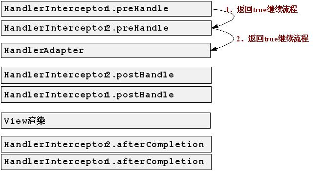

# 跟我学 Spring MVC

> 作者：开涛
> 
> 来源：[跟开涛学 SpringMVC](http://www.iteye.com/blogs/subjects/kaitao-springmvc)

# SpringMVC + spring3.1.1 + hibernate4.1.0 集成及常见问题总结

## 下载地址

## 一 开发环境

1、动态 web 工程

2、部分依赖

```java
hibernate-release-4.1.0.Final.zip
hibernate-validator-4.2.0.Final.jar
spring-framework-3.1.1.RELEASE-with-docs.zip
proxool-0.9.1.jar
log4j 1.2.16
slf4j -1.6.1
mysql-connector-java-5.1.10.jar
hamcrest 1.3.0RC2
ehcache 2.4.3 
```

3、为了方便学习，暂没有使用 maven 构建工程

## 二 工程主要包括内容

1、springMVC + spring3.1.1 + hibernate4.1.0 集成

2、通用 DAO 层 和 Service 层

3、二级缓存 Ehcache

4、REST 风格的表现层

5、通用分页（两个版本）

５.1、首页 上一页,下一页 尾页 跳转

５.2、上一页 1 2 3 4 5 下一页

6、数据库连接池采用 proxool

7、spring 集成测试

8、表现层的 java validator 框架验证（采用 hibernate-validator-4.2.0 实现）

9、视图采用 JSP，并进行组件化分离

## 三 TODO LIST 将本项目做成脚手架方便以后新项目查询

1、Service 层进行 AOP 缓存（缓存使用 Memcached 实现）

2、单元测试（把常见的桩测试、伪实现、模拟对象演示一遍 区别集成测试）

3、监控功能

后台查询 hibernate 二级缓存 hit/miss 率功能

后台查询当前服务器状态功能（如 线程信息、服务器相关信息）

4、spring RPC 功能

5、spring 集成 quartz 进行任务调度

6、spring 集成 java mail 进行邮件发送

7、DAO 层将各种常用框架集成进来（方便查询）

8、把工作中经常用的东西 融合进去，作为脚手架，方便以后查询

## 四 集成重点及常见问题

**1、spring-config.xml 配置文件：**

1.1、该配置文件只加载除表现层之外的所有 bean，因此需要如下配置：

```java
 <context:component-scan base-package="cn.javass">
        <context:exclude-filter type="annotation" expression="org.springframework.stereotype.Controller"/>
    </context:component-scan> 
```

通过 exclude-filter 把所有 @Controller 注解的表现层控制器组件排除

1.2、国际化消息文件配置

```java
<!-- 国际化的消息资源文件 -->
    <bean id="messageSource" class="org.springframework.context.support.ReloadableResourceBundleMessageSource">
        <property name="basenames">
            <list>
                <!-- 在 web 环境中一定要定位到 classpath 否则默认到当前 web 应用下找  -->
                <value>classpath:messages</value>
            </list>
        </property>
        <property name="defaultEncoding" value="UTF-8"/>
        <property name="cacheSeconds" value="60"/>
    </bean> 
```

此处 basenames 内一定是 classpath:messages ，如果你写出“messages”，将会到你的 web 应用的根下找 即你的 messages.properties 一定在 web 应用/messages.propertis。

1.3、hibernate 的 sessionFactory 配置 需要使用 org.springframework.orm.hibernate4.LocalSessionFactoryBean，其他都是类似的，具体看源代码。

1．4、<aop:aspectj-autoproxy expose-proxy="true"/> 实现@AspectJ 注解的，默认使用 AnnotationAwareAspectJAutoProxyCreator 进行 AOP 代理，它是 BeanPostProcessor 的子类，在容器启动时 Bean 初始化开始和结束时调用进行 AOP 代理的创建，因此只对当容器启动时有效，使用时注意此处。

1.5、声明式容器管理事务

建议使用声明式容器管理事务，而不建议使用注解容器管理事务（虽然简单），但太分布式了，采用声明式容器管理事务一般只对 service 层进行处理。

```java
 <tx:advice id="txAdvice" transaction-manager="txManager">
        <tx:attributes>
            <tx:method name="save*" propagation="REQUIRED" />
            <tx:method name="add*" propagation="REQUIRED" />
            <tx:method name="create*" propagation="REQUIRED" />
            <tx:method name="insert*" propagation="REQUIRED" />
            <tx:method name="update*" propagation="REQUIRED" />
            <tx:method name="merge*" propagation="REQUIRED" />
            <tx:method name="del*" propagation="REQUIRED" />
            <tx:method name="remove*" propagation="REQUIRED" />
            <tx:method name="put*" propagation="REQUIRED" />
            <tx:method name="use*" propagation="REQUIRED"/>
            <!--hibernate4 必须配置为开启事务 否则 getCurrentSession()获取不到-->
            <tx:method name="get*" propagation="REQUIRED" read-only="true" />
            <tx:method name="count*" propagation="REQUIRED" read-only="true" />
            <tx:method name="find*" propagation="REQUIRED" read-only="true" />
            <tx:method name="list*" propagation="REQUIRED" read-only="true" />
            <tx:method name="*" read-only="true" />
        </tx:attributes>
    </tx:advice>
    <aop:config expose-proxy="true">
        <!-- 只对业务逻辑层实施事务 -->
        <aop:pointcut id="txPointcut" expression="execution(* cn.javass..service..*.*(..))" />
        <aop:advisor advice-ref="txAdvice" pointcut-ref="txPointcut"/>
    </aop:config> 
```

此处一定注意 使用 hibernate4，在不使用 OpenSessionInView 模式时，在使用 getCurrentSession()时会有如下问题：

当有一个方法 list 传播行为为 Supports，当在另一个方法 getPage()（无事务）调用 list 方法时会抛出 org.hibernate.HibernateException: No Session found for current thread 异常。

这是因为 getCurrentSession()在没有 session 的情况下不会自动创建一个，不知道这是不是 Spring3.1 实现的 bug，欢迎大家讨论下。

因此最好的解决方案是使用 REQUIRED 的传播行为。

**二、spring-servlet.xml：**

2.1、表现层配置文件，只应加装表现层 Bean，否则可能引起问题。

```java
 <!-- 开启 controller 注解支持 -->
    <!-- 注：如果 base-package=cn.javass 则注解事务不起作用-->
    <context:component-scan base-package="cn.javass.demo.web.controller">
        <context:include-filter type="annotation" expression="org.springframework.stereotype.Controller"/>
    </context:component-scan> 
```

此处只应该加载表现层组件，如果此处还加载 dao 层或 service 层的 bean 会将之前容器加载的替换掉，而且此处不会进行 AOP 织入，所以会造成 AOP 失效问题（如事务不起作用），再回头看我们的 1.4 讨论的。

2.2、<mvc:view-controller path=*"/"* view-name=*"forward:/index"*/> 表示当访问主页时自动转发到 index 控制器。

2.3、静态资源映射

```java
 <!-- 当在 web.xml 中   DispatcherServlet 使用     <url-pattern>/</url-pattern> 映射时，能映射静态资源 -->
    <mvc:default-servlet-handler/>
    <!-- 静态资源映射 -->
    <mvc:resources mapping="/images/**" location="/WEB-INF/images/" />
    <mvc:resources mapping="/css/**" location="/WEB-INF/css/" />
    <mvc:resources mapping="/js/**" location="/WEB-INF/js/" /> 
```

以上是配置文件部分，接下来来看具体代码。

**三、通用 DAO 层 Hibernate4 实现**

为了减少各模块实现的代码量，实际工作时都会有通用 DAO 层实现，以下是部分核心代码：

```java
public abstract class BaseHibernateDao<M extends java.io.Serializable, PK extends java.io.Serializable> implements IBaseDao<M, PK> {

    protected static final Logger LOGGER = LoggerFactory.getLogger(BaseHibernateDao.class);

    private final Class<M> entityClass;
    private final String HQL_LIST_ALL;
    private final String HQL_COUNT_ALL;
    private final String HQL_OPTIMIZE_PRE_LIST_ALL;
    private final String HQL_OPTIMIZE_NEXT_LIST_ALL;
    private String pkName = null;

    @SuppressWarnings("unchecked")
    public BaseHibernateDao() {
        this.entityClass = (Class<M>) ((ParameterizedType) getClass().getGenericSuperclass()).getActualTypeArguments()[0];
        Field[] fields = this.entityClass.getDeclaredFields();
        for(Field f : fields) {
            if(f.isAnnotationPresent(Id.class)) {
                this.pkName = f.getName();
            }
        }

        Assert.notNull(pkName);
        //TODO @Entity name not null
        HQL_LIST_ALL = "from " + this.entityClass.getSimpleName() + " order by " + pkName + " desc";
        HQL_OPTIMIZE_PRE_LIST_ALL = "from " + this.entityClass.getSimpleName() + " where " + pkName + " > ? order by " + pkName + " asc";
        HQL_OPTIMIZE_NEXT_LIST_ALL = "from " + this.entityClass.getSimpleName() + " where " + pkName + " < ? order by " + pkName + " desc";
        HQL_COUNT_ALL = " select count(*) from " + this.entityClass.getSimpleName();
    }

    @Autowired
    @Qualifier("sessionFactory")
    private SessionFactory sessionFactory;

    public Session getSession() {
        //事务必须是开启的，否则获取不到
        return sessionFactory.getCurrentSession();
    }
……
} 
```

Spring3.1 集成 Hibernate4 不再需要 HibernateDaoSupport 和 HibernateTemplate 了，直接使用原生 API 即可。

**四、通用 Service 层代码此处省略，看源代码，有了通用代码后 CURD 就不用再写了。**

```java
@Service("UserService")
public class UserServiceImpl extends BaseService<UserModel, Integer> implements UserService {

    private static final Logger LOGGER = LoggerFactory.getLogger(UserServiceImpl.class);

    private UserDao userDao;

    @Autowired
    @Qualifier("UserDao")
    @Override
    public void setBaseDao(IBaseDao<UserModel, Integer> userDao) {
        this.baseDao = userDao;
        this.userDao = (UserDao) userDao;
    }

    @Override
    public Page<UserModel> query(int pn, int pageSize, UserQueryModel command) {
        return PageUtil.getPage(userDao.countQuery(command) ,pn, userDao.query(pn, pageSize, command), pageSize);
    }
} 
```

**五、表现层 Controller 实现**

采用 SpringMVC 支持的 REST 风格实现，具体看代码，此处我们使用了 java Validator 框架 来进行 表现层数据验证

在 Model 实现上加验证注解

```java
 @Pattern(regexp = "[A-Za-z0-9]{5,20}", message = "{username.illegal}") //java validator 验证（用户名字母数字组成，长度为 5-10）
    private String username;

    @NotEmpty(message = "{email.illegal}")
    @Email(message = "{email.illegal}") //错误消息会自动到 MessageSource 中查找
    private String email;

    @Pattern(regexp = "[A-Za-z0-9]{5,20}", message = "{password.illegal}")
    private String password;

    @DateFormat( message="{register.date.error}")//自定义的验证器
    private Date registerDate; 
```

在 Controller 中相应方法的需要验证的参数上加@Valid 即可

```java
 @RequestMapping(value = "/user/add", method = {RequestMethod.POST})
    public String add(Model model, @ModelAttribute("command") @Valid UserModel command, BindingResult result) 
```

**六、Spring 集成测试**

使用 Spring 集成测试能很方便的进行 Bean 的测试，而且使用@TransactionConfiguration(transactionManager = "txManager", defaultRollback = true)能自动回滚事务，清理测试前后状态。

```java
@RunWith(SpringJUnit4ClassRunner.class)
@ContextConfiguration(locations = {"classpath:spring-config.xml"})
@Transactional
@TransactionConfiguration(transactionManager = "txManager", defaultRollback = true)
public class UserServiceTest {

    AtomicInteger counter = new AtomicInteger();

    @Autowired
    private UserService userService;
    ……  
} 
```

其他部分请直接看源码，欢迎大家讨论。

原创内容，转载请注明私塾在线【[`sishuok.com/forum/blogPost/list/2625.html`](http://sishuok.com/forum/blogPost/list/2625.html#7523)】

# Spring Web MVC 中的页面缓存支持 ——跟我学 SpringMVC 系列

**注：本章讲的是 Spring2 的@Deprecated，但还是有必要提一下。跟我学 SpringMVC 系列。。**

## 4.2、Controller 接口

```java
package org.springframework.web.servlet.mvc;
public interface Controller {
       ModelAndView handleRequest(HttpServletRequest request, HttpServletResponse response) throws Exception;
} 
```

这是控制器接口，此处只有一个方法 handleRequest，用于进行请求的功能处理，处理完请求后返回 ModelAndView（Model 模型数据部分 和 View 视图部分）。

还记得第二章的 HelloWorld 吗？我们的 HelloWorldController 实现接口，Spring 默认提供了一些 Controller 接口的实现以方便我们使用，具体继承体系如图 4-1：


## 、WebContentGenerator

用于提供如浏览器缓存控制、是否必须有 session 开启、支持的请求方法类型（GET、POST 等）等，该类主要有如下属性：

**Set<String> supportedMethods：**设置支持的请求方法类型，默认支持“GET”、“POST”、“HEAD”，如果我们想支持“PUT”，则可以加入该集合“PUT”。

**boolean requireSession = false：**是否当前请求必须有 session，如果此属性为 true，但当前请求没有打开 session 将抛出 HttpSessionRequiredException 异常；

**boolean useExpiresHeader = true：**是否使用 HTTP1.0 协议过期响应头：如果 true 则会在响应头添加：“Expires：”；需要配合 cacheSeconds 使用；

**boolean useCacheControlHeader = true：**是否使用 HTTP1.1 协议的缓存控制响应头，如果 true 则会在响应头添加；需要配合 cacheSeconds 使用；

**boolean useCacheControlNoStore = true：**是否使用 HTTP 1.1 协议的缓存控制响应头，如果 true 则会在响应头添加；需要配合 cacheSeconds 使用；

**private int cacheSeconds = -1：**缓存过期时间，正数表示需要缓存，负数表示不做任何事情（也就是说保留上次的缓存设置），

1、cacheSeconds **=**0 时，则将设置如下响应头数据：

Pragma：no-cache // HTTP 1.0 的不缓存响应头

Expires：1L // useExpiresHeader=true 时，HTTP 1.0

Cache-Control**：no-cache** // useCacheControlHeader=true 时，HTTP 1.1

Cache-Control**：no-store** // useCacheControlNoStore=true 时，该设置是防止 Firefox 缓存

2、cacheSeconds>0 时，则将设置如下响应头数据：

Expires：System.currentTimeMillis() + **cacheSeconds** * 1000L // useExpiresHeader=true 时，HTTP 1.0

Cache-Control**：max-age=cacheSeconds** // useCacheControlHeader=true 时，HTTP 1.1

3、cacheSeconds<0 时，则什么都不设置，即保留上次的缓存设置。

此处简单说一下以上响应头的作用，缓存控制已超出本书内容：

**HTTP1.0 缓存控制响应头**

Pragma：no-cache：表示防止客户端缓存，需要强制从服务器获取最新的数据；

Expires：HTTP1.0 响应头，本地副本缓存过期时间，如果客户端发现缓存文件没有过期则不发送请求，HTTP 的日期时间必须是格林威治时间（GMT），如“Expires:Wed, 14 Mar 2012 09:38:32 GMT”；

**HTTP1.1 缓存控制响应头**

Cache-Control**：**no-cache 强制客户端每次请求获取服务器的最新版本，不经过本地缓存的副本验证；

Cache-Control**：**no-store 强制客户端不保存请求的副本，该设置是防止 Firefox 缓存

Cache-Control：max-age=[秒] 客户端副本缓存的最长时间，类似于 HTTP1.0 的 Expires，只是此处是基于请求的相对时间间隔来计算，而非绝对时间。

还有相关缓存控制机制如 Last-Modified（最后修改时间验证，客户端的上一次请求时间 在 服务器的最后修改时间 之后，说明服务器数据没有发生变化 返回 304 状态码）、ETag（没有变化时不重新下载数据，返回 304）。

该抽象类默认被 AbstractController 和 WebContentInterceptor 继承。

## 4.4、AbstractController

该抽象类实现了 Controller，并继承了 WebContentGenerator（具有该类的特性，具体请看 4.3），该类有如下属性：

**boolean synchronizeOnSession = false：**表示该控制器是否在执行时同步 session，从而保证该会话的用户串行访问该控制器。

```java
public ModelAndView handleRequest(HttpServletRequest request, HttpServletResponse response) throws Exception {
        //委托给 WebContentGenerator 进行缓存控制
        checkAndPrepare(request, response, this instanceof LastModified);
        //当前会话是否应串行化访问.
        if (this.synchronizeOnSession) {
            HttpSession session = request.getSession(false);
            if (session != null) {
                Object mutex = WebUtils.getSessionMutex(session);
                synchronized (mutex) {
                    return handleRequestInternal(request, response);
                }
            }
        }
        return handleRequestInternal(request, response);
} 
```

可以看出 AbstractController 实现了一些特殊功能，如继承了 WebContentGenerator 缓存控制功能，并提供了可选的会话的串行化访问功能。而且提供了 handleRequestInternal 方法，因此我们应该在具体的控制器类中实现 handleRequestInternal 方法，而不再是 handleRequest。

**AbstractController 使用方法：**

首先让我们使用 AbstractController 来重写第二章的 HelloWorldController：

```java
public class HelloWorldController extends AbstractController {
    @Override
    protected ModelAndView handleRequestInternal(HttpServletRequest req, HttpServletResponse resp) throws Exception {
        //1、收集参数
        //2、绑定参数到命令对象
        //3、调用业务对象
        //4、选择下一个页面
        ModelAndView mv = new ModelAndView();
        //添加模型数据 可以是任意的 POJO 对象
        mv.addObject("message", "Hello World!");
        //设置逻辑视图名，视图解析器会根据该名字解析到具体的视图页面
        mv.setViewName("hello");
        return mv;
    }
} 
```

可以看出 AbstractController 实现了一些特殊功能，如继承了 WebContentGenerator 缓存控制功能，并提供了可选的会话的串行化访问功能。而且提供了 handleRequestInternal 方法，因此我们应该在具体的控制器类中实现 handleRequestInternal 方法，而不再是 handleRequest。

**AbstractController 使用方法：**

首先让我们使用 AbstractController 来重写第二章的 HelloWorldController：

```java
public class HelloWorldController extends AbstractController {
    @Override
    protected ModelAndView handleRequestInternal(HttpServletRequest req, HttpServletResponse resp) throws Exception {
        //1、收集参数
        //2、绑定参数到命令对象
        //3、调用业务对象
        //4、选择下一个页面
        ModelAndView mv = new ModelAndView();
        //添加模型数据 可以是任意的 POJO 对象
        mv.addObject("message", "Hello World!");
        //设置逻辑视图名，视图解析器会根据该名字解析到具体的视图页面
        mv.setViewName("hello");
        return mv;
    }
} 
```

```java
<!— 在 chapter3-servlet.xml 配置处理器 -->
<bean name="/hello" class="cn.javass.chapter3.web.controller.HelloWorldController"/> 
```

从如上代码我们可以看出：

1、继承 AbstractController

2、实现 handleRequestInternal 方法即可。

**直接通过 response 写响应**

如果我们想直接在控制器通过 response 写出响应呢，以下代码帮我们阐述：

```java
public class HelloWorldWithoutReturnModelAndViewController extends AbstractController {
    @Override
    protected ModelAndView handleRequestInternal(HttpServletRequest req, HttpServletResponse resp) throws Exception {

        resp.getWriter().write("Hello World!!");        
        //如果想直接在该处理器/控制器写响应 可以通过返回 null 告诉 DispatcherServlet 自己已经写出响应了，不需要它进行视图解析
        return null;
    }
} 
```

<!— 在 chapter3-servlet.xml 配置处理器 -->

```java
<bean name="/helloWithoutReturnModelAndView" class="cn.javass.chapter3.web.controller.HelloWorldWithoutReturnModelAndViewController"/> 
```

从如上代码可以看出如果想直接在控制器写出响应，只需要通过 response 写出，并返回 null 即可。

**强制请求方法类型：**

```java
<!— 在 chapter3-servlet.xml 配置处理器 -->
<bean name="/helloWithPOST" class="cn.javass.chapter3.web.controller.HelloWorldController">
        <property name="supportedMethods" value="POST"></property>
</bean> 
```

以上配置表示只支持 POST 请求，如果是 GET 请求客户端将收到“HTTP Status 405 - Request method 'GET' not supported”。

比如注册/登录可能只允许 POST 请求。

**当前请求的 session 前置条件检查，如果当前请求无 session 将抛出 HttpSessionRequiredException 异常：**

```java
<!— 在 chapter3-servlet.xml 配置处理器 -->
<bean name="/helloRequireSession" 
class="cn.javass.chapter3.web.controller.HelloWorldController">    
        <property name="requireSession" value="true"/>
</bean> 
```

```java
在进入该控制器时，一定要有 session 存在，否则抛出 HttpSessionRequiredException 异常。 
```

**Session 同步：**

即同一会话只能串行访问该控制器。

**缓存控制：**

**1、 缓存 5 秒，cacheSeconds=5**

```java
package cn.javass.chapter3.web.controller;
//省略 import
public class HelloWorldCacheController extends AbstractController {
    @Override
    protected ModelAndView handleRequestInternal(HttpServletRequest req, HttpServletResponse resp) throws Exception {

        //点击后再次请求当前页面
        resp.getWriter().write("<a href=''>this</a>");
        return null;
    }
} 
```

<!— 在 chapter3-servlet.xml 配置处理器 -->

```java
<bean name="/helloCache" 
class="cn.javass.chapter3.web.controller.HelloWorldCacheController">
<property name="cacheSeconds" value="5"/>
</bean> 
```

**如上配置表示告诉浏览器缓存 5 秒钟：**

开启 chrome 浏览器调试工具：


服务器返回的响应头如下所示：


添加了“Expires:Wed, 14 Mar 2012 09:38:32 GMT” 和“Cache-Control:max-age=5” 表示允许客户端缓存 5 秒，当你点“this”链接时，会发现如下：


而且服务器也没有收到请求，当过了 5 秒后，你再点“this”链接会发现又重新请求服务器下载新数据。

**注：下面提到一些关于缓存控制的一些特殊情况：**

1、对于一般的页面跳转（如超链接点击跳转、通过 js 调用 window.open 打开新页面都是会使用浏览器缓存的，在未过期情况下会直接使用浏览器缓存的副本，在未过期情况下一次请求也不发送）；

2、对于刷新页面（如按 F5 键刷新），会再次发送一次请求到服务器的；

**2、不缓存，cacheSeconds=0**

<!— 在 chapter3-servlet.xml 配置处理器 -->

```java
<bean name="/helloNoCache"
class="cn.javass.chapter3.web.controller.HelloWorldCacheController">
<property name="cacheSeconds" value="0"/>
</bean> 
```

以上配置会要求浏览器每次都去请求服务器下载最新的数据：


**3、cacheSeconds<0，将不添加任何数据**

响应头什么缓存控制信息也不加。

**4、Last-Modified 缓存机制**

（1、在客户端第一次输入 url 时，服务器端会返回内容和状态码 200 表示请求成功并返回了内容；同时会添加一个“Last-Modified”的响应头表示此文件在服务器上的最后更新时间，如“Last-Modified:Wed, 14 Mar 2012 10:22:42 GMT”表示最后更新时间为（2012-03-14 10：22）；

（2、客户端第二次请求此 URL 时，客户端会向服务器发送请求头 “If-Modified-Since”，询问服务器该时间之后当前请求内容是否有被修改过，如“If-Modified-Since: Wed, 14 Mar 2012 10:22:42 GMT”，如果服务器端的内容没有变化，则自动返回 HTTP 304 状态码（只要响应头，内容为空，这样就节省了网络带宽）。

**客户端强制缓存过期：**

（1、可以按 ctrl+F5 强制刷新（会添加请求头 HTTP1.0 Pragma:no-cache 和 HTTP1.1 Cache-Control:no-cache 、If-Modified-Since 请求头被删除）表示强制获取服务器内容，不缓存。

（2、在请求的 url 后边加上时间戳来重新获取内容，加上时间戳后浏览器就认为不是同一份内容：

[`sishuok.com/`](http://sishuok.com/)?2343243243 和 [`sishuok.com/?3433434`](http://sishuok.com/?34334343)4 是两次不同的请求。

**Spring 也提供了 Last-Modified 机制的支持，只需要实现 LastModified 接口，如下所示：**

package cn.javass.chapter3.web.controller;

```java
public class HelloWorldLastModifiedCacheController extends AbstractController implements LastModified {
    private long lastModified;
    protected ModelAndView handleRequestInternal(HttpServletRequest req, HttpServletResponse resp) throws Exception {
        //点击后再次请求当前页面
        resp.getWriter().write("<a href=''>this</a>");
        return null;
    }
    public long getLastModified(HttpServletRequest request) {
        if(lastModified == 0L) {
            //TODO 此处更新的条件：如果内容有更新，应该重新返回内容最新修改的时间戳
            lastModified = System.currentTimeMillis();
        }
        return lastModified;
    }    
} 
```

<!— 在 chapter3-servlet.xml 配置处理器 -->

```java
<bean name="/helloLastModified" 
class="cn.javass.chapter3.web.controller.HelloWorldLastModifiedCacheController"/> 
```

HelloWorldLastModifiedCacheController 只需要实现 LastModified 接口的 getLastModified 方法，保证当内容发生改变时返回最新的修改时间即可。

**分析：**

（1、发送请求到服务器，如（[`localhost:9080/springmvc-chapter3/helloLastModified`](http://localhost:9080/springmvc-chapter3/helloLastModified)），则服务器返回的响应为：


（2、再次按 F5 刷新客户端，返回状态码 304 表示服务器没有更新过：


（3、重启服务器，再次刷新，会看到 200 状态码（因为服务器的 lastModified 时间变了）。

**Spring 判断是否过期，通过如下代码，即请求的“If-Modified-Since” 大于等于当前的 getLastModified 方法的时间戳，则认为没有修改：**

**this.notModified = (ifModifiedSince >= (lastModifiedTimestamp / 1000 * 1000));**

**5、ETag（实体标记）缓存机制**

（1：浏览器第一次请求，服务器在响应时给请求 URL 标记，并在 HTTP 响应头中将其传送到客户端，类似服务器端返回的格式：“ETag:"0f8b0c86fe2c0c7a67791e53d660208e3"”

（2：浏览器第二次请求，客户端的查询更新格式是这样的：“If-None-Match:"0f8b0c86fe2c0c7a67791e53d660208e3"”，如果 ETag 没改变，表示内容没有发生改变，则返回状态 304。

**Spring 也提供了对 ETag 的支持，具体需要在 web.xml 中配置如下代码：**

```java
<filter>
   <filter-name>etagFilter</filter-name>
   <filter-class>org.springframework.web.filter.ShallowEtagHeaderFilter</filter-class>
</filter>
<filter-mapping>
   <filter-name>etagFilter</filter-name>
   <servlet-name>chapter3</servlet-name>
</filter-mapping> 
```

此过滤器只过滤到我们 DispatcherServlet 的请求。

**分析：**

1）：发送请求到服务器：“[`localhost:9080/springmvc-chapter3/hello`](http://localhost:9080/springmvc-chapter3/hello)”，服务器返回的响应头中添加了（ETag:"0f8b0c86fe2c0c7a67791e53d660208e3"）：


2）：浏览器再次发送请求到服务器（按 F5 刷新），请求头中添加了“If-None-Match:

"0f8b0c86fe2c0c7a67791e53d660208e3"”，响应返回 304 代码，表示服务器没有修改，并且响应头再次添加了“ETag:"0f8b0c86fe2c0c7a67791e53d660208e3"”（每次都需要计算）：


**那服务器端是如何计算 ETag 的呢？**

```java
protected String generateETagHeaderValue(byte[] bytes) {
        StringBuilder builder = new StringBuilder("\"0");
        DigestUtils.appendMd5DigestAsHex(bytes, builder);
        builder.append('"');
        return builder.toString();
} 
```

bytes 是 response 要写回到客户端的响应体（即响应的内容数据），是通过 MD5 算法计算的内容的摘要信息。也就是说如果服务器内容不发生改变，则 ETag 每次都是一样的，即服务器端的内容没有发生改变。

**此处只列举了部分缓存控制，详细介绍超出了本书的范围，强烈推荐：[`www.mnot.net/cache_docs/`](http://www.mnot.net/cache_docs/)（中文版[`www.chedong.com/tech/cache_docs.html`](http://www.chedong.com/tech/cache_docs.html)） 详细了解 HTTP 缓存控制及为什么要缓存。**

**缓存的目的是减少相应延迟 和 减少网络带宽消耗，比如 css、js、图片这类静态资源应该进行缓存。**

**实际项目一般使用反向代理服务器（如 nginx、apache 等）进行缓存。**

# Spring3 Web MVC 下的数据类型转换（第一篇）——《跟我学 Spring3 Web MVC》抢先看

基于 spring-framework-3.1.1.RELEASE

### 7.1、简介

在编写可视化界面项目时，我们通常需要对数据进行类型转换、验证及格式化。

**一、在 Spring3 之前，我们使用如下架构进行类型转换、验证及格式化：**


**流程：**

①：类型转换：首先调用 PropertyEditor 的 setAsText（String），内部根据需要调用 setValue(Object)方法进行设置转换后的值；

②：数据验证：需要显示调用 Spring 的 Validator 接口实现进行数据验证；

③：格式化显示：需要调用 PropertyEditor 的 getText 进行格式化显示。

**使用如上架构的缺点是：**

（1、PropertyEditor 被设计为只能 String<——>Object 之间转换，不能任意对象类型<——>任意类型，如我们常见的 Long 时间戳到 Date 类型的转换是办不到的；

（2、PropertyEditor 是线程不安全的，也就是有状态的，因此每次使用时都需要创建一个，不可重用；

（3、PropertyEditor 不是强类型的，setValue（Object）可以接受任意类型，因此需要我们自己判断类型是否兼容；

（4、需要自己编程实现验证，Spring3 支持更棒的注解验证支持；

（5、在使用 SpEL 表达式语言或 DataBinder 时，只能进行 String<--->Object 之间的类型转换；

`（6`、`不支持细粒度的类型转换/格式化，如 UserModel 的 registerDate 需要转换/格式化类似“``2012-05-01``”的数据，而 OrderModel 的 orderDate 需要转换/格式化类似“2012-05-01 15：11：13”的数据，因为大家都为 java.util.Date 类型，因此不太容易进行细粒度转换/格式化。`

`**在 Spring Web MVC 环境中，数据类型转换、验证及格式化通常是这样使用的：**`


**流程：**

`①、类型转换：首先表单数据（全部是字符串）通过 WebDataBinder 进行绑定到命令对象，内部通过 PropertyEditor 实现；`

②：数据验证：在控制器中的功能处理方法中，需要显示的调用 Spring 的 Validator 实现并将错误信息添加到 BindingResult 对象中；

③：格式化显示：在表单页面可以通过如下方式展示通过`PropertyEditor`格式化的数据和错误信息：

```java
<%@taglib prefix="spring" uri="http://www.springframework.org/tags" %>
<%@taglib prefix="form" uri="http://www.springframework.org/tags/form" %> 
```

首先需要通过如上 taglib 指令引入 spring 的两个标签库。

```java
//1、格式化单个命令/表单对象的值（好像比较麻烦，真心没有好办法）
<spring:bind path="dataBinderTest.phoneNumber">${status.value}</spring:bind> 
```

```java
//2、<spring:eval>标签，自动调用 ConversionService 并选择相应的 Converter SPI 进行格式化展示
<spring:eval expression="dataBinderTest.phoneNumber"></spring:eval> 
```

如上代码能工作的前提是在 RequestMappingHandlerMapping 配置了 ConversionServiceExposingInterceptor，它的作用是暴露 conversionService 到请求中以便如<spring:eval>标签使用。

```java
//3、通过 form 标签，内部的表单标签会自动调用命令/表单对象属性对应的 PropertyEditor 进行格式化显示
<form:form commandName="dataBinderTest">
    <form:input path="phoneNumber"/><!-- 如果出错会显示错误之前的数据而不是空 -->
</form:form> 
```

```java
//4、显示验证失败后的错误信息
<form:errors></form:errors> 
```

接下来我们就详细学习一下这些知识吧。

## 7.2、数据类型转换

### 7.2.1、Spring3 之前的 PropertyEditor

PropertyEditor 介绍请参考【4.16.1、数据类型转换】。

**一、测试之前我们需要准备好测试环境：**

（1、模型对象，和【4.16.1、数据类型转换】使用的一样，需要将 DataBinderTestModel 模型类及相关类拷贝过来放入 cn.javass.chapter7.model 包中。

（2、控制器定义：

```java
package cn.javass.chapter7.web.controller;
//省略 import
@Controller
public class DataBinderTestController {
    @RequestMapping(value = "/dataBind")
    public String test(DataBinderTestModel command) {
            //输出 command 对象看看是否绑定正确
        System.out.println(command);
        model.addAttribute("dataBinderTest", command);
        return "bind/success";
    }
} 
```

(3、Spring 配置文件定义，请参考 chapter7-servlet.xml，并注册 DataBinderTestController：

```java
<bean class="cn.javass.chapter7.web.controller.DataBinderTestController"/> 
```

（4、测试的 URL：

[http://localhost:9080/springmvc-chapter7/dataBind?username=zhang&bool=yes&schooInfo.specialty=computer&hobbyList[0]=program&hobbyList[1]=music&map[key1]=value1&map[key2]=value2&phoneNumber=010-12345678&date=2012-3-18](http://localhost:9080/springmvc-chapter7/dataBind?username=zhang&bool=yes&schooInfo.specialty=computer&hobbyList[0]=program&hobbyList[1]=music&map[key1]=value1&map[key2]=value2&phoneNumber=010-12345678&date=2012-3-18) 16:48:48&state=blocked

**二、注解式控制器注册 PropertyEditor：**

**1、使用 WebDataBinder 进行控制器级别注册 PropertyEditor（控制器独享）**

```java
@InitBinder
//此处的参数也可以是 ServletRequestDataBinder 类型
public void initBinder(WebDataBinder binder) throws Exception {
    //注册自定义的属性编辑器
    //1、日期
    DateFormat df = new SimpleDateFormat("yyyy-MM-dd HH:mm:ss");
    CustomDateEditor dateEditor = new CustomDateEditor(df, true);
    //表示如果命令对象有 Date 类型的属性，将使用该属性编辑器进行类型转换
    binder.registerCustomEditor(Date.class, dateEditor);    
    //自定义的电话号码编辑器(和【4.16.1、数据类型转换】一样)
    binder.registerCustomEditor(PhoneNumberModel.class, new PhoneNumberEditor());
} 
```

和【4.16.1、数据类型转换】一节类似，只是此处需要通过@InitBinder 来注册自定义的 PropertyEditor。

**2、使用**`**WebBindingInitializer 批量注册**`**PropertyEditor**

和【4.16.1、数据类型转换】不太一样，因为我们的注解式控制器是 POJO，没有实现任何东西，因此无法注入 WebBindingInitializer，此时我们需要把 WebBindingInitializer 注入到我们的 RequestMappingHandlerAdapter 或 AnnotationMethodHandlerAdapter，这样对于所有的注解式控制器都是共享的。

```java
<bean class="org.springframework.web.servlet.mvc.method.annotation.RequestMappingHandlerAdapter">
    <property name="webBindingInitializer">
        <bean class="cn.javass.chapter7.web.controller.support.initializer.MyWebBindingInitializer"/>
    </property>
</bean> 
```

此时我们注释掉控制器级别通过@InitBinder 注册 PropertyEditor 的方法。

**3、全局级别注册 PropertyEditor（全局共享）**

和【4.16.1、数据类型转换】一节一样，此处不再重复。请参考【4.16.1、数据类型转换】的【全局级别注册 PropertyEditor（全局共享）】。

`接下来我们看一下 Spring3 提供的更强大的类型转换支持。`

### 7.2.2、Spring3 开始的类型转换系统

Spring3 引入了更加通用的类型转换系统，其定义了 SPI 接口（Converter 等）和相应的运行时执行类型转换的 API（ConversionService 等），在 Spring 中它和 PropertyEditor 功能类似，可以替代 PropertyEditor 来转换外部 Bean 属性的值到 Bean 属性需要的类型。

该类型转换系统是 Spring 通用的，其定义在 org.springframework.core.convert 包中，不仅仅在 Spring Web MVC 场景下。目标是完全替换 PropertyEditor，提供无状态、强类型且可以在任意类型之间转换的类型转换系统，可以用于任何需要的地方，如 SpEL、数据绑定。

Converter SPI 完成通用的类型转换逻辑，如 java.util.Date<---->java.lang.Long 或 java.lang.String---->PhoneNumberModel 等。

#### 7.2.2.1、架构

**1、类型转换器：**提供类型转换的实现支持。


一个有如下三种接口：

**（1、Converter：**类型转换器，用于转换 S 类型到 T 类型，此接口的实现必须是线程安全的且可以被共享。

```java
package org.springframework.core.convert.converter;
public interface Converter<S, T> { //① S 是源类型 T 是目标类型
    T convert(S source); //② 转换 S 类型的 source 到 T 目标类型的转换方法
} 
```

示例：请参考 cn.javass.chapter7.converter.support.StringToPhoneNumberConverter 转换器，用于将 String--->PhoneNumberModel。

此处我们可以看到 Converter 接口实现只能转换一种类型到另一种类型，不能进行多类型转换，如将一个数组转换成集合，如（String[] ----> List<String>、String[]----->List<PhoneNumberModel>等）。

**（2、GenericConverter 和 ConditionalGenericConverter：**GenericConverter 接口实现能在多种类型之间进行转换，ConditionalGenericConverter 是有条件的在多种类型之间进行转换。

```java
package org.springframework.core.convert.converter;
public interface GenericConverter {
    Set<ConvertiblePair> getConvertibleTypes();
    Object convert(Object source, TypeDescriptor sourceType, TypeDescriptor targetType);
} 
```

getConvertibleTypes:指定了可以转换的目标类型对；

convert：在 sourceType 和 targetType 类型之间进行转换。

```java
package org.springframework.core.convert.converter;
public interface ConditionalGenericConverter extends GenericConverter {
    boolean matches(TypeDescriptor sourceType, TypeDescriptor targetType);
} 
```

matches：用于判断 sourceType 和 targetType 类型之间能否进行类型转换。

示例：如 org.springframework.core.convert.support.ArrayToCollectionConverter 和 CollectionToArrayConverter 用于在数组和集合间进行转换的 ConditionalGenericConverter 实现，如在 String[]<---->List<String>、String[]<---->List<PhoneNumberModel>等之间进行类型转换。

对于我们大部分用户来说一般不需要自定义 GenericConverter, 如果需要可以参考内置的 GenericConverter 来实现自己的。

**（3、ConverterFactory：**工厂模式的实现，用于选择将一种 S 源类型转换为 R 类型的子类型 T 的转换器的工厂接口。

```java
package org.springframework.core.convert.converter;
public interface ConverterFactory<S, R> {
    <T extends R> Converter<S, T> getConverter(Class<T> targetType);
} 
```

S：源类型；R 目标类型的父类型；T：目标类型，且是 R 类型的子类型；

getConverter：得到目标类型的对应的转换器。

示例：如 org.springframework.core.convert.support.NumberToNumberConverterFactory 用于在 Number 类型子类型之间进行转换，如 Integer--->Double， Byte---->Integer， Float--->Double 等。

对于我们大部分用户来说一般不需要自定义 ConverterFactory，如果需要可以参考内置的 ConverterFactory 来实现自己的。

**2、类型转换器注册器、类型转换服务：**提供类型转换器注册支持，运行时类型转换 API 支持。

 一共有如下两种接口：

**（1、ConverterRegistry：**类型转换器注册支持，可以注册/删除相应的类型转换器。

```java
package org.springframework.core.convert.converter;
public interface ConverterRegistry {
    void addConverter(Converter<?, ?> converter);
    void addConverter(Class<?> sourceType, Class<?> targetType, Converter<?, ?> converter);
    void addConverter(GenericConverter converter);
    void addConverterFactory(ConverterFactory<?, ?> converterFactory);
    void removeConvertible(Class<?> sourceType, Class<?> targetType);
} 
```

可以注册：Converter 实现，GenericConverter 实现，ConverterFactory 实现。

**（2、ConversionService：**运行时类型转换服务接口，提供运行期类型转换的支持。

```java
package org.springframework.core.convert;
public interface ConversionService {
    boolean canConvert(Class<?> sourceType, Class<?> targetType);
    boolean canConvert(TypeDescriptor sourceType, TypeDescriptor targetType);
    <T> T convert(Object source, Class<T> targetType);
    Object convert(Object source, TypeDescriptor sourceType, TypeDescriptor targetType);
} 
```

convert：将源对象转换为目标类型的目标对象。

Spring 提供了两个默认实现（其都实现了 ConverterRegistry**、**ConversionService 接口）:

DefaultConversionService:默认的类型转换服务实现；

DefaultFormattingConversionService：带数据格式化支持的类型转换服务实现，一般使用该服务实现即可。

#### 7.2.2.2、Spring 内建的类型转换器如下所示：

| **类名** | **说明** |
| --- | --- |
| **第一组：标量转换器** |
| StringToBooleanConverter | String----->Booleantrue:true/on/yes/1； false:false/off/no/0 |
| ObjectToStringConverter | Object----->String 调用 toString 方法转换 |
| StringToNumberConverterFactory | String----->Number（如 Integer、Long 等） |
| NumberToNumberConverterFactory | Number 子类型(Integer、Long、Double 等)<——> Number 子类型(Integer、Long、Double 等) |
| StringToCharacterConverter | String----->java.lang.Character 取字符串第一个字符 |
| NumberToCharacterConverter | Number 子类型(Integer、Long、Double 等)——> java.lang.Character |
| CharacterToNumberFactory | java.lang.Character ——>Number 子类型(Integer、Long、Double 等) |
| StringToEnumConverterFactory | String----->enum 类型通过 Enum.valueOf 将字符串转换为需要的 enum 类型 |
| EnumToStringConverter | enum 类型----->String 返回 enum 对象的 name()值 |
| StringToLocaleConverter | String----->java.util.Local |
| PropertiesToStringConverter | java.util.Properties----->String 默认通过 ISO-8859-1 解码 |
| StringToPropertiesConverter | String----->java.util.Properties 默认使用 ISO-8859-1 编码 |
| **第二组：集合、数组相关转换器** |
| ArrayToCollectionConverter | 任意 S 数组---->任意 T 集合（List、Set） |
| CollectionToArrayConverter | 任意 T 集合（List、Set）---->任意 S 数组 |
| ArrayToArrayConverter | 任意 S 数组<---->任意 T 数组 |
| CollectionToCollectionConverter | 任意 T 集合（List、Set）<---->任意 T 集合（List、Set）即集合之间的类型转换 |
| MapToMapConverter | Map<---->Map 之间的转换 |
| ArrayToStringConverter | 任意 S 数组---->String 类型 |
| StringToArrayConverter | String----->数组默认通过“,”分割，且去除字符串的两边空格(trim) |
| ArrayToObjectConverter | 任意 S 数组---->任意 Object 的转换(如果目标类型和源类型兼容，直接返回源对象；否则返回 S 数组的第一个元素并进行类型转换) |
| ObjectToArrayConverter | Object----->单元素数组 |
| CollectionToStringConverter | 任意 T 集合（List、Set）---->String 类型 |
| StringToCollectionConverter | String----->集合（List、Set）默认通过“,”分割，且去除字符串的两边空格(trim) |
| CollectionToObjectConverter | 任意 T 集合---->任意 Object 的转换(如果目标类型和源类型兼容，直接返回源对象；否则返回 S 数组的第一个元素并进行类型转换) |
| ObjectToCollectionConverter | Object----->单元素集合 |
| **第三组：默认（fallback）转换器：**之前的转换器不能转换时调用 |
| ObjectToObjectConverter | Object（S）----->Object（T）首先尝试 valueOf 进行转换、没有则尝试 new 构造器(S) |
| IdToEntityConverter | Id(S)----->Entity(T)查找并调用 public static T findEntityName 获取目标对象，EntityName 是 T 类型的简单类型 |
| FallbackObjectToStringConverter | Object----->StringConversionService 作为恢复使用，即其他转换器不能转换时调用（执行对象的 toString()方法） |

S：代表源类型，T：代表目标类型

如上的转换器在使用转换服务实现 DefaultConversionService 和 DefaultFormattingConversionService 时会自动注册。

#### 7.2.2.3、示例

（1、自定义 String----->PhoneNumberModel 的转换器

```java
package cn.javass.chapter7.web.controller.support.converter;
//省略 import
public class StringToPhoneNumberConverter implements Converter<String, PhoneNumberModel> {
    Pattern pattern = Pattern.compile("^(\\d{3,4})-(\\d{7,8})$");
    @Override
    public PhoneNumberModel convert(String source) {        
        if(!StringUtils.hasLength(source)) {
            //①如果 source 为空 返回 null
            return null;
        }
        Matcher matcher = pattern.matcher(source);
        if(matcher.matches()) {
            //②如果匹配 进行转换
            PhoneNumberModel phoneNumber = new PhoneNumberModel();
            phoneNumber.setAreaCode(matcher.group(1));
            phoneNumber.setPhoneNumber(matcher.group(2));
            return phoneNumber;
        } else {
            //③如果不匹配 转换失败
            throw new IllegalArgumentException(String.format("类型转换失败，需要格式[010-12345678]，但格式是[%s]", source));
        }
    }
} 
```

String 转换为 Date 的类型转换器，请参考 cn.javass.chapter7.web.controller.support.converter.StringToDateConverter。

(2、测试用例(cn.javass.chapter7.web.controller.support.converter.ConverterTest)

```java
@Test
public void testStringToPhoneNumberConvert() {
    DefaultConversionService conversionService = new DefaultConversionService();
    conversionService.addConverter(new StringToPhoneNumberConverter());

    String phoneNumberStr = "010-12345678";
    PhoneNumberModel phoneNumber = conversionService.convert(phoneNumberStr, PhoneNumberModel.class);

    Assert.assertEquals("010", phoneNumber.getAreaCode());
} 
```

类似于 PhoneNumberEditor 将字符串“010-12345678”转换为 PhoneNumberModel。

```java
@Test
public void testOtherConvert() {
    DefaultConversionService conversionService = new DefaultConversionService();

    //"1"--->true（字符串“1”可以转换为布尔值 true）
    Assert.assertEquals(Boolean.valueOf(true), conversionService.convert("1", Boolean.class));

    //"1,2,3,4"--->List（转换完毕的集合大小为 4）
    Assert.assertEquals(4, conversionService.convert("1,2,3,4", List.class).size());
} 
```

其他类型转换器使用也是类似的，此处不再重复。

#### 7.2.2.4、集成到 Spring Web MVC 环境

（1、注册 ConversionService 实现和自定义的类型转换器

```java
<!-- ①注册 ConversionService -->
<bean id="conversionService" class="org.springframework.format.support.
                                                       FormattingConversionServiceFactoryBean">
    <property name="converters">
       <list>
            <bean class="cn.javass.chapter7.web.controller.support.
                                   converter.StringToPhoneNumberConverter"/>
            <bean class="cn.javass.chapter7.web.controller.support.
                                   converter.StringToDateConverter">
                <constructor-arg value="yyyy-MM-dd"/>
            </bean>
        </list>
    </property>
</bean> 
```

FormattingConversionServiceFactoryBean：是 FactoryBean 实现，默认使用 DefaultFormattingConversionService 转换器服务实现；

converters：注册我们自定义的类型转换器，此处注册了 String--->PhoneNumberModel 和 String--->Date 的类型转换器。

（2、通过 ConfigurableWebBindingInitializer 注册 ConversionService

```java
<!-- ②使用 ConfigurableWebBindingInitializer 注册 conversionService -->
<bean id="webBindingInitializer" class="org.springframework.web.bind.support.
                                                                        ConfigurableWebBindingInitializer">
    <property name="conversionService" ref="conversionService"/>
</bean> 
```

此处我们通过 ConfigurableWebBindingInitializer 绑定初始化器进行 ConversionService 的注册；

3、注册 ConfigurableWebBindingInitializer 到 RequestMappingHandlerAdapter

```java
<bean class="org.springframework.web.servlet.mvc.method.annotation.
                                                            RequestMappingHandlerAdapter">
<property name="webBindingInitializer" ref="webBindingInitializer"/>
</bean> 
```

通过如上配置，我们就完成了 Spring3.0 的类型转换系统与 Spring Web MVC 的集成。此时可以启动服务器输入之前的 URL 测试了。

此时可能有人会问，如果我同时使用 PropertyEditor 和 ConversionService，执行顺序是什么呢？内部首先查找 PropertyEditor 进行类型转换，如果没有找到相应的 PropertyEditor 再通过 ConversionService 进行转换。

如上集成过程看起来比较麻烦，后边我们会介绍<mvc:annotation-driven>和@EnableWebMvc，ConversionService 会自动注册，后续章节再详细介绍。

# Spring3 Web MVC 下的数据格式化（第二篇）——《跟我学 Spring3 Web MVC》抢先看

基于 spring-framework-3.1.1.RELEASE

## 7.3、数据格式化

在如 Web /客户端项目中，通常需要将数据转换为具有某种格式的字符串进行展示，因此上节我们学习的数据类型转换系统核心作用不是完成这个需求，因此 Spring3 引入了格式化转换器（Formatter SPI） 和格式化服务 API（FormattingConversionService）从而支持这种需求。在 Spring 中它和 PropertyEditor 功能类似，可以替代 PropertyEditor 来进行对象的解析和格式化，而且支持细粒度的字段级别的格式化/解析。

Formatter SPI 核心是完成解析和格式化转换逻辑，在如 Web 应用/客户端项目中，需要解析、打印/展示本地化的对象值时使用，如根据 Locale 信息将 java.util.Date---->java.lang.String 打印/展示、java.lang.String---->java.util.Date 等。

该格式化转换系统是 Spring 通用的，其定义在 org.springframework.format 包中，不仅仅在 Spring Web MVC 场景下。

### 7.3.1、架构

**1、格式化转换器：**提供格式化转换的实现支持。


一共有如下两组四个接口：

**（1、Printer 接口：**格式化显示接口，将 T 类型的对象根据 Locale 信息以某种格式进行打印显示（即返回字符串形式）；

```java
package org.springframework.format;
public interface Printer<T> {
    String print(T object, Locale locale);
} 
```

**（2、Parser 接口：**解析接口，根据 Locale 信息解析字符串到 T 类型的对象；

```java
package org.springframework.format;
public interface Parser<T> {
    T parse(String text, Locale locale) throws ParseException;
} 
```

解析失败可以抛出 java.text.ParseException 或 IllegalArgumentException 异常即可。

**（3、Formatter 接口：**格式化 SPI 接口，继承 Printer 和 Parser 接口，完成 T 类型对象的格式化和解析功能；

```java
package org.springframework.format;
public interface Formatter<T> extends Printer<T>, Parser<T> {
} 
```

**（4、AnnotationFormatterFactory 接口：**注解驱动的字段格式化工厂，用于创建带注解的对象字段的 Printer 和 Parser，即用于格式化和解析带注解的对象字段。

```java
package org.springframework.format;
public interface AnnotationFormatterFactory<A extends Annotation> {//①可以识别的注解类型
    Set<Class<?>> getFieldTypes();//②可以被 A 注解类型注解的字段类型集合
    Printer<?> getPrinter(A annotation, Class<?> fieldType);//③根据 A 注解类型和 fieldType 类型获取 Printer
    Parser<?> getParser(A annotation, Class<?> fieldType);//④根据 A 注解类型和 fieldType 类型获取 Parser

} 
```

返回用于格式化和解析被 A 注解类型注解的字段值的 Printer 和 Parser。如 JodaDateTimeFormatAnnotationFormatterFactory 可以为带有@DateTimeFormat 注解的 java.util.Date 字段类型创建相应的 Printer 和 Parser 进行格式化和解析。

**2、格式化转换器注册器、格式化服务：**提供类型转换器注册支持，运行时类型转换 API 支持。


一个有如下两种接口：

（1、FormatterRegistry：格式化转换器注册器，用于注册格式化转换器（Formatter、Printer 和 Parser、AnnotationFormatterFactory）；

```java
package org.springframework.format;
public interface FormatterRegistry extends ConverterRegistry {
    //①添加格式化转换器（Spring3.1 新增 API）
    void addFormatter(Formatter<?> formatter);
    //②为指定的字段类型添加格式化转换器
    void addFormatterForFieldType(Class<?> fieldType, Formatter<?> formatter);
    //③为指定的字段类型添加 Printer 和 Parser
    void addFormatterForFieldType(Class<?> fieldType, Printer<?> printer, Parser<?> parser);
    //④添加注解驱动的字段格式化工厂 AnnotationFormatterFactory
    void addFormatterForFieldAnnotation(
                AnnotationFormatterFactory<? extends Annotation> annotationFormatterFactory);
} 
```

**（2、FormattingConversionService：**继承自 ConversionService，运行时类型转换和格式化服务接口，提供运行期类型转换和格式化的支持。

FormattingConversionService 内部实现如下图所示：

 我们可以看到 FormattingConversionService 内部实现如上所示，当你调用 convert 方法时：

⑴若是 S 类型----->String：调用私有的静态内部类 PrinterConverter，其又调用相应的 Printer 的实现进行格式化；

⑵若是 String----->T 类型：调用私有的静态内部类 ParserConverter，其又调用相应的 Parser 的实现进行解析；

⑶若是 A 注解类型注解的 S 类型----->String：调用私有的静态内部类 AnnotationPrinterConverter，其又调用相应的 AnnotationFormatterFactory 的 getPrinter 获取 Printer 的实现进行格式化；

⑷若是 String----->A 注解类型注解的 T 类型：调用私有的静态内部类 AnnotationParserConverter，其又调用相应的 AnnotationFormatterFactory 的 getParser 获取 Parser 的实现进行解析。

注：S 类型表示源类型，T 类型表示目标类型，A 表示注解类型。

此处可以可以看出之前的 Converter SPI 完成任意 Object 与 Object 之间的类型转换，而 Formatter SPI 完成任意 Object 与 String 之间的类型转换（即格式化和解析，与 PropertyEditor 类似）。

### 7.3.2、Spring 内建的格式化转换器如下所示：

| **类名** | **说明** |
| --- | --- |
| DateFormatter | java.util.Date<---->String 实现日期的格式化/解析 |
| NumberFormatter | java.lang.Number<---->String 实现通用样式的格式化/解析 |
| CurrencyFormatter | java.lang.BigDecimal<---->String 实现货币样式的格式化/解析 |
| PercentFormatter | java.lang.Number<---->String 实现百分数样式的格式化/解析 |
| NumberFormatAnnotationFormatterFactory | @NumberFormat 注解类型的数字字段类型<---->String①通过@NumberFormat 指定格式化/解析格式②可以格式化/解析的数字类型：Short、Integer、Long、Float、Double、BigDecimal、BigInteger |
| JodaDateTimeFormatAnnotationFormatterFactory | @DateTimeFormat 注解类型的日期字段类型<---->String①通过@DateTimeFormat 指定格式化/解析格式②可以格式化/解析的日期类型：joda 中的日期类型（org.joda.time 包中的）：LocalDate、LocalDateTime、LocalTime、ReadableInstantjava 内置的日期类型：Date、Calendar、Longclasspath 中必须有 Joda-Time 类库，否则无法格式化日期类型 |

NumberFormatAnnotationFormatterFactory 和 JodaDateTimeFormatAnnotationFormatterFactory（如果 classpath 提供了 Joda-Time 类库）在使用格式化服务实现 DefaultFormattingConversionService 时会自动注册。

### 7.3.3、示例

在示例之前，我们需要到[`joda-time.sourceforge.net/`](http://joda-time.sourceforge.net/)下载 Joda-Time 类库，本书使用的是 joda-time-2.1 版本，将如下 jar 包添加到 classpath：

joda-time-2.1.jar

#### 7.3.3.1、类型级别的解析/格式化

**一、直接使用 Formatter SPI 进行解析/格式化**

```java
//二、CurrencyFormatter：实现货币样式的格式化/解析
CurrencyFormatter currencyFormatter = new CurrencyFormatter();
currencyFormatter.setFractionDigits(2);//保留小数点后几位
currencyFormatter.setRoundingMode(RoundingMode.CEILING);//舍入模式（ceilling 表示四舍五入）

//1、将带货币符号的字符串“$123.125”转换为 BigDecimal("123.00")
Assert.assertEquals(new BigDecimal("123.13"), currencyFormatter.parse("$123.125", Locale.US));
//2、将 BigDecimal("123")格式化为字符串“$123.00”展示
Assert.assertEquals("$123.00", currencyFormatter.print(new BigDecimal("123"), Locale.US));
Assert.assertEquals("￥123.00", currencyFormatter.print(new BigDecimal("123"), Locale.CHINA));
Assert.assertEquals("￥123.00", currencyFormatter.print(new BigDecimal("123"), Locale.JAPAN)); 
```

parse 方法：将带格式的字符串根据 Locale 信息解析为相应的 BigDecimal 类型数据；

print 方法：将 BigDecimal 类型数据根据 Locale 信息格式化为字符串数据进行展示。

不同于 Convert SPI，Formatter SPI 可以根据本地化（Locale）信息进行解析/格式化。

其他测试用例请参考 cn.javass.chapter7.web.controller.support.formatter.InnerFormatterTest 的 testNumber 测试方法和 testDate 测试方法。

**二、使用 DefaultFormattingConversionService 进行解析/格式化**

```java
@Test
public void testWithDefaultFormattingConversionService() {
    DefaultFormattingConversionService conversionService = new DefaultFormattingConversionService();
    //默认不自动注册任何 Formatter
    CurrencyFormatter currencyFormatter = new CurrencyFormatter();
    currencyFormatter.setFractionDigits(2);//保留小数点后几位
    currencyFormatter.setRoundingMode(RoundingMode.CEILING);//舍入模式（ceilling 表示四舍五入）
    //注册 Formatter SPI 实现
    conversionService.addFormatter(currencyFormatter);

    //绑定 Locale 信息到 ThreadLocal
    //FormattingConversionService 内部自动获取作为 Locale 信息，如果不设值默认是 Locale.getDefault()
    LocaleContextHolder.setLocale(Locale.US);
    Assert.assertEquals("$1,234.13", conversionService.convert(new BigDecimal("1234.128"), String.class));
    LocaleContextHolder.setLocale(null);

        LocaleContextHolder.setLocale(Locale.CHINA);
        Assert.assertEquals("￥1,234.13", conversionService.convert(new BigDecimal("1234.128"), String.class));
    Assert.assertEquals(new BigDecimal("1234.13"), conversionService.convert("￥1,234.13", BigDecimal.class));
    LocaleContextHolder.setLocale(null);} 
```

DefaultFormattingConversionService：带数据格式化功能的类型转换服务实现；

conversionService.addFormatter()：注册 Formatter SPI 实现；

conversionService.convert(**new** BigDecimal("1234.128"), String.**class**)：用于将 BigDecimal 类型数据格式化为字符串类型，此处根据“LocaleContextHolder.*setLocale*(locale)”设置的本地化信息进行格式化；

conversionService.convert("￥1,234.13", BigDecimal.**class**)：用于将字符串类型数据解析为 BigDecimal 类型数据，此处也是根据“LocaleContextHolder.*setLocale*(locale)”设置的本地化信息进行解；

LocaleContextHolder.*setLocale*(locale)：设置本地化信息到 ThreadLocal，以便 Formatter SPI 根据本地化信息进行解析/格式化；

具体测试代码请参考 cn.javass.chapter7.web.controller.support.formatter.InnerFormatterTest 的 testWithDefaultFormattingConversionService 测试方法。

**三、自定义 Formatter 进行解析/格式化**

此处以解析/格式化 PhoneNumberModel 为例。

**（1、定义 Formatter SPI 实现**

```java
package cn.javass.chapter7.web.controller.support.formatter;
//省略 import
public class PhoneNumberFormatter implements Formatter<PhoneNumberModel> {
    Pattern pattern = Pattern.compile("^(\\d{3,4})-(\\d{7,8})$");
    @Override
    public String print(PhoneNumberModel phoneNumber, Locale locale) {//①格式化
        if(phoneNumber == null) {
            return "";
        }
        return new StringBuilder().append(phoneNumber.getAreaCode()).append("-")
                                  .append(phoneNumber.getPhoneNumber()).toString();
    }

    @Override
    public PhoneNumberModel parse(String text, Locale locale) throws ParseException {//②解析
        if(!StringUtils.hasLength(text)) {
            //①如果 source 为空 返回 null
            return null;
        }
        Matcher matcher = pattern.matcher(text);
        if(matcher.matches()) {
            //②如果匹配 进行转换
            PhoneNumberModel phoneNumber = new PhoneNumberModel();
            phoneNumber.setAreaCode(matcher.group(1));
            phoneNumber.setPhoneNumber(matcher.group(2));
            return phoneNumber;
        } else {
            //③如果不匹配 转换失败
            throw new IllegalArgumentException(String.format("类型转换失败，需要格式[010-12345678]，但格式是[%s]", text));
        }
    }
} 
```

类似于 Convert SPI 实现，只是此处的相应方法会传入 Locale 本地化信息，这样可以为不同地区进行解析/格式化数据。

**（2、测试用例：**

```java
package cn.javass.chapter7.web.controller.support.formatter;
//省略 import
public class CustomerFormatterTest {
    @Test
    public void test() {
        DefaultFormattingConversionService conversionService = new DefaultFormattingConversionService();
        conversionService.addFormatter(new PhoneNumberFormatter());

        PhoneNumberModel phoneNumber = new PhoneNumberModel("010", "12345678");
        Assert.assertEquals("010-12345678", conversionService.convert(phoneNumber, String.class));

        Assert.assertEquals("010", conversionService.convert("010-12345678", PhoneNumberModel.class).getAreaCode());
    }
} 
```

通过 PhoneNumberFormatter 可以解析 String--->PhoneNumberModel 和格式化 PhoneNumberModel--->String。

到此，类型级别的解析/格式化我们就介绍完了，从测试用例可以看出类型级别的是对项目中的整个类型实施相同的解析/格式化逻辑。

有的同学可能需要在不同的类的字段实施不同的解析/格式化逻辑，如用户模型类的注册日期字段只需要如“2012-05-02”格式进行解析/格式化即可，而订单模型类的下订单日期字段可能需要如“2012-05-02 20：13：13”格式进行展示。

接下来我们学习一下如何进行字段级别的解析/格式化吧。

#### 7.3.3.2、字段级别的解析/格式化

**一、使用内置的注解进行字段级别的解析/格式化：**

**（1、测试模型类准备：**

```java
package cn.javass.chapter7.model;
public class FormatterModel {
    @NumberFormat(style=Style.NUMBER, pattern="#,###")
    private int totalCount;
    @NumberFormat(style=Style.PERCENT)
    private double discount;
    @NumberFormat(style=Style.CURRENCY)
    private double sumMoney;

    @DateTimeFormat(iso=ISO.DATE) 
    private Date registerDate;

    @DateTimeFormat(pattern="yyyy-MM-dd HH:mm:ss") 
    private Date orderDate;

    //省略 getter/setter
} 
```

此处我们使用了 Spring 字段级别解析/格式化的两个内置注解：

@Number：定义数字相关的解析/格式化元数据（通用样式、货币样式、百分数样式），参数如下：

style：用于指定样式类型，包括三种：Style.NUMBER（通用样式） Style.CURRENCY（货币样式） Style.PERCENT（百分数样式），默认 Style.NUMBER；

pattern：自定义样式，如 patter="#,###"；

@DateTimeFormat：定义日期相关的解析/格式化元数据，参数如下：

pattern：指定解析/格式化字段数据的模式，如”yyyy-MM-dd HH:mm:ss”

iso：指定解析/格式化字段数据的 ISO 模式，包括四种：ISO.NONE（不使用） ISO.DATE(yyyy-MM-dd) ISO.TIME(hh:mm:ss.SSSZ) ISO.DATE_TIME(yyyy-MM-dd hh:mm:ss.SSSZ)，默认 ISO.NONE；

style：指定用于格式化的样式模式，默认“SS”，具体使用请参考 Joda-Time 类库的 org.joda.time.format.DateTimeFormat 的 forStyle 的 javadoc；

优先级： pattern 大于 iso 大于 style。

**（2、测试用例：**

```java
@Test
public void test() throws SecurityException, NoSuchFieldException {
    //默认自动注册对@NumberFormat 和@DateTimeFormat 的支持
    DefaultFormattingConversionService conversionService = 
                                new DefaultFormattingConversionService();

    //准备测试模型对象
    FormatterModel model = new FormatterModel();
    model.setTotalCount(10000);
    model.setDiscount(0.51);
    model.setSumMoney(10000.13);
    model.setRegisterDate(new Date(2012-1900, 4, 1));
    model.setOrderDate(new Date(2012-1900, 4, 1, 20, 18, 18));

    //获取类型信息
    TypeDescriptor descriptor = 
            new TypeDescriptor(FormatterModel.class.getDeclaredField("totalCount"));        
    TypeDescriptor stringDescriptor = TypeDescriptor.valueOf(String.class);

    Assert.assertEquals("10,000", conversionService.convert(model.getTotalCount(), descriptor, stringDescriptor));
    Assert.assertEquals(model.getTotalCount(), conversionService.convert("10,000", stringDescriptor, descriptor));

} 
```

TypeDescriptor：拥有类型信息的上下文，用于 Spring3 类型转换系统获取类型信息的（可以包含类、字段、方法参数、属性信息）；通过 TypeDescriptor，我们就可以获取（类、字段、方法参数、属性）的各种信息，如注解类型信息；

conversionService.convert(model.getTotalCount(), descriptor, stringDescriptor)：将 totalCount 格式化为字符串类型，此处会根据 totalCount 字段的注解信息（通过 descriptor 对象获取）来进行格式化；

conversionService.convert("10,000", stringDescriptor, descriptor)：将字符串“10,000”解析为 totalCount 字段类型，此处会根据 totalCount 字段的注解信息（通过 descriptor 对象获取）来进行解析。

**（3、通过为不同的字段指定不同的注解信息进行字段级别的细粒度数据解析/格式化**

```java
descriptor = new TypeDescriptor(FormatterModel.class.getDeclaredField("registerDate"));
Assert.assertEquals("2012-05-01", conversionService.convert(model.getRegisterDate(), descriptor, stringDescriptor));
Assert.assertEquals(model.getRegisterDate(), conversionService.convert("2012-05-01", stringDescriptor, descriptor));

descriptor = new TypeDescriptor(FormatterModel.class.getDeclaredField("orderDate"));
Assert.assertEquals("2012-05-01 20:18:18", conversionService.convert(model.getOrderDate(), descriptor, stringDescriptor));
Assert.assertEquals(model.getOrderDate(), conversionService.convert("2012-05-01 20:18:18", stringDescriptor, descriptor)); 
```

通过如上测试可以看出，我们可以通过字段注解方式实现细粒度的数据解析/格式化控制，但是必须使用 TypeDescriptor 来指定类型的上下文信息，即编程实现字段的数据解析/格式化比较麻烦。

其他测试用例请参考 cn.javass.chapter7.web.controller.support.formatter.InnerFieldFormatterTest 的 test 测试方法。

**二、自定义注解进行字段级别的解析/格式化：**

此处以解析/格式化 PhoneNumberModel 字段为例。

**（1、定义解析/格式化字段的注解类型：**

```java
package cn.javass.chapter7.web.controller.support.formatter;
//省略 import
@Target({ElementType.METHOD, ElementType.FIELD, ElementType.PARAMETER})
@Retention(RetentionPolicy.RUNTIME)
public @interface PhoneNumber {
} 
```

**(2、实现 AnnotationFormatterFactory 注解格式化工厂：**

```java
package cn.javass.chapter7.web.controller.support.formatter;
//省略 import
public class PhoneNumberFormatAnnotationFormatterFactory
    implements AnnotationFormatterFactory<PhoneNumber> {//①指定可以解析/格式化的字段注解类型

    private final Set<Class<?>> fieldTypes;
    private final PhoneNumberFormatter formatter;
    public PhoneNumberFormatAnnotationFormatterFactory() {
        Set<Class<?>> set = new HashSet<Class<?>>();
        set.add(PhoneNumberModel.class);
        this.fieldTypes = set;
        this.formatter = new PhoneNumberFormatter();//此处使用之前定义的 Formatter 实现
    }
    //②指定可以被解析/格式化的字段类型集合
    @Override
    public Set<Class<?>> getFieldTypes() {
        return fieldTypes;
    }
    //③根据注解信息和字段类型获取解析器
    @Override
    public Parser<?> getParser(PhoneNumber annotation, Class<?> fieldType) {
        return formatter;
    }
    //④根据注解信息和字段类型获取格式化器
    @Override    
    public Printer<?> getPrinter(PhoneNumber annotation, Class<?> fieldType) {
        return formatter;
    }
} 
```

AnnotationFormatterFactory 实现会根据注解信息和字段类型获取相应的解析器/格式化器。

**（3、修改 FormatterModel 添加如下代码：**

```java
@PhoneNumber
private PhoneNumberModel phoneNumber; 
```

**（4、测试用例**

```java
@Test
public void test() throws SecurityException, NoSuchFieldException {
    DefaultFormattingConversionService conversionService = 
                                        new DefaultFormattingConversionService();//创建格式化服务
    conversionService.addFormatterForFieldAnnotation(
                    new PhoneNumberFormatAnnotationFormatterFactory());//添加自定义的注解格式化工厂

    FormatterModel model = new FormatterModel();
    TypeDescriptor descriptor = 
            new TypeDescriptor(FormatterModel.class.getDeclaredField("phoneNumber"));
    TypeDescriptor stringDescriptor = TypeDescriptor.valueOf(String.class);

    PhoneNumberModel value = (PhoneNumberModel) conversionService.convert("010-12345678", stringDescriptor, descriptor); //解析字符串"010-12345678"--> PhoneNumberModel
    model.setPhoneNumber(value);

    Assert.assertEquals("010-12345678", conversionService.convert(model.getPhoneNumber(), descriptor, stringDescriptor));//格式化 PhoneNumberModel-->"010-12345678"
} 
```

此处使用 DefaultFormattingConversionService 的 addFormatterForFieldAnnotation 注册自定义的注解格式化工厂 PhoneNumberFormatAnnotationFormatterFactory。

到此，编程进行数据的格式化/解析我们就完成了，使用起来还是比较麻烦，接下来我们将其集成到 Spring Web MVC 环境中。

### 7.3.4、集成到 Spring Web MVC 环境

**一、注册 FormattingConversionService 实现和自定义格式化转换器：**

```java
<bean id="conversionService" 
class="org.springframework.format.support.FormattingConversionServiceFactoryBean">
  <!—此处省略之前注册的自定义类型转换器-->
  <property name="formatters">
      <list>
           <bean class="cn.javass.chapter7.web.controller.support.formatter.
                                                                 PhoneNumberFormatAnnotationFormatterFactory"/>
      </list>
  </property>
</bean> 
```

其他配置和之前学习 7.2.2.4 一节一样。

**二、示例：**

**（1、模型对象字段的数据解析/格式化：**

```java
@RequestMapping(value = "/format1")
public String test1(@ModelAttribute("model") FormatterModel formatModel) {
    return "format/success";
} 
```

```java
totalCount:<spring:bind path="model.totalCount">${status.value}</spring:bind><br/>
discount:<spring:bind path="model.discount">${status.value}</spring:bind><br/>
sumMoney:<spring:bind path="model.sumMoney">${status.value}</spring:bind><br/>
phoneNumber:<spring:bind path="model.phoneNumber">${status.value}</spring:bind><br/>
<!-- 如果没有配置 org.springframework.web.servlet.handler.ConversionServiceExposingInterceptor 将会报错 -->
phoneNumber:<spring:eval expression="model.phoneNumber"></spring:eval><br/>

<br/><br/>
<form:form commandName="model">
    <form:input path="phoneNumber"/><br/>
    <form:input path="sumMoney"/>
</form:form> 
```

在浏览器输入测试 URL：

[`localhost:9080/springmvc-chapter7/format1?totalCount=100000&discount=0.51&sumMoney=100000.128&phoneNumber=010-12345678`](http://localhost:9080/springmvc-chapter7/format1?totalCount=100000&discount=0.51&sumMoney=100000.128&phoneNumber=010-12345678)

数据会正确绑定到我们的 formatModel，即请求参数能被正确的解析并绑定到我们的命令对象上，而且在 JSP 页面也能正确的显示格式化后的数据（即正确的被格式化显示）。

**（2、功能处理方法参数级别的数据解析：**

```java
@RequestMapping(value = "/format2")
public String test2(
        @PhoneNumber @RequestParam("phoneNumber") PhoneNumberModel phoneNumber, 
        @DateTimeFormat(pattern="yyyy-MM-dd") @RequestParam("date") Date date) {
        System.out.println(phoneNumber);
        System.out.println(date);
        return "format/success2";
} 
```

此处我们可以直接在功能处理方法的参数上使用格式化注解类型进行注解，Spring Web MVC 能根据此注解信息对请求参数进行解析并正确的绑定。

在浏览器输入测试 URL：

[`localhost:9080/springmvc-chapter7/format2?phoneNumber=010-12345678&date=2012-05-01`](http://localhost:9080/springmvc-chapter7/format2?phoneNumber=010-12345678&date=2012-05-01)

数据会正确的绑定到我们的 phoneNumber 和 date 上，即请求的参数能被正确的解析并绑定到我们的参数上。

控制器代码位于 cn.javass.chapter7.web.controller.DataFormatTestController 中。

如果我们请求参数数据不能被正确解析并绑定或输入的数据不合法等该怎么处理呢？接下来的一节我们来学习下绑定失败处理和数据验证相关知识。

# 第一章 Web MVC 简介 —— 跟开涛学 SpringMVC

## Web MVC 简介

### 1.1、Web 开发中的请求-响应模型：


在 Web 世界里，具体步骤如下：

1、 Web 浏览器（如 IE）发起请求，如访问[`sishuok.com`](http://sishuok.com/)

2、 Web 服务器（如 Tomcat）接收请求，处理请求（比如用户新增，则将把用户保存一下），最后产生响应（一般为 html）。

3、web 服务器处理完成后，返回内容给 web 客户端（一般就是我们的浏览器），客户端对接收的内容进行处理（如 web 浏览器将会对接收到的 html 内容进行渲染以展示给客户）。

**因此，在 Web 世界里：**

都是 Web 客户端发起请求，Web 服务器接收、处理并产生响应。

一般 Web 服务器是不能主动通知 Web 客户端更新内容。虽然现在有些技术如服务器推（如 Comet）、还有现在的 HTML5 websocket 可以实现 Web 服务器主动通知 Web 客户端。

到此我们了解了在 web 开发时的请求/响应模型，接下来我们看一下标准的 MVC 模型是什么。

### 1.2、标准 MVC 模型概述

**MVC 模型：**是一种架构型的模式，本身不引入新功能，只是帮助我们将开发的结构组织的更加合理，使展示与模型分离、流程控制逻辑、业务逻辑调用与展示逻辑分离。如图 1-2


图 1-2

**首先让我们了解下 MVC（Model-View-Controller）三元组的概念：**

**Model（模型）：**数据模型，提供要展示的数据，因此包含数据和行为，可以认为是领域模型或 JavaBean 组件（包含数据和行为），不过现在一般都分离开来：Value Object（数据） 和 服务层（行为）。也就是模型提供了模型数据查询和模型数据的状态更新等功能，包括数据和业务。

**View（视图）：**负责进行模型的展示，一般就是我们见到的用户界面，客户想看到的东西。

**Controller（控制器）：**接收用户请求，委托给模型进行处理（状态改变），处理完毕后把返回的模型数据返回给视图，由视图负责展示。 也就是说控制器做了个调度员的工作，。

从图 1-1 我们还看到，在标准的 MVC 中模型能主动推数据给视图进行更新（观察者设计模式，在模型上注册视图，当模型更新时自动更新视图），但在 Web 开发中模型是无法主动推给视图（无法主动更新用户界面），因为在 Web 开发是请求-响应模型。

那接下来我们看一下在 Web 里 MVC 是什么样子，我们称其为 Web MVC 来区别标准的 MVC。

### 1.3、Web MVC 概述

模型-视图-控制器概念和标准 MVC 概念一样，请参考 1.2，我们再看一下 Web MVC 标准架构，如图 1-3：


如图 1-3

在 Web MVC 模式下，模型无法主动推数据给视图，如果用户想要视图更新，需要再发送一次请求（即请求-响应模型）。

概念差不多了，我们接下来了解下 Web 端开发的发展历程，和使用代码来演示一下 Web MVC 是如何实现的，还有为什么要使用 MVC 这个模式呢？

### 1.4、Web 端开发发展历程

此处我们只是简单的叙述比较核心的历程，如图 1-4


图 1-4

**1.4.1、CGI**：（Common Gateway Interface）公共网关接口，一种在 web 服务端使用的脚本技术，使用 C 或 Perl 语言编写，用于接收 web 用户请求并处理，最后动态产生响应给用户，但每次请求将产生一个进程，重量级。

**1.4.2、Servlet**：一种 JavaEE web 组件技术，是一种在服务器端执行的 web 组件，用于接收 web 用户请求并处理，最后动态产生响应给用户。但每次请求只产生一个线程（而且有线程池），轻量级。而且能利用许多 JavaEE 技术（如 JDBC 等）。本质就是在里面 输出 html 流。但表现逻辑、控制逻辑、业务逻辑调用混杂。如图 1-5


图 1-5

如图 1-5，这种做法是绝对不可取的，控制逻辑、表现代码、业务逻辑对象调用混杂在一起，最大的问题是直接在里面输出 Html，这样前端开发人员无法进行页面风格等的设计与修改，即使修改也是很麻烦，因此实际项目这种做法不可取。

**1.4.3、JSP：**（Java Server Page）：一种在服务器端执行的 web 组件，是一种运行在标准的 HTML 页面中嵌入脚本语言（现在只支持 Java）的模板页面技术。本质就是在 html 代码中嵌入。JSP 最终还是会被编译为 Servlet，只不过比纯 Servlet 开发页面更简单、方便。但表现逻辑、控制逻辑、业务逻辑调用还是混杂。如图 1-6


图 1-6

如图 1-6，这种做法也是绝对不可取的，控制逻辑、表现代码、业务逻辑对象调用混杂在一起，但比直接在 servlet 里输出 html 要好一点，前端开发人员可以进行简单的页面风格等的设计与修改（但如果嵌入的 java 脚本太多也是很难修改的），因此实际项目这种做法不可取。


JSP 本质还是 Servlet，最终在运行时会生成一个 Servlet（如 tomcat，将在 tomcat\work\Catalina\web 应用名\org\apache\jsp 下生成），但这种使得写 html 简单点，但仍是控制逻辑、表现代码、业务逻辑对象调用混杂在一起。

**1.4.4、Model1：**可以认为是 JSP 的增强版，可以认为是 jsp+javabean 如图 1-7

特点：使用<jsp:useBean>标准动作，自动将请求参数封装为 JavaBean 组件；还必须使用 java 脚本执行控制逻辑。


图 1-7

此处我们可以看出，使用<jsp:useBean>标准动作可以简化 javabean 的获取/创建，及将请求参数封装到 javabean，再看一下 Model1 架构，如图 1-8。


图 1-8 Model1 架构

Model1 架构中，JSP 负责控制逻辑、表现逻辑、业务对象（javabean）的调用，只是比纯 JSP 简化了获取请求参数和封装请求参数。同样是不好的，在项目中应该严禁使用（或最多再 demo 里使用）。

**1.4.5、Model2：**在 JavaEE 世界里，它可以认为就是**Web MVC**模型

Model2 架构其实可以认为就是我们所说的 Web MVC 模型，只是控制器采用 Servlet、模型采用 JavaBean、视图采用 JSP，如图 1-9


图 1-9 Model2 架构

具体代码事例如下：


从 Model2 架构可以看出，视图和模型分离了，控制逻辑和展示逻辑分离了。

但我们也看到严重的缺点：

1． 1、控制器：

1．1．1、控制逻辑可能比较复杂，其实我们可以按照规约，如请求参数 submitFlag=toAdd，我们其实可以直接调用 toAdd 方法，来简化控制逻辑；而且每个模块基本需要一个控制器，造成控制逻辑可能很复杂；

1．1．2、请求参数到模型的封装比较麻烦，如果能交给框架来做这件事情，我们可以从中得到解放；

1．1．3、选择下一个视图，严重依赖 Servlet API，这样很难或基本不可能更换视图；

1．1．4、给视图传输要展示的模型数据，使用 Servlet API，更换视图技术也要一起更换，很麻烦。

1.2、模型：

1．2．1、此处模型使用 JavaBean，可能造成 JavaBean 组件类很庞大，一般现在项目都是采用三层架构，而不采用 JavaBean。


1.3、视图

1．3．1、现在被绑定在 JSP，很难更换视图，比如 Velocity、FreeMarker；比如我要支持 Excel、PDF 视图等等。

**1.4.5、服务到工作者：Front Controller + Application Controller + Page Controller + Context**

即，前端控制器+应用控制器+页面控制器（也有称其为动作）+上下文，也是 Web MVC，只是责任更加明确，详情请参考《核心 J2EE 设计模式》和《企业应用架构模式》如图 1-10：


图 1-10

运行流程如下：


职责：

**Front Controller：**前端控制器，负责为表现层提供统一访问点，从而避免 Model2 中出现的重复的控制逻辑（由前端控制器统一回调相应的功能方法，如前边的根据 submitFlag=login 转调 login 方法）；并且可以为多个请求提供共用的逻辑（如准备上下文等等），将选择具体视图和具体的功能处理（如 login 里边封装请求参数到模型，并调用业务逻辑对象）分离。

**Application Controller：**应用控制器，前端控制器分离选择具体视图和具体的功能处理之后，需要有人来管理，应用控制器就是用来选择具体视图技术（视图的管理）和具体的功能处理（页面控制器/命令对象/动作管理），一种策略设计模式的应用，可以很容易的切换视图/页面控制器，相互不产生影响。

**Page Controller(Command)：**页面控制器/动作/处理器：功能处理代码，收集参数、封装参数到模型，转调业务对象处理模型，返回逻辑视图名交给前端控制器（和具体的视图技术解耦），由前端控制器委托给应用控制器选择具体的视图来展示，可以是命令设计模式的实现。页面控制器也被称为处理器或动作。

**Context：**上下文，还记得 Model2 中为视图准备要展示的模型数据吗，我们直接放在 request 中（Servlet API 相关），有了上下文之后，我们就可以将相关数据放置在上下文，从而与协议无关（如 Servlet API）的访问/设置模型数据，一般通过 ThreadLocal 模式实现。

到此，我们回顾了整个 web 开发架构的发展历程，可能不同的 web 层框架在细节处理方面不同，但的目的是一样的：

干净的 web 表现层：

模型和视图的分离；

控制器中的控制逻辑与功能处理分离（收集并封装参数到模型对象、业务对象调用）；

控制器中的视图选择与具体视图技术分离。

轻薄的 web 表现层：

做的事情越少越好，薄薄的，不应该包含无关代码；

只负责收集并组织参数到模型对象，启动业务对象的调用；

控制器只返回逻辑视图名并由相应的应用控制器来选择具体使用的视图策略；

尽量少使用框架特定 API，保证容易测试。

到此我们了解 Web MVC 的发展历程，接下来让我们了解下 Spring MVC 到底是什么、架构及来个 HelloWorld 了解下具体怎么使用吧。

本章具体代码请参考 springmvc-chapter1 工程。

[私塾在线学习网](http://sishuok.com/)原创内容（[`sishuok.com`](http://sishuok.com/)）

原创内容，转载请注明私塾在线【[`sishuok.com/forum/blogPost/list/5050.html`](http://sishuok.com/forum/blogPost/list/5050.html#15499)】

# 第二章 Spring MVC 入门 —— 跟开涛学 SpringMVC

## 2．1、Spring Web MVC 是什么

Spring Web MVC 是一种基于 Java 的实现了 Web MVC 设计模式的请求驱动类型的轻量级 Web 框架，即使用了 MVC 架构模式的思想，将 web 层进行职责解耦，基于请求驱动指的就是使用请求-响应模型，框架的目的就是帮助我们简化开发，Spring Web MVC 也是要简化我们日常 Web 开发的。

另外还有一种基于组件的、事件驱动的 Web 框架在此就不介绍了，如 Tapestry、JSF 等。

Spring Web MVC 也是服务到工作者模式的实现，但进行可优化。前端控制器是`DispatcherServlet；`应用控制器其实拆为处理器映射器(Handler Mapping)进行处理器管理和视图解析器(View Resolver)进行视图管理；页面控制器/动作/处理器为 Controller 接口（仅包含`ModelAndView handleRequest(request, response)` 方法）的实现（也可以是任何的 POJO 类）；支持本地化（Locale）解析、主题（Theme）解析及文件上传等；提供了非常灵活的数据验证、格式化和数据绑定机制；提供了强大的约定大于配置（惯例优先原则）的契约式编程支持。

## 2．2、Spring Web MVC 能帮我们做什么

√让我们能非常简单的设计出干净的 Web 层和薄薄的 Web 层；

√进行更简洁的 Web 层的开发；

√天生与 Spring 框架集成（如 IoC 容器、AOP 等）；

√提供强大的约定大于配置的契约式编程支持；

√能简单的进行 Web 层的单元测试；

√支持灵活的 URL 到页面控制器的映射；

√非常容易与其他视图技术集成，如 Velocity、FreeMarker 等等，因为模型数据不放在特定的 API 里，而是放在一个 Model 里（`Map`数据结构实现，因此很容易被其他框架使用）；

√非常灵活的数据验证、格式化和数据绑定机制，能使用任何对象进行数据绑定，不必实现特定框架的 API；

√提供一套强大的 JSP 标签库，简化 JSP 开发；

√支持灵活的本地化、主题等解析；

√更加简单的异常处理；

√对静态资源的支持；

√支持 Restful 风格。

## 2．3、Spring Web MVC 架构

Spring Web MVC 框架也是一个基于请求驱动的 Web 框架，并且也使用了前端控制器模式来进行设计，再根据请求映射规则分发给相应的页面控制器（动作/处理器）进行处理。首先让我们整体看一下 Spring Web MVC 处理请求的流程：

### 2.3.1、Spring Web MVC 处理请求的流程

如图 2-1


图 2-1

具体执行步骤如下：

1、 首先用户发送请求————>前端控制器，前端控制器根据请求信息（如 URL）来决定选择哪一个页面控制器进行处理并把请求委托给它，即以前的控制器的控制逻辑部分；图 2-1 中的 1、2 步骤；

2、 页面控制器接收到请求后，进行功能处理，首先需要收集和绑定请求参数到一个对象，这个对象在 Spring Web MVC 中叫命令对象，并进行验证，然后将命令对象委托给业务对象进行处理；处理完毕后返回一个 ModelAndView（模型数据和逻辑视图名）；图 2-1 中的 3、4、5 步骤；

3、 前端控制器收回控制权，然后根据返回的逻辑视图名，选择相应的视图进行渲染，并把模型数据传入以便视图渲染；图 2-1 中的步骤 6、7；

4、 前端控制器再次收回控制权，将响应返回给用户，图 2-1 中的步骤 8；至此整个结束。

问题：

1、 请求如何给前端控制器？

2、 前端控制器如何根据请求信息选择页面控制器进行功能处理？

3、 如何支持多种页面控制器呢？

4、 如何页面控制器如何使用业务对象？

5、 页面控制器如何返回模型数据？

6、 前端控制器如何根据页面控制器返回的逻辑视图名选择具体的视图进行渲染？

7、 不同的视图技术如何使用相应的模型数据？

首先我们知道有如上问题，那这些问题如何解决呢？请让我们先继续，在后边依次回答。

### 2.3.2、Spring Web MVC 架构

1、Spring Web MVC 核心架构图，如图 2-2


图 2-2

架构图对应的 DispatcherServlet 核心代码如下：

```java
//前端控制器分派方法
protected void doDispatch(HttpServletRequest request, HttpServletResponse response) throws Exception {
        HttpServletRequest processedRequest = request;
        HandlerExecutionChain mappedHandler = null;
        int interceptorIndex = -1;

        try {
            ModelAndView mv;
            boolean errorView = false;

            try {
                   //检查是否是请求是否是 multipart（如文件上传），如果是将通过 MultipartResolver 解析
                processedRequest = checkMultipart(request);
                   //步骤 2、请求到处理器（页面控制器）的映射，通过 HandlerMapping 进行映射
                mappedHandler = getHandler(processedRequest, false);
                if (mappedHandler == null || mappedHandler.getHandler() == null) {
                    noHandlerFound(processedRequest, response);
                    return;
                }
                   //步骤 3、处理器适配，即将我们的处理器包装成相应的适配器（从而支持多种类型的处理器）
                HandlerAdapter ha = getHandlerAdapter(mappedHandler.getHandler());

                  // 304 Not Modified 缓存支持
                //此处省略具体代码

                // 执行处理器相关的拦截器的预处理（HandlerInterceptor.preHandle）
                //此处省略具体代码

                // 步骤 4、由适配器执行处理器（调用处理器相应功能处理方法）
                mv = ha.handle(processedRequest, response, mappedHandler.getHandler());

                // Do we need view name translation?
                if (mv != null && !mv.hasView()) {
                    mv.setViewName(getDefaultViewName(request));
                }

                // 执行处理器相关的拦截器的后处理（HandlerInterceptor.postHandle）
                //此处省略具体代码
            }
            catch (ModelAndViewDefiningException ex) {
                logger.debug("ModelAndViewDefiningException encountered", ex);
                mv = ex.getModelAndView();
            }
            catch (Exception ex) {
                Object handler = (mappedHandler != null ? mappedHandler.getHandler() : null);
                mv = processHandlerException(processedRequest, response, handler, ex);
                errorView = (mv != null);
            }

            //步骤 5 步骤 6、解析视图并进行视图的渲染
//步骤 5 由 ViewResolver 解析 View（viewResolver.resolveViewName(viewName, locale)）
//步骤 6 视图在渲染时会把 Model 传入（view.render(mv.getModelInternal(), request, response);）
            if (mv != null && !mv.wasCleared()) {
                render(mv, processedRequest, response);
                if (errorView) {
                    WebUtils.clearErrorRequestAttributes(request);
                }
            }
            else {
                if (logger.isDebugEnabled()) {
                    logger.debug("Null ModelAndView returned to DispatcherServlet with name '" + getServletName() +
                            "': assuming HandlerAdapter completed request handling");
                }
            }

            // 执行处理器相关的拦截器的完成后处理（HandlerInterceptor.afterCompletion）
            //此处省略具体代码

        catch (Exception ex) {
            // Trigger after-completion for thrown exception.
            triggerAfterCompletion(mappedHandler, interceptorIndex, processedRequest, response, ex);
            throw ex;
        }
        catch (Error err) {
            ServletException ex = new NestedServletException("Handler processing failed", err);
            // Trigger after-completion for thrown exception.
            triggerAfterCompletion(mappedHandler, interceptorIndex, processedRequest, response, ex);
            throw ex;
        }

        finally {
            // Clean up any resources used by a multipart request.
            if (processedRequest != request) {
                cleanupMultipart(processedRequest);
            }
        }
    } 
```

核心架构的具体流程步骤如下：

1、 首先用户发送请求——>DispatcherServlet，前端控制器收到请求后自己不进行处理，而是委托给其他的解析器进行处理，作为统一访问点，进行全局的流程控制；

2、 DispatcherServlet——>HandlerMapping， HandlerMapping 将会把请求映射为 HandlerExecutionChain 对象（包含一个 Handler 处理器（页面控制器）对象、多个 HandlerInterceptor 拦截器）对象，通过这种策略模式，很容易添加新的映射策略；

3、 DispatcherServlet——>HandlerAdapter，HandlerAdapter 将会把处理器包装为适配器，从而支持多种类型的处理器，即适配器设计模式的应用，从而很容易支持很多类型的处理器；

4、 HandlerAdapter——>处理器功能处理方法的调用，HandlerAdapter 将会根据适配的结果调用真正的处理器的功能处理方法，完成功能处理；并返回一个 ModelAndView 对象（包含模型数据、逻辑视图名）；

5、 ModelAndView 的逻辑视图名——> ViewResolver， ViewResolver 将把逻辑视图名解析为具体的 View，通过这种策略模式，很容易更换其他视图技术；

6、 View——>渲染，View 会根据传进来的 Model 模型数据进行渲染，此处的 Model 实际是一个 Map 数据结构，因此很容易支持其他视图技术；

7、返回控制权给 DispatcherServlet，由 DispatcherServlet 返回响应给用户，到此一个流程结束。

此处我们只是讲了核心流程，没有考虑拦截器、本地解析、文件上传解析等，后边再细述。

到此，再来看我们前边提出的问题：

1、 请求如何给前端控制器？这个应该在 web.xml 中进行部署描述，在 HelloWorld 中详细讲解。

2、 前端控制器如何根据请求信息选择页面控制器进行功能处理？ 我们需要配置 HandlerMapping 进行映射

3、 如何支持多种页面控制器呢？配置 HandlerAdapter 从而支持多种类型的页面控制器

4、 如何页面控制器如何使用业务对象？可以预料到，肯定利用 Spring IoC 容器的依赖注入功能

5、 页面控制器如何返回模型数据？使用 ModelAndView 返回

6、 前端控制器如何根据页面控制器返回的逻辑视图名选择具体的视图进行渲染？ 使用 ViewResolver 进行解析

7、 不同的视图技术如何使用相应的模型数据？ 因为 Model 是一个 Map 数据结构，很容易支持其他视图技术

在此我们可以看出具体的核心开发步骤：

1、 DispatcherServlet 在 web.xml 中的部署描述，从而拦截请求到 Spring Web MVC

2、 HandlerMapping 的配置，从而将请求映射到处理器

3、 HandlerAdapter 的配置，从而支持多种类型的处理器

4、 ViewResolver 的配置，从而将逻辑视图名解析为具体视图技术

5、处理器（页面控制器）的配置，从而进行功能处理

上边的开发步骤我们会在 Hello World 中详细验证。

## 2．4、Spring Web MVC 优势

1、清晰的角色划分：前端控制器（`DispatcherServlet`）、请求到处理器映射（HandlerMapping）、处理器适配器（HandlerAdapter）、视图解析器（ViewResolver）、处理器或页面控制器（Controller）、验证器（ Validator）、命令对象（Command 请求参数绑定到的对象就叫命令对象）、表单对象（Form Object 提供给表单展示和提交到的对象就叫表单对象）。

2、分工明确，而且扩展点相当灵活，可以很容易扩展，虽然几乎不需要；

3、由于命令对象就是一个 POJO，无需继承框架特定 API，可以使用命令对象直接作为业务对象；

4、和 Spring 其他框架无缝集成，是其它 Web 框架所不具备的；

5、可适配，通过 HandlerAdapter 可以支持任意的类作为处理器；

6、可定制性，HandlerMapping、ViewResolver 等能够非常简单的定制；

7、功能强大的数据验证、格式化、绑定机制；

8、利用 Spring 提供的 Mock 对象能够非常简单的进行 Web 层单元测试；

9、本地化、主题的解析的支持，使我们更容易进行国际化和主题的切换。

10、强大的 JSP 标签库，使 JSP 编写更容易。

………………还有比如 RESTful 风格的支持、简单的文件上传、约定大于配置的契约式编程支持、基于注解的零配置支持等等。

到此我们已经简单的了解了 Spring Web MVC，接下来让我们来个实例来具体使用下这个框架。

## 2．5、Hello World 入门

### 2.5.1、准备开发环境和运行环境：

**☆开发工具：eclipse**

**☆运行环境：tomcat6.0.20**

**☆工程：动态 web 工程（springmvc-chapter2）**

**☆spring 框架下载：**

spring-framework-3.1.1.RELEASE-with-docs.zip

**☆依赖 jar 包：**

1、 Spring 框架 jar 包：

为了简单，将 spring-framework-3.1.1.RELEASE-with-docs.zip/dist/下的所有 jar 包拷贝到项目的 WEB-INF/lib 目录下；

2、 Spring 框架依赖的 jar 包：

需要添加 Apache commons logging 日志，此处使用的是 commons.logging-1.1.1.jar；

需要添加 jstl 标签库支持，此处使用的是 jstl-1.1.2.jar 和 standard-1.1.2.jar；

### 2.5.2、前端控制器的配置

在我们的 web.xml 中添加如下配置：

```java
 <servlet>
        <servlet-name>chapter2</servlet-name>
        <servlet-class>org.springframework.web.servlet.DispatcherServlet</servlet-class>
        <load-on-startup>1</load-on-startup>
    </servlet>
    <servlet-mapping>
        <servlet-name>chapter2</servlet-name>
        <url-pattern>/</url-pattern>
    </servlet-mapping> 
```

**load-on-startup：**表示启动容器时初始化该 Servlet；

**url-pattern：**表示哪些请求交给 Spring Web MVC 处理， “/” 是用来定义默认 servlet 映射的。也可以如“*.html”表示拦截所有以 html 为扩展名的请求。

自此请求已交给 Spring Web MVC 框架处理，因此我们需要配置 Spring 的配置文件，默认 DispatcherServlet 会加载 WEB-INF/[DispatcherServlet 的 Servlet 名字]-servlet.xml 配置文件。本示例为 WEB-INF/ chapter2-servlet.xml。

### 2.5.3、在 Spring 配置文件中配置 HandlerMapping、HandlerAdapter

具体配置在 WEB-INF/ chapter2-servlet.xml 文件中：

```java
<!-- HandlerMapping -->
<bean class="org.springframework.web.servlet.handler.BeanNameUrlHandlerMapping"/>

<!-- HandlerAdapter -->
<bean class="org.springframework.web.servlet.mvc.SimpleControllerHandlerAdapter"/> 
```

BeanNameUrlHandlerMapping：表示将请求的 URL 和 Bean 名字映射，如 URL 为 “上下文/hello”，则 Spring 配置文件必须有一个名字为“/hello”的 Bean，上下文默认忽略。

SimpleControllerHandlerAdapter：表示所有实现了 org.springframework.web.servlet.mvc.Controller 接口的 Bean 可以作为 Spring Web MVC 中的处理器。如果需要其他类型的处理器可以通过实现 HadlerAdapter 来解决。

### 2.5.4、在 Spring 配置文件中配置 ViewResolver

具体配置在 WEB-INF/ chapter2-servlet.xml 文件中：

```java
<!-- ViewResolver -->
<bean class="org.springframework.web.servlet.view.InternalResourceViewResolver">
    <property name="viewClass" value="org.springframework.web.servlet.view.JstlView"/>
    <property name="prefix" value="/WEB-INF/jsp/"/>
    <property name="suffix" value=".jsp"/>
</bean> 
```

InternalResourceViewResolver：用于支持 Servlet、JSP 视图解析；

viewClass：JstlView 表示 JSP 模板页面需要使用 JSTL 标签库，classpath 中必须包含 jstl 的相关 jar 包；

prefix 和 suffix：查找视图页面的前缀和后缀（前缀[逻辑视图名]后缀），比如传进来的逻辑视图名为 hello，则该该 jsp 视图页面应该存放在“WEB-INF/jsp/hello.jsp”；

### 2.5.5、开发处理器/页面控制器

```java
package cn.javass.chapter2.web.controller;
import javax.servlet.http.HttpServletRequest;
import javax.servlet.http.HttpServletResponse;
import org.springframework.web.servlet.ModelAndView;
import org.springframework.web.servlet.mvc.Controller;
public class HelloWorldController implements Controller {
    @Override
    public ModelAndView handleRequest(HttpServletRequest req, HttpServletResponse resp) throws Exception {
       //1、收集参数、验证参数
       //2、绑定参数到命令对象
       //3、将命令对象传入业务对象进行业务处理
       //4、选择下一个页面
       ModelAndView mv = new ModelAndView();
       //添加模型数据 可以是任意的 POJO 对象
       mv.addObject("message", "Hello World!");
       //设置逻辑视图名，视图解析器会根据该名字解析到具体的视图页面
       mv.setViewName("hello");
       return mv;
    }
} 
```

org.springframework.web.servlet.mvc.Controller：页面控制器/处理器必须实现 Controller 接口，注意别选错了；后边我们会学习其他的处理器实现方式；

public ModelAndView handleRequest(HttpServletRequest req, HttpServletResponse resp) ：功能处理方法，实现相应的功能处理，比如收集参数、验证参数、绑定参数到命令对象、将命令对象传入业务对象进行业务处理、最后返回 ModelAndView 对象；

ModelAndView：包含了视图要实现的模型数据和逻辑视图名；“mv.addObject("message", "Hello World!");

”表示添加模型数据，此处可以是任意 POJO 对象；“mv.setViewName("hello");”表示设置逻辑视图名为“hello”，视图解析器会将其解析为具体的视图，如前边的视图解析器 InternalResourceVi。wResolver 会将其解析为“WEB-INF/jsp/hello.jsp”。

我们需要将其添加到 Spring 配置文件(WEB-INF/chapter2-servlet.xml)，让其接受 Spring IoC 容器管理:

```java
<!-- 处理器 -->
<bean name="/hello" class="cn.javass.chapter2.web.controller.HelloWorldController"/> 
```

name="/hello"：前边配置的 BeanNameUrlHandlerMapping，表示如过请求的 URL 为 “上下文/hello”，则将会交给该 Bean 进行处理。

### 2.5.6、开发视图页面

创建 /WEB-INF/jsp/hello.jsp 视图页面：

```java
<%@ page language="java" contentType="text/html; charset=UTF-8" pageEncoding="UTF-8"%>
<!DOCTYPE html PUBLIC "-//W3C//DTD HTML 4.01 Transitional//EN" "http://www.w3.org/TR/html4/loose.dtd">
<html>
<head>
<meta http-equiv="Content-Type" content="text/html; charset=UTF-8">
<title>Hello World</title>
</head>
<body>
${message}
</body>
</html> 
```

${message}：表示显示由 HelloWorldController 处理器传过来的模型数据。

### 2.5.6、启动服务器运行测试

通过请求：[`localhost:9080/springmvc-chapter2/hello`](http://localhost:9080/springmvc-chapter2/hello)，如果页面输出“Hello World! ”就表明我们成功了！

### 2.5.7、运行流程分析

如图 2-3


图 2-3

运行步骤：

1、 首先用户发送请求[`localhost:9080/springmvc-chapter2/hello——>web`](http://localhost:9080/springmvc-chapter2/hello%E2%80%94%E2%80%94%3eweb)容器，web 容器根据“/hello”路径映射到 DispatcherServlet（url-pattern 为/）进行处理；

2、 DispatcherServlet——>BeanNameUrlHandlerMapping 进行请求到处理的映射，BeanNameUrlHandlerMapping 将“/hello”路径直接映射到名字为“/hello”的 Bean 进行处理，即 HelloWorldController，BeanNameUrlHandlerMapping 将其包装为 HandlerExecutionChain（只包括 HelloWorldController 处理器，没有拦截器）；

3、 DispatcherServlet——> SimpleControllerHandlerAdapter，SimpleControllerHandlerAdapter 将 HandlerExecutionChain 中的处理器（HelloWorldController）适配为 SimpleControllerHandlerAdapter；

4、 SimpleControllerHandlerAdapter——> HelloWorldController 处理器功能处理方法的调用，SimpleControllerHandlerAdapter 将会调用处理器的 handleRequest 方法进行功能处理，该处理方法返回一个 ModelAndView 给 DispatcherServlet；

5、 hello（ModelAndView 的逻辑视图名）——>InternalResourceViewResolver， InternalResourceViewResolver 使用 JstlView，具体视图页面在/WEB-INF/jsp/hello.jsp；

6、 JstlView（/WEB-INF/jsp/hello.jsp）——>渲染，将在处理器传入的模型数据(message=HelloWorld！)在视图中展示出来；

7、 返回控制权给 DispatcherServlet，由 DispatcherServlet 返回响应给用户，到此一个流程结束。

到此 HelloWorld 就完成了，步骤是不是有点多？而且回忆下我们主要进行了如下配置：

1、 前端控制器 DispatcherServlet；

2、 HandlerMapping

3、 HandlerAdapter

4、 ViewResolver

5、 处理器/页面控制器

6、 视图

因此，接下来几章让我们详细看看这些配置，先从 DispatcherServlet 开始吧。

## 2．6、POST 中文乱码解决方案

spring Web MVC 框架提供了 org.springframework.web.filter.CharacterEncodingFilter 用于解决 POST 方式造成的中文乱码问题，具体配置如下：

```java
<filter>
    <filter-name>CharacterEncodingFilter</filter-name>
    <filter-class>org.springframework.web.filter.CharacterEncodingFilter</filter-class>
    <init-param>
        <param-name>encoding</param-name>
        <param-value>utf-8</param-value>
    </init-param>
</filter>
<filter-mapping>
    <filter-name>CharacterEncodingFilter</filter-name>
    <url-pattern>/*</url-pattern>
</filter-mapping> 
```

以后我们项目及所有页面的编码均为 UTF-8。

## 2.7、Spring3.1 新特性

`**一、Spring2.5 之前，我们都是通过实现 Controller 接口或其实现来定义我们的处理器类。**`

`**二、Spring2.5 引入注解式处理器支持，通过@Controller 和 @RequestMapping 注解定义我们的处理器类。并且提供了一组强大的注解：**`

`需要通过处理器映射 DefaultAnnotationHandlerMapping 和处理器适配器 AnnotationMethodHandlerAdapter 来开启支持@Controller 和 @RequestMapping 注解的处理器。`

`@Controller：``用于标识是处理器类；`

`@RequestMapping：``请求到处理器功能方法的映射规则；`

`@RequestParam：``请求参数到处理器功能处理方法的方法参数上的绑定；`

`@ModelAttribute：``请求参数到命令对象的绑定；`

`@SessionAttributes：``用于声明 session 级别存储的属性，放置在处理器类上，通常列出模型属性（如@ModelAttribute）对应的名称，则这些属性会透明的保存到 session 中；`

`@InitBinder：``自定义数据绑定注册支持，用于将请求参数转换到命令对象属性的对应类型；`

`**三、Spring3.0 引入 RESTful 架构风格支持(通过@PathVariable 注解和一些其他特性支持),且又引入了更多的注解支持：**`

`@CookieValue：``cookie 数据到处理器功能处理方法的方法参数上的绑定；`

`@RequestHeader：``请求头（header）数据到处理器功能处理方法的方法参数上的绑定；`

`@RequestBody：``请求的 body 体的绑定（通过 HttpMessageConverter 进行类型转换）；`

`@ResponseBody：``处理器功能处理方法的返回值作为响应体（通过 HttpMessageConverter 进行类型转换）；`

`@ResponseStatus：``定义处理器功能处理方法/异常处理器返回的状态码和原因；`

`@ExceptionHandler：``注解式声明异常处理器；`

`@PathVariable：``请求 URI 中的模板变量部分到处理器功能处理方法的方法参数上的绑定，从而支持 RESTful 架构风格的 URI；`

`**四、还有比如：**`

`JSR-303 验证框架的无缝支持（通过@Valid 注解定义验证元数据）；`

`使用 Spring 3 开始的 ConversionService 进行类型转换（`PropertyEditor 依然有效`），支持`使用@NumberFormat 和 @DateTimeFormat 来进行数字和日期的格式化；

`HttpMessageConverter``（Http 输入/输出转换器，比如 JSON、XML 等的数据输出转换器）；`

`ContentNegotiatingViewResolver``，内容协商视图解析器，它还是视图解析器，只是它支持根据请求信息将同一模型数据以不同的视图方式展示（如 json、xml、html 等），RESTful 架构风格中很重要的概念（同一资源，多种表现形式）；`

`Spring 3 引入 一个 mvc XML 的命名空间用于支持 mvc 配置，包括如：`

`&lt;mvc:annotation-driven&gt;：`

`自动注册基于注解风格的处理器需要的 DefaultAnnotationHandlerMapping、AnnotationMethodHandlerAdapter`

`支持 Spring3 的 ConversionService 自动注册`

`支持 JSR-303 验证框架的自动探测并注册（只需把 JSR-303 实现放置到 classpath）`

`自动注册相应的 HttpMessageConverter（用于支持@RequestBody 和 @ResponseBody）（如 XML 输入输出转换器（只需将 JAXP 实现放置到 classpath）、JSON 输入输出转换器（只需将 Jackson 实现放置到 classpath））等。`

`&lt;mvc:interceptors&gt;：注册自定义的处理器拦截器；`

`&lt;mvc:view-controller&gt;：和 ParameterizableViewController 类似，收到相应请求后直接选择相应的视图；`

<mvc:resources>：逻辑静态资源路径到物理静态资源路径的支持；

<mvc:default-servlet-handler>：当在 web.xml 中 DispatcherServlet 使用<url-pattern>/</url-pattern> 映射时，能映射静态资源（当 Spring Web MVC 框架没有处理请求对应的控制器时（如一些静态资源），转交给默认的 Servlet 来响应静态文件，否则报 404 找不到资源错误，）。

`……等等。`

`**五、Spring3.1 新特性：**`

`对 Servlet 3.0 的全面支持。`

`@EnableWebMvc：``用于在基于 Java 类定义 Bean 配置中开启 MVC 支持，和 XML 中的&lt;mvc:annotation-driven&gt;功能一样；`

`新的@Contoller 和@RequestMapping 注解支持类：处理器映射 RequestMappingHandlerMapping 和 处理器适配器 RequestMappingHandlerAdapter 组合来代替 Spring2.5 开始的处理器映射 DefaultAnnotationHandlerMapping 和处理器适配器 AnnotationMethodHandlerAdapter，提供更多的扩展点，它们之间的区别我们在处理器映射一章介绍。`

`新的@ExceptionHandler 注解支持类：ExceptionHandlerExceptionResolver 来代替 Spring3.0 的 AnnotationMethodHandlerExceptionResolver，在异常处理器一章我们再详细讲解它们的区别。`

`@RequestMapping 的"consumes" 和 "produces" 条件支持：``用于支持@RequestBody 和 @ResponseBody，`

`1``consumes``指定请求的内容是什么类型的内容，即本处理方法消费什么类型的数据，如 consumes="application/json"表示 JSON 类型的内容，Spring 会根据相应的 HttpMessageConverter 进行请求内容区数据到@RequestBody 注解的命令对象的转换；`

`2``produces``指定生产什么类型的内容，如 produces="application/json"表示 JSON 类型的内容，Spring 的根据相应的 HttpMessageConverter 进行请求内容区数据到@RequestBody 注解的命令对象的转换，Spring 会根据相应的 HttpMessageConverter 进行模型数据（返回值）到 JSON 响应内容的转换`

`3``以上内容，本章第×××节详述。`

`URI 模板变量增强：``URI 模板变量可以直接绑定到@ModelAttribute 指定的命令对象、@PathVariable 方法参数在视图渲染之前被合并到模型数据中（除 JSON 序列化、XML 混搭场景下）。`

`@Validated：``JSR-303 的 javax.validation.Valid 一种变体（非 JSR-303 规范定义的，而是 Spring 自定义的），用于提供对 Spring 的验证器（org.springframework.validation.Validator）支持，需要 Hibernate Validator 4.2 及更高版本支持；`

`@RequestPart：``提供对“multipart/form-data”请求的全面支持，支持 Servlet 3.0 文件上传（javax.servlet.http.Part）、支持内容的 HttpMessageConverter（即根据请求头的 Content-Type，来判断内容区数据是什么类型，如 JSON、XML，能自动转换为命令对象），比@RequestParam 更强大（只能对请求参数数据绑定，key-alue 格式），而@RequestPart 支持如 JSON、XML 内容区数据的绑定；详见本章的第×××节；`

`Flash 属性 和 RedirectAttribute：``通过 FlashMap 存储一个请求的输出，当进入另一个请求时作为该请求的输入，典型场景如重定向（POST-REDIRECT-GET 模式，1、POST 时将下一次需要的数据放在 FlashMap；2、重定向；3、通过 GET 访问重定向的地址，此时 FlashMap 会把 1 放到 FlashMap 的数据取出放到请求中，并从 FlashMap 中删除；从而支持在两次请求之间保存数据并防止了重复表单提交）。`

`Spring Web MVC 提供 FlashMapManager 用于管理 FlashMap，默认使用`SessionFlashMapManager，即数据默认存储在 session 中`。`

[私塾在线学习网](http://sishuok.com/)原创内容（[`sishuok.com`](http://sishuok.com/)）

原创内容，转载请注明私塾在线【[`sishuok.com/forum/blogPost/list/5160.html`](http://sishuok.com/forum/blogPost/list/5050.html#15499)】

# 第三章 DispatcherServlet 详解 ——跟开涛学 SpringMVC

3.1、DispatcherServlet 作用

DispatcherServlet 是前端控制器设计模式的实现，提供 Spring Web MVC 的集中访问点，而且负责职责的分派，而且与 Spring IoC 容器无缝集成，从而可以获得 Spring 的所有好处。 具体请参考第二章的图 2-1。

DispatcherServlet 主要用作职责调度工作，本身主要用于控制流程，主要职责如下：

1、文件上传解析，如果请求类型是 multipart 将通过 MultipartResolver 进行文件上传解析；

2、通过 HandlerMapping，将请求映射到处理器（返回一个 HandlerExecutionChain，它包括一个处理器、多个 HandlerInterceptor 拦截器）；

3、通过 HandlerAdapter 支持多种类型的处理器(HandlerExecutionChain 中的处理器)；

4、通过 ViewResolver 解析逻辑视图名到具体视图实现；

5、本地化解析；

6、渲染具体的视图等；

7、如果执行过程中遇到异常将交给 HandlerExceptionResolver 来解析。

从以上我们可以看出 DispatcherServlet 主要负责流程的控制（而且在流程中的每个关键点都是很容易扩展的）。

## 3.2、DispatcherServlet 在 web.xml 中的配置

```java
 <servlet>
        <servlet-name>chapter2</servlet-name>
        <servlet-class>org.springframework.web.servlet.DispatcherServlet</servlet-class>
        <load-on-startup>1</load-on-startup>
    </servlet>
    <servlet-mapping>
        <servlet-name>chapter2</servlet-name>
        <url-pattern>/</url-pattern>
    </servlet-mapping> 
```

**load-on-startup：**表示启动容器时初始化该 Servlet；

**url-pattern：**表示哪些请求交给 Spring Web MVC 处理， “/” 是用来定义默认 servlet 映射的。也可以如“*.html”表示拦截所有以 html 为扩展名的请求。

该 DispatcherServlet 默认使用 WebApplicationContext 作为上下文，Spring 默认配置文件为“/WEB-INF/[servlet 名字]-servlet.xml”。

DispatcherServlet 也可以配置自己的初始化参数，覆盖默认配置：

摘自 Spring Reference

| **参数** | **描述** |
| --- | --- |
| contextClass | 实现 WebApplicationContext 接口的类，当前的 servlet 用它来创建上下文。如果这个参数没有指定， 默认使用 XmlWebApplicationContext。 |
| contextConfigLocation | 传给上下文实例（由 contextClass 指定）的字符串，用来指定上下文的位置。这个字符串可以被分成多个字符串（使用逗号作为分隔符） 来支持多个上下文（在多上下文的情况下，如果同一个 bean 被定义两次，后面一个优先）。 |
| namespace | WebApplicationContext 命名空间。默认值是[server-name]-servlet。 |

因此我们可以通过添加初始化参数

```java
 <servlet>
        <servlet-name>chapter2</servlet-name>
        <servlet-class>org.springframework.web.servlet.DispatcherServlet</servlet-class>
        <load-on-startup>1</load-on-startup>
        <init-param>
            <param-name>contextConfigLocation</param-name>
            <param-value>classpath:spring-servlet-config.xml</param-value>
        </init-param>
    </servlet> 
```

如果使用如上配置，Spring Web MVC 框架将加载“classpath:spring-servlet-config.xml”来进行初始化上下文而不是“/WEB-INF/[servlet 名字]-servlet.xml”。

## 3.3、上下文关系

集成 Web 环境的通用配置：

```java
<context-param>
      <param-name>contextConfigLocation</param-name>
      <param-value>
          classpath:spring-common-config.xml,
          classpath:spring-budget-config.xml
      </param-value>
</context-param>
<listener>  <listener-class>org.springframework.web.context.ContextLoaderListener</listener-class>
</listener> 
```

如上配置是 Spring 集成 Web 环境的通用配置；一般用于加载除 Web 层的 Bean（如 DAO、Service 等），以便于与其他任何 Web 框架集成。

contextConfigLocation：表示用于加载 Bean 的配置文件；

contextClass：表示用于加载 Bean 的 ApplicationContext 实现类，默认 WebApplicationContext。

创建完毕后会将该上下文放在 ServletContext：

servletContext.setAttribute(

WebApplicationContext.ROOT_WEB_APPLICATION_CONTEXT_ATTRIBUTE,

this.context);

**ContextLoaderListener 初始化的上下文和 DispatcherServlet 初始化的上下文关系，如图 3-1**


图 3-1

从图中可以看出：

ContextLoaderListener 初始化的上下文加载的 Bean 是对于整个应用程序共享的，不管是使用什么表现层技术，一般如 DAO 层、Service 层 Bean；

DispatcherServlet 初始化的上下文加载的 Bean 是只对 Spring Web MVC 有效的 Bean，如 Controller、HandlerMapping、HandlerAdapter 等等，该初始化上下文应该只加载 Web 相关组件。

## 3.4、DispatcherServlet 初始化顺序

**继承体系结构如下所示：**


1、**HttpServletBean 继承 HttpServlet，**因此在 Web 容器启动时将调用它的 init 方法，该初始化方法的主要作用

：：：将 Servlet 初始化参数（init-param）设置到该组件上（如 contextAttribute、contextClass、namespace、contextConfigLocation），通过 BeanWrapper 简化设值过程，方便后续使用；

：：：提供给子类初始化扩展点，initServletBean()，该方法由 FrameworkServlet 覆盖。

```java
public abstract class HttpServletBean extends HttpServlet implements EnvironmentAware{
@Override
    public final void init() throws ServletException {
       //省略部分代码
       //1、如下代码的作用是将 Servlet 初始化参数设置到该组件上
//如 contextAttribute、contextClass、namespace、contextConfigLocation；
       try {
           PropertyValues pvs = new ServletConfigPropertyValues(getServletConfig(), this.requiredProperties);
           BeanWrapper bw = PropertyAccessorFactory.forBeanPropertyAccess(this);
           ResourceLoader resourceLoader = new ServletContextResourceLoader(getServletContext());
           bw.registerCustomEditor(Resource.class, new ResourceEditor(resourceLoader, this.environment));
           initBeanWrapper(bw);
           bw.setPropertyValues(pvs, true);
       }
       catch (BeansException ex) {
           //…………省略其他代码
       }
       //2、提供给子类初始化的扩展点，该方法由 FrameworkServlet 覆盖
       initServletBean();
       if (logger.isDebugEnabled()) {
           logger.debug("Servlet '" + getServletName() + "' configured successfully");
       }
    }
    //…………省略其他代码
} 
```

**2、FrameworkServlet 继承 HttpServletBean，**通过 initServletBean()进行 Web 上下文初始化，该方法主要覆盖一下两件事情：

初始化 web 上下文；

提供给子类初始化扩展点；

```java
public abstract class FrameworkServlet extends HttpServletBean {
@Override
    protected final void initServletBean() throws ServletException {
        //省略部分代码
       try {
             //1、初始化 Web 上下文
           this.webApplicationContext = initWebApplicationContext();
             //2、提供给子类初始化的扩展点
           initFrameworkServlet();
       }
        //省略部分代码
    }
} 
```

```java
protected WebApplicationContext initWebApplicationContext() {
        //ROOT 上下文（ContextLoaderListener 加载的）
       WebApplicationContext rootContext =
              WebApplicationContextUtils.getWebApplicationContext(getServletContext());
       WebApplicationContext wac = null;
       if (this.webApplicationContext != null) {
           // 1、在创建该 Servlet 注入的上下文
           wac = this.webApplicationContext;
           if (wac instanceof ConfigurableWebApplicationContext) {
              ConfigurableWebApplicationContext cwac = (ConfigurableWebApplicationContext) wac;
              if (!cwac.isActive()) {
                  if (cwac.getParent() == null) {
                      cwac.setParent(rootContext);
                  }
                  configureAndRefreshWebApplicationContext(cwac);
              }
           }
       }
       if (wac == null) {
             //2、查找已经绑定的上下文
           wac = findWebApplicationContext();
       }
       if (wac == null) {
            //3、如果没有找到相应的上下文，并指定父亲为 ContextLoaderListener
           wac = createWebApplicationContext(rootContext);
       }
       if (!this.refreshEventReceived) {
             //4、刷新上下文（执行一些初始化）
           onRefresh(wac);
       }
       if (this.publishContext) {
           // Publish the context as a servlet context attribute.
           String attrName = getServletContextAttributeName();
           getServletContext().setAttribute(attrName, wac);
           //省略部分代码
       }
       return wac;
    } 
```

从 initWebApplicationContext（）方法可以看出，基本上如果 ContextLoaderListener 加载了上下文将作为根上下文（DispatcherServlet 的父容器）。

最后调用了 onRefresh()方法执行容器的一些初始化，这个方法由子类实现，来进行扩展。

**3、DispatcherServlet 继承 FrameworkServlet**，并实现了 onRefresh()方法提供一些前端控制器相关的配置：

```java
public class DispatcherServlet extends FrameworkServlet {
     //实现子类的 onRefresh()方法，该方法委托为 initStrategies()方法。
    @Override
    protected void onRefresh(ApplicationContext context) {
       initStrategies(context);
    }

    //初始化默认的 Spring Web MVC 框架使用的策略（如 HandlerMapping）
    protected void initStrategies(ApplicationContext context) {
       initMultipartResolver(context);
       initLocaleResolver(context);
       initThemeResolver(context);
       initHandlerMappings(context);
       initHandlerAdapters(context);
       initHandlerExceptionResolvers(context);
       initRequestToViewNameTranslator(context);
       initViewResolvers(context);
       initFlashMapManager(context);
    }
} 
```

从如上代码可以看出，DispatcherServlet 启动时会进行我们需要的 Web 层 Bean 的配置，如 HandlerMapping、HandlerAdapter 等，而且如果我们没有配置，还会给我们提供默认的配置。

从如上代码我们可以看出，整个 DispatcherServlet 初始化的过程和做了些什么事情，具体主要做了如下两件事情：

1、初始化 Spring Web MVC 使用的 Web 上下文，并且可能指定父容器为（ContextLoaderListener 加载了根上下文）；

2、初始化 DispatcherServlet 使用的策略，如 HandlerMapping、HandlerAdapter 等。

服务器启动时的日志分析（此处加上了 ContextLoaderListener 从而启动 ROOT 上下文容器）：

信息: Initializing Spring root WebApplicationContext **//由 ContextLoaderListener 启动 ROOT 上下文**

2012-03-12 13:33:55 [main] INFO **org.springframework.web.context.ContextLoader** - Root WebApplicationContext: initialization started

2012-03-12 13:33:55 [main] INFO org.springframework.web.context.support.XmlWebApplicationContext - Refreshing Root WebApplicationContext: startup date [Mon Mar 12 13:33:55 CST 2012]; root of context hierarchy

2012-03-12 13:33:55 [main] DEBUG org.springframework.beans.factory.xml.DefaultBeanDefinitionDocumentReader - Loading bean definitions

2012-03-12 13:33:55 [main] DEBUG org.springframework.beans.factory.xml.XmlBeanDefinitionReader - Loaded 0 bean definitions from location pattern **[/WEB-INF/ContextLoaderListener.xml]**

2012-03-12 13:33:55 [main] DEBUG org.springframework.web.context.support.XmlWebApplicationContext - Bean factory for Root WebApplicationContext: org.springframework.beans.factory.support.DefaultListableBeanFactory@1c05ffd: defining beans []; root of factory hierarchy

2012-03-12 13:33:55 [main] DEBUG org.springframework.web.context.support.XmlWebApplicationContext - Bean factory for Root WebApplicationContext:

**2012-03-12 13:33:55 [main] DEBUG org.springframework.web.context.ContextLoader - Published root WebApplicationContext as ServletContext attribute with name [org.springframework.web.context.WebApplicationContext.ROOT] //将 ROOT 上下文绑定到 ServletContext**

2012-03-12 13:33:55 [main] INFO org.springframework.web.context.ContextLoader - Root WebApplicationContext: initialization completed in 438 ms **//到此 ROOT 上下文启动完毕**

2012-03-12 13:33:55 [main] DEBUG org.springframework.web.servlet.DispatcherServlet - Initializing servlet 'chapter2'

信息: Initializing Spring FrameworkServlet 'chapter2' **//开始初始化 FrameworkServlet 对应的 Web 上下文**

2012-03-12 13:33:55 [main] INFO org.springframework.web.servlet.DispatcherServlet - FrameworkServlet 'chapter2': initialization started

2012-03-12 13:33:55 [main] DEBUG org.springframework.web.servlet.DispatcherServlet - Servlet with name 'chapter2' will try to **create custom WebApplicationContext context** of class 'org.springframework.web.context.support.XmlWebApplicationContext', **using parent context [Root WebApplicationContext**: startup date [Mon Mar 12 13:33:55 CST 2012]; root of context hierarchy]

**//此处使用 Root WebApplicationContext 作为父容器。**

2012-03-12 13:33:55 [main] INFO org.springframework.web.context.support.XmlWebApplicationContext - Refreshing WebApplicationContext for namespace 'chapter2-servlet': startup date [Mon Mar 12 13:33:55 CST 2012]; parent: Root WebApplicationContext

2012-03-12 13:33:55 [main] INFO org.springframework.beans.factory.xml.XmlBeanDefinitionReader - Loading XML bean definitions from ServletContext resource [**/WEB-INF/chapter2-servlet.xml]**

2012-03-12 13:33:55 [main] DEBUG org.springframework.beans.factory.xml.DefaultBeanDefinitionDocumentReader - Loading bean definitions

2012-03-12 13:33:55 [main] DEBUG org.springframework.beans.factory.xml.BeanDefinitionParserDelegate - Neither XML 'id' nor 'name' specified - using generated bean name**[org.springframework.web.servlet.handler.BeanNameUrlHandlerMapping#0] //我们配置的 HandlerMapping**

2012-03-12 13:33:55 [main] DEBUG org.springframework.beans.factory.xml.BeanDefinitionParserDelegate - Neither XML 'id' nor 'name' specified - using generated bean name**[org.springframework.web.servlet.mvc.SimpleControllerHandlerAdapter#0] //我们配置的 HandlerAdapter**

2012-03-12 13:33:55 [main] DEBUG org.springframework.beans.factory.xml.BeanDefinitionParserDelegate - Neither XML 'id' nor 'name' specified - using generated bean name [org.springframework.web.servlet.view.InternalResourceViewResolver#0] **//我们配置的 ViewResolver**

2012-03-12 13:33:55 [main] DEBUG org.springframework.beans.factory.xml.BeanDefinitionParserDelegate - No XML 'id' specified - using '/hello' as bean name and [] as aliases

**//我们的处理器（HelloWorldController）**

2012-03-12 13:33:55 [main] DEBUG org.springframework.beans.factory.xml.XmlBeanDefinitionReader - Loaded 4 bean definitions from location pattern [/WEB-INF/chapter2-servlet.xml]

2012-03-12 13:33:55 [main] DEBUG org.springframework.web.context.support.XmlWebApplicationContext - Bean factory for WebApplicationContext for namespace 'chapter2-servlet': org.springframework.beans.factory.support.DefaultListableBeanFactory@1372656: defining beans [org.springframework.web.servlet.handler.BeanNameUrlHandlerMapping#0,org.springframework.web.servlet.mvc.SimpleControllerHandlerAdapter#0,org.springframework.web.servlet.view.InternalResourceViewResolver#0,/hello]; parent: org.springframework.beans.factory.support.DefaultListableBeanFactory@1c05ffd

**//到此容器注册的 Bean 初始化完毕**

2012-03-12 13:33:56 [main] DEBUG org.springframework.web.servlet.DispatcherServlet - Unable to locate MultipartResolver with name 'multipartResolver': no multipart request handling provided

2012-03-12 13:33:56 [main] DEBUG org.springframework.beans.factory.support.DefaultListableBeanFactory - Creating instance of bean 'org.springframework.web.servlet.i18n.AcceptHeaderLocaleResolver'

**//默认的 LocaleResolver 注册**

2012-03-12 13:33:56 [main] DEBUG org.springframework.beans.factory.support.DefaultListableBeanFactory - Creating instance of bean 'org.springframework.web.servlet.theme.FixedThemeResolver'

**//默认的 ThemeResolver 注册**

2012-03-12 13:33:56 [main] DEBUG org.springframework.beans.factory.support.DefaultListableBeanFactory - Returning cached instance of singleton bean 'org.springframework.web.servlet.handler.BeanNameUrlHandlerMapping#0'

**//发现我们定义的 HandlerMapping 不再使用默认的 HandlerMapping。**

2012-03-12 13:33:56 [main] DEBUG org.springframework.beans.factory.support.DefaultListableBeanFactory - Returning cached instance of singleton bean 'org.springframework.web.servlet.mvc.SimpleControllerHandlerAdapter#0'

**//发现我们定义的 HandlerAdapter 不再使用默认的 HandlerAdapter。**

2012-03-12 13:33:56 [main] DEBUG org.springframework.beans.factory.support.DefaultListableBeanFactory - Creating instance of bean 'org.springframework.web.servlet.mvc.annotation.AnnotationMethodHandlerExceptionResolver'

**//异常处理解析器 ExceptionResolver**

2012-03-12 13:33:56 [main] DEBUG org.springframework.beans.factory.support.DefaultListableBeanFactory - Creating instance of bean 'org.springframework.web.servlet.mvc.annotation.AnnotationMethodHandlerExceptionResolver'

2012-03-12 13:33:56 [main] DEBUG org.springframework.beans.factory.support.DefaultListableBeanFactory - Returning cached instance of singleton bean 'org.springframework.web.servlet.view.InternalResourceViewResolver#0'

2012-03-12 13:33:56 [main] DEBUG org.springframework.web.servlet.DispatcherServlet - Published WebApplicationContext of servlet 'chapter2' as ServletContext attribute with name [org.springframework.web.servlet.FrameworkServlet.CONTEXT.chapter2]

**//绑定 FrameworkServlet 初始化的 Web 上下文到 ServletContext**

2012-03-12 13:33:56 [main] INFO org.springframework.web.servlet.DispatcherServlet - FrameworkServlet 'chapter2': initialization completed in 297 ms

2012-03-12 13:33:56 [main] DEBUG org.springframework.web.servlet.DispatcherServlet - Servlet 'chapter2' configured successfully

**//到此完整流程结束**

从如上日志我们也可以看出，DispatcherServlet 会进行一些默认的配置。接下来我们看一下默认配置吧。

## 3.5、DispatcherServlet 默认配置

DispatcherServlet 的默认配置在 DispatcherServlet.properties（和 DispatcherServlet 类在一个包下）中，而且是当 Spring 配置文件中没有指定配置时使用的默认策略：


org.springframework.web.servlet.LocaleResolver=org.springframework.web.servlet.i18n.AcceptHeaderLocaleResolver

org.springframework.web.servlet.ThemeResolver=org.springframework.web.servlet.theme.FixedThemeResolver

org.springframework.web.servlet.HandlerMapping=org.springframework.web.servlet.handler.BeanNameUrlHandlerMapping,\

org.springframework.web.servlet.mvc.annotation.DefaultAnnotationHandlerMapping

org.springframework.web.servlet.HandlerAdapter=org.springframework.web.servlet.mvc.HttpRequestHandlerAdapter,\

org.springframework.web.servlet.mvc.SimpleControllerHandlerAdapter,\

org.springframework.web.servlet.mvc.annotation.AnnotationMethodHandlerAdapter

org.springframework.web.servlet.HandlerExceptionResolver=org.springframework.web.servlet.mvc.annotation.AnnotationMethodHandlerExceptionResolver,\

org.springframework.web.servlet.mvc.annotation.ResponseStatusExceptionResolver,\

org.springframework.web.servlet.mvc.support.DefaultHandlerExceptionResolver

org.springframework.web.servlet.RequestToViewNameTranslator=org.springframework.web.servlet.view.DefaultRequestToViewNameTranslator

org.springframework.web.servlet.ViewResolver=org.springframework.web.servlet.view.InternalResourceViewResolver

org.springframework.web.servlet.FlashMapManager=org.springframework.web.servlet.support.SessionFlashMapManager

从如上配置可以看出 DispatcherServlet 在启动时会自动注册这些特殊的 Bean，无需我们注册，如果我们注册了，默认的将不会注册。

因此如第二章的 BeanNameUrlHandlerMapping、SimpleControllerHandlerAdapter 是不需要注册的，DispatcherServlet 默认会注册这两个 Bean。

从 DispatcherServlet.properties 可以看出有许多特殊的 Bean，那接下来我们就看看 Spring Web MVC 主要有哪些特殊的 Bean。

## 3.6、DispatcherServlet 中使用的特殊的 Bean

DispatcherServlet 默认使用 WebApplicationContext 作为上下文，因此我们来看一下该上下文中有哪些特殊的 Bean：

**1、Controller：**处理器/页面控制器，做的是 MVC 中的 C 的事情，但控制逻辑转移到前端控制器了，用于对请求进行处理；

**2、HandlerMapping：**请求到处理器的映射，如果映射成功返回一个 HandlerExecutionChain 对象（包含一个 Handler 处理器（页面控制器）对象、多个 HandlerInterceptor 拦截器）对象；如 BeanNameUrlHandlerMapping 将 URL 与 Bean 名字映射，映射成功的 Bean 就是此处的处理器；

**3、HandlerAdapter：**HandlerAdapter 将会把处理器包装为适配器，从而支持多种类型的处理器，即适配器设计模式的应用，从而很容易支持很多类型的处理器；如 SimpleControllerHandlerAdapter 将对实现了 Controller 接口的 Bean 进行适配，并且掉处理器的 handleRequest 方法进行功能处理；

**4、ViewResolver：**ViewResolver 将把逻辑视图名解析为具体的 View，通过这种策略模式，很容易更换其他视图技术；如 InternalResourceViewResolver 将逻辑视图名映射为 jsp 视图；

**5、LocalResover：**本地化解析，因为 Spring 支持国际化，因此 LocalResover 解析客户端的 Locale 信息从而方便进行国际化；

**6、ThemeResovler：**主题解析，通过它来实现一个页面多套风格，即常见的类似于软件皮肤效果；

**7、MultipartResolver：**文件上传解析，用于支持文件上传；

**8、HandlerExceptionResolver：**处理器异常解析，可以将异常映射到相应的统一错误界面，从而显示用户友好的界面（而不是给用户看到具体的错误信息）；

**9、RequestToViewNameTranslator：**当处理器没有返回逻辑视图名等相关信息时，自动将请求 URL 映射为逻辑视图名；

**10、FlashMapManager：**用于管理 FlashMap 的策略接口，FlashMap 用于存储一个请求的输出，当进入另一个请求时作为该请求的输入，通常用于重定向场景，后边会细述。

到此 DispatcherServlet 我们已经了解了，接下来我们就需要把上边提到的特殊 Bean 挨个击破，那首先从控制器开始吧。

[私塾在线学习网](http://sishuok.com/)原创内容（[`sishuok.com`](http://sishuok.com/)）

原创内容，转载请注明私塾在线【[`sishuok.com/forum/blogPost/list/5188.html#16436`](http://sishuok.com/forum/blogPost/list/5188.html#16436)】

# 第四章 Controller 接口控制器详解（1）——跟着开涛学 SpringMVC

4.1、Controller 简介

Controller 控制器，是 MVC 中的部分 C，为什么是部分呢？因为此处的控制器主要负责功能处理部分：

1、收集、验证请求参数并绑定到命令对象；

2、将命令对象交给业务对象，由业务对象处理并返回模型数据；

3、返回 ModelAndView（Model 部分是业务对象返回的模型数据，视图部分为逻辑视图名）。

还记得 DispatcherServlet 吗？主要负责整体的控制流程的调度部分：

1、负责将请求委托给控制器进行处理；

2、根据控制器返回的逻辑视图名选择具体的视图进行渲染（并把模型数据传入）。

因此 MVC 中完整的 C（包含控制逻辑+功能处理）由（DispatcherServlet + Controller）组成。

因此此处的控制器是 Web MVC 中部分，也可以称为页面控制器、动作、处理器。

Spring Web MVC 支持多种类型的控制器，比如实现 Controller 接口，从 Spring2.5 开始支持注解方式的控制器（如@Controller、@RequestMapping、@RequestParam、@ModelAttribute 等），我们也可以自己实现相应的控制器（只需要定义相应的 HandlerMapping 和 HandlerAdapter 即可）。

因为考虑到还有部分公司使用继承 Controller 接口实现方式，因此我们也学习一下，虽然已经不推荐使用了。

对于注解方式的控制器，后边会详细讲，在此我们先学习 Spring2.5 以前的 Controller 接口实现方式。

首先我们将项目 springmvc-chapter2 复制一份改为项目 springmvc-chapter4，本章示例将放置在 springmvc-chapter4 中。

大家需要将项目 springmvc-chapter4/ .settings/ org.eclipse.wst.common.component 下的 chapter2 改为 chapter4，否则上下文还是“springmvc-chapter2”。以后的每一个章节都需要这么做。

## 4.2、Controller 接口

```java
package org.springframework.web.servlet.mvc;
public interface Controller {
       ModelAndView handleRequest(HttpServletRequest request, HttpServletResponse response) throws Exception;
} 
```

这是控制器接口，此处只有一个方法 handleRequest，用于进行请求的功能处理，处理完请求后返回 ModelAndView（Model 模型数据部分 和 View 视图部分）。

还记得第二章的 HelloWorld 吗？我们的 HelloWorldController 实现 Controller 接口，Spring 默认提供了一些 Controller 接口的实现以方便我们使用，具体继承体系如图 4-1：


图 4-1

## 4.3、WebContentGenerator

用于提供如浏览器缓存控制、是否必须有 session 开启、支持的请求方法类型（GET、POST 等）等，该类主要有如下属性：

**Set<String> supportedMethods：**设置支持的请求方法类型，默认支持“GET”、“POST”、“HEAD”，如果我们想支持“PUT”，则可以加入该集合“PUT”。

**boolean requireSession = false：**是否当前请求必须有 session，如果此属性为 true，但当前请求没有打开 session 将抛出 HttpSessionRequiredException 异常；

**boolean useExpiresHeader = true：**是否使用 HTTP1.0 协议过期响应头：如果 true 则会在响应头添加：“Expires：”；需要配合 cacheSeconds 使用；

**boolean useCacheControlHeader = true：**是否使用 HTTP1.1 协议的缓存控制响应头，如果 true 则会在响应头添加；需要配合 cacheSeconds 使用；

**boolean useCacheControlNoStore = true：**是否使用 HTTP 1.1 协议的缓存控制响应头，如果 true 则会在响应头添加；需要配合 cacheSeconds 使用；

**private int cacheSeconds = -1：**缓存过期时间，正数表示需要缓存，负数表示不做任何事情（也就是说保留上次的缓存设置），

1、cacheSeconds **=**0 时，则将设置如下响应头数据：

Pragma：no-cache // HTTP 1.0 的不缓存响应头

Expires：1L // useExpiresHeader=true 时，HTTP 1.0

Cache-Control**：no-cache** // useCacheControlHeader=true 时，HTTP 1.1

Cache-Control**：no-store** // useCacheControlNoStore=true 时，该设置是防止 Firefox 缓存

2、cacheSeconds>0 时，则将设置如下响应头数据：

Expires：System.currentTimeMillis() + **cacheSeconds** * 1000L // useExpiresHeader=true 时，HTTP 1.0

Cache-Control**：max-age=cacheSeconds** // useCacheControlHeader=true 时，HTTP 1.1

3、cacheSeconds<0 时，则什么都不设置，即保留上次的缓存设置。

此处简单说一下以上响应头的作用，缓存控制已超出本书内容：

**HTTP1.0 缓存控制响应头**

Pragma：no-cache：表示防止客户端缓存，需要强制从服务器获取最新的数据；

Expires：HTTP1.0 响应头，本地副本缓存过期时间，如果客户端发现缓存文件没有过期则不发送请求，HTTP 的日期时间必须是格林威治时间（GMT）， 如“Expires:Wed, 14 Mar 2012 09:38:32 GMT”；

**HTTP1.1 缓存控制响应头**

Cache-Control**：**no-cache 强制客户端每次请求获取服务器的最新版本，不经过本地缓存的副本验证；

Cache-Control**：**no-store 强制客户端不保存请求的副本，该设置是防止 Firefox 缓存

Cache-Control：max-age=[秒] 客户端副本缓存的最长时间，类似于 HTTP1.0 的 Expires，只是此处是基于请求的相对时间间隔来计算，而非绝对时间。

还有相关缓存控制机制如 Last-Modified（最后修改时间验证，客户端的上一次请求时间 在 服务器的最后修改时间 之后，说明服务器数据没有发生变化 返回 304 状态码）、ETag（没有变化时不重新下载数据，返回 304）。

该抽象类默认被 AbstractController 和 WebContentInterceptor 继承。

## 4.4、AbstractController

该抽象类实现了 Controller，并继承了 WebContentGenerator（具有该类的特性，具体请看 4.3），该类有如下属性：

**boolean synchronizeOnSession = false：**表示该控制器是否在执行时同步 session，从而保证该会话的用户串行访问该控制器。

```java
public ModelAndView handleRequest(HttpServletRequest request, HttpServletResponse response) throws Exception {
              //委托给 WebContentGenerator 进行缓存控制
              checkAndPrepare(request, response, this instanceof LastModified);
              //当前会话是否应串行化访问.
              if (this.synchronizeOnSession) {
                     HttpSession session = request.getSession(false);
                     if (session != null) {
                            Object mutex = WebUtils.getSessionMutex(session);
                            synchronized (mutex) {
                                   return handleRequestInternal(request, response);
                            }
                     }
              }
              return handleRequestInternal(request, response);
} 
```

可以看出 AbstractController 实现了一些特殊功能，如继承了 WebContentGenerator 缓存控制功能，并提供了可选的会话的串行化访问功能。而且提供了 handleRequestInternal 方法，因此我们应该在具体的控制器类中实现 handleRequestInternal 方法，而不再是 handleRequest。

**AbstractController 使用方法：**

首先让我们使用 AbstractController 来重写第二章的 HelloWorldController：

```java
public class HelloWorldController extends AbstractController {
    @Override
    protected ModelAndView handleRequestInternal(HttpServletRequest req, HttpServletResponse resp) throws Exception {
        //1、收集参数
        //2、绑定参数到命令对象
        //3、调用业务对象
        //4、选择下一个页面
        ModelAndView mv = new ModelAndView();
        //添加模型数据 可以是任意的 POJO 对象
        mv.addObject("message", "Hello World!");
        //设置逻辑视图名，视图解析器会根据该名字解析到具体的视图页面
        mv.setViewName("hello");
        return mv;
    }
} 
```

```java
<!— 在 chapter4-servlet.xml 配置处理器 -->
<bean name="/hello" class="cn.javass.chapter4.web.controller.HelloWorldController"/> 
```

从如上代码我们可以看出：

1、继承 AbstractController

2、实现 handleRequestInternal 方法即可。

**直接通过 response 写响应**

如果我们想直接在控制器通过 response 写出响应呢，以下代码帮我们阐述：

```java
public class HelloWorldWithoutReturnModelAndViewController extends AbstractController {
    @Override
    protected ModelAndView handleRequestInternal(HttpServletRequest req, HttpServletResponse resp) throws Exception {

        resp.getWriter().write("Hello World!!");        
        //如果想直接在该处理器/控制器写响应 可以通过返回 null 告诉 DispatcherServlet 自己已经写出响应了，不需要它进行视图解析
        return null;
    }
} 
```

```java
<!— 在 chapter4-servlet.xml 配置处理器 -->
<bean name="/helloWithoutReturnModelAndView" class="cn.javass.chapter4.web.controller.HelloWorldWithoutReturnModelAndViewController"/> 
```

从如上代码可以看出如果想直接在控制器写出响应，只需要通过 response 写出，并返回 null 即可。

**强制请求方法类型：**

```java
<!— 在 chapter4-servlet.xml 配置处理器 -->
<bean name="/helloWithPOST" class="cn.javass.chapter4.web.controller.HelloWorldController">
        <property name="supportedMethods" value="POST"></property>
</bean> 
```

以上配置表示只支持 POST 请求，如果是 GET 请求客户端将收到“HTTP Status 405 - Request method 'GET' not supported”。

比如注册/登录可能只允许 POST 请求。

**当前请求的 session 前置条件检查，如果当前请求无 session 将抛出 HttpSessionRequiredException 异常：**

```java
<!— 在 chapter4-servlet.xml 配置处理器 -->
<bean name="/helloRequireSession"
class="cn.javass.chapter4.web.controller.HelloWorldController">
        <property name="requireSession" value="true"/>
</bean> 
```

```java
在进入该控制器时，一定要有 session 存在，否则抛出 HttpSessionRequiredException 异常。 
```

**Session 同步：**

即同一会话只能串行访问该控制器。

**客户端端缓存控制：**

**1、缓存 5 秒，cacheSeconds=5**

```java
package cn.javass.chapter4.web.controller;
//省略 import
public class HelloWorldCacheController extends AbstractController {
    @Override
    protected ModelAndView handleRequestInternal(HttpServletRequest req, HttpServletResponse resp) throws Exception {

        //点击后再次请求当前页面
        resp.getWriter().write("<a href=''>this</a>");
        return null;
    }
} 
```

```java
<!— 在 chapter4-servlet.xml 配置处理器 -->
<bean name="/helloCache" 
class="cn.javass.chapter4.web.controller.HelloWorldCacheController">
<property name="cacheSeconds" value="5"/>
</bean> 
```

**如上配置表示告诉浏览器缓存 5 秒钟：**

开启 chrome 浏览器调试工具：


服务器返回的响应头如下所示：


添加了“Expires:Wed, 14 Mar 2012 09:38:32 GMT” 和“Cache-Control:max-age=5” 表示允许客户端缓存 5 秒，当你点“this”链接时，会发现如下：


而且服务器也没有收到请求，当过了 5 秒后，你再点“this”链接会发现又重新请求服务器下载新数据。

**注：下面提到一些关于缓存控制的一些特殊情况：**

1、对于一般的页面跳转（如超链接点击跳转、通过 js 调用 window.open 打开新页面都是会使用浏览器缓存的，在未过期情况下会直接使用浏览器缓存的副本，在未过期情况下一次请求也不发送）；

2、对于刷新页面（如按 F5 键刷新），会再次发送一次请求到服务器的；

**2、不缓存，cacheSeconds=0**

```java
<!— 在 chapter4-servlet.xml 配置处理器 -->
<bean name="/helloNoCache"
class="cn.javass.chapter4.web.controller.HelloWorldCacheController">
<property name="cacheSeconds" value="0"/>
</bean> 
```

以上配置会要求浏览器每次都去请求服务器下载最新的数据：


**3、cacheSeconds<0，将不添加任何数据**

响应头什么缓存控制信息也不加。

**4、Last-Modified 缓存机制**

（1、在客户端第一次输入 url 时，服务器端会返回内容和状态码 200 表示请求成功并返回了内容；同时会添加一个“Last-Modified”的响应头表示此文件在服务器上的最后更新时间，如“Last-Modified:Wed, 14 Mar 2012 10:22:42 GMT”表示最后更新时间为（2012-03-14 10：22）；

（2、客户端第二次请求此 URL 时，客户端会向服务器发送请求头 “If-Modified-Since”，询问服务器该时间之后当前请求内容是否有被修改过，如“If-Modified-Since: Wed, 14 Mar 2012 10:22:42 GMT”，如果服务器端的内容没有变化，则自动返回 HTTP 304 状态码（只要响应头，内容为空，这样就节省了网络带宽）。

**客户端强制缓存过期：**

（1、可以按 ctrl+F5 强制刷新（会添加请求头 HTTP1.0 Pragma:no-cache 和 HTTP1.1 Cache-Control:no-cache、If-Modified-Since 请求头被删除）表示强制获取服务器内容，不缓存。

（2、在请求的 url 后边加上时间戳来重新获取内容，加上时间戳后浏览器就认为不是同一份内容：

[`sishuok.com/`](http://sishuok.com/)?2343243243 和 [`sishuok.com/?3433434`](http://sishuok.com/?34334343)4 是两次不同的请求。

**Spring 也提供了 Last-Modified 机制的支持，只需要实现 LastModified 接口，如下所示：**

```java
package cn.javass.chapter4.web.controller;
public class HelloWorldLastModifiedCacheController extends AbstractController implements LastModified {
    private long lastModified;
    protected ModelAndView handleRequestInternal(HttpServletRequest req, HttpServletResponse resp) throws Exception {
        //点击后再次请求当前页面
        resp.getWriter().write("<a href=''>this</a>");
        return null;
    }
    public long getLastModified(HttpServletRequest request) {
        if(lastModified == 0L) {
            //TODO 此处更新的条件：如果内容有更新，应该重新返回内容最新修改的时间戳
            lastModified = System.currentTimeMillis();
        }
        return lastModified;
    }    
} 
```

```java
<!— 在 chapter4-servlet.xml 配置处理器 -->   
<bean name="/helloLastModified" 
class="cn.javass.chapter4.web.controller.HelloWorldLastModifiedCacheController"/> 
```

HelloWorldLastModifiedCacheController 只需要实现 LastModified 接口的 getLastModified 方法，保证当内容发生改变时返回最新的修改时间即可。

**分析：**

（1、发送请求到服务器，如（[`localhost:9080/springmvc-chapter4/helloLastModified`](http://localhost:9080/springmvc-chapter3/helloLastModified)），则服务器返回的响应为：


（2、再次按 F5 刷新客户端，返回状态码 304 表示服务器没有更新过：


（3、重启服务器，再次刷新，会看到 200 状态码（因为服务器的 lastModified 时间变了）。

**Spring 判断是否过期，通过如下代码，即请求的“If-Modified-Since” 大于等于当前的 getLastModified 方法的时间戳，则认为没有修改：**

**this.notModified = (ifModifiedSince >= (lastModifiedTimestamp / 1000 * 1000));**

**5、ETag（实体标记）缓存机制**

（1：浏览器第一次请求，服务器在响应时给请求 URL 标记，并在 HTTP 响应头中将其传送到客户端，类似服务器端返回的格式：“ETag:"0f8b0c86fe2c0c7a67791e53d660208e3"”

（2：浏览器第二次请求，客户端的查询更新格式是这样的：“If-None-Match:"0f8b0c86fe2c0c7a67791e53d660208e3"”，如果 ETag 没改变，表示内容没有发生改变，则返回状态 304。

**Spring 也提供了对 ETag 的支持，具体需要在 web.xml 中配置如下代码：**

```java
<filter>
   <filter-name>etagFilter</filter-name>
   <filter-class>org.springframework.web.filter.ShallowEtagHeaderFilter</filter-class>
</filter>
<filter-mapping>
   <filter-name>etagFilter</filter-name>
   <servlet-name>chapter4</servlet-name>
</filter-mapping> 
```

此过滤器只过滤到我们 DispatcherServlet 的请求。

**分析：**

1）：发送请求到服务器：“[`localhost:9080/springmvc-chapter4/hello`](http://localhost:9080/springmvc-chapter3/hello)”，服务器返回的响应头中添加了（ETag:"0f8b0c86fe2c0c7a67791e53d660208e3"）：


2）：浏览器再次发送请求到服务器（按 F5 刷新），请求头中添加了“If-None-Match:

"0f8b0c86fe2c0c7a67791e53d660208e3"”，响应返回 304 代码，表示服务器没有修改，并且响应头再次添加了“ETag:"0f8b0c86fe2c0c7a67791e53d660208e3"”（每次都需要计算）：


**那服务器端是如何计算 ETag 的呢？**

```java
protected String generateETagHeaderValue(byte[] bytes) {
              StringBuilder builder = new StringBuilder("\"0");
              DigestUtils.appendMd5DigestAsHex(bytes, builder);
              builder.append('"');
              return builder.toString();
} 
```

bytes 是 response 要写回到客户端的响应体（即响应的内容数据），是通过 MD5 算法计算的内容的摘要信息。也就是说如果服务器内容不发生改变，则 ETag 每次都是一样的，即服务器端的内容没有发生改变。

**此处只列举了部分缓存控制，详细介绍超出了本书的范围，强烈推荐：[`www.mnot.net/cache_docs/`](http://www.mnot.net/cache_docs/)（中文版[`www.chedong.com/tech/cache_docs.html`](http://www.chedong.com/tech/cache_docs.html)） 详细了解 HTTP 缓存控制及为什么要缓存。**

**缓存的目的是减少相应延迟 和 减少网络带宽消耗，比如 css、js、图片这类静态资源应该进行缓存。**

**实际项目一般使用反向代理服务器（如 nginx、apache 等）进行缓存。**


私塾在线学习网原创内容（[http://sishuok.com`](http://sishuok.com/)）](http://sishuok.com/)原创内容（[`sishuok.com`](http://sishuok.com/)）)

原创内容，转载请注明私塾在线【[`sishuok.com/forum/blogPost/list/0/5234.html`](http://sishuok.com/forum/blogPost/list/0/5234.html)】

# 第四章 Controller 接口控制器详解（2）——跟着开涛学 SpringMVC

4.5、ServletForwardingController

将接收到的请求转发到一个命名的 servlet，具体示例如下：

```java
package cn.javass.chapter4.web.servlet;
public class ForwardingServlet extends HttpServlet {    
    @Override
    protected void doGet(HttpServletRequest req, HttpServletResponse resp)
    throws ServletException, IOException {

        resp.getWriter().write("Controller forward to Servlet");

    }
} 
```

```java
 <servlet>
        <servlet-name>forwarding</servlet-name>
        <servlet-class>cn.javass.chapter4.web.servlet.ForwardingServlet</servlet-class>
    </servlet> 
```

```java
<!— 在 chapter4-servlet.xml 配置处理器 -->   
<bean name="/forwardToServlet" 
class="org.springframework.web.servlet.mvc.ServletForwardingController">
        <property name="servletName" value="forwarding"></property>
</bean> 
```

当我们请求/forwardToServlet 时，会被转发到名字为“forwarding”的 servlet 处理，该 sevlet 的 servlet-mapping 标签配置是可选的。

## 4.6、BaseCommandController

命令控制器通用基类，提供了以下功能支持：

1、数据绑定：请求参数绑定到一个 command object（命令对象，非 GoF 里的命令设计模式），这里的命令对象是指绑定请求参数的任何 POJO 对象；

commandClass：表示命令对象实现类，如 UserModel；

commandName：表示放入请求的命令对象名字（默认 command），request.setAttribute(commandName, commandObject);

2、验证功能：提供 Validator 注册功能，注册的验证器会验证命令对象属性数据是否合法；

validators：通过该属性注入验证器，验证器用来验证命令对象属性是否合法；

该抽象类没有没有提供流程功能，只是提供了一些公共的功能，实际使用时需要使用它的子类。

## 4.7、AbstractCommandController

命令控制器之一，可以实现该控制器来创建命令控制器，该控制器能把自动封装请求参数到一个命令对象，而且提供了验证功能。

1、创建命令类（就是普通的 JavaBean 类/POJO）

```java
package cn.javass.chapter4.model;
public class UserModel {
    private String username;
    private String password;
        //省略 setter/getter
} 
```

2、实现控制器

```java
package cn.javass.chapter4.web.controller;
//省略 import
public class MyAbstractCommandController extends AbstractCommandController {
    public MyAbstractCommandController() {
        //设置命令对象实现类
        setCommandClass(UserModel.class);
    }
    @Override
    protected ModelAndView handle(HttpServletRequest req, HttpServletResponse resp, Object command, BindException errors) throws Exception {
        //将命令对象转换为实际类型
        UserModel user = (UserModel) command;
        ModelAndView mv = new ModelAndView();
        mv.setViewName("abstractCommand");
        mv.addObject("user", user);
        return mv;
    }
} 
```

```java
<!— 在 chapter4-servlet.xml 配置处理器 -->   
<bean name="/abstractCommand" 
class="cn.javass.chapter4.web.controller.MyAbstractCommandController">
        <!-- 也可以通过依赖注入 注入命令实现类 -->
        <!-- property name="commandClass" value="cn.javass.chapter4.model.UserModel"/-->
</bean> 
```

```java
<!— WEB-INF/jsp/abstractCommand.jsp 视图下的主要内容 -->   

${user.username }-${user.password } 
```

当我们在浏览器中输入“[`localhost:9080/springmvc-chapter4/abstractCommand?username=123&password=123`](http://localhost:9080/springmvc-chapter3/abstractCommand?username=123&password=123)”，会自动将请求参数 username 和 password 绑定到命令对象；绑定时按照 JavaBean 命名规范绑定；


## 4.8、AbstractFormController

用于支持带步骤的表单提交的命令控制器基类，使用该控制器可以完成：

1、定义表单处理（表单的渲染），并从控制器获取命令对象构建表单；

2、提交表单处理，当用户提交表单内容后，AbstractFormController 可以将用户请求的数据绑定到命令对象，并可以验证表单内容、对命令对象进行处理。

```java
 @Override
    protected ModelAndView handleRequestInternal(HttpServletRequest request, HttpServletResponse response)
            throws Exception {
       //1、是否是表单提交？ 该方法实现为（"POST".equals(request.getMethod())），即 POST 表示表单提交
        if (isFormSubmission(request)) {
            try {
                Object command = getCommand(request);
                ServletRequestDataBinder binder = bindAndValidate(request, command);
                BindException errors = new BindException(binder.getBindingResult());
                //表单提交应该放到该方法实现
                return processFormSubmission(request, response, command, errors);
            }
            catch (HttpSessionRequiredException ex) {
                //省略部分代码
                return handleInvalidSubmit(request, response);
            }
        }
        else {
            //2、表示是表单展示，该方法又转调 showForm 方法，因此我们需要覆盖 showForm 来完成表单展示
            return showNewForm(request, response);
        }
    } 
```

**bindOnNewForm**：是否在进行表单展示时绑定请求参数到表单对象，默认 false，不绑定；

**sessionForm**：session 表单模式，如果开启（true）则会将表单对象放置到 session 中，从而可以跨越多次请求保证数据不丢失（多步骤表单常使用该方式，详解 AbstractWizardFormController），默认 false；

**Object formBackingObject(HttpServletRequest request)** ：提供给表单展示时使用的表单对象（form object 表单要展示的默认数据），默认通过 commandName 暴露到请求给展示表单；

**Map referenceData(HttpServletRequest request, Object command, Errors errors)**：展示表单时需要的一些引用数据（比如用户注册，可能需要选择工作地点，这些数据可以通过该方法提供），如：

```java
protected Map referenceData(HttpServletRequest request) throws Exception {
             Map model = new HashMap();
             model.put("cityList", cityList);
             return model;
} 
```

这样就可以在表单展示页面获取 cityList 数据。

SimpleFormController 继承该类，而且提供了更简单的表单流程控制。

## 4.9、SimpleFormController

提供了更好的两步表单支持：

1、准备要展示的数据，并到表单展示页面；

2、提交数据数据进行处理。

第一步，展示：


第二步，提交表单：


接下来咱们写一个用户注册的例子学习一下：

**（1、控制器**

```java
package cn.javass.chapter4.web.controller;
//省略 import
public class RegisterSimpleFormController extends SimpleFormController {    
    public RegisterSimpleFormController() {
        setCommandClass(UserModel.class); //设置命令对象实现类
        setCommandName("user");//设置命令对象的名字
    }
    //form object 表单对象，提供展示表单时的表单数据（使用 commandName 放入请求）
    protected Object formBackingObject(HttpServletRequest request) throws Exception {
        UserModel user = new UserModel();
        user.setUsername("请输入用户名");
        return user;
    }
    //提供展示表单时需要的一些其他数据    
    protected Map referenceData(HttpServletRequest request) throws Exception {
        Map map = new HashMap();
        map.put("cityList", Arrays.asList("山东", "北京", "上海"));
        return map;
    }
    protected void doSubmitAction(Object command) throws Exception {
        UserModel user = (UserModel) command;
        //TODO 调用业务对象处理
        System.out.println(user);
    }
} 
```

**setCommandClass 和 setCommandName：**分别设置了命令对象的实现类和名字；

**formBackingObject 和 referenceData：**提供了表单展示需要的视图；

**doSubmitAction：**用于执行表单提交动作，由 onSubmit 方法调用，如果不需要请求/响应对象或进行数据验证，可以直接使用 doSubmitAction 方法进行功能处理。

**（2、spring 配置（chapter4-servlet.xml）**

```java
<bean name="/simpleForm" 
class="cn.javass.chapter4.web.controller.RegisterSimpleFormController">
        <property name="formView" value="register"/>
        <property name="successView" value="redirect:/success"/>
</bean>
<bean name="/success" class="cn.javass.chapter4.web.controller.SuccessController"/> 
```

**formView：**表示展示表单时显示的页面；

**successView：**表示处理成功时显示的页面；“*redirect:/success*”表示成功处理后重定向到/success 控制器；防止表单重复提交；

“*/success*” bean 的作用是显示成功页面，此处就不列举了。

**（3、视图页面**

```java
<!-- register.jsp 注册展示页面-->
<form method="post">
username:<input type="text" name="username" value="${user.username}"><br/>
password:<input type="password" name="username"><br/>
city:<select>
  <c:forEach items="${cityList }" var="city">
   <option>${city}</option>
  </c:forEach>
</select><br/>
<input type="submit" value="注册"/>
</form> 
```

此处可以使用${user.username}获取到 formBackingObject 设置的表单对象、使用${cityList}获取 referenceData 设置的表单支持数据；

到此一个简单的两步表单到此结束，但这个表单有重复提交表单的问题，而且表单对象到页面的绑定是通过手工绑定的，后边我们会学习 spring 标签库（提供自动绑定表单对象到页面）。

## 4.10、CancellableFormController

一个可取消的表单控制器，继承 SimpleFormController，额外提供取消表单功能。

**1、表单展示：**和 SimpleFormController 一样；

**2、表单取消：**和 SimpleFormController 一样；

**3、表单成功提交：**取消功能处理方法为：onCancel(Object command)，而且默认返回 cancelView 属性指定的逻辑视图名。

那如何判断是取消呢？如果请求中有参数名为“_cancel”的参数，则表示表单取消。也可以通过 cancelParamKey 来修改参数名（如“_cancel.x”等）。


**示例：**

**（1、控制器**

复制 RegisterSimpleFormController 一份命名为 CanCancelRegisterSimpleFormController，添加取消功能处理方法实现：

```java
@Override
protected ModelAndView onCancel(Object command) throws Exception {
    UserModel user = (UserModel) command;
    //TODO 调用业务对象处理
    System.out.println(user);
    return super.onCancel(command);
} 
```

**onCancel：**在该功能方法内实现取消逻辑，父类的 onCancel 方法默认返回 cancelView 属性指定的逻辑视图名。

**（2、spring 配置（chapter4-servlet.xml）**

```java
<bean name="/canCancelForm" 
class="cn.javass.chapter4.web.controller.CanCancelRegisterSimpleFormController">
        <property name="formView" value="register"/>
        <property name="successView" value="redirect:/success"/>
        <property name="cancelView" value="redirect:/cancel"/>
</bean>
<bean name="/cancel" class="cn.javass.chapter4.web.controller.CancelController"/> 
```

**cancelParamKey：**用于判断是否是取消的请求参数名，默认是 _cancel，即如果请求参数数据中含有名字 _cancel 则表示是取消，将调用 onCancel 功能处理方法；

**cancelView：**表示取消时时显示的页面；“*redirect:/cancel*”表示成功处理后重定向到/cancel 控制器；防止表单重复提交；

“*/cancel*” bean 的作用是显示取消页面，此处就不列举了（详见代码）。

**（3、视图页面（修改 register.jsp）**

```java
<input type="submit" name="_cancel" value="取消"/> 
```

该提交按钮的作用是取消，因为 name=*"*cancel"_*，*即请求后会有一个名字为 _cancel 的参数，因此会执行 onCancel 功能处理方法。

**（4、测试：**

在浏览器输入“[`localhost:9080/springmvc-chapter4/canCancelForm”，则首先到展示视图页面，点击“取消按钮”将重定向到“http://localhost:9080/springmvc-chapter4/cancel”，说明取消成功了。`](http://localhost:9080/springmvc-chapter4/canCancelForm”，则首先到展示视图页面，点击“取消按钮”将重定向到“http://localhost:9080/springmvc-chapter4/cancel”，说明取消成功了。)

实际项目可能会出现比如一些网站的完善个人资料都是多个页面（即多步），那应该怎么实现呢？接下来让我们看一下 spring Web MVC 提供的对多步表单的支持类 AbstractWizardFormController。


私塾在线学习网原创内容（[http://sishuok.com`](http://sishuok.com/)）](http://sishuok.com/)原创内容（[`sishuok.com`](http://sishuok.com/)）)

原创内容，转载请注明私塾在线【[`sishuok.com/forum/blogPost/list/5254.html`](http://sishuok.com/forum/blogPost/list/0/5234.html)】

# 第四章 Controller 接口控制器详解（3）——跟着开涛学 SpringMVC

## 4.11、AbstractWizardFormController

向导控制器类提供了多步骤（向导）表单的支持（如完善个人资料时分步骤填写基本信息、工作信息、学校信息等）

**假设现在做一个完善个人信息的功能，分三个页面展示：**

1、页面 1 完善基本信息；

2、页面 2 完善学校信息；

3、页面 3 完善工作信息。

这里我们要注意的是当用户跳转到页面 2 时页面 1 的信息是需要保存起来的，还记得 AbstractFormController 中的 sessionForm 吗？ 如果为 true 则表单数据存放到 session 中，哈哈，AbstractWizardFormController 就是使用了这个特性。

 **向导中的页码从 0 开始；**

**PARAM_TARGET = "_target"：**

用于选择向导中的要使用的页面参数名前缀，如“_target0”则选择第 0 个页面显示，即图中的“wizard/baseInfo”，以此类推，如“_target1”将选择第 1 页面，要得到的页码为去除前缀“_target”后的数字即是；

**PARAM_FINISH = "_finish"：**

如果请求参数中有名为“_finish”的参数，表示向导成功结束，将会调用 processFinish 方法进行完成时的功能处理；

**PARAM_CANCEL = "_cancel"：**

如果请求参数中有名为“_cancel”的参数，表示向导被取消，将会调用 processCancel 方法进行取消时的功能处理；

**向导中的命令对象：**

向导中的每一个步骤都会把相关的参数绑定到命令对象，该表单对象默认放置在 session 中，从而可以跨越多次请求得到该命令对象。

接下来具体看一下如何使用吧。

**（1、修改我们的模型数据以支持多步骤提交：**

1.  public class UserModel {
2.  private String username;
3.  private String password;
4.  private String realname; //真实姓名
5.  private WorkInfoModel workInfo;
6.  private SchoolInfoModel schoolInfo;
7.  //省略 getter/setter
8.  }

1.  public class SchoolInfoModel {
2.  private String schoolType; //学校类型：高中、中专、大学
3.  private String schoolName; //学校名称
4.  private String specialty; //专业
5.  //省略 getter/setter
6.  }

1.  public class WorkInfoModel {
2.  private String city; //所在城市
3.  private String job; //职位
4.  private String year; //工作年限
5.  //省略 getter/setter
6.  }

**（2、控制器**

1.  package cn.javass.chapter4.web.controller;
2.  //省略 import
3.  public class InfoFillWizardFormController extends AbstractWizardFormController {
4.  public InfoFillWizardFormController() {
5.  setCommandClass(UserModel.class);
6.  setCommandName("user");
7.  }
8.  protected Map referenceData(HttpServletRequest request, int page) throws Exception {
9.  Map map = new HashMap();
10.  if(page==1) { //如果是填写学校信息页 需要学校类型信息
11.  map.put("schoolTypeList", Arrays.asList("高中", "中专", "大学"));
12.  }
13.  if(page==2) {//如果是填写工作信息页 需要工作城市信息
14.  map.put("cityList", Arrays.asList("济南", "北京", "上海"));
15.  }
16.  return map;
17.  }
18.  protected void validatePage(Object command, Errors errors, int page) {
19.  //提供每一页数据的验证处理方法
20.  }
21.  protected void postProcessPage(HttpServletRequest request, Object command, Errors errors, int page) throws Exception {
22.  //提供给每一页完成时的后处理方法
23.  }
24.  protected ModelAndView processFinish(HttpServletRequest req, HttpServletResponse resp, Object command, BindException errors) throws Exception {
25.  //成功后的处理方法
26.  System.out.println(command);
27.  return new ModelAndView("redirect:/success");
28.  }
29.  protected ModelAndView processCancel(HttpServletRequest request, HttpServletResponse response, Object command, BindException errors) throws Exception {
30.  //取消后的处理方法
31.  System.out.println(command);
32.  return new ModelAndView("redirect:/cancel");
33.  }
34.  }

**page 页码：**是根据请求中以“_target”开头的参数名来确定的，如“_target0”，则页码为 0；

**referenceData：**提供每一页需要的表单支持对象，如完善学校信息需要学校类型，page 页码从 0 开始（而且根据请求参数中以“_target”开头的参数来确定当前页码，如 _target1，则 page=1）；

**validatePage：**验证当前页的命令对象数据，验证应根据 page 页码来分步骤验证；

**postProcessPage：**验证成功后的后处理；

**processFinish：**成功时执行的方法，此处直接重定向到/success 控制器（详见 CancelController）；

**processCancel：**取消时执行的方法，此处直接重定向到/cancel 控制器（详见 SuccessController）；

其他需要了解：

**allowDirtyBack 和 allowDirtyForward：**决定在当前页面验证失败时，是否允许向导前移和后退，默认 false 不允许；

**onBindAndValidate(HttpServletRequest request, Object command, BindException errors, int page)：**允许覆盖默认的绑定参数到命令对象和验证流程。

**（3、spring 配置文件（chapter4-servlet.xml）**

1.  <bean name="/infoFillWizard"
2.  class="cn.javass.chapter4.web.controller.InfoFillWizardFormController">
3.  <property name="pages">
4.  <list>
5.  <value>wizard/baseInfo</value>
6.  <value>wizard/schoolInfo</value>
7.  <value>wizard/workInfo</value>
8.  </list>
9.  </property>
10.  </bean>

**pages：**表示向导中每一个步骤的逻辑视图名，当 InfoFillWizardFormController 的 page=0，则将会选择“wizard/baseInfo”，以此类推，从而可以按步骤选择要展示的视图。

**（4、向导中的每一步视图**

**（4.1、基本信息页面(第一步) baseInfo.jsp：**

1.  <form method="post">
2.  真实姓名:<input type="text" name="realname" value="${user.realname}"><br/>
3.  <input type="submit" name="_target1" value="下一步"/>
4.  </form>

**当前页码为 0；**

**name="_target1"：**表示向导下一步要显示的页面的页码为 1；

**（4.2、学校信息页面(第二步) schoolInfo.jsp：**

1.  <form method="post">
2.  学校类型：<select name="schoolInfo.schoolType">
3.  <c:forEach items="${schoolTypeList }" var="schoolType">
4.  <option value="${schoolType }"
5.  <c:if test="${user.schoolInfo.schoolType eq schoolType}">
6.  selected="selected"
7.  </c:if>
8.  >
9.  ${schoolType}
10.  </option>
11.  </c:forEach>
12.  </select><br/>
13.  学校名称：<input type="text" name="schoolInfo.schoolName" value="${user.schoolInfo.schoolName}"/><br/>
14.  专业：<input type="text" name="schoolInfo.specialty" value="${user.schoolInfo.specialty}"/><br/>
15.  <input type="submit" name="_target0" value="上一步"/>
16.  <input type="submit" name="_target2" value="下一步"/>
17.  </form>

**（4.3、工作信息页面(第三步) workInfo.jsp：**

1.  <form method="post">
2.  所在城市：<select name="workInfo.city">
3.  <c:forEach items="${cityList }" var="city">
4.  <option value="${city }"
5.  <c:if test="${user.workInfo.city eq city}">selected="selected"</c:if>
6.  >
7.  ${city}
8.  </option>
9.  </c:forEach>
10.  </select><br/>
11.  职位：<input type="text" name="workInfo.job" value="${user.workInfo.job}"/><br/>
12.  工作年限：<input type="text" name="workInfo.year" value="${user.workInfo.year}"/><br/>
13.  <input type="submit" name="_target1" value="上一步"/>
14.  <input type="submit" name="_finish" value="完成"/>
15.  <input type="submit" name="_cancel" value="取消"/>
16.  </form>

**当前页码为 2；**

**name="_target1"：上一步，**表示向导上一步要显示的页面的页码为 1；

**name="_finish"：向导完成，**表示向导成功，将会调用向导控制器的**processFinish 方法**；

**name="_cancel"：向导取消，**表示向导被取消，将会调用向导控制器的**processCancel 方法**；

到此向导控制器完成，此处的向导流程比较简单，如果需要更复杂的页面流程控制，可以选择使用 Spring Web Flow 框架。

## 4.12、ParameterizableViewController

参数化视图控制器，不进行功能处理（即静态视图），根据参数的逻辑视图名直接选择需要展示的视图。

1.  <bean name="/parameterizableView"
2.  class="org.springframework.web.servlet.mvc.ParameterizableViewController">
3.  <property name="viewName" value="success"/>
4.  </bean>

该控制器接收到请求后直接选择参数化的视图，这样的好处是在配置文件中配置，从而避免程序的硬编码，比如像帮助页面等不需要进行功能处理，因此直接使用该控制器映射到视图。

## 4.13、AbstractUrlViewController

提供根据请求 URL 路径直接转化为逻辑视图名的支持基类，即不需要功能处理，直接根据 URL 计算出逻辑视图名，并选择具体视图进行展示：

**urlDecode：**是否进行 url 解码，不指定则默认使用服务器编码进行解码（如 Tomcat 默认 ISO-8859-1）；

**urlPathHelper：**用于解析请求路径的工具类，默认为 org.springframework.web.util.UrlPathHelper。

UrlFilenameViewController 是它的一个实现者，因此我们应该使用 UrlFilenameViewController。

## 4.14、UrlFilenameViewController

将请求的 URL 路径转换为逻辑视图名并返回的转换控制器，即不需要功能处理，直接根据 URL 计算出逻辑视图名，并选择具体视图进行展示：

根据请求 URL 路径计算逻辑视图名；

1.  <bean name="/index1/*"
2.  class="org.springframework.web.servlet.mvc.UrlFilenameViewController"/>
3.  <bean name="/index2/**"
4.  class="org.springframework.web.servlet.mvc.UrlFilenameViewController"/>
5.  <bean name="/*.html"
6.  class="org.springframework.web.servlet.mvc.UrlFilenameViewController"/>
7.  <bean name="/index3/*.html"
8.  class="org.springframework.web.servlet.mvc.UrlFilenameViewController"/>

**/index1/*：**可以匹配/index1/demo，但不匹配/index1/demo/demo，如/index1/demo 逻辑视图名为 demo；

**/index2/**：**可以匹配/index2 路径下的所有子路径，如匹配/index2/demo，或/index2/demo/demo，“/index2/demo”的逻辑视图名为 demo，而“/index2/demo/demo”逻辑视图名为 demo/demo；

**/*.html：**可以匹配如/abc.html，逻辑视图名为 abc，后缀会被删除（不仅仅可以是 html）；

**/index3/*.html：**可以匹配/index3/abc.html，逻辑视图名也是 abc;

上述模式为 Spring Web MVC 使用的 Ant-style 模式进行匹配的：

1.  ? 匹配一个字符，如/index? 可以匹配 /index1 ， 但不能匹配 /index 或 /index12
2.  *   匹配零个或多个字符，如/index1/*，可以匹配/index1/demo，但不匹配/index1/demo/demo
3.  **匹配零个或多个路径，如/index2/**：可以匹配/index2 路径下的所有子路径，如匹配/index2/demo，或/index2/demo/demo

4.  如果我有如下模式，那 Spring 该选择哪一个执行呢？当我的请求为“/long/long”时如下所示：

5.  /long/long
6.  /long/**/abc
7.  /long/**
8.  /**
9.  Spring 的 AbstractUrlHandlerMapping 使用：最长匹配优先；
10.  如请求为“/long/long” 将匹配第一个“/long/long”，但请求“/long/acd” 则将匹配 “/long/**”，如请求“/long/aa/abc”则匹配“/long/**/abc”，如请求“/abc”则将匹配“/**”

UrlFilenameViewController 还提供了如下属性：

**prefix：**生成逻辑视图名的前缀；

**suffix：**生成逻辑视图名的后缀；

1.  protected String postProcessViewName(String viewName) {
2.  return getPrefix() + viewName + getSuffix();
3.  }

1.  <bean name="/*.htm" class="org.springframework.web.servlet.mvc.UrlFilenameViewController">
2.  <property name="prefix" value="test"/>
3.  <property name="suffix" value="test"/>
4.  </bean>

当**prefix=“test”，suffix=“test”**，如上所示的**/*.htm：**可以匹配如/abc.htm，但逻辑视图名将变为 testabctest。

[私塾在线学习网](http://sishuok.com/)原创内容（[`sishuok.com`](http://sishuok.com/)）

原创内容，转载请注明私塾在线【[`sishuok.com/forum/blogPost/list/5254.html`](http://sishuok.com/forum/blogPost/list/0/5234.html)】

# 第四章 Controller 接口控制器详解 （4）——跟着开涛学 SpringMVC

4.12、ParameterizableViewController

参数化视图控制器，不进行功能处理（即静态视图），根据参数的逻辑视图名直接选择需要展示的视图。

1.  <bean name="/parameterizableView"
2.  class="org.springframework.web.servlet.mvc.ParameterizableViewController">
3.  <property name="viewName" value="success"/>
4.  </bean>

该控制器接收到请求后直接选择参数化的视图，这样的好处是在配置文件中配置，从而避免程序的硬编码，比如像帮助页面等不需要进行功能处理，因此直接使用该控制器映射到视图。

## 4.13、AbstractUrlViewController

提供根据请求 URL 路径直接转化为逻辑视图名的支持基类，即不需要功能处理，直接根据 URL 计算出逻辑视图名，并选择具体视图进行展示：

**urlDecode：**是否进行 url 解码，不指定则默认使用服务器编码进行解码（如 Tomcat 默认 ISO-8859-1）；

**urlPathHelper：**用于解析请求路径的工具类，默认为 org.springframework.web.util.UrlPathHelper。

UrlFilenameViewController 是它的一个实现者，因此我们应该使用 UrlFilenameViewController。

## 4.14、UrlFilenameViewController

将请求的 URL 路径转换为逻辑视图名并返回的转换控制器，即不需要功能处理，直接根据 URL 计算出逻辑视图名，并选择具体视图进行展示：

根据请求 URL 路径计算逻辑视图名；

1.  <bean name="/index1/*"
2.  class="org.springframework.web.servlet.mvc.UrlFilenameViewController"/>
3.  <bean name="/index2/**"
4.  class="org.springframework.web.servlet.mvc.UrlFilenameViewController"/>
5.  <bean name="/*.html"
6.  class="org.springframework.web.servlet.mvc.UrlFilenameViewController"/>
7.  <bean name="/index3/*.html"
8.  class="org.springframework.web.servlet.mvc.UrlFilenameViewController"/>

**/index1/*：**可以匹配/index1/demo，但不匹配/index1/demo/demo，如/index1/demo 逻辑视图名为 demo；

**/index2/**：**可以匹配/index2 路径下的所有子路径，如匹配/index2/demo，或/index2/demo/demo，“/index2/demo”的逻辑视图名为 demo，而“/index2/demo/demo”逻辑视图名为 demo/demo；

**/*.html：**可以匹配如/abc.html，逻辑视图名为 abc，后缀会被删除（不仅仅可以是 html）；

**/index3/*.html：**可以匹配/index3/abc.html，逻辑视图名也是 abc;

上述模式为 Spring Web MVC 使用的 Ant-style 模式进行匹配的：

1.  ? 匹配一个字符，如/index? 可以匹配 /index1 ， 但不能匹配 /index 或 /index12
2.  *   匹配零个或多个字符，如/index1/*，可以匹配/index1/demo，但不匹配/index1/demo/demo
3.  **匹配零个或多个路径，如/index2/**：可以匹配/index2 路径下的所有子路径，如匹配/index2/demo，或/index2/demo/demo

4.  如果我有如下模式，那 Spring 该选择哪一个执行呢？当我的请求为“/long/long”时如下所示：

5.  /long/long
6.  /long/**/abc
7.  /long/**
8.  /**
9.  Spring 的 AbstractUrlHandlerMapping 使用：最长匹配优先；
10.  如请求为“/long/long” 将匹配第一个“/long/long”，但请求“/long/acd” 则将匹配 “/long/**”，如请求“/long/aa/abc”则匹配“/long/**/abc”，如请求“/abc”则将匹配“/**”

UrlFilenameViewController 还提供了如下属性：

**prefix：**生成逻辑视图名的前缀；

**suffix：**生成逻辑视图名的后缀；

1.  protected String postProcessViewName(String viewName) {
2.  return getPrefix() + viewName + getSuffix();
3.  }

1.  <bean name="/*.htm" class="org.springframework.web.servlet.mvc.UrlFilenameViewController">
2.  <property name="prefix" value="test"/>
3.  <property name="suffix" value="test"/>
4.  </bean>

当**prefix=“test”，suffix=“test”**，如上所示的**/*.htm：**可以匹配如/abc.htm，但逻辑视图名将变为 testabctest。

[私塾在线学习网](http://sishuok.com/)原创内容（[`sishuok.com`](http://sishuok.com/)）

原创内容，转载请注明私塾在线【[`sishuok.com/forum/blogPost/list/5498.html`](http://sishuok.com/forum/blogPost/list/0/5234.html)】

# 第四章 Controller 接口控制器详解（5）——跟着开涛学 SpringMVC

## 原创内容，转载请注明 iteye http://jinnianshilongnian.iteye.com/

## 4.15、MultiActionController

之前学过的控制器如 AbstractCommandController、SimpleFormController 等一般对应一个功能处理方法（如新增），如果我要实现比如最简单的用户增删改查（CRUD Create-Read-Update-Delete），那该怎么办呢？

#### 4.15.1 解决方案

1、每一个功能对应一个控制器，如果是 CRUD 则需要四个控制器，但这样我们的控制器会暴增，肯定不可取；

2、使用 Spring Web MVC 提供的 MultiActionController，用于支持在一个控制器里添加多个功能处理方法，即将多个请求的处理方法放置到一个控制器里，这种方式不错。

#### 4.15.2 问题

1、 MultiActionController 如何将不同的请求映射不同的请求的功能处理方法呢？

Spring Web MVC 提供了 MethodNameResolver（方法名解析器）用于解析当前请求到需要执行的功能处理方法的方法名。默认使用 InternalPathMethodNameResolver 实现类，另外还提供了 ParameterMethodNameResolver 和 PropertiesMethodNameResolver，当然我们也可以自己来实现，稍候我们仔细研究下它们是如何工作的。

2、那我们的功能处理方法应该怎么写呢？

public (ModelAndView | Map | String | void) actionName(HttpServletRequest request, HttpServletResponse response, [,HttpSession session] [,AnyObject]);

哦，原来如此，我们只需要按照如上格式写我们的功能处理方法即可；此处需要注意一下几点：

**1、返回值：即模型和视图部分；**

ModelAndView：模型和视图部分，之前已经见过了；

Map：只返回模型数据，逻辑视图名会根据 RequestToViewNameTranslator 实现类来计算，稍候讨论；

String：只返回逻辑视图名；

void：表示该功能方法直接写出 response 响应（如果其他返回值类型（如 Map）返回 null 则和 void 进行相同的处理）；

**2、actionName：**功能方法名字；由 methodNameResolver 根据请求信息解析功能方法名，通过反射调用；

**3、形参列表：**顺序固定，“[]”表示可选，我们来看看几个示例吧：

**//表示到新增页面**

public ModelAndView toAdd(HttpServletRequest request, HttpServletResponse response);

**//表示新增表单提交，在最后可以带着命令对象**

public ModelAndView add(HttpServletRequest request, HttpServletResponse response, UserModel user);

**//列表，但只返回模型数据，视图名会通过 RequestToViewNameTranslator 实现来计算**

public Map list(HttpServletRequest request, HttpServletResponse response);

**//文件下载，返回值类型为 void，表示该功能方法直接写响应**

public void fileDownload(HttpServletRequest request, HttpServletResponse response)

**//第三个参数可以是 session**

public ModelAndView sessionWith(HttpServletRequest request, HttpServletResponse response, HttpSession session);

**//如果第三个参数是 session，那么第四个可以是命令对象，顺序必须是如下顺序**

public void sessionAndCommandWith(HttpServletRequest request, HttpServletResponse response, HttpSession session, UserModel user)

**4、异常处理方法，**MultiActionController 提供了简单的异常处理，即在请求的功能处理过程中遇到异常会交给异常处理方法进行处理，式如下所示：

public ModelAndView anyMeaningfulName(HttpServletRequest request, HttpServletResponse response, ExceptionClass exception)

MultiActionController 会使用最接近的异常类型来匹配对应的异常处理方法，示例如下所示：

**//处理 PayException**

public ModelAndView processPayException(HttpServletRequest request, HttpServletResponse response, PayException ex)

**//处理 Exception**

public ModelAndView processException(HttpServletRequest request, HttpServletResponse response, Exception ex)

#### 4.15.3 MultiActionController 类实现

**类定义：**public class MultiActionController extends AbstractController implements LastModified ，继承了 AbstractController，并实现了 LastModified 接口，默认返回-1；

**核心属性：**

**delegate：**功能处理的委托对象，即我们要调用请求处理方法所在的对象，默认是 this；

**methodNameResolver：**功能处理方法名解析器，即根据请求信息来解析需要执行的 delegate 的功能处理方法的方法名。

**核心方法：**

```java
//判断方法是否是功能处理方法
private boolean isHandlerMethod(Method method) {
    //得到方法返回值类型
    Class returnType = method.getReturnType();
    //返回值类型必须是 ModelAndView、Map、String、void 中的一种，否则不是功能处理方法
    if (ModelAndView.class.equals(returnType) || Map.class.equals(returnType) || String.class.equals(returnType) ||
            void.class.equals(returnType)) {
        Class[] parameterTypes = method.getParameterTypes();
        //功能处理方法参数个数必须>=2，且第一个是 HttpServletRequest 类型、第二个是 HttpServletResponse
        //且不能 Controller 接口的 handleRequest(HttpServletRequest request, HttpServletResponse response)，这个方法是由系统调用
        return (parameterTypes.length >= 2 &&
                HttpServletRequest.class.equals(parameterTypes[0]) &&
                HttpServletResponse.class.equals(parameterTypes[1]) &&
                !("handleRequest".equals(method.getName()) && parameterTypes.length == 2));
    }
    return false;
} 
```

```java
//是否是异常处理方法
private boolean isExceptionHandlerMethod(Method method) {
    //异常处理方法必须是功能处理方法 且 参数长度为 3、第三个参数类型是 Throwable 子类
    return (isHandlerMethod(method) &&
            method.getParameterTypes().length == 3 &&
            Throwable.class.isAssignableFrom(method.getParameterTypes()[2]));
} 
```

```java
private void registerHandlerMethods(Object delegate) {
    //缓存 Map 清空
    this.handlerMethodMap.clear();
    this.lastModifiedMethodMap.clear();
    this.exceptionHandlerMap.clear();

    //得到委托对象的所有 public 方法
    Method[] methods = delegate.getClass().getMethods();
    for (Method method : methods) {
        //验证是否是异常处理方法，如果是放入 exceptionHandlerMap 缓存 map
        if (isExceptionHandlerMethod(method)) {
            registerExceptionHandlerMethod(method);
        }
        //验证是否是功能处理方法，如果是放入 handlerMethodMap 缓存 map
        else if (isHandlerMethod(method)) {
            registerHandlerMethod(method);
            registerLastModifiedMethodIfExists(delegate, method);
        }
    }
} 
```

```java
protected ModelAndView handleRequestInternal(HttpServletRequest request, HttpServletResponse response)
        throws Exception {
    try {
        //1、使用 methodNameResolver 方法名解析器根据请求解析到要执行的功能方法的方法名
        String methodName = this.methodNameResolver.getHandlerMethodName(request);
        //2、调用功能方法（通过反射调用，此处就粘贴代码了）
        return invokeNamedMethod(methodName, request, response);
    }
    catch (NoSuchRequestHandlingMethodException ex) {
        return handleNoSuchRequestHandlingMethod(ex, request, response);
    }
} 
```

接下来，我们看一下 MultiActionController 如何使用`MethodNameResolver 来解析请求到功能处理方法的方法名。`

#### 4.15.4 `MethodNameResolver`

`**1、InternalPathMethodNameResolver：**``MultiActionController 的默认实现，提供从请求 URL 路径解析功能方法的方法名，从请求的最后一个路径（/）开始，并忽略扩展名；如请求 URL 是“/user/list.html”，则解析的功能处理方法名为“list”，即调用 list 方法。该解析器还可以指定前缀和后缀，通过 prefix 和 suffix 属性，如指定 prefix=”test_”,则功能方法名将变为 test_list；`

`**2、ParameterMethodNameResolver：**``提供从请求参数解析功能处理方法的方法名，并按照如下顺序进行解析：`

`（1、 ``methodParamNames：``根据请求的参数名解析功能方法名（功能方法名和参数名同名）；`

```java
<property name="methodParamNames" value="list,create,update"/> 
```

`如上配置时，如果请求中含有参数名 list、create、update 时，则功能处理方法名为 list、create、update，这种方式的可以在当一个表单有多个提交按钮时使用，不同的提交按钮名字不一样即可。`

`ParameterMethodNameResolver 也考虑到图片提交按钮提交问题：`

`&lt;input type="image" name="list"&gt; 和 submit 类似可以提交表单，单击该图片后会发送两个参数“list.x=x 轴坐标”和“list.y=y 轴坐标”（如提交后会变为 list.x=7&list.y=5）；因此我们配置的参数名（如 list）在会加上“.x” 和 “.y”进行匹配。`

```java
for (String suffix : SUBMIT_IMAGE_SUFFIXES)  {//SUBMIT_IMAGE_SUFFIXES {“.x”, “.y”}
    if (request.getParameter(name + suffix) != null) {// name 是我们配置的 methodParamNames
        return true;
    }
} 
```

`（2、paramName：``根据请求参数名的值解析功能方法名，默认的参数名是 action，即请求的参数中含有“action=query”，则功能处理方法名为 query；`

`（3、logicalMappings：``逻辑功能方法名到真实功能方法名映射，如下所示：`

```java
 <property name="logicalMappings">
           <props>
               <prop key="doList">list</prop>
           </props>
       </property> 
```

`即如果步骤 1 或 2 解析出逻辑功能方法名为 doList（逻辑的），将会被重新映射为 list 功能方法名（真正执行的）。`

`（4、defaultMethodName：``默认的方法名，当以上策略失败时默认调用的方法名。`

`**3、PropertiesMethodNameResolver：**``提供自定义的从请求 URL 解析功能方法的方法名，使用一组用户自定义的模式到功能方法名的映射，映射使用`Properties 对象存放，具体配置示例如下：

```java
<bean id="propertiesMethodNameResolver" 
class="org.springframework.web.servlet.mvc.multiaction.PropertiesMethodNameResolver">
    <property name="mappings">
        <props>
              <prop key="/create">create</prop>
              <prop key="/update">update</prop>
              <prop key="/delete">delete</prop>
              <prop key="/list">list</prop>
              <!-- 默认的行为 -->
              <prop key="/**">list</prop>
        </props>
    </property>
</bean> 
```

`对于/create 请求将调用 create 方法，Spring 内部使用 PathMatcher 进行匹配（默认实现是 AntPathMatcher）。`

### 4.15.5 RequestToViewNameTranslator

用于直接将请求转换为逻辑视图名。默认实现为`DefaultRequestToViewNameTranslator。`

`**1、DefaultRequestToViewNameTranslator：**``将请求 URL 转换为逻辑视图名，默认规则如下：`

`http://localhost:9080/web 上下文/list -------&gt; 逻辑视图名为 list`

`http://localhost:9080/web 上下文/list.html -------&gt; 逻辑视图名为 list(默认删除扩展名)`

`http://localhost:9080/web 上下文/user/list.html -------&gt; 逻辑视图名为 user/list`

#### 4.15.6 示例

`**（1、控制器 UserController**`

```java
package cn.javass.chapter4.web.controller;
//省略 import
public class UserController extends MultiActionController {
    //用户服务类
    private UserService userService;
    //逻辑视图名 通过依赖注入方式注入，可配置
    private String createView;
    private String updateView;
    private String deleteView;
    private String listView;
    private String redirectToListView;
    //省略 setter/getter

    public String create(HttpServletRequest request, HttpServletResponse response, UserModel user) {
        if("GET".equals(request.getMethod())) {
            //如果是 get 请求 我们转向 新增页面
            return getCreateView();
        }
        userService.create(user);
        //直接重定向到列表页面
        return getRedirectToListView();
    }
    public ModelAndView update(HttpServletRequest request, HttpServletResponse response, UserModel user) {
        if("GET".equals(request.getMethod())) {
            //如果是 get 请求 我们转向更新页面
            ModelAndView mv = new ModelAndView();
            //查询要更新的数据
            mv.addObject("command", userService.get(user.getUsername()));
            mv.setViewName(getUpdateView());
            return mv;
        }
        userService.update(user);
        //直接重定向到列表页面
        return new ModelAndView(getRedirectToListView());
    }

    public ModelAndView delete(HttpServletRequest request, HttpServletResponse response, UserModel user) {
        if("GET".equals(request.getMethod())) {
            //如果是 get 请求 我们转向删除页面
            ModelAndView mv = new ModelAndView();
            //查询要删除的数据
            mv.addObject("command", userService.get(user.getUsername()));
            mv.setViewName(getDeleteView());
            return mv;
        }
        userService.delete(user);
        //直接重定向到列表页面
        return new ModelAndView(getRedirectToListView());
    }    

    public ModelAndView list(HttpServletRequest request, HttpServletResponse response) {
        ModelAndView mv = new ModelAndView();
        mv.addObject("userList", userService.list());
        mv.setViewName(getListView());
        return mv;
    }

    //如果使用委托方式，命令对象名称只能是 command
    protected String getCommandName(Object command) {
        //命令对象的名字 默认 command
        return "command";
    }
} 
```

**增删改：**如果是 GET 请求方法，则表示到展示页面，POST 请求方法表示真正的功能操作；

`** getCommandName：**`表示是命令对象名字，默认 command，对于委托对象实现方式无法改变，因此我们就使用默认的吧。

`**（2、spring 配置文件 chapter4-servlet.xml**`

```java
 <bean id="userService" class="cn.javass.chapter4.service.UserService"/>
   <bean name="/user/**" class="cn.javass.chapter4.web.controller.UserController">
       <property name="userService" ref="userService"/>
       <property name="createView" value="user/create"/>
       <property name="updateView" value="user/update"/>
       <property name="deleteView" value="user/delete"/>
       <property name="listView" value="user/list"/>
       <property name="redirectToListView" value="redirect:/user/list"/>
       <!-- 使用 PropertiesMethodNameResolver 来解析功能处理方法名 -->       
       <!--property name="methodNameResolver" ref="propertiesMethodNameResolver"/-->
   </bean> 
```

`**userService：**用户服务类，实现业务逻辑；`

`** 依赖注入：**对于逻辑视图页面通过依赖注入方式注入，redirectToListView 表示增删改成功后重定向的页面，防止重复表单提交；`

`** 默认使用 InternalPathMethodNameResolver 解析请求 URL 到功能方法名。**`

`**（3、视图页面**`

`**（3.1、list 页面（WEB-INF/jsp/user/list.jsp）**`

```java
<a href="${pageContext.request.contextPath}/user/create">用户新增</a><br/>
<table border="1" width="50%">
   <tr>
      <th>用户名</th>
      <th>真实姓名</th>
      <th>操作</th>
   </tr> 
   <c:forEach items="${userList}" var="user">
   <tr>
      <td>${user.username }</td>
      <td>${user.realname }</td>
      <td>
          <a href="${pageContext.request.contextPath}/user/update?username=${user.username}">更新</a>
          |
          <a href="${pageContext.request.contextPath}/user/delete?username=${user.username}">删除</a>
      </td>
   </tr>
   </c:forEach>   
</table> 
```

`**（3.2、update 页面（WEB-INF/jsp/user/update.jsp）**`

```java
<form action="${pageContext.request.contextPath}/user/update" method="post">
用户名： <input type="text" name="username" value="${command.username}"/><br/>
真实姓名：<input type="text" name="realname" value="${command.realname}"/><br/>
<input type="submit" value="更新"/>
</form> 
```

`**（4、测试：**`

**默认的 InternalPathMethodNameResolver 将进行如下解析：**

[`localhost:9080/springmvc-chapter4/user/list————>list 方法名；`](http://localhost:9080/springmvc-chapter4/user/list————>list 方法名；)

[`localhost:9080/springmvc-chapter4/user/create————>create 方法名；`](http://localhost:9080/springmvc-chapter4/user/create————>create 方法名；)

[`localhost:9080/springmvc-chapter4/user/update————>update 功能处理方法名；`](http://localhost:9080/springmvc-chapter4/user/update————>update 功能处理方法名；)

[`localhost:9080/springmvc-chapter4/user/delete————>delete 功能处理方法名。`](http://localhost:9080/springmvc-chapter4/user/delete————>delete 功能处理方法名。)

**我们可以将默认的 InternalPathMethodNameResolver 改为 PropertiesMethodNameResolver：**

```java
<bean id="propertiesMethodNameResolver" 
class="org.springframework.web.servlet.mvc.multiaction.PropertiesMethodNameResolver">
    <property name="mappings">
        <props>
              <prop key="/user/create">create</prop>
              <prop key="/user/update">update</prop>
              <prop key="/user/delete">delete</prop>
              <prop key="/user/list">list</prop>
              <prop key="/**">list</prop><!-- 默认的行为 -->
          </props>
    </property>
    <property name="alwaysUseFullPath" value="false"/><!-- 不使用全路径 -->
</bean>   
<bean name="/user/**" class="cn.javass.chapter4.web.controller.UserController">
       <!—省略其他配置，详见配置文件-->
       <!-- 使用 PropertiesMethodNameResolver 来解析功能处理方法名 -->       
       <property name="methodNameResolver" ref="propertiesMethodNameResolver"/>
</bean> 
```

**/**表示默认解析到 list 功能处理方法。**

如上配置方式可以很好的工作，但必须继承 MultiActionController，Spring Web MVC 提供给我们无需继承 MultiActionController 实现方式，即使有委托对象方式，继续往下看吧。

### 4.15.7、委托方式实现

`**（1、控制器 UserDelegate**`

`将 UserController 复制一份，改名为 UserDelegate，并把继承 MultiActionController 去掉即可，其他无需改变。`

`**（2、spring 配置文件 chapter4-servlet.xml**`

```java
<!—委托对象-->
<bean id="userDelegate" class="cn.javass.chapter4.web.controller.UserDelegate">
   <property name="userService" ref="userService"/>
   <property name="createView" value="user2/create"/>
   <property name="updateView" value="user2/update"/>
   <property name="deleteView" value="user2/delete"/>
   <property name="listView" value="user2/list"/>
   <property name="redirectToListView" value="redirect:/user2/list"/>
</bean>
<!—控制器对象-->
<bean name="/user2/**" 
class="org.springframework.web.servlet.mvc.multiaction.MultiActionController">
<property name="delegate" ref="userDelegate"/>
    <property name="methodNameResolver" ref="parameterMethodNameResolver"/>
</bean> 
```

**delegate：**`控制器对象通过`delegate 属性指定委托对象，即实际调用 delegate 委托对象的功能方法。

**methodNameResolver：**此处我们使用 ParameterMethodNameResolver 解析器；

```java
<!—ParameterMethodNameResolver -->
<bean id="parameterMethodNameResolver" 
class="org.springframework.web.servlet.mvc.multiaction.ParameterMethodNameResolver">
<!-- 1、根据请求参数名解析功能方法名 -->
    <property name="methodParamNames" value="create,update,delete"/>
    <!-- 2、根据请求参数名的值解析功能方法名 -->
    <property name="paramName" value="action"/>
<!-- 3、逻辑方法名到真实方法名的映射 -->
    <property name="logicalMappings">
       <props>
           <prop key="doList">list</prop>
       </props>
    </property>
    <!—4、默认执行的功能处理方法 -->
    <property name="defaultMethodName" value="list"/>
</bean> 
```

`**1、**`**methodParamNames：**create,update,delete，当请求中有参数名为这三个的将被映射为功能方法名，如“<input type="submit" name="create" value="新增"/>”提交后解析得到的功能方法名为 create;

`**2、paramName：**`当请求中有参数名为 action，则将值映射为功能方法名，如“<input type="hidden" name="action" value="delete"/>”，提交后解析得到的功能方法名为 delete；

`**3、logicalMappings：**`逻辑功能方法名到真实功能方法名的映射，如：

[`localhost:9080/springmvc-chapter4/user2?action=doList；`](http://localhost:9080/springmvc-chapter4/user2?action=doList；)

`首先请求参数“action=doList”，则第二步解析得到逻辑功能方法名为 doList；`

`本步骤会把 doList 再转换为真实的功能方法名 list。`

`**4、defaultMethodName：**`以上步骤如果没有解析到功能处理方法名，默认执行的方法名。

`**（3、视图页面**`

`**（3.1、list 页面（WEB-INF/jsp/user2/list.jsp）**`

```java
<a href="${pageContext.request.contextPath}/user2?action=create">用户新增</a><br/>
<table border="1" width="50%">
   <tr>
      <th>用户名</th>
      <th>真实姓名</th>
      <th>操作</th>
   </tr> 
   <c:forEach items="${userList}" var="user">
   <tr>
      <td>${user.username }</td>
      <td>${user.realname }</td>
      <td>
          <a href="${pageContext.request.contextPath}/user2?action=update&username=${user.username}">更新</a>
          |
          <a href="${pageContext.request.contextPath}/user2?action=delete&username=${user.username}">删除</a>
      </td>
   </tr>
   </c:forEach>   
</table> 
```

`**（3.2、update 页面（WEB-INF/jsp/user2/update.jsp）**`

```java
<form action="${pageContext.request.contextPath}/user2" method="post">
<input type="hidden" name="action" value="update"/>
用户名： <input type="text" name="username" value="${command.username}"/><br/>
真实姓名：<input type="text" name="realname" value="${command.realname}"/><br/>
<input type="submit" value="更新"/>
</form> 
```

`通过参数`name=*"action"* value=*"update"*`来指定要执行的功能方法名 update。`

`**（3.3、create 页面（WEB-INF/jsp/user2/create.jsp）**`

```java
<form action="${pageContext.request.contextPath}/user2" method="post">
用户名： <input type="text" name="username" value="${command.username}"/><br/>
真实姓名：<input type="text" name="realname" value="${command.realname}"/><br/>
<input type="submit" name="create" value="新增"/>
</form> 
```

`通过参数`name=*"create"*`来指定要执行的功能方法名 create。`

`**（4、测试：**`

**使用 ParameterMethodNameResolver 将进行如下解析：**

[`localhost:9080/springmvc-chapter4/user2?create`](http://localhost:9080/springmvc-chapter4/user2?create) ————>create 功能处理方法名（参数名映射）；

[`localhost:9080/springmvc-chapter4/user2?action=create————>create 功能处理方法名（参数值映射）；`](http://localhost:9080/springmvc-chapter4/user2?action=create————>create 功能处理方法名（参数值映射）；)

[`localhost:9080/springmvc-chapter4/user2?update`](http://localhost:9080/springmvc-chapter4/user2?update) ————>update 功能处理方法名；

[`localhost:9080/springmvc-chapter4/user2?action=update————>update 功能处理方法名；`](http://localhost:9080/springmvc-chapter4/user2?action=update————>update 功能处理方法名；)

[`localhost:9080/springmvc-chapter4/user2?delete`](http://localhost:9080/springmvc-chapter4/user2?delete) ————>delete 功能处理方法名；

[`localhost:9080/springmvc-chapter4/user2?action=delete————>delete 功能处理方法名；`](http://localhost:9080/springmvc-chapter4/user2?action=delete————>delete 功能处理方法名；)

[`localhost:9080/springmvc-chapter4/user2?doList`](http://localhost:9080/springmvc-chapter4/user2?doList) ————>通过 logicalMappings 解析为 list 功能处理方法。

[`localhost:9080/springmvc-chapter4/user2?action=doList————>通过 logicalMappings 解析为 list 功能处理方法。`](http://localhost:9080/springmvc-chapter4/user2?action=doList————>通过 logicalMappings 解析为 list 功能处理方法。)

[`localhost:9080/springmvc-chapter4/user2————>默认的功能处理方法名 list（默认）。`](http://localhost:9080/springmvc-chapter4/user2————>默认的功能处理方法名 list（默认）。)

原创内容，转载请注明 iteye http://jinnianshilongnian.iteye.com/

# 跟着开涛学 SpringMVC 第一章源代码下载

源代码请到附件中下载。

### 其他下载：

### 跟着开涛学 SpringMVC 第一章源代码下载

### 第二章 Spring MVC 入门 源代码下载

### Controller 接口控制器详解 源代码下载

### 源码下载——第四章 Controller 接口控制器详解——跟着开涛学 SpringMVC

### 源代码下载 第五章 处理器拦截器详解——跟着开涛学 SpringMVC

### 目录：

第一章 Web MVC 简介 —— 跟开涛学 SpringMVC

### 第二章 Spring MVC 入门 —— 跟开涛学 SpringMVC

### 第三章 DispatcherServlet 详解 ——跟开涛学 SpringMVC

### 第四章 Controller 接口控制器详解（1）——跟着开涛学 SpringMVC

### 第四章 Controller 接口控制器详解（2）——跟着开涛学 SpringMVC

### 第四章 Controller 接口控制器详解（3）——跟着开涛学 SpringMVC

### 第四章 Controller 接口控制器详解（4）——跟着开涛学 SpringMVC

### 第四章 Controller 接口控制器详解（5）——跟着开涛学 SpringMVC

### [第四章 Controller 接口控制器详解（6）——跟着开涛学 SpringMVC](http://www.iteye.com/blogs/subjects/records/1594 "第四章 Controller 接口控制器详解（6）——跟着开涛学 SpringMVC")

### [第五章 处理器拦截器详解——跟着开涛学 SpringMVC](http://www.iteye.com/blogs/subjects/records/1655 "第五章 处理器拦截器详解——跟着开涛学 SpringMVC")

### [注解式控制器运行流程及处理器定义 第六章 注解式控制器详解——跟着开涛学 SpringMVC](http://www.iteye.com/blogs/subjects/records/1684 "注解式控制器运行流程及处理器定义 第六章 注解式控制器详解——跟着开涛学 SpringMVC")

# 第二章 Spring MVC 入门 源代码下载

源代码请到附件中下载。

### 其他下载：

### 跟着开涛学 SpringMVC 第一章源代码下载

### 第二章 Spring MVC 入门 源代码下载

### Controller 接口控制器详解 源代码下载

### 源码下载——第四章 Controller 接口控制器详解——跟着开涛学 SpringMVC

### 源代码下载 第五章 处理器拦截器详解——跟着开涛学 SpringMVC

### 目录：

第一章 Web MVC 简介 —— 跟开涛学 SpringMVC

### 第二章 Spring MVC 入门 —— 跟开涛学 SpringMVC

### 第三章 DispatcherServlet 详解 ——跟开涛学 SpringMVC

### 第四章 Controller 接口控制器详解（1）——跟着开涛学 SpringMVC

### 第四章 Controller 接口控制器详解（2）——跟着开涛学 SpringMVC

### 第四章 Controller 接口控制器详解（3）——跟着开涛学 SpringMVC

### 第四章 Controller 接口控制器详解（4）——跟着开涛学 SpringMVC

### 第四章 Controller 接口控制器详解（5）——跟着开涛学 SpringMVC

### [第四章 Controller 接口控制器详解（6）——跟着开涛学 SpringMVC](http://www.iteye.com/blogs/subjects/records/1594 "第四章 Controller 接口控制器详解（6）——跟着开涛学 SpringMVC")

### [第五章 处理器拦截器详解——跟着开涛学 SpringMVC](http://www.iteye.com/blogs/subjects/records/1655 "第五章 处理器拦截器详解——跟着开涛学 SpringMVC")

### [注解式控制器运行流程及处理器定义 第六章 注解式控制器详解——跟着开涛学 SpringMVC](http://www.iteye.com/blogs/subjects/records/1684 "注解式控制器运行流程及处理器定义 第六章 注解式控制器详解——跟着开涛学 SpringMVC")

# 第四章 Controller 接口控制器详解 源代码下载

源代码请到附件中下载。

### 其他下载：

### 跟着开涛学 SpringMVC 第一章源代码下载

### 第二章 Spring MVC 入门 源代码下载

### Controller 接口控制器详解 源代码下载

### 源码下载——第四章 Controller 接口控制器详解——跟着开涛学 SpringMVC

### 源代码下载 第五章 处理器拦截器详解——跟着开涛学 SpringMVC

### 目录：

第一章 Web MVC 简介 —— 跟开涛学 SpringMVC

### 第二章 Spring MVC 入门 —— 跟开涛学 SpringMVC

### 第三章 DispatcherServlet 详解 ——跟开涛学 SpringMVC

### 第四章 Controller 接口控制器详解（1）——跟着开涛学 SpringMVC

### 第四章 Controller 接口控制器详解（2）——跟着开涛学 SpringMVC

### 第四章 Controller 接口控制器详解（3）——跟着开涛学 SpringMVC

### 第四章 Controller 接口控制器详解（4）——跟着开涛学 SpringMVC

### 第四章 Controller 接口控制器详解（5）——跟着开涛学 SpringMVC

### [第四章 Controller 接口控制器详解（6）——跟着开涛学 SpringMVC](http://www.iteye.com/blogs/subjects/records/1594 "第四章 Controller 接口控制器详解（6）——跟着开涛学 SpringMVC")

### [第五章 处理器拦截器详解——跟着开涛学 SpringMVC](http://www.iteye.com/blogs/subjects/records/1655 "第五章 处理器拦截器详解——跟着开涛学 SpringMVC")

### [注解式控制器运行流程及处理器定义 第六章 注解式控制器详解——跟着开涛学 SpringMVC](http://www.iteye.com/blogs/subjects/records/1684 "注解式控制器运行流程及处理器定义 第六章 注解式控制器详解——跟着开涛学 SpringMVC")

# 第四章 Controller 接口控制器详解（6）——跟着开涛学 SpringMVC

### [第一章 Web MVC 简介 —— 跟开涛学 SpringMVC](http://jinnianshilongnian.iteye.com/blog/1593441 "第一章 Web MVC 简介 —— 跟开涛学 SpringMVC")

### [第二章 Spring MVC 入门 —— 跟开涛学 SpringMVC](http://jinnianshilongnian.iteye.com/blog/1594806 "第二章 Spring MVC 入门 —— 跟开涛学 SpringMVC  ")

### [第三章 DispatcherServlet 详解 ——跟开涛学 SpringMVC](http://jinnianshilongnian.iteye.com/blog/1602617 "第三章 DispatcherServlet 详解 ——跟开涛学 SpringMVC")

### [第四章 Controller 接口控制器详解（1）——跟着开涛学 SpringMVC](http://jinnianshilongnian.iteye.com/blog/1608234 "第四章 Controller 接口控制器详解（1）——跟着开涛学 SpringMVC")

### [第四章 Controller 接口控制器详解（2）——跟着开涛学 SpringMVC](http://jinnianshilongnian.iteye.com/blog/1611743 "第四章 Controller 接口控制器详解（2）——跟着开涛学 SpringMVC")

### [第四章 Controller 接口控制器详解（3）——跟着开涛学 SpringMVC](http://jinnianshilongnian.iteye.com/blog/1622684 "第四章 Controller 接口控制器详解（3）——跟着开涛学 SpringMVC")

### [第四章 Controller 接口控制器详解（4）——跟着开涛学 SpringMVC](http://jinnianshilongnian.iteye.com/blog/1629956 "第四章 Controller 接口控制器详解（4）——跟着开涛学 SpringMVC")

### [第四章 Controller 接口控制器详解（5）——跟着开涛学 SpringMVC](http://jinnianshilongnian.iteye.com/blog/1630585 "第四章 Controller 接口控制器详解（5）——跟着开涛学 SpringMVC")

### [第四章 Controller 接口控制器详解（6）——跟着开涛学 SpringMVC](http://www.iteye.com/blogs/subjects/records/1594 "第四章 Controller 接口控制器详解（6）——跟着开涛学 SpringMVC")

## 4.16、数据类型转换和数据验证


**流程：**

1、首先创建数据绑定器，在此此会创建 ServletRequestDataBinder 类的对象，并设置 messageCodesResolver（错误码解析器）；

2、提供第一个扩展点，初始化数据绑定器，在此处我们可以覆盖该方法注册自定义的 PropertyEditor（请求参数——>命令对象属性的转换）；

3、进行数据绑定，即请求参数——>命令对象的绑定；

4、提供第二个扩展点，数据绑定完成后的扩展点，此处可以实现一些自定义的绑定动作；

5、验证器对象的验证，验证器通过 validators 注入，如果验证失败，需要把错误信息放入 Errors（此处使用 BindException 实现）；

6、提供第三个扩展点，此处可以实现自定义的绑定/验证逻辑；

7、将 errors 传入功能处理方法进行处理，功能方法应该判断该错误对象是否有错误进行相应的处理。

### 4.16.1、数据类型转换

请求参数（String）——>命令对象属性（可能是任意类型）的类型转换，即数据绑定时的类型转换，使用 PropertyEditor 实现绑定时的类型转换。

**一、Spring 内建的 PropertyEditor 如下所示：**

| **类名** | **说明** | **默认是否注册** |
| --- | --- | --- |
| ByteArrayPropertyEditor | String<——>byte[] | √ |
| ClassEditor | String<——>Class 当类没有发现抛出`IllegalArgumentException` | √ |
| CustomBooleanEditor | String<——>Booleantrue/yes/on/1 转换为 true，false/no/off/0 转换为 false | √ |
| CustomCollectionEditor | 数组/Collection——>Collection 普通值——>Collection（只包含一个对象）如 String——>Collection 不允许 Collection——>String（单方向转换） | √ |
| CustomNumberEditor | String<——>Number(Integer、Long、Double) | √ |
| FileEditor | String<——>File | √ |
| InputStreamEditor | String——>InputStream 单向的，不能 InputStream——>String | √ |
| LocaleEditor | String<——>Locale，（String 的形式为[语言]*[国家]*[变量]，这与 Local 对象的 toString()方法得到的结果相同） | √ |
| PatternEditor | String<——>Pattern | √ |
| PropertiesEditor | String<——>java.lang.Properties | √ |
| URLEditor | String<——>URL | √ |
| StringTrimmerEditor | 一个用于 trim 的 String 类型的属性编辑器如默认删除两边的空格，charsToDelete 属性：可以设置为其他字符 emptyAsNull 属性：将一个空字符串转化为 null 值的选项。 | × |
| CustomDateEditor | String<——>java.util.Date | × |

**二、Spring 内建的 PropertyEditor 支持的属性（符合 JavaBean 规范）操作：**

| **表达式** | **设值/取值说明** |
| --- | --- |
| username | 属性 username 设值方法 setUsername()/取值方法 getUsername() 或 isUsername() |
| schooInfo.schoolType | 属性 schooInfo 的嵌套属性 schoolType 设值方法 getSchooInfo().setSchoolType()/取值方法 getSchooInfo().getSchoolType() |
| hobbyList[0] | 属性 hobbyList 的第一个元素索引属性可能是一个数组、列表、其它天然有序的容器。 |
| map[key] | 属性 map（java.util.Map 类型）map 中 key 对应的值 |

**三、示例：**

接下来我们写自定义的属性编辑器进行数据绑定：

**（1、模型对象：**

```java
package cn.javass.chapter4.model;
//省略 import
public class DataBinderTestModel {
    private String username;
    private boolean bool;//Boolean 值测试
    private SchoolInfoModel schooInfo;
    private List hobbyList;//集合测试，此处可以改为数组/Set 进行测试
    private Map map;//Map 测试
    private PhoneNumberModel phoneNumber;//String->自定义对象的转换测试
    private Date date;//日期类型测试
    private UserState state;//String——>Enum 类型转换测试
    //省略 getter/setter
}

package cn.javass.chapter4.model;
//如格式 010-12345678
public class PhoneNumberModel {
    private String areaCode;//区号
    private String phoneNumber;//电话号码
    //省略 getter/setter
} 
```

**(2、PhoneNumber 属性编辑器**

前台输入如 010-12345678 自动转换为 PhoneNumberModel。

```java
package cn.javass.chapter4.web.controller.support.editor;
//省略 import
public class PhoneNumberEditor extends PropertyEditorSupport {
    Pattern pattern = Pattern.compile("^(\\d{3,4})-(\\d{7,8})$");
    @Override
    public void setAsText(String text) throws IllegalArgumentException {
        if(text == null || !StringUtils.hasLength(text)) {
            setValue(null); //如果没值，设值为 null
        }
        Matcher matcher = pattern.matcher(text);
        if(matcher.matches()) {
            PhoneNumberModel phoneNumber = new PhoneNumberModel();
            phoneNumber.setAreaCode(matcher.group(1));
            phoneNumber.setPhoneNumber(matcher.group(2));
            setValue(phoneNumber);
        } else {
            throw new IllegalArgumentException(String.format("类型转换失败，需要格式[010-12345678]，但格式是[%s]", text));
        }
    }
    @Override
    public String getAsText() {
        PhoneNumberModel phoneNumber = ((PhoneNumberModel)getValue());
        return phoneNumber == null ? "" : phoneNumber.getAreaCode() + "-" + phoneNumber.getPhoneNumber();
    }
} 
```

**PropertyEditorSupport：**一个 PropertyEditor 的支持类；

**setAsText：**表示将 String——>PhoneNumberModel，根据正则表达式进行转换，如果转换失败抛出异常，则接下来的验证器会进行验证处理；

**getAsText：**表示将 PhoneNumberModel——>String。

**（3、控制器**

需要在控制器注册我们自定义的属性编辑器。

此处我们使用 AbstractCommandController，因为它继承了 BaseCommandController，拥有绑定流程。

```java
package cn.javass.chapter4.web.controller;
//省略 import
public class DataBinderTestController extends AbstractCommandController {
    public DataBinderTestController() {
        setCommandClass(DataBinderTestModel.class); //设置命令对象
        setCommandName("dataBinderTest");//设置命令对象的名字
    }
    @Override
    protected ModelAndView handle(HttpServletRequest req, HttpServletResponse resp, Object command, BindException errors) throws Exception {
        //输出 command 对象看看是否绑定正确
        System.out.println(command);
        return new ModelAndView("bindAndValidate/success").addObject("dataBinderTest", command);
    }
    @Override
    protected void initBinder(HttpServletRequest request, ServletRequestDataBinder binder) throws Exception {
        super.initBinder(request, binder);
        //注册自定义的属性编辑器
        //1、日期
        DateFormat df = new SimpleDateFormat("yyyy-MM-dd HH:mm:ss");
        CustomDateEditor dateEditor = new CustomDateEditor(df, true);
        //表示如果命令对象有 Date 类型的属性，将使用该属性编辑器进行类型转换
        binder.registerCustomEditor(Date.class, dateEditor);
        //自定义的电话号码编辑器
        binder.registerCustomEditor(PhoneNumberModel.class, new PhoneNumberEditor());
    }
} 
```

**initBinder:**第一个扩展点，初始化数据绑定器，在此处我们注册了两个属性编辑器；

**CustomDateEditor：**自定义的日期编辑器，用于在 String<——>日期之间转换；

binder.registerCustomEditor(Date.**class**, dateEditor)：表示如果命令对象是 Date 类型，则使用 dateEditor 进行类型转换；

**PhoneNumberEditor：**自定义的电话号码属性编辑器用于在 String<——> PhoneNumberModel 之间转换；

binder.registerCustomEditor(PhoneNumberModel.**class**, **new**PhoneNumberEditor())：表示如果命令对象是 PhoneNumberModel 类型，则使用 PhoneNumberEditor 进行类型转换；

`**（4、spring 配置文件 chapter4-servlet.xml**`

```java
<bean name="/dataBind" 
class="cn.javass.chapter4.web.controller.DataBinderTestController"/> 
```

**（5、视图页面（WEB-INF/jsp/bindAndValidate/success.jsp）**

```java
EL phoneNumber:${dataBinderTest.phoneNumber}<br/>
EL state:${dataBinderTest.state}<br/>
EL date:${dataBinderTest.date}<br/> 
```

视图页面的数据没有预期被格式化，如何进行格式化显示呢？请参考【第七章 注解式控制器的数据验证、类型转换及格式化】。

**（6、测试：**

**1、在浏览器地址栏输入请求的 URL，如**

[http://localhost:9080/springmvc-chapter4/dataBind?username=zhang&bool=yes&schooInfo.specialty=computer&hobbyList[0]=program&hobbyList[1]=music&map[key1]=value1&map[key2]=value2&phoneNumber=010-12345678&date=2012-3-18](http://localhost:9080/springmvc-chapter4/dataBind?username=zhang&bool=yes&schooInfo.specialty=computer&hobbyList[0]=program&hobbyList[1]=music&map[key1]=value1&map[key2]=value2&phoneNumber=010-12345678&date=2012-3-18) 16:48:48&state=blocked

**2、控制器输出的内容：**

DataBinderTestModel [username=zhang, bool=true, schooInfo=SchoolInfoModel [schoolType=null, schoolName=null, specialty=computer], hobbyList=[program, music], map={key1=value1, key2=value2}, phoneNumber=PhoneNumberModel [areaCode=010, phoneNumber=12345678], date=Sun Mar 18 16:48:48 CST 2012, state=锁定]

类型转换如图所示：


**四、注册 PropertyEditor**

**1、使用 WebDataBinder 进行控制器级别注册 PropertyEditor（控制器独享）**

如“【三、示例】”中所使用的方式，使用 WebDataBinder 注册控制器级别的 PropertyEditor，这种方式注册的 PropertyEditor 只对当前控制器独享，即其他的控制器不会自动注册这个 PropertyEditor，如果需要还需要再注册一下。

**2、使用**`**WebBindingInitializer 批量注册**`**PropertyEditor**

如果想在多个控制器同时注册多个相同的 PropertyEditor 时，可以考虑使用 WebBindingInitializer。

示例：

（1、实现 WebBindingInitializer

```java
package cn.javass.chapter4.web.controller.support.initializer;
//省略 import
public class MyWebBindingInitializer implements WebBindingInitializer {
    @Override
    public void initBinder(WebDataBinder binder, WebRequest request) {
        //注册自定义的属性编辑器
        //1、日期
        DateFormat df = new SimpleDateFormat("yyyy-MM-dd HH:mm:ss");
        CustomDateEditor dateEditor = new CustomDateEditor(df, true);
        //表示如果命令对象有 Date 类型的属性，将使用该属性编辑器进行类型转换
        binder.registerCustomEditor(Date.class, dateEditor);
        //自定义的电话号码编辑器
        binder.registerCustomEditor(PhoneNumberModel.class, new PhoneNumberEditor());
    }
} 
```

通过实现 WebBindingInitializer 并通过 binder 注册多个 PropertyEditor。

（2、修改【三、示例】中的 DataBinderTestController，注释掉 initBinder 方法；

（3、修改 chapter4-servlet.xml 配置文件：

```java
<!-- 注册 WebBindingInitializer 实现 -->
<bean id="myWebBindingInitializer" class="cn.javass.chapter4.web.controller.support.initializer.MyWebBindingInitializer"/>
<bean name="/dataBind" class="cn.javass.chapter4.web.controller.DataBinderTestController">
    <!-- 注入 WebBindingInitializer 实现 -->
    <property name="webBindingInitializer" ref="myWebBindingInitializer"/>
</bean> 
```

（4、尝试访问“【三、示例】”中的测试 URL 即可成功。

使用 WebBindingInitializer 的好处是当你需要在多个控制器中需要同时使用多个相同的 PropertyEditor 可以在 WebBindingInitializer 实现中注册，这样只需要在控制器中注入 WebBindingInitializer 即可注入多个 PropertyEditor。

**3、全局级别注册 PropertyEditor（全局共享）**

只需要将我们自定义的 PropertyEditor 放在和你的模型类同包下即可，且你的 Editor 命名规则必须是“模型类名 Editor”，这样 Spring 会自动使用标准 JavaBean 架构进行自动识别，如图所示：


此时我们把“DataBinderTestController”的“binder.registerCustomEditor(PhoneNumberModel.class, new PhoneNumberEditor());”注释掉，再尝试访问“【三、示例】”中的测试 URL 即可成功。

这种方式不仅仅在使用 Spring 时可用，在标准的 JavaBean 等环境都是可用的，可以认为是全局共享的（不仅仅是 Spring 环境）。

**PropertyEditor 被限制为只能 String<——>Object 之间转换，不能 Object<——>Object，Spring3 提供了更强大的类型转换（Type**`**Conversion）支持，它可以在任意对象之间进行类型转换，不仅仅是 String**`**<**`**——&gt;Object。**`

如果我在地址栏输入错误的数据，即数据绑定失败，Spring Web MVC 该如何处理呢？如果我输入的数据不合法呢？如用户名输入 100 个字符（超长了）那又该怎么处理呢？出错了需要错误消息，那错误消息应该是硬编码？还是可配置呢？

接下来我们来学习一下数据验证器进行数据验证吧。

[私塾在线学习网](http://sishuok.com/)原创内容（[`sishuok.com`](http://sishuok.com/)）

原创内容，转载请注明私塾在线【[`sishuok.com/forum/blogPost/list/5677.html`](http://sishuok.com/forum/blogPost/list/0/5514.html)】

# 第四章 Controller 接口控制器详解（7 完）——跟着开涛学 SpringMVC

### 4.16.2、数据验证

**1、数据绑定失败：**比如需要数字却输入了字母；

**2、数据不合法：**可以认为是业务错误，通过自定义验证器验证，如用户名长度必须在 5-20 之间，我们却输入了 100 个字符等；

**3、错误对象：**当我们数据绑定失败或验证失败后，错误信息存放的对象，我们叫错误对象，在 Spring Web MVC 中 Errors 是具体的代表者；线程不安全对象；

**4、错误消息：**是硬编码，还是可配置？实际工作应该使用配置方式，我们只是把错误码（errorCode）放入错误对象，在展示时读取相应的错误消息配置文件来获取要显示的错误消息(errorMessage)；

4.16.2.1、验证流程


1、首先进行数据绑定验证，如果验证失败会通过 MessageCodesResolver 生成错误码放入 Errors 错误对象；

2、数据不合法验证，通过自定义的验证器验证，如果失败需要手动将错误码放入 Errors 错误对象；

4.16.2.2、错误对象和错误消息

错误对象的代表者是 Errors 接口，并且提供了几个实现者，在 Spring Web MVC 中我们使用的是如下实现：


**相关的错误方法如下：**

**Errors：**存储和暴露关于数据绑定错误和验证错误相关信息的接口，提供了相关存储和获取错误消息的方法：

```java
package org.springframework.validation;
public interface Errors {
  //=========================全局错误消息（验证/绑定对象全局的）=============================
  //注册一个全局的错误码（）
  void reject(String errorCode);
  //注册一个全局的错误码，当根据 errorCode 没有找到相应错误消息时，使用 defaultMessage 作为错误消息
  void reject(String errorCode, String defaultMessage);
  //注册一个全局的错误码，当根据 errorCode 没有找到相应错误消息时（带错误参数的），使用 defaultMessage 作为错误消息
  void reject(String errorCode, Object[] errorArgs, String defaultMessage);
  //=========================全局错误消息（验证/绑定整个对象的）=============================
  //=========================局部错误消息（验证/绑定对象字段的）=============================
  //注册一个对象字段的错误码，field 指定验证失败的字段名
  void rejectValue(String field, String errorCode);
  void rejectValue(String field, String errorCode, String defaultMessage);
  void rejectValue(String field, String errorCode, Object[] errorArgs, String defaultMessage);
  //=========================局部错误消息（验证/绑定对象字段的）=============================
  boolean hasErrors();      ////是否有错误
  boolean hasGlobalErrors(); //是否有全局错误
  boolean hasFieldErrors();  //是否有字段错误
  Object getFieldValue(String field); //返回当前验证通过的值，或验证失败时失败的值；
} 
```

getFieldValue：可以得到验证失败的失败值，这是其他 Web 层框架很少支持的，这样就可以给用户展示出错时的值（而不是空或其他的默认值等）。

**BindingResult：**代表数据绑定的结果，继承了 Errors 接口。

**BindException：**代表数据绑定的异常，它继承 Exception，并实现了 BindingResult，这是内部使用的错误对象。

**示例：**

**（1、控制器**

```java
package cn.javass.chapter4.web.controller;
//省略 import
public class ErrorController extends AbstractCommandController {
       public ErrorController() {
              setCommandClass(DataBinderTestModel.class);
              setCommandName("command");
       }
       @Override
       protected ModelAndView handle(HttpServletRequest req, HttpServletResponse resp, Object command, BindException errors) throws Exception {   
              //表示用户名不为空
              errors.reject("username.not.empty");
              //带有默认错误消息
              errors.reject("username.not.empty1", "用户名不能为空 1");
              //带有参数和默认错误消息        
              errors.reject("username.length.error", new Object[]{5, 10});

              //得到错误相关的模型数据
              Map model = errors.getModel();
              return new ModelAndView("bindAndValidate/error", model);
       }
} 
```

```java
errors.reject("username.not.empty")：注册全局错误码“username.not.empty”，我们必须提供 messageSource 来提供错误码“username.not.empty”对应的错误信息（如果没有会抛出 NoSuchMessageException 异常）； 
```

**errors.reject("username.not.empty1", "用户名不能为空 1")：**注册全局错误码“username.not.empty1”，如果从 messageSource 没没有找到错误码“username.not.empty1”对应的错误信息，则将显示默认消息“用户名不能为空 1”；

**errors.reject("username.length.error", new Object[]{5, 10})：**错误码为“username.length.error”，而且错误信息需要两个参数，如我们在我们的配置文件中定义“用户名长度不合法，长度必须在{0}到{1}之间”，则实际的错误消息为“用户名长度不合法，长度必须在 5 到 10 之间”

**errors.getModel()：**当有错误信息时，一定将 errors.getModel()放入我们要返回的 ModelAndView 中，以便使用里边的错误对象来显示错误信息。

`**（2、spring 配置文件 chapter4-servlet.xml**`

```java
<bean id="messageSource"
       class="org.springframework.context.support.ReloadableResourceBundleMessageSource">
    <property name="basename" value="classpath:messages"/>
    <property name="fileEncodings" value="utf-8"/>
    <property name="cacheSeconds" value="120"/>
</bean>

<bean name="/error" class="cn.javass.chapter4.web.controller.ErrorController"/> 
```

**messageSource：**用于获取错误码对应的错误消息的，而且 bean 名字默认必须是 messageSource。

messages.properties（需要执行 NativeToAscii）

```java
username.not.empty=用户名不能为空
username.length.error=用户名长度不合法，长度必须在{0}到{1}之间 
```

**（3、视图页面（WEB-INF/jsp/bindAndValidate/error.jsp）**

```java
<%@taglib prefix="form" uri="http://www.springframework.org/tags/form" %>
<!-- 表单的默认命令对象名为 command -->
<form:form commandName="command">
    <form:errors path="*"></form:errors>
</form:form> 
```

**form 标签库：**此处我们使用了 spring 的 form 标签库；

**<form:form commandName="command">:**表示我们的表单标签，commandName 表示绑定的命令对象名字，默认为 command；

**<form:errors path="*"></form:errors>：**表示显示错误信息的标签，如果 path 为“*”表示显示所有错误信息。

接下来我们来看一下 数据绑定失败和数据不合法时，如何处理。

4.16.2.3、数据绑定失败

如我们的 DataBinderTestModel 类：

bool：boolean 类型，此时如果我们前台传入非兼容的数据，则会数据绑定失败；

date：Date 类型，此时如果我们前台传入非兼容的数据，同样会数据绑定失败；

phoneNumber：自定义的 PhoneNumberModel 类型，如果如果我们前台传入非兼容的数据，同样会数据绑定失败。

**示例：**

**（1、控制器，DataBinderErrorTestController。**

```java
package cn.javass.chapter4.web.controller;
//省略 import
public class DataBinderErrorTestController extends SimpleFormController {
       public DataBinderErrorTestController() {
              setCommandClass(DataBinderTestModel.class);
              setCommandName("dataBinderTest");
       }
       @Override
       protected ModelAndView showForm(HttpServletRequest request, HttpServletResponse response, BindException errors) throws Exception {
              //如果表单提交有任何错误都会再回到表单展示页面
              System.out.println(errors);
              return super.showForm(request, response, errors);
       }
       @Override
       protected void doSubmitAction(Object command) throws Exception {
              System.out.println(command); //表单提交成功（数据绑定成功）进行功能处理
    }
       @Override
       protected void initBinder(HttpServletRequest request, ServletRequestDataBinder binder) throws Exception {
              super.initBinder(request, binder);
              //注册自定义的属性编辑器
              //1、日期
              DateFormat df = new SimpleDateFormat("yyyy-MM-dd HH:mm:ss");
              CustomDateEditor dateEditor = new CustomDateEditor(df, true);
              //表示如果命令对象有 Date 类型的属性，将使用该属性编辑器进行类型转换
              binder.registerCustomEditor(Date.class, dateEditor);

              //自定义的电话号码编辑器
              binder.registerCustomEditor(PhoneNumberModel.class, new PhoneNumberEditor());
       }
} 
```

此处我们使用 SimpleFormController；

**showForm：**展示表单，当提交表单有任何数据绑定错误会再回到该方法进行表单输入（在此处我们打印错误对象）；

**doSubmitAction：**表单提交成功，只要当表单的数据到命令对象绑定成功时，才会执行；

`**（2、spring 配置文件 chapter4-servlet.xml**`

```java
<bean name="/dataBindError"
class="cn.javass.chapter4.web.controller.DataBinderErrorTestController">
   <property name="formView" value="bindAndValidate/input"/>
   <property name="successView" value="bindAndValidate/success"/>
</bean> 
```

**（3、视图页面（WEB-INF/jsp/bindAndValidate/** **input.jsp）**

```java
<%@ page language="java" contentType="text/html; charset=UTF-8"   pageEncoding="UTF-8"%>
<%@taglib prefix="form" uri="http://www.springframework.org/tags/form" %>
<!-- 表单的命令对象名为 dataBinderTest -->
<form:form commandName="dataBinderTest">
    <form:errors path="*" cssStyle="color:red"></form:errors><br/><br/>
    bool:<form:input path="bool"/><br/>
    phoneNumber:<form:input path="phoneNumber"/><br/>
    date:<form:input path="date"/><br/>
    <input type="submit" value="提交"/>
</form:form> 
```

此处一定要使用 form 标签库，借此我们可以看到它的强大支持（别的大部分 Web 框架所不具备的，展示用户验证失败的数据）。

<form:form commandName=*"dataBinderTest"*>：指定命令对象为 dataBinderTest，默认 command；

<form:errors path=*"*"* cssStyle=*"color:red"*></form:errors>：显示错误消息，当提交表单有错误时展示错误消息（数据绑定错误/数据不合法）；

<form:input path=*"bool"*/>：等价于（<input type=’text’>），但会从命令对象中取出 bool 属性进行填充 value 属性，或如果表单提交有错误会从错误对象取出之前的错误数据（而非空或默认值）；

<input type=*"submit"* value=*"**提交**"*/>：spring 没有提供相应的提交按钮，因此需要使用 html 的。

**（4、测试**

在地址栏输入如下地址：[`localhost:9080/springmvc-chapter4/dataBindError`](http://localhost:9080/springmvc-chapter4/dataBindError)


全部是错误数据，即不能绑定到我们的命令对象；

当提交表单后，我们又回到表单输入页面，而且输出了一堆错误信息


1、错误消息不可读；

2、表单元素可以显示之前的错误的数据，而不是默认值/空；

**（5、问题**

**这里最大的问题是不可读的错误消息，如何让这些错误消息可读呢？**

首先我们看我们的 showForm 方法里输出的“errors”错误对象信息：

```java
org.springframework.validation.BindException: org.springframework.validation.BeanPropertyBindingResult: 3 errors

Field error in object 'dataBinderTest' on field 'bool': rejected value [www]; codes [typeMismatch.dataBinderTest.bool,typeMismatch.bool,typeMismatch.boolean,typeMismatch]; arguments [org.springframework.context.support.DefaultMessageSourceResolvable: codes [dataBinderTest.bool,bool]; arguments []; default message [bool]]; default message [Failed to convert property value of type 'java.lang.String' to required type 'boolean' for property 'bool'; nested exception is java.lang.IllegalArgumentException: Invalid boolean value [www]]

Field error in object 'dataBinderTest' on field 'date': rejected value [123]; codes [typeMismatch.dataBinderTest.date,typeMismatch.date,typeMismatch.java.util.Date,typeMismatch]; arguments [org.springframework.context.support.DefaultMessageSourceResolvable: codes [dataBinderTest.date,date]; arguments []; default message [date]]; default message [Failed to convert property value of type 'java.lang.String' to required type 'java.util.Date' for property 'date'; nested exception is java.lang.IllegalArgumentException: Could not parse date: Unparseable date: "123"]

Field error in object 'dataBinderTest' on field 'phoneNumber': rejected value [123]; codes [typeMismatch.dataBinderTest.phoneNumber,typeMismatch.phoneNumber,typeMismatch.cn.javass.chapter4.model.PhoneNumberModel,typeMismatch]; arguments [org.springframework.context.support.DefaultMessageSourceResolvable: codes [dataBinderTest.phoneNumber,phoneNumber]; arguments []; default message [phoneNumber]]; default message [Failed to convert property value of type 'java.lang.String' to required type 'cn.javass.chapter4.model.PhoneNumberModel' for property 'phoneNumber'; nested exception is java.lang.IllegalArgumentException: 类型转换失败，需要格式[010-12345678]，但格式是[123]] 
```

数据绑定失败（类型不匹配）会自动生成如下错误码（错误码对应的错误消息按照如下顺序依次查找）：

1、typeMismatch.命令对象名.属性名

2、typeMismatch.属性名

3、typeMismatch.属性全限定类名（包名.类名）

4、typeMismatch

⊙内部使用 MessageCodesResolver 解析数据绑定错误到错误码，默认 DefaultMessageCodesResolver，因此想要详细了解如何解析请看其 javadoc；

⊙建议使用第 1 个进行错误码的配置。

因此修改我们的 messages.properties 添加如下错误消息（需要执行 NativeToAscii）：

```java
typeMismatch.dataBinderTest.date=您输入的数据格式错误，请重新输入（格式：2012-03-19 22:17:17）
#typeMismatch.date=2
#typeMismatch.java.util.Date=3
#typeMismatch=4 
```

再次提交表单我们会看到我们设置的错误消息：


到此，数据绑定错误我们介绍完了，接下来我们再看一下数据不合法错误。

4.16.2.4、数据不合法

1、比如用户名长度必须在 5-20 之间，而且必须以字母开头，可包含字母、数字、下划线；

2、比如注册用户时 用户名已经存在或邮箱已经存在等；

3、比如去一些论坛经常会发现，您发的帖子中包含×××屏蔽关键字等。

还有很多数据不合法的场景，在此就不罗列了，对于数据不合法，Spring Web MVC 提供了两种验证方式：

◆编程式验证器验证

◆声明式验证

先从编程式验证器开始吧。

4.16.2.4.1、编程式验证器

**一、验证器接口**

```java
package org.springframework.validation;
public interface Validator {
boolean supports(Class<?> clazz);
void validate(Object target, Errors errors);
} 
```

**Validator 接口：**验证器，编程实现数据验证的接口；

**supports 方法：**当前验证器是否支持指定的 clazz 验证，如果支持返回 true 即可；

**validate 方法：**验证的具体方法，target 参数表示要验证的目标对象（如命令对象），errors 表示验证出错后存放错误信息的错误对象。

**示例：**

**（1、验证器实现**

```java
package cn.javass.chapter4.web.controller.support.validator;
//省略 import
public class UserModelValidator implements Validator {
    private static final Pattern USERNAME_PATTERN = Pattern.compile("[a-zA-Z]\\w{4,19}");
    private static final Pattern PASSWORD_PATTERN = Pattern.compile("[a-zA-Z0-9]{5,20}");
    private static final Set<String> FORBINDDDEN_WORD_SET = new HashSet<String>();
    static {
       FORBINDDDEN_WORD_SET.add("fuc k"); //删掉空格
       FORBINDDDEN_WORD_SET.add("admin");
    }  
    @Override
    public boolean supports(Class<?> clazz) {
       return UserModel.class == clazz;//表示只对 UserModel 类型的目标对象实施验证
    }
    @Override
    public void validate(Object target, Errors errors) {
       //这个表示如果目标对象的 username 属性为空，则表示错误（简化我们手工判断是否为空）
       ValidationUtils.rejectIfEmpty(errors, "username", "username.not.empty");

       UserModel user = (UserModel) target;

       if(!USERNAME_PATTERN.matcher(user.getUsername()).matches()) {
           errors.rejectValue("username", "username.not.illegal");//如果用户名不合法
       }

       for(String forbiddenWord : FORBINDDDEN_WORD_SET) {
           if(user.getUsername().contains(forbiddenWord)) {
              errors.rejectValue("username", "username.forbidden", new Object[]{forbiddenWord}, "您的用户名包含非法关键词");//用户名包含屏蔽关键字
              break;
           }
       }
       if(!PASSWORD_PATTERN.matcher(user.getPassword()).matches()) {
           errors.rejectValue("password","password.not.illegal", "密码不合法");//密码不合法
       }  
    }
} 
```

**supports 方法：**表示只对 UserModel 类型的对象验证；

**validate 方法：**数据验证的具体方法，有如下几个验证：

1、用户名不合法（长度 5-20，以字母开头，随后可以是字母、数字、下划线）

*USERNAME_PATTERN*.matcher(user.getUsername()).matches() //使用正则表达式验证

errors.rejectValue("username", "username.not.illegal");//验证失败为 username 字段添加错误码

2、屏蔽关键词：即用户名中含有不合法的数据（如 admin）

user.getUsername().contains(forbiddenWord) //用 contains 来判断我们的用户名中是否含有非法关键词

errors.rejectValue("username", "username.forbidden", **new** Object[]{forbiddenWord}, "您的用户名包含非法关键词");//验证失败为 username 字段添加错误码（参数为当前屏蔽关键词）（默认消息为"您的用户名包含非法关键词"）

3、密码不合法

在此就不罗列代码了；

4、ValidationUtils

ValidationUtils.*rejectIfEmpty*(errors, "username", "username.not.empty");

表示如果目标对象的 username 属性数据为空，则添加它的错误码；

内部通过（value == null || !StringUtils.hasLength(value.toString())）实现判断 value 是否为空，从而简化代码。

`**（2、spring 配置文件 chapter4-servlet.xml**`

```java
<bean id="userModelValidator"
class="cn.javass.chapter4.web.controller.support.validator.UserModelValidator"/>
<bean name="/validator"
class="cn.javass.chapter4.web.controller.RegisterSimpleFormController">
    <property name="formView" value="registerAndValidator"/>
    <property name="successView" value="redirect:/success"/>
    <property name="validator" ref="userModelValidator"/>
</bean> 
```

此处使用了我们第 4.9 节创建的 RegisterSimpleFormController。

**（3、错误码配置（messages.properties），需要执行 NativeToAscii**

```java
username.not.empty=用户名不能为空
username.not.illegal=用户名错误，必须以字母开头，只能出现字母、数字、下划线，并且长度在 5-20 之间
username.forbidden=用户名中包含非法关键词【{0}】
password.not.illegal=密码长度必须在 5-20 之间 
```

**（4、视图页面（/WEB-INF/jsp/registerAndValidator.jsp）**

```java
<%@ page language="java" contentType="text/html; charset=UTF-8" pageEncoding="UTF-8"%>
<%@taglib prefix="form" uri="http://www.springframework.org/tags/form" %>
<form:form commandName="user">

<form:errors path="*" cssStyle="color:red"></form:errors><br/>

username:<form:input path="username"/>
<form:errors path="username" cssStyle="color:red"></form:errors>
<br/>

password:<form:password path="password"/>
<form:errors path="password" cssStyle="color:red"></form:errors>
<br/>
<input type="submit" value="注册"/>
</form:form> 
```

form:errors path=*"username"__：*表示只显示 username 字段的错误信息；

**（5、测试**

地址：[`localhost:9080/springmvc-chapter4/validator`](http://localhost:9080/springmvc-chapter4/validator)


当我们输入错误的数据后，会报错（form:errors path=*"*"*显示所有错误信息，而 form:errors path=*"username"*只显示该字段相关的）。

**问题：**

如 MultiActionController 控制器相关方法没有提供给我们 errors 对象（Errors），我们应该怎么进行错误处理呢？

此处给大家一个思路，errors 本质就是一个 Errors 接口实现，而且在页面要读取相关的错误对象，该错误对象应该存放在模型对象里边，因此我们可以自己创建个 errors 对象并将其添加到模型对象中即可。

此处我们复制 4.15 节的 UserController 类为 UserAndValidatorController，并修改它的 create（新增）方法添加如下代码片段：

```java
BindException errors = new BindException(user, getCommandName(user));
//如果用户名为空
if(!StringUtils.hasLength(user.getUsername())) {
    errors.rejectValue("username", "username.not.empty");
}
if(errors.hasErrors()) {
    return new ModelAndView(getCreateView()).addAllObjects(errors.getModel());
} 
```

**√ new BindException(user, getCommandName(user))：**使用当前的命令对象，和命令对象的名字创建了一个 BindException 作为 errors；

**√StringUtils.*hasLength*(user.getUsername())：**如果用户名为空就是用 errors.rejectValue("username", "username.not.empty");注入错误码；

**√errors.hasErrors()：**表示如果有错误就返回到新增页面并显示错误消息；

**√ModelAndView(getCreateView()).addAllObjects(errors.getModel())：**此处一定把 errors 对象的模型数据放在当前的 ModelAndView 中，作为当前请求的模型数据返回。

在浏览器地址栏输入：[`localhost:9080/springmvc-chapter4/userAndValidator/create`](http://localhost:9080/springmvc-chapter4/userAndValidator/create) 到新增页面


用户名什么都不输入，提交后又返回到新增页面 而且显示了错误消息说明我们的想法是正确的。

4.16.2.4.2、声明式验证器

从 Spring3 开始支持 JSR-303 验证框架，支持 XML 风格和注解风格的验证，目前在@RequestMapping 时才能使用，也就是说基于 Controller 接口的实现不能使用该方式（但可以使用编程式验证，有需要的可以参考 hibernate validator 实现），我们将在第七章详细介绍。

到此 Spring2 风格的控制器我们就介绍完了，以上控制器从 spring3.0 开始已经不推荐使用了（但考虑到还有部分公司使用这些@Deprecated 类，在此也介绍了一下），而是使用注解控制器实现（@Controller 和@RequestMapping）。

[私塾在线学习网](http://sishuok.com/)原创内容（[`sishuok.com`](http://sishuok.com/)）

原创内容，转载请注明私塾在线【[`sishuok.com/forum/blogPost/list/5837.html`](http://sishuok.com/forum/blogPost/list/5837.html)】

# 第五章 处理器拦截器详解——跟着开涛学 SpringMVC

## 5.1、处理器拦截器简介

`Spring Web MVC 的处理器拦截器（如无特殊说明，下文所说的拦截器即处理器拦截器）`

`类似于 Servlet 开发中的过滤器 Filter，用于对处理器进行预处理和后处理。`

### 5.1.1、常见应用场景

`1、日志记录：``记录请求信息的日志，以便进行信息监控、信息统计、计算 PV（Page View）等。`

`2、权限检查：``如登录检测，进入处理器检测检测是否登录，如果没有直接返回到登录页面；`

`3、性能监控：``有时候系统在某段时间莫名其妙的慢，可以通过拦截器在进入处理器之前记录开始时间，在处理完后记录结束时间，从而得到该请求的处理时间（如果有反向代理，如 apache 可以自动记录）；`

`4、通用行为：``读取 cookie 得到用户信息并将用户对象放入请求，从而方便后续流程使用，还有如提取 Locale、Theme 信息等，只要是多个处理器都需要的即可使用拦截器实现。`

`5、OpenSessionInView：``如 Hibernate，在进入处理器打开 Session，在完成后关闭 Session。`

`…………本质也是 AOP（面向切面编程），也就是说符合横切关注点的所有功能都可以放入拦截器实现。`

### 5.1.2、拦截器接口

```java
package org.springframework.web.servlet;
public interface HandlerInterceptor {
    boolean preHandle(
            HttpServletRequest request, HttpServletResponse response, 
            Object handler) 
            throws Exception;

    void postHandle(
            HttpServletRequest request, HttpServletResponse response, 
            Object handler, ModelAndView modelAndView) 
            throws Exception;

    void afterCompletion(
            HttpServletRequest request, HttpServletResponse response, 
            Object handler, Exception ex)
            throws Exception;
} 
```

`我们可能注意到拦截器一个有 3 个回调方法，而一般的过滤器 Filter 才两个，这是怎么回事呢？马上分析。`

**preHandle：**预处理回调方法，实现处理器的预处理（如登录检查），第三个参数为响应的处理器（如我们上一章的 Controller 实现）；

返回值：true 表示继续流程（如调用下一个拦截器或处理器）；

false 表示流程中断（如登录检查失败），不会继续调用其他的拦截器或处理器，此时我们需要通过 response 来产生响应；

**postHandle：**后处理回调方法，实现处理器的后处理（但在渲染视图之前），此时我们可以通过 modelAndView（模型和视图对象）对模型数据进行处理或对视图进行处理，modelAndView 也可能为 null。

**afterCompletion：**整个请求处理完毕回调方法，即在视图渲染完毕时回调，如性能监控中我们可以在此记录结束时间并输出消耗时间，还可以进行一些资源清理，类似于 try-catch-finally 中的 finally，但仅调用处理器执行链中**preHandle 返回 true 的拦截器的 afterCompletion**。

### 5.1.3、拦截器适配器

`有时候我们可能只需要实现三个回调方法中的某一个，如果实现`HandlerInterceptor 接口的话，三个方法必须实现，不管你需不需要，此时 spring 提供了一个 HandlerInterceptorAdapter 适配器（一种适配器设计模式的实现），允许我们只实现需要的回调方法。

```java
public abstract class HandlerInterceptorAdapter implements HandlerInterceptor {
     //省略代码 此处所以三个回调方法都是空实现，preHandle 返回 true。
} 
```

### 5.1.4、运行流程图



图 5-1 正常流程


图 5-2 中断流程

中断流程中，比如是 HandlerInterceptor2 中断的流程（preHandle 返回 false），此处仅调用它之前拦截器的 preHandle 返回 true 的 afterCompletion 方法。

`接下来看一下 DispatcherServlet 内部到底是如何工作的吧：`

```java
//doDispatch 方法
//1、处理器拦截器的预处理（正序执行）
HandlerInterceptor[] interceptors = mappedHandler.getInterceptors();
if (interceptors != null) {
    for (int i = 0; i < interceptors.length; i++) {
    HandlerInterceptor interceptor = interceptors[i];
        if (!interceptor.preHandle(processedRequest, response, mappedHandler.getHandler())) {
            //1.1、失败时触发 afterCompletion 的调用
            triggerAfterCompletion(mappedHandler, interceptorIndex, processedRequest, response, null);
            return;
        }
        interceptorIndex = i;//1.2、记录当前预处理成功的索引
}
}
//2、处理器适配器调用我们的处理器
mv = ha.handle(processedRequest, response, mappedHandler.getHandler());
//当我们返回 null 或没有返回逻辑视图名时的默认视图名翻译（详解 4.15.5 RequestToViewNameTranslator）
if (mv != null && !mv.hasView()) {
    mv.setViewName(getDefaultViewName(request));
}
//3、处理器拦截器的后处理（逆序）
if (interceptors != null) {
for (int i = interceptors.length - 1; i >= 0; i--) {
      HandlerInterceptor interceptor = interceptors[i];
      interceptor.postHandle(processedRequest, response, mappedHandler.getHandler(), mv);
}
}
//4、视图的渲染
if (mv != null && !mv.wasCleared()) {
render(mv, processedRequest, response);
    if (errorView) {
        WebUtils.clearErrorRequestAttributes(request);
}
//5、触发整个请求处理完毕回调方法 afterCompletion
triggerAfterCompletion(mappedHandler, interceptorIndex, processedRequest, response, null); 
```

注：以上是流程的简化代码，中间省略了部分代码，不完整。

```java
// triggerAfterCompletion 方法
private void triggerAfterCompletion(HandlerExecutionChain mappedHandler, int interceptorIndex,
            HttpServletRequest request, HttpServletResponse response, Exception ex) throws Exception {
        // 5、触发整个请求处理完毕回调方法 afterCompletion （逆序从 1.2 中的预处理成功的索引处的拦截器执行）
        if (mappedHandler != null) {
            HandlerInterceptor[] interceptors = mappedHandler.getInterceptors();
            if (interceptors != null) {
                for (int i = interceptorIndex; i >= 0; i--) {
                    HandlerInterceptor interceptor = interceptors[i];
                    try {
                        interceptor.afterCompletion(request, response, mappedHandler.getHandler(), ex);
                    }
                    catch (Throwable ex2) {
                        logger.error("HandlerInterceptor.afterCompletion threw exception", ex2);
                    }
                }
            }
        }
    } 
```

## `5.2``、入门`

具体内容详见工程 springmvc-chapter5。

### 5.2.1、正常流程

**（1、拦截器实现**

```java
package cn.javass.chapter5.web.interceptor;
//省略 import
public class HandlerInterceptor1 extends HandlerInterceptorAdapter {//此处一般继承 HandlerInterceptorAdapter 适配器即可
    @Override
    public boolean preHandle(HttpServletRequest request, HttpServletResponse response, Object handler) throws Exception {
        System.out.println("===========HandlerInterceptor1 preHandle");
        return true;
    }
    @Override
    public void postHandle(HttpServletRequest request, HttpServletResponse response, Object handler, ModelAndView modelAndView) throws Exception {
        System.out.println("===========HandlerInterceptor1 postHandle");
    }
    @Override
    public void afterCompletion(HttpServletRequest request, HttpServletResponse response, Object handler, Exception ex) throws Exception {
        System.out.println("===========HandlerInterceptor1 afterCompletion");
    }
} 
```

以上是 HandlerInterceptor1 实现，HandlerInterceptor2 同理 只是输出内容为“HandlerInterceptor2”。

**（2、控制器**

```java
package cn.javass.chapter5.web.controller;
//省略 import
public class TestController implements Controller {
    @Override
    public ModelAndView handleRequest(HttpServletRequest req, HttpServletResponse resp) throws Exception {
        System.out.println("===========TestController");
        return new ModelAndView("test");
    }
} 
```

**（3、Spring 配置文件 chapter5-servlet.xml**

```java
<bean name="/test" class="cn.javass.chapter5.web.controller.TestController"/>
<bean id="handlerInterceptor1" 
class="cn.javass.chapter5.web.interceptor.HandlerInterceptor1"/>
<bean id="handlerInterceptor2" 
class="cn.javass.chapter5.web.interceptor.HandlerInterceptor2"/> 
```

```java
<bean class="org.springframework.web.servlet.handler.BeanNameUrlHandlerMapping">
    <property name="interceptors">
        <list>
           <ref bean="handlerInterceptor1"/>
          <ref bean="handlerInterceptor2"/>
        </list>
    </property>
</bean> 
```

interceptors：指定拦截器链，拦截器的执行顺序就是此处添加拦截器的顺序；

**（4、视图页面 WEB-INF/jsp/test.jsp**

```java
<%@ page language="java" contentType="text/html; charset=UTF-8" pageEncoding="UTF-8"%>
<%System.out.println("==========test.jsp");%>
test page 
```

在控制台输出 test.jsp

**（5、启动服务器测试**

输入网址：[`localhost:9080/springmvc-chapter5/test`](http://localhost:9080/springmvc-chapter5/test)

控制台输出：

```java
===========HandlerInterceptor1 preHandle
===========HandlerInterceptor2 preHandle
===========TestController
===========HandlerInterceptor2 postHandle
===========HandlerInterceptor1 postHandle
==========test.jsp
===========HandlerInterceptor2 afterCompletion
===========HandlerInterceptor1 afterCompletion 
```

到此一个正常流程的演示完毕。和图 5-1 一样，接下来看一下中断的流程。

### 5.2.2、中断流程

**（1、拦截器**

HandlerInterceptor3 和 HandlerInterceptor4 与 之前的 HandlerInteceptor1 和 HandlerInterceptor2 一样，只是在 HandlerInterceptor4 的 preHandle 方法返回 false：

```java
 @Override
    public boolean preHandle(HttpServletRequest request, HttpServletResponse response, Object handler) throws Exception {
        System.out.println("===========HandlerInterceptor1 preHandle");
response.getWriter().print("break");//流程中断的话需要我们进行响应的处理
        return false;//返回 false 表示流程中断    
} 
```

**（2、控制器**

流程中断不会执行到控制器，使用之前的 TestController 控制器。

**（3、Spring 配置文件 chapter5-servlet.xml**

```java
<bean id="handlerInterceptor3" 
class="cn.javass.chapter5.web.interceptor.HandlerInterceptor3"/>
<bean id="handlerInterceptor4" 
class="cn.javass.chapter5.web.interceptor.HandlerInterceptor4"/> 
```

```java
<bean id="handlerInterceptor3" 
class="cn.javass.chapter5.web.interceptor.HandlerInterceptor3"/>
<bean id="handlerInterceptor4" 
class="cn.javass.chapter5.web.interceptor.HandlerInterceptor4"/> 
```

```java
<bean class="org.springframework.web.servlet.handler.BeanNameUrlHandlerMapping">
    <property name="interceptors">
        <list>
           <ref bean="handlerInterceptor3"/>
          <ref bean="handlerInterceptor4"/>
        </list>
    </property>
</bean> 
```

interceptors：指定拦截器链，拦截器的执行顺序就是此处添加拦截器的顺序；

**（4、视图页面**

流程中断，不会执行到视图渲染。

**（5、启动服务器测试**

输入网址：[`localhost:9080/springmvc-chapter5/test`](http://localhost:9080/springmvc-chapter5/test)

控制台输出：

```java
===========HandlerInterceptor3 preHandle
===========HandlerInterceptor4 preHandle
===========HandlerInterceptor3 afterCompletion 
```

此处我们可以看到只有 HandlerInterceptor3 的 afterCompletion 执行，否和图 5-2 的中断流程。

而且页面上会显示我们在 HandlerInterceptor4 preHandle 直接写出的响应“break”。

## 5.3、应用

### 5.3.1、性能监控

如记录一下请求的处理时间，得到一些慢请求（如处理时间超过 500 毫秒），从而进行性能改进，一般的反向代理服务器如 apache 都具有这个功能，但此处我们演示一下使用拦截器怎么实现。

实现分析：

1、在进入处理器之前记录开始时间，即在拦截器的 preHandle 记录开始时间；

2、在结束请求处理之后记录结束时间，即在拦截器的 afterCompletion 记录结束实现，并用结束时间-开始时间得到这次请求的处理时间。

问题：

我们的拦截器是单例，因此不管用户请求多少次都只有一个拦截器实现，即线程不安全，那我们应该怎么记录时间呢？

解决方案是使用 ThreadLocal，它是线程绑定的变量，提供线程局部变量（一个线程一个 ThreadLocal，A 线程的 ThreadLocal 只能看到 A 线程的 ThreadLocal，不能看到 B 线程的 ThreadLocal）。

代码实现：

```java
package cn.javass.chapter5.web.interceptor;
public class StopWatchHandlerInterceptor extends HandlerInterceptorAdapter {
    private NamedThreadLocal<Long>  startTimeThreadLocal = 
new NamedThreadLocal<Long>("StopWatch-StartTime");
    @Override
    public boolean preHandle(HttpServletRequest request, HttpServletResponse response, 
Object handler) throws Exception {
        long beginTime = System.currentTimeMillis();//1、开始时间
        startTimeThreadLocal.set(beginTime);//线程绑定变量（该数据只有当前请求的线程可见）
        return true;//继续流程
    }

    @Override
    public void afterCompletion(HttpServletRequest request, HttpServletResponse response, 
Object handler, Exception ex) throws Exception {
        long endTime = System.currentTimeMillis();//2、结束时间
        long beginTime = startTimeThreadLocal.get();//得到线程绑定的局部变量（开始时间）
        long consumeTime = endTime - beginTime;//3、消耗的时间
        if(consumeTime > 500) {//此处认为处理时间超过 500 毫秒的请求为慢请求
            //TODO 记录到日志文件
            System.out.println(
String.format("%s consume %d millis", request.getRequestURI(), consumeTime));
        }        
    }
} 
```

NamedThreadLocal：Spring 提供的一个命名的 ThreadLocal 实现。

在测试时需要把 stopWatchHandlerInterceptor 放在拦截器链的第一个，这样得到的时间才是比较准确的。

### 5.3.2、登录检测

在访问某些资源时（如订单页面），需要用户登录后才能查看，因此需要进行登录检测。

流程：

1、访问需要登录的资源时，由拦截器重定向到登录页面；

2、如果访问的是登录页面，拦截器不应该拦截；

3、用户登录成功后，往 cookie/session 添加登录成功的标识（如用户编号）；

4、下次请求时，拦截器通过判断 cookie/session 中是否有该标识来决定继续流程还是到登录页面；

5、在此拦截器还应该允许游客访问的资源。

拦截器代码如下所示：

```java
@Override
public boolean preHandle(HttpServletRequest request, HttpServletResponse response, 
Object handler) throws Exception {
    //1、请求到登录页面 放行
    if(request.getServletPath().startsWith(loginUrl)) {
        return true;
    }

    //2、TODO 比如退出、首页等页面无需登录，即此处要放行 允许游客的请求

    //3、如果用户已经登录 放行  
    if(request.getSession().getAttribute("username") != null) {
        //更好的实现方式的使用 cookie
        return true;
    }

    //4、非法请求 即这些请求需要登录后才能访问
    //重定向到登录页面
    response.sendRedirect(request.getContextPath() + loginUrl);
    return false;
} 
```

提示：推荐能使用 servlet 规范中的过滤器 Filter 实现的功能就用 Filter 实现，因为 HandlerInteceptor 只有在 Spring Web MVC 环境下才能使用，因此 Filter 是最通用的、最先应该使用的。如登录这种拦截器最好使用 Filter 来实现。

# 源代码下载 第五章 处理器拦截器详解——跟着开涛学 SpringMVC

源代码请到附件中下载。

### 其他下载：

### 跟着开涛学 SpringMVC 第一章源代码下载

### 第二章 Spring MVC 入门 源代码下载

### Controller 接口控制器详解 源代码下载

### 源码下载——第四章 Controller 接口控制器详解——跟着开涛学 SpringMVC

### 源代码下载 第五章 处理器拦截器详解——跟着开涛学 SpringMVC

### 目录：

第一章 Web MVC 简介 —— 跟开涛学 SpringMVC

### 第二章 Spring MVC 入门 —— 跟开涛学 SpringMVC

### 第三章 DispatcherServlet 详解 ——跟开涛学 SpringMVC

### 第四章 Controller 接口控制器详解（1）——跟着开涛学 SpringMVC

### 第四章 Controller 接口控制器详解（2）——跟着开涛学 SpringMVC

### 第四章 Controller 接口控制器详解（3）——跟着开涛学 SpringMVC

### 第四章 Controller 接口控制器详解（4）——跟着开涛学 SpringMVC

### 第四章 Controller 接口控制器详解（5）——跟着开涛学 SpringMVC

### [第四章 Controller 接口控制器详解（6）——跟着开涛学 SpringMVC](http://www.iteye.com/blogs/subjects/records/1594 "第四章 Controller 接口控制器详解（6）——跟着开涛学 SpringMVC")

### [第五章 处理器拦截器详解——跟着开涛学 SpringMVC](http://www.iteye.com/blogs/subjects/records/1655 "第五章 处理器拦截器详解——跟着开涛学 SpringMVC")

### [注解式控制器运行流程及处理器定义 第六章 注解式控制器详解——跟着开涛学 SpringMVC](http://www.iteye.com/blogs/subjects/records/1684 "注解式控制器运行流程及处理器定义 第六章 注解式控制器详解——跟着开涛学 SpringMVC")

# 注解式控制器运行流程及处理器定义 第六章 注解式控制器详解——跟着开涛学 SpringMVC

声明：本系列都是原创内容，觉得好就顶一个，让更多人知道！！ 希望那些踩的人给出不好的理由，我会积极改正。写博客不容易，写原创更不容易！！

6.1、注解式控制器简介

`**一、Spring2.5 之前，我们都是通过实现 Controller 接口或其实现来定义我们的处理器类。已经@Deprecated。**`

`**二、Spring2.5 引入注解式处理器支持，通过@Controller 和 @RequestMapping 注解定义我们的处理器类。**`

`**并且提供了一组强大的注解：**`

`需要通过处理器映射 DefaultAnnotationHandlerMapping 和处理器适配器`

`AnnotationMethodHandlerAdapter`来开启支持@Controller 和

@RequestMapping 注解的处理器。

`@Controller：``用于标识是处理器类；`

`@RequestMapping：``请求到处理器功能方法的映射规则；`

`@RequestParam：``请求参数到处理器功能处理方法的方法参数上的绑定；`

`@ModelAttribute：``请求参数到命令对象的绑定；`

`@SessionAttributes：``用于声明 session 级别存储的属性，放置在处理器类上，通常列出`

`模型属性（如@ModelAttribute）``对应的名称，`则这些属性会透明的保存到 session 中；

`@InitBinder：``自定义数据绑定注册支持，用于将请求参数转换到命令对象属性的对应类型；`

`**三、Spring3.0 引入 RESTful 架构风格支持(通过@PathVariable 注解和一些其他特性支持),且又引入了**`

`**更多的注解支持：**`

`@CookieValue：``cookie 数据到处理器功能处理方法的方法参数上的绑定；`

`@RequestHeader：``请求头（header）数据到处理器功能处理方法的方法参数上的绑定；`

`@RequestBody：``请求的 body 体的绑定（通过 HttpMessageConverter 进行类型转换）；`

`@ResponseBody：``处理器功能处理方法的返回值作为响应体（通过 HttpMessageConverter 进行类型转换）；`

`@ResponseStatus：``定义处理器功能处理方法/异常处理器返回的状态码和原因；`

`@ExceptionHandler：``注解式声明异常处理器；`

`@PathVariable：``请求 URI 中的模板变量部分到处理器功能处理方法的方法参数上的绑定，`

`从而支持 RESTful 架构风格的 URI；`

`**四、Spring3.1 使用新的 HandlerMapping 和 HandlerAdapter 来支持@Contoller 和@RequestMapping**`

`**注解处理器。**`

`新的@Contoller 和@RequestMapping 注解支持类：处理器映射 RequestMappingHandlerMapping`

`和`处理器适配器 RequestMappingHandlerAdapter 组合来代替 Spring2.5 开始的处理器映射 DefaultAnnotationHandlerMapping 和处理器适配器 AnnotationMethodHandlerAdapter，

提供更多的扩展点。

`接下来，我们一起开始学习基于注解的控制器吧。`

②、④、⑥一般是可变的，因此我们可以这些信息进行请求到处理器的功能处理方法的映射，

因此请求的映射分为如下几种：

URL 路径映射：使用 URL 映射请求到处理器的功能处理方法；

请求方法映射限定：如限定功能处理方法只处理 GET 请求；

请求参数映射限定：如限定只处理包含“abc”请求参数的请求；

请求头映射限定：如限定只处理“Accept=application/json”的请求。

接下来看看具体如何映射吧。

## `6.2、入门`

`**（1、控制器实现**`

```java
package cn.javass.chapter6.web.controller;
//省略 import
@Controller         // 或 @RequestMapping               //①将一个 POJO 类声明为处理器
public class HelloWorldController {
    @RequestMapping(value = "/hello")                  //②请求 URL 到处理器功能处理方法的映射
    public ModelAndView helloWorld() {
        //1、收集参数
        //2、绑定参数到命令对象
        //3、调用业务对象
        //4、选择下一个页面
        ModelAndView mv = new ModelAndView();
        //添加模型数据 可以是任意的 POJO 对象
        mv.addObject("message", "Hello World!");
        //设置逻辑视图名，视图解析器会根据该名字解析到具体的视图页面
        mv.setViewName("hello");
        return mv;                                         //○3 模型数据和逻辑视图名
    }
} 
```

`可以通过在一个 POJO 类上放置@Controller 或@RequestMapping，即可把一个 POJO 类变身为处理器；`

`@RequestMapping(value = "/hello") ``请求 URL(/hello) 到 处理器的功能处理方法的映射；`

`模型数据和逻辑视图名的返回。`

`现在的处理器无需实现/继承任何接口/类，只需要在相应的类/方法上放置相应的注解说明下即可，`

`非常方便。`

**（2、Spring 配置文件 chapter6-servlet.xml**

**（2.1、HandlerMapping 和 HandlerAdapter 的配置**

`如果您使用的是 Spring3.1 之前版本，开启注解式处理器支持的配置为：`

`DefaultAnnotationHandlerMapping`和 AnnotationMethodHandlerAdapter。

```java
<!—Spring3.1 之前的注解 HandlerMapping -->
<bean 
class="org.springframework.web.servlet.mvc.annotation.DefaultAnnotationHandlerMapping"/>

<!—Spring3.1 之前的注解 HandlerAdapter -->
<bean 
class="org.springframework.web.servlet.mvc.annotation.AnnotationMethodHandlerAdapter"/> 
```

`如果您使用的 Spring3.1 开始的版本，建议使用 RequestMappingHandlerMapping`和 RequestMappingHandlerAdapter。

```java
<!--Spring3.1 开始的注解 HandlerMapping -->
<bean 
class="org.springframework.web.servlet.mvc.method.annotation.RequestMappingHandlerMapping"/>
<!--Spring3.1 开始的注解 HandlerAdapter -->
<bean
class="org.springframework.web.servlet.mvc.method.annotation.RequestMappingHandlerAdapter"/> 
```

`下一章我们介绍 DefaultAnnotationHandlerMapping 和 AnnotationMethodHandlerAdapter`

`与 RequestMappingHandlerMapping 和 RequestMappingHandlerAdapter 的区别。`

**（2.2、视图解析器的配置**

`还是使用之前的 org.springframework.web.servlet.view.InternalResourceViewResolver。`

**（2.3、处理器的配置**

```java
<!-- 处理器 -->
<bean class="cn.javass.chapter6.web.controller.HelloWorldController"/> 
```

`只需要将处理器实现类注册到 spring 配置文件即可，spring 的 DefaultAnnotationHandlerMapping 或 RequestMappingHandlerMapping`

`能根据注解@Controller 或@RequestMapping 自动发现。`

**（2.4、视图页面（/WEB-INF/jsp/hello.jsp）**

```java
<%@ page language="java" contentType="text/html; charset=UTF-8" pageEncoding="UTF-8"%>
<!DOCTYPE html PUBLIC "-//W3C//DTD HTML 4.01 Transitional//EN" "http://www.w3.org/TR/html4/loose.dtd">
<html>
<head>
<meta http-equiv="Content-Type" content="text/html; charset=UTF-8">
<title>Hello World</title>
</head>
<body>
${message}
</body>
</html> 
```

${message}：表示显示由 HelloWorldController 处理器传过来的模型数据。

**（4、启动服务器测试**

地址栏输入[`localhost:9080/springmvc-chapter6/hello`](http://localhost:9080/springmvc-chapter6/hello)，我们将看到页面显示“Hello World!”，

表示成功了。

整个过程和我们第二章中的 Hello World 类似，只是处理器的实现不一样。接下来我们来看一下具体流程吧。

## `6.3、运行流程`


和第二章唯一不同的两处是：

**1、HandlerMapping 实现：**使用`DefaultAnnotationHandlerMapping（spring3.1 之前）或 RequestMappingHandlerMapping（spring3.1）`

`替换之前的 BeanNameUrlHandlerMapping。`

`注解式处理器映射会扫描 spring 容器中的 bean，发现 bean 实现类上拥有`

`@Controller 或@RequestMapping 注解的 bean，`并将它们作为处理器。

**2、HandlerAdapter 实现：**使用`AnnotationMeth`odHandlerAdapter（spring3.1 之前）或 RequestMappingHandlerAdapter（spring3.1）替换之前的 SimpleControllerHandlerAdapter。

注解式处理器适配器会通过反射调用相应的功能处理方法（方法上拥有`@RequestMapping 注解`）。

好了到此我们知道 Spring 如何发现处理器、如何调用处理的功能处理方法了，接下来我们

详细学习下如何定义处理器、如何进行请求到功能处理方法的定义。

## 6.4、处理器定义

### 6.4.1、@Controller

```java
@Controller
public class HelloWorldController {
……
} 
```

推荐使用这种方式声明处理器，它和我们的@Service、@Repository 很好的对应了我们常见的三层开发架构的组件。

### 6.4.2、@RequestMapping

```java
@RequestMapping
public class HelloWorldController {
……
} 
```

这种方式也是可以工作的，但如果在类上使用@ RequestMapping 注解一般是用于

窄化功能处理方法的映射的，详见 6.4.3。

```java
package cn.javass.chapter6.web.controller;
@Controller
@RequestMapping(value="/user")                 //①处理器的通用映射前缀
public class HelloWorldController2 {
    @RequestMapping(value = "/hello2")        //②相对于①处的映射进行窄化
    public ModelAndView helloWorld() {
         //省略实现
    }
} 
```

### 6.4.3、窄化请求映射

```java
package cn.javass.chapter6.web.controller;
@Controller
@RequestMapping(value="/user")                 //①处理器的通用映射前缀
public class HelloWorldController2 {
    @RequestMapping(value = "/hello2")        //②相对于①处的映射进行窄化
    public ModelAndView helloWorld() {
         //省略实现
    }
} 
```

①类上的@RequestMapping(value="/user") 表示处理器的通用请求前缀；

②处理器功能处理方法上的是对①处映射的窄化。

因此[`localhost:9080/springmvc-chapter6/hello2 无法映射到 HelloWorldController2`](http://localhost:9080/springmvc-chapter6/hello2%20%E6%97%A0%E6%B3%95%E6%98%A0%E5%B0%84%E5%88%B0HelloWorldController2)的 helloWorld 功能处理方法；而[`localhost:9080/springmvc-chapter6/user/hello2`](http://localhost:9080/springmvc-chapter6/user/hello2)是可以的。


窄化请求映射可以认为是方法级别的@RequestMapping 继承类级别的@RequestMapping。

窄化请求映射还有其他方式，如在类级别指定 URL，而方法级别指定请求方法类型或参数等等，

后续会详细介绍。

到此，我们知道如何定义处理器了，接下来我们需要学习如何把请求映射到相应的功能处理方法

进行请求处理。

## 6.5、请求映射

处理器定义好了，那接下来我们应该定义功能处理方法，接收用户请求处理并选择视图进行渲染。

首先我们看一下图 6-1:


```java
http 请求信息包含六部分信息： 
```

```java
①请求方法，如 GET 或 POST，表示提交的方式； 
```

```java
②URL，请求的地址信息； 
```

```java
③协议及版本； 
```

```java
④请求头信息（包括 Cookie 信息）； 
```

```java
⑤回车换行（CRLF）； 
```

```java
⑥请求内容区（即请求的内容或数据），如表单提交时的参数数据、URL 请求参数（?abc=123 ？后边的）等。 
```

```java
想要了解 HTTP/1.1 协议，请访问[`tools.ietf.org/html/rfc2616`](http://tools.ietf.org/html/rfc2616)。 
```

```java
那此处我们可以看到有①、②、④、⑥一般是可变的，因此我们可以这些信息进行请求到 
```

```java
处理器的功能处理方法的映射，因此请求的映射分为如下几种： 
```

URL 路径映射：使用 URL 映射请求到处理器的功能处理方法；

请求方法映射限定：如限定功能处理方法只处理 GET 请求；

请求参数映射限定：如限定只处理包含“abc”请求参数的请求；

请求头映射限定：如限定只处理“Accept=application/json”的请求。

接下来看看具体如何映射吧。

[私塾在线学习网](http://sishuok.com/)原创内容（[`sishuok.com`](http://sishuok.com/)）

原创内容，转载请注明私塾在线【[`sishuok.com/forum/blogPost/list/0/6117.html`](http://sishuok.com/forum/blogPost/list/0/6117.html)】

# 源代码下载 第六章 注解式控制器详解

源代码请到附件中下载。

### 其他下载：

### 跟着开涛学 SpringMVC 第一章源代码下载

### 第二章 Spring MVC 入门 源代码下载

### Controller 接口控制器详解 源代码下载

### 源码下载——第四章 Controller 接口控制器详解——跟着开涛学 SpringMVC

### 源代码下载 第五章 处理器拦截器详解——跟着开涛学 SpringMVC

### 目录：

第一章 Web MVC 简介 —— 跟开涛学 SpringMVC

### 第二章 Spring MVC 入门 —— 跟开涛学 SpringMVC

### 第三章 DispatcherServlet 详解 ——跟开涛学 SpringMVC

### 第四章 Controller 接口控制器详解（1）——跟着开涛学 SpringMVC

### 第四章 Controller 接口控制器详解（2）——跟着开涛学 SpringMVC

### 第四章 Controller 接口控制器详解（3）——跟着开涛学 SpringMVC

### 第四章 Controller 接口控制器详解（4）——跟着开涛学 SpringMVC

### 第四章 Controller 接口控制器详解（5）——跟着开涛学 SpringMVC

### [第四章 Controller 接口控制器详解（6）——跟着开涛学 SpringMVC](http://www.iteye.com/blogs/subjects/records/1594 "第四章 Controller 接口控制器详解（6）——跟着开涛学 SpringMVC")

### [第五章 处理器拦截器详解——跟着开涛学 SpringMVC](http://www.iteye.com/blogs/subjects/records/1655 "第五章 处理器拦截器详解——跟着开涛学 SpringMVC")

### [注解式控制器运行流程及处理器定义 第六章 注解式控制器详解——跟着开涛学 SpringMVC](http://www.iteye.com/blogs/subjects/records/1684 "注解式控制器运行流程及处理器定义 第六章 注解式控制器详解——跟着开涛学 SpringMVC")

# SpringMVC3 强大的请求映射规则详解 第六章 注解式控制器详解——跟着开涛学 SpringMVC

声明：本系列都是原创内容，觉得好就顶一个，让更多人知道！！写博客不容易，写原创更不容易！！

## 6.5、请求映射

处理器定义好了，那接下来我们应该定义功能处理方法，接收用户请求处理并选择视图进行渲染。首先我们看一下图 6-1:

```java
http 请求信息包含六部分信息： 
```

```java
①请求方法，如 GET 或 POST，表示提交的方式； 
```

```java
②URL，请求的地址信息； 
```

```java
③协议及版本； 
```

```java
④请求头信息（包括 Cookie 信息）； 
```

```java
⑤回车换行（CRLF）； 
```

```java
⑥请求内容区（即请求的内容或数据），如表单提交时的参数数据、URL 请求参数（?abc=123 ？后边的）等。 
```

```java
想要了解 HTTP/1.1 协议，请访问[`tools.ietf.org/html/rfc2616`](http://tools.ietf.org/html/rfc2616)。 
```

```java
那此处我们可以看到有①、②、④、⑥一般是可变的，因此我们可以这些信息进行请求到处理器的功能处理方法的映射，因此请求的映射分为如下几种： 
```

URL 路径映射：使用 URL 映射请求到处理器的功能处理方法；

请求方法映射限定：如限定功能处理方法只处理 GET 请求；

请求参数映射限定：如限定只处理包含“abc”请求参数的请求；

请求头映射限定：如限定只处理“Accept=application/json”的请求。

接下来看看具体如何映射吧。

**6.5.1、URL 路径映射**

#### 6.5.1.1、普通 URL 路径映射

@RequestMapping(value={"/test1", "/user/create"})：多个 URL 路径可以映射到同一个处理器的功能处理方法。

#### 6.5.1.2、URI 模板模式映射

@RequestMapping(value="/users/{userId}")：{×××}占位符， 请求的 URL 可以是 “/users/123456”或

“/users/abcd”，通过 6.6.5 讲的通过@PathVariable 可以提取 URI 模板模式中的{×××}中的×××变量。

@RequestMapping(value="/users/{userId}/create")：这样也是可以的，请求的 URL 可以是“/users/123/create”。

@RequestMapping(value="/users/{userId}/topics/{topicId}")：这样也是可以的，请求的 URL 可以是“/users/123/topics/123”。

#### 6.5.1.3、Ant 风格的 URL 路径映射

@RequestMapping(value="/users/**")：可以匹配“/users/abc/abc”，但“/users/123”将会被【URI 模板模式映射中的“/users/{userId}”模式优先映射到】【**详见 4.14 的最长匹配优先**】。

@RequestMapping(value="/product?")：可匹配“/product1”或“/producta”，但不匹配“/product”或“/productaa”;

@RequestMapping(value="/product*")：可匹配“/productabc”或“/product”，但不匹配“/productabc/abc”;

@RequestMapping(value="/product/*")：可匹配“/product/abc”，但不匹配“/productabc”;

@RequestMapping(value="/products/**/{productId}")：可匹配“/products/abc/abc/123”或“/products/123”，也就是 Ant 风格和 URI 模板变量风格可混用;

此处需要注意的是【**4.14 中提到的最长匹配优先**】，Ant 风格的模式请参考 4.14。

#### 6.5.1.4、正则表达式风格的 URL 路径映射

从 Spring3.0 开始支持正则表达式风格的 URL 路径映射，格式为{变量名:正则表达式}，这样我们就可以通过 6.6.5 讲的通过@PathVariable 提取模式中的{×××：正则表达式匹配的值}中的×××变量了。

@RequestMapping(value="/products/{categoryCode:\d+}-{pageNumber:\d+}")：可以匹配“/products/123-1”，但不能匹配“/products/abc-1”，这样可以设计更加严格的规则。

**正则表达式风格的 URL 路径映射是一种特殊的 URI 模板模式映射：**

URI 模板模式映射是{userId}，不能指定模板变量的数据类型，如是数字还是字符串；

正则表达式风格的 URL 路径映射，可以指定模板变量的数据类型，可以将规则写的相当复杂。

#### 6.5.1.5、组合使用是“或”的关系

如 @RequestMapping(value={"/test1", "/user/create"})组合使用是或的关系，即“/test1”或“/user/create”请求 URL 路径都可以映射到@RequestMapping 指定的功能处理方法。

以上 URL 映射的测试类为：cn.javass.chapter6.web.controller.mapping.MappingController.java。

到此，我们学习了 Spring Web MVC 提供的强大的 URL 路径映射，而且可以实现非常复杂的 URL 规则。Spring Web MVC 不仅仅提供 URL 路径映射，还提供了其他强大的映射规则。接下来我们看一下请求方法映射限定吧。

**6.5.2、请求方法映射限定**

一般我们熟悉的表单一般分为两步：第一步展示，第二步提交，如 4.9、SimpleFormController 那样，那如何通过@RequestMapping 来实现呢？

#### 6.5.2.1、请求方法映射限定

我们熟知的，展示表单一般为 GET 请求方法；提交表单一般为 POST 请求方法。但 6.5.1 节讲的 URL 路径映射方式对任意请求方法是全盘接受的，因此我们需要某种方式来告诉相应的功能处理方法只处理如 GET 请求方法的请求或 POST 请求方法的请求。

接下来我们使用@RequestMapping 来实现 SimpleFormController 的功能吧。

```java
package cn.javass.chapter6.web.controller.method;
//省略 import
@Controller
@RequestMapping("/customers/**")                                     //①处理器的通用映射前缀
public class RequestMethodController {
    @RequestMapping(value="/create", method = RequestMethod.GET)//②类级别的@RequestMapping 窄化
    public String showForm() {
        System.out.println("===============GET");
        return "customer/create";  
    }
    @RequestMapping(value="/create", method = RequestMethod.POST)//③类级别的@RequestMapping 窄化
    public String submit() {
        System.out.println("================POST");
        return "redirect:/success";        
    }
} 
```

①处理器的通用映射前缀（父路径）：表示该处理器只处理匹配“/customers/**”的请求；

②对类级别的@RequestMapping 进行窄化，表示 showForm 可处理匹配“/customers/**/create”且请求方法为“GET”的请求；

③对类级别的@RequestMapping 进行窄化，表示 submit 可处理匹配“/customers/**/create”且请求方法为“POST”的请求。

#### 6.5.2.2、组合使用是“或”的关系

@RequestMapping(value="/methodOr", method = {RequestMethod.*POST*, RequestMethod.*GET*})：即请求方法可以是 GET 或 POST。

提示：

1、一般浏览器只支持 GET、POST 请求方法，如想浏览器支持 PUT、DELETE 等请求方法只能模拟，稍候章节介绍。

2、除了 GET、POST，还有 HEAD、OPTIONS、PUT、DELETE、TRACE。

3、DispatcherServlet 默认开启对 GET、POST、PUT、DELETE、HEAD 的支持；

4、如果需要支持 OPTIONS、TRACE，请添加 DispatcherServlet 在 web.xml 的初始化参数：dispatchOptionsRequest 和 dispatchTraceRequest 为 true。

请求方法的详细使用请参考 RESTful 架构风格一章。

以上请求方法映射限定测试类为：cn.javass.chapter6.web.controller.method.RequestMethodController。

**6.5.3、请求参数数据映射限定**

#### 6.5.3.1、请求数据中有指定参数名

```java
package cn.javass.chapter6.web.controller.parameter;
//省略 import
@Controller
@RequestMapping("/parameter1")                                      //①处理器的通用映射前缀
public class RequestParameterController1 {
    //②进行类级别的@RequestMapping 窄化
    @RequestMapping(params="create", method=RequestMethod.GET) 
    public String showForm() {
        System.out.println("===============showForm");
        return "parameter/create";        
    }
    //③进行类级别的@RequestMapping 窄化
    @RequestMapping(params="create", method=RequestMethod.POST)  
    public String submit() {
        System.out.println("================submit");
        return "redirect:/success";        
    }
} 
```

②@RequestMapping(params="create", method=RequestMethod.*GET*) ：表示请求中有“create”的参数名且请求方法为“GET”即可匹配，如可匹配的请求 URL“[`×××/parameter1?create”；`](http://×××/parameter1?create”；)

③@RequestMapping(params="create", method=RequestMethod.*POST*)：表示请求中有“create”的参数名且请求方法为“POST”即可匹配；

此处的 create 请求参数名表示你请求的动作，即你想要的功能的一个标识，常见的 CRUD(增删改查)我们可以使用如下请求参数名来表达：

**◇**（create 请求参数名 且 GET 请求方法） 新增页面展示、（create 请求参数名 且 POST 请求方法）新增提交；

**◇**（update 请求参数名 且 GET 请求方法） 新增页面展示、（update 请求参数名 且 POST 请求方法）新增提交；

**◇**（delete 请求参数名 且 GET 请求方法） 新增页面展示、（delete 请求参数名 且 POST 请求方法）新增提交；

**◇**（query 请求参数名 且 GET 请求方法） 新增页面展示、（query 请求参数名 且 POST 请求方法） 新增提交；

**◇**（list 请求参数名 且 GET 请求方法） 列表页面展示；

**◇**（view 请求参数名 且 GET 请求方法） 查看单条记录页面展示。

#### 6.5.3.2、请求数据中没有指定参数名

```java
//请求参数不包含 create 参数名
@RequestMapping(params="!create", method=RequestMethod.GET)//进行类级别的@RequestMapping 窄化 
```

@RequestMapping(params="!create", method=RequestMethod.*GET*)：表示请求中没有“create”参数名且请求方法为“GET”即可匹配，如可匹配的请求 URL“[`×××/parameter1?abc”。`](http://×××/parameter1?abc”。)

#### 6.5.3.3、请求数据中指定参数名=值

```java
package cn.javass.chapter6.web.controller.parameter;
//省略 import
@Controller
@RequestMapping("/parameter2")                      //①处理器的通用映射前缀
public class RequestParameterController2 {
    //②进行类级别的@RequestMapping 窄化
    @RequestMapping(params="submitFlag=create", method=RequestMethod.GET)  
    public String showForm() {
        System.out.println("===============showForm");
        return "parameter/create";        
    }
    //③进行类级别的@RequestMapping 窄化
    @RequestMapping(params="submitFlag=create", method=RequestMethod.POST)   
    public String submit() {
        System.out.println("===============submit");
        return "redirect:/success";        
    }
} 
```

②@RequestMapping(params="submitFlag=create", method=RequestMethod.*GET*)：表示请求中有“submitFlag=create”请求参数且请求方法为“GET”即可匹配，如请求 URL 为[`×××/parameter2?submitFlag=create`](http://localhost:9080/springmvc-chapter6/parameter?submitFlag=toCreate)；

③@RequestMapping(params="submitFlag=create", method=RequestMethod.*POST*)：表示请求中有“submitFlag=create”请求参数且请求方法为“POST”即可匹配；

此处的 submitFlag=create 请求参数表示你请求的动作，即你想要的功能的一个标识，常见的 CRUD(增删改查)我们可以使用如下请求参数名来表达：

**◇**（submitFlag=create 请求参数名 且 GET 请求方法） 新增页面展示、（submitFlag=create 请求参数名 且 POST 请求方法） 新增提交；

**◇**（submitFlag=update 请求参数名 且 GET 请求方法） 新增页面展示、（submitFlag=update 请求参数名 且 POST 请求方法） 新增提交；

**◇**（submitFlag=delete 请求参数名 且 GET 请求方法） 新增页面展示、（submitFlag=delete 请求参数名 且 POST 请求方法） 新增提交；

**◇**（submitFlag=query 请求参数名 且 GET 请求方法） 新增页面展示、（submitFlag=query 请求参数名 且 POST 请求方法） 新增提交；

**◇**（submitFlag=list 请求参数名 且 GET 请求方法） 列表页面展示；

**◇**（submitFlag=view 请求参数名 且 GET 请求方法） 查看单条记录页面展示。

#### 6.5.3.4、请求数据中指定参数名!=值

```java
//请求参数 submitFlag 不等于 create
@RequestMapping(params="submitFlag!=create", method=RequestMethod.GET) 
```

@RequestMapping(params="submitFlag!=create", method=RequestMethod.*GET*)：表示请求中的参数“submitFlag!=create”且请求方法为“GET”即可匹配，如可匹配的请求 URL“[`×××/parameter1?submitFlag=abc”。`](http://×××/parameter1?submitFlag=abc”。)

#### 6.5.3.5、组合使用是“且”的关系

```java
@RequestMapping(params={"test1", "test2=create"})  //②进行类级别的@RequestMapping 窄化 
```

@RequestMapping(params={"test1", "test2=create"})：表示请求中的有“test1”参数名 且 有“test2=create”参数即可匹配，如可匹配的请求 URL“[`×××/parameter3?test1&test2=create。`](http://×××/parameter3?test1&test2=create。)

以上请求参数数据映射限定测试类为：cn.javass.chapter6.web.controller.method 包下的 RequestParameterController1、RequestParameterController2、RequestParameterController3。

**6.5.4、请求头数据映射限定**

#### 6.5.4.1、准备环境

浏览器：建议 chrome 最新版本；

插件：ModHeader

安装地址：[`chrome.google.com/webstore/detail/idgpnmonknjnojddfkpgkljpfnnfcklj`](https://chrome.google.com/webstore/detail/idgpnmonknjnojddfkpgkljpfnnfcklj)

插件安装步骤：

1、打开[`chrome.google.com/webstore/detail/idgpnmonknjnojddfkpgkljpfnnfcklj`](https://chrome.google.com/webstore/detail/idgpnmonknjnojddfkpgkljpfnnfcklj)，如图 6-2


图 6-2

2、点击“添加至 chrome”后弹出“确认安装”对话框，点击“安装”按钮即可，如图 6-3：


图 6-3

3、安装成功后，在浏览器右上角出现如图 6-4 的图标表示安装成功：


图 6-4

4、鼠标右击右上角的“Modify Header”图标，选择选项，打开如图 6-5：


图 6-5

7、修改完成后，输入 URL 请求，你可以在 chrome 的“开发人员工具的”网络选项卡下，看到如图 6-7 的信息表示添加请求头成功了：


图 6-7

到此我们的工具安装完毕，接下来看看如何使用请求头数据进行映射限定。

#### 6.5.4.2、请求头数据中有指定参数名

@RequestMapping(value="/header/test1", headers = "Accept")：表示请求的 URL 必须为“/header/test1”

且 请求头中必须有 Accept 参数才能匹配。

@RequestMapping(value="/header/test1", headers = "abc")：表示请求的 URL 必须为“/header/test1”

且 请求头中必须有 abc 参数才能匹配，如图 6-8 时可匹配。


图 6-8

#### 6.5.4.3、请求头数据中没有指定参数名

@RequestMapping(value="/header/test2", headers = "!abc")：表示请求的 URL 必须为“/header/test2”

且 请求头中必须没有 abc 参数才能匹配。（将 Modify Header 的 abc 参数值删除即可）。


#### 6.5.4.4、请求头数据中指定参数名=值

@RequestMapping(value="/header/test3", headers = "Content-Type=application/json")：表示请求的 URL 必须为“/header/test3” 且 请求头中必须有“Content-Type=application/json”参数即可匹配。（将 Modify Header 的 Content-Type 参数值改为“application/json”即可）；


当你请求的 URL 为“/header/test3” 但 如果请求头中没有或不是“Content-Type=application/json”参数（如“text/html”其他参数），将返回“HTTP Status 415”状态码【表示不支持的媒体类型(Media Type)，也就是 MIME 类型】，即我们的功能处理方法只能处理 application/json 的媒体类型。

@RequestMapping(value="/header/test4", headers = "Accept=application/json")：表示请求的 URL 必须为“/header/test4” 且 请求头中必须有“Accept =application/json”参数即可匹配。（将 Modify Header 的 Accept 参数值改为“application/json”即可）；


当你请求的 URL 为“/header/test4” 但 如果请求头中没有“Accept=application/json”参数（如“text/html”其他参数），将返回“HTTP Status 406”状态码【不可接受，服务器无法根据 Accept 头的媒体类型为客户端生成响应】，即客户只接受“application/json”媒体类型的数据，即我们的功能处理方法的响应只能返回“application/json”媒体类型的数据。

@RequestMapping(value="/header/test5", headers = "Accept=text/*") ：表示请求的 URL 必须为“/header/test5” 且 请求头中必须有如“Accept=text/plain”参数即可匹配。（将 Modify Header 的 Accept 参数值改为“text/plain”即可）；

Accept=text/*：表示主类型为 text，子类型任意，如“text/plain”、“text/html”等都可以匹配。

@RequestMapping(value="/header/test6", headers = "Accept=*/*") ：表示请求的 URL 必须为“/header/test6” 且 请求头中必须有任意 Accept 参数即可匹配。（将 Modify Header 的 Accept 参数值改为“text/html”或“application/xml”等都可以）。

Accept=*/*：表示主类型任意，子类型任意，如“text/plain”、“application/xml”等都可以匹配。

#### 6.5.4.5、请求头数据中指定参数名!=值

@RequestMapping(value="/header/test7", headers = "Accept!=text/vnd.wap.wml")：表示请求的 URL 必须为“/header/test7” 且 请求头中必须有“Accept”参数但值不等于“text/vnd.wap.wml”即可匹配。

#### 6.5.4.6、组合使用是“且”的关系

@RequestMapping(value="/header/test8", headers = {"Accept!=text/vnd.wap.wml","abc=123"})：表示请求的 URL 必须为“/header/test8” 且 请求头中必须有“Accept”参数但值不等于“text/vnd.wap.wml”且 请求中必须有参数“abc=123”即可匹配。

注：Accept:text/html,application/xhtml+xml,application/xml;q=0.9,*/*;q=0.8

如果您的请求中含有 Accept：“*/*”，则可以匹配功能处理方法上的如“text/html”、“text/*”，“application/xml”等。

源代码下载

### 目录：

第一章 Web MVC 简介 —— 跟开涛学 SpringMVC

### 第二章 Spring MVC 入门 —— 跟开涛学 SpringMVC

### 第三章 DispatcherServlet 详解 ——跟开涛学 SpringMVC

### 第四章 Controller 接口控制器详解（1）——跟着开涛学 SpringMVC

### 第四章 Controller 接口控制器详解（2）——跟着开涛学 SpringMVC

### 第四章 Controller 接口控制器详解（3）——跟着开涛学 SpringMVC

### 第四章 Controller 接口控制器详解（4）——跟着开涛学 SpringMVC

### 第四章 Controller 接口控制器详解（5）——跟着开涛学 SpringMVC

### [第四章 Controller 接口控制器详解（6）——跟着开涛学 SpringMVC](http://www.iteye.com/blogs/subjects/records/1594 "第四章 Controller 接口控制器详解（6）——跟着开涛学 SpringMVC")

### [第五章 处理器拦截器详解——跟着开涛学 SpringMVC](http://www.iteye.com/blogs/subjects/records/1655 "第五章 处理器拦截器详解——跟着开涛学 SpringMVC")

### [注解式控制器运行流程及处理器定义 第六章 注解式控制器详解——跟着开涛学 SpringMVC](http://www.iteye.com/blogs/subjects/records/1684 "注解式控制器运行流程及处理器定义 第六章 注解式控制器详解——跟着开涛学 SpringMVC")

# Spring MVC 3.1 新特性 生产者、消费者请求限定 —— 第六章 注解式控制器详解——跟着开涛学 SpringMVC

**6.6.5、生产者、消费者限定**

#### 6.6.5.1、基本概念

首先让我们看一下通过 HTTP 协议传输的媒体类型及如何表示媒体类型：

一、Media Type：

互联网媒体类型，一般就是我们所说的 MIME 类型，用来确定请求的内容类型或响应的内容类型。

写道媒体类型格式：type/subtype(;parameter)? type 主类型，任意的字符串，如 text，如果是*号代表所有； subtype 子类型，任意的字符串，如 html，如果是*号代表所有； parameter 可选，一些参数，如 Accept 请求头的 q 参数， Content-Type 的 charset 参数。

详见[`tools.ietf.org/html/rfc2616#section-3.7`](http://tools.ietf.org/html/rfc2616#section-3.7)

常见媒体类型：

text/html ： HTML 格式 text/plain ：纯文本格式 text/xml ：XML 格式

image/gif ：gif 图片格式 image/jpeg ：jpg 图片格式 image/png：png 图片格式

application/x-www-form-urlencoded ： <form encType=””>中默认的 encType，form 表单数据被编码为 key/value 格式发送到服务器（表单默认的提交数据的格式）。

multipart/form-data ： 当你需要在表单中进行文件上传时，就需要使用该格式；

application/xhtml+xml ：XHTML 格式 application/xml ： XML 数据格式

application/atom+xml ：Atom XML 聚合格式 application/json ： JSON 数据格式

application/pdf ：pdf 格式 application/msword ： Word 文档格式

application/octet-stream ： 二进制流数据（如常见的文件下载）。

在如 tomcat 服务器的 “conf/web.xml”中指定了扩展名到媒体类型的映射，在此我们可以看到服务器支持的媒体类型。

二、Content-Type：内容类型，即请求/响应的内容区数据的媒体类型；

**2.1、请求头的内容类型，表示发送到服务器的内容数据的媒体类型；**

request 中设置请求头“Content-Type: application/x-www-form-urlencoded”表示请求的数据为 key/value 数据；

**（1、控制器 cn.javass.chapter6.web.controller.consumesproduces.contenttype.RequestContentTypeController**

```java
 @RequestMapping(value = "/ContentType", method = RequestMethod.GET)
    public String showForm() throws IOException {
        //form 表单，使用 application/x-www-form-urlencoded 编码方式提交表单
        return "consumesproduces/Content-Type";
    }

    @RequestMapping(value = "/ContentType", method = RequestMethod.POST, 
headers = "Content-Type=application/x-www-form-urlencoded")
    public String request1(HttpServletRequest request) throws IOException {
        //①得到请求的内容区数据的类型
        String contentType = request.getContentType(); 
        System.out.println("========ContentType:" + contentType);
        //②得到请求的内容区数据的编码方式，如果请求中没有指定则为 null
        //注意，我们的 CharacterEncodingFilter 这个过滤器设置了编码(UTF-8)
        //编码只能被指定一次，即如果客户端设置了编码，则过滤器不会再设置
        String characterEncoding = request.getCharacterEncoding();
        System.out.println("========CharacterEncoding:" + characterEncoding);

        //③表示请求的内容区数据为 form 表单提交的参数，此时我们可以通过 request.getParameter 得到数据（key=value）
        System.out.println(request.getParameter("realname"));
        System.out.println(request.getParameter("username"));
        return "success";
    } 
```

showForm 功能处理方式：展示表单，且 form 的 enctype="application/x-www-form-urlencoded"，在提交时请求的内容类型头为“Content-Type:application/x-www-form-urlencoded”；

request1 功能处理方法：只对请求头为“Content-Type:application/x-www-form-urlencoded”的请求进行处理（即消费请求内容区数据）;

request.getContentType()：可以得到请求头的内容区数据类型（即 Content-Type 头的值）

request.getCharacterEncoding()：如“Content-Type:application/json;charset=GBK”,则得到的编码为“GBK”，否则如果你设置过滤器（CharacterEncodingFilter）则得到它设置的编码，否则返回 null。

request.getParameter()：因为请求的内容区数据为 application/x-www-form-urlencoded 格式的数据，因此我们可以通过 request.getParameter()得到相应参数数据。

request 中设置请求头“Content-Type:application/json;charset=GBK”表示请求的内容区数据为 json 类型数据，且内容区的数据以 GBK 进行编码；

**（1、控制器 cn.javass.chapter6.web.controller.consumesproduces.contenttype.RequestContentTypeController**

```java
@RequestMapping(value = "/request/ContentType", method = RequestMethod.POST, 
headers = "Content-Type=application/json")
    public String request2(HttpServletRequest request) throws IOException {        
        //①表示请求的内容区数据为 json 数据
        InputStream is = request.getInputStream();
        byte bytes[] = new byte[request.getContentLength()];
        is.read(bytes);
        //②得到请求中的内容区数据（以 CharacterEncoding 解码）
        //此处得到数据后你可以通过如 json-lib 转换为其他对象
        String jsonStr = new String(bytes, request.getCharacterEncoding());
        System.out.println("json data：" + jsonStr);
        return "success";
    } 
```

request2 功能处理方法：只对请求头为“Content-Type:application/json”的进行请求处理（即消费请求内容区数据）;

request.getContentLength()：可以得到请求头的内容区数据的长度；

request.getCharacterEncoding()：如“Content-Type:application/json;charset=GBK”,则得到的编码为“GBK”，否则如果你设置过滤器（CharacterEncodingFilter）则得到它设置的编码，否则返回 null。

我们得到 json 的字符串形式后就能很简单的转换为 JSON 相关的对象。

**（2、客户端发送 json 数据请求**

```java
 //请求的地址
        String url = "http://localhost:9080/springmvc-chapter6/request/ContentType";
        //①创建 Http Request(内部使用 HttpURLConnection)
        ClientHttpRequest request = 
            new SimpleClientHttpRequestFactory().   
                createRequest(new URI(url), HttpMethod.POST);
        //②设置请求头的内容类型头和内容编码（GBK）
        request.getHeaders().set("Content-Type", "application/json;charset=gbk");
        //③以 GBK 编码写出请求内容体
        String jsonData = "{\"username\":\"zhang\", \"password\":\"123\"}";
        request.getBody().write(jsonData.getBytes("gbk"));
        //④发送请求并得到响应
        ClientHttpResponse response = request.execute();
        System.out.println(response.getStatusCode()); 
```

此处我们使用 Spring 提供的 Http 客户端 API SimpleClientHttpRequestFactory 创建了请求并设置了请求的 Content-Type 和编码并在响应体中写回了 json 数据（即生产 json 类型的数据），此处是硬编码，实际工作可以使用 json-lib 等工具进行转换。

具体代码在 cn.javass.chapter6.web.controller.consumesproduces.contenttype.RequestContentTypeClient。

**2.2、响应头的内容类型，表示发送到客户端的内容数据类型，和请求头的内容类型类似，只是方向相反。**

```java
 @RequestMapping("/response/ContentType")
    public void response1(HttpServletResponse response) throws IOException {
        //①表示响应的内容区数据的媒体类型为 html 格式，且编码为 utf-8(客户端应该以 utf-8 解码)
        response.setContentType("text/html;charset=utf-8");
        //②写出响应体内容
        response.getWriter().write("<font style='color:red'>hello</font>");
    } 
```

<!--[endif]-->

如上所示，通过 response.setContentType("text/html;charset=utf-8") 告诉客户端响应体媒体类型为 html，编码为 utf-8，大家可以通过 chrome 工具查看响应头为“Content-Type:text/html;charset=utf-8”，还一个“Content-Length:36”表示响应体大小。

代码在 cn.javass.chapter6.web.controller.consumesproduces.contenttype.ResponseContentTypeController。

**如上代码可以看出 Content-Type 可以指定请求/响应的内容体的媒体格式和可选的编码方式。如图 6-9**


①客户端—发送请求—服务器：客户端通过请求头 Content-Type 指定内容体的媒体类型（即客户端此时是生产者），服务器根据 Content-Type 消费内容体数据（即服务器此时是消费者）；

②服务器—发送请求—客户端：服务器生产响应头 Content-Type 指定的响应体数据（即服务器此时是生产者），客户端根据 Content-Type 消费内容体数据（即客户端此时是消费者）。

**问题：**

①服务器端可以通过指定【headers = "Content-Type=application/json"】来声明可处理（可消费）的媒体类型，即只消费 Content-Type 指定的请求内容体数据；

②客户端如何告诉服务器端它只消费什么媒体类型的数据呢？即客户端接受（需要）什么类型的数据呢？服务器应该生产什么类型的数据？此时我们可以请求的 Accept 请求头来实现这个功能。

**三、Accept：**用来指定什么媒体类型的响应是可接受的，即告诉服务器我需要什么媒体类型的数据，此时服务器应该根据 Accept 请求头生产指定媒体类型的数据。

**2.1、json 数据**

**（1、服务器端控制器**

```java
 @RequestMapping(value = "/response/ContentType", headers = "Accept=application/json")
    public void response2(HttpServletResponse response) throws IOException {
        //①表示响应的内容区数据的媒体类型为 json 格式，且编码为 utf-8(客户端应该以 utf-8 解码)
        response.setContentType("application/json;charset=utf-8");
        //②写出响应体内容
        String jsonData = "{\"username\":\"zhang\", \"password\":\"123\"}";
        response.getWriter().write(jsonData);
    } 
```

服务器根据请求头“Accept=application/json”生产 json 数据。

**（2、客户端端接收服务器端 json 数据响应**

**使用浏览器测试(Ajax 场景使用该方式)**

请求地址为：[`localhost:9080/springmvc-chapter6/response/ContentType，且把修改请求头 Accept 改为“Accept=application/json”`](http://localhost:9080/springmvc-chapter6/response/ContentType，且把修改请求头 Accept 改为“Accept=application/json”):


大家可以下载 chrome 的 JSONView 插件来以更好看的方式查看 json 数据，安装地址：[`chrome.google.com/webstore/detail/chklaanhfefbnpoihckbnefhakgolnmc`](https://chrome.google.com/webstore/detail/chklaanhfefbnpoihckbnefhakgolnmc)

**使用普通客户端测试（服务器之间通信可使用该方式）**

```java
 private static void jsonRequest() throws IOException, URISyntaxException {
        //请求的地址
        String url = "http://localhost:9080/springmvc-chapter6/response/ContentType";
        //①创建 Http Request(内部使用 HttpURLConnection)
        ClientHttpRequest request = 
            new SimpleClientHttpRequestFactory().   
                createRequest(new URI(url), HttpMethod.POST);
        //②设置客户端可接受的媒体类型（即需要什么类型的响应体数据）
        request.getHeaders().set("Accept", "application/json");        
        //③发送请求并得到响应
        ClientHttpResponse response = request.execute();
        //④得到响应体的编码方式
        Charset charset = response.getHeaders().getContentType().getCharSet();        
        //⑤得到响应体的内容        
        InputStream is = response.getBody();
        byte bytes[] = new byte[(int)response.getHeaders().getContentLength()];
        is.read(bytes);
        String jsonData = new String(bytes, charset);
        System.out.println("charset : " + charset + ", json data : " + jsonData);
    } 
```

request.getHeaders().set("Accept", "application/json")：表示客户端只接受（即只消费）json 格式的响应数据；

response.getHeaders()：可以得到响应头，从而可以得到响应体的内容类型和编码、内容长度。

**2.2、xml 数据**

**（1、服务器端控制器**

```java
 @RequestMapping(value = "/response/ContentType", headers = "Accept=application/xml")
    public void response3(HttpServletResponse response) throws IOException {
        //①表示响应的内容区数据的媒体类型为 xml 格式，且编码为 utf-8(客户端应该以 utf-8 解码)
        response.setContentType("application/xml;charset=utf-8");
        //②写出响应体内容
        String xmlData = "<?xml version=\"1.0\" encoding=\"UTF-8\"?>";
        xmlData += "<user><username>zhang</username><password>123</password></user>";
        response.getWriter().write(xmlData);
    } 
```

和生产 json 数据唯一不同的两点：请求头为“Accept=application/xml”，响应体数据为 xml。

**（2、客户端端接收服务器端 xml 数据响应**

**使用浏览器测试(Ajax 场景使用该方式)**

请求地址为：[`localhost:9080/springmvc-chapter6/response/ContentType，且把修改请求头 Accept 改为“Accept=application/xml”,和 json 方式类似，此处不再重复。`](http://localhost:9080/springmvc-chapter6/response/ContentType，且把修改请求头 Accept 改为“Accept=application/xml”,和 json 方式类似，此处不再重复。)

**使用普通客户端测试（服务器之间通信可使用该方式）**

```java
 private static void xmlRequest() throws IOException, URISyntaxException {
        //请求的地址
        String url = "http://localhost:9080/springmvc-chapter6/response/ContentType";
        //①创建 Http Request(内部使用 HttpURLConnection)
        ClientHttpRequest request = 
            new SimpleClientHttpRequestFactory().   
                createRequest(new URI(url), HttpMethod.POST);
        //②设置客户端可接受的媒体类型（即需要什么类型的响应体数据）
        request.getHeaders().set("Accept", "application/xml");
        //③发送请求并得到响应
        ClientHttpResponse response = request.execute();        
        //④得到响应体的编码方式
        Charset charset = response.getHeaders().getContentType().getCharSet();
        //⑤得到响应体的内容        
        InputStream is = response.getBody();
        byte bytes[] = new byte[(int)response.getHeaders().getContentLength()];
        is.read(bytes);
        String xmlData = new String(bytes, charset);
        System.out.println("charset : " + charset + ", xml data : " + xmlData);
    } 
```

request.getHeaders().set("Accept", "application/xml")：表示客户端只接受（即只消费）xml 格式的响应数据；

response.getHeaders()：可以得到响应头，从而可以得到响应体的内容类型和编码、内容长度。

许多开放平台，都提供了同一种数据的多种不同的表现形式，此时我们可以根据 Accept 请求头告诉它们我们需要什么类型的数据，他们根据我们的 Accept 来判断需要返回什么类型的数据。

实际项目使用 Accept 请求头是比较麻烦的，现在大多数开放平台（国内的新浪微博、淘宝、腾讯等开放平台）使用如下两种方式：

扩展名：如 response/ContentType.json response/ContentType.xml 方式，使用扩展名表示需要什么类型的数据；

参数：如 response/ContentType?format=json response/ContentType?format=xml，使用参数表示需要什么类型的数据；

也就是说，目前我们可以使用如上三种方式实现来告诉服务器我们需要什么类型的数据，但麻烦的是现在有三种实现方式，难道我们为了支持三种类型的数据就要分别进行三种实现吗？当然不要这么麻烦，后续我们会学 ContentNegotiatingViewResolver，它能帮助我们做到这一点。

#### 6.6.5.2、生产者消费者流程图

**生产者消费者流程，如图 6-10：**


从图 6-10 可以看出：

请求阶段：客户端是生产者【生产 Content-Type 媒体类型的请求内容区数据】，服务器是消费者【消费客户端生产的 Content-Type 媒体类型的请求内容区数据】；

响应阶段：服务器是生产者【生产客户端请求头参数 Accept 指定的响应体数据】，客户端是消费者【消费服务器根据 Accept 请求头生产的响应体数据】。

如上生产者/消费者写法无法很好的体现我们分析的生产者/消费者模式，Spring3.1 为生产者/消费者模式提供了简化支持，接下来我们学习一下如何在 Spring3.1 中来实现生产者/消费者模式吧。

#### 6.6.5.3、生产者、消费者限定

Spring3.1 开始支持消费者、生产者限定，而且必须使用如下 HandlerMapping 和 HandlerAdapter 才支持：

```java
<!--Spring3.1 开始的注解 HandlerMapping -->
<bean 
class="org.springframework.web.servlet.mvc.method.annotation.RequestMappingHandlerMapping"/> 
<!--Spring3.1 开始的注解 HandlerAdapter -->
<bean 
class="org.springframework.web.servlet.mvc.method.annotation.RequestMappingHandlerAdapter"/> 
```

**一、功能处理方法是消费者**

@RequestMapping(value = "/consumes", consumes = {"application/json"})：此处使用 consumes 来指定功能处理方法能消费的媒体类型，其通过请求头的“Content-Type”来判断。

此种方式相对使用@RequestMapping 的“headers = "Content-Type=application/json"”更能表明你的目的。

服务器控制器代码详解 cn.javass.chapter6.web.controller.consumesproduces.ConsumesController；

客户端代码类似于之前的 Content-Type 中的客户端，详见 ConsumesClient.。

**二、功能处理方法是生产者**

@RequestMapping(value = "/produces", produces = "application/json")：表示将功能处理方法将生产 json 格式的数据，此时根据请求头中的 Accept 进行匹配，如请求头“Accept:application/json”时即可匹配;

@RequestMapping(value = "/produces", produces = "application/xml")：表示将功能处理方法将生产 xml 格式的数据，此时根据请求头中的 Accept 进行匹配，如请求头“Accept:application/xml”时即可匹配。

此种方式相对使用@RequestMapping 的“headers = "Accept=application/json"”更能表明你的目的。

服务器控制器代码详解 cn.javass.chapter6.web.controller.consumesproduces.ProducesController；

客户端代码类似于之前的 Content-Type 中的客户端，详见 ProducesController.。

当你有如下 Accept 头：

①Accept：text/html,application/xml,application/json

将按照如下顺序进行 produces 的匹配 ①text/html ②application/xml ③application/json

②Accept：application/xml;q=0.5,application/json;q=0.9,text/html

将按照如下顺序进行 produces 的匹配 ①text/html ②application/json ③application/xml

q 参数为媒体类型的质量因子，越大则优先权越高(从 0 到 1)

③Accept：*/*,text/*,text/html

将按照如下顺序进行 produces 的匹配 ①text/html ②text/ *③*/*

即匹配规则为：最明确的优先匹配。

代码详见 ProducesPrecedenceController1、ProducesPrecedenceController2、ProducesPrecedenceController3。

Accept 详细信息，请参考[`tools.ietf.org/html/rfc2616#section-14.1`](http://tools.ietf.org/html/rfc2616#section-14.1)。

**三、窄化时是覆盖 而 非继承**

如类级别的映射为 @RequestMapping(value="/narrow", produces="text/html")，方法级别的为@RequestMapping(produces="application/xml")，此时方法级别的映射将覆盖类级别的，因此请求头“Accept:application/xml”是成功的，而“text/html”将报 406 错误码，表示不支持的请求媒体类型。

详见 cn.javass.chapter6.web.controller.consumesproduces.NarrowController。

只有生产者/消费者 模式 是 覆盖，其他的使用方法是继承，如 headers、params 等都是继承。

**四、组合使用是“或”的关系**

@RequestMapping(produces={"text/html", "application/json"}) ：将匹配“Accept:text/html”或“Accept:application/json”。

**五、问题**

消费的数据，如 JSON 数据、XML 数据都是由我们读取请求的 InputStream 并根据需要自己转换为相应的模型数据，比较麻烦；

生产的数据，如 JSON 数据、XML 数据都是由我们自己先把模型数据转换为 json/xml 等数据，然后输出响应流，也是比较麻烦的。

Spring 提供了一组注解（`@RequestBody、@ResponseBody`）和一组转换类（`HttpMessageConverter`）来完成我们遇到的问题，详见 6.6.8 节。

# SpringMVC 强大的数据绑定（1）——第六章 注解式控制器详解——跟着开涛学 SpringMVC

到目前为止，请求已经能交给我们的处理器进行处理了，接下来的事情是要进行收集数据啦，接下来我们看看我们能从请求中收集到哪些数据，如图 6-11：

 图 6-11

1、@RequestParam 绑定单个请求参数值；

2、@PathVariable 绑定 URI 模板变量值；

3、@CookieValue 绑定 Cookie 数据值

4、@RequestHeader 绑定请求头数据；

5、@ModelValue 绑定参数到命令对象；

6、@SessionAttributes 绑定命令对象到 session；

7、@RequestBody 绑定请求的内容区数据并能进行自动类型转换等。

8、@RequestPart 绑定“multipart/data”数据，除了能绑定@RequestParam 能做到的请求参数外，还能绑定上传的文件等。

除了上边提到的注解，我们还可以通过如 HttpServletRequest 等 API 得到请求数据，但推荐使用注解方式，因为使用起来更简单。

接下来先看一下功能处理方法支持的参数类型吧。

#### 6.6.1、功能处理方法支持的参数类型

在继续学习之前，我们需要首先看看功能处理方法支持哪些类型的形式参数，以及他们的具体含义。

**一、ServletRequest/HttpServletRequest 和 ServletResponse/HttpServletResponse**

```java
public String requestOrResponse (
        ServletRequest servletRequest, HttpServletRequest httpServletRequest,
        ServletResponse servletResponse, HttpServletResponse httpServletResponse
    ) 
```

Spring Web MVC 框架会自动帮助我们把相应的 Servlet 请求/响应（Servlet API）作为参数传递过来。

**二、InputStream/OutputStream 和 Reader/Writer**

```java
public void inputOrOutBody(InputStream requestBodyIn, OutputStream responseBodyOut)
        throws IOException {
responseBodyOut.write("success".getBytes());
} 
```

requestBodyIn：获取请求的内容区字节流，等价于 request.getInputStream();

responseBodyOut：获取相应的内容区字节流，等价于 response.getOutputStream()。

```java
public void readerOrWriteBody(Reader reader, Writer writer)
        throws IOException {
    writer.write("hello");
} 
```

reader：获取请求的内容区字符流，等价于 request.getReader();

writer：获取相应的内容区字符流，等价于 response.getWriter()。

InputStream/OutputStream 和 Reader/Writer 两组不能同时使用，只能使用其中的一组。

**三、WebRequest/NativeWebRequest**

WebRequest 是 Spring Web MVC 提供的统一请求访问接口，不仅仅可以访问请求相关数据（如参数区数据、请求头数据，但访问不到 Cookie 区数据），还可以访问会话和上下文中的数据；NativeWebRequest 继承了 WebRequest，并提供访问本地 Servlet API 的方法。

```java
public String webRequest(WebRequest webRequest, NativeWebRequest nativeWebRequest) {
    System.out.println(webRequest.getParameter("test"));//①得到请求参数 test 的值
    webRequest.setAttribute("name", "value", WebRequest.SCOPE_REQUEST);//②
    System.out.println(webRequest.getAttribute("name", WebRequest.SCOPE_REQUEST));
    HttpServletRequest request = 
        nativeWebRequest.getNativeRequest(HttpServletRequest.class);//③
    HttpServletResponse response = 
        nativeWebRequest.getNativeResponse(HttpServletResponse.class);
        return "success";
    } 
```

① webRequest.getParameter：访问请求参数区的数据，可以通过 getHeader()访问请求头数据；

② webRequest.setAttribute/getAttribute：到指定的作用范围内取/放属性数据，Servlet 定义的三个作用范围分别使用如下常量代表：

：代表请求作用范围；

：代表会话作用范围；

：代表全局会话作用范围，即 ServletContext 上下文作用范围。

③ nativeWebRequest.getNativeRequest/nativeWebRequest.getNativeResponse：得到本地的 Servlet API。

**四、HttpSession**

```java
public String session(HttpSession session) {
    System.out.println(session);
    return "success";
} 
```

此处的 session 永远不为 null。

注意：session 访问不是线程安全的，如果需要线程安全，需要设置 AnnotationMethodHandlerAdapter 或 RequestMappingHandlerAdapter 的 synchronizeOnSession 属性为 true，即可线程安全的访问 session。

**五、命令/表单对象**

Spring Web MVC 能够自动将请求参数绑定到功能处理方法的命令/表单对象上。

```java
@RequestMapping(value = "/commandObject", method = RequestMethod.GET)
public String toCreateUser(HttpServletRequest request, UserModel user) {
    return "customer/create";
}
@RequestMapping(value = "/commandObject", method = RequestMethod.POST)
public String createUser(HttpServletRequest request, UserModel user) {
    System.out.println(user);
    return "success";
} 
```

如果提交的表单（包含 username 和 password 文本域），将自动将请求参数绑定到命令对象 user 中去。

**六、Model、Map、ModelMap**

Spring Web MVC 提供 Model、Map 或 ModelMap 让我们能去暴露渲染视图需要的模型数据。

```java
@RequestMapping(value = "/model")
public String createUser(Model model, Map model2, ModelMap model3) {
    model.addAttribute("a", "a");
    model2.put("b", "b");
    model3.put("c", "c");
    System.out.println(model == model2);
    System.out.println(model2 == model3);
    return "success";} 
```

虽然此处注入的是三个不同的类型（Model model, Map model2, ModelMap model3），但三者是同一个对象，如图 6-12 所示：


图 6-11

AnnotationMethodHandlerAdapter 和 RequestMappingHandlerAdapter 将使用 BindingAwareModelMap 作为模型对象的实现，即此处我们的形参（Model model, Map model2, ModelMap model3）都是同一个 BindingAwareModelMap 实例。

此处还有一点需要我们注意：

```java
@RequestMapping(value = "/mergeModel")
public ModelAndView mergeModel(Model model) {
    model.addAttribute("a", "a");//①添加模型数据
    ModelAndView mv = new ModelAndView("success");
    mv.addObject("a", "update");//②在视图渲染之前更新③处同名模型数据
    model.addAttribute("a", "new");//③修改①处同名模型数据
    //视图页面的 a 将显示为"update" 而不是"new"
    return mv;
} 
```

从代码中我们可以总结出功能处理方法的返回值中的模型数据（如 ModelAndView）会 合并 功能处理方法形式参数中的模型数据（如 Model），但如果两者之间有同名的，返回值中的模型数据会覆盖形式参数中的模型数据。

**七、Errors/BindingResult**

```java
@RequestMapping(value = "/error1")
public String error1(UserModel user, BindingResult result) 
```

```java
@RequestMapping(value = "/error2")
public String error2(UserModel user, BindingResult result, Model model) { 
```

```java
@RequestMapping(value = "/error3")
public String error3(UserModel user, Errors errors) 
```

以上代码都能获取错误对象。

Spring3.1 之前（使用 AnnotationMethodHandlerAdapter）错误对象必须紧跟在命令对象/表单对象之后，如下定义是错误的：

```java
@RequestMapping(value = "/error4")
public String error4(UserModel user, Model model, Errors errors)
    } 
```

如上代码从 Spring3.1 开始（使用 RequestMappingHandlerAdapter）将能正常工作，但还是推荐“错误对象紧跟在命令对象/表单对象之后”，这样是万无一失的。

Errors 及 BindingResult 的详细使用请参考 4.16.2 数据验证。

**八、其他杂项**

```java
public String other(Locale locale, Principal principal) 
```

java.util.Locale：得到当前请求的本地化信息，默认等价于 ServletRequest.getLocale()，如果配置 LocaleResolver 解析器则由它决定 Locale，后续介绍；

java.security.Principal：该主体对象包含了验证通过的用户信息，等价于 HttpServletRequest.getUserPrincipal()。

以上测试在 cn.javass.chapter6.web.controller.paramtype.MethodParamTypeController 中。

其他功能处理方法的形式参数类型（如 HttpEntity、UriComponentsBuilder、SessionStatus、RedirectAttributes）将在后续章节详细讲解。

第二部分会介绍注解方式的数据绑定。

# SpringMVC 强大的数据绑定（2）——第六章 注解式控制器详解——跟着开涛学 SpringMVC

#### 6.6.2、@RequestParam 绑定单个请求参数值

@RequestParam 用于将请求参数区数据映射到功能处理方法的参数上。

```java
public String requestparam1(@RequestParam String username) 
```

请求中包含 username 参数（如/requestparam1?username=zhang），则自动传入。

此处要特别注意：右击项目，选择“属性”，打开“属性对话框”，选择“Java Compiler”然后再打开的选项卡将“Add variable attributes to generated class files”取消勾选，意思是不将局部变量信息添加到类文件中，如图 6-12 所示：

 图 6-12

当你在浏览器输入 URL，如“requestparam1?username=123”时会报如下错误

Name for argument type [java.lang.String] not available, and parameter name information not found in class file either，表示得不到功能处理方法的参数名，此时我们需要如下方法进行入参：

```java
public String requestparam2(@RequestParam("username") String username) 
```

即通过@RequestParam("username")明确告诉 Spring Web MVC 使用 username 进行入参。

接下来我们看一下@RequestParam 注解主要有哪些参数：

value：参数名字，即入参的请求参数名字，如 username 表示请求的参数区中的名字为 username 的参数的值将传入；

required：是否必须，默认是 true，表示请求中一定要有相应的参数，否则将报 404 错误码；

defaultValue：默认值，表示如果请求中没有同名参数时的默认值，默认值可以是 SpEL 表达式，如“#{systemProperties['java.vm.version']}”。

```java
public String requestparam4(@RequestParam(value="username",required=false) String username) 
```

表示请求中可以没有名字为 username 的参数，如果没有默认为 null，此处需要注意如下几点：

原子类型：必须有值，否则抛出异常，如果允许空值请使用包装类代替。

Boolean 包装类型类型：默认 Boolean.FALSE，其他引用类型默认为 null。

```java
public String requestparam5(
@RequestParam(value="username", required=true, defaultValue="zhang") String username) 
```

表示如果请求中没有名字为 username 的参数，默认值为“zhang”。

如果请求中有多个同名的应该如何接收呢？如给用户授权时，可能授予多个权限，首先看下如下代码：

```java
public String requestparam7(@RequestParam(value="role") String roleList) 
```

如果请求参数类似于 url?role=admin&rule=user，则实际 roleList 参数入参的数据为“admin,user”，即多个数据之间使用“，”分割；我们应该使用如下方式来接收多个请求参数：

```java
public String requestparam7(@RequestParam(value="role") String[] roleList) 
```

或

```java
public String requestparam8(@RequestParam(value="list") List<String> list) 
```

到此@RequestParam 我们就介绍完了，以上测试代码在 cn.javass.chapter6.web.controller. paramtype.RequestParamTypeController 中。

#### 6.6.3、@PathVariable 绑定 URI 模板变量值

@PathVariable 用于将请求 URL 中的模板变量映射到功能处理方法的参数上。

```java
@RequestMapping(value="/users/{userId}/topics/{topicId}")
public String test(
       @PathVariable(value="userId") int userId,
       @PathVariable(value="topicId") int topicId) 
```

如请求的 URL 为“控制器 URL/users/123/topics/456”，则自动将 URL 中模板变量{userId}和{topicId}绑定到通过@PathVariable 注解的同名参数上，即入参后 userId=123、topicId=456。代码在 PathVariableTypeController 中。

#### 6.6.4、@CookieValue 绑定 Cookie 数据值

@CookieValue 用于将请求的 Cookie 数据映射到功能处理方法的参数上。

```java
public String test(@CookieValue(value="JSESSIONID", defaultValue="") String sessionId) 
```

如上配置将自动将 JSESSIONID 值入参到 sessionId 参数上，defaultValue 表示 Cookie 中没有 JSESSIONID 时默认为空。

```java
public String test2(@CookieValue(value="JSESSIONID", defaultValue="") Cookie sessionId) 
```

传入参数类型也可以是 javax.servlet.http.Cookie 类型。

测试代码在 CookieValueTypeController 中。@CookieValue 也拥有和@RequestParam 相同的三个参数，含义一样。

#### 6.6.5、@RequestHeader 绑定请求头数据

@RequestHeader 用于将请求的头信息区数据映射到功能处理方法的参数上。

```java
@RequestMapping(value="/header")
public String test(
       @RequestHeader("User-Agent") String userAgent,
       @RequestHeader(value="Accept") String[] accepts) 
```

如上配置将自动将请求头“User-Agent”值入参到 userAgent 参数上，并将“Accept”请求头值入参到 accepts 参数上。测试代码在 HeaderValueTypeController 中。

@RequestHeader 也拥有和@RequestParam 相同的三个参数，含义一样。

#### 6.6.6、@ModelAttribute 绑定请求参数到命令对象

@ModelAttribute 一个具有如下三个作用：

①绑定请求参数到命令对象：放在功能处理方法的入参上时，用于将多个请求参数绑定到一个命令对象，从而简化绑定流程，而且自动暴露为模型数据用于视图页面展示时使用；

②暴露表单引用对象为模型数据：放在处理器的一般方法（非功能处理方法）上时，是为表单准备要展示的表单引用对象，如注册时需要选择的所在城市等，而且在执行功能处理方法（@RequestMapping 注解的方法）之前，自动添加到模型对象中，用于视图页面展示时使用；

③暴露@RequestMapping 方法返回值为模型数据：放在功能处理方法的返回值上时，是暴露功能处理方法的返回值为模型数据，用于视图页面展示时使用。

**一、绑定请求参数到命令对象**

如用户登录，我们需要捕获用户登录的请求参数（用户名、密码）并封装为用户对象，此时我们可以使用@ModelAttribute 绑定多个请求参数到我们的命令对象。

```java
public String test1(@ModelAttribute("user") UserModel user) 
```

和 6.6.1 一节中的五、命令/表单对象功能一样。只是此处多了一个注解@ModelAttribute("user")，它的作用是将该绑定的命令对象以“user”为名称添加到模型对象中供视图页面展示使用。我们此时可以在视图页面使用${user.username}来获取绑定的命令对象的属性。

绑定请求参数到命令对象支持对象图导航式的绑定，如请求参数包含“?username=zhang&password=123&workInfo.city=bj”自动绑定到 user 中的 workInfo 属性的 city 属性中。

```java
@RequestMapping(value="/model2/{username}")
public String test2(@ModelAttribute("model") DataBinderTestModel model) { 
```

DataBinderTestModel 相关模型请从第三章拷贝过来，请求参数到命令对象的绑定规则详见【4.16.1、数据绑定】一节，URI 模板变量也能自动绑定到命令对象中，当你请求的 URL 中包含“bool=yes&schooInfo.specialty=computer&hobbyList[0]=program&hobbyList[1]=music&map[key1]=value1&map[key2]=value2&state=blocked”会自动绑定到命令对象上。

当 URI 模板变量和请求参数同名时，URI 模板变量具有高优先权。

**二、暴露表单引用对象为模型数据**

```java
@ModelAttribute("cityList")
public List<String> cityList() {
    return Arrays.asList("北京", "山东");
} 
```

如上代码会在执行功能处理方法之前执行，并将其自动添加到模型对象中，在功能处理方法中调用 Model 入参的 containsAttribute("cityList")将会返回 true。

```java
@ModelAttribute("user")  //①
public UserModel getUser(@RequestParam(value="username", defaultValue="") String username) {
//TODO 去数据库根据用户名查找用户对象
UserModel user = new UserModel();
user.setRealname("zhang");
     return user;
} 
```

如你要修改用户资料时一般需要根据用户的编号/用户名查找用户来进行编辑，此时可以通过如上代码查找要编辑的用户。

也可以进行一些默认值的处理。

```java
@RequestMapping(value="/model1") //②
public String test1(@ModelAttribute("user") UserModel user, Model model) 
```

此处我们看到①和②有同名的命令对象，那 Spring Web MVC 内部如何处理的呢：

(1、首先执行@ModelAttribute 注解的方法，准备视图展示时所需要的模型数据；@ModelAttribute 注解方法形式参数规则和@RequestMapping 规则一样，如可以有@RequestParam 等；

（2、执行@RequestMapping 注解方法，进行模型绑定时首先查找模型数据中是否含有同名对象，如果有直接使用，如果没有通过反射创建一个，因此②处的 user 将使用①处返回的命令对象。即②处的 user 等于①处的 user。

**三、暴露@RequestMapping 方法返回值为模型数据**

```java
public @ModelAttribute("user2") UserModel test3(@ModelAttribute("user2") UserModel user) 
```

大家可以看到返回值类型是命令对象类型，而且通过@ModelAttribute("user2")注解，此时会暴露返回值到模型数据（名字为 user2）中供视图展示使用。那哪个视图应该展示呢？此时 Spring Web MVC 会根据 RequestToViewNameTranslator 进行逻辑视图名的翻译，详见【4.15.5、RequestToViewNameTranslator】一节。

此时又有问题了，@RequestMapping 注解方法的入参 user 暴露到模型数据中的名字也是 user2，其实我们能猜到：

（3、@ModelAttribute 注解的返回值会覆盖@RequestMapping 注解方法中的@ModelAttribute 注解的同名命令对象。

**四、匿名绑定命令参数**

```java
public String test4(@ModelAttribute UserModel user, Model model)
或
public String test5(UserModel user, Model model) 
```

此时我们没有为命令对象提供暴露到模型数据中的名字，此时的名字是什么呢？Spring Web MVC 自动将简单类名（首字母小写）作为名字暴露，如“cn.javass.chapter6.model.UserModel”暴露的名字为“userModel”。

```java
public @ModelAttribute List<String> test6()
或
public @ModelAttribute List<UserModel> test7() 
```

对于集合类型（Collection 接口的实现者们，包括数组），生成的模型对象属性名为“简单类名（首字母小写）”+“List”，如 List<String>生成的模型对象属性名为“stringList”，List<UserModel>生成的模型对象属性名为“userModelList”。

其他情况一律都是使用简单类名（首字母小写）作为模型对象属性名，如 Map<String, UserModel>类型的模型对象属性名为“map”。

#### 6.6.7、@SessionAttributes 绑定命令对象到 session

有时候我们需要在多次请求之间保持数据，一般情况需要我们明确的调用 HttpSession 的 API 来存取会话数据，如多步骤提交的表单。Spring Web MVC 提供了@SessionAttributes 进行请求间透明的存取会话数据。

```java
//1、在控制器类头上添加@SessionAttributes 注解
@SessionAttributes(value = {"user"})    //①
public class SessionAttributeController

//2、@ModelAttribute 注解的方法进行表单引用对象的创建
@ModelAttribute("user")    //②
public UserModel initUser()

//3、@RequestMapping 注解方法的@ModelAttribute 注解的参数进行命令对象的绑定
@RequestMapping("/session1")   //③
public String session1(@ModelAttribute("user") UserModel user)

//4、通过 SessionStatus 的 setComplete()方法清除@SessionAttributes 指定的会话数据
@RequestMapping("/session2")   //③
public String session(@ModelAttribute("user") UserModel user, SessionStatus status) {
    if(true) { //④
        status.setComplete();
    }
    return "success";
} 
```

@SessionAttributes(value = {"user"})含义：

@SessionAttributes(value = {"user"}) 标识将模型数据中的名字为“user” 的对象存储到会话中（默认 HttpSession），此处 value 指定将模型数据中的哪些数据（名字进行匹配）存储到会话中，此外还有一个 types 属性表示模型数据中的哪些类型的对象存储到会话范围内，如果同时指定 value 和 types 属性则那些名字和类型都匹配的对象才能存储到会话范围内。

包含@SessionAttributes 的执行流程如下所示：

① 首先根据@SessionAttributes 注解信息查找会话内的对象放入到模型数据中；

② 执行@ModelAttribute 注解的方法：如果模型数据中包含同名的数据，则不执行@ModelAttribute 注解方法进行准备表单引用数据，而是使用①步骤中的会话数据；如果模型数据中不包含同名的数据，执行@ModelAttribute 注解的方法并将返回值添加到模型数据中；

③ 执行@RequestMapping 方法，绑定@ModelAttribute 注解的参数：查找模型数据中是否有@ModelAttribute 注解的同名对象，如果有直接使用，否则通过反射创建一个；并将请求参数绑定到该命令对象；

此处需要注意：如果使用@SessionAttributes 注解控制器类之后，③步骤一定是从模型对象中取得同名的命令对象，如果模型数据中不存在将抛出 HttpSessionRequiredException Expected session attribute ‘user’(Spring3.1)

或 HttpSessionRequiredException Session attribute ‘user’ required - not found in session(Spring3.0)异常。

④ 如果会话可以销毁了，如多步骤提交表单的最后一步，此时可以调用 SessionStatus 对象的 setComplete()标识当前会话的@SessionAttributes 指定的数据可以清理了，此时当@RequestMapping 功能处理方法执行完毕会进行清理会话数据。

我们通过 Spring Web MVC 的源代码验证一下吧，此处我们分析的是 Spring3.1 的 RequestMappingHandlerAdapter，读者可以自行验证 Spring3.0 的 AnnotationMethodHandlerAdapter，流程一样：

（1、RequestMappingHandlerAdapter.invokeHandlerMethod

```java
//1、RequestMappingHandlerAdapter 首先调用 ModelFactory 的 initModel 方法准备模型数据：
modelFactory.initModel(webRequest, mavContainer, requestMappingMethod);
//2、调用@RequestMapping 注解的功能处理方法
requestMappingMethod.invokeAndHandle(webRequest, mavContainer);
//3、更新/合并模型数据
modelFactory.updateModel(webRequest, mavContainer); 
```

（2、ModelFactory.initModel

```java
Map<String, ?> attributesInSession = this.sessionAttributesHandler.retrieveAttributes(request);
//1.1、将与@SessionAttributes 注解相关的会话对象放入模型数据中
mavContainer.mergeAttributes(attributesInSession);
//1.2、调用@ModelAttribute 方法添加表单引用对象
invokeModelAttributeMethods(request, mavContainer);
//1.3、验证模型数据中是否包含@SessionAttributes 注解相关的会话对象，不包含抛出异常
for (String name : findSessionAttributeArguments(handlerMethod)) {
    if (!mavContainer.containsAttribute(name)) {
        //1.4、此处防止在@ModelAttribute 注解方法又添加了会话对象
        //如在@ModelAttribute 注解方法调用 session.setAttribute("user", new UserModel());
        Object value = this.sessionAttributesHandler.retrieveAttribute(request, name);
        if (value == null) {
            throw new HttpSessionRequiredException("Expected session attribute '" + name + "'");
        }
        mavContainer.addAttribute(name, value);
} 
```

（3、ModelFactory.invokeModelAttributeMethods

```java
for (InvocableHandlerMethod attrMethod : this.attributeMethods) {
    String modelName = attrMethod.getMethodAnnotation(ModelAttribute.class).value();
    //1.2.1、如果模型数据中包含同名数据则不再添加
    if (mavContainer.containsAttribute(modelName)) {
        continue;
    }
    //1.2.2、调用@ModelAttribute 注解方法并将返回值添加到模型数据中，此处省略实现代码
} 
```

（4、requestMappingMethod.invokeAndHandle 调用功能处理方法，此处省略

（5、ModelFactory.updateMode 更新模型数据

```java
//3.1、如果会话被标识为完成，此时从会话中清除@SessionAttributes 注解相关的会话对象
if (mavContainer.getSessionStatus().isComplete()){
    this.sessionAttributesHandler.cleanupAttributes(request);
}
//3.2、如果会话没有完成，将模型数据中的@SessionAttributes 注解相关的对象添加到会话中
else {
    this.sessionAttributesHandler.storeAttributes(request, mavContainer.getModel());
}
//省略部分代码 
```

到此@SessionAtrribute 介绍完毕，测试代码在 cn.javass.chapter6.web.controller.paramtype.SessionAttributeController 中。

另外 cn.javass.chapter6.web.controller.paramtype.WizardFormController 是一个类似于【4.11、AbstractWizardFormController】中介绍的多步骤表单实现，此处不再贴代码，多步骤提交表单需要考虑会话超时问题，这种方式可能对用户不太友好，我们可以采取隐藏表单（即当前步骤将其他步骤的表单隐藏）或表单数据存数据库（每步骤更新下数据库数据）等方案解决。

#### 6.6.8、@Value 绑定 SpEL 表示式

@Value 用于将一个 SpEL 表达式结果映射到到功能处理方法的参数上。

```java
public String test(@Value("#{systemProperties['java.vm.version']}") String jvmVersion) 
```

到此数据绑定我们就介绍完了，对于没有介绍的方法参数和注解（包括自定义注解）在后续章节进行介绍。接下来我们学习下数据类型转换吧。

转载请注明出处【`jinnianshilongnian.iteye.com/blog/1703694`】

# SpringMVC 数据类型转换——第七章 注解式控制器的数据验证、类型转换及格式化——跟着开涛学 SpringMVC

# 7.1、简介

在编写可视化界面项目时，我们通常需要对数据进行类型转换、验证及格式化。

**一、在 Spring3 之前，我们使用如下架构进行类型转换、验证及格式化：**

 **流程：**

①：类型转换：首先调用 PropertyEditor 的 setAsText（String），内部根据需要调用 setValue(Object)方法进行设置转换后的值；

②：数据验证：需要显示调用 Spring 的 Validator 接口实现进行数据验证；

③：格式化显示：需要调用 PropertyEditor 的 getText 进行格式化显示。

**使用如上架构的缺点是：**

（1、PropertyEditor 被设计为只能 String<——>Object 之间转换，不能任意对象类型<——>任意类型，如我们常见的 Long 时间戳到 Date 类型的转换是办不到的；

（2、PropertyEditor 是线程不安全的，也就是有状态的，因此每次使用时都需要创建一个，不可重用；

（3、PropertyEditor 不是强类型的，setValue（Object）可以接受任意类型，因此需要我们自己判断类型是否兼容；

（4、需要自己编程实现验证，Spring3 支持更棒的注解验证支持；

（5、在使用 SpEL 表达式语言或 DataBinder 时，只能进行 String<--->Object 之间的类型转换；

`（6`、`不支持细粒度的类型转换/格式化，如 UserModel 的 registerDate 需要转换/格式化类似“``2012-05-01``”的数据，而 OrderModel 的 orderDate 需要转换/格式化类似“2012-05-01 15：11：13”的数据，因为大家都为 java.util.Date 类型，因此不太容易进行细粒度转换/格式化。`

`**在 Spring Web MVC 环境中，数据类型转换、验证及格式化通常是这样使用的：**`

 **流程：**

`①、类型转换：首先表单数据（全部是字符串）通过 WebDataBinder 进行绑定到命令对象，内部通过 PropertyEditor 实现；`

②：数据验证：在控制器中的功能处理方法中，需要显示的调用 Spring 的 Validator 实现并将错误信息添加到 BindingResult 对象中；

③：格式化显示：在表单页面可以通过如下方式展示通过`PropertyEditor`格式化的数据和错误信息：

```java
<%@taglib prefix="spring" uri="http://www.springframework.org/tags" %>
<%@taglib prefix="form" uri="http://www.springframework.org/tags/form" %> 
```

首先需要通过如上 taglib 指令引入 spring 的两个标签库。

```java
//1、格式化单个命令/表单对象的值（好像比较麻烦，真心没有好办法）
<spring:bind path="dataBinderTest.phoneNumber">${status.value}</spring:bind> 
```

```java
//2、通过 form 标签，内部的表单标签会自动调用命令/表单对象属性对应的 PropertyEditor 进行格式化显示
<form:form commandName="dataBinderTest">
    <form:input path="phoneNumber"/><!-- 如果出错会显示错误之前的数据而不是空 -->
</form:form> 
```

```java
//3、显示验证失败后的错误信息
<form:errors></form:errors> 
```

如上 PropertyEditor 和验证 API 使用起来比较麻烦，而且有许多缺点，因此 Spring3 提供了更强大的类型转换（Type Conversion）支持，它可以在任意对象之间进行类型转换，不仅仅是 String<——>Object；也提供了强大的数据验证支持；同时提供了强大的数据格式化支持。

**二、从 Spring3 开始，我们可以使用如下架构进行类型转换、验证及格式化：**


**流程：**

①：类型转换：内部的 ConversionService 会根据 S 源类型/T 目标类型自动选择相应的 Converter SPI 进行类型转换，而且是强类型的，能在任意类型数据之间进行转换；

②：数据验证：支持 JSR-303 验证框架，如将@Valid 放在需要验证的目标类型上即可；

③：格式化显示：其实就是任意目标类型---->String 的转换，完全可以使用 Converter SPI 完成。

Spring 为了更好的诠释格式化/解析功能提供了 Formatter SPI，支持根据 Locale 信息进行格式化/解析，而且该套 SPI 可以支持字段/参数级别的细粒度格式化/解析，**流程如下：**

①：类型解析（转换）：String---->T 类型目标对象的解析，和 PropertyEditor 类似；

③：格式化显示：任意目标类型---->String 的转换，和 PropertyEditor 类似。

Formatter SPI 最大特点是能进行字段/参数级别的细粒度解析/格式化控制，即使是 Converter SPI 也是粗粒度的（到某个具体类型，而不是其中的某个字段单独控制），目前 Formatter SPI 还不是很完善，如果您有好的想法可以到 Spring 官网提建议。

Formatter SPI 内部实现实际委托给 Converter SPI 进行转换，即约束为解析/格式化 String<---->任意目标类型。

**在 Spring Web MVC 环境中，数据类型转换、验证及格式化通常是这样使用的：**


`①、类型转换：首先表单数据（全部是字符串）通过 WebDataBinder 进行绑定到命令对象，内部通过 Converter SPI 实现；`

②：数据验证：使用 JSR-303 验证框架进行验证；

③：格式化显示：在表单页面可以通过如下方式展示通过`内部通过 Converter SPI`格式化的数据和错误信息：

```java
<%@taglib prefix="spring" uri="http://www.springframework.org/tags" %>
<%@taglib prefix="form" uri="http://www.springframework.org/tags/form" %> 
```

首先需要通过如上 taglib 指令引入 spring 的两个标签库。

```java
//1、格式化单个命令/表单对象的值（好像比较麻烦，真心没有好办法）
<spring:bind path="dataBinderTest.phoneNumber">${status.value}</spring:bind> 
```

```java
//2、<spring:eval>标签，自动调用 ConversionService 并选择相应的 Converter SPI 进行格式化展示
<spring:eval expression="dataBinderTest.phoneNumber"></spring:eval> 
```

如上代码能工作的前提是在 RequestMappingHandlerMapping 配置了 ConversionServiceExposingInterceptor，它的作用是暴露 conversionService 到请求中以便如<spring:eval>标签使用。

```java
//3、通过 form 标签，内部的表单标签会自动调用命令/表单对象属性对应的 PropertyEditor 进行格式化显示
<form:form commandName="dataBinderTest">
    <form:input path="phoneNumber"/><!-- 如果出错会显示错误之前的数据而不是空 -->
</form:form> 
```

```java
//4、显示验证失败后的错误信息
<form:errors></form:errors> 
```

接下来我们就详细学习一下这些知识吧。

# 7.2、数据类型转换

## 7.2.1、Spring3 之前的 PropertyEditor

PropertyEditor 介绍请参考【4.16.1、数据类型转换】。

**一、测试之前我们需要准备好测试环境：**

（1、模型对象，和【4.16.1、数据类型转换】使用的一样，需要将 DataBinderTestModel 模型类及相关类拷贝过来放入 cn.javass.chapter7.model 包中。

（2、控制器定义：

```java
package cn.javass.chapter7.web.controller;
//省略 import
@Controller
public class DataBinderTestController {
    @RequestMapping(value = "/dataBind")
    public String test(DataBinderTestModel command) {
            //输出 command 对象看看是否绑定正确
        System.out.println(command);
        model.addAttribute("dataBinderTest", command);
        return "bind/success";
    }
} 
```

(3、Spring 配置文件定义，请参考 chapter7-servlet.xml，并注册 DataBinderTestController：

```java
<bean class="cn.javass.chapter7.web.controller.DataBinderTestController"/> 
```

（4、测试的 URL：

[http://localhost:9080/springmvc-chapter7/dataBind?username=zhang&bool=yes&schooInfo.specialty=computer&hobbyList[0]=program&hobbyList[1]=music&map[key1]=value1&map[key2]=value2&phoneNumber=010-12345678&date=2012-3-18](http://localhost:9080/springmvc-chapter7/dataBind?username=zhang&bool=yes&schooInfo.specialty=computer&hobbyList[0]=program&hobbyList[1]=music&map[key1]=value1&map[key2]=value2&phoneNumber=010-12345678&date=2012-3-18) 16:48:48&state=blocked

**二、注解式控制器注册 PropertyEditor：**

**1、使用 WebDataBinder 进行控制器级别注册 PropertyEditor（控制器独享）**

```java
@InitBinder
//此处的参数也可以是 ServletRequestDataBinder 类型
public void initBinder(WebDataBinder binder) throws Exception {
    //注册自定义的属性编辑器
    //1、日期
    DateFormat df = new SimpleDateFormat("yyyy-MM-dd HH:mm:ss");
    CustomDateEditor dateEditor = new CustomDateEditor(df, true);
    //表示如果命令对象有 Date 类型的属性，将使用该属性编辑器进行类型转换
    binder.registerCustomEditor(Date.class, dateEditor);    
    //自定义的电话号码编辑器(和【4.16.1、数据类型转换】一样)
    binder.registerCustomEditor(PhoneNumberModel.class, new PhoneNumberEditor());
} 
```

和【4.16.1、数据类型转换】一节类似，只是此处需要通过@InitBinder 来注册自定义的 PropertyEditor。

**2、使用**`**WebBindingInitializer 批量注册**`**PropertyEditor**

和【4.16.1、数据类型转换】不太一样，因为我们的注解式控制器是 POJO，没有实现任何东西，因此无法注入 WebBindingInitializer，此时我们需要把 WebBindingInitializer 注入到我们的 RequestMappingHandlerAdapter 或 AnnotationMethodHandlerAdapter，这样对于所有的注解式控制器都是共享的。

```java
<bean class="org.springframework.web.servlet.mvc.method.annotation.RequestMappingHandlerAdapter">
  <property name="webBindingInitializer">
    <bean class="cn.javass.chapter7.web.controller.support.initializer.MyWebBindingInitializer"/>
  </property>
</bean> 
```

此时我们注释掉控制器级别通过@InitBinder 注册 PropertyEditor 的方法。

**3、全局级别注册 PropertyEditor（全局共享）**

和【4.16.1、数据类型转换】一节一样，此处不再重复。请参考【4.16.1、数据类型转换】的【全局级别注册 PropertyEditor（全局共享）】。

`接下来我们看一下 Spring3 提供的更强大的类型转换支持。`

## 7.2.2、Spring3 开始的类型转换系统

Spring3 引入了更加通用的类型转换系统，其定义了 SPI 接口（Converter 等）和相应的运行时执行类型转换的 API（ConversionService 等），在 Spring 中它和 PropertyEditor 功能类似，可以替代 PropertyEditor 来转换外部 Bean 属性的值到 Bean 属性需要的类型。

该类型转换系统是 Spring 通用的，其定义在 org.springframework.core.convert 包中，不仅仅在 Spring Web MVC 场景下。目标是完全替换 PropertyEditor，提供无状态、强类型且可以在任意类型之间转换的类型转换系统，可以用于任何需要的地方，如 SpEL、数据绑定。

Converter SPI 完成通用的类型转换逻辑，如 java.util.Date<---->java.lang.Long 或 java.lang.String---->PhoneNumberModel 等。

### 7.2.2.1、架构

**1、类型转换器：**提供类型转换的实现支持。


一个有如下三种接口：

**（1、Converter：**类型转换器，用于转换 S 类型到 T 类型，此接口的实现必须是线程安全的且可以被共享。

```java
package org.springframework.core.convert.converter;
public interface Converter<S, T> { //① S 是源类型 T 是目标类型
    T convert(S source); //② 转换 S 类型的 source 到 T 目标类型的转换方法
} 
```

示例：请参考 cn.javass.chapter7.converter.support.StringToPhoneNumberConverter 转换器，用于将 String--->PhoneNumberModel。

此处我们可以看到 Converter 接口实现只能转换一种类型到另一种类型，不能进行多类型转换，如将一个数组转换成集合，如（String[] ----> List<String>、String[]----->List<PhoneNumberModel>等）。

**（2、GenericConverter 和 ConditionalGenericConverter：**GenericConverter 接口实现能在多种类型之间进行转换，ConditionalGenericConverter 是有条件的在多种类型之间进行转换。

```java
package org.springframework.core.convert.converter;
public interface GenericConverter {
    Set<ConvertiblePair> getConvertibleTypes();
    Object convert(Object source, TypeDescriptor sourceType, TypeDescriptor targetType);
} 
```

getConvertibleTypes:指定了可以转换的目标类型对；

convert：在 sourceType 和 targetType 类型之间进行转换。

```java
package org.springframework.core.convert.converter;
public interface ConditionalGenericConverter extends GenericConverter {
    boolean matches(TypeDescriptor sourceType, TypeDescriptor targetType);
} 
```

matches：用于判断 sourceType 和 targetType 类型之间能否进行类型转换。

示例：如 org.springframework.core.convert.support.ArrayToCollectionConverter 和 CollectionToArrayConverter 用于在数组和集合间进行转换的 ConditionalGenericConverter 实现，如在 String[]<---->List<String>、String[]<---->List<PhoneNumberModel>等之间进行类型转换。

对于我们大部分用户来说一般不需要自定义 GenericConverter, 如果需要可以参考内置的 GenericConverter 来实现自己的。

**（3、ConverterFactory：**工厂模式的实现，用于选择将一种 S 源类型转换为 R 类型的子类型 T 的转换器的工厂接口。

```java
package org.springframework.core.convert.converter;
public interface ConverterFactory<S, R> {
    <T extends R> Converter<S, T> getConverter(Class<T> targetType);
} 
```

S：源类型；R 目标类型的父类型；T：目标类型，且是 R 类型的子类型；

getConverter：得到目标类型的对应的转换器。

示例：如 org.springframework.core.convert.support.NumberToNumberConverterFactory 用于在 Number 类型子类型之间进行转换，如 Integer--->Double， Byte---->Integer， Float--->Double 等。

对于我们大部分用户来说一般不需要自定义 ConverterFactory，如果需要可以参考内置的 ConverterFactory 来实现自己的。

**2、类型转换器注册器、类型转换服务：**提供类型转换器注册支持，运行时类型转换 API 支持。


一共有如下两种接口：

**（1、ConverterRegistry：**类型转换器注册支持，可以注册/删除相应的类型转换器。

```java
package org.springframework.core.convert.converter;
public interface ConverterRegistry {
    void addConverter(Converter<?, ?> converter);
    void addConverter(Class<?> sourceType, Class<?> targetType, Converter<?, ?> converter);
    void addConverter(GenericConverter converter);
    void addConverterFactory(ConverterFactory<?, ?> converterFactory);
    void removeConvertible(Class<?> sourceType, Class<?> targetType);
} 
```

可以注册：Converter 实现，GenericConverter 实现，ConverterFactory 实现。

**（2、ConversionService：**运行时类型转换服务接口，提供运行期类型转换的支持。

```java
package org.springframework.core.convert;
public interface ConversionService {
    boolean canConvert(Class<?> sourceType, Class<?> targetType);
    boolean canConvert(TypeDescriptor sourceType, TypeDescriptor targetType);
    <T> T convert(Object source, Class<T> targetType);
    Object convert(Object source, TypeDescriptor sourceType, TypeDescriptor targetType);
} 
```

convert：将源对象转换为目标类型的目标对象。

Spring 提供了两个默认实现（其都实现了 ConverterRegistry**、**ConversionService 接口）:

DefaultConversionService:默认的类型转换服务实现；

DefaultFormattingConversionService：带数据格式化支持的类型转换服务实现，一般使用该服务实现即可。

### 7.2.2.2、Spring 内建的类型转换器如下所示：

| **类名** | **说明** |
| --- | --- |
| **第一组：标量转换器** |
| StringToBooleanConverter | String----->Booleantrue:true/on/yes/1； false:false/off/no/0 |
| ObjectToStringConverter | Object----->String 调用 toString 方法转换 |
| StringToNumberConverterFactory | String----->Number（如 Integer、Long 等） |
| NumberToNumberConverterFactory | Number 子类型(Integer、Long、Double 等)<——> Number 子类型(Integer、Long、Double 等) |
| StringToCharacterConverter | String----->java.lang.Character 取字符串第一个字符 |
| NumberToCharacterConverter | Number 子类型(Integer、Long、Double 等)——> java.lang.Character |
| CharacterToNumberFactory | java.lang.Character ——>Number 子类型(Integer、Long、Double 等) |
| StringToEnumConverterFactory | String----->enum 类型通过 Enum.valueOf 将字符串转换为需要的 enum 类型 |
| EnumToStringConverter | enum 类型----->String 返回 enum 对象的 name()值 |
| StringToLocaleConverter | String----->java.util.Local |
| PropertiesToStringConverter | java.util.Properties----->String 默认通过 ISO-8859-1 解码 |
| StringToPropertiesConverter | String----->java.util.Properties 默认使用 ISO-8859-1 编码 |
| **第二组：集合、数组相关转换器** |
| ArrayToCollectionConverter | 任意 S 数组---->任意 T 集合（List、Set） |
| CollectionToArrayConverter | 任意 T 集合（List、Set）---->任意 S 数组 |
| ArrayToArrayConverter | 任意 S 数组<---->任意 T 数组 |
| CollectionToCollectionConverter | 任意 T 集合（List、Set）<---->任意 T 集合（List、Set）即集合之间的类型转换 |
| MapToMapConverter | Map<---->Map 之间的转换 |
| ArrayToStringConverter | 任意 S 数组---->String 类型 |
| StringToArrayConverter | String----->数组默认通过“,”分割，且去除字符串的两边空格(trim) |
| ArrayToObjectConverter | 任意 S 数组---->任意 Object 的转换(如果目标类型和源类型兼容，直接返回源对象；否则返回 S 数组的第一个元素并进行类型转换) |
| ObjectToArrayConverter | Object----->单元素数组 |
| CollectionToStringConverter | 任意 T 集合（List、Set）---->String 类型 |
| StringToCollectionConverter | String----->集合（List、Set）默认通过“,”分割，且去除字符串的两边空格(trim) |
| CollectionToObjectConverter | 任意 T 集合---->任意 Object 的转换(如果目标类型和源类型兼容，直接返回源对象；否则返回 S 数组的第一个元素并进行类型转换) |
| ObjectToCollectionConverter | Object----->单元素集合 |
| **第三组：默认（fallback）转换器：**之前的转换器不能转换时调用 |
| ObjectToObjectConverter | Object（S）----->Object（T）首先尝试 valueOf 进行转换、没有则尝试 new 构造器(S) |
| IdToEntityConverter | Id(S)----->Entity(T)查找并调用 public static T findEntityName 获取目标对象，EntityName 是 T 类型的简单类型 |
| FallbackObjectToStringConverter | Object----->StringConversionService 作为恢复使用，即其他转换器不能转换时调用（执行对象的 toString()方法） |

S：代表源类型，T：代表目标类型

如上的转换器在使用转换服务实现 DefaultConversionService 和 DefaultFormattingConversionService 时会自动注册。

### 7.2.2.3、示例

（1、自定义 String----->PhoneNumberModel 的转换器

```java
package cn.javass.chapter7.web.controller.support.converter;
//省略 import
public class StringToPhoneNumberConverter implements Converter<String, PhoneNumberModel> {
    Pattern pattern = Pattern.compile("^(\\d{3,4})-(\\d{7,8})$");
    @Override
    public PhoneNumberModel convert(String source) {        
        if(!StringUtils.hasLength(source)) {
            //①如果 source 为空 返回 null
            return null;
        }
        Matcher matcher = pattern.matcher(source);
        if(matcher.matches()) {
            //②如果匹配 进行转换
            PhoneNumberModel phoneNumber = new PhoneNumberModel();
            phoneNumber.setAreaCode(matcher.group(1));
            phoneNumber.setPhoneNumber(matcher.group(2));
            return phoneNumber;
        } else {
            //③如果不匹配 转换失败
            throw new IllegalArgumentException(String.format("类型转换失败，需要格式[010-12345678]，但格式是[%s]", source));
        }
    }
} 
```

String 转换为 Date 的类型转换器，请参考 cn.javass.chapter7.web.controller.support.converter.StringToDateConverter。

(2、测试用例(cn.javass.chapter7.web.controller.support.converter.ConverterTest)

```java
@Test
public void testStringToPhoneNumberConvert() {
    DefaultConversionService conversionService = new DefaultConversionService();
    conversionService.addConverter(new StringToPhoneNumberConverter());

    String phoneNumberStr = "010-12345678";
    PhoneNumberModel phoneNumber = conversionService.convert(phoneNumberStr, PhoneNumberModel.class);

    Assert.assertEquals("010", phoneNumber.getAreaCode());
} 
```

类似于 PhoneNumberEditor 将字符串“010-12345678”转换为 PhoneNumberModel。

```java
@Test
public void testOtherConvert() {
    DefaultConversionService conversionService = new DefaultConversionService();

    //"1"--->true（字符串“1”可以转换为布尔值 true）
    Assert.assertEquals(Boolean.valueOf(true), conversionService.convert("1", Boolean.class));

    //"1,2,3,4"--->List（转换完毕的集合大小为 4）
    Assert.assertEquals(4, conversionService.convert("1,2,3,4", List.class).size());
} 
```

其他类型转换器使用也是类似的，此处不再重复。

### 7.2.2.4、集成到 Spring Web MVC 环境

（1、注册 ConversionService 实现和自定义的类型转换器

```java
<!-- ①注册 ConversionService -->
<bean id="conversionService" class="org.springframework.format.support.
                                                       FormattingConversionServiceFactoryBean">
    <property name="converters">
       <list>
            <bean class="cn.javass.chapter7.web.controller.support.
                                   converter.StringToPhoneNumberConverter"/>
            <bean class="cn.javass.chapter7.web.controller.support.
                                   converter.StringToDateConverter">
                <constructor-arg value="yyyy-MM-dd"/>
            </bean>
        </list>
    </property>
</bean> 
```

FormattingConversionServiceFactoryBean：是 FactoryBean 实现，默认使用 DefaultFormattingConversionService 转换器服务实现；

converters：注册我们自定义的类型转换器，此处注册了 String--->PhoneNumberModel 和 String--->Date 的类型转换器。

（2、通过 ConfigurableWebBindingInitializer 注册 ConversionService

```java
<!-- ②使用 ConfigurableWebBindingInitializer 注册 conversionService -->
<bean id="webBindingInitializer" class="org.springframework.web.bind.support.
                                                                        ConfigurableWebBindingInitializer">
    <property name="conversionService" ref="conversionService"/>
</bean> 
```

此处我们通过 ConfigurableWebBindingInitializer 绑定初始化器进行 ConversionService 的注册；

3、注册 ConfigurableWebBindingInitializer 到 RequestMappingHandlerAdapter

```java
<bean class="org.springframework.web.servlet.mvc.method.annotation.
                                                            RequestMappingHandlerAdapter">
<property name="webBindingInitializer" ref="webBindingInitializer"/>
</bean> 
```

通过如上配置，我们就完成了 Spring3.0 的类型转换系统与 Spring Web MVC 的集成。此时可以启动服务器输入之前的 URL 测试了。

此时可能有人会问，如果我同时使用 PropertyEditor 和 ConversionService，执行顺序是什么呢？内部首先查找 PropertyEditor 进行类型转换，如果没有找到相应的 PropertyEditor 再通过 ConversionService 进行转换。

如上集成过程看起来比较麻烦，后边我们会介绍<mvc:annotation-driven>和@EnableWebMvc，ConversionService 会自动注册，后续章节再详细介绍。

# SpringMVC 数据格式化——第七章 注解式控制器的数据验证、类型转换及格式化——跟着开涛学 SpringMVC

## 7.3、数据格式化

在如 Web /客户端项目中，通常需要将数据转换为具有某种格式的字符串进行展示，因此上节我们学习的数据类型转换系统核心作用不是完成这个需求，因此 Spring3 引入了格式化转换器（Formatter SPI） 和格式化服务 API（FormattingConversionService）从而支持这种需求。在 Spring 中它和 PropertyEditor 功能类似，可以替代 PropertyEditor 来进行对象的解析和格式化，而且支持细粒度的字段级别的格式化/解析。

Formatter SPI 核心是完成解析和格式化转换逻辑，在如 Web 应用/客户端项目中，需要解析、打印/展示本地化的对象值时使用，如根据 Locale 信息将 java.util.Date---->java.lang.String 打印/展示、java.lang.String---->java.util.Date 等。

该格式化转换系统是 Spring 通用的，其定义在 org.springframework.format 包中，不仅仅在 Spring Web MVC 场景下。

### 7.3.1、架构

**1、格式化转换器：**提供格式化转换的实现支持。


一共有如下两组四个接口：

**（1、Printer 接口：**格式化显示接口，将 T 类型的对象根据 Locale 信息以某种格式进行打印显示（即返回字符串形式）；

```java
package org.springframework.format;
public interface Printer<T> {
    String print(T object, Locale locale); 
} 
```

**（2、Parser 接口：**解析接口，根据 Locale 信息解析字符串到 T 类型的对象；

```java
package org.springframework.format;
public interface Parser<T> {
    T parse(String text, Locale locale) throws ParseException;
} 
```

解析失败可以抛出 java.text.ParseException 或 IllegalArgumentException 异常即可。

**（3、Formatter 接口：**格式化 SPI 接口，继承 Printer 和 Parser 接口，完成 T 类型对象的格式化和解析功能；

```java
package org.springframework.format;
public interface Formatter<T> extends Printer<T>, Parser<T> {
} 
```

**（4、AnnotationFormatterFactory 接口：**注解驱动的字段格式化工厂，用于创建带注解的对象字段的 Printer 和 Parser，即用于格式化和解析带注解的对象字段。

```java
package org.springframework.format;
public interface AnnotationFormatterFactory<A extends Annotation> {//①可以识别的注解类型
    Set<Class<?>> getFieldTypes();//②可以被 A 注解类型注解的字段类型集合
    Printer<?> getPrinter(A annotation, Class<?> fieldType);//③根据 A 注解类型和 fieldType 类型获取 Printer
    Parser<?> getParser(A annotation, Class<?> fieldType);//④根据 A 注解类型和 fieldType 类型获取 Parser

} 
```

返回用于格式化和解析被 A 注解类型注解的字段值的 Printer 和 Parser。如 JodaDateTimeFormatAnnotationFormatterFactory 可以为带有@DateTimeFormat 注解的 java.util.Date 字段类型创建相应的 Printer 和 Parser 进行格式化和解析。

**2、格式化转换器注册器、格式化服务：**提供类型转换器注册支持，运行时类型转换 API 支持。


一个有如下两种接口：

（1、FormatterRegistry：格式化转换器注册器，用于注册格式化转换器（Formatter、Printer 和 Parser、AnnotationFormatterFactory）；

```java
package org.springframework.format;
public interface FormatterRegistry extends ConverterRegistry {
    //①添加格式化转换器（Spring3.1 新增 API）
    void addFormatter(Formatter<?> formatter);
    //②为指定的字段类型添加格式化转换器
    void addFormatterForFieldType(Class<?> fieldType, Formatter<?> formatter);
    //③为指定的字段类型添加 Printer 和 Parser
    void addFormatterForFieldType(Class<?> fieldType, Printer<?> printer, Parser<?> parser);
    //④添加注解驱动的字段格式化工厂 AnnotationFormatterFactory
    void addFormatterForFieldAnnotation(
                AnnotationFormatterFactory<? extends Annotation> annotationFormatterFactory);
} 
```

**（2、FormattingConversionService：**继承自 ConversionService，运行时类型转换和格式化服务接口，提供运行期类型转换和格式化的支持。

FormattingConversionService 内部实现如下图所示：


我们可以看到 FormattingConversionService 内部实现如上所示，当你调用 convert 方法时：

⑴若是 S 类型----->String：调用私有的静态内部类 PrinterConverter，其又调用相应的 Printer 的实现进行格式化；

⑵若是 String----->T 类型：调用私有的静态内部类 ParserConverter，其又调用相应的 Parser 的实现进行解析；

⑶若是 A 注解类型注解的 S 类型----->String：调用私有的静态内部类 AnnotationPrinterConverter，其又调用相应的 AnnotationFormatterFactory 的 getPrinter 获取 Printer 的实现进行格式化；

⑷若是 String----->A 注解类型注解的 T 类型：调用私有的静态内部类 AnnotationParserConverter，其又调用相应的 AnnotationFormatterFactory 的 getParser 获取 Parser 的实现进行解析。

注：S 类型表示源类型，T 类型表示目标类型，A 表示注解类型。

此处可以可以看出之前的 Converter SPI 完成任意 Object 与 Object 之间的类型转换，而 Formatter SPI 完成任意 Object 与 String 之间的类型转换（即格式化和解析，与 PropertyEditor 类似）。

### 7.3.2、Spring 内建的格式化转换器如下所示：

| **类名** | **说明** |
| --- | --- |
| DateFormatter | java.util.Date<---->String 实现日期的格式化/解析 |
| NumberFormatter | java.lang.Number<---->String 实现通用样式的格式化/解析 |
| CurrencyFormatter | java.lang.BigDecimal<---->String 实现货币样式的格式化/解析 |
| PercentFormatter | java.lang.Number<---->String 实现百分数样式的格式化/解析 |
| NumberFormatAnnotationFormatterFactory | @NumberFormat 注解类型的数字字段类型<---->String①通过@NumberFormat 指定格式化/解析格式②可以格式化/解析的数字类型：Short、Integer、Long、Float、Double、BigDecimal、BigInteger |
| JodaDateTimeFormatAnnotationFormatterFactory | @DateTimeFormat 注解类型的日期字段类型<---->String①通过@DateTimeFormat 指定格式化/解析格式②可以格式化/解析的日期类型：joda 中的日期类型（org.joda.time 包中的）：LocalDate、LocalDateTime、LocalTime、ReadableInstantjava 内置的日期类型：Date、Calendar、Longclasspath 中必须有 Joda-Time 类库，否则无法格式化日期类型 |

NumberFormatAnnotationFormatterFactory 和 JodaDateTimeFormatAnnotationFormatterFactory（如果 classpath 提供了 Joda-Time 类库）在使用格式化服务实现 DefaultFormattingConversionService 时会自动注册。

### 7.3.3、示例

在示例之前，我们需要到[`joda-time.sourceforge.net/`](http://joda-time.sourceforge.net/)下载 Joda-Time 类库，本书使用的是 joda-time-2.1 版本，将如下 jar 包添加到 classpath：

```java
joda-time-2.1.jar 
```

#### 7.3.3.1、类型级别的解析/格式化

**一、直接使用 Formatter SPI 进行解析/格式化**

```java
//二、CurrencyFormatter：实现货币样式的格式化/解析
CurrencyFormatter currencyFormatter = new CurrencyFormatter();
currencyFormatter.setFractionDigits(2);//保留小数点后几位
currencyFormatter.setRoundingMode(RoundingMode.CEILING);//舍入模式（ceilling 表示四舍五入）

//1、将带货币符号的字符串“$123.125”转换为 BigDecimal("123.00")
Assert.assertEquals(new BigDecimal("123.13"), currencyFormatter.parse("$123.125", Locale.US));
//2、将 BigDecimal("123")格式化为字符串“$123.00”展示
Assert.assertEquals("$123.00", currencyFormatter.print(new BigDecimal("123"), Locale.US));
Assert.assertEquals("￥123.00", currencyFormatter.print(new BigDecimal("123"), Locale.CHINA));
Assert.assertEquals("￥123.00", currencyFormatter.print(new BigDecimal("123"), Locale.JAPAN)); 
```

parse 方法：将带格式的字符串根据 Locale 信息解析为相应的 BigDecimal 类型数据；

print 方法：将 BigDecimal 类型数据根据 Locale 信息格式化为字符串数据进行展示。

不同于 Convert SPI，Formatter SPI 可以根据本地化（Locale）信息进行解析/格式化。

其他测试用例请参考 cn.javass.chapter7.web.controller.support.formatter.InnerFormatterTest 的 testNumber 测试方法和 testDate 测试方法。

```java
@Test
public void testWithDefaultFormattingConversionService() {
    DefaultFormattingConversionService conversionService = new DefaultFormattingConversionService();
    //默认不自动注册任何 Formatter
    CurrencyFormatter currencyFormatter = new CurrencyFormatter();
    currencyFormatter.setFractionDigits(2);//保留小数点后几位
    currencyFormatter.setRoundingMode(RoundingMode.CEILING);//舍入模式（ceilling 表示四舍五入）
    //注册 Formatter SPI 实现
    conversionService.addFormatter(currencyFormatter);

    //绑定 Locale 信息到 ThreadLocal
    //FormattingConversionService 内部自动获取作为 Locale 信息，如果不设值默认是 Locale.getDefault()
    LocaleContextHolder.setLocale(Locale.US);
    Assert.assertEquals("$1,234.13", conversionService.convert(new BigDecimal("1234.128"), String.class));
    LocaleContextHolder.setLocale(null);

        LocaleContextHolder.setLocale(Locale.CHINA);
        Assert.assertEquals("￥1,234.13", conversionService.convert(new BigDecimal("1234.128"), String.class));
    Assert.assertEquals(new BigDecimal("1234.13"), conversionService.convert("￥1,234.13", BigDecimal.class));
    LocaleContextHolder.setLocale(null);} 
```

DefaultFormattingConversionService：带数据格式化功能的类型转换服务实现；

conversionService.addFormatter()：注册 Formatter SPI 实现；

conversionService.convert(**new** BigDecimal("1234.128"), String.**class**)：用于将 BigDecimal 类型数据格式化为字符串类型，此处根据“LocaleContextHolder.*setLocale*(locale)”设置的本地化信息进行格式化；

conversionService.convert("￥1,234.13", BigDecimal.**class**)：用于将字符串类型数据解析为 BigDecimal 类型数据，此处也是根据“LocaleContextHolder.*setLocale*(locale)”设置的本地化信息进行解；

LocaleContextHolder.*setLocale*(locale)：设置本地化信息到 ThreadLocal，以便 Formatter SPI 根据本地化信息进行解析/格式化；

具体测试代码请参考 cn.javass.chapter7.web.controller.support.formatter.InnerFormatterTest 的 testWithDefaultFormattingConversionService 测试方法。

**三、自定义 Formatter 进行解析/格式化**

此处以解析/格式化 PhoneNumberModel 为例。

**（1、定义 Formatter SPI 实现**

```java
package cn.javass.chapter7.web.controller.support.formatter;
//省略 import
public class PhoneNumberFormatter implements Formatter<PhoneNumberModel> {
    Pattern pattern = Pattern.compile("^(\\d{3,4})-(\\d{7,8})$");
    @Override
    public String print(PhoneNumberModel phoneNumber, Locale locale) {//①格式化
        if(phoneNumber == null) {
            return "";
        }
        return new StringBuilder().append(phoneNumber.getAreaCode()).append("-")
                                  .append(phoneNumber.getPhoneNumber()).toString();
    }

    @Override
    public PhoneNumberModel parse(String text, Locale locale) throws ParseException {//②解析
        if(!StringUtils.hasLength(text)) {
            //①如果 source 为空 返回 null
            return null;
        }
        Matcher matcher = pattern.matcher(text);
        if(matcher.matches()) {
            //②如果匹配 进行转换
            PhoneNumberModel phoneNumber = new PhoneNumberModel();
            phoneNumber.setAreaCode(matcher.group(1));
            phoneNumber.setPhoneNumber(matcher.group(2));
            return phoneNumber;
        } else {
            //③如果不匹配 转换失败
            throw new IllegalArgumentException(String.format("类型转换失败，需要格式[010-12345678]，但格式是[%s]", text));
        }
    }
} 
```

类似于 Convert SPI 实现，只是此处的相应方法会传入 Locale 本地化信息，这样可以为不同地区进行解析/格式化数据。

**（2、测试用例：**

```java
package cn.javass.chapter7.web.controller.support.formatter;
//省略 import
public class CustomerFormatterTest {
    @Test
    public void test() {
        DefaultFormattingConversionService conversionService = new DefaultFormattingConversionService();
        conversionService.addFormatter(new PhoneNumberFormatter());

        PhoneNumberModel phoneNumber = new PhoneNumberModel("010", "12345678");
        Assert.assertEquals("010-12345678", conversionService.convert(phoneNumber, String.class));

        Assert.assertEquals("010", conversionService.convert("010-12345678", PhoneNumberModel.class).getAreaCode());
    }
} 
```

通过 PhoneNumberFormatter 可以解析 String--->PhoneNumberModel 和格式化 PhoneNumberModel--->String。

到此，类型级别的解析/格式化我们就介绍完了，从测试用例可以看出类型级别的是对项目中的整个类型实施相同的解析/格式化逻辑。

有的同学可能需要在不同的类的字段实施不同的解析/格式化逻辑，如用户模型类的注册日期字段只需要如“2012-05-02”格式进行解析/格式化即可，而订单模型类的下订单日期字段可能需要如“2012-05-02 20：13：13”格式进行展示。

接下来我们学习一下如何进行字段级别的解析/格式化吧。

#### 7.3.3.2、字段级别的解析/格式化

**一、使用内置的注解进行字段级别的解析/格式化：**

**（1、测试模型类准备：**

```java
package cn.javass.chapter7.model;
public class FormatterModel {
    @NumberFormat(style=Style.NUMBER, pattern="#,###")
    private int totalCount;
    @NumberFormat(style=Style.PERCENT)
    private double discount;
    @NumberFormat(style=Style.CURRENCY)
    private double sumMoney;

    @DateTimeFormat(iso=ISO.DATE) 
    private Date registerDate;

    @DateTimeFormat(pattern="yyyy-MM-dd HH:mm:ss") 
    private Date orderDate;

    //省略 getter/setter
} 
```

此处我们使用了 Spring 字段级别解析/格式化的两个内置注解：

@Number：定义数字相关的解析/格式化元数据（通用样式、货币样式、百分数样式），参数如下：

style：用于指定样式类型，包括三种：Style.NUMBER（通用样式） Style.CURRENCY（货币样式） Style.PERCENT（百分数样式），默认 Style.NUMBER；

pattern：自定义样式，如 patter="#,###"；

@DateTimeFormat：定义日期相关的解析/格式化元数据，参数如下：

pattern：指定解析/格式化字段数据的模式，如”yyyy-MM-dd HH:mm:ss”

iso：指定解析/格式化字段数据的 ISO 模式，包括四种：ISO.NONE（不使用） ISO.DATE(yyyy-MM-dd) ISO.TIME(hh:mm:ss.SSSZ) ISO.DATE_TIME(yyyy-MM-dd hh:mm:ss.SSSZ)，默认 ISO.NONE；

style：指定用于格式化的样式模式，默认“SS”，具体使用请参考 Joda-Time 类库的 org.joda.time.format.DateTimeFormat 的 forStyle 的 javadoc；

优先级： pattern 大于 iso 大于 style。

**（2、测试用例：**

```java
@Test
public void test() throws SecurityException, NoSuchFieldException {
    //默认自动注册对@NumberFormat 和@DateTimeFormat 的支持
    DefaultFormattingConversionService conversionService = 
                                new DefaultFormattingConversionService();

    //准备测试模型对象
    FormatterModel model = new FormatterModel();
    model.setTotalCount(10000);
    model.setDiscount(0.51);
    model.setSumMoney(10000.13);
    model.setRegisterDate(new Date(2012-1900, 4, 1));
    model.setOrderDate(new Date(2012-1900, 4, 1, 20, 18, 18));

    //获取类型信息
    TypeDescriptor descriptor = 
            new TypeDescriptor(FormatterModel.class.getDeclaredField("totalCount"));        
    TypeDescriptor stringDescriptor = TypeDescriptor.valueOf(String.class);

    Assert.assertEquals("10,000", conversionService.convert(model.getTotalCount(), descriptor, stringDescriptor));
    Assert.assertEquals(model.getTotalCount(), conversionService.convert("10,000", stringDescriptor, descriptor));

} 
```

TypeDescriptor：拥有类型信息的上下文，用于 Spring3 类型转换系统获取类型信息的（可以包含类、字段、方法参数、属性信息）；通过 TypeDescriptor，我们就可以获取（类、字段、方法参数、属性）的各种信息，如注解类型信息；

conversionService.convert(model.getTotalCount(), descriptor, stringDescriptor)：将 totalCount 格式化为字符串类型，此处会根据 totalCount 字段的注解信息（通过 descriptor 对象获取）来进行格式化；

conversionService.convert("10,000", stringDescriptor, descriptor)：将字符串“10,000”解析为 totalCount 字段类型，此处会根据 totalCount 字段的注解信息（通过 descriptor 对象获取）来进行解析。

**（3、通过为不同的字段指定不同的注解信息进行字段级别的细粒度数据解析/格式化**

```java
descriptor = new TypeDescriptor(FormatterModel.class.getDeclaredField("registerDate"));
Assert.assertEquals("2012-05-01", conversionService.convert(model.getRegisterDate(), descriptor, stringDescriptor));
Assert.assertEquals(model.getRegisterDate(), conversionService.convert("2012-05-01", stringDescriptor, descriptor));

descriptor = new TypeDescriptor(FormatterModel.class.getDeclaredField("orderDate"));
Assert.assertEquals("2012-05-01 20:18:18", conversionService.convert(model.getOrderDate(), descriptor, stringDescriptor));
Assert.assertEquals(model.getOrderDate(), conversionService.convert("2012-05-01 20:18:18", stringDescriptor, descriptor)); 
```

通过如上测试可以看出，我们可以通过字段注解方式实现细粒度的数据解析/格式化控制，但是必须使用 TypeDescriptor 来指定类型的上下文信息，即编程实现字段的数据解析/格式化比较麻烦。

其他测试用例请参考 cn.javass.chapter7.web.controller.support.formatter.InnerFieldFormatterTest 的 test 测试方法。

**二、自定义注解进行字段级别的解析/格式化：**

此处以解析/格式化 PhoneNumberModel 字段为例。

**（1、定义解析/格式化字段的注解类型：**

```java
package cn.javass.chapter7.web.controller.support.formatter;
//省略 import
@Target({ElementType.METHOD, ElementType.FIELD, ElementType.PARAMETER})
@Retention(RetentionPolicy.RUNTIME)
public @interface PhoneNumber {
} 
```

**(2、实现 AnnotationFormatterFactory 注解格式化工厂：**

```java
package cn.javass.chapter7.web.controller.support.formatter;
//省略 import
public class PhoneNumberFormatAnnotationFormatterFactory
    implements AnnotationFormatterFactory<PhoneNumber> {//①指定可以解析/格式化的字段注解类型

    private final Set<Class<?>> fieldTypes;
    private final PhoneNumberFormatter formatter;
    public PhoneNumberFormatAnnotationFormatterFactory() {
        Set<Class<?>> set = new HashSet<Class<?>>();
        set.add(PhoneNumberModel.class);
        this.fieldTypes = set;
        this.formatter = new PhoneNumberFormatter();//此处使用之前定义的 Formatter 实现
    }
    //②指定可以被解析/格式化的字段类型集合
    @Override
    public Set<Class<?>> getFieldTypes() {
        return fieldTypes;
    }
    //③根据注解信息和字段类型获取解析器
    @Override
    public Parser<?> getParser(PhoneNumber annotation, Class<?> fieldType) {
        return formatter;
    }
    //④根据注解信息和字段类型获取格式化器
    @Override    
    public Printer<?> getPrinter(PhoneNumber annotation, Class<?> fieldType) {
        return formatter;
    }
} 
```

AnnotationFormatterFactory 实现会根据注解信息和字段类型获取相应的解析器/格式化器。

**（3、修改 FormatterModel 添加如下代码：**

```java
@PhoneNumber
private PhoneNumberModel phoneNumber; 
```

**（4、测试用例**

```java
 @Test
public void test() throws SecurityException, NoSuchFieldException {
    DefaultFormattingConversionService conversionService = 
                                        new DefaultFormattingConversionService();//创建格式化服务
    conversionService.addFormatterForFieldAnnotation(
                    new PhoneNumberFormatAnnotationFormatterFactory());//添加自定义的注解格式化工厂

    FormatterModel model = new FormatterModel();
    TypeDescriptor descriptor = 
            new TypeDescriptor(FormatterModel.class.getDeclaredField("phoneNumber"));
    TypeDescriptor stringDescriptor = TypeDescriptor.valueOf(String.class);

    PhoneNumberModel value = (PhoneNumberModel) conversionService.convert("010-12345678", stringDescriptor, descriptor); //解析字符串"010-12345678"--> PhoneNumberModel
    model.setPhoneNumber(value);

    Assert.assertEquals("010-12345678", conversionService.convert(model.getPhoneNumber(), descriptor, stringDescriptor));//格式化 PhoneNumberModel-->"010-12345678"
} 
```

此处使用 DefaultFormattingConversionService 的 addFormatterForFieldAnnotation 注册自定义的注解格式化工厂 PhoneNumberFormatAnnotationFormatterFactory。

到此，编程进行数据的格式化/解析我们就完成了，使用起来还是比较麻烦，接下来我们将其集成到 Spring Web MVC 环境中。

### 7.3.4、集成到 Spring Web MVC 环境

**一、注册 FormattingConversionService 实现和自定义格式化转换器：**

```java
<bean id="conversionService" 
class="org.springframework.format.support.FormattingConversionServiceFactoryBean">
  <!—此处省略之前注册的自定义类型转换器-->
  <property name="formatters">
      <list>
           <bean class="cn.javass.chapter7.web.controller.support.formatter.
                                                                 PhoneNumberFormatAnnotationFormatterFactory"/>
      </list>
  </property>
</bean> 
```

其他配置和之前学习 7.2.2.4 一节一样。

**二、示例：**

**（1、模型对象字段的数据解析/格式化：**

```java
@RequestMapping(value = "/format1")
public String test1(@ModelAttribute("model") FormatterModel formatModel) {
    return "format/success";
} 
```

```java
totalCount:<spring:bind path="model.totalCount">${status.value}</spring:bind><br/>
discount:<spring:bind path="model.discount">${status.value}</spring:bind><br/>
sumMoney:<spring:bind path="model.sumMoney">${status.value}</spring:bind><br/>
phoneNumber:<spring:bind path="model.phoneNumber">${status.value}</spring:bind><br/>
<!-- 如果没有配置 org.springframework.web.servlet.handler.ConversionServiceExposingInterceptor 将会报错 -->
phoneNumber:<spring:eval expression="model.phoneNumber"></spring:eval><br/>

<br/><br/>
<form:form commandName="model">
    <form:input path="phoneNumber"/><br/>
    <form:input path="sumMoney"/>
</form:form> 
```

在浏览器输入测试 URL：

[`localhost:9080/springmvc-chapter7/format1?totalCount=100000&discount=0.51&sumMoney=100000.128&phoneNumber=010-12345678`](http://localhost:9080/springmvc-chapter7/format1?totalCount=100000&discount=0.51&sumMoney=100000.128&phoneNumber=010-12345678)

数据会正确绑定到我们的 formatModel，即请求参数能被正确的解析并绑定到我们的命令对象上，而且在 JSP 页面也能正确的显示格式化后的数据（即正确的被格式化显示）。

**（2、功能处理方法参数级别的数据解析：**

```java
@RequestMapping(value = "/format2")
public String test2(
        @PhoneNumber @RequestParam("phoneNumber") PhoneNumberModel phoneNumber, 
        @DateTimeFormat(pattern="yyyy-MM-dd") @RequestParam("date") Date date) {
        System.out.println(phoneNumber);
        System.out.println(date);
        return "format/success2";
} 
```

此处我们可以直接在功能处理方法的参数上使用格式化注解类型进行注解，Spring Web MVC 能根据此注解信息对请求参数进行解析并正确的绑定。

在浏览器输入测试 URL：

[`localhost:9080/springmvc-chapter7/format2?phoneNumber=010-12345678&date=2012-05-01`](http://localhost:9080/springmvc-chapter7/format2?phoneNumber=010-12345678&date=2012-05-01)

数据会正确的绑定到我们的 phoneNumber 和 date 上，即请求的参数能被正确的解析并绑定到我们的参数上。

控制器代码位于 cn.javass.chapter7.web.controller.DataFormatTestController 中。

如果我们请求参数数据不能被正确解析并绑定或输入的数据不合法等该怎么处理呢？接下来的一节我们来学习下绑定失败处理和数据验证相关知识。

# SpringMVC 数据验证——第七章 注解式控制器的数据验证、类型转换及格式化——跟着开涛学 SpringMVC

## 7.4、数据验证

### 7.4.1、编程式数据验证

Spring 2.x 提供了编程式验证支持，详见【4.16.2 数据验证】章节，在此我们重写【4.16.2.4.1、编程式验证器】一节示例。

**（1、验证器实现**

复制 cn.javass.chapter4.web.controller.support.validator.UserModelValidator

到 cn.javass.chapter7.web.controller.support.validator.UserModelValidator。

**（2、控制器实现**

```java
@Controller
public class RegisterSimpleFormController {
    private UserModelValidator validator = new UserModelValidator();

    @ModelAttribute("user")        //① 暴露表单引用对象为模型数据
    public UserModel getUser() {
        return new UserModel();
    }
    @RequestMapping(value = "/validator", method = RequestMethod.GET)
    public String showRegisterForm() {   //② 表单展示
        return "validate/registerAndValidator";
    }
    @RequestMapping(value = "/validator", method = RequestMethod.POST)
    public String submitForm(
            @ModelAttribute("user") UserModel user,
            Errors errors) {           //③ 表单提交
        validator.validate(user, errors);  //1 调用 UserModelValidator 的 validate 方法进行验证
        if(errors.hasErrors()) { //2 如果有错误再回到表单展示页面
            return showRegisterForm();
        }
        return "redirect:/success";
    }
} 
```

在 submitForm 方法中，我们首先调用之前写的 UserModelValidator 的 validate 方法进行验证，当然此处可以直接验证并通过 Errors 接口来保留错误；此处还通过 Errors 接口的 hasErrors 方法来决定当验证失败时显示的错误页面。

**（3、spring 配置文件 chapter7-servlet.xml**

```java
<bean class="cn.javass.chapter7.web.controller.RegisterSimpleFormController"/> 
```

**（4、错误码配置（messages.properties），需要执行 NativeToAscii**

直接将【springmvc-chapter4】项目中 src 下的 messages.properties 复制到 src 目录下。

在 spring 配置文件`chapter7-servlet.xml 中添加`messageSource：

```java
<bean id="messageSource" 
class="org.springframework.context.support.ReloadableResourceBundleMessageSource">
        <property name="basename" value="classpath:messages"/>
        <property name="fileEncodings" value="utf-8"/>
        <property name="cacheSeconds" value="120"/>
</bean> 
```

**（5、视图页面（/WEB-INF/jsp/registerAndValidator.jsp）**

直接将【springmvc-chapter4】项目中的/WEB-INF/jsp/registerAndValidator.jsp 复制到当前项目下的/WEB-INF/jsp/validate/registerAndValidator.jsp。

**（6、启动服务器测试：**

在浏览器地址栏输入[`localhost:9080/springmvc-chapter7/validator 进行测试，测试步骤和【4.16.2.4.1、编程式验证器】一样。`](http://localhost:9080/springmvc-chapter7/validator 进行测试，测试步骤和【4.16.2.4.1、编程式验证器】一样。)

其他编程式验证的使用，请参考【4.16.2 数据验证】章节。

### 7.4.2、声明式数据验证

Spring3 开始支持 JSR-303 验证框架，JSR-303 支持 XML 风格的和注解风格的验证，接下来我们首先看一下如何和 Spring 集成。

7.4.2.1、集成

**（1、添加 jar 包：**

此处使用 Hibernate-validator 实现（版本：hibernate-validator-4.3.0.Final-dist.zip），将如下 jar 包添加到 classpath（WEB-INF/lib 下即可）：

写道 dist/lib/required/validation-api-1.0.0.GA.jar JSR-303 规范 API 包 dist/hibernate-validator-4.3.0.Final.jar Hibernate 参考实现

**（2、在 Spring 配置总添加对 JSR-303 验证框架的支持**

```java
<!-- 以下 validator  ConversionService 在使用 mvc:annotation-driven 会 自动注册-->
<bean id="validator" 
class="org.springframework.validation.beanvalidation.LocalValidatorFactoryBean">
        <property name="providerClass"  value="org.hibernate.validator.HibernateValidator"/>
        <!-- 如果不加默认到 使用 classpath 下的 ValidationMessages.properties -->
        <property name="validationMessageSource" ref="messageSource"/>
</bean> 
```

此处使用 Hibernate validator 实现：

validationMessageSource 属性：指定国际化错误消息从哪里取，此处使用之前定义的 messageSource 来获取国际化消息；如果此处不指定该属性，则默认到 classpath 下的 ValidationMessages.properties 取国际化错误消息。

通过 ConfigurableWebBindingInitializer 注册 validator：

```java
<bean id="webBindingInitializer" 
class="org.springframework.web.bind.support.ConfigurableWebBindingInitializer">
        <property name="conversionService" ref="conversionService"/>
        <property name="validator" ref="validator"/>
</bean> 
```

其他配置和之前学习 7.2.2.4 一节一样。

如上集成过程看起来比较麻烦，后边我们会介绍<mvc:annotation-driven>和@EnableWebMvc，ConversionService 会自动注册，后续章节再详细介绍。

**（3、使用 JSR-303 验证框架注解为模型对象指定验证信息**

```java
package cn.javass.chapter7.model;
import javax.validation.constraints.NotNull;
public class UserModel {
    @NotNull(message="{username.not.empty}")
    private String username;
} 
```

通过@NotNull 指定此 username 字段不允许为空，当验证失败时将从之前指定的 messageSource 中获取“username.not.empty”对于的错误信息，此处只有通过“{错误消息键值}”格式指定的才能从 messageSource 获取。

**（4、控制器**

```java
package cn.javass.chapter7.web.controller.validate;
//省略 import
@Controller
public class HelloWorldController {
    @RequestMapping("/validate/hello")
    public String validate(@Valid @ModelAttribute("user") UserModel user, Errors errors) {

        if(errors.hasErrors()) {
            return "validate/error";
        }
        return "redirect:/success";
    }
} 
```

通过在命令对象上注解@Valid 来告诉 Spring MVC 此命令对象在绑定完毕后需要进行 JSR-303 验证，如果验证失败会将错误信息添加到 errors 错误对象中。

**（5、验证失败后需要展示的页面（/WEB-INF/jsp/validate/error.jsp）**

```java
<%@ page language="java" contentType="text/html; charset=UTF-8" pageEncoding="UTF-8"%>
<%@taglib prefix="form" uri="http://www.springframework.org/tags/form" %>

<form:form commandName="user">
    <form:errors path="*" cssStyle="color:red"></form:errors><br/>
</form:form> 
```

**（6、测试**

在浏览器地址栏中输入[`localhost:9080/springmvc-chapter7/validate/hello`](http://localhost:9080/springmvc-chapter7/validate/hello)，即没有 username 数据，请求后将直接到验证失败界面并显示错误消息“用户名不能为空”，如果请求时带上“?username=zhang”将重定向到成功页面。

到此集成就完成，接下来我们详细学习下有哪些验证约束注解吧。

### 7.4.2.2、内置的验证约束注解

内置的验证约束注解如下表所示（摘自 hibernate validator reference）：

| **验证注解** | **验证的数据类型** | **说明** |
| --- | --- | --- |
| @AssertFalse | Boolean,boolean | 验证注解的元素值是 false |
| @AssertTrue | Boolean,boolean | 验证注解的元素值是 true |
| @NotNull | 任意类型 | 验证注解的元素值不是 null |
| @Null | 任意类型 | 验证注解的元素值是 null |
| @Min(value=值) | BigDecimal，BigInteger, byte,short, int, long，等任何 Number 或 CharSequence（存储的是数字）子类型 | 验证注解的元素值大于等于@Min 指定的 value 值 |
| @Max（value=值） | 和@Min 要求一样 | 验证注解的元素值小于等于@Max 指定的 value 值 |
| @DecimalMin(value=值) | 和@Min 要求一样 | 验证注解的元素值大于等于@ DecimalMin 指定的 value 值 |
| @DecimalMax(value=值) | 和@Min 要求一样 | 验证注解的元素值小于等于@ DecimalMax 指定的 value 值 |
| @Digits(integer=整数位数, fraction=小数位数) | 和@Min 要求一样 | 验证注解的元素值的整数位数和小数位数上限 |
| @Size(min=下限, max=上限) | 字符串、Collection、Map、数组等 | 验证注解的元素值的在 min 和 max（包含）指定区间之内，如字符长度、集合大小 |
| @Past | java.util.Date,java.util.Calendar;Joda Time 类库的日期类型 | 验证注解的元素值（日期类型）比当前时间早 |
| @Future | 与@Past 要求一样 | 验证注解的元素值（日期类型）比当前时间晚 |
| @NotBlank | CharSequence 子类型 | 验证注解的元素值不为空（不为 null、去除首位空格后长度为 0），不同于@NotEmpty，@NotBlank 只应用于字符串且在比较时会去除字符串的首位空格 |
| @Length(min=下限, max=上限) | CharSequence 子类型 | 验证注解的元素值长度在 min 和 max 区间内 |
| @NotEmpty | CharSequence 子类型、Collection、Map、数组 | 验证注解的元素值不为 null 且不为空（字符串长度不为 0、集合大小不为 0） |
| @Range(min=最小值, max=最大值) | BigDecimal,BigInteger,CharSequence, byte, short, int, long 等原子类型和包装类型 | 验证注解的元素值在最小值和最大值之间 |
| @Email(regexp=正则表达式,flag=标志的模式) | CharSequence 子类型（如 String） | 验证注解的元素值是 Email，也可以通过 regexp 和 flag 指定自定义的 email 格式 |
| @Pattern(regexp=正则表达式,flag=标志的模式) | String，任何 CharSequence 的子类型 | 验证注解的元素值与指定的正则表达式匹配 |
| @Valid | 任何非原子类型 | 指定递归验证关联的对象；如用户对象中有个地址对象属性，如果想在验证用户对象时一起验证地址对象的话，在地址对象上加@Valid 注解即可级联验证 |

此处只列出 Hibernate Validator 提供的大部分验证约束注解，请参考 hibernate validator 官方文档了解其他验证约束注解和进行自定义的验证约束注解定义。

具体演示实例请参考 cn.javass.chapter7.web.controller.validate.ValidatorAnnotationTestController。

### 7.4.2.3、错误消息

当验证出错时，我们需要给用户展示错误消息告诉用户出错的原因，因此我们要为验证约束注解指定错误消息。错误消息是通过在验证约束注解的 message 属性指定。验证约束注解指定错误消息有如下两种方式：

1、硬编码错误消息；

2、从资源消息文件中根据消息键读取错误消息。

**一、硬编码错误消息**

直接在验证约束注解上指定错误消息，如下所示：

```java
@NotNull(message = "用户名不能为空")
@Length(min=5, max=20, message="用户名长度必须在 5-20 之间")
@Pattern(regexp = "^[a-zA-Z_]\\w{4,19}$", message = "用户名必须以字母下划线开头，可由字母数字下划线组成")
private String username; 
```

如上所示，错误消息使用硬编码指定，这种方式是不推荐使用的，因为在如下场景是不适用的：

1、在国际化场景下，需要对不同的国家显示不同的错误消息；

2、需要更换错误消息时是比较麻烦的，需要找到相应的类进行更换，并重新编译发布。

**二、从资源消息文件中根据消息键读取错误消息**

**2.1、默认的错误消息文件及默认错误消息键值**

默认的错误消息文件是/org/hibernate/validator/ValidationMessages.properties，如下图所示：

 默认的错误消息键值如下图所示：

 消息键默认为：验证约束注解的全限定类名.message

在我们之前的测试文件中，错误消息键值是使用默认的，如何自定义错误消息文件和错误消息键值呢？

**2.2、自定义的错误消息文件和错误消息键值**

自定义的错误消息文件里的错误消息键值将覆盖默认的错误消息文件中的错误消息键值。我们自定义的错误消息文件是具有国际化功能的。

**（1、定义错误消息文件**

在类装载路径的根下创建 ValidationMessages.properties 文件，如在 src 目录下创建会自动复制到类装载路径的根下，并添加如下消息键值（需要 native2ascii，可以在 eclipse 里装 Properties Editor，自动保存为 ASCII 码）：

```java
javax.validation.constraints.Pattern.message=用户名必须以字母或下划线开头，后边可以跟字母数字下划线，长度在 5-20 之间 
```

需要在你的 spring 配置文件 WEB-INF/chapter7-servlet.xml 修改之前的 validator Bean：

```java
<bean id="validator" 
class="org.springframework.validation.beanvalidation.LocalValidatorFactoryBean">
        <property name="providerClass" 
value="org.hibernate.validator.HibernateValidator"/>
</bean> 
```

此时错误消息键值的查找会先到 classpath 下 ValidationMessages.properties 中找，找不到再到默认的错误消息文件中找。

输入测试地址：[`localhost:9080/springmvc-chapter7/validate/pattern?value=zhan，将看到我们自定义的错误消息显示出来了。`](http://localhost:9080/springmvc-chapter7/validate/pattern?value=zhan，将看到我们自定义的错误消息显示出来了。)

**（2、使用 Spring 的 MessageSource Bean 进行消息键值的查找**

如果我们的环境是与 spring 集成，还是应该使用 Spring 提供的消息支持，具体配置如下：

在 spring 配置文件 WEB-INF/chapter7-servlet.xml 定义 MessageSource Bean：

```java
<bean id="messageSource" 
class="org.springframework.context.support.ReloadableResourceBundleMessageSource">
        <property name="basename" value="classpath:messages"/>
        <property name="fileEncodings" value="utf-8"/>
        <property name="cacheSeconds" value="120"/>
</bean> 
```

之前我们已经配置过了，在此就不详述了。

在 spring 配置文件 WEB-INF/chapter7-servlet.xml 定义的 validator Bean，添加如下属性：

```java
<property name="validationMessageSource" ref="messageSource"/> 
```

验证失败的错误消息键值的查找将使用 messageSource Bean 进行。

在消息文件 src/messages.properties 中添加如下错误消息：

```java
javax.validation.constraints.Pattern.message=用户名必须以字母或下划线开头，后边可以跟字母数字下划线，长度在 5-20 之间 
```

输入测试地址：[`localhost:9080/springmvc-chapter7/validate/pattern?value=zhan，将看到我们自定义的错误消息显示出来了。`](http://localhost:9080/springmvc-chapter7/validate/pattern?value=zhan，将看到我们自定义的错误消息显示出来了。)

**当我们配置了 messageSource Bean 时，默认将为验证的对象自动生成如下错误消息键：**

验证错误注解简单类名.验证对象名.字段名

验证错误注解简单类名.字段名

验证错误注解简单类名.字段类型全限定类名

验证错误注解简单类名

使用的优先级是：从高到低，即最前边的具有最高的优先级，而且以上所有默认的错误消息键优先级高于自定义的错误消息键。

如测试用例 cn.javass.chapter7.web.controller.validate.ValidatorAnnotationTestController 中的 public String pattern(@Valid @ModelAttribute("model") PatternModel model, Errors errors)将自动产生如下错误消息键：

Pattern.model.value=验证错误注解简单类名.验证对象名.字段名

Pattern.value=验证错误注解简单类名.字段名

Pattern.java.lang.String=验证错误注解简单类名.字段类型全限定类名

Pattern=验证错误注解简单类名

**（3、自定义错误消息键值**

之前我们已经学习了硬编码错误消息，及默认的错误消息，在大部分场景下，以上两种方式无法满足我们的需求，因此我们需要自定义错误消息键值。

在验证约束注解上指定错误消息键：

```java
package cn.javass.chapter7.web.controller.validate.model;
public class PatternModel {    
    @Pattern(regexp = "^[a-zA-Z_][\\w]{4,19}$", message="{user.name.error}")
    private String value;
} 
```

我们可以通过验证约束注解的 message 属性指定错误消息键，格式如“{消息键}”。

在消息文件 src/messages.properties 中添加如下错误消息：

```java
user.name.error=用户名格式不合法 
```

输入测试地址：[`localhost:9080/springmvc-chapter7/validate/pattern?value=zhan，将看到我们自定义的错误消息显示出来了。`](http://localhost:9080/springmvc-chapter7/validate/pattern?value=zhan，将看到我们自定义的错误消息显示出来了。)

接下来我们看下如下场景

```java
@Length(min=5, max=20, message="{user.name.length.error}") 
```

```java
user.name.error=用户名长度必须在 5-20 之间 
```

错误消息中的 5-20 应该是从@Length 验证约束注解中获取的，而不是在错误消息中硬编码，因此我们需要占位符的支持：

●如@Length(min=5, max=20, message="{user.name.length.error}")，错误消息可以这样写：用户名长度必须在{min}-{max}之间

**错误消息占位符规则：**

{验证注解属性名}，如@Length 有 min 和 max 属性，则在错误消息文件中可以通过{min}和{max}来获取；如@Max 有 value 属性，则在错误消息文件中可以通过{value}来获取。

```java
user.name.length.error=用户名长度必须在{min}-{max}之间 
```

输入测试地址：[`localhost:9080/springmvc-chapter7/validate/length?value=1，将看到我们自定义的错误消息显示出来了。`](http://localhost:9080/springmvc-chapter7/validate/length?value=1，将看到我们自定义的错误消息显示出来了。)

### 7.4.2.4、功能处理方法上多个验证参数的处理

当我们在一个功能处理方法上需要验证多个模型对象时，需要通过如下形式来获取验证结果：

```java
@RequestMapping("/validate/multi")
public String multi(
            @Valid @ModelAttribute("a") A a, BindingResult aErrors,
            @Valid @ModelAttribute("b") B b, BindingResult bErrors) {

        if(aErrors.hasErrors()) { //如果 a 模型对象验证失败
            return "validate/error";
        }
        if(bErrors.hasErrors()) { //如果 a 模型对象验证失败
            return "validate/error";
        }
        return "redirect:/success";
} 
```

每一个模型对象后边都需要跟一个 Errors 或 BindingResult 对象来保存验证结果，其方法体内部可以使用这两个验证结果对象来选择出错时跳转的页面。详见 cn.javass.chapter7.web.controller.validate.MultiModelController。

在错误页面，需要针对不同的模型来显示错误消息：

```java
<form:form commandName="a">
    <form:errors path="*" cssStyle="color:red"></form:errors><br/>
</form:form>
<form:form commandName="b">
    <form:errors path="*" cssStyle="color:red"></form:errors><br/>
</form:form> 
```