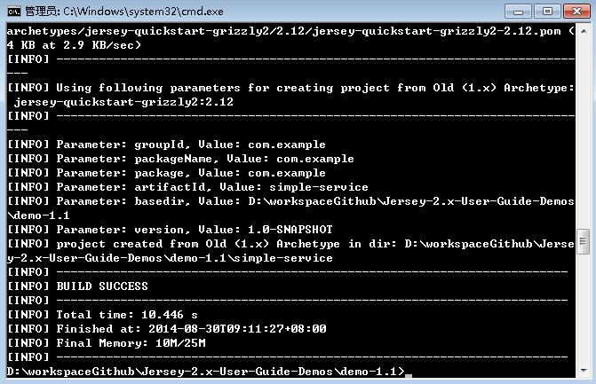
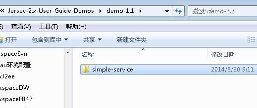
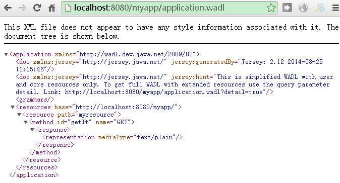
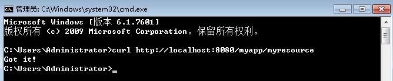
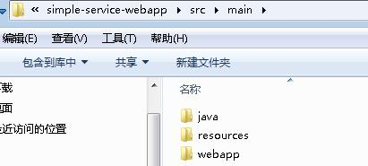
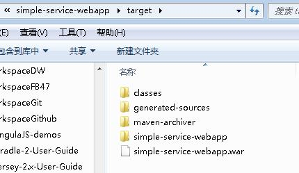
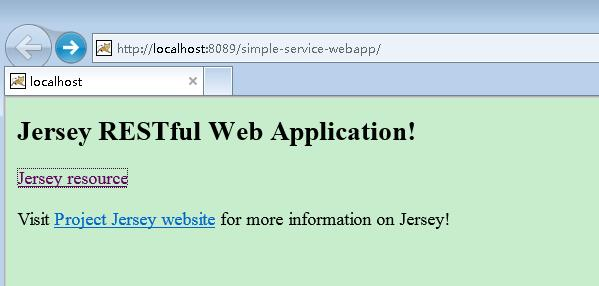

# 前言

# Preface 前言

这是 Jersey 2.x 的用户指南。我们极力将它能与我们新增的功能保持一致。当阅读本指南，作为补充，也请移步至 [Jersey API documentation](https://jersey.java.net/apidocs) 查看 Jersey 的特性和 API。

欢迎任何对本指南的建议和提问，可以联系 users@jersey.java.net,同样的，发现勘误，也可以在[Jersey JIRA Issue Tracker](http://java.net/jira/browse/JERSEY) 提问。

**译者注：**如发现中文翻译勘误欢迎指正，[点此](https://github.com/waylau/Jersey-2.x-User-Guide/issues)。 本文所有例子的源码，可以在[`github.com/waylau/Jersey-2.x-User-Guide-Demos`](https://github.com/waylau/Jersey-2.x-User-Guide-Demos) 获取到。

# 第一章 开始

# Chapter 1\. Getting Started 开始

本章提供了一个如何开始使用 Jersey 构建 RESTful 服务的快速介绍。这里描述的示例使用轻量级的 Grizzly HTTP 服务器。在本章的最后你将看到如何实现相同的功能的 JavaEE 的 Web 应用程序，该程序可以部署在任何支持 Servlet 2.5 和更高版本的 servlet 容器里面。

*译者注*：本章所有例子的源码，可以在[`github.com/waylau/Jersey-2.x-User-Guide-Demos`](https://github.com/waylau/Jersey-2.x-User-Guide-Demos) 获取到。

# 1.1 从 Maven 原型创建一个新项目

# 1.1\. Creating a New Project from Maven Archetype 从 Maven Archetype 创建一个新项目

创建 Jersey 工程需要使用 Apache 的[Maven](http://maven.apache.org/)软件工程和管理工具。所有的 Jersey 产品模块都可以在[Maven 中央库](http://search.maven.org/)中找到。因此基于 Maven 的模块都是现成的，不需要在 Maven 中增加其他的 Jersey 模块。(*译者注*：有关 Maven 的安装、使用，可以参考[Apache Maven 3.1.0 安装、部署、使用](http://www.waylau.com/apache-maven-3-1-0-installation-deployment-and-use/))

**注意**：如果你想要使用最新的 Jersey 模块的 SNAPSHOT 版本（*译者注*：SNAPSHOT 版本代表不稳定、尚处于开发中的版本），需要在 pom.xml 中添加如下内容：

```java
<repository>
    <id>snapshot-repository.java.net</id>
    <name>Java.net Snapshot Repository for Maven</name>
    <url>https://maven.java.net/content/repositories/snapshots/</url>
    <layout>default</layout>
</repository> 
```

使用 Maven 的工程创建一个 Jersey 项目是最方便的，让我们用这种方法来看一下它是怎么实现的。让我们创建一个新的 Jersey 项目,运行在[Grizzly](http://grizzly.java.net/)容器。我们使用 Jersey-provided 的 maven archetype。创建一个项目，需要执行下面的代码：

```java
mvn archetype:generate -DarchetypeArtifactId=jersey-quickstart-grizzly2 \
-DarchetypeGroupId=org.glassfish.jersey.archetypes -DinteractiveMode=false \
-DgroupId=com.example -DartifactId=simple-service -Dpackage=com.example \
-DarchetypeVersion=2.16 
```





在你的项目里面随意调整 pom.xml 内的 groupId，包名和版本号就可以成为一个新的项目。

# 1.2 探索新项目

# 1.2\. Exploring the Newly Created Project 探索新项目

如果用 Jersey maven archetype 成功创建了这个项目，那么在你当前的路径下就已经创建了一个名为`simple-service`项目。它包含了一个标准的 Maven 项目结构：

*   标准的管理配置文件 pom.xml
*   原文路径 src/main/java/
*   测试文件路径 src/test/java/

在原文路径下的`com.example`包中有两个 class 文件，这个 Main 类主要是负责承接 Grizzly 容器，同时也为这个容器配置和部署 JAX-RS 应用。在同一个包内的另外一个类 MyResource 类是 JAX-RS 的一个实现的源代码，如下：

```java
package com.example;

import javax.ws.rs.GET;
import javax.ws.rs.Path;
import javax.ws.rs.Produces;
import javax.ws.rs.core.MediaType;

/**
 * Root resource (exposed at "myresource" path)
 */
@Path("myresource")
public class MyResource {

    /**
     * Method handling HTTP GET requests. The returned object will be sent
     * to the client as "text/plain" media type.
     *
     * @return String that will be returned as a text/plain response.
     */
    @GET
    @Produces(MediaType.TEXT_PLAIN)
    public String getIt() {
        return "Got it!";
    }
} 
```

一个 JAX-RS 资源是一个可以处理绑定了资源的 URI 的 HTTP 请求的带有注解的 POJO，详细内容可以看第三章。在我们的例子中，单一的资源暴露了一个公开的方法，能够处理 HTTP GET 请求，绑定在`/myresource` URI 路径下，可以产生媒体类型为“text/plain”的响应消息。在这个示例中，资源返回相同的“Got it!”应对所有客户端的要求。

在`src/test/java`目录下的 MyResourceTest 类是对 MyResource 的单元测试，他们具有相同的包`com.example`

```java
package com.example;

import javax.ws.rs.client.Client;
import javax.ws.rs.client.ClientBuilder;
import javax.ws.rs.client.WebTarget;

import org.glassfish.grizzly.http.server.HttpServer;

...

public class MyResourceTest {

    private HttpServer server;
    private WebTarget target;

    @Before
    public void setUp() throws Exception {
        server = Main.startServer();

        Client c = ClientBuilder.newClient();
        target = c.target(Main.BASE_URI);
    }

    @After
    public void tearDown() throws Exception {
        server.stop();
    }

    /**
     * Test to see that the message "Got it!" is sent in the response.
     */
    @Test
    public void testGetIt() {
        String responseMsg = target.path("myresource").request().get(String.class);
        assertEquals("Got it!", responseMsg);
    }
} 
```

在这个单元测试中（*译者注*：测试用到了 JUnit ），静态方法`Main.startServer()`首先将 Grizzly 容器启动，而后服务器应用部署到测试中的`setUp()` 方法。接下来，一个 JAX-RS 客户端组件在相同的测试方法创建。 先是一个新的 JAX-RS 客户端实例生成并，接着 JAX-RS web target 部件指向我们部署的应用程序上下文的根：`http://localhost:8080/myapp/`（ `Main.BASE_URI` 的常量值）存储在单元测试类目标区。这个区被用于实际的单元测试方法（`testgetit()`）。

在 testgetit()方法中，JAX-RS 客户端 API 是用来连接并发送 HTTP GET 请求的 MyResource JAX-RS 资源类侦听在`/myresource` 的 URI。同样作为 JAX-RS API 方法调用链的一部分，回应以 Java 字符串类型被读到。在测试方法的第二行，响应的内容（从服务器返回的字符串）跟测试断言预期短语比较（*译者注*：即`assertEquals`方法）。要了解更多有关使用 JAX-RS 客户端 API，请参阅第五章客户端 API。

# 1.3 运行项目

# 1.3\. Running the Project 运行项目

项目有了，进入项目的跟目录（即 `\simple-service` ）现在先测试运行下：

```java
$ mvn clean test 
```

项目将会被编译，并且进行单元测试

```java
-------------------------------------------------------
 T E S T S
-------------------------------------------------------
Running com.example.MyResourceTest
八月 30, 2014 9:35:06 上午 org.glassfish.grizzly.http.server.NetworkListener sta
rt
INFO: Started listener bound to [localhost:8080]
八月 30, 2014 9:35:06 上午 org.glassfish.grizzly.http.server.HttpServer start
INFO: [HttpServer] Started.
八月 30, 2014 9:35:07 上午 org.glassfish.grizzly.http.server.NetworkListener shu
tdownNow
INFO: Stopped listener bound to [localhost:8080]
Tests run: 1, Failures: 0, Errors: 0, Skipped: 0, Time elapsed: 1.485 sec

Results :

Tests run: 1, Failures: 0, Errors: 0, Skipped: 0

[INFO] ------------------------------------------------------------------------
[INFO] BUILD SUCCESS
[INFO] ------------------------------------------------------------------------
[INFO] Total time: 02:21 min
[INFO] Finished at: 2014-08-30T09:35:07+08:00
[INFO] Final Memory: 13M/31M
[INFO] ------------------------------------------------------------------------ 
```

上面可以看看到测试通过，下面我们用标准模式运行项目：

```java
$ mvn exec:java 
```

运行结果如下：

```java
[INFO] Scanning for projects...
[INFO]
[INFO] Using the builder org.apache.maven.lifecycle.internal.builder.singlethrea
ded.SingleThreadedBuilder with a thread count of 1
[INFO]
[INFO] ------------------------------------------------------------------------
[INFO] Building simple-service 1.0-SNAPSHOT
[INFO] ------------------------------------------------------------------------
[INFO]
[INFO] >>> exec-maven-plugin:1.2.1:java (default-cli) @ simple-service >>>
[INFO]
[INFO] <<< exec-maven-plugin:1.2.1:java (default-cli) @ simple-service <<<
[INFO]
[INFO] --- exec-maven-plugin:1.2.1:java (default-cli) @ simple-service ---
八月 30, 2014 9:36:57 上午 org.glassfish.grizzly.http.server.NetworkListener sta
rt
INFO: Started listener bound to [localhost:8080]
八月 30, 2014 9:36:57 上午 org.glassfish.grizzly.http.server.HttpServer start
INFO: [HttpServer] Started.
Jersey app started with WADL available at http://localhost:8080/myapp/applicatio
n.wadl
Hit enter to stop it... 
```

项目已经运行，项目的 WADL 描述存在于`http://localhost:8080/myapp/application.wadl` URI 中,将该 URI 在控制台 以`curl`命令执行或者浏览器中运行，就能看到该 WADL 描述以 XML 格式展示。 

更多 WADL 的内容，请查考

[Chapter 16, WADL Support](https://jersey.java.net/documentation/latest/user-guide.html#wadl) 

接下来试下与部署在 `/myresource` 下面的资源的交互。将资源的 URL 输入浏览器，或者在控制台用`curl`命令执行(*译者注*：如果没有安装 curl,请参考[curl 安装](http://jingyan.baidu.com/article/a681b0dec4c67a3b1943467c.html))：

```java
$ curl http://localhost:8080/myapp/myresource
Got it! 
```



用`-i`命令获取所有回应的头文件信息：

```java
$ curl -i http://localhost:8080/myapp/myresource

HTTP/1.1 200 OK
Content-Type: text/plain
Date: Sat, 30 Aug 2014 02:23:25 GMT
Content-Length: 7

Got it! 
```

注意到`Content-Type: text/plain`是在 MyResource 类中用`@Produces` 注解的。

如果想看到更多返回信息，可以变换不同的 curl 命令参数。举例：

```java
$ curl -v http://localhost:8080/myapp/myresource

* Adding handle: conn: 0x5bc180
* Adding handle: send: 0
* Adding handle: recv: 0
* Curl_addHandleToPipeline: length: 1
* - Conn 0 (0x5bc180) send_pipe: 1, recv_pipe: 0
* About to connect() to localhost port 8080 (#0)
*   Trying 127.0.0.1...
* Connected to localhost (127.0.0.1) port 8080 (#0)
> GET /myapp/myresource HTTP/1.1
> User-Agent: curl/7.33.0
> Host: localhost:8080
> Accept: */*
>
< HTTP/1.1 200 OK
< Content-Type: text/plain
< Date: Sat, 30 Aug 2014 01:55:06 GMT
< Content-Length: 7
<
Got it!* Connection #0 to host localhost left intact 
```

## 链接

*   目录
*   上一节 1.2 探索新项目
*   下一节 1.4 创建一个 JavaEE 的 Web 项目

# 1.4 创建一个 JavaEE 的 Web 项目

# 1.4\. Creating a JavaEE Web Application 创建一个 JavaEE 的 Web 项目

与 1.1 类似的创建项目的流程，创建 JavaEE Web 项目仅需要打包成 WAR 并且部署到 Servlet 容器。除了基于 Grizzly 的 archetype, Jersey 也提供了 Maven archetype 用来创建 web 项目，命令如下：

```java
mvn archetype:generate -DarchetypeArtifactId=jersey-quickstart-webapp \
                -DarchetypeGroupId=org.glassfish.jersey.archetypes -DinteractiveMode=false \
                -DgroupId=com.example -DartifactId=simple-service-webapp -Dpackage=com.example \
                -DarchetypeVersion=2.16 
```

在你的项目里面随意调整 pom.xml 内的 groupId，包号和版本号就可以成为一个新的项目。

此时，`simple-service-webapp`已经创建， 符合 Maven 的项目结构：

*   标准的管理配置文件 pom.xml
*   原文件路径 src/main/java
*   资源文件路径 src/main/resources
*   web 应用文件 src/main/webapp



该项目包含相同的 MyResouce JAX-RS 资源类。它不包含任何单元测试以及它不包含一个主类，这在以前是用在 Grizzly 容器的项目设置。相反， 在 src/main/webapp/WEB-INF 下，它包含了标准的 JavaEE Web 应用的 web.xml 部署描述符。项目中的最后一个组件是一个 index.jsp 页面作为这次 MyResource 资源类打包和部署的应用程序客户端。

项目打包成 WAR,执行:

```java
mvn clean package 
```

打包成功，如下：

```java
[INFO]
[INFO] --- maven-war-plugin:2.2:war (default-war) @ simple-service-webapp ---
[INFO] Packaging webapp
[INFO] Assembling webapp [simple-service-webapp] in [D:\workspaceGithub\Jersey-2
.x-User-Guide-Demos\demo-1.4\simple-service-webapp\target\simple-service-webapp]

[INFO] Processing war project
[INFO] Copying webapp resources [D:\workspaceGithub\Jersey-2.x-User-Guide-Demos\
demo-1.4\simple-service-webapp\src\main\webapp]
[INFO] Webapp assembled in [176 msecs]
[INFO] Building war: D:\workspaceGithub\Jersey-2.x-User-Guide-Demos\demo-1.4\sim
ple-service-webapp\target\simple-service-webapp.war
[INFO] WEB-INF\web.xml already added, skipping
[INFO] ------------------------------------------------------------------------
[INFO] BUILD SUCCESS
[INFO] ------------------------------------------------------------------------
[INFO] Total time: 02:29 min
[INFO] Finished at: 2014-08-30T10:05:56+08:00
[INFO] Final Memory: 12M/29M
[INFO] ------------------------------------------------------------------------ 
```

打包的 WAR（位于`./target/simple-service-webapp.war`）可以将它部署到您任意的 Servlet 容器版。





![got it]](91eeacd9.jpg)

**注意**：部署 Jersey 项目，Servlet 容器版本应该是不低于 2.5，如果想支持更高的特性(比如 JAX-RS 2.0 Async Support) ，Servlet 容器版本应该是不低于 3.0

# 1.5 创建能部署在 Heroku 上面的 Web 项目

# 1.5\. Creating a Web Application that can be deployed on Heroku 创建能部署在 Heroku 上面的 Web 项目

与 1.4 节类似的，创建一个 Web 项目打包成 WAR 部署在 Servlet 容器或者发布到[Heroku](https://www.heroku.com/)。执行下面命令

```java
mvn archetype:generate -DarchetypeArtifactId=jersey-heroku-webapp \
                -DarchetypeGroupId=org.glassfish.jersey.archetypes -DinteractiveMode=false \
                -DgroupId=com.example -DartifactId=simple-heroku-webapp -Dpackage=com.example \
                -DarchetypeVersion=2.16 
```

在你的项目里面随意调整 pom.xml 内的 groupId，包号和版本号就可以成为一个新的项目。

此时，`simple-heroku-webapp`已经创建， 符合 Maven 的项目结构：

*   标准的管理配置文件 ：pom.xml
*   原文件路径 ：src/main/java
*   资源文件路径 ：src/main/resources
*   web 应用文件 ：src/main/webapp
*   原文件测试（基于[JerseyTest](https://jersey.java.net/apidocs/2.15/jersey/org/glassfish/jersey/test/JerseyTest.html)） ：src/test/java
*   Heroku 系统属性 (OpenJDK 版本) ：system.properties
*   Heroku 应用的 进程类型列表 ： Procfile

该项目包含一个 JAX-RS 资源类 MyResouce，和一个资源的方法会返回的简单文本。确保资源的正确测试，MyResourceTest 是一个端到端的测试案例（测试是基于[JerseyTest](https://jersey.java.net/apidocs/2.15/jersey/org/glassfish/jersey/test/JerseyTest.html),详见 Chapter 24, Jersey Test Framework）。类似`simple-service-webapp`项目，在 src/main/webapp/WEB-INF 下，它包含了标准的 JavaEE Web 应用的 web.xml 部署描述符，目标是部署在一个 Servlet 容器（本例将运行在 Heroku 的 Jetty 容器）。

项目打包成 WAR,执行:

```java
mvn clean package 
```

打包成功，如下：

```java
Results :

Tests run: 1, Failures: 0, Errors: 0, Skipped: 0

[INFO]
[INFO] --- maven-war-plugin:2.2:war (default-war) @ simple-heroku-webapp ---
[INFO] Packaging webapp
[INFO] Assembling webapp [simple-heroku-webapp] in [D:\workspaceGithub\Jersey-2.
x-User-Guide-Demos\demo-1.5\simple-heroku-webapp\target\simple-heroku-webapp]
[INFO] Processing war project
[INFO] Copying webapp resources [D:\workspaceGithub\Jersey-2.x-User-Guide-Demos\
demo-1.5\simple-heroku-webapp\src\main\webapp]
[INFO] Webapp assembled in [103 msecs]
[INFO] Building war: D:\workspaceGithub\Jersey-2.x-User-Guide-Demos\demo-1.5\sim
ple-heroku-webapp\target\simple-heroku-webapp.war
[INFO] WEB-INF\web.xml already added, skipping
[INFO]
[INFO] --- maven-dependency-plugin:2.8:copy-dependencies (copy-dependencies) @ s
imple-heroku-webapp ---
[INFO] Copying jersey-container-servlet-core-2.12.jar to D:\workspaceGithub\Jers
ey-2.x-User-Guide-Demos\demo-1.5\simple-heroku-webapp\target\dependency\jersey-c
ontainer-servlet-core-2.12.jar
[INFO] Copying hk2-api-2.3.0-b10.jar to D:\workspaceGithub\Jersey-2.x-User-Guide
-Demos\demo-1.5\simple-heroku-webapp\target\dependency\hk2-api-2.3.0-b10.jar
[INFO] Copying javassist-3.18.1-GA.jar to D:\workspaceGithub\Jersey-2.x-User-Gui
de-Demos\demo-1.5\simple-heroku-webapp\target\dependency\javassist-3.18.1-GA.jar

[INFO] Copying jetty-security-9.0.6.v20130930.jar to D:\workspaceGithub\Jersey-2
.x-User-Guide-Demos\demo-1.5\simple-heroku-webapp\target\dependency\jetty-securi
ty-9.0.6.v20130930.jar
[INFO] Copying validation-api-1.1.0.Final.jar to D:\workspaceGithub\Jersey-2.x-U
ser-Guide-Demos\demo-1.5\simple-heroku-webapp\target\dependency\validation-api-1
.1.0.Final.jar
[INFO] Copying jetty-webapp-9.0.6.v20130930.jar to D:\workspaceGithub\Jersey-2.x
-User-Guide-Demos\demo-1.5\simple-heroku-webapp\target\dependency\jetty-webapp-9
.0.6.v20130930.jar
[INFO] Copying jersey-client-2.12.jar to D:\workspaceGithub\Jersey-2.x-User-Guid
e-Demos\demo-1.5\simple-heroku-webapp\target\dependency\jersey-client-2.12.jar
[INFO] Copying osgi-resource-locator-1.0.1.jar to D:\workspaceGithub\Jersey-2.x-
User-Guide-Demos\demo-1.5\simple-heroku-webapp\target\dependency\osgi-resource-l
ocator-1.0.1.jar
[INFO] Copying jersey-common-2.12.jar to D:\workspaceGithub\Jersey-2.x-User-Guid
e-Demos\demo-1.5\simple-heroku-webapp\target\dependency\jersey-common-2.12.jar
[INFO] Copying jersey-server-2.12.jar to D:\workspaceGithub\Jersey-2.x-User-Guid
e-Demos\demo-1.5\simple-heroku-webapp\target\dependency\jersey-server-2.12.jar
[INFO] Copying jetty-io-9.0.6.v20130930.jar to D:\workspaceGithub\Jersey-2.x-Use
r-Guide-Demos\demo-1.5\simple-heroku-webapp\target\dependency\jetty-io-9.0.6.v20
130930.jar
[INFO] Copying jetty-server-9.0.6.v20130930.jar to D:\workspaceGithub\Jersey-2.x
-User-Guide-Demos\demo-1.5\simple-heroku-webapp\target\dependency\jetty-server-9
.0.6.v20130930.jar
[INFO] Copying hk2-locator-2.3.0-b10.jar to D:\workspaceGithub\Jersey-2.x-User-G
uide-Demos\demo-1.5\simple-heroku-webapp\target\dependency\hk2-locator-2.3.0-b10
.jar
[INFO] Copying jetty-util-9.0.6.v20130930.jar to D:\workspaceGithub\Jersey-2.x-U
ser-Guide-Demos\demo-1.5\simple-heroku-webapp\target\dependency\jetty-util-9.0.6
.v20130930.jar
[INFO] Copying jetty-http-9.0.6.v20130930.jar to D:\workspaceGithub\Jersey-2.x-U
ser-Guide-Demos\demo-1.5\simple-heroku-webapp\target\dependency\jetty-http-9.0.6
.v20130930.jar
[INFO] Copying jersey-container-servlet-2.12.jar to D:\workspaceGithub\Jersey-2.
x-User-Guide-Demos\demo-1.5\simple-heroku-webapp\target\dependency\jersey-contai
ner-servlet-2.12.jar
[INFO] Copying hk2-utils-2.3.0-b10.jar to D:\workspaceGithub\Jersey-2.x-User-Gui
de-Demos\demo-1.5\simple-heroku-webapp\target\dependency\hk2-utils-2.3.0-b10.jar

[INFO] Copying jetty-xml-9.0.6.v20130930.jar to D:\workspaceGithub\Jersey-2.x-Us
er-Guide-Demos\demo-1.5\simple-heroku-webapp\target\dependency\jetty-xml-9.0.6.v
20130930.jar
[INFO] Copying javax.inject-2.3.0-b10.jar to D:\workspaceGithub\Jersey-2.x-User-
Guide-Demos\demo-1.5\simple-heroku-webapp\target\dependency\javax.inject-2.3.0-b
10.jar
[INFO] Copying jersey-guava-2.12.jar to D:\workspaceGithub\Jersey-2.x-User-Guide
-Demos\demo-1.5\simple-heroku-webapp\target\dependency\jersey-guava-2.12.jar
[INFO] Copying aopalliance-repackaged-2.3.0-b10.jar to D:\workspaceGithub\Jersey
-2.x-User-Guide-Demos\demo-1.5\simple-heroku-webapp\target\dependency\aopallianc
e-repackaged-2.3.0-b10.jar
[INFO] Copying jetty-servlet-9.0.6.v20130930.jar to D:\workspaceGithub\Jersey-2.
x-User-Guide-Demos\demo-1.5\simple-heroku-webapp\target\dependency\jetty-servlet
-9.0.6.v20130930.jar
[INFO] Copying javax.annotation-api-1.2.jar to D:\workspaceGithub\Jersey-2.x-Use
r-Guide-Demos\demo-1.5\simple-heroku-webapp\target\dependency\javax.annotation-a
pi-1.2.jar
[INFO] Copying javax.servlet-3.0.0.v201112011016.jar to D:\workspaceGithub\Jerse
y-2.x-User-Guide-Demos\demo-1.5\simple-heroku-webapp\target\dependency\javax.ser
vlet-3.0.0.v201112011016.jar
[INFO] Copying javax.ws.rs-api-2.0.1.jar to D:\workspaceGithub\Jersey-2.x-User-G
uide-Demos\demo-1.5\simple-heroku-webapp\target\dependency\javax.ws.rs-api-2.0.1
.jar
[INFO] ------------------------------------------------------------------------
[INFO] BUILD SUCCESS
[INFO] ------------------------------------------------------------------------
[INFO] Total time: 03:17 min
[INFO] Finished at: 2014-08-30T10:17:48+08:00
[INFO] Final Memory: 17M/42M
[INFO] ------------------------------------------------------------------------ 
```

接下来你可以做：

*   改变项目
*   打包成 WAR 部署到任意 Servlet 容器
*   或者部署到 Heroku(参见下文 1.5.1)

**提示**： 可以执行`mvn clean package jetty:run`项目将会部署到内嵌的 Jetty 容器运行 ，或者执行`java -cp target/classes:target/dependency/* com.example.heroku.Main`(那是 Jetty 在 Heroku 的启动方式)

## 1.5.1\. Deploy it on Heroku 部署在 Heroku

首先是要注册[Heroku](https://www.heroku.com/)的账户，这里不展开讲。可以参考[Getting Started with Java on Heroku](https://devcenter.heroku.com/articles/getting-started-with-java)。当你的 Heroku 环境准备完毕后，接着看下面的步骤：

首先给你的项目创建一个 Git 仓库：

```java
 $ git init
Initialized empty Git repository in /.../simple-heroku-webapp/.git/ 
```

接着创建 Heroku 的实例，并把远程引用添加到你的 Git 仓库：

```java
$ heroku create
Creating simple-heroku-webapp... done, stack is cedar
http://simple-heroku-webapp.herokuapp.com/ | git@heroku.com:simple-heroku-webapp.git
Git remote heroku added 
```

**注意**：`heroku create` 默认创建的实例名称是一串随机的字符串类似与 `tranquil-basin-4744`，而不一定是你项目名`simple-heroku-webapp`。(*译者注*：当然你可以根据用户自定义实例名称，具体的要参考[Getting Started with Java on Heroku](https://devcenter.heroku.com/articles/getting-started-with-java))

添加并提交到你的 Git 仓库：

```java
$ git add src/ pom.xml Procfile system.properties
$ git commit -a -m "initial commit"
[master (root-commit) e2b58e3] initial commit
 7 files changed, 221 insertions(+)
 create mode 100644 Procfile
 create mode 100644 pom.xml
 create mode 100644 src/main/java/com/example/MyResource.java
 create mode 100644 src/main/java/com/example/heroku/Main.java
 create mode 100644 src/main/webapp/WEB-INF/web.xml
 create mode 100644 src/test/java/com/example/MyResourceTest.java
 create mode 100644 system.properties 
```

将修改推送到 Heroku:

```java
$ git push heroku master
Counting objects: 21, done.
Delta compression using up to 8 threads.
Compressing objects: 100% (11/11), done.
Writing objects: 100% (21/21), 3.73 KiB | 0 bytes/s, done.
Total 21 (delta 0), reused 0 (delta 0)

-----> Java app detected
-----> Installing OpenJDK 1.7... done
-----> Installing Maven 3.0.3... done
-----> Installing settings.xml... done
-----> executing /app/tmp/cache/.maven/bin/mvn -B -Duser.home=/tmp/build_992cc747-26d6-4800-bdb1-add47b9583cd -Dmaven.repo.local=/app/tmp/cache/.m2/repository -s /app/tmp/cache/.m2/settings.xml -DskipTests=true clean install
       [INFO] Scanning for projects...
       [INFO]
       [INFO] ------------------------------------------------------------------------
       [INFO] Building simple-heroku-webapp 1.0-SNAPSHOT
       [INFO] ------------------------------------------------------------------------
       [INFO]
       [INFO] --- maven-clean-plugin:2.4.1:clean (default-clean) @ simple-heroku-webapp ---
       [INFO]
       [INFO] --- maven-resources-plugin:2.4.3:resources (default-resources) @ simple-heroku-webapp ---
       [INFO] Using 'UTF-8' encoding to copy filtered resources.
       [INFO] skip non existing resourceDirectory /tmp/build_992cc747-26d6-4800-bdb1-add47b9583cd/src/main/resources
       [INFO]
       [INFO] --- maven-compiler-plugin:2.5.1:compile (default-compile) @ simple-heroku-webapp ---
       [INFO] Compiling 2 source files to /tmp/build_992cc747-26d6-4800-bdb1-add47b9583cd/target/classes
       [INFO]
       [INFO] --- maven-resources-plugin:2.4.3:testResources (default-testResources) @ simple-heroku-webapp ---
       [INFO] Using 'UTF-8' encoding to copy filtered resources.
       [INFO] skip non existing resourceDirectory /tmp/build_992cc747-26d6-4800-bdb1-add47b9583cd/src/test/resources
       [INFO]
       [INFO] --- maven-compiler-plugin:2.5.1:testCompile (default-testCompile) @ simple-heroku-webapp ---
       [INFO] Compiling 1 source file to /tmp/build_992cc747-26d6-4800-bdb1-add47b9583cd/target/test-classes
       [INFO]
       [INFO] --- maven-surefire-plugin:2.7.2:test (default-test) @ simple-heroku-webapp ---
       [INFO] Tests are skipped.
       [INFO]
       [INFO] --- maven-war-plugin:2.1.1:war (default-war) @ simple-heroku-webapp ---
       [INFO] Packaging webapp
       [INFO] Assembling webapp [simple-heroku-webapp] in [/tmp/build_992cc747-26d6-4800-bdb1-add47b9583cd/target/simple-heroku-webapp]
       [INFO] Processing war project
       [INFO] Copying webapp resources [/tmp/build_992cc747-26d6-4800-bdb1-add47b9583cd/src/main/webapp]
       [INFO] Webapp assembled in [88 msecs]
       [INFO] Building war: /tmp/build_992cc747-26d6-4800-bdb1-add47b9583cd/target/simple-heroku-webapp.war
       [INFO] WEB-INF/web.xml already added, skipping
       [INFO]
       [INFO] --- maven-dependency-plugin:2.1:copy-dependencies (copy-dependencies) @ simple-heroku-webapp ---
       [INFO] Copying guava-14.0.1.jar to /tmp/build_992cc747-26d6-4800-bdb1-add47b9583cd/target/dependency/guava-14.0.1.jar
       [INFO] Copying javax.annotation-api-1.2.jar to /tmp/build_992cc747-26d6-4800-bdb1-add47b9583cd/target/dependency/javax.annotation-api-1.2.jar
       [INFO] Copying validation-api-1.1.0.Final.jar to /tmp/build_992cc747-26d6-4800-bdb1-add47b9583cd/target/dependency/validation-api-1.1.0.Final.jar
       [INFO] Copying javax.ws.rs-api-2.0.jar to /tmp/build_992cc747-26d6-4800-bdb1-add47b9583cd/target/dependency/javax.ws.rs-api-2.0.jar
       [INFO] Copying jetty-http-9.0.6.v20130930.jar to /tmp/build_992cc747-26d6-4800-bdb1-add47b9583cd/target/dependency/jetty-http-9.0.6.v20130930.jar
       [INFO] Copying jetty-io-9.0.6.v20130930.jar to /tmp/build_992cc747-26d6-4800-bdb1-add47b9583cd/target/dependency/jetty-io-9.0.6.v20130930.jar
       [INFO] Copying jetty-security-9.0.6.v20130930.jar to /tmp/build_992cc747-26d6-4800-bdb1-add47b9583cd/target/dependency/jetty-security-9.0.6.v20130930.jar
       [INFO] Copying jetty-server-9.0.6.v20130930.jar to /tmp/build_992cc747-26d6-4800-bdb1-add47b9583cd/target/dependency/jetty-server-9.0.6.v20130930.jar
       [INFO] Copying jetty-servlet-9.0.6.v20130930.jar to /tmp/build_992cc747-26d6-4800-bdb1-add47b9583cd/target/dependency/jetty-servlet-9.0.6.v20130930.jar
       [INFO] Copying jetty-util-9.0.6.v20130930.jar to /tmp/build_992cc747-26d6-4800-bdb1-add47b9583cd/target/dependency/jetty-util-9.0.6.v20130930.jar
       [INFO] Copying jetty-webapp-9.0.6.v20130930.jar to /tmp/build_992cc747-26d6-4800-bdb1-add47b9583cd/target/dependency/jetty-webapp-9.0.6.v20130930.jar
       [INFO] Copying jetty-xml-9.0.6.v20130930.jar to /tmp/build_992cc747-26d6-4800-bdb1-add47b9583cd/target/dependency/jetty-xml-9.0.6.v20130930.jar
       [INFO] Copying javax.servlet-3.0.0.v201112011016.jar to /tmp/build_992cc747-26d6-4800-bdb1-add47b9583cd/target/dependency/javax.servlet-3.0.0.v201112011016.jar
       [INFO] Copying hk2-api-2.2.0-b21.jar to /tmp/build_992cc747-26d6-4800-bdb1-add47b9583cd/target/dependency/hk2-api-2.2.0-b21.jar
       [INFO] Copying hk2-locator-2.2.0-b21.jar to /tmp/build_992cc747-26d6-4800-bdb1-add47b9583cd/target/dependency/hk2-locator-2.2.0-b21.jar
       [INFO] Copying hk2-utils-2.2.0-b21.jar to /tmp/build_992cc747-26d6-4800-bdb1-add47b9583cd/target/dependency/hk2-utils-2.2.0-b21.jar
       [INFO] Copying osgi-resource-locator-1.0.1.jar to /tmp/build_992cc747-26d6-4800-bdb1-add47b9583cd/target/dependency/osgi-resource-locator-1.0.1.jar
       [INFO] Copying asm-all-repackaged-2.2.0-b21.jar to /tmp/build_992cc747-26d6-4800-bdb1-add47b9583cd/target/dependency/asm-all-repackaged-2.2.0-b21.jar
       [INFO] Copying cglib-2.2.0-b21.jar to /tmp/build_992cc747-26d6-4800-bdb1-add47b9583cd/target/dependency/cglib-2.2.0-b21.jar
       [INFO] Copying javax.inject-2.2.0-b21.jar to /tmp/build_992cc747-26d6-4800-bdb1-add47b9583cd/target/dependency/javax.inject-2.2.0-b21.jar
       [INFO] Copying jersey-container-servlet-2.5.jar to /tmp/build_992cc747-26d6-4800-bdb1-add47b9583cd/target/dependency/jersey-container-servlet-2.5.jar
       [INFO] Copying jersey-container-servlet-core-2.5.jar to /tmp/build_992cc747-26d6-4800-bdb1-add47b9583cd/target/dependency/jersey-container-servlet-core-2.5.jar
       [INFO] Copying jersey-client-2.5.jar to /tmp/build_992cc747-26d6-4800-bdb1-add47b9583cd/target/dependency/jersey-client-2.5.jar
       [INFO] Copying jersey-common-2.5.jar to /tmp/build_992cc747-26d6-4800-bdb1-add47b9583cd/target/dependency/jersey-common-2.5.jar
       [INFO] Copying jersey-server-2.5.jar to /tmp/build_992cc747-26d6-4800-bdb1-add47b9583cd/target/dependency/jersey-server-2.5.jar
       [INFO]
       [INFO] --- maven-install-plugin:2.3.1:install (default-install) @ simple-heroku-webapp ---
       [INFO] Installing /tmp/build_992cc747-26d6-4800-bdb1-add47b9583cd/target/simple-heroku-webapp.war to /app/tmp/cache/.m2/repository/com/example/simple-heroku-webapp/1.0-SNAPSHOT/simple-heroku-webapp-1.0-SNAPSHOT.war
       [INFO] Installing /tmp/build_992cc747-26d6-4800-bdb1-add47b9583cd/pom.xml to /app/tmp/cache/.m2/repository/com/example/simple-heroku-webapp/1.0-SNAPSHOT/simple-heroku-webapp-1.0-SNAPSHOT.pom
       [INFO] ------------------------------------------------------------------------
       [INFO] BUILD SUCCESS
       [INFO] ------------------------------------------------------------------------
       [INFO] Total time: 45.861s
       [INFO] Finished at: Mon Dec 09 19:51:34 UTC 2013
       [INFO] Final Memory: 17M/514M
       [INFO] ------------------------------------------------------------------------
-----> Discovering process types
       Procfile declares types -> web

-----> Compiled slug size: 75.9MB
-----> Launching... done, v6
       http://simple-heroku-webapp.herokuapp.com deployed to Heroku

To git@heroku.com:simple-heroku-webapp.git
 * [new branch]      master -> master 
```

现在你可以访问你的应用了。本例子是[`simple-heroku-webapp.herokuapp.com/myresource`](http://simple-heroku-webapp.herokuapp.com/myresource)

# 1.6 探索其他例子

# 1.6\. Exploring Other Jersey Examples 探索其他例子

在上几节内容，我们快速的接触了 Jersey。请参阅用户指南的其他部分以了解更多关于 Jersey 和 JAX-RS.即使我们尽力覆盖尽可能多的用户指南，但还是无法解决你所有的问题。在这种情况下，深入查看我们的例子，可能能给你的项目提供了额外的技巧和提示。

Jersey 的代码库包含了很多 Jersey 和 JAX-RS 的特性。随意浏览 Jersey 的[例子代码](https://github.com/jersey/jersey/tree/2.15/examples)。也可以[在此](https://maven.java.net/content/repositories/releases/org/glassfish/jersey/bundles/jersey-examples/2.15/)下载离线包。

*译者注*：上文所有例子的源码，可以在[`github.com/waylau/Jersey-2.x-User-Guide-Demos`](https://github.com/waylau/Jersey-2.x-User-Guide-Demos) 获取到。

# 第二章 模块和依赖

# Chapter 2\. Modules and dependencies 模块和依赖

# 2.1 与 Java SE 兼容性

# 2.1\. Java SE Compatibility 与 Java SE 兼容性

2.6 以前的版本，Jersey 由 Java SE 6 编译。2.7 版本后发生了变化。现在几乎所有的 Jersey 组件用 Java SE 7 目标编译。这意味着，如果要使用最新的 Jersey ，你将至少需要 Java SE 7 能够编译并运行你的应用程序。只有 `core-common` 和 `core-client` 模块仍然 需要 Java SE 6 编译。

# 2.2 介绍 Jersey 的依赖

# 2.2\. Introduction to Jersey dependencies 介绍 Jersey 的依赖

Jersy 的创建、组装和安装都是使用 [Apache Maven](http://maven.apache.org/)，非快照的 Jersey 都部署到了 [Maven 中央库](http://search.maven.org/)。他也部署在了[Java.Net Maven repositories](http://maven.java.net/)，包括带有快照的版本。当然如果要查看最新的版本也可以检出 [Java.Net Maven repositories](https://maven.java.net/content/repositories/snapshots/org/glassfish/jersey)。

一个使用 Jersey 的应用，依赖于 Jersey ，但是如果使用了第三方模块，那么 Jersey 可能反过来依赖第三方模块。Jersey 是插件化的组件结构，所以不同的应用可能依赖不同的模块。

开发者使用 Maven 或者 Maven 相关的构建系统在他们的应用里面，比使用 Ant 或者其他构建系统更加容易管理他们的依赖。这个文档就是要解释使用 maven 或者不使用 maven 在他们的应用里怎么依赖 Jersey 的模块。Ant 开发者请参阅 [Ant Tasks for Maven](http://maven.apache.org/ant-tasks/index.html)

# 2.3 常见 Jersey 示例

# 2.3\. Common Jersey Use Cases 常见 Jersey 示例

## 2.3.1\. 基于 Servlet 的 GlassFish 应用

如果你使用 GlassFish 应用服务，那么你不需要打包任何东西，所有的一切都已经包含了。你只需要声明依赖使 JAX-RS API 可以编入到你的应用。

```java
<dependency>
    <groupId>javax.ws.rs</groupId>
    <artifactId>javax.ws.rs-api</artifactId>
    <version>2.0.1</version>
    <scope>provided</scope>
</dependency> 
```

如果你使用特定的功能，那么直接取决于你依赖的 Jersey

```java
<dependency>
    <groupId>org.glassfish.jersey.containers</groupId>
    <artifactId>jersey-container-servlet</artifactId>
    <version>2.16</version>
    <scope>provided</scope>
</dependency>
<!-- 如果你只使用 Jersey 客户端具体功能而不包含服务端的 -->
<dependency>
    <groupId>org.glassfish.jersey.core</groupId>
    <artifactId>jersey-client</artifactId>
    <version>2.16</version>
    <scope>provided</scope>
</dependency> 
```

## 2.3.2\. 基于 Servlet 的服务端应用

以下依赖应用服务器（servlet 容器）没有任何集成的 JAX-RS 实现。然后应用需要包括 JAX-RS API 和 Jersey 部署应用程序的实现。

```java
<dependency>
    <groupId>org.glassfish.jersey.containers</groupId>
    <!-- 如果容器支持低于 Servlet API 3.0,请使用"jersey-container-servlet-core"  -->
    <artifactId>jersey-container-servlet</artifactId>
    <version>2.16</version>
</dependency>
<!-- 仅使用 JAX-RS Client 时添加 -->
<dependency>
    <groupId>org.glassfish.jersey.core</groupId>
    <artifactId>jersey-client</artifactId>
    <version>2.16</version>
</dependency> 
```

## 2.3.3\. 运行于 JDK 的客户端应用

在 JDK 是否使用 JAX-RS 中客户端的规范完全取决于客户。有各种不同的附加模块可以被添加，例如像 grizzly 或 Apache 或 jetty 等连接器（见下面依赖）。Jersey 客户端 在 JDK 默认运行（HttpUrlConnection）。更多的细节见 Chapter 5, Client API。

```java
<dependency>
    <groupId>org.glassfish.jersey.core</groupId>
    <artifactId>jersey-client</artifactId>
    <version>2.16</version>
</dependency> 
```

目前可用的连接器：

```java
<dependency>
    <groupId>org.glassfish.jersey.connectors</groupId>
    <artifactId>jersey-grizzly-connector</artifactId>
    <version>2.16</version>
</dependency>

<dependency>
    <groupId>org.glassfish.jersey.connectors</groupId>
    <artifactId>jersey-apache-connector</artifactId>
    <version>2.16</version>
</dependency>

<dependency>
    <groupId>org.glassfish.jersey.connectors</groupId>
    <artifactId>jersey-jetty-connector</artifactId>
    <version>2.16</version>
</dependency> 
```

## 2.3.4\. 服务器端应用支持的容器

除了标准的 JAX-RS 基于 Servlet 的部署（Servlet 2.5 及以上版本），Jersey 对下面容器提供可编程的部署环境：Grizzly 2（HTTP 和 Servlet），JDK HTTP 服务器，简单的 HTTP 服务器，Jetty HTTP 服务器。本章介绍只需要 maven 依赖，更多的内容见 Chapter 4\. Application Deployment and Runtime Environments 应用部署和运行时环境

```java
<dependency>
    <groupId>org.glassfish.jersey.containers</groupId>
    <artifactId>jersey-container-grizzly2-http</artifactId>
    <version>2.16</version>
</dependency>

<dependency>
    <groupId>org.glassfish.jersey.containers</groupId>
    <artifactId>jersey-container-grizzly2-servlet</artifactId>
    <version>2.16</version>
</dependency>

<dependency>
    <groupId>org.glassfish.jersey.containers</groupId>
    <artifactId>jersey-container-jdk-http</artifactId>
    <version>2.16</version>
</dependency>

<dependency>
    <groupId>org.glassfish.jersey.containers</groupId>
    <artifactId>jersey-container-simple-http</artifactId>
    <version>2.16</version>
</dependency>

<dependency>
    <groupId>org.glassfish.jersey.containers</groupId>
    <artifactId>jersey-container-jetty-http</artifactId>
    <version>2.16</version>
</dependency>

<dependency>
    <groupId>org.glassfish.jersey.containers</groupId>
    <artifactId>jersey-container-jetty-servlet</artifactId>
    <version>2.16</version>
</dependency> 
```

# 2.4 模块列表

# 2.4\. List of modules 模块列表

下面的章节提供所有 Jersey 模块和与各自的二进制文件链接的依赖关系的概述（点击模块名称可以得到下载该模块的链接）。（*译者注*：下面的列表就不翻译了）

[`jersey.java.net/documentation/latest/modules-and-dependencies.html#modules`](https://jersey.java.net/documentation/latest/modules-and-dependencies.html#modules)

# 第三章 关于 JAX-RS 应用，资源和子资源

# Chapter 3\. JAX-RS Application, Resources and Sub-Resources 关于 JAX-RS 应用，资源和子资源

本章呈现 JAX-RS 核心概念-资源和子资源的概述。

JAX-RS 2.0 的 JavaDoc 文档 可以在[这里](http://jax-rs-spec.java.net/nonav/$%7Bjaxrs.api.version%7D/apidocs/index.html) 找到。

JAX-RS 2.0 规范草案可以在[这里](http://jcp.org/en/jsr/summary?id=339) 找到。

# 3.1 根资源类

# 3.1\. Root Resource Classes 根资源类

Root Resource Classes 是带有 [@PATH](http://jax-rs-spec.java.net/nonav/$%7Bjaxrs.api.version%7D/apidocs/javax/ws/rs/Path.html) 注解的，包含至少一个 [@PATH](http://jax-rs-spec.java.net/nonav/$%7Bjaxrs.api.version%7D/apidocs/javax/ws/rs/Path.html) 注解的方法或者方法带有 [@GET](http://jax-rs-spec.java.net/nonav/$%7Bjaxrs.api.version%7D/apidocs/javax/ws/rs/GET.html), [@PUT](http://jax-rs-spec.java.net/nonav/$%7Bjaxrs.api.version%7D/apidocs/javax/ws/rs/PUT.html), [@POST](http://jax-rs-spec.java.net/nonav/$%7Bjaxrs.api.version%7D/apidocs/javax/ws/rs/POST.html), [@DELETE](http://jax-rs-spec.java.net/nonav/$%7Bjaxrs.api.version%7D/apidocs/javax/ws/rs/DELETE.html) 资源方法指示器注解的资源方法的 POJOs (Plain Old Java Objects 简单洁净 Java 对象)。资源方法是资源类注解了。这一节就是展示如何使用 Java 对象内的注解创建一个 Jersey 的 RESTful 服务。

下面这段代码就是一个带有 JAX-RS 注解的简单事例，可以从[这里](https://maven.java.net/content/repositories/releases/org/glassfish/jersey/examples/helloworld/2.12/)下载.

Example 3.1\. 简单 hello world 根资源类例子

```java
package org.glassfish.jersey.examples.helloworld;

import javax.ws.rs.GET;
import javax.ws.rs.Path;
import javax.ws.rs.Produces;

@Path("helloworld")
public class HelloWorldResource {
    public static final String CLICHED_MESSAGE = "Hello World!";

@GET
@Produces("text/plain")
    public String getHello() {
        return CLICHED_MESSAGE;
    }
} 
```

下面看下 JAX-RS 里面的几个注解

## 3.1.1\. @Path

[@PATH](http://jax-rs-spec.java.net/nonav/$%7Bjaxrs.api.version%7D/apidocs/javax/ws/rs/Path.html) 是一个 URI 的相对路径，在上面的例子中，设置的是本地的 URI 的 `/helloworld`。这事一个非常简单的关于 [@PATH](http://jax-rs-spec.java.net/nonav/$%7Bjaxrs.api.version%7D/apidocs/javax/ws/rs/Path.html)的例子，更有用的是你可以嵌入变量到 URIs 里面

URI 的路径模版是由 URIs 和嵌入 URI 语法的变量组成。变量在运行时将会被匹配到的 URI 的那部分多代替。例如下面的 [@Path](http://jax-rs-spec.java.net/nonav/$%7Bjaxrs.api.version%7D/apidocs/javax/ws/rs/Path.html) 注解

```java
@Path("/users/{username}") 
```

按照这种类型的例子，一个用户会方便的填写他的名字，那么 Jersey 服务器也会按照这个 UIR 路径模板响应到这个请求。例如：用户输入了名字“Galileo”，那么服务器就会响应 `http://example.com/users/Galileo`。

为了接收到用户名变量，[@PathParam](http://jax-rs-spec.java.net/nonav/$%7Bjaxrs.api.version%7D/apidocs/javax/ws/rs/PathParam.html) 用在接收请求的方法的参数上，例如：

Example 3.2\. 指定的 URI 路径参数

```java
@Path("/users/{username}")
public class UserResource {

    @GET
    @Produces("text/xml")
    public String getUser(@PathParam("username") String userName) {
        ...
    }
} 
```

它规定匹配正则表达式式要精确到大小写的，如果填写的话会覆盖默认的表达式 `[^/]+?` ，例如

```java
@Path("users/{username: [a-zA-Z][a-zA-Z_0-9]*}") 
```

这个正则表达式匹配由大小写字符、横杠和数字组成的字符串，如果正则校验不通过，则返回`404`（没有找到资源）。

一个 [@Path](http://jax-rs-spec.java.net/nonav/$%7Bjaxrs.api.version%7D/apidocs/javax/ws/rs/Path.html)的内容是否以"/"开头都没有区别，同样是否以"/"结尾也没有什么区别

## 3.1.2\. @GET, @PUT, @POST, @DELETE, ... (HTTP 方法)

[@GET](http://jax-rs-spec.java.net/nonav/$%7Bjaxrs.api.version%7D/apidocs/javax/ws/rs/GET.html), [@PUT](http://jax-rs-spec.java.net/nonav/$%7Bjaxrs.api.version%7D/apidocs/javax/ws/rs/PUT.html), [@POST](http://jax-rs-spec.java.net/nonav/$%7Bjaxrs.api.version%7D/apidocs/javax/ws/rs/POST.html), [@DELETE](http://jax-rs-spec.java.net/nonav/$%7Bjaxrs.api.version%7D/apidocs/javax/ws/rs/DELETE.html), [@HEAD](http://jax-rs-spec.java.net/nonav/$%7Bjaxrs.api.version%7D/apidocs/javax/ws/rs/HEAD.html) 是 JAX-RS 定义的注解，它非常类似与 HTTP 的方法名。在上面的例子中，这些注解是通过 HTTP 的 GET 方法实现的。资源的响应就是 HTTP 的响应。

下面这个例子是存储服务的一个片段，是使用 PUT 方法处理创建或者修改存储容器：

Example 3.3\. PUT 方法

```java
@PUT
public Response putContainer() {
    System.out.println("PUT CONTAINER " + container);

    URI uri = uriInfo.getAbsolutePath();
    Container c = new Container(container, uri.toString());

    Response r;
    if (!MemoryStore.MS.hasContainer(c)) {
        r = Response.created(uri).build();
    } else {
        r = Response.noContent().build();
    }

    MemoryStore.MS.createContainer(c);
    return r;
} 
```

如果没有明确的定义的话，JAX-RS 运行的时候默认支持 HEAD 和 OPTIONS 方法。HEAD 运行时将调用 get 方法的实现（如果存在）和忽略响应实体（如果设置）。一个响应返回 OPTIONS 的方法取决于所要求的媒体类型在头文件中 'Accept' 的定义。 OPTIONS 方法可以返回一组支持资源的方法在 头文件中 'Allow' 或返回 [WADL](http://wadl.java.net/) 文件的进行设置。更多信息见[`jersey.java.net/documentation/latest/wadl.html`](https://jersey.java.net/documentation/latest/wadl.html)节。

## 3.1.3\. @Produces

[@Produces](http://jax-rs-spec.java.net/nonav/$%7Bjaxrs.api.version%7D/apidocs/javax/ws/rs/Produces.html)是定义返回值给客户端的 MIME 媒体类型。在下面这个例子里面，将会返回一个`text/plain`MIME 媒体类型的相应。@Produces 既可以应用在类的水平上，也可以作用与方法的水平。这里是一个例子：

Example 3.4\. 指定输出文件的 MIME 类型

```java
@Path("/myResource")
@Produces("text/plain")
public class SomeResource {
    @GET
    public String doGetAsPlainText() {
        ...
    }

    @GET
    @Produces("text/html")
    public String doGetAsHtml() {
        ...
    }
} 
```

这个 doGetAsPlainText 方法默认使用类水平的 [@Produces](http://jax-rs-spec.java.net/nonav/$%7Bjaxrs.api.version%7D/apidocs/javax/ws/rs/Produces.html) 注解内容，也就是`text/plain` 。而 doGetAsHtml 方法使用方法水平上的[@Produces](http://jax-rs-spec.java.net/nonav/$%7Bjaxrs.api.version%7D/apidocs/javax/ws/rs/Produces.html)，也就是`text/html`。也就是说方法水平层面的[@Produces](http://jax-rs-spec.java.net/nonav/$%7Bjaxrs.api.version%7D/apidocs/javax/ws/rs/Produces.html) 会覆盖类层面的[@Produces](http://jax-rs-spec.java.net/nonav/$%7Bjaxrs.api.version%7D/apidocs/javax/ws/rs/Produces.html)。

如果一个资源类是能够生产多个 MIME 媒体类型,资源的方法的响应将会对应对于客户端来说最可接受的媒体类型。HTTP 请求头部宣布接受什么是最容易被接受的。例如，如果接受头部是 `Accept: text/plain` 然后 dogetasplaintext 方法会被调用。如果接受标题是`Accept: text/plain;q=0.9, text/htm`，即客户可以接受 `text/plain` 和 `text/html` ，但更容易接收后者的媒体类型，然后 dogetashtml 方法会被调用。

[@Produces](http://jax-rs-spec.java.net/nonav/$%7Bjaxrs.api.version%7D/apidocs/javax/ws/rs/Produces.html) 可以定义多个返回类型，例如：

Example 3.5\. 使用多个返回类型

```java
@GET
@Produces({"application/xml", "application/json"})
public String doGetAsXmlOrJson() {
    ...
} 
```

无论 application/xml 或者 application/json 那个匹配上了，都会执行 doGetAsXmlOrJson，如果两个都匹配了，那么会选择首先匹配的那个

服务器也可选的指定个别媒体类型的品质因数。这些是客户端的决定的如何才是可接受的。例如：

Example 3.6\. 服务器端内容协商

```java
@GET
@Produces({"application/xml; qs=0.9", "application/json"})
public String doGetAsXmlOrJson() {
    ...
} 
```

在上面的示例，如果客户端是接受 application/xml 或者 application/json （一样），那么服务器总是发送 application/json，因为 application/xml 有一个较低的品质因数。

上面的例子是指明确清楚的 MIME 媒体类型。最好让它用常量来表示，这样可能会降低印刷错误。具体见 [MediaType](http://jax-rs-spec.java.net/nonav/$%7Bjaxrs.api.version%7D/apidocs/javax/ws/rs/core/MediaType.html)的常量字段值。

## 3.1.4\. @Consumes

[@Consumes](http://jax-rs-spec.java.net/nonav/$%7Bjaxrs.api.version%7D/apidocs/javax/ws/rs/Consumes.html)注释是用来指定表示可由资源消耗的 MIME 媒体类型。上面的例子可以修改设置如下：

Example 3.7\. 指定输入 MIME 类型：

```java
@POST
@Consumes("text/plain")
public void postClichedMessage(String message) {
    // Store the message
} 
```

在这个例子中，该 Java 方法将消耗表示确定的 MIME 媒体类型`text/plain` 。注意资源的方法返回 void 。这意味着没有内容返回，而是一个 204 状态码响应（204 是指“无内容”）将返回到客户端。

[@Consumes](http://jax-rs-spec.java.net/nonav/$%7Bjaxrs.api.version%7D/apidocs/javax/ws/rs/Consumes.html)既可以应用在类的水平上，也可以作用与方法的水平，而且可以声明不只一种类型。

# 3.2 (@*Param)参数注解

# 3.2\. Parameter Annotations (@*Param) 参数注解

资源方法中，带有基于参数注解的注解的参数可以从请求中获取信息。前面的一个例子就是在匹配了 [@Path](http://jax-rs-spec.java.net/nonav/2.0/apidocs/javax/ws/rs/Path.html) 之后，通过 [@PathParam](http://jax-rs-spec.java.net/nonav/2.0/apidocs/javax/ws/rs/PathParam.html) 来获取 URL 请求中的路径参数。

[@QueryParam](http://jax-rs-spec.java.net/nonav/2.0/apidocs/javax/ws/rs/QueryParam.html) 用于从请求 URL 的查询组件中提取查询参数。下面的例子：

Example 3.8\. 查询参数

```java
@Path("smooth")
@GET
public Response smooth(
    @DefaultValue("2") @QueryParam("step") int step,
    @DefaultValue("true") @QueryParam("min-m") boolean hasMin,
    @DefaultValue("true") @QueryParam("max-m") boolean hasMax,
    @DefaultValue("true") @QueryParam("last-m") boolean hasLast,
    @DefaultValue("blue") @QueryParam("min-color") ColorParam minColor,
    @DefaultValue("green") @QueryParam("max-color") ColorParam maxColor,
    @DefaultValue("red") @QueryParam("last-color") ColorParam lastColor) {
    ...
} 
```

如果 step 的参数存在的话，那么附值给它，否则默认是 [@DefaultValue](http://jax-rs-spec.java.net/nonav/2.0/apidocs/javax/ws/rs/DefaultValue.html)定义的值 2。如果 step 的内容不是 32 位 整型，那么会返回 404 错误。

用户定义了一个 JAVA 类型 ColorParam 被使用，实现如下：

Example 3.9\. 自定义 JAVA 类型用作消耗请求的参数

```java
public class ColorParam extends Color {

    public ColorParam(String s) {
        super(getRGB(s));
    }

    private static int getRGB(String s) {
        if (s.charAt(0) == '#') {
            try {
                Color c = Color.decode("0x" + s.substring(1));
                return c.getRGB();
            } catch (NumberFormatException e) {
                throw new WebApplicationException(400);
            }
        } else {
            try {
                Field f = Color.class.getField(s);
                return ((Color)f.get(null)).getRGB();
            } catch (Exception e) {
                throw new WebApplicationException(400);
            }
        }
    }
} 
```

一般的，Java 方法的参数类型的可能：

1.  一个原始类型；
2.  有一个构造函数接受一个字符串参数；
3.  有一个静态方法或一个命名为 fromstring 的方法，接受字符串参数（例如：Integer.valueOf(String) 和 java.util.UUID.fromString(String)）；
4.  有一个注册的实现 javax.ws.rs.ext.ParamConverterProvider JAX-RS 扩展 SPI， 返回 javax.ws.rs.ext.ParamConverter 能转化“字符串”类型的实例。或
5.  List<t class="hljs-annotation">, Set <t class="hljs-annotation">或者 SortedSet<t class="hljs-annotation">，在 T 满足 2 或者 3 个以上。这样的集合是只读的。</t></t></t>

有时参数可以包含相同名称的多个值。如果是这样的话，上面第 5 条可以用来获得的所有值。

如果[@DefaultValue](http://jax-rs-spec.java.net/nonav/2.0/apidocs/javax/ws/rs/DefaultValue.html)不与 [@QueryParam](http://jax-rs-spec.java.net/nonav/2.0/apidocs/javax/ws/rs/QueryParam.html)联合使用，查询参数在请求中不存在，List, Set 或者 SortedSet 将会是空值集合，设置或 SortedSet，对象类型为空，Java 定义的默认为原始类型。

[@PathParam](http://jax-rs-spec.java.net/nonav/2.0/apidocs/javax/ws/rs/PathParam.html) 和其他参数注解 [@MatrixParam](http://jax-rs-spec.java.net/nonav/2.0/apidocs/javax/ws/rs/MatrixParam.html), [@HeaderParam](http://jax-rs-spec.java.net/nonav/2.0/apidocs/javax/ws/rs/HeaderParam.html),[@CookieParam](http://jax-rs-spec.java.net/nonav/2.0/apidocs/javax/ws/rs/CookieParam.html), [@FormParam](http://jax-rs-spec.java.net/nonav/2.0/apidocs/javax/ws/rs/FormParam.html) 遵循与 [@QueryParam](http://jax-rs-spec.java.net/nonav/2.0/apidocs/javax/ws/rs/QueryParam.html)一样的规则。 [@MatrixParam](http://jax-rs-spec.java.net/nonav/2.0/apidocs/javax/ws/rs/MatrixParam.html) 从 URL 路径提取信息. [@HeaderParam](http://jax-rs-spec.java.net/nonav/2.0/apidocs/javax/ws/rs/HeaderParam.html) 从 HTTP 头部提取信息。 [@CookieParam](http://jax-rs-spec.java.net/nonav/2.0/apidocs/javax/ws/rs/CookieParam.html)从关联在 HTTP 头部的 cookies 里提取信息。

[@FormParam](http://jax-rs-spec.java.net/nonav/2.0/apidocs/javax/ws/rs/FormParam.html) 稍有特殊，因为它提取信息，先是请求所表示的 MIME 媒体类型为 `application/x-www-form-urlencoded`，并且符合指定的 HTML 编码的形式，正如这里所描述的。此参数提取对于 HTML 表单请求是非常有用的，例如从发布的表单数据中提取名称是 `name` 的参数信息：

Example 3.10\. HTML 表格处理

```java
@POST
@Consumes("application/x-www-form-urlencoded")
public void post(@FormParam("name") String name) {
    // Store the message
} 
```

如果需要通过查询路径参数，从 Map 参数名称获取值，做法以下：

Example 3.11\. 从查询参数或者路径获取 Map

```java
@GET
public String get(@Context UriInfo ui) {
    MultivaluedMap<String, String> queryParams = ui.getQueryParameters();
    MultivaluedMap<String, String> pathParams = ui.getPathParameters();
} 
```

header 和 cookie 参数用法如下:

Example 3.12\. 从头部参数获取 Map

```java
@GET
public String get(@Context HttpHeaders hh) {
    MultivaluedMap<String, String> headerParams = hh.getRequestHeaders();
    Map<String, Cookie> pathParams = hh.getCookies();
} 
```

[@Context](http://jax-rs-spec.java.net/nonav/2.0/apidocs/javax/ws/rs/core/Context.html) 一般可以用于获得一个 Java 类型关联请求或响应的上下文。

因为 form 表单参数（不像其他消息的一部分）是实体，做法如下：

Example 3.13\. form 表单参数 获取 Map

```java
@POST
@Consumes("application/x-www-form-urlencoded")
public void post(MultivaluedMap<String, String> formParams) {
    // Store the message
} 
```

就是说，不需要[@Context](http://jax-rs-spec.java.net/nonav/2.0/apidocs/javax/ws/rs/core/Context.html)注解。

另一种注入是 [@BeanParam](http://jax-rs-spec.java.net/nonav/2.0/apidocs/javax/ws/rs/BeanParam.html) 允许注入上述参数到一个 bean 。一个 bean 注明[@BeanParam](http://jax-rs-spec.java.net/nonav/2.0/apidocs/javax/ws/rs/BeanParam.html)含任何属性和适当的参数注释（像 [@PathParam](http://jax-rs-spec.java.net/nonav/2.0/apidocs/javax/ws/rs/PathParam.html)）将由预期的相应请求值初始化（如果这些领域在资源类）。然后，跟将请求值（像路径参数）注入到一个构造函数参数或类属性不同的是，[@BeanParam](http://jax-rs-spec.java.net/nonav/2.0/apidocs/javax/ws/rs/BeanParam.html)可以用于注入这种 bean 到资源或资源的方法。[@BeanParam](http://jax-rs-spec.java.net/nonav/2.0/apidocs/javax/ws/rs/BeanParam.html)就是用这样的方式聚集更多的请求参数为一个单一的 bean 的情况。

3.14\. @BeanParam 用法

```java
public class MyBeanParam {
    @PathParam("p")
    private String pathParam;

    @MatrixParam("m")
    @Encoded
    @DefaultValue("default")
    private String matrixParam;

    @HeaderParam("header")
    private String headerParam;

    private String queryParam;

    public MyBeanParam(@QueryParam("q") String queryParam) {
    this.queryParam = queryParam;
    }

    public String getPathParam() {
    return pathParam;
    }
    ...
} 
```

Example 3.15\. 将 MyBeanParam 以参数形式注入:

```java
@POST
public void post(@BeanParam MyBeanParam beanParam, String entity) {
    final String pathParam = beanParam.getPathParam(); // contains injected path parameter "p"
    ...
} 
```

实例展示了[@PathParam](http://jax-rs-spec.java.net/nonav/2.0/apidocs/javax/ws/rs/PathParam.html)，[@QueryParam](http://jax-rs-spec.java.net/nonav/2.0/apidocs/javax/ws/rs/QueryParam.html)，[@MatrixParam](http://jax-rs-spec.java.net/nonav/2.0/apidocs/javax/ws/rs/MatrixParam.html)和 [@HeaderParam](http://jax-rs-spec.java.net/nonav/2.0/apidocs/javax/ws/rs/HeaderParam.html)集合进一个 bean 里面。里面的 bean 注射规则如上这些注射相同。[@DefaultValue](http://jax-rs-spec.java.net/nonav/2.0/apidocs/javax/ws/rs/DefaultValue.html)是用来定义矩阵参数的默认值。同时[@Encoded](http://jax-rs-spec.java.net/nonav/2.0/apidocs/javax/ws/rs/Encoded.html)注释都有同样的行为，如果它是用来在资源的方法直接注入。将 bean 参数 z 注入到 注解为 @Singleton 的资源类域是不允许的（注射方法的参数必须替换）。

[@BeanParam](http://jax-rs-spec.java.net/nonav/2.0/apidocs/javax/ws/rs/BeanParam.html) 可以包含所有的注入参数([@PathParam](http://jax-rs-spec.java.net/nonav/2.0/apidocs/javax/ws/rs/PathParam.html), [@QueryParam](http://jax-rs-spec.java.net/nonav/2.0/apidocs/javax/ws/rs/QueryParam.html),[@MatrixParam](http://jax-rs-spec.java.net/nonav/2.0/apidocs/javax/ws/rs/MatrixParam.html), [@HeaderParam](http://jax-rs-spec.java.net/nonav/2.0/apidocs/javax/ws/rs/HeaderParam.html) , [@CookieParam](http://jax-rs-spec.java.net/nonav/2.0/apidocs/javax/ws/rs/CookieParam.html), [@FormParam](http://jax-rs-spec.java.net/nonav/2.0/apidocs/javax/ws/rs/FormParam.html) )

多个 bean 可以被注入到一个资源或方法的参数，即使他们注入相同的请求值。例如，以下是可能的：

Example 3.16\. 多个 bean 注入到一个资源或方法

```java
@POST
public void post(@BeanParam MyBeanParam beanParam, @BeanParam AnotherBean anotherBean, @PathParam("p") pathParam,
String entity) {
    // beanParam.getPathParam() == pathParam
    ...
} 
```

# 3.3 子资源

# 3.3\. Sub-resources 子资源

[@Path](http://jax-rs-spec.java.net/nonav/$%7Bjaxrs.api.version%7D/apidocs/javax/ws/rs/Path.html)可以用在类，这样的类称为根资源类。也可以被用来根资源类的方法上。这使得许多资源被组合在一起，方法被重用。

第一种方法 [@Path](http://jax-rs-spec.java.net/nonav/$%7Bjaxrs.api.version%7D/apidocs/javax/ws/rs/Path.html) 是用在资源的方法，而这些方法是被称为*子资源*的方法。下面的例子显示一个方法从后端资源类 jmaki 签名验证的示例：

Example 3.17\. 子资源方法

```java
@Singleton
@Path("/printers")
public class PrintersResource {

    @GET
    @Produces({"application/json", "application/xml"})
    public WebResourceList getMyResources() { ... }

    @GET @Path("/list")
    @Produces({"application/json", "application/xml"})
    public WebResourceList getListOfPrinters() { ... }

    @GET @Path("/jMakiTable")
    @Produces("application/json")
    public PrinterTableModel getTable() { ... }

    @GET @Path("/jMakiTree")
    @Produces("application/json")
    public TreeModel getTree() { ... }

    @GET @Path("/ids/{printerid}")
    @Produces({"application/json", "application/xml"})
    public Printer getPrinter(@PathParam("printerid") String printerId) { ... }

    @PUT @Path("/ids/{printerid}")
    @Consumes({"application/json", "application/xml"})
    public void putPrinter(@PathParam("printerid") String printerId, Printer printer) { ... }

    @DELETE @Path("/ids/{printerid}")
    public void deletePrinter(@PathParam("printerid") String printerId) { ... }
} 
```

如果请求 URL 的路径是 "printers" 然后资源的方法没有注明 [@Path](http://jax-rs-spec.java.net/nonav/$%7Bjaxrs.api.version%7D/apidocs/javax/ws/rs/Path.html) 将被选择。如果请求的 URL 请求的路径是"printers/list"，首先根资源类将匹配，然后子资源相匹配的方法"list"将被选择，在这种情况下，子资源方法是 getlistofprinters 。因此，在这个例子中的 URL 路径将会分层匹配进行。

第二种用法 [@Path](http://jax-rs-spec.java.net/nonav/$%7Bjaxrs.api.version%7D/apidocs/javax/ws/rs/Path.html) 可能用在那些没有注明的资源指示器 像 [@GET](http://jax-rs-spec.java.net/nonav/$%7Bjaxrs.api.version%7D/apidocs/javax/ws/rs/GET.html) 或者 [@POST](http://jax-rs-spec.java.net/nonav/$%7Bjaxrs.api.version%7D/apidocs/javax/ws/rs/POST.html)的方法上。这种方法被称为子资源定位器。下面的示例显示一个根资源类和从乐观并发采样资源类的方法签名：

Example 3.18\. 子资源定位器

```java
@Path("/item")
public class ItemResource {
    @Context UriInfo uriInfo;

    @Path("content")
    public ItemContentResource getItemContentResource() {
        return new ItemContentResource();
    }

    @GET
    @Produces("application/xml")
        public Item get() { ... }
    }
}

public class ItemContentResource {

    @GET
    public Response get() { ... }

    @PUT
    @Path("{version}")
    public void put(@PathParam("version") int version,
                    @Context HttpHeaders headers,
                    byte[] in) {
        ...
    }
} 
```

根类资源 ItemResource 包含子资源定位方法 getItemContentResource，用于返回一个新的资源类。如果请求 URL 的路径是"item/content"，首先根资源将匹配，而后则子资源定位器将匹配和调用，它返回的 itemcontentresource 资源类的一个实例。子资源定位器使得资源类的能够重用。一种方法可以有空路径 [@Path](http://jax-rs-spec.java.net/nonav/$%7Bjaxrs.api.version%7D/apidocs/javax/ws/rs/Path.html)注解 (@Path("/") or @Path("")) 这意味着子资源定位器是用于封闭的资源路径匹配（无子资源的路径）。

Example 3.19\. 空路径的子资源定位器

```java
@Path("/item")
public class ItemResource {

    @Path("/")
    public ItemContentResource getItemContentResource() {
        return new ItemContentResource();
    }
} 
```

此外，处理资源类的子资源定位器返回的是在运行时执行从而支持多态性。子资源定位器可能返回不同的子类型取决于请求（例如一次资源定位器可以返回不同的子类型取决于认证）。例如，下面的子资源定位器是有效的：

Example 3.20\. 子资源定位器返回子类型

```java
@Path("/item")
public class ItemResource {

    @Path("/")
    public Object getItemContentResource() {
        return new AnyResource();
    }
} 
```

注意，运行时将没有生命周期管理或执行任何字段注入到子资源定位方法返回的实例。这是因为运行时不知道实例的生命周期是什么。如果必需要运行库管理子资源作为资源类标准，类应按以下示例返回：

Example 3.21\. 从类中创建子资源定位器

```java
import javax.inject.Singleton;

@Path("/item")
public class ItemResource {
    @Path("content")
    public Class<ItemContentSingletonResource> getItemContentResource() {
        return ItemContentSingletonResource.class;
    }
}

@Singleton
public class ItemContentSingletonResource {
    // this class is managed in the singleton life cycle
} 
```

JAX-RS 资源默认情况下，在每个请求范围受到管理，这意味着为每个请求创建新的资源。在这个例子中，javax.inject.Singleton 是说，资源将是单例模式，不受请求范围管理。子资源定位方法返回一个类，这意味着运行时将托管资源的实例及其生命周期。相反，如果方法返回的是实例，那么注释将没有效果，返回的实例将被使用。

子资源定位器也可以返回一个 a programmatic resource model (可编程的资源模型)。更多关于可编程资源模型的构建，请看 [resource builder section](https://jersey.java.net/documentation/latest/resource-builder.html)。下面的示例显示子资源定位方法返回的非常简单的资源。

Example 3.22\. 子资源定位返回资源模型

```java
import org.glassfish.jersey.server.model.Resource;

@Path("/item")
public class ItemResource {

    @Path("content")
    public Resource getItemContentResource() {
        return Resource.from(ItemContentSingletonResource.class);
    }
} 
```

上面的代码为之前的例子有同样的效果。资源是一种资源的简单的资源由 ItemContentSingletonResource 构造。更复杂的编程资源也可以返回只要它们是有效的资源。

# 3.4 根资源类生命周期

# 3.4\. Life-cycle of Root Resource Classes 根资源类生命周期

默认情况下，根资源类的生命周期是每个请求，即一根资源类的新实例在每次请求的 URI 路径匹配根资源时创建。利用构造函数和域可以构造一个很自然的编程模型，如前一节中显示的 SparklinesResource 类的构造函数）而无需关心对同一资源的多个并发请求。

总的来说这不太可能的成为性能问题的原因。近年来，类的构造以及 JVM 的 GC 已大大改善，在服务和处理 HTTP 请求并返回 HTTP 响应中，许多对象将被创建和丢弃的。

单例的根资源类的实例可以通过一个[应用](http://jax-rs-spec.java.net/nonav/$%7Bjaxrs.api.version%7D/apidocs/javax/ws/rs/core/Application.html)实例声明。

使用 Jersey 特定注释让 Jersey 支持两个进一步的生命周期。

Table 3.1\. 资源域

| 域 | 注解 | 类全称 | 描述 |
| Request scope | @RequestScoped (or none) | org.glassfish.jersey.process.internal.RequestScoped | 默认的生命周期（应用时没有注释的存在）。在这个范围的资源实例被创建为每个新的请求和用于该请求的处理。如果资源是在请求处理使用一次以上，总是相同的实例将被使用。这可能发生在匹配中一个资源子资源返回多次。在这种情况下，只有在实例将服务于请求。 |
| Per-lookup scope | @PerLookup | org.glassfish.hk2.api.PerLookup | 在这个范围的资源实例被创建的每一个时间是所需的处理甚至处理相同的请求。 |
| Singleton | @Singleton | javax.inject.Singleton | 在这一范围内，每个 jax-rs 应用只有一个实例。单资源可以注明 @Singleton 它的类可以使用的应用实例注册。你也可以通过注册单实例应用来创建单例。 |

# 3.5 注入规则

# 3.5\. Rules of Injection 注入规则

前面的章节中已经给出注释类型的例子，主要用标注方法参数，也可以通过对类的域进行注解将值注入到这些类型。

本节介绍了在注释类型上注入值的规则。注入可以用在属性，构造函数参数，资源/子资源/子资源定位方法的参数和 bean setter 方法。以下介绍的这些注入的情况下：

Example 3.23\. 注入

```java
@Path("{id:\\d+}")
public class InjectedResource {
    // 注入到属性
    @DefaultValue("q") @QueryParam("p")
    private String p;

    // 注入到构造函数参数
    public InjectedResource(@PathParam("id") int id) { ... }

    // 注入到资源参数
    @GET
    public String get(@Context UriInfo ui) { ... }

    // 注入子资源方法参数
    @Path("sub-id")
    @GET
    public String get(@PathParam("sub-id") String id) { ... }

    // 注入子资源方法参数定位器方法参数
    @Path("sub-id")
    public SubResource getSubResource(@PathParam("sub-id") String id) { ... }

    // 注入 bean setter 方法
    @HeaderParam("X-header")
    public void setHeader(String header) { ... }
} 
```

有一些限制，当注射到一个生命周期为单域的资源类。在这种情况下，类的属性或构造函数的参数不能被注入请求特定的参数。所以，例如，以下是不允许的。

Example 3.24\. 错误!注入单域

```java
@Path("resource")
@Singleton
public static class MySingletonResource {

    @QueryParam("query")
    String param; //错误：不能将特定参数注入单例资源，
                  //会使程序初始化失败

    @GET
    public String get() {
        return "query param: " + param;
    }
} 
```

上面的例子验证了应用程序不能为单资源注入请求特定的参数，否则验证失败的。同样的例子，如果查询的参数将被注入到一个单例构造函数参数则失败。换句话说，如果你希望一个资源实例的服务很多请求，则资源实例不能绑定到一个特定的请求参数。

存在例外，特定请求对象可以注入到构造函数或类属性。这些对象的运行时注入的代理可以同时服务多个请求。这些请求的对象是 HttpHeaders, Request, UriInfo, SecurityContex。这些代理可以使用 [@Context](http://jax-rs-spec.java.net/nonav/$%7Bjaxrs.api.version%7D/apidocs/javax/ws/rs/core/Context.html) 注释进行注入。下面的示例展示将代理注入单资源类。

Example 3.25\. Injection of proxies into singleton

```java
@Path("resource")
@Singleton
public static class MySingletonResource {
    @Context
    Request request; // 这个是允许的: 
                     //请求的代理将会被注入进单例

    public MySingletonResource(@Context SecurityContext securityContext) {
                     // 这个也是允许的: 
                     // SecurityContext 的代理将会被注入进单例
    }

    @GET
    public String get() {
        return "query param: " + param;
    }
} 
```

总结,可以为以下结构注入：

| Java 构造 | 描述 |
| Class fields | 将值直接注入类属性。这属性 可以是 private 但一定不能是 final 。除了上面提到的代理类型方法外，不能用在单例范围。 |
| Constructor parameters | 构造函数会调用注入值。如果多个构造函数其中存在一个最可注的射参数则将被调用。除了上面提到的代理类型方法外，不能用在单例范围。 |
| Resource methods | 资源的方法（带有 @GET, @POST, ...注解）包含的参数可以在执行时注射。可以在任何范围使用。 |
| Sub resource locators | 子资源的方法（带有 @GET, @POST, ...注解）包含的参数可以在执行时注射。可以在任何范围使用。 |
| Setter methods | 值可以被注入 setter 方法将初始化属性，而不是直接将值注入属性的。注射只能用于 @Context 注释。这意味着它不能使用，例如将查询参数注入，但可以用在请求注入。setter 方法将会在对象创建后执行，且只有一次。该方法的名称不必要有一个 setter 模式。除了上面提到的代理类型，不能在单例范围内使用。 |

下面的示例显示所有可能的值可以被注入的 Java 构建函数。

Example 3.26\. 可能注入的例子

```java
@Path("resource")
public static class SummaryOfInjectionsResource {
    @QueryParam("query")
    String param; // injection into a class field 注入类的属性

    @GET
    public String get(@QueryParam("query") String methodQueryParam) {
        // injection into a resource method parameter 注入资源的方法参数
        return "query param: " + param;
    }

    @Path("sub-resource-locator")
    public Class<SubResource> subResourceLocator(@QueryParam("query") String subResourceQueryParam) {
        // injection into a sub resource locator parameter 注入子资源定位器参数
        return SubResource.class;
    }

    public SummaryOfInjectionsResource(@QueryParam("query") String constructorQueryParam) {
        // injection into a constructor parameter 注入构造器的参数
    }

    @Context
    public void setRequest(Request request) {
        // injection into a setter method 注入 setter 方法
        System.out.println(request != null);
    }
}

public static class SubResource {
    @GET
    public String get() {
        return "sub resource";
    }
} 
```

[@FormParam](http://jax-rs-spec.java.net/nonav/$%7Bjaxrs.api.version%7D/apidocs/javax/ws/rs/FormParam.html) 注释是特别的，仅可利用资源和子资源的方法。这是因为它从请求实体中提取信息

# 3.6 使用 @Context

# 3.6\. Use of @Context 使用 @Context

前一部分介绍 [@Context](http://jax-rs-spec.java.net/nonav/$%7Bjaxrs.api.version%7D/apidocs/javax/ws/rs/core/Context.html) 的使用。第五章描述了 JAX-RS 的所有标准的 JAX-RS Java 类型，可以使用 [@Context](http://jax-rs-spec.java.net/nonav/$%7Bjaxrs.api.version%7D/apidocs/javax/ws/rs/core/Context.html)。 当 JAX-RS 应用程序使用 servlet ,那么 [ServletConfig](http://docs.oracle.com/javaee/5/api/javax/servlet/ServletConfig.html) 、[ServletContext](http://docs.oracle.com/javaee/5/api/javax/servlet/ServletContext.html) 、[HttpServletRequest](http://docs.oracle.com/javaee/5/api/javax/servlet/http/HttpServletRequest.html) 和 [HttpServletResponse](http://docs.oracle.com/javaee/5/api/javax/servlet/http/HttpServletResponse.html)，是可用 [@Context](http://jax-rs-spec.java.net/nonav/$%7Bjaxrs.api.version%7D/apidocs/javax/ws/rs/core/Context.html) 。

# 3.7 可编程的资源模型

# 3.7\. Programmatic resource model 可编程的资源模型

资源可以由类或实例也可以由可编程的资源模型构造。每一个资源从资源类创建也可以使用编程 API 构建资源生成器。更多信息请参考 [资源生成器](https://jersey.java.net/documentation/latest/resource-builder.html) 部分。

# 第四章 应用部署和运行时环境

# Chapter 4\. Application Deployment and Runtime Environments 应用部署和运行时环境

# 4.1 介绍

# 4.1\. Introduction 介绍

本章是各种服务器端环境目前能够在 Jersey 服务器运行的 JAX-RS 应用的概述。Jersey 支持广泛服务器环境包括从轻量级 http 容器到成熟的 Java EE 服务。Jersey 的应用程序也可以运行在一个 OSGi 运行时。如何在发布应用程序取决于应用将运行在一个 Java SE 环境或容器中的方法。应用的发布取决于应用是跑在 Java SE 环境还是内嵌的容器。

**注意：**本章的重点是服务器端的 Jersey 部署模型。 Jersey 客户端运行时不需要特别的容器环境，运行在普通 Java SE 6 或更高版本的运行时即可。

# 4.2 JAX-RS 应用模型

# 4.2\. JAX-RS Application Model 应用模型

JAX-RS 提供部署无关的抽象类的 [Application](http://jax-rs-spec.java.net/nonav/2.0/apidocs/javax/ws/rs/core/Application.html) 用来声明根资源和提供类和根资源，以及提供单例。Web 服务可以扩展这个类声明的根资源提供程序类。例如，

Example 4.1\. 部署无关的抽象类的应用模型

```java
public class MyApplication extends Application {
    @Override
    public Set<Class<?>> getClasses() {
        Set<Class<?>> s = new HashSet<Class<?>>();
        s.add(HelloWorldResource.class);
        return s;
    }
} 
```

或者可以重用 [ResourceConfig](https://jersey.java.net/apidocs/2.16/jersey/org/glassfish/jersey/server/ResourceConfig.html) - Jersey 自己实现的 Application 类。这个类可以直接被实例化，然后配置或可扩展和配置代码放置到扩展类的构造函数。该方法通常取决于所选的部署运行时。

与 Application 相比，ResourceConfig 提供了先进的功能来简化 JAX-RS 组件注册，如扫描根资源、类提供者提供的路径或一组包名的集合。所有 JAX-RS 组件类都会手动注册或者扫描期间找到的类都会自动添加到 getClasses 所返回的类的集合中。例如，下面的 application 类继承自 ResourceConfig 在部署时会扫描包 org.foo.rest 和 org.bar.rest 中的 JAX-RS 组件：

Example 4.2\. 在应用模型中重用 Jersey 的实现

```java
public class MyApplication extends ResourceConfig {
    public MyApplication() {
        packages("org.foo.rest;org.bar.rest");
    }
} 
```

# 4.3 自动发现功能

# 4.3\. Auto-Discoverable Features 自动发现功能

默认情况下 Jersey 2.x 不隐式注册在 classpath 上可用的模块中的任何扩展功能，除非明确在扩展文档中进行说明。用户将明确注册的扩展[功能](http://jax-rs-spec.java.net/nonav/$%7Bjaxrs.api.version%7D/apidocs/javax/ws/rs/core/Feature.html)来使用他们的 Application 子类。一小部分 Jersey 提供模块不需要显式注册他们的扩展功能，因为这些在[配置](http://jax-rs-spec.java.net/nonav/$%7Bjaxrs.api.version%7D/apidocs/javax/ws/rs/core/Configuration.html)（客户端/服务器）中将会被 Jersey 运行时发现和注册，这些功能模块实现的这些特性将呈现在 JAX-RS 应用部署的 classpath 上。这些自动发现模块包括：

*   来自 jersey-media-moxy 的 JSON 绑定特性
*   jersey-media-json-processing
*   jersey-bean-validation

除了这些模块也有几个特性/提供者 出现在 jersey-server 模块，被过这一机制发现并且受到 Jersey 自动发现的配置的影响（见[第 4.3.1 节，“配置自动发现机制”](https://jersey.java.net/documentation/latest/deployment.html#deployment.autodiscovery.config)），即：

*   [WadlFeature](https://jersey.java.net/apidocs/2.16/jersey/org/glassfish/jersey/server/wadl/WadlFeature.html) - 支持 wadl 处理。
*   [UriConnegFilter](https://jersey.java.net/apidocs/2.16/jersey/org/glassfish/jersey/server/filter/UriConnegFilter.html) - 在基于 URI 内容协商的过滤器。

几乎所有的 Jersey 自动发现的实现拥有 AutoDiscoverable.DEFAULT_PRIORITY @Priority 的设置。

**注意**：自动发现功能是通过实现内部 AutoDiscoverable Jersey SPI 这个接口目前是不公开的，以及考虑到未来的变化，当试图使用它要小心。

## 4.3.1\. Configuring Feature Auto-discovery Mechanism 配置自动发现机制

在 Jersey，以上所描述的自动发现机制特性是默认启用的。它可以通过使用特殊（普通/服务器/客户端）属性来关闭：常见自动发现属性：

*   [CommonProperties.FEATURE_AUTO_DISCOVERY_DISABLE](https://jersey.java.net/apidocs/2.16/jersey/org/glassfish/jersey/CommonProperties.html#FEATURE_AUTO_DISCOVERY_DISABLE)

当设置时，自动发现机制在客户端/服务端全局的被关闭

*   [CommonProperties.JSON_PROCESSING_FEATURE_DISABLE](https://jersey.java.net/apidocs/2.16/jersey/org/glassfish/jersey/CommonProperties.html#JSON_PROCESSING_FEATURE_DISABLE)

当设置，禁用 JSON 处理配置（JSR-353）特征。

*   [CommonProperties.MOXY_JSON_FEATURE_DISABLE](https://jersey.java.net/apidocs/2.16/jersey/org/glassfish/jersey/CommonProperties.html#MOXY_JSON_FEATURE_DISABLE)

当设置，禁用 MOXy Json 配置特征。

为每个这些属性,有一个客户机/服务器计数器部分分别只在 Jersey 客户端或服务器运行时呈现(见 [ClientProperties](https://jersey.java.net/apidocs/2.16/jersey/org/glassfish/jersey/client/ClientProperties.html) / [ServerProperties](https://jersey.java.net/apidocs/2.16/jersey/org/glassfish/jersey/server/ServerProperties.html))。设置时,每一个客户机/服务器相关的特定自动发现属性覆盖相关的公共属性值。

**注意**：如果一个自动发现机制（一般或特定功能）被禁用，然后所有的功能，组件和/或性能，采用自动发现机制的默认注册必须手动注册。

# 4.4 配置 Classpath 扫描

# 4.4\. Configuring the Classpath Scanning 配置 Classpath 扫描

Jersey 使用一个公共 Java 服务提供者获得所有服务实现机制。这意味着 Jersey 扫描整个类路径找到适当的 META-INF/services/files 。classpath 中越多的 jar 或者 war 扫描可能会耗费更多时间。在使用中,您需要保存应用程序引导每一毫秒的时间,通常可以禁用在 Jersey 查找服务提供者。

Jersey 验证的 SPIs 列表

*   AutoDiscoverable (server, client) - 如果禁用加载服务，则 AutoDiscoverable 特性自动禁用
*   ForcedAutoDiscoverable (server, client) - Jersey 看起来总是加载这些自动发现功能即使服务是禁用的
*   HeaderDelegateProvider (server, client)
*   ComponentProvider (server)
*   ContainerProvider (server)
*   AsyncContextDelegateProvider (server/Servlet)

附加的 Jersey 验证的 SPIs 列表，以防 metainf-services 模块在 classpath 中

*   MessageBodyReader (server, client)
*   MessageBodyWriter (server, client)
*   ExceptionMapper (server, client)

因为可以配置所有 SPI 实现类或子类实例手动在您的应用程序,禁用服务在 Jersey 并不影响任何 Jersey 核心模块和扩展的功能,可以节省许多 在应用程序初始化期间,以换取更详细的应用程序配置代码。

服务查找在 Jersey(默认启用)可以通过一个 [CommonProperties.METAINF_SERVICES_LOOKUP_DISABLE](https://jersey.java.net/apidocs/2.16/jersey/org/glassfish/jersey/CommonProperties.html#METAINF_SERVICES_LOOKUP_DISABLE) 属性来禁用。有一个客户端/服务器计数器部分,只有客户端或服务器上禁用该特性分别为:[ClientProperties.METAINF_SERVICES_LOOKUP_DISABLE](https://jersey.java.net/apidocs/2.12/jersey/org/glassfish/jersey/client/ClientProperties.html#METAINF_SERVICES_LOOKUP_DISABLE)/[ServerProperties.METAINF_SERVICES_LOOKUP_DISABLE](https://jersey.java.net/apidocs/2.12/jersey/org/glassfish/jersey/server/ServerProperties.html#METAINF_SERVICES_LOOKUP_DISABLE)。在所有其他情况下，客户端/服务器特殊属性将会被所关联的共同属性所覆盖，当设置的时候。

例如，下面的代码片断禁用服务提供者查找和手动注册的实现不同的 JAX-RS 和 Jersey 提供的类型（[ContainerRequestFilter](http://jax-rs-spec.java.net/nonav/$%7Bjaxrs.api.version%7D/apidocs/javax/ws/rs/container/ContainerRequestFilter.html), [Feature](http://jax-rs-spec.java.net/nonav/$%7Bjaxrs.api.version%7D/apidocs/javax/ws/rs/core/Feature.html), [ComponentProvider](https://jersey.java.net/apidocs/2.12/jersey/org/glassfish/jersey/server/spi/ComponentProvider.html) 和 [ContainerProvider](https://jersey.java.net/apidocs/2.12/jersey/org/glassfish/jersey/server/spi/ContainerProvider.html))

Example 4.3\. 通过 ResourceConfig 注册 SPI 实现

```java
ResourceConfig resourceConfig = new ResourceConfig(MyResource.class);
resourceConfig.register(org.glassfish.jersey.server.filter.UriConnegFilter.class);
resourceConfig.register(org.glassfish.jersey.server.validation.ValidationFeature.class);
resourceConfig.register(org.glassfish.jersey.server.spring.SpringComponentProvider.class);
resourceConfig.register(org.glassfish.jersey.grizzly2.httpserver.GrizzlyHttpContainerProvider.class);
resourceConfig.property(ServerProperties.METAINF_SERVICES_LOOKUP_DISABLE, true); 
```

同样，在场景中的部署模型需要扩展应用程序的子类（如在所有的 servlet 容器部署），可以使用下面的代码来实现相同的应用程序配置：

```java
public class MyApplication extends ResourceConfig {
    public MyApplication() {
        register(org.glassfish.jersey.server.filter.UriConnegFilter.class);
        register(org.glassfish.jersey.server.validation.ValidationFeature.class);
        register(org.glassfish.jersey.server.spring.SpringComponentProvider.class);
        register(org.glassfish.jersey.grizzly2.httpserver.GrizzlyHttpContainerProvider.class);
        property(ServerProperties.METAINF_SERVICES_LOOKUP_DISABLE, true);
    }
} 
```

# 4.5 部署在 Java SE 环境

# 4.5\. Java SE Deployment Environments 部署在 Java SE 环境

## 4.5.1\. HTTP 服务器

基于 Java 的 HTTP 服务器展现了一种简约、灵活的部署 Jersey 应用程序的方式。HTTP 服务器通常是嵌入在应用程序中，并通过配置,以编程形式来启动。一般来说,Jersey 容器为特定的 HTTP 服务器提供了一个定制化的工厂方法，用来返回一个正确初始化的 HTTP 服务器实例。

### 4.5.1.1\. JDK Http Server

从 Java SE 6 开始,Java 运行时附带一个内置的轻量级的 HTTP 服务器。Jersey 通过 jersey-container-jdk-http 容器扩展模块，提供集成这个 Java SE HTTP 服务器。此时，不是直接创建 [HttpServer](http://docs.oracle.com/javase/6/docs/jre/api/net/httpserver/spec/com/sun/net/httpserver/HttpServer.html) 实例,而是使用 [JdkHttpServerFactory](https://jersey.java.net/apidocs/2.21/jersey/org/glassfish/jersey/jdkhttp/JdkHttpServerFactory.html) 的 createHttpServer()方法,它根据 Jersey 容器配置和 Application 子类提供的初始化来创建 HttpServer 实例 。

创建一个 内嵌 Jersey 的 jdk http server 非常简单:

Example 4.5\. 使用 Jersey 和 JDK HTTP Server

```java
URI baseUri = UriBuilder.fromUri("http://localhost/").port(9998).build();
ResourceConfig config = new ResourceConfig(MyResource.class);
HttpServer server = JdkHttpServerFactory.createHttpServer(baseUri, config); 
```

JDK HTTP 容器依赖：

```java
<dependency>
    <groupId>org.glassfish.jersey.containers</groupId>
    <artifactId>jersey-container-jdk-http</artifactId>
    <version>2.21</version>
</dependency> 
```

### 4.5.1.2\. Grizzly HTTP Server

[Grizzly](http://grizzly.java.net/) 是一个建立在 Java [NIO](http://docs.oracle.com/javase/6/docs/api/java/nio/package-summary.html) 之上的支持多协议的框架。Grizzly 旨在简化强大的和可扩展的服务器开发。Jersey 提供了一个容器的扩展模块，可以使用 Grizzly 作为运行 JAX-RS 应用普通的 HTTP 容器支持。从 Grizzly 服务器运行 JAX-RS 或 Jersey 的应用是一种最轻量和最容易的方法，用来展现 RESTful 服务。

Grizzly 容器支持 HTTP 注射 Grizzly 的特性 org.glassfish.grizzly.http.server.Request 和 org.glassfish.grizzly.http.server.Response 实例到 JAX-RS 和 Jersey 应用资源和供应者。然而，由于 Grizzly 的 Request 是非代理性的，Grizzly Request 的注入到单例（默认）的 JAX-RS /和 Jersey 提供者只可能通过 javax.inject.Provider 实例。（Grizzly Response 会遭受同样的限制。）

Example 4.6\. 使用 Jersey 和 Grizzly HTTP Server

```java
URI baseUri = UriBuilder.fromUri("http://localhost/").port(9998).build();
    ResourceConfig config = new ResourceConfig(MyResource.class);
    HttpServer server = GrizzlyHttpServerFactory.createHttpServer(uri, config); 
```

容器扩展模块依赖要加入:

```java
<dependency>
    <groupId>org.glassfish.jersey.containers</groupId>
    <artifactId>jersey-container-grizzly2-http</artifactId>
    <version>2.21</version>
</dependency> 
```

**注意**：通过[测试框架](https://jersey.java.net/documentation/latest/test-framework.html)， Jersey 使用 Grizzly 已经广泛的在项目单元和端到端进行了测试。

### 4.5.1.3\. Simple 服务器

[Simple](http://www.simpleframework.org/) 是一个框架允许开发者创建 HTTP 服务器，并嵌入到应用中。同样的，通过从 jersey-container-simple-http 容器扩展模块调用工厂方法实现创建服务器实例。

Simple 的框架支持 HTTP 容器注入 Simple 框架特性 的 org.simpleframework.http.Request 和 org.simpleframework.http.Response 实例到 JAX-RS 和 Jersey 应用资源和供应者。

Example 4.7\. 使用 Jersey 和 Simple 框架

```java
URI baseUri = UriBuilder.fromUri("http://localhost/").port(9998).build();
    ResourceConfig config = new ResourceConfig(MyResource.class);
    SimpleContainer server = SimpleContainerFactory.create(baseUri, config); 
```

容器扩展模块依赖要加入:

```java
<dependency>
    <groupId>org.glassfish.jersey.containers</groupId>
    <artifactId>jersey-container-simple-http</artifactId>
    <version>2.21</version>
</dependency> 
```

**注意**：Simple HTTP 容器不支持部署在除了根路径是 ("/")以外的上下文路径。非根路径的上下文路径在部署中是被忽略的。

### 4.5.1.4\. Jetty HTTP Server

Jetty 是流行的 Servlet 容器和 HTTP 服务器。在此我们不深究 Jetty 作为 Servlet 容器的能力（尽管我们在我们的测试和实例使用它），因为作为基于 Servlet 部署模型并没有什么特别，具体会在 第 4.7 节，“[基于 Servlet 部署](https://jersey.java.net/documentation/latest/deployment.html#deployment.servlet)”部分进行描述。我们将在这里只重点描述如何使用 Jetty 的 HTTP 服务器。

Jetty HTTP 容器支持注入 Jetty 特性的 org.eclipse.jetty.server.Request 和 org.eclipse.jetty.server.Response 实例到 JAX-RS 和 Jersey 应用资源和供应者。然而，由于 Jetty HTTP Request 是非代理性的，Jetty Request 的注入到单例（默认）的 JAX-RS /和 Jersey 提供者只可能通过 javax.inject.Provider 实例。（Jetty Response 会遭受同样的限制。）

Example 4.8\. 使用 Jersey 和 Jetty HTTP Server

```java
URI baseUri = UriBuilder.fromUri("http://localhost/").port(9998).build();
ResourceConfig config = new ResourceConfig(MyResource.class);
Server server = JettyHttpContainerFactory.createServer(baseUri, config); 
```

容器扩展模块依赖要加入（**译者注：**原文中依赖包有误，这里做了更正）:

```java
<dependency>
    <groupId>org.glassfish.jersey.containers</groupId>
    <artifactId>jersey-container-jetty-http</artifactId>
    <version>2.21</version>
</dependency> 
```

**注意**：Jetty HTTP 容器不支持部署在除了根路径是 ("/")以外的上下文路径。非根路径的上下文路径在部署中是被忽略的。

# 4.6 创建可编程的 JAX-RS 端点

# 4.6\. Creating programmatic JAX-RS endpoint 创建可编程的 JAX-RS 端点

JAX-RS 规范 定义了可以编程创建一个 JAX-RS 应用端点（即容器）给任何 Application 子类的实例的能力。举例，Jersey 支持 Grizzly HttpHandler 实例的创建，如下：

```java
HttpHandler endpoint = RuntimeDelegate.getInstance()
        .createEndpoint(new MyApplication(), HttpHandler.class); 
```

一旦 Grizzly HttpHandler 端点创建时，它可用于进程内部署到一个特定的 URL。

# 4.7 基于 Servlet 的部署

# 4.7\. Servlet-based Deployment 基于 Servlet 的部署

在一个 Servlet 容器，JAX-RS 定义了多个部署选项，针对不同的 Servlet 容器所支持 Servlet API 的版本。下面的部分详细描述了这些选项。

## 4.7.1\. Servlet 2.x Container

Jersey 集成 Servlet 容器支持至少 Servlet 2.5 规范。运行在 Servlet API 3.0 或者更高版本的容器，会带给你运行更多的功能特性（特别是异步请求处理支持）和更方便、更灵活的部署选项。在这节内容，我们注意力集中在基本部署模型 Servlet 2.5 或之上版本的容器。

在 Servlet 2.5 环境，你要明确声明 Jersey 容器 Servlet 在你的 Web 应用的 web.xml 部署描述符文件中。

Example 4.9\. 将 Jersey 当做 Servlet

```java
<web-app>
    <servlet>
        <servlet-name>MyApplication</servlet-name>
        <servlet-class>org.glassfish.jersey.servlet.ServletContainer</servlet-class>
        <init-param>
            ...
        </init-param>
    </servlet>
    ...
    <servlet-mapping>
        <servlet-name>MyApplication</servlet-name>
        <url-pattern>/myApp/*</url-pattern>
    </servlet-mapping>
    ...
</web-app> 
```

或者，你可以注册 Jersey 容器过滤器

Example 4.10\. 将 Jersey 当做 Servlet Filter

```java
<web-app>
    <filter>
        <filter-name>MyApplication</filter-name>
        <filter-class>org.glassfish.jersey.servlet.ServletContainer</filter-class>
        <init-param>
            ...
        </init-param>
    </filter>
    ...
    <filter-mapping>
        <filter-name>MyApplication</filter-name>
        <url-pattern>/myApp/*</url-pattern>
    </filter-mapping>
    ...
</web-app> 
```

`<init-param>` 元素内容将取决于你如何决定资源配置不同的 Jersey 资源。

### 4.7.1.1\. 自定义 Application 子类

如果你的继承 [Application](http://jax-rs-spec.java.net/nonav/2.0/apidocs/javax/ws/rs/core/Application.html) 类来提供有关根资源类的列表（getresources()）和单身（getsingletons()），即你的 JAX-RS 应用模型，然后你需要注册一个 javax.ws.rs.Application [原名] 名称的 Servlet 或 Servlet 过滤器作为 web 应用程序的初始化参数，在 web.xml 中进行部署描述：

Example 4.11\. 配置 Jersey 容器 Servlet 或者 过滤器来自定义 Application 子类

```java
<init-param>
    <param-name>javax.ws.rs.Application</param-name>
    <param-value>org.foo.MyApplication</param-value>
</init-param> 
```

Jersey 将考虑所有 Application 实现的 getClasses() 和 getSingletons() 方法的返回。

**注意**：JAX-RS 规范定义的配置名称确实是 javax.ws.rs.Application 和不是 javax.ws.rs.core.Application 可想而知。

### 4.7.1.2\. Jersey 扫描包

如果配置属性无需设置，要部署应用程序只包括存储在特定的包的资源和提供者，那么你可以指示 Jersey 自动扫描这些包，这样就能自动注册找到的任何资源和提供者：

Example 4.12\. 配置 Jersey 的 Servlet 或者 Filter 来扫描包

```java
<init-param>
    <param-name>jersey.config.server.provider.packages</param-name>
    <param-value>
        org.foo.myresources,org.bar.otherresources
    </param-value>
</init-param>
<init-param>
    <param-name>jersey.config.server.provider.scanning.recursive</param-name>
    <param-value>false</param-value>
</init-param> 
```

Jersey 将会自动发现被选中的资源和提供者。你可以通过设置 jersey.config.server.provider.scanning.recursive 属性来决定 Jersey 是否扫描子包。默认值是 true , 即启用递归扫描子包。

### 4.7.1.3\. 选择具体的资源和提供者类

上述包扫描是开发和测试是非常有用，而在生产部署环境中，你可能想要有更多一点的控制枚举特定资源和提供者类。在 Jersey 就有可能达到甚至不需要实现一个自定义 Application 子类。特定的资源和提供者的完全限定类名可以是一个逗号分隔的 jersey.config.server.provider.classnames 初始化参数提供的值。

Example 4.13\. 配置 Jersey 的 Servlet 或者 Filter 来使用类的列表

```java
<init-param>
    <param-name>jersey.config.server.provider.classnames</param-name>
    <param-value>
        org.foo.myresources.MyDogResource,
        org.bar.otherresources.MyCatResource
    </param-value>
</init-param> 
```

**注意**：所有已在本部分也适用于支持 Servlet API 3 和以后的技术规范 Servlet 容器。新的 Servlet 规范只给你额外的功能，以及更灵活的部署选项。

## 4.7.2\. Servlet 3.x Container

### 4.7.2.1\. 无描述的部署

一个实现了 [Application](http://jax-rs-spec.java.net/nonav/$%7Bjaxrs.api.version%7D/apidocs/javax/ws/rs/core/Application.html) 子类的 JAX-RS 应用在 Servlet 3.0 容器中将会有很多部署选项。对于简单的部署，web.xml 不是必须的。相反，一个 [@ApplicationPath](http://jax-rs-spec.java.net/nonav/$%7Bjaxrs.api.version%7D/apidocs/javax/ws/rs/ApplicationPath.html) 注释可用于自定义 [Application](http://jax-rs-spec.java.net/nonav/$%7Bjaxrs.api.version%7D/apidocs/javax/ws/rs/core/Application.html) 子类和给给所有配置中的 JAX-RS 资源定义基础应用程序 URI：

Example 4.14\. 在 JAX-RS 应用部署中使用 @ApplicationPath 和 Servlet 3.0

```java
@ApplicationPath("resources")
public class MyApplication extends ResourceConfig {
    public MyApplication() {
        packages("org.foo.rest;org.bar.rest");
    }
} 
```

**注意**：在 ResourceConfig 很多其他的便利方法可用于您的自定义类的构造函数来配置您的 JAX-RS 应用，详见 [ResourceConfig](https://jersey.java.net/apidocs/2.21/jersey/org/glassfish/jersey/server/ResourceConfig.html) API 文档。

如果你不为你的基于 Maven 的 Web 应用项目提供的 web.xml 部署描述文件，你需要配置你的 maven-war-plugin 插件来忽略缺失的 web.xml 文件，通过设置 failOnMissingWebXml 配置属性为 false 在你的项目的 pom.xml 文件中：

Example 4.15\. 配置你的 maven-war-plugin 插件来忽略缺失的 web.xml

```java
<plugins>
    ...
    <plugin>
        <groupId>org.apache.maven.plugins</groupId>
        <artifactId>maven-war-plugin</artifactId>
        <version>2.3</version>
        <configuration>
            <failOnMissingWebXml>false</failOnMissingWebXml>
        </configuration>
    </plugin>
    ...
</plugins> 
```

### 4.7.2.2\. 通过 web.xml 部署

另一种 Servlet 3.x 容器的部署模型是在 web.xml 声明 JAX-RS 应用细节。这通常是适用于更复杂的部署，例如当安全模型需要适当的定义或额外的初始化参数被传递到 Jersey 的运行时。JAX-RS 1.1 和以后的指定完全限定名称，实现[Application](http://jax-rs-spec.java.net/nonav/2.0/apidocs/javax/ws/rs/core/Application.html)，可用于在 web.xml 部署描述符一个 <servlet-name class="hljs-annotation">元素定义为你的应用的一类。</servlet-name>

Example 4.16\. 在 Servlet 3.0 使用 web.xml 使用 JAX-RS 应用部署

```java
<web-app>
    <servlet>
        <servlet-name>org.foo.rest.MyApplication</servlet-name>
    </servlet>
    ...
    <servlet-mapping>
        <servlet-name>org.foo.rest.MyApplication</servlet-name>
        <url-pattern>/resources</url-pattern>
    </servlet-mapping>
    ...
</web-app> 
```

注意到， <servlet-class class="hljs-annotation">是在 Servlet 描述中省略了。这是一个正确的声明使用详细描述了 Servlet 3.0 扩展机制，在[第 4.7.2.3“ Servlet 程序机制”](https://jersey.java.net/documentation/latest/deployment.html#deployment.servlet.3.pluggability)部分。还注意到， <servlet-mapping class="hljs-annotation">在使用的示例中是定义基础资源的 URI。</servlet-mapping></servlet-class>

**提示**：在一个 Servlet 2.x 运行时，它会声明 Jersey 容器的 Servlet 或者 Filter 并且将通过应用程序的实现类名称为 init-param 实体中的一个，详见[第 4.7.1，“Servlet 2。x 容器”](https://jersey.java.net/documentation/latest/deployment.html#deployment.servlet.2)。

### 4.7.2.3\. Servlet 插件机制

Servlet 的框架插件机制是 Servlet 3 规范的一个特性。它简化了各种建立在 Servlet 框架的配置。 web.xml 文件不再是所有的配置选项中心点，它是可能的模块化部署描述符利用所谓的 Web 片段的几个具体和集中的 web.xml 文件的概念。一组 Web 片段基本上建立了最终的部署描述符。该机构还提供 SPI 钩，使 Web 框架注册自己的 Servlet 容器或定制 Servlet 容器部署过程中的一些其他的方式。本节描述如何 JAX-RS 和 Jersey Servlet 插件机制。

#### 4.7.2.3.1\. 没有 Application 子类的 JAX-RS 应用

如果没有 Application （或者 ResourceConfig ）子类的存在，Jersey 会动态添加 Jersey 容器 Servlet 并且设置它的名称 到 javax.ws.rs.core.Application 。这个应用的路径将会被扫描并且所有的根资源类（[@Path](http://jax-rs-spec.java.net/nonav/$%7Bjaxrs.api.version%7D/apidocs/javax/ws/rs/Path.html) 注解的类）跟[@Provider](http://jax-rs-spec.java.net/nonav/$%7Bjaxrs.api.version%7D/apidocs/javax/ws/rs/ext/Provider.html)注解的提供者一样在应用注解包中将会包自定的注册进 JAX-RS 应用中。 应用程序已经根据添加了 javax.ws.rs.core.Application Servlet 映射的部署描述符被打包：

Example 4.17\. 没用 Application 子类的 JAX-RS 应用的 web.xml

```java
<web-app version="3.0"

    >

    <!-- Servlet declaration can be omitted in which case
         it would be automatically added by Jersey -->
    <servlet>
        <servlet-name>javax.ws.rs.core.Application</servlet-name>
    </servlet>

    <servlet-mapping>
        <servlet-name>javax.ws.rs.core.Application</servlet-name>
        <url-pattern>/myresources/*</url-pattern>
    </servlet-mapping>
</web-app> 
```

#### 4.7.2.3.2\. 自定义 Application 子类的 JAX-RS 应用

当存在一个自定义的应用程序类，在这种情况下 Jersey 的服务器运行时行为取决于是否有一个定义来处理应用程序类的 Servlet。

如果 web.xml 包含了 Servlet 定义,初始化参数 javax.ws.rs.Application 的值是 Application 子类的完全限定名称，Jersey 无需其他步骤。

如果没有定义自定义 Application 子类的 Servlet，那么 Jersey 会动态添加一个 Application 子类的完全限定名称的 Servlet。为了定义添加的 Servlet 的映射，你可以用 [@ApplicationPath](http://jax-rs-spec.java.net/nonav/$%7Bjaxrs.api.version%7D/apidocs/javax/ws/rs/ApplicationPath.html) 来注解自定义 Application 子类(Jersey 将使用注释值添加 /* 自动定义 Servlet 映射),或者直接在 web.xml 指定 Servlet 映射。

在下面的例子中，我们假设 JAX-RS 应用程序使用自定义 Application 的子类定义的命名为 org.example.MyApplication ，那么 web.xml 文件可以有以下结构：

Example 4.18\.

```java
<web-app version="3.0"

    >

    <!-- Servlet declaration can be omitted in which case
         it would be automatically added by Jersey -->
    <servlet>
        <servlet-name>org.example.MyApplication</servlet-name>
    </servlet>

    <!-- Servlet mapping can be omitted in case the Application subclass
         is annotated with @ApplicationPath annotation; in such case
         the mapping would be automatically added by Jersey -->
    <servlet-mapping>
        <servlet-name>org.example.MyApplication</servlet-name>
        <url-pattern>/myresources/*</url-pattern>
    </servlet-mapping>
</web-app> 
```

**注意**：如果您的自定义 Application 子类打包成了 war,它定义了哪些资源将被考虑。

*   如果 getClasses() 和 getSingletons() 方法返回一个空集合，然后所有的根资源类和提供者封装在 Web 应用程序档案将被使用，Jersey 会自动发现他们通过扫描 .war 文件。
*   如果上述两种方法 getClasses() 和 getSingletons() 返回一个非空集合，这些类和/或单例会发布在 JAX-RS 应用中。

Table 4.1\. Servlet 3 Pluggability Overview 插件机制总览

Condition

Jersey action

Servlet Name

web.xml </tr></thead>

没有 Application 子类 添加 Servlet javax.ws.rs.core.Application 需要 Servlet 映射 Application 子类被已经存在的 Servlet 控制无 action 已经定义不需要 Application 子类没有被已经存在的 Servlet 控制添加 ServletApplication 子类的全限定名 若没有 @ApplicationPath 注解在 Application 子类,则 Servlet 映射是必须的

## 4.7.3\. Jersey Servlet container modules 容器模块

Jersey 使用它自己的实现了 Servlet 的 ServletContainer 和 Filter API 去整合 Servlet 容器。任何 JAX-RS 运行时，Jersey 提供对 Servlet 容器的支持使得能够支持 Servlet 2.5 版本以上规范。支持在一个 Servlet 容器顶层的 JAX-RS 2.0 异步资源，Servlet 规范版本必需是 3 或更高版本的支持。

当部署进 Servlet 容器，Jersey 应用一般会打包成 .war 文件。与任何其他 Servlet 应用程序一样, JAX-RS 应用程序类打包在 WEB-INF/classes 或者 WEB-INF/lib ，所需的应用程序库位于 WEB-INF/lib。有关详细信息,请参阅 Servlet 规范([JSR 315](http://jcp.org/en/jsr/detail?id=315))。

Jersey 提供了两个 Servlet 模块。第一个模块是 Jersey 核心 Servlet 模块,提供核心 Servlet 需要集成的支持,需要 Servlet 2.5 或更高的容器:

```java
<dependency>
    <groupId>org.glassfish.jersey.containers</groupId>
    <artifactId>jersey-container-servlet-core</artifactId>
</dependency> 
```

为了支持额外的 Servlet 3.x 部署模式和异步 JAX-RS 资源的编程模型,另外一个 Jersey 模块为:

```java
<dependency>
    <groupId>org.glassfish.jersey.containers</groupId>
    <artifactId>jersey-container-servlet</artifactId>
</dependency> 
```

jersey-container-servlet 模块取决于 jersey-container-servlet-core 模块,因此当使用它时,它不需要显式地声明 jersey-container-servlet-core 依赖性。

注意,在简单的情况下,您不需要提供部署描述((web.xml)而是使用 @ApplicationPath 注释,如[4.7.2.3.1 节“无 Application 子类的 JAX-RS 应用”](https://jersey.java.net/documentation/latest/user-guide.html#deployment.servlet.3.pluggability.noapp)所述。

# 4.8 Java EE 平台

# 4.8\. Java EE Platform 在 Java EE 平台

本节描述,如何发布 Jersey JAX-RS 资源的各种 Java EE 平台元素。JAX-RS 和 Jersey 给你更多选择的可能性,符合你的口味(和设计),取决您决定使用 Java EE 技术管理你的资源。

## 4.8.1\. Managed Beans 管理 Beans

Jersey 支持使用 Java EE 托管 bean 作为根资源类、子类提供者以及 Application 子类。

在下面的代码中,您可以找到一个 bean 的一个例子,使用受管 bean 拦截器定义为一个 JAX-RS bean 。bean 用于拦截方法调用资源 getIt():

```java
@ManagedBean
@Path("/managedbean")
public class ManagedBeanResource {

    public static class MyInterceptor {
        @AroundInvoke
        public String around(InvocationContext ctx) throws Exception {
            System.out.println("around() called");
            return (String) ctx.proceed();
        }
    }

    @GET
    @Produces("text/plain")
    @Interceptors(MyInterceptor.class)
    public String getIt() {
        return "Hi managed bean!";
    }
} 
```

## 4.8.2\. Context and Dependency Injection (CDI) 上下文和依赖注入

CDI bean 可以作为 Jersey 根资源类、子类提供者以及 Application 子类。提供者以及 Application 子类必是单例或应用程序作用域。

下一个例子显示了一个使用 CDI bean 作为 JAX-RS 资源类。我们假设,CDI 已经启用。该例子通过使用另一个 bean (MyOtherCdiBean)提供类型安全的依赖注入分开使用 CDI :

```java
@Path("/cdibean")
public class CdiBeanResource {
    @Inject MyOtherCdiBean bean;  // CDI injected bean

    @GET
    @Produces("text/plain")
    public String getIt() {
        return bean.getIt();
    }
} 
```

## 4.8.3\. Enterprise Java Beans (EJB)

无状态和单例会话 bean 可以作为 Jersey 根资源类、子类提供者和/或 Application 子类。你可以选择从 EJB 本地接口的注释方法或直接的在一个无接口的 EJB POJO 方法。. JAX-RS 规范要求其实现者发现 EJB 通过检查注释类(或本地接口),而不是在部署描述符(ejb-jar.xml)。因此,保持您的 JAX-RS 应用程序移植,不覆盖 EJB 注解 或提供任何在部署描述符文件附加的元数据。

以下示例包含一个无状态 EJB 本地接口用于 Jersey :

```java
@Local
public interface LocalEjb {
    @GET
    @Produces("text/plain")
   public String getIt();
}

@Stateless
@Path("/stateless")
public class StatelessEjbResource implements LocalEjb {
    @Override
    public String getIt() {
        return "Hi Stateless!";
    }
} 
```

**注意**

请注意,Jersey 目前不支持 JAX-RS 应用程序打包成单独的 EJB 模块的部署(ejb-jars)。使用 EJB 作为 JAX-RS 资源, EJB 需要打包直接在 WAR 或 EAR 中包含至少一个 WAR 。这是确保 Servlet 容器初始化,对于 Jersey 运行时的引导是必要的.

## 4.8.4\. Java EE Servers 在 Java EE 服务器中

### 4.8.4.1\. GlassFish Application Server

[2.3.1](https://jersey.java.net/documentation/latest/user-guide.html#servlet-app-glassfish)中解释说,在 GlassFish 中你不需要添加任何特定的依赖 ,Jersey 已经打包在 GlassFish 。你只需要将 provided-scoped 依赖项添加到您的项目使能够编译它。在运行时,GlassFish 将确保您的应用程序能够访问 Jersey 库。

从 2.7 版本开始, Jersey 允许使用 @javax.inject.Inject 注入注解注入 Jersey 特定类型进 CDI 来启用 JAX-RS 组件。这也包括自定义 HK2 绑定,被配置为 Jersey 应用程序的一部分。该功能特别允许使用 Jersey 监测统计(统计特性)提供在 CDI 的环境中,在注射是唯一获得监测数据的意思。

因为 CDI 和 HK2 都使用相同的注入注释,Jersey 在某些情况下可以发生歧义,这可能导致严重的运行时的问题。获得更好的控制 Jersey 评估 HK2 注入,终端用户可以利用新引进的 [Hk2CustomBoundTypesProvider](https://jersey.java.net/apidocs/2.16/jersey/org/glassfish/jersey/gf/cdi/spi/Hk2CustomBoundTypesProvider.html),SPI。请参阅有关 javadoc 得到详细信息在应用程序中如何使用 SPI 。

### 4.8.4.2\. Oracle WebLogic Server

WebLogic 12.1.2 及早期版本,只支持 JAX-RS 1.1 ([JSR 311](http://jcp.org/en/jsr/detail?id=311)) 的 Jersey 1.x (WebLogic 12.1.2 附带 Jersey 1.13)。更新 Jersey 1.x 的版本 在早些时候这些 WebLogic 服务器版本,请参阅 [Updating the Version of Jersey JAX-RS RI](http://docs.oracle.com/middleware/1212/wls/RESTF/version-restful-service.htm)在 WebLogic RESTful Web 服务开发指南。

在 WebLogic 12.1.3,附带 Jersey 1.18 作为 JAX-RS 1.1 默认的提供者。在这个版本的 WebLogic,JAX-RS 2.0 (使用 Jersey 2.5.1)为一个支持可选安装共享库。请通读 [WebLogic 12.1.3 RESTful Web Services Development Guide](http://docs.oracle.com/middleware/1213/wls/RESTF/use-jersey20-ri.htm#RESTF290),里面详细说明了在 WebLogic 12.1.3 如何启用 JAX-RS 2.0

### 4.8.4.3\. Other Application Servers

第三方 Java EE 应用服务器通常附带一个 JAX-RS 实现。如果您想要使用 Jersey 而不是默认的 JAX-RS 提供者,您需要将 J ersey 库添加到您的类路径和禁用默认的 JAX-RS 提供者的容器。

一般来说,Jersey 将被部署为一个 Servlet 并且资源可以部署在不同的方式,如本节所述。然而,确切的步骤将因供应商不同而不同。

# 4.9 OSGi

# 4.9\. OSGi

OSGi 支持添加到 Jersey 1.2 版。自那之后,您应该能够使用标准 OSGi 意味着球衣基于 web 应用程序运行在 OSGi 运行时中描述的 OSGi 服务平台企业规范。Jersey 目前兼容 OSGi 4.2.0,该规范可以从 [OSGi 4.2.0](http://www.osgi.org/Download/Release4V42)站点下载。

运行 OSGi web 应用程序的两种支撑方式有:

*   WAB (Web Application Bundle)
*   HTTP Service

WAR 实际上只是一个 OSGi 类型的 WAR 文件。HTTP 服务特性允许您在 OSGi 运行时中发布 Java EE Servlet 。

下面两个例子被添加到 Jersey 分布描述上述特点,展示如何使用 Jersey:

*   [WAB Example](https://github.com/jersey/jersey/tree/2.16/examples/osgi-helloworld-webapp)
*   [HTTP Service example](https://github.com/jersey/jersey/tree/2.16/examples/osgi-helloworld-webapp)

两个例子是多模块 maven 项目, OSGi 应用程序 包含一个模块和一个测试模块。测试是基于[PAX Exam](http://ops4j1.jira.com/wiki/display/PAXEXAM3/Pax+Exam)。两个 OSGi 的例子还包括自述文件包含指令如何使用 [Apache Felix](http://felix.apache.org/site/index.html)框架手动运行示例应用程序。

其余的章节描述了如何运行上述示例在 GlassFish 4 应用服务器上。

## 4.9.1\. Enabling the OSGi shell in Glassfish 在 Glassfish 使用 OSGi 壳

自从 GlassFish 使用 Apache Felix ,GlassFish 的 OSGi 运行时就出现了。然而,出于安全原因, OSGi shell 被关闭。但是您可以显式地启用它通过 GlassFish 控制台开始,创建一个 Java 系统属性 glassfish.osgi.start.level.final 最后,将它的值设置为 3:

Example 4.19\.

启动控制台:

```java
~/glassfish/bin$ ./asadmin
Use "exit" to exit and "help" for online help.
asadmin> 
```

检查 java 属性值(从配置文件中加载):

```java
asadmin>  list-jvm-options
...
-Dglassfish.osgi.start.level.final=2
... 
```

根据类型添加值:

```java
asadmin>  create-jvm-options --target server -Dglassfish.osgi.start.level.final=3 
```

第二个选项是修改 osgi.properties 配置文件:

```java
# Final start level of OSGi framework. This is used by GlassFish launcher code
# to set the start level of the OSGi framework once server is up and running so that
# optional services can start. The initial start level of framework is controlled using
# the standard framework property called org.osgi.framework.startlevel.beginning
glassfish.osgi.start.level.final=3 
```

执行 Felix shell:

```java
asadmin> osgi lb
... list of bundles ... 
```

或者启动 shell 使用 osgi-shell 命令 (域必须启动，否则 osgi shell 不能启动):

```java
asadmin> osgi-shell
Use "exit" to exit and "help" for online help.
gogo$ 
```

直接执行 osgi 命令:

```java
gogo$ lb
... list of bundles ... 
```

## 4.9.2\. WAB Example

如前所述,WAR 只是一个 OSGi 类型的 WAR 文件。除了通常的 OSGi 头必须除了含有一种特殊的头,Web-ContextPath,指定 web 应用程序的上下文路径。我们的 WAB (在其他旁边)出现在以下标题清单:

```java
Web-ContextPath: helloworld
Webapp-Context: helloworld
Bundle-ClassPath: WEB-INF/classese 
```

第二个标题是忽视了 GlassFish ,但可能需要其他容器不能完全符合上面提到的企业 OSGi 规范。第三个清单头值得一提的是捆绑包类路径中指定在哪里可以找到应用程序的 Java 类包存档。可以找到更多关于标题出现在 OSGi 在 [OSGi Wiki](http://wiki.osgi.org/wiki/Category:Manifest_Header)。

更详细的信息,请参见 [WAB Example](https://github.com/jersey/jersey/tree/2.16/examples/osgi-helloworld-webapp) 示例源代码。这个例子没打包成一个 war 文件,而是在构建时一个 war 和一组额外的 jar 被产生出来。看下一个示例看如何 在 GlassFish 部署基于 OSGi 的 Jersey 应用程序。

## 4.9.3\. HTTP Service Example

**注意** 当在 GlassFish 部署一个 OSGi HTTP 服务的例子时,请确保 OSGi HTTP 服务包是安装在您的 GlassFish 实例中。

你可以直接安装和激活 Jersey 应用程序包。在我们的示例中,您可以安装示例包存储在本地(和另外 Jersey 源码构建):

1) 编译 (可选)

```java
examples$ cd osgi-http-service/bundle
bundle$ mvn clean package 
```

也可以从[Java.net Maven Repository](https://maven.java.net/content/repositories/releases/org/glassfish/jersey/examples/osgi-http-service/bundle/2.13)获取编译好的二进制文件

2) 安装进 OSGi 运行时:

```java
gogo$ install file:///path/to/file/bundle.jar
Bundle ID: 303 
```

或直接从 maven repository 安装:

```java
gogo$ install http://maven.java.net/content/repositories/releases/org/glassfish/jersey/examples/osgi-http-service/bundle/<version>/bundle-<version>.jar
Bundle ID: 303 
```

确保 <version> 替换为适当的版本号。哪一个是合适取决于特定的 您正在使用 GlassFish 4\. x 版本。包的版本不能高于 GlassFish 4.x 中 Jersey 集成的版本服务器。Jersey 包在 OSGi 级别声明其他包的依赖关系,这些依赖项版本敏感的。如果假设使用例子包从是 2.5 版本,但是 Glassfish 中 Jersey 版本是 2.3.1,依赖不会合适,包不会开始。如果发生这种情况,这个错误将是这样的:

```java
gogo$ lb
...
303 | Installed  |    1| jersey-examples-osgi-http-service-bundle (2.5.0.SNAPSHOT)
gogo$ start 303

org.osgi.framework.BundleException: Unresolved constraint in bundle
org.glassfish.jersey.examples.osgi-http-service.bundle [303]: Unable to resolve 308.0: missing requirement
[303.0] osgi.wiring.package; (&(osgi.wiring.package=org.glassfish.jersey.servlet)
(version>=2.5.0)(!(version>=3.0.0)))

gogo$ 
```

在相反的情况下(例如包版本是 2.3.1 和 Glassfish 中 Jersey 版本更高),一切都应该正常运行

同样,如果你是从 主干源码编译 GlassFish 和使用从最近的 Jersey 发布的示例,您很可能能够运行从最近的 Jersey 发布的示例,作为球衣团队通常集成了所有新发布的在 GlassFish 中 Jersey 版。

最后，启动包： gogo$ start 303

再一次,包 ID(在我们的例子中 303 )已经被正确的安装命令返回的。

该示例应用程序现在应该启动并运行。你可以访问它在 [`localhost:8080/osgi/jersey-http-service/status`](http://localhost:8080/osgi/jersey-http-service/status)。更多细节请参阅 [HTTP 服务示例源代码示例](https://github.com/jersey/jersey/tree/2.13/examples/osgi-http-service)。

# 4.10 其他环境

# 4.10\. Other Environments 其他环境

## 4.10.1\. Oracle Java Cloud Service 云服务

Oracle 公共云是基于 WebLogic 服务器,同样,在文章中同样关于 WebLogic 服务器部署(请参见[4.8.4.2 Oracle WebLogic Server](https://jersey.java.net/documentation/latest/user-guide.html#deployment.appservers.weblogic))。更多关于 Oracle Java 云服务,请看[指南](http://docs.oracle.com/cloud/131/developer_services/CSJSU/java-develop.htm#BABHDAJH)

# 第五章 客户端 API

# Chapter 5\. Client API 客户端 API

本章提供了一个如何开始使用 Jersey 构建 RESTful 服务的快速介绍。这里描述的示例使用轻量级的 Grizzly HTTP 服务器。在本章的最后你将看到如何实现相同的功能的 JavaEE 的 Web 应用程序，该程序可以部署在任何支持 Servlet 2.5 和更高版本的 servlet 容器里面。

*译者注*：本章所有例子的源码，可以在[`github.com/waylau/Jersey-2.x-User-Guide-Demos`](https://github.com/waylau/Jersey-2.x-User-Guide-Demos) 获取到。

本节介绍了 JAX-RS 客户端 API,这是一个基于 Java API 流利沟通的 RESTful Web 服务。这个标准的 API,也属于 Java EE 7 目的是使它很容易通过 HTTP 协议消费 Web 服务,使开发人员能够简明、高效地实现移动客户端解决方案,利用现有的 HTTP 连接器和完善客户端实现

JAX-RS 客户端 API 可以用来消费任何暴露的 HTTP 协议或它的扩展(例如 WebDAV),和并不局限于服务使用 JAX-RS 实现。然而,熟悉 JAX-RS 应该找到客户端 API 的开发人员服务的补充,特别是如果客户端 API 是利用这些服务,这些服务或测试。JAX-RS 客户端 API 专有 Jersey.x 客户机 API 和开发人员熟悉 Jersey.x 客户机 API 应该发现它容易理解所有的概念引入新的 JAX-RS 客户端 API。

客户端 API 的目标是 3 个:

1.封装的关键约束 REST 架构风格,即统一接口约束和相关数据元素,如客户端 Java 工件;

2.使它容易通过暴露 HTTP 来消费 RESTful Web 服务,一样 JAX-RS 服务器端 API 很容易开发 RESTful Web 服务;

3.有共同的概念和 JAX-RS API 的扩展点之间的服务器和客户端编程模型。

作为标准 JAX-RS 客户端 API 扩展,Jersey 客户端 API 支持可插拔的体系结构允许使用不同的底层实现 HTTP 客户端[连接器](https://jersey.java.net/apidocs/2.13/jersey/org/glassfish/jersey/client/spi/Connector.html)。几个这样的实现目前 都由 Jersey 提供。我们有一个默认客户端连接器使用 Http(s)URLConnection 提供 JDK 以及连接器实现基于 Apache Http 客户机,Jetty Http 客户端和 Grizzly 异步客户端。

# 5.1 统一接口约束

# 5.1\. Uniform Interface Constraint 统一接口约束

统一接口约束边界 RESTful Web 服务的体系结构,以便客户端,如浏览器,可以使用相同的接口与任何服务通信。这是一个非常强大的概念在软件工程中,使基于网络的搜索引擎和服务混搭式应用成为可能。它导致属性如:

1.简单,架构更容易理解和维护,

2.可演化性或松散耦合、客户和服务可以随时间推移而发展也许是新的、意想不到的方式,同时保持向后兼容性。

需要进一步的约束:

1.每一个由 URI 标识的资源;

2.通过 HTTP 客户端交互与资源使用一组固定的 HTTP 请求和响应方法;

3.可以返回定义一个或多个媒体类型的资源;

4.内容可以链接到更多的资源。

上述过程重复一遍,应该是熟悉的人都使用一个浏览器填写 HTML 表单和链接。基于同样的过程适用于非浏览器客户端。

许多现有的基于 java 的客户端 API,比如 Apache HTTP 客户端 API 或 HttpUrlConnection JDK 太专注于提供的“客户端-服务器”约束的交往请求和响应,而不是由 URI 标识,使用一组固定的 HTTP 方法的资源。

JAX-RS 资源的客户端 API 是一个 Java 类的实例 WebTarget。封装了一个 URI。固定的 HTTP 方法可以调用基于 WebTarget。表示是 Java 类型，它的实例，可以包含链接，可以创建新实例 WebTarget。

## 5.2\. Ease of use and reusing JAX-RS artifacts 易于使用和可重用的 JAX-RS 工件

因为 JAX-RS 组件被表示为一个带注释的 Java 类型,它很容易配置,传递和注入的方式在其他客户端 api 不是很直观的或可能。Jerse y 客户端 API 重用 JAX-RS 和 Jersey 实现的许多方面如:

1.使用 UriBuilder 和 UriTemplate 更安全的构建 URI;

2.内置支持 Java 类型的表示如 byte[], String, Number, Boolean, Character, InputStream, java.io.Reader, File, DataSource, JAXB beans 以及额外 Jersey 特性的 JSON 和 [Multi Part](https://jersey.java.net/apidocs/2.16/jersey/org/glassfish/jersey/media/multipart/package-summary.html) 的支持。

3.使用流利的构建式 API 模式,让它更容易构建请求。

一些 api ,比如 Apache HTTP 客户端或 HttpURLConnection 可能相当难以使用和/或需要太多的代码做一些相对简单的,尤其是当客户需要了解不同的载荷表示。这就是为什么 Jersey 实现 JAX-RS Client API 支持包装 HttpUrlConnection 和 Apache HTTP 客户端。因此可以获得既定的 JAX-RS 实现的好处和特点而变得易于使用的好处 JAX-RS 客户端 API 的简单的设计。与低层的 HTTP 客户端库,例如,发送一个 POST 请求与一群类型的 HTML 表单参数和接收响应反序列化到 JAXB bean 却并非易事。用新的 JAX-RS 客户端 API 支持泽这个任务非常简单:

Example 5.1\. POST request with form parameters 将 form 参数以 POST 形式请求

```java
Client client = ClientBuilder.newClient();
WebTarget target = client.target("http://localhost:9998").path("resource");

Form form = new Form();
form.param("x", "foo");
form.param("y", "bar");

MyJAXBBean bean =
target.request(MediaType.APPLICATION_JSON_TYPE)
    .post(Entity.entity(form,MediaType.APPLICATION_FORM_URLENCODED_TYPE),
        MyJAXBBean.class); 
```

在 5.1 的例子中首先创建一个新的 WebTarget 实例使用一个新的[客户端](http://jax-rs-spec.java.net/nonav/$%7Bjaxrs.api.version%7D/apidocs/javax/ws/rs/client/Client.html)实例,接着创建一个[表单](http://jax-rs-spec.java.net/nonav/$%7Bjaxrs.api.version%7D/apidocs/javax/ws/rs/core/Form.html)实例有两个参数形式。一旦准备好了,表单实例发布到目标资源。首先,在请求中指定可接受的媒体类型(…)方法。然后在 post(…)方法,调用一个静态方法在 JAX-RS [实体](http://jax-rs-spec.java.net/nonav/$%7Bjaxrs.api.version%7D/apidocs/javax/ws/rs/client/Entity.html)是由构造请求实体实例和附加适当的内容媒体类型的形式被发送的实体。post(…)方法的第二个参数指定响应实体的 Java 类型,应该从方法返回一个成功的响应。在这种情况下请求 JAXB bean 的一个实例返回成功。Jersey 客户端 API 负责选择适当的[MessageBodyWriter < T >](http://jax-rs-spec.java.net/nonav/$%7Bjaxrs.api.version%7D/apidocs/javax/ws/rs/ext/MessageBodyWriter.html)序列化表单的实例,调用 POST 请求和响应消息有效负载的生产和反序列化到 JAXB bean 的一个实例使用一个适当的[MessageBodyReader < T >](http://jax-rs-spec.java.net/nonav/$%7Bjaxrs.api.version%7D/apidocs/javax/ws/rs/ext/MessageBodyReader.html)。

如果上面的代码必须使用 HttpUrlConnection 编写,开发人员必须编写自定义代码序列化表单数据发送 POST 请求和响应输入流反序列化成 JAXB bean。另外,写更多的代码必须使它容易重用相同的逻辑通信时资源“[`localhost:8080/resource”,是由`](http://localhost:8080/resource”,是由) JAX-RS 代表 WebTarget 实例在我们的例子中。

# 5.2 易于使用和可重用的 JAX-RS 工件

# 5.2 Ease of use and reusing JAX-RS artifacts 易于使用和可重用的 JAX-RS 工件

因为 JAX-RS 组件被表示为一个带注释的 Java 类型,它很容易配置,传递和注入的方式在其他客户端 api 不是很直观的或可能。Jersey 客户端 API 重用 JAX-RS 和 Jersey 实现的许多方面如:

1.使用 UriBuilder 和 UriTemplate 更安全的构建 URI;

2.内置支持 Java 类型的表示如 byte[], String, Number, Boolean, Character, InputStream, java.io.Reader, File, DataSource, JAXB beans 以及额外 Jersey 特性的 JSON 和 [Multi Part](https://jersey.java.net/apidocs/2.16/jersey/org/glassfish/jersey/media/multipart/package-summary.html) 的支持。

3.使用流利的构建式 API 模式,让它更容易构建请求。

一些 api ,比如 Apache HTTP 客户端或 HttpURLConnection 可能相当难以使用和/或需要太多的代码做一些相对简单的,尤其是当客户需要了解不同的载荷表示。这就是为什么 Jersey 实现 JAX-RS Client API 支持包装 HttpUrlConnection 和 Apache HTTP 客户端。因此可以获得既定的 JAX-RS 实现的好处和特点而变得易于使用的好处 JAX-RS 客户端 API 的简单的设计。与低层的 HTTP 客户端库,例如,发送一个 POST 请求与一群类型的 HTML 表单参数和接收响应反序列化到 JAXB bean 却并非易事。用新的 JAX-RS 客户端 API 支持泽这个任务非常简单:

Example 5.1\. POST request with form parameters 将 form 参数以 POST 形式请求

```java
Client client = ClientBuilder.newClient();
WebTarget target = client.target("http://localhost:9998").path("resource");

Form form = new Form();
form.param("x", "foo");
form.param("y", "bar");

MyJAXBBean bean =
target.request(MediaType.APPLICATION_JSON_TYPE)
    .post(Entity.entity(form,MediaType.APPLICATION_FORM_URLENCODED_TYPE),
        MyJAXBBean.class); 
```

在 5.1 的例子中首先创建一个新的 WebTarget 实例使用一个新的[客户端](http://jax-rs-spec.java.net/nonav/$%7Bjaxrs.api.version%7D/apidocs/javax/ws/rs/client/Client.html)实例,接着创建一个[表单](http://jax-rs-spec.java.net/nonav/$%7Bjaxrs.api.version%7D/apidocs/javax/ws/rs/core/Form.html)实例有两个参数形式。一旦准备好了,表单实例发布到目标资源。首先,在请求中指定可接受的媒体类型(…)方法。然后在 post(…)方法,调用一个静态方法在 JAX-RS [实体](http://jax-rs-spec.java.net/nonav/$%7Bjaxrs.api.version%7D/apidocs/javax/ws/rs/client/Entity.html)是由构造请求实体实例和附加适当的内容媒体类型的形式被发送的实体。post(…)方法的第二个参数指定响应实体的 Java 类型,应该从方法返回一个成功的响应。在这种情况下请求 JAXB bean 的一个实例返回成功。Jersey 客户端 API 负责选择适当的[MessageBodyWriter < T >](http://jax-rs-spec.java.net/nonav/$%7Bjaxrs.api.version%7D/apidocs/javax/ws/rs/ext/MessageBodyWriter.html)序列化表单的实例,调用 POST 请求和响应消息有效负载的生产和反序列化到 JAXB bean 的一个实例使用一个适当的[MessageBodyReader < T >](http://jax-rs-spec.java.net/nonav/$%7Bjaxrs.api.version%7D/apidocs/javax/ws/rs/ext/MessageBodyReader.html)。

如果上面的代码必须使用 HttpUrlConnection 编写,开发人员必须编写自定义代码序列化表单数据发送 POST 请求和响应输入流反序列化成 JAXB bean。另外,写更多的代码必须使它容易重用相同的逻辑通信时资源“[`localhost:8080/resource”,是由`](http://localhost:8080/resource”,是由) JAX-RS 代表 WebTarget 实例在我们的例子中。

# 5.3 客户端 API 总览

# 5.3\. Overview of the Client API 客户端 API 总览

## 5.3.1\. Getting started with the client API 开始

当使用 Jersey JAX-RS 客户端支持的依赖关系，请查看[依赖](https://jersey.java.net/documentation/latest/user-guide.html#dependencies)。

您可能还希望使用一个自定义[连接器](https://jersey.java.net/apidocs/2.16/jersey/org/glassfish/jersey/client/spi/Connector.html)实现。在这种情况下,您将需要包含额外的依赖模块包含您想要使用的自定义客户端连接器。请参见“[配置自定义连接器](https://jersey.java.net/documentation/latest/user-guide.html#connectors)”关于如何使用和配置自定义 Jersey 客户端传输连接器。

## 5.3.2\. Creating and configuring a Client instance 创建和配置客户端实例

JAX-RS 客户端 API 是一个设计为允许流利的编程模型。这意味着,建设一个客户端实例,从中创建一个 WebTarget,请求[调用](http://jax-rs-spec.java.net/nonav/$%7Bjaxrs.api.version%7D/apidocs/javax/ws/rs/client/Invocation.html)是建立和调用可以调用的链接在一个“流”。流的各个步骤将以下部分所示。利用客户端 API 首先需要构建一个[客户端](http://jax-rs-spec.java.net/nonav/$%7Bjaxrs.api.version%7D/apidocs/javax/ws/rs/client/Client.html)实例使用一个静态 [ClientBuilder](http://jax-rs-spec.java.net/nonav/$%7Bjaxrs.api.version%7D/apidocs/javax/ws/rs/client/ClientBuilder.html) 工厂方法。这是最简单的例子:

```java
Client client = ClientBuilder.newClient(); 
```

ClientBuilder 是 JAX-RS API 用于创建新实例的客户端。在稍微高级的场景, ClientBuilder 可用于配置额外的客户端实例属性,如 SSL 传输设置

客户端实例可以创建期间通过的[ClientConfig](https://jersey.java.net/apidocs/2.16/jersey/org/glassfish/jersey/client/ClientConfig.html)配置到 newClient(可配置)的 ClientBuilder 工厂方法中。ClientConfig 实现[可配置](http://jax-rs-spec.java.net/nonav/$%7Bjaxrs.api.version%7D/apidocs/javax/ws/rs/core/Configurable.html)的,因此它提供了方法来注册供应商(如功能或单独的实体供应商、过滤器或拦截器)和设置属性。下面的代码显示了一个注册自定义客户端过滤器:

```java
ClientConfig clientConfig = new ClientConfig();
clientConfig.register(MyClientResponseFilter.class);
clientConfig.register(new AnotherClientFilter());
Client client = ClientBuilder.newClient(clientConfig); 
```

在这个例子中,过滤器是注册使用 ClientConfig.register(…) 方法。有多个方法的重载版本,支持注册功能和提供者类或实例。一旦 ClientConfig 实例配置,它可以传递到 ClientBuilder 创建预配置的客户端实例。

注意,Jersey ClientConfig 支持[可配置](http://jax-rs-spec.java.net/nonav/$%7Bjaxrs.api.version%7D/apidocs/javax/ws/rs/core/Configurable.html)的流利的 API 模型。与配置一个新的客户端实例的代码也可以写使用更紧凑的样式如下所示。

```java
Client client = ClientBuilder.newClient(new ClientConfig()
        .register(MyClientResponseFilter.class)
        .register(new AnotherClientFilter()); 
```

利用这种紧凑模式的能力是内在所有 JAX-RS 和 Jersey 客户端 API 组件。

自客户端实现可配置接口,它甚至可以进一步配置之后创建的。更重要的是,任何配置更改做一个客户端实例不会影响 ClientConfig 实例,用于提供初始客户端实例配置在实例创建的时间。下一段代码展示了一个配置现有的客户端实例。

```java
client.register(ThirdClientFilter.class); 
```

类似于之前的例子,因为 Client.register(…) 方法支持流利的 API,可以链接多个客户机实例配置调用:

```java
client.register(FilterA.class)
      .register(new FilterB())
      .property("my-property", true); 
```

getConfiguration() 方法可以使用来获得当前配置的客户端实例。

```java
ClientConfig clientConfig = new ClientConfig();
clientConfig.register(MyClientResponseFilter.class);
clientConfig.register(new AnotherClientFilter());
Client client = ClientBuilder.newClient(clientConfig);
client.register(ThirdClientFilter.class);
Configuration newConfiguration = client.getConfiguration(); 
```

在代码中,一个额外的 MyClientResponseFilter 类和 AnotherClientFilter 实例注册进 clientConfig。然后 clientConfig 被用来构造一个新的客户端实例。添加了 ThirdClientFilter 分别构造客户端实例。这并不影响原 clientConfig 所代表的配置。在最后一步 newConfiguration 从客户端检索。该配置包含所有三个注册过滤器而原始 clientConfig 实例仍然只包含两个过滤器。另外,创建与 clientConfig newConfiguration 从客户端实例检索代表现场客户端配置视图。任何额外的配置变化也反映在 newConfiguration 客户端实例。newConfiguration 是真正的客户端配置,而不是复制配置状态。这些原则是重要的客户端 API,也将在以下部分中使用。例如,您可以为所有客户建立一个公共基础配置(在我们的例子中是 clientConfig ),然后再利用这常见的配置实例配置多个客户机实例,可以进一步专业化。类似地,您可以使用现有的客户端实例配置配置另一个客户端实例,而不必担心任何副作用在原始客户端实例。

## 5.3.3\. Targeting a web resource 针对网络资源

客户端实例创建 WebTarget

```java
WebTarget webTarget = client.target("http://example.com/rest"); 
```

客户端包含几个目标(…)方法,允许创建 WebTarget 实例。在本例中我们使用目标 uri (String)版本。 uri 作为字符串传递到方法有针对性的 web 资源的 uri。在更复杂的场景,这可能是整个 RESTful 应用程序的上下文根 URI,WebTarget 实例代表个人资源的目标可以派生和单独配置。这是可能的,因为 JAX-RS WebTarget 还实现了可配置:

```java
WebTarget webTarget = client.target("http://example.com/rest");
webTarget.register(FilterForExampleCom.class); 
```

JAX-RS 客户端 API 中使用的配置原则适用于 WebTarget 。每个 WebTarget 实例配置都继承自它的父亲(客户端或另一个 web 目标),可以进一步都不影响父组件的配置。在这种情况下,FilterForExampleCom 将只在 webTarget 而不是在客户端注册。因此,客户仍然可以用来创建新的 WebTarget 实例指向其他 uri 仅使用普通客户端配置,不属于 FilterForExampleCom 过滤器。

## 5.3.4\. Identifying resource on WebTarget 识别资源

让我们假设我们有一个 webtarget 指向 "[`example.com/rest`](http://example.com/rest)" 的 URI，代表着一个 RESTful 应用上下文根有资源暴露在 URI 为 "[`example.com/rest/resource"。正如已经提到的，一个 WebTarget`](http://example.com/rest/resource"。正如已经提到的，一个 WebTarget) 实例可以用来获得其他网站的目标。使用下面的代码定义一个路径的资源。

```java
WebTarget resourceWebTarget = webTarget.path("resource"); 
```

现在的 resourceWebTarget 指向 URI 的资源"[`example.com/rest/resource"。如果我们再次配置 resourceWebTarget`](http://example.com/rest/resource"。如果我们再次配置 resourceWebTarget) 对特定资源的过滤器，它不会影响原始 webTarget 实例。然而，过滤器 FilterForExampleCom 注册仍将继承的创建于 webTarget 的 resourceWebTarget。这种机制允许你共享有关资源的常见的配置（通常做法是保存在相同的 URI 根，在我们示例中是用 webTarget 实例表示），同时允许进一步配置基于每个资源的特定要求的特定配置。继承相同的配置原则（允许普通配置的传播）和解耦（允许个人配置定制）适用于下面讨论的所有 JAX-RS 客户端 API 组件。

假设有个子资源 "[`example.com/rest/resource/helloworld`](http://example.com/rest/resource/helloworld)" ，可以驱动一个 WebTarget 通过下面语句：

```java
WebTarget helloworldWebTarget = resourceWebTarget.path("helloworld"); 
```

让我们假设 helloworld 资源接受查询参数用于 GET 请求,定义了问候消息。下一个代码片段显示了一个代码，通过定义查询参数的创建一种新的 WebTarget 。

```java
WebTarget helloworldWebTargetWithQueryParam =
    helloworldWebTarget.queryParam("greeting", "Hi World!"); 
```

请注意，除了方法可以推导出新的 基于 URI 的路径或查询参数 WebTarget 实例，JAX-RS webtarget API 也包含矩阵参数的方法。

## 5.3.5\. Invoking a HTTP request 调用一个 HTTP 请求

现在要调用一个 GET HTTP 请求 到 一个已经创建的 web target 上。开始构建一个新的 HTTP 请求调用，首先要创建一个新的 [Invocation.Builder](http://jax-rs-spec.java.net/nonav/2.0/apidocs/javax/ws/rs/client/Invocation.Builder.html)

```java
Invocation.Builder invocationBuilder =
        helloworldWebTargetWithQueryParam.request(MediaType.TEXT_PLAIN_TYPE);
invocationBuilder.header("some-header", "true"); 
```

通过 WebTarget 的其中一个请求方法来创建一个 invocation builder 实例。这些方法接收的参数可以让你定义返回资源的媒体类型。我们这里假设是 "text/plain" 类型，告诉 Jersey 添加一个 Accept: text/plain HTTP header 到我们的请求。

invocationBuilder 是用来设置请求特定的参数，这里我们可以给请求的 header 设置 cookie 参数，就是例子中的 "some-header" 。

现在可以调用请求了。我们有 2 个选项。可以使用 Invocation.Builder 构建一个通用的 [Invocation](http://jax-rs-spec.java.net/nonav/2.0/apidocs/javax/ws/rs/client/Invocation.html) 实例，迟点调用。使用 Invocation 可以如例子中所述的设置额外的请求属性，使用通用的 JAX-RS Invocation API 来调用批量请求而无需了解细节（ 比如 HTTP 方法, 配置等）。任何设置在调用实例的属性，都能在请求进程中都读到。举例，在自定义 [ClientRequestFilter](http://jax-rs-spec.java.net/nonav/2.0/apidocs/javax/ws/rs/client/ClientRequestFilter.html)调用 getProperty() 方法提供 [ClientRequestContext](http://jax-rs-spec.java.net/nonav/2.0/apidocs/javax/ws/rs/client/ClientRequestContext.html) 来读 请求属性。注意，请求属性和 Configurable 上的配置属性是不同的。正如之前提到的，Invocation 实例提供了通用的 invocation API 来调用 HTTP 请求，同步或异步。 详见 Chapter 10\. Asynchronous Services and Clients 异步服务器和客户端异步调用。

如果你不想调用它们之前做任何批处理您的 HTTP 请求调用，还有一个更方便的方法，可以直接从一个调用生成器实例用来调用你的请求。这种方法如下：

```java
Response response = invocationBuilder.get(); 
```

示例中的代码很短，但执行多个动作。首先，从 invocationBuilder 构建了请求，可能是 [`example.com/rest/resource/helloworld?greeting="Hi%20World!"，包含了`](http://example.com/rest/resource/helloworld?greeting="Hi%20World!"，包含了) some-header: true 和 Accept: text/plain 头文件，

请求将通过所有配置请求过滤器（AnotherClientFilter, ThirdClientFilter 和 FilterForExampleCom）。一旦通过滤波器处理，请求将被发送到远程资源。假设资源然后返回一个 HTTP 200 消息的一个纯文本响应，内容包含在请求中发送问候查询参数的值。现在我们可以看到返回的响应：

```java
System.out.println(response.getStatus());
System.out.println(response.readEntity(String.class)); 
```

控制台输出：

```java
200
Hi World! 
```

正如所见，请求被成功执行返回了实体"Hi World!"。注意，因为我在资源目标配置了 MyClientResponseFilter ，当 response.readEntity(String.class) 调用时，返回的响应，从远程端点通过响应过滤器链（包括 MyClientResponseFilter）和实体拦截器链和最后一个适当的 [MessageBodyReader](http://jax-rs-spec.java.net/nonav/2.0/apidocs/javax/ws/rs/ext/MessageBodyReader.html) 位于读取响应内容字节从响应流到一个 Java 字符串实例。详见 Chapter 9\. Filters and Interceptors 过滤器和拦截器，请求和响应的过滤器和实体拦截器。

想象下，你要调用 POST 请求，但不带任何参数，仅仅需要使用 helloworldWebTarget 实例，将 post() 替换 get()：

```java
Response postResponse =
        helloworldWebTarget.request(MediaType.TEXT_PLAIN_TYPE)
                .post(Entity.entity("A string entity to be POSTed", MediaType.TEXT_PLAIN)); 
```

## 5.3.6\. Example summary 实例摘要

在之前例子的代码

Example 5.2\. Using JAX-RS Client API

```java
ClientConfig clientConfig = new ClientConfig();
clientConfig.register(MyClientResponseFilter.class);
clientConfig.register(new AnotherClientFilter());

Client client = ClientBuilder.newClient(clientConfig);
client.register(ThirdClientFilter.class);

WebTarget webTarget = client.target("http://example.com/rest");
webTarget.register(FilterForExampleCom.class);
WebTarget resourceWebTarget = webTarget.path("resource");
WebTarget helloworldWebTarget = resourceWebTarget.path("helloworld");
WebTarget helloworldWebTargetWithQueryParam =
        helloworldWebTarget.queryParam("greeting", "Hi World!");

Invocation.Builder invocationBuilder =
        helloworldWebTargetWithQueryParam.request(MediaType.TEXT_PLAIN_TYPE);
invocationBuilder.header("some-header", "true");

Response response = invocationBuilder.get();
System.out.println(response.getStatus());
System.out.println(response.readEntity(String.class)); 
```

现在我们可以尝试利用 fluent API 的风格，在一个更紧凑的方式写代码。

Example 5.3\. Using JAX-RS Client API fluently

```java
Client client = ClientBuilder.newClient(new ClientConfig()
            .register(MyClientResponseFilter.class)
            .register(new AnotherClientFilter()));

String entity = client.target("http://example.com/rest")
            .register(FilterForExampleCom.class)
            .path("resource/helloworld")
            .queryParam("greeting", "Hi World!")
            .request(MediaType.TEXT_PLAIN_TYPE)
            .header("some-header", "true")
            .get(String.class); 
```

上面的代码做同样的事情。这种快捷的方法让你指定（如果成功返回一个 HTTP 响应状态码响应实体 2XX ）应为 Java 字符串返回类型。这个紧凑的示例演示了 JAX-RS 客户端 API 另一个优点 。流畅的 JAX-RS 客户端 API 很方便，特别是简单的用法中。这是另一个非常简单的 GET 请求返回一个字符串表示形式（实体）：

```java
String responseEntity = ClientBuilder.newClient()
            .target("http://example.com").path("resource/rest")
                        .request().get(String.class) 
```

# 第六章 Reactive Jersey 客户端 API

# 6.1\. Motivation for Reactive Client Extension

# 6.2\. Usage and Extension Modules

# 6.3\. Supported Reactive Libraries

# 6.4\. Implementing Support for Custom Reactive Libraries (SPI)

# 6.5\. Examples

# 第七章 表现与响应

# Chapter 7\. Representations and Responses 表示与响应

# 7.1 表示与 Java 类型

# 7.1\. Representations and Java Types 表示与 Java 类型

前面提到的[@Produces](http://jax-rs-spec.java.net/nonav/2.0/apidocs/javax/ws/rs/Produces.html)和[@Consumes](http://jax-rs-spec.java.net/nonav/2.0/apidocs/javax/ws/rs/Consumes.html)注解称为实体的媒体类型表示。上面的例子描述资源方法能够消耗和/或产生 String Java 类型的不同的媒体类型。这种方法很容易理解和相对简单对于应用于简单的用例来说。

还涵盖其他情况下,处理 non-String（非文本）数据，例如处理数据存储在文件系统,等等, JAX-RS 实现也需要支持其他类型的媒体类型转换,non-String（非文本）,Java 类型都得到了利用。下面是一个简短的清单,开箱即用的支持 Java 类型的媒体类型:

*   所有媒体类型 (*/*)
    *   byte[]
    *   java.lang.String
    *   java.io.Reader (inbound only)
    *   java.io.File
    *   javax.activation.DataSource
    *   javax.ws.rs.core.StreamingOutput (outbound only)
*   XML 媒体类型 (text/xml, application/xml and application/...+xml)
    *   javax.xml.transform.Source
    *   javax.xml.bind.JAXBElement
    *   应用了 JAXB 类的应用 (使用了 [@XmlRootElement](http://docs.oracle.com/javase/6/docs/api/javax/xml/bind/annotation/XmlRootElement.html) 或者 [@XmlType](http://docs.oracle.com/javase/6/docs/api/javax/xml/bind/annotation/XmlType.html) 的类型)
*   Form 表单内容 (application/x-www-form-urlencoded)
    *   MultivaluedMap
*   纯文本 (text/plain)
    *   java.lang.Boolean
    *   java.lang.Character
    *   java.lang.Number

不同于方法参数与请求参数的提取相关联,方法参数与所消耗的表示相关联不需要注释。换句话说表示(实体)的参数不需要特定的“实体”注解。一个没有注解的方法参数就是一个实体。最大的一个这样的未注解的方法的参数可能存在自从有可能是最大的一个这样的表示在请求时发送。

产生的表示对应于资源方法返回的是什么。例如 JAX-RS 使它简单的产生例图像文件实例，如下:

Example 7.1\. Using File with a specific media type to produce a response

```java
@GET
@Path("/images/{image}")
@Produces("image/*")
public Response getImage(@PathParam("image") String image) {
  File f = new File(image);

  if (!f.exists()) {
    throw new WebApplicationException(404);
  }

  String mt = new MimetypesFileTypeMap().getContentType(f);
  return Response.ok(f, mt).build();
} 
```

文件类型同样适用于消耗一个表示（请求实体）。在这种情况下，临时文件将从传入的请求实体创建，并且作为参数传给资源的方法。

Content-Type 响应头（如果没有设置编程方式，在下节介绍）将自动设置基于媒体类型通过 [@Produces](http://jax-rs-spec.java.net/nonav/2.0/apidocs/javax/ws/rs/Produces.html) 声明。例如下面的方法，当允许多个输出媒体类型时，最可接受的媒体类型被使用：

```java
@GET
@Produces({"application/xml", "application/json"})
public String doGetAsXmlOrJson() {
  ...
} 
```

如果 `application/xml` 是最可接受的媒体类型定义在请求中（例如，如头 Accept: application/xml），则 响应头 Content-Type 将被设为 `application/xml`

# 7.2 构建响应

# 7.2\. Building Responses 构建响应

有时有必要返回响应 HTTP 请求的额外信息。这些信息可能是使用 [Response](http://jax-rs-spec.java.net/nonav/2.0/apidocs/javax/ws/rs/core/Response.html) 和 [Response.ResponseBuilder](http://jax-rs-spec.java.net/nonav/2.0/apidocs/javax/ws/rs/core/Response.ResponseBuilder.html) 来构建并返回。例如,一个常见的 RESTful 模式创建一个新的资源是支持一个 POST 请求,返回一个 201(Created)状态码和其值是新创建的资源的 URI 的 Location header 。可能实现如下:

Example 7.2\. Returning 201 status code and adding Location header in response to POST request

```java
@POST
@Consumes("application/xml")
public Response post(String content) {
  URI createdUri = ...
  create(content);
  return Response.created(createdUri).build();
} 
```

在上面没有返回产生的表示，这可以通过建立一个实体作为响应的一部分来实现：

Example 7.3\. Adding an entity body to a custom response

```java
@POST
@Consumes("application/xml")
public Response post(String content) {
  URI createdUri = ...
  String createdContent = create(content);
  return Response.created(createdUri).entity(Entity.text(createdContent)).build();
} 
```

响应构建提供其他功能，如设置实体标签和最后修改日期的表示。

# 7.3 WebApplicationException and Mapping Exceptions to Response

# 7.3\. WebApplicationException and Mapping Exceptions to Responses 异常

前面提到的 HTTP 响应，都是编程构建的。可以使用相同的机制来返回 HTTP 错误，例如在 try-catch 块处理异常。然而，更好地与 Java 编程模型一致，JAX-RS 允许定义 Java 异常 到 HTTP 错误响应的直接映射。

下面的示例演示了当 资源的方法返回一个错误的 HTTP 响应给客户端时，抛出 CustomNotFoundException ：

Example 7.4\. Throwing exceptions to control response

```java
@Path("items/{itemid}/")
public Item getItem(@PathParam("itemid") String itemid) {
  Item i = getItems().get(itemid);
  if (i == null) {
    throw new CustomNotFoundException("Item, " + itemid + ", is not found");
  }

  return i;
} 
```

这是个 继承自 [WebApplicationException](http://jax-rs-spec.java.net/nonav/2.0/apidocs/javax/ws/rs/WebApplicationException.html) 的具体异常应用，构建了一个 404 状态的 HTTP 响应和可选的消息作为响应的内容：

Example 7.5\. Application specific exception implementation

```java
public class CustomNotFoundException extends WebApplicationException {

  /**
  * Create a HTTP 404 (Not Found) exception.
  */
  public CustomNotFoundException() {
    super(Responses.notFound().build());
  }

  /**
  * Create a HTTP 404 (Not Found) exception.
  * @param message the String that is the entity of the 404 response.
  */
  public CustomNotFoundException(String message) {
    super(Response.status(Responses.NOT_FOUND).
    entity(message).type("text/plain").build());
  }
} 
```

在其他情况下，它可能不适合把 [WebApplicationException](http://jax-rs-spec.java.net/nonav/2.0/apidocs/javax/ws/rs/WebApplicationException.html)实例，或扩展了[WebApplicationException](http://jax-rs-spec.java.net/nonav/2.0/apidocs/javax/ws/rs/WebApplicationException.html) 类的异常抛出，相反，它可能是可取的存在的异常响应 map 。对于这样的情况可以使用自定义异常映射提供者。供应者必须实现 [ExceptionMapper](http://jax-rs-spec.java.net/nonav/2.0/apidocs/javax/ws/rs/ext/ExceptionMapper.html) 接口 。例如，下面一个 [EntityNotFoundException](http://docs.oracle.com/javaee/5/api/javax/persistence/EntityNotFoundException.html) map 到 HTTP 404(Not Found) 的响应：

Example 7.6\. Mapping generic exceptions to responses

```java
@Provider
public class EntityNotFoundMapper implements ExceptionMapper<javax.persistence.EntityNotFoundException> {
  public Response toResponse(javax.persistence.EntityNotFoundException ex) {
    return Response.status(404).
      entity(ex.getMessage()).
      type("text/plain").
      build();
  }
} 
```

上面的类使用了 [@Provider](http://jax-rs-spec.java.net/nonav/2.0/apidocs/javax/ws/rs/ext/Provider.html) 注解,这个声明的类是 JAX-RS 运行时。这样的类可以被添加到配置了的 [Application](http://jax-rs-spec.java.net/nonav/2.0/apidocs/javax/ws/rs/core/Application.html) 实例的类的集合中。当应用程序抛出一个 [EntityNotFoundException](http://docs.oracle.com/javaee/6/api/javax/persistence/EntityNotFoundException.html)时，EntityNotFoundMapper 实例的 toResponse 方法将被调用。

Jersey 支持扩展映射器的异常。这些扩展映射器必须实现 org.glassfish.jersey.spi。ExtendedExceptionMapper 接口。另外这个接口定义方法 isMappable(Throwable), 将被 Jersey 运行时调用当异常抛出并且这个供应者被认为是可映射基于异常类型。使用这种方法，异常的提供者可以拒绝异常映射在方法 toResponse 被调用之前。提供者可以例如检查异常参数,基于他们返回 false,和让其他供应者选择异常映射。

# 7.4 条件 GET 和返回 304 响应

# 7.4\. Conditional GETs and Returning 304 (Not Modified) Responses 条件 GET 和返回 304 响应

条件 GET 是一个伟大的方式来减少带宽,并可能提高对服务器端性能,根据信息用于确定条件是如何计算出来的。一个设计良好的网站例如返回 304 (Not Modified) 响应给它提供的静态图像服务。

JAX-RS 使用上下文接口[Request](http://jax-rs-spec.java.net/nonav/2.0/apidocs/javax/ws/rs/core/Request.html)来提供对条件 GET 的支持。

下面的例子显示了对条件 GET 的支持:

Example 7.7\. Conditional GET support

```java
public SparklinesResource(
  @QueryParam("d") IntegerList data,
  @DefaultValue("0,100") @QueryParam("limits") Interval limits,
  @Context Request request,
  @Context UriInfo ui) {
  if (data == null) {
    throw new WebApplicationException(400);
  }

  this.data = data;
  this.limits = limits;

  if (!limits.contains(data)) {
    throw new WebApplicationException(400);
  }

  this.tag = computeEntityTag(ui.getRequestUri());

  if (request.getMethod().equals("GET")) {
    Response.ResponseBuilder rb = request.evaluatePreconditions(tag);
    if (rb != null) {
      throw new WebApplicationException(rb.build());
    }
  }
} 
```

SparklinesResouce 根资源类从请求 URI 计算实体的标签，然后调用带有实体标签的 [request.evaluatePreconditions](http://jax-rs-spec.java.net/nonav/2.0/apidocs/javax/ws/rs/core/Request.html#evaluatePreconditions(javax.ws.rs.core.EntityTag))。如果客户端请求包含一个 If-None-Match 头值包含相同实体标签被计算，那么 evaluatePreconditions 返回一个预先填写 [evaluatepreconditions](http://jax-rs-spec.java.net/nonav/2.0/apidocs/javax/ws/rs/core/Request.html#evaluatePreconditions(javax.ws.rs.core.EntityTag)) 响应，带着 304 状态代码和实体标签设置，可以建立和恢复。否则，[evaluatepreconditions](http://jax-rs-spec.java.net/nonav/2.0/apidocs/javax/ws/rs/core/Request.html#evaluatePreconditions(javax.ws.rs.core.EntityTag)) 返回 null，正常的响应可以返回。

注意，在这个例子中，一个资源类的构造函数是用来执行，否则可能被复制到每个资源的方法调用动作。资源类的生命周期是每个请求这意味着资源的实例为每个请求创建的，因此可以用请求参数，例如更改请求处理通过抛出异常，就像在这个例子所示。