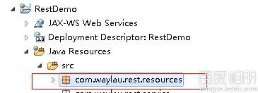

# 用 Jersey 构建 RESTful 服务 1--HelloWorld

## 一、环境

1.  Eclipse Juno R2
2.  Tomcat 7
3.  Jersey 2.x(最新 2.11 版本测试通过) 下载地址（ [`jersey.java.net/download.html`](https://jersey.java.net/download.html)）

## 二、流程

1.  Eclipse 中创建一个 Dynamic Web Project ,本例为“RestDemo”

2.  按个各人习惯建好包，本例为“com.waylau.rest.resources”

    

3.  解压 jaxrs-ri-2.7，将 api、ext、lib 文件夹下的 jar 包都放到项目的 lib 下；

    

    项目引入 jar 包

    

4.  在 resources 包下建一个 class“HelloResource”

    ```java
     package com.waylau.rest.resources;
        import javax.ws.rs.GET;
        import javax.ws.rs.Path;
        import javax.ws.rs.Produces;
        import javax.ws.rs.PathParam;
        import javax.ws.rs.core.MediaType;
        @Path("/hello")
        public class HelloResource {
            @GET @Produces(MediaType.TEXT_PLAIN)
            public String sayHello() {
                return "Hello World!" ;
            }

            @GET @Path("/{param}")
            @Produces("text/plain;charset=UTF-8")
            public String sayHelloToUTF8(@PathParam("param") String username) {
                return "Hello " + username;
            }

        } 
    ```

5.  修改 web.xml,添加基于 Servlet-的部署

    ```java
    <servlet>
        <servlet-name>Way REST Service</servlet-name> <servlet-class>org.glassfish.jersey.servlet.ServletContainer</servlet-class>
        <init-param>
        <param-name>jersey.config.server.provider.packages</param-name>
        <param-value>com.waylau.rest.resources</param-value> </init-param>
        <load-on-startup>1</load-on-startup>
    </servlet>

    <servlet-mapping>
        <servlet-name>Way REST Service</servlet-name>
        <url-pattern>/rest/*</url-pattern>
    </servlet-mapping> 
    ```

6.  项目部署到 tomcat,运行

7.  浏览器输入要访问的 uri 地址 [`localhost:8089/RestDemo/rest/hello`](http://localhost:8089/RestDemo/rest/hello),输出 Hello World!

    

    [`localhost:8089/RestDemo/rest/hello/Way%E4%BD%A0%E5%A5%BD%E5%90%97`](http://localhost:8089/RestDemo/rest/hello/Way%E4%BD%A0%E5%A5%BD%E5%90%97),输出 Hello Way 你好吗

    

参考：[`jersey.java.net/documentation/latest/user-guide.html`](https://jersey.java.net/documentation/latest/user-guide.html)

**本章源码**：[`github.com/waylau/RestDemo/tree/master/jersey-demo1-helloworld`](https://github.com/waylau/RestDemo/tree/master/jersey-demo1-helloworld)