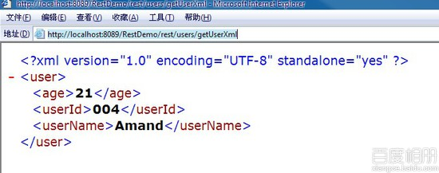
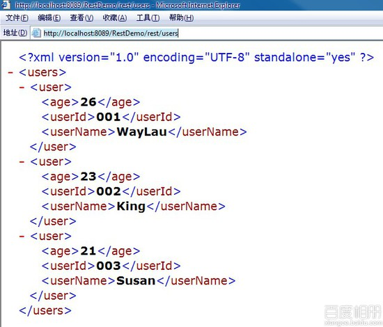

# 用 Jersey 构建 RESTful 服务 2--JAVA 对象转成 XML 输出

## 一、 总体说明

XML 和 JSON 是最为常用的数据交换格式。本例子演示如何将 java 对象，转成 XML 输出。

## 二、流程

1.  在上文的例子中，创建一个包“com.waylau.rest.bean”

2.  在该包下创建一个 JAVA 类"User"

    ```java
     package com.waylau.rest.bean;  
        import javax.xml.bind.annotation.XmlRootElement;  
        /* *
         * 用户 bean
         * @author waylau.com
         * 2014-3-17
         */  
        @XmlRootElement  
        public class User {  

            private String userId;  
            private String userName;  
            private String age;  

            public User() {};  

            public User(String userId, String userName, String age) {  
                this.userId = userId;  
                this.userName = userName;  
                this.age = age;  
            }  
            public String getUserId() {  
                return userId;  
            }  
            public void setUserId(String userId) {  
                this.userId = userId;  
            }  
            public String getUserName() {  
                return userName;  
            }  
            public void setUserName(String userName) {  
                this.userName = userName;  
            }  
            public String getAge() {  
                return age;  
            }  
            public void setAge(String age) {  
                this.age = age;  
            }  
        } 
    ```

    注意：该类上面增加了一个注解“@XmlRootElement”，在将该类转化成 XML 时，说明这个是 XML 的根节点。

3.  在“com.waylau.rest.resources”中，增加资源“UserResource“，代码如下：

    ```java
     package com.waylau.rest.resources;  

        import java.util.ArrayList;  
        import java.util.HashMap;  
        import java.util.List;  
        import java.util.Map;  

        import javax.ws.rs.Path;  
        import javax.ws.rs.Produces;  
        import javax.ws.rs.PathParam;  
        import javax.ws.rs.core.MediaType;  
        import javax.ws.rs.DELETE;  
        import javax.ws.rs.GET;  
        import javax.ws.rs.POST;  
        import javax.ws.rs.PUT;  

        import com.waylau.rest.bean.User;  

        @Path("/users")  
        public class UserResource {  
            private static Map<String,User> userMap = new HashMap<String,User>();//存储用户
             /**
             * 查询所有
             * @return
             */  
            @GET  
            @Produces(MediaType.APPLICATION_XML)  
            public List<User> getAllUsers(){       
                List<User> users = new ArrayList<User>();  
                User u1 = new User("001","WayLau","26");  
                User u2 = new User("002","King","23");  
                User u3 = new User("003","Susan","21");  

                userMap.put(u1.getUserId(), u1);  
                userMap.put(u2.getUserId(), u2);  
                userMap.put(u3.getUserId(), u3);  

                users.addAll( userMap.values() );  
                return users;  
            }  

            @GET  
            @Path("/getUserXml")  
            @Produces(MediaType.APPLICATION_XML)  
            public User getUserXml() {  
             User user  = new User();  
             user.setAge("21");  
             user.setUserId("004");  
             user.setUserName("Amand");  
             return user;  
            }  
        } 
    ```

    其中 MediaType.APPLICATION_XML 说明了是以 XML 形式输出

    在浏览器输入[`localhost:8089/RestDemo/rest/users/getUserXml`](http://localhost:8089/RestDemo/rest/users/getUserXml)，输出单个对象

    

    在浏览器输入 [`localhost:8089/RestDemo/rest/users`](http://localhost:8089/RestDemo/rest/users) 输出对象的集合

    

**本章源码**：[`github.com/waylau/RestDemo/tree/master/jersey-demo2-xml`](https://github.com/waylau/RestDemo/tree/master/jersey-demo2-xml)