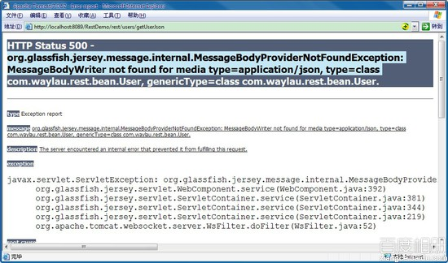
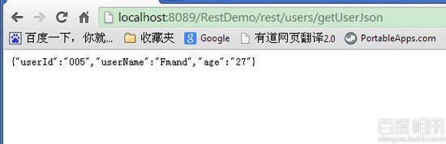

# 用 Jersey 构建 RESTful 服务 3--JAVA 对象转成 JSON 输出

## 一、 总体说明

XML 和 JSON 是最为常用的数据交换格式。本例子演示如何将 java 对象，转成 JSON 输出。

## 二、流程

1.  在上文项目中， 在“com.waylau.rest.resources.UserResource“中增加代码，代码如下：

    ```java
     @GET    
        @Path("/getUserJson")    
        @Produces(MediaType.APPLICATION_JSON)    
        public User getUserJson() {    
         User user  = new User();    
         user.setAge("27");    
         user.setUserId("005");    
         user.setUserName("Fmand");    
         return user;    
        } 
    ```

    MediaType.APPLICATION_JSON 说明输出的是 JSON 格式

2.  运行项目，浏览器输入[`localhost:8089/RestDemo/rest/users/getUserJson`](http://localhost:8089/RestDemo/rest/users/getUserJson) 期望获取到 json 的数据，此时，项目报错

    ```java
     org.glassfish.jersey.message.internal.MessageBodyProviderNotFoundException: MessageBodyWriter not found for media type=application/json, type=class com.waylau.rest.bean.User, genericType=class com.waylau.rest.bean.User.  
            at org.glassfish.jersey.message.internal.WriterInterceptorExecutor$TerminalWriterInterceptor.aroundWriteTo(WriterInterceptorExecutor.java:247)  
            at org.glassfish.jersey.message.internal.WriterInterceptorExecutor.proceed(WriterInterceptorExecutor.java:162)  
            at org.glassfish.jersey.filter.LoggingFilter.aroundWriteTo(LoggingFilter.java:293)  
            at org.glassfish.jersey.message.internal.WriterInterceptorExecutor.proceed(WriterInterceptorExecutor.java:162)  
            at org.glassfish.jersey.server.internal.JsonWithPaddingInterceptor.aroundWriteTo(JsonWithPaddingInterceptor.java:103)  
            at org.glassfish.jersey.message.internal.WriterInterceptorExecutor.proceed(WriterInterceptorExecutor.java:162)  
            at org.glassfish.jersey.server.internal.MappableExceptionWrapperInterceptor.aroundWriteTo(MappableExceptionWrapperInterceptor.java:88)  
            at org.glassfish.jersey.message.internal.WriterInterceptorExecutor.proceed(WriterInterceptorExecutor.java:162)  
            at org.glassfish.jersey.message.internal.MessageBodyFactory.writeTo(MessageBodyFactory.java:1154)  
            at org.glassfish.jersey.server.ServerRuntime$Responder.writeResponse(ServerRuntime.java:571)  
            at org.glassfish.jersey.server.ServerRuntime$Responder.processResponse(ServerRuntime.java:378)  
            at org.glassfish.jersey.server.ServerRuntime$Responder.process(ServerRuntime.java:368)  
            at org.glassfish.jersey.server.ServerRuntime$1.run(ServerRuntime.java:262) 
    ```

    

    此时，需要获取 json 转换包的支持 。 可以由多种方式实现：MOXy、JSON-P、Jackson、Jettison 等，本例为 Jackson。

3.  jackson-all-1.9.11.jar 下载地址[`wiki.fasterxml.com/JacksonDownload`](http://wiki.fasterxml.com/JacksonDownload)

4.  项目中引入 jackson-all-1.9.11.jar

5.  在“com.waylau.rest”目录下创建 RestApplication.java

    ```java
    package com.waylau.rest;  

    import org.codehaus.jackson.jaxrs.JacksonJsonProvider;  
    import org.glassfish.jersey.filter.LoggingFilter;  
    import org.glassfish.jersey.server.ResourceConfig;  

    /**
     * 应用
     * @author waylau.com
     * 2014-3-18
     */  
    public class RestApplication extends ResourceConfig {  
        public RestApplication() {  

         //服务类所在的包路径
         packages("com.waylau.rest.resources");  
         //注册 JSON 转换器
         register(JacksonJsonProvider.class);  

        }  
    } 
    ```

6.  修改 web.xml，初始化从 RestApplicaton 进入应用，如下：

    ```java
    <servlet>    
         <servlet-name>Way REST Service</servlet-name>  
         <servlet-class>org.glassfish.jersey.servlet.ServletContainer</servlet-class>  
          <init-param>  
               <param-name>javax.ws.rs.Application</param-name>  
               <param-value>com.waylau.rest.RestApplication</param-value>  
           </init-param>  

        <load-on-startup>1</load-on-startup>  
      </servlet>  

      <servlet-mapping>  
        <servlet-name>Way REST Service</servlet-name>  
        <url-pattern>/rest/*</url-pattern>  
      </servlet-mapping> 
    ```

7.  运行项目，再次访问[`localhost:8089/RestDemo/rest/users/getUserJson`](http://localhost:8089/RestDemo/rest/users/getUserJson) 即可输出 JSON 文本

    

**本章源码**：[`github.com/waylau/RestDemo/tree/master/jersey-demo3-json`](https://github.com/waylau/RestDemo/tree/master/jersey-demo3-json)