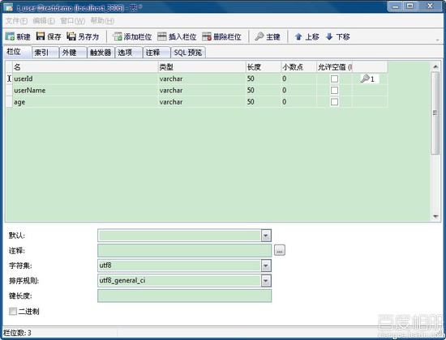
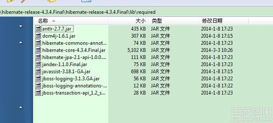
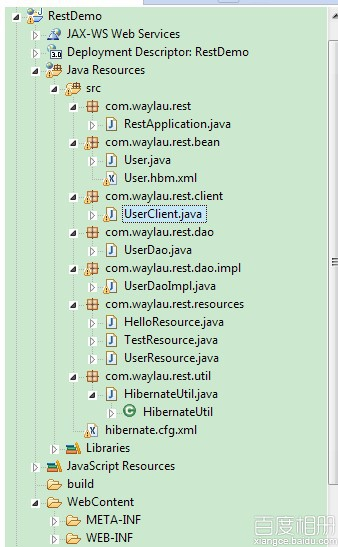

# 用 Jersey 构建 RESTful 服务 5--Jersey+MySQL5.6+Hibernate4.3

## 一、总体说明

本例运行演示了用 Jersey 构建 RESTful 服务中，如何同过 Hibernate 将数据持久化进 MySQL 的过程

## 二、环境

1.  上文的项目 RestDemo

2.  MySQL5.6 下载[`dev.mysql.com/get/Downloads/MySQL-5.6/mysql-5.6.16-win32.zip`](http://dev.mysql.com/get/Downloads/MySQL-5.6/mysql-5.6.16-win32.zip)

3.  Hibernate4.3.4 下载[`sourceforge.net/projects/hibernate/files/hibernate4/4.3.4.Final/hibernate-release-4.3.4.Final.zip`](http://sourceforge.net/projects/hibernate/files/hibernate4/4.3.4.Final/hibernate-release-4.3.4.Final.zip)

4.  Java 程序连接 MySQL 的驱动 mysql-connector-java-5.1.29-bin.jar 下载 [`dev.mysql.com/get/Downloads/Connector-J/mysql-connector-java-5.1.29.zip`](http://dev.mysql.com/get/Downloads/Connector-J/mysql-connector-java-5.1.29.zip)

## 三、数据库准备

1.  搭建 MySQL 数据库

2.  创建数据库 RestDemo ,及数据表 t_user,结构如下

    ```java
    DROP TABLE IF EXISTS `t_user`;
    CREATE TABLE `t_user` (
      `userId` varchar(50) NOT NULL,
      `userName` varchar(50) NOT NULL,
      `age` varchar(50) NOT NULL,
      PRIMARY KEY (`userId`)
    ) ENGINE=InnoDB DEFAULT CHARSET=utf8; 
    ```

    

**PS:** userId 非自增长类型，需要在业务添加

## 四、引入 Hibernate

1.  解压 Hibernate 的包，在 lib\required 文件夹下所有 jar 引入进项目

    

2.  解压 mysql-connector-java-5.1.29.zip，将 mysql-connector-java-5.1.29-bin.jar 引入进项目

3.  在项目的根目录创建 hibernate 的配置文件 hibernate.cfg.xml，内容如下：

    ```java
    <?xml version='1.0' encoding='utf-8'?>  
    <!DOCTYPE hibernate-configuration PUBLIC  
            "-//Hibernate/Hibernate Configuration DTD 3.0//EN"  
            "http://www.hibernate.org/dtd/hibernate-configuration-3.0.dtd">  

    <hibernate-configuration>  
       <session-factory>  
       <!-- Database connection settings -->  
            <property name="connection.driver_class">com.mysql.jdbc.Driver</property>  
            <property name="connection.url">jdbc:mysql://127.0.0.1:3306/RestDemo</property>  
            <property name="connection.username">root</property>  
            <property name="connection.password"></property>  

            <!-- JDBC connection pool (use the built-in) -->  
            <property name="connection.pool_size">1</property>  

            <!-- SQL dialect -->  
            <property name="dialect">org.hibernate.dialect.MySQLDialect</property>  

            <!-- Enable Hibernate's automatic session context management -->  
            <property name="current_session_context_class">thread</property>  

            <!-- Disable the second-level cache  -->  
            <property name="cache.provider_class">org.hibernate.cache.internal.NoCacheProvider</property>  

            <!-- Echo all executed SQL to stdout -->  
            <property name="show_sql">true</property>  

            <!-- Drop and re-create the database schema on startup -->  
            <property name="hbm2ddl.auto">update</property>  

            <mapping resource="com/waylau/rest/bean/User.hbm.xml"/>  

        </session-factory>  
    </hibernate-configuration> 
    ```

4.  在项目 User.java 的同个目录下，创建该类的映射文件 User.hbm.xml

    ```java
    <?xml version="1.0"?>  
    <!DOCTYPE hibernate-mapping PUBLIC  
            "-//Hibernate/Hibernate Mapping DTD 3.0//EN"  
            "http://www.hibernate.org/dtd/hibernate-mapping-3.0.dtd">  

    <hibernate-mapping package="com.waylau.rest.bean">  

        <class name="User" table="T_USER">  
            <id name="userId" column="USERID"  type="string" >  
                <generator class="assigned"/>  
            </id>  
            <property name="userName" type="string" />  
            <property name="age" type="string" />  
        </class>  

    </hibernate-mapping> 
    ```

5.  创建包 com.waylau.rest.util，在该包下创建 HibernateUtil.java

    ```java
    package com.waylau.rest.util;  

    import org.hibernate.SessionFactory;  
    import org.hibernate.boot.registry.StandardServiceRegistry;  
    import org.hibernate.boot.registry.StandardServiceRegistryBuilder;  
    import org.hibernate.cfg.Configuration;  
    /**
     * Hibernate 初始化配置工具类
     * @author waylau.com
     * 2014-3-23
     */  
    public class HibernateUtil {  
         private static Configuration configuration;  
         private static SessionFactory sessionFactory;  
         private static StandardServiceRegistry standardServiceRegistry;  
            static {  
                try {  
                 //第一步:读取 Hibernate 的配置文件  hibernamte.cfg.xml 文件
                  configuration = new Configuration().configure("hibernate.cfg.xml");          
                 //第二步:创建服务注册构建器对象，通过配置对象中加载所有的配置信息
                  StandardServiceRegistryBuilder sb = new StandardServiceRegistryBuilder();  
                  sb.applySettings(configuration.getProperties());  
                 //创建注册服务
                  standardServiceRegistry = sb.build();    
                //第三步:创建会话工厂
                  sessionFactory = configuration.buildSessionFactory(standardServiceRegistry);     
                } catch (Throwable ex) {  
                    // Make sure you log the exception, as it might be swallowed
                    System.err.println("Initial SessionFactory creation failed." + ex);  
                    throw new ExceptionInInitializerError(ex);  
                }  
            }  

            public static SessionFactory getSessionFactory() {  
                return sessionFactory;  
            }  
    } 
    ```

6.  在项目中建 com.waylau.rest.dao 包，在该包下建立 User 操作的接口 UserDao.java

    ```java
    package com.waylau.rest.dao;  

    import java.util.List;  

    import com.waylau.rest.bean.User;  

    /**
     * User Dao 接口
     * @author waylau.com
     * 2014-3-18
     */  
    public interface UserDao {  

        public User getUserById(String id);  

        public boolean deleteUserById(String id);  

        public boolean createUser(User user);  

        public boolean updateUser(User user);  

        public List<User> getAllUsers();  
    } 
    ```

7.  在项目中建 com.waylau.rest.dao.impl 包，在该包下建立 User 操作接口的实现 UserDaoImpl.java

    ```java
    package com.waylau.rest.dao.impl;  

    import java.util.List;  

    import org.hibernate.Query;  
    import org.hibernate.Session;  
    import org.hibernate.SessionFactory;  
    import org.hibernate.Transaction;  

    import com.waylau.rest.bean.User;  
    import com.waylau.rest.dao.UserDao;  
    import com.waylau.rest.util.HibernateUtil;  
    /**
     * 用户 DAO 实现
     * @author waylau.com
     * 2014-3-23
     */  
    public class UserDaoImpl implements UserDao {  

        @Override  
        public User getUserById(String id) {  
            SessionFactory sessionFactory = HibernateUtil.getSessionFactory();   
            Session s = null;  
            Transaction t = null;  
            User user = null;  
            try{  
             s = sessionFactory.openSession();  
             t = s.beginTransaction();  
             String hql = "from User where userId="+id;    
             Query query = s.createQuery(hql);    
             user = (User) query.uniqueResult();   
             t.commit();  
            }catch(Exception err){  
            t.rollback();  
            err.printStackTrace();  
            }finally{  
            s.close();  
            }  
            return user;  
        }  

        @Override  
        public boolean deleteUserById(String id) {  
            SessionFactory sessionFactory = HibernateUtil.getSessionFactory();   
            Session s = null;  
            Transaction t = null;  
            boolean flag = false;  
            try{  
             s = sessionFactory.openSession();  
             t = s.beginTransaction();  
             User user = new User();    
             user.setUserId(id);  
             s.delete(user);  
             t.commit();  
             flag = true;  
            }catch(Exception err){  
            t.rollback();  
            err.printStackTrace();  
            }finally{  
            s.close();  
            }  
            return flag;  
        }  

        @Override  
        public boolean createUser(User user) {  
            SessionFactory sessionFactory = HibernateUtil.getSessionFactory();   
            Session s = null;  
            Transaction t = null;  
            boolean flag = false;  
            try{  
             s = sessionFactory.openSession();  
             t = s.beginTransaction();  
             s.save(user);  
             t.commit();  
             flag = true;  
            }catch(Exception err){  
            t.rollback();  
            err.printStackTrace();  
            }finally{  
            s.close();  
            }  
            return flag;  
        }  

        @Override  
        public boolean updateUser(User user) {  
            SessionFactory sessionFactory = HibernateUtil.getSessionFactory();   
            Session s = null;  
            Transaction t = null;  
            boolean flag = false;  
            try{  
             s = sessionFactory.openSession();  
             t = s.beginTransaction();  
             s.update(user);  
             t.commit();  
             flag = true;  
            }catch(Exception err){  
            t.rollback();  
            err.printStackTrace();  
            }finally{  
            s.close();  
            }  
            return flag;  
        }  

        @Override  
        public List<User> getAllUsers() {  
            SessionFactory sessionFactory = HibernateUtil.getSessionFactory();   
            Session s = null;  
            Transaction t = null;  
            List<User> uesrs = null;  
            try{  
             s = sessionFactory.openSession();  
             t = s.beginTransaction();  
             String hql = "select * from t_user";    
             Query query = s.createSQLQuery(hql).addEntity(User.class);    
             query.setCacheable(true); // 设置缓存
             uesrs = query.list();    
             t.commit();  
            }catch(Exception err){  
            t.rollback();  
            err.printStackTrace();  
            }finally{  
            s.close();  
            }  
            return uesrs;  
        }  

    } 
    ```

8.  修改项目中 com.waylau.rest.resources 包下的 UserResource.java，使之前在内存中模拟 CURD 转为在数据库中实现

    ```java
    package com.waylau.rest.resources;  

    import java.util.ArrayList;  
    import java.util.List;  

    import javax.ws.rs.Path;  
    import javax.ws.rs.Produces;  
    import javax.ws.rs.Consumes;  
    import javax.ws.rs.PathParam;  
    import javax.ws.rs.core.MediaType;  
    import javax.ws.rs.DELETE;  
    import javax.ws.rs.GET;  
    import javax.ws.rs.POST;  
    import javax.ws.rs.PUT;  

    import com.waylau.rest.bean.User;  
    import com.waylau.rest.dao.impl.UserDaoImpl;  

    /**
     * 用户资源
     * @author waylau.com
     * 2014-3-19
     */  
    @Path("/users")  
    public class UserResource {  
        private UserDaoImpl userDaoImpl = new UserDaoImpl();  
        /**
         * 增加
         * @param user
         */  
        @POST  
        @Consumes({MediaType.APPLICATION_XML, MediaType.APPLICATION_JSON})  
        public void createUser(User user) {  
            userDaoImpl.createUser(user);  
        }  

        /**
         * 删除
         * @param id
         */  
        @DELETE  
        @Path("{id}")  
        public void deleteUser(@PathParam("id")String id){  
            userDaoImpl.deleteUserById(id);  
        }  

        /**
         * 修改
         * @param user
         */  
        @PUT  
        @Consumes(MediaType.APPLICATION_XML)  
        public void updateUser(User user){  
            userDaoImpl.updateUser(user);  
        }  

        /**
         * 根据 id 查询
         * @param id
         * @return
         */  
        @GET  
        @Path("{id}")  
        @Produces({MediaType.APPLICATION_XML, MediaType.APPLICATION_JSON})  
        public User getUserById(@PathParam("id") String id){  
            User u = userDaoImpl.getUserById(id);  
            return u;  
        }  

        /**
         * 查询所有
         * @return
         */  
        @GET  
        @Produces({MediaType.APPLICATION_XML, MediaType.APPLICATION_JSON})  
        public List<User> getAllUsers(){       
            List<User> users = new ArrayList<User>();     
            users = userDaoImpl.getAllUsers();  
            return users;  
        }  

    } 
    ```

## 五、运行

1.  将服务端运行后

2.  运行 UserClient 客户端，可以看到数据库已经实现增删改查

完整项目架构如下：



**本章源码**：[`github.com/waylau/RestDemo/tree/master/jersey-demo5-mysql-hibernate`](https://github.com/waylau/RestDemo/tree/master/jersey-demo5-mysql-hibernate)