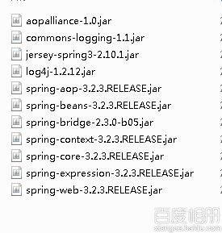

# 用 Jersey 构建 RESTful 服务 7--Jersey+SQLServer+Hibernate4.3+Spring3.2

## 一、总体说明

本例运行演示了用 Jersey 构建 RESTful 服务中，如何集成 Spring3

## 二、环境

1.  上文的项目 RestDemo
2.  Spring 及其他相关的 jar ,导入项目

    

## 三、配置

1.  根目录下下创建 Spring 的配置文件`applicationContext.xml`； 配置如下： <?xml version="1.0" encoding="UTF-8"?>

    ```java
    <beans 

           xsi:schemaLocation="http://www.springframework.org/schema/beans
      http://www.springframework.org/schema/beans/spring-beans.xsd
      http://www.springframework.org/schema/context
      http://www.springframework.org/schema/context/spring-context.xsd"
            >
        <!-- 激活那些已经在 g 容器里注册过的 bean -->    
        <context:annotation-config></context:annotation-config>

        <!-- 在容器中注入 bean -->
        <bean id="UserServiceImpl" class="com.waylau.rest.service.impl.UserServiceImpl"/>
        <bean id="UserDaoImpl" class="com.waylau.rest.dao.impl.UserDaoImpl"/>

    </beans> 
    ```

2.  在`com.waylau.rest.service`和`com.waylau.rest.service.impl`下分别增加 UserService 和 UserServiceImpl。

    `UserService.java`

    ```java
    package com.waylau.rest.service;

    import java.util.List;

    import com.waylau.rest.bean.User;

    /**
     * User Service 接口
     * @author waylau.com
     * 2014-7-25
     */
    public interface UserService {

        public User getUserById(String id);

        public boolean deleteUserById(String id);

        public boolean createUser(User user);

        public boolean updateUser(User user);

        public List<User> getAllUsers();
    } 
    ```

    `UserServiceImpl.java`

    ```java
    package com.waylau.rest.service.impl;

    import java.util.List;

    import org.springframework.beans.factory.annotation.Autowired;

    import com.waylau.rest.bean.User;
    import com.waylau.rest.dao.impl.UserDaoImpl;
    import com.waylau.rest.service.UserService;
    /**
     * User Service 接口实现
     * @author waylau.com
     * 2014-7-25
     */
    public class UserServiceImpl implements UserService {

        @Autowired
        private UserDaoImpl userDaoImpl;

        public UserServiceImpl() {
            // TODO Auto-generated constructor stub
        }

        @Override
        public User getUserById(String id) {
            return userDaoImpl.getUserById(id);
        }

        @Override
        public boolean deleteUserById(String id) {
            return userDaoImpl.deleteUserById(id);
        }

        @Override
        public boolean createUser(User user) {
            return userDaoImpl.createUser(user);
        }

        @Override
        public boolean updateUser(User user) {
            return userDaoImpl.updateUser(user);
        }

        @Override
        public List<User> getAllUsers() {
            return userDaoImpl.getAllUsers();
        }

    } 
    ```

3.  修改 `UserResource.java`

    ```java
    package com.waylau.rest.resources;

    import java.util.ArrayList;
    import java.util.List;
    import java.util.logging.Logger;

    import javax.ws.rs.Path;
    import javax.ws.rs.Produces;
    import javax.ws.rs.Consumes;
    import javax.ws.rs.PathParam;
    import javax.ws.rs.core.MediaType;
    import javax.ws.rs.DELETE;
    import javax.ws.rs.GET;
    import javax.ws.rs.POST;
    import javax.ws.rs.PUT;

    import org.springframework.beans.factory.annotation.Autowired;

    import com.waylau.rest.bean.User;
    import com.waylau.rest.service.impl.UserServiceImpl;

    /**
     * 用户资源
     * @author waylau.com
     * 2014-7-26
     */
    @Path("/users")
    public class UserResource {
        private static final Logger LOGGER = Logger.getLogger(UserResource.class.getName());

        @Autowired
        private UserServiceImpl userServiceImpl;

        public UserResource() {
            LOGGER.fine("UserResource()");
        }

        /**
         * 增加
         * @param user
         */
        @POST
        @Consumes({MediaType.APPLICATION_XML, MediaType.APPLICATION_JSON})
        public void createUser(User user) {
            userServiceImpl.createUser(user);
        }

        /**
         * 删除
         * @param id
         */
        @DELETE
        @Path("{id}")
        public void deleteUser(@PathParam("id")String id){
            userServiceImpl.deleteUserById(id);
        }

        /**
         * 修改
         * @param user
         */
        @PUT
        @Consumes(MediaType.APPLICATION_XML)
        public void updateUser(User user){
            userServiceImpl.updateUser(user);
        }

        /**
         * 根据 id 查询
         * @param id
         * @return
         */
        @GET
        @Path("{id}")
        @Produces({MediaType.APPLICATION_XML, MediaType.APPLICATION_JSON})
        public User getUserById(@PathParam("id") String id){
            User u = userServiceImpl.getUserById(id);
            return u;
        }

        /**
         * 查询所有
         * @return
         */
        @GET
        @Produces({MediaType.APPLICATION_XML, MediaType.APPLICATION_JSON})
        public List<User> getAllUsers(){     
            List<User> users = new ArrayList<User>();   
            users = userServiceImpl.getAllUsers();
            return users;
        }
    } 
    ```

4.  修改 web.xml,插入

    ```java
    <module-name>RestDemo</module-name>

    <listener>
      <listener-class>org.springframework.web.context.ContextLoaderListener</listener-class>
    </listener>

    <context-param>
      <param-name>contextConfigLocation</param-name>
      <param-value>classpath:applicationContext.xml</param-value>
    </context-param> 
    ```

## 四、运行

1.  先运行项目

2.  运行 UserClient.java 测试，控制台输出如下

    ```java
    ****增加用户 addUser****
    ****查询所有 getAllUsers****
    [{"userId":"002","userName":"sdfs","age":"23"},{"userId":"003","userName":"sdfs","age":"23"},{"userId":"004","userName":"sdfs","age":"23"},{"userId":"005","userName":"sdfs","age":"23"},{"userId":"006","userName":"Susan","age":"21"},{"userId":"007","userName":"sdfs","age":"23"},{"userId":"ds","userName":"ds","age":"ds"}]
    ****修改用户 updateUser****
    ****根据 id 查询用户****
    006Susan33
    ****查询所有 getAllUsers****
    [{"userId":"002","userName":"sdfs","age":"23"},{"userId":"003","userName":"sdfs","age":"23"},{"userId":"004","userName":"sdfs","age":"23"},{"userId":"005","userName":"sdfs","age":"23"},{"userId":"006","userName":"Susan","age":"33"},{"userId":"007","userName":"sdfs","age":"23"},{"userId":"ds","userName":"ds","age":"ds"}]
    ****删除用户****
    ****查询所有 getAllUsers****
    [{"userId":"002","userName":"sdfs","age":"23"},{"userId":"003","userName":"sdfs","age":"23"},{"userId":"004","userName":"sdfs","age":"23"},{"userId":"005","userName":"sdfs","age":"23"},{"userId":"007","userName":"sdfs","age":"23"},{"userId":"ds","userName":"ds","age":"ds"}] 
    ```

**本章源码（含 jar 包）**：[`github.com/waylau/RestDemo/tree/master/jersey-demo7-sqlserver-hibernate-spring3`](https://github.com/waylau/RestDemo/tree/master/jersey-demo7-sqlserver-hibernate-spring3)