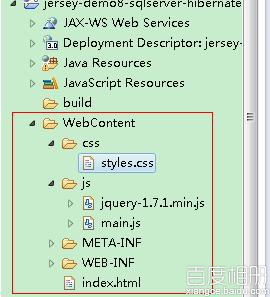
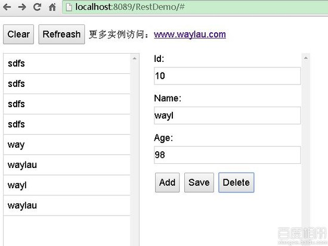

# 用 Jersey 构建 RESTful 服务 8--Jersey+SQLServer+Hibernate4.3+Spring3.2+jquery

## 一、总体说明

本例运行演示了用 Jersey 构建 RESTful 服务中，如何集成 jQuery,用 html 作为客户端访问 RESTful 服务。

## 二、环境

1.  上文的项目 RestDemo
2.  jQuery 库 ,本例为 1.7.1 版本

## 三、配置



1.  创建 jQuery 客户端的项目结构，在`WebContent`创建`js`,`css`两个目录，并把 jQuery 库 放入`js`目录下，并在该目录下创建`main,js`空文件

2.  在`WebContent`创建`index.html`:

    ```java
     <!DOCTYPE HTML>
        <html>
        <head>
        <title>jquery Demo (人员管理系统)</title>
        <meta charset="utf-8"/>
        <link rel="stylesheet" href="css/styles.css" />

        <script src="js/jquery-1.7.1.min.js"></script>
        <script src="js/main.js"></script>
        </head>

        <body>
            <div class="header">

                <button id="btnClear">Clear</button>
                <button id="btnRefreash">Refreash</button>
                更多实例访问：<a href="http://www.waylau.com" >www.waylau.com</a>
            </div>

            <div class="leftArea">
                <ul id="userList"></ul>
            </div>

            <form id="wineForm">

                <div class="mainArea">

                    <label>Id:</label> <input id="userId" name="userId" type="text"  required/>

                    <label>Name:</label> <input type="text" id="userName" name="userName" required>
                    <label>Age:</label> <input  type="text" id="age" name="age" required/>

                    <button id="btnAdd">Add</button>
                    <button id="btnSave">Save</button>
                    <button id="btnDelete">Delete</button>
                </div>

            </form>

        </body>
        </html> 
    ```

3.  修改`main.js`

    ```java
     // The root URL for the RESTful services
        var rootURL = 'http://localhost:8089/RestDemo/rest/users';

        var currentUser;

        // Retrieve wine list when application starts
        findAll();

        // Nothing to delete in initial application state
        $('#btnDelete').hide();

        $('#btnAdd').click(function() {
            addUser();
            return false;
        });

        $('#btnSave').click(function() {

            updateUser();
            return false;
        });

        $('#btnClear').click(function() {
            newUser();
            return false;
        });

        $('#btnDelete').click(function() {
            deleteUser();
            return false;
        });

        $('#userList a').live('click', function() {
            findById($(this).data('identity'));
        });

        $('#btnRefreash').click(function() {
            findAll();
            return false;
        });

        function newUser() {
            $('#btnDelete').hide();
            currentUser = {};
            renderDetails(currentUser); // Display empty form
        }

        function findAll() {
            console.log('findAll');
            $.ajax({
                type: 'GET',
                url: rootURL,
                dataType: "json", // data type of response
                success: renderList
            });
        }

        function findById(id) {
            console.log('findById: ' + id);
            $.ajax({
                type: 'GET',
                url: rootURL + '/' + id,
                dataType: "json",
                success: function(data){
                    $('#btnDelete').show();

                    console.log('findById success: ' + data.userName);
                    currentUser = data;
                    renderDetails(currentUser);
                }

            });
        }

        function addUser() {
            console.log('addUser');
            $.ajax({
                type: 'POST',
                contentType: 'application/json',
                url: rootURL,
                dataType: "json",
                data: formToJSON(),
                success: function(data, textStatus, jqXHR){
                    alert('User created successfully');
                    $('#btnDelete').show();
                    $('#userId').val(data.userId);
                },
                error: function(jqXHR, textStatus, errorThrown){
                    alert('addUser error: ' + textStatus);
                }
            });
        }

        function updateUser() {
            console.log('updateUser');
            $.ajax({
                type: 'PUT',

                contentType: 'application/json',
                url: rootURL,
                dataType: "json",
                data: formToJSON(),

                success: function(data, textStatus, jqXHR){
                    alert('User updated successfully');
                },
                error: function(jqXHR, textStatus, errorThrown){
                    alert('updateUser error: ' + textStatus);
                }
            });
        }

        function deleteUser() {
            console.log('deleteUser');
            $.ajax({
                type: 'DELETE',
                url: rootURL + '/' + $('#userId').val(),
                success: function(data, textStatus, jqXHR){
                    alert('user deleted successfully');
                },
                error: function(jqXHR, textStatus, errorThrown){
                    alert('delete user error');
                }
            });
        }

        function renderList(data) {
            // JAX-RS serializes an empty list as null, and a 'collection of one' as an object (not an 'array of one')
            var list = data == null ? [] : (data instanceof Array ? data : [data]);

            $('#userList li').remove();
            $.each(list, function(index, data) {
                $('#userList').append('<li><a href="#" data-identity="' + data.userId + '">'+data.userName+'</a></li>');
            });
        }

        function renderDetails(data) {
            $('#userId').val(data.userId);
            $('#userName').val(data.userName);
            $('#age').val(data.age);

        }

        // Helper function to serialize all the form fields into a JSON string
        function formToJSON() {
            var userId = $('#userId').val();
            return JSON.stringify({
                "userId": userId == "" ? null : userId,
                "userName": $('#userName').val(),
                "age": $('#age').val()
                });
        } 
    ```

4.  在`css`目录下创建`styles.css`文件

    ```java
     * {
          font-family: "Helvetica Neue", Helvetica, Arial, sans-serif;
          font-size: 18px;
        }

        .header {
            padding-top: 5px;

        }

        .leftArea {
            position: absolute;
            left: 10px;
            top: 70px;
            bottom: 20px;
            width: 260px;
            border:solid 1px #CCCCCC;
            overflow-y: scroll;
        }

        .mainArea {
            position: absolute;
            top: 70px;
            bottom: 20px;
            left:300px;
            overflow-y: scroll;
            width:300px;
        }

        .rightArea {
            position: absolute;
            top: 70px;
            bottom: 20px;
            left:650px;
            overflow-y: scroll;
            width:270px;
        }

        ul {
            list-style-type: none;
            padding-left: 0px;
            margin-top: 0px;
        }

        li a {
            text-decoration:none;
            display: block;
            color: #000000;
            border-bottom:solid 1px #CCCCCC;
            padding: 8px;
        }

        li a:hover {
            background-color: #4B0A1E;
            color: #BA8A92;
        }

        input, textarea {
          border:1px solid #ccc;
          min-height:30px;
          outline: none;
        }

        .mainArea input {
          margin-bottom:15px;
          margin-top:5px;
          width:280px;
        }

        textarea {
            margin-bottom:15px;
            margin-top:5px;
            height: 200px;
            width:250px;
        }

        label {
            display:block;
        }

        button {
            padding:6px;
        }

        #searchKey {
            width:160px;
        } 
    ```

## 四、运行

1.  先运行项目

2.  可以进行 CURD 操作

    

*PS*:本案例力求简单把 jquery 访问 RESTful 服务展示出来，代码只在 Chrome 上做过测试。

**本章源码**：[`github.com/waylau/RestDemo/tree/master/jersey-demo8-sqlserver-hibernate-spring3-jquery`](https://github.com/waylau/RestDemo/tree/master/jersey-demo8-sqlserver-hibernate-spring3-jquery)