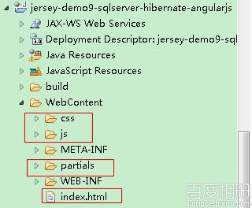
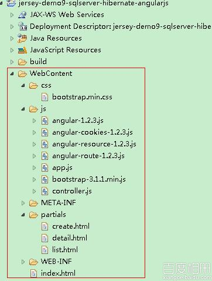
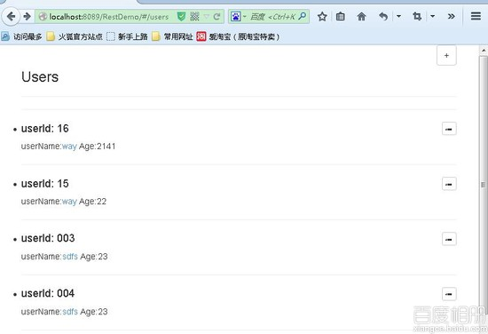
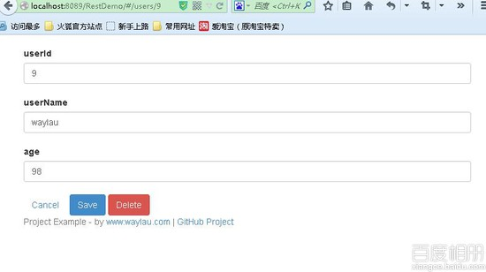

# 用 Jersey 构建 RESTful 服务 9--Jersey+SQLServer+Hibernate4.3+Spring3.2+AngularJS

## 一、总体说明

本例运行演示了用 Jersey 构建 RESTful 服务中，如何集成 angular,用 MVC 分层的方式访问 RESTful 服务。

## 二、环境

1.  上上文的项目 Demo7)
2.  angular 库 ,本例为 1.2.3 版本
3.  样式 bootstrap-3.1.1.min.js

## 三、配置

1.  完成项目结构

    

    创建相应的目录结构

    angularjs 、bootstrap 的 js,css 文件放别放入相应的目录，

    在 js 目录下再创建 `app.js` 、`controller.js`

    在 partials 目录下再创建 `create.html`、 `list.html` 、 `detail.html`

    完整目录结构如下

    

2.  在`list.html`填入如下内容,主要是显示用户列表`ng-repeat`为 angularjs 迭代器 作用是数据绑定:

    ```java
     <div class="pull-right">
            <a href="#/create" class="btn btn-default" title="Create"><span class="glyphicon glyphicon-plus"></span></a>
        </div>
        <div class="page-header">
            <h3>Users</h3>
        </div>
        <hr />
        <li ng-repeat="user in users | filter:query | orderBy:orderProp"  >

            <div class="pull-right">
               <a href="#/users/"  class="btn btn-xs btn-default" title="edit">
               <span class="glyphicon glyphicon-pencil"></span></a>
            </div>
            <h4>userId: </h4>
            <p>userName:<a href="#/users/"></a>   Age:</p>
        <hr />
        </li>

        <hr /> 
    ```

3.  修改`create.html`用来添加用户信息，`ng-model`是模型

    ```java
     <div class="page-header">
            <h3>Create</h3>
        </div>

        <form role="form" name="userForm">

         <div class="row">&nbsp;</div>
         <div class="row" ng-class="{'has-error': userForm.userId.$invalid}">
          <div class="col-md-1">
            <i ng-show="userForm.url.$error.required"
              class="glyphicon glyphicon-pencil"></i>
            <label for="urlInput">userId</label>
          </div>
          <div class="col-md-4">
            <input
              type="test"
              class="form-control" id="urlInput"
              name="userId" ng-model="user.userId" required>
          </div>
        </div>
        <div class="row">&nbsp;</div>

        <div class="row" ng-class="{'has-error': userForm.userName.$invalid}">
          <div class="col-md-1">
            <i ng-show="userForm.userName.$error.required"
              class="glyphicon glyphicon-pencil"></i>
            <label for="nameInput">userName</label>
          </div>
          <div class="col-md-4">
            <input
              type="text"
              class="form-control error" id="nameInput"
              name="userName"
              ng-model="user.userName"
              required>
          </div>      
        </div>

        <div class="row">&nbsp;</div>
        <div class="row" ng-class="{'has-error': userForm.url.$invalid}">
          <div class="col-md-1">
            <i ng-show="userForm.url.$error.required"
              class="glyphicon glyphicon-pencil"></i>
            <label for="urlInput">age</label>
          </div>
          <div class="col-md-4">
            <input
              type="text"
              class="form-control" id="urlInput"
              name="age" ng-model="user.age" required>
          </div>
        </div>

        <div class="row" ng-hide="showConfirm">
          <div class="col-md-5">
            <a href="#users" class="btn">Cancel</a>
            <button
              ng-click="add()"
              ng-disabled="isClean() || userForm.$invalid"
              class="btn btn-primary">Save</button>

          </div>
        </div> 
    ```

4.  修改`detail.html`用来显示用户信息并提供修改、删除等功能

    ```java
     <form role="form" name="userForm">

         <div class="row">&nbsp;</div>
         <div class="row" ng-class="{'has-error': userForm.userId.$invalid}">
          <div class="col-md-1">
            <i ng-show="userForm.url.$error.required"
              class="glyphicon glyphicon-pencil"></i>
            <label for="urlInput">userId</label>
          </div>
          <div class="col-md-4">
            <input
              type="test"
              class="form-control" id="urlInput"
              name="userId" ng-model="user.userId" required>
          </div>
        </div>
        <div class="row">&nbsp;</div>

        <div class="row" ng-class="{'has-error': userForm.userName.$invalid}">
          <div class="col-md-1">
            <i ng-show="userForm.userName.$error.required"
              class="glyphicon glyphicon-pencil"></i>
            <label for="nameInput">userName</label>
          </div>
          <div class="col-md-4">
            <input
              type="text"
              class="form-control error" id="nameInput"
              name="userName"
              ng-model="user.userName"
              fend-focus="focusUserNameeInput"
              required>
          </div>      
        </div>
        <div class="row">&nbsp;</div>
        <div class="row" ng-class="{'has-error': userForm.url.$invalid}">
          <div class="col-md-1">
            <i ng-show="userForm.url.$error.required"
              class="glyphicon glyphicon-pencil"></i>
            <label for="urlInput">age</label>
          </div>
          <div class="col-md-4">
            <input
              type="text"
              class="form-control" id="urlInput"
              name="age" ng-model="user.age" required>
          </div>
        </div>

        <div class="row" ng-hide="showConfirm">&nbsp;</div>

        <div class="row" ng-hide="showConfirm">
          <div class="col-md-5">
            <a href="#users" class="btn">Cancel</a>
            <button
              ng-click="save()"
              ng-disabled="isClean() || userForm.$invalid"
              class="btn btn-primary">Save</button>
            <button
              ng-click="remove()"
              ng-show="user.userId"
              class="btn btn-danger">Delete</button>
          </div>
        </div>

      </form> 
    ```

5.  修改`index.html`作为主页面,嵌入其他子页面，`ng-app`声明这个是模块，`ng-controller`说明他的控制器叫`ListCtrl`,`ng-view`用来存放子视图（页面）。

    ```java
     <!doctype html>
        <html ng-app="appMain" ng-controller="ListCtrl">
        <head>
            <meta charset="utf-8"/>
            <meta name="viewport" content="width=device-width, initial-scale=1.0">
            <link rel="stylesheet" href="css/bootstrap.min.css" type="text/css"/>
        </head>
        <body >
            <!-- navbar -->
            <div class="container ng-view"></div>
            <!-- footer -->
            <div id="footer" class="hidden-xs">
              <div class="container">
                <p class="text-muted">
                  Project Example - by <a href="http://www.waylau.com" target="_blank">www.waylau.com</a> |
                  <a href="https://github.com/waylau" target="_blank">GitHub Project</a>
                </p>
              </div>
            </div>

            <script src="js/bootstrap-3.1.1.min.js"></script>
            <script src="js/angular-1.2.3.js"></script>
            <script src="js/angular-resource-1.2.3.js"></script>
            <script src="js/angular-route-1.2.3.js"></script>
            <script src="js/angular-cookies-1.2.3.js"></script>

            <script src="js/app.js"></script>
            <script src="js/controller.js"></script>
        </body>
        </html> 
    ```

6.  修改`app.js` ，声明模块`appMain`,提供路由功能，说明了调转到哪个页面，用哪个控制器

    ```java
     angular.module('appMain', ['ngRoute']).config(['$routeProvider', function ($routeProvider) {
            $routeProvider.
                when('/users', {templateUrl: 'partials/list.html', controller: ListCtrl}).
                when('/users/:userId', {templateUrl: 'partials/detail.html', controller: DetailCtrl}).
                when('/create', {
                    templateUrl: 'partials/create.html',
                    controller: CreateController
                }).
                otherwise({redirectTo: '/users'});
        }]); 
    ```

7.  修改`controller.js`，控制器。主要是对业务逻辑的操作，常见的 CURD 功能，http 访问 RESTful 接口，并且返回数据

    ```java
     var url = 'http://localhost:8089/RestDemo/rest';

        function ListCtrl($scope, $http) {
            $http.get( url + '/users' ).success(function(data) {
                $scope.users = data;
            });

            $scope.orderProp = 'age';
        }

        function DetailCtrl($scope, $routeParams, $http) {

            $http.get( url + '/users/'+$routeParams.userId).success(function(data) {
                $scope.user = data;
            });

            $scope.save = function() {
                $http.put( url + '/users',  $scope.user).
                success(function(data, status, headers, config){
                    $location.path('/');
                }).error(function(data, status, headers, config){
                    alert("error"+status);
                }) ;
            };

            $scope.remove =  function(){
                $http({
                    method:'DELETE',
                    url: url + '/users/'+  $scope.user.userId ,
                })
                .success(function(data, status, headers, config){
                    $location.path('/');
                }).error(function(data, status, headers, config){
                    alert("error"+status);
                }) ;
            };
        }

        function CreateController($scope, $http) {

            $scope.add = function() {
                $http.post( url + '/users',  $scope.user).
                success(function(data, status, headers, config){
                    $location.path('/');
                }).error(function(data, status, headers, config){
                    alert("error"+status);
                }) ;
            };
        } 
    ```

## 四、运行

1.  先运行项目

2.  可以进行 CURD 操作

    

    

*PS*:本案例力求简单把 angularjs 访问 RESTful 服务展示出来，在 Chrome,firefox,IE 上做过测试。

**本章源码**：jersey-demo9-sqlserver-hibernate-spring3-angularjs