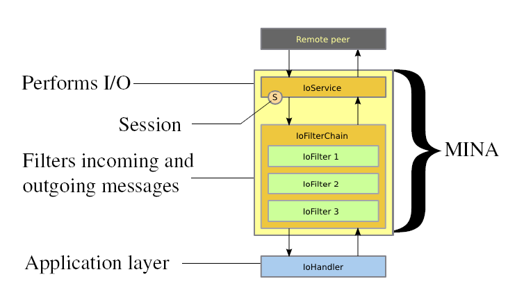

# Chapter 1 - 开始

# 开始

本章中，我们将给你一个初步的概念，关于什么是 MINA、什么是 NIO、为什么我们在 NIO 之上开发了一个框架以及你会在其中了解到什么等等。我们也将会给你演示如何运行一个非常简单的 MINA 服务器的例子。

# NIO 总览

NIO API 是由 Java 1.4 引入的，被广泛用于各种应用。NIO API 封装了 IO 非阻塞操作。

*首先，最好了解一下 MINA 是基于 NIO 1 写的。Java 7 设计了一个新版本 NIO-2，(因为我们基于 NIO 1) 我们并没有从这一版本 (NIO-2) 所带来的新加功能中获益。*

*也有必要了解到 NIO 中的 N 意思是 New，但是我们在很多地方将使用 Non-Blocking (非阻塞) 术语。NIO-2 应该被视为一个 New New I/O...*

java.nio.* 包包含了以下关键构造

*   Buffers (缓冲) - 数据容器
*   Chartsets (字符集) - 字节和 Unicode 码的翻译容器
*   Channels (通道) - 表示实体 I/O 操作的连接
*   Selectors (选择器) - 提供可选择的、多路非阻塞 IO
*   Regexps (正则表达式) - 提供一些操作正则表达式的工具

我们在 MINA 框架中最感兴趣的是 Channels (通道)、 *Selectors* (选择器) 以及 Buffers (缓冲)，除非我们想要对用户隐藏这些元素。

本用户指南因此将把重点放在基于这些内部组件构建的每个对象上。

## NIO vs BIO

很有必要来了解一下这两个 API 之间的差别。BIO，或者叫做 Blocking IO，依赖于用于阻塞模式的普通套接字：在你在套接字上进行读、写或者任何操作的时候，被调用的操作将会一直阻塞住调用者直到操作结束。

在某些情况下，能够调用这些操作是很重要的，并且希望被调用的操作在其操作结束之后能够通知调用者：这样调用者在这段时间之内可以做一些其他的事情。

这也是在你具有众多连接的套接字时 NIO 所能提供的一个更好的方式的地方：你无须为每个连接创建一个特定的线程，你仅仅需要很少的几个来做同样事情的线程。

如果你想获得涵盖有 NIO 的更多信息，互联网上有很多相关的不错的文章，也有一些关于这方面内容的出版的书籍。

# 为何使用 MINA

写网络应用常常被视作一种高负担但低水平的开发。这是一个不经常为程序员所学习或者了解的领域，这可能是因为这些内容是在很久以前在学校里学过但都忘光了，也可能是因为这一网络层的复杂性常常被更高层的传输层所隐藏以致你从来没有深入它。

补充一点，当涉及到异步 IO 时，一个额外的复杂的层出场了：时间。

BIO (Blocking IO，阻塞 IO) 和 NIO (Non-Blocking IO，非阻塞 IO) 之间的最大的区别在于在 BIO 中，你发送了一个请求，然后你将在得到回复之前一直等待。在服务器端，这意味着一个线程可能会涉及到任何进入的连接，因此你不需要应对多路复用连接的复杂性。另一方面，在 NIO 中，你必须应对非阻塞系统的同步特性，这意味着在一些事件发生时你的应用会被调用。在 NIO 中，你无需调用了以后等待一个结果，你发送一条命令之后，结果就绪了你会被通知。

## 框架的需求

考虑到这些不同，以及大多数应用程序在调用网络层的时候通常会期望一个阻塞模式，最好的解决方案就是通过写一个阻塞模式的模仿框架来隐藏掉这一表象。这就是 MINA 所做的事情！

但是 MINA 做的事情不仅于此。它为需要通过 TCP、UDP 或者任何机制通信的应用提供了一个通用 IO 视觉。如果我们仅仅考虑 TCP 或者 UDP，一个是有连接的协议 (TCP) 另一个是无连接的 (UDP)。MINA 将这种差异掩盖起来，以让你关注于对你的应用很重要的两部分：实用的代码和应用协议的编码/解码。

MINA 不仅仅处理 TCP 和 UDP，它也使用 VmpPipe 或者 APR 提供了一个串行通信 (RSC232) 之上的一层。

最后，很重要的是，MINA 是一个专门设计既能工作在客户端又能工作在服务器端的网络框架。写一个服务器的关键在于具有一个可扩展性的系统，这样可以灵活地满足服务器需求，根据性能和内存使用：这就是 MINA 的优势，使你的服务器开发变得容易。

## 何时使用 MINA？

这是个有趣的话题！MINA 并不期望在任何情况下都是最好的选择。在考虑使用 MINA 之前要思考几个要素：

*   易于使用。在你没有特别性能要求时，MINA 会是一个好的选择，因为它可以让你轻松地开发一个服务器或者客户端，在 BIO 或者 NIO 之上写同样的应用时不需要应付各种参数和用例。只需要几十行代码就可以写你的服务器，减少一些你可能会落入的陷阱。
*   高并发的用户量。 BIO 明显地要比 NIO 快。这点使得 30% 的用户喜欢 BIO。对于数千个用户连接的情况确实如此，但是一旦达到某个点，BIO 方式将会停止扩展，你无法使用一个线程一个用户的方式来处理上百万用户的并发。NIO 可以。现在，另一方面是，相对于你的应用所消耗的时间，你的代码中花在 MINA 部分的时间实际可能是微不足道的。在某种情况下，不需要花费更多时间和精力来写一个更快的网络层以获得些许提升的目标。
*   被证明的系统。MINA 已被全球数以万计的应用所使用。也有一些基于 MINA 的 Apache 项目，而且它们工作的相当好。这就是某种形式的担保，你不需要为你网络传输层的实现的一些神秘的错误而花费大量的时间。
*   现有协议的支持。MINA 附带有对各种现有协议的实现：HTTP、XML、TCP、LDAP、DHCP、NTP、DNS、XMPP、SSH、FTP ...在某种情况下，MINA 不仅可以作为一个 NIO 框架，也可以作为一个具有各种协议实现的网络传输层。MINA 近期要推出的新特性之一就是提供一个你可以使用现有的协议的集合。

# 特性

MINA 是一个简单但功能齐全的网络应用框架，它提供：

*   为不同的传输类型统一 API：
    *   基于 Java NIO 的 TCP/IP 和 UDP/IP
    *   基于 RXTX 的 串行通信 (RS232)
    *   In-VM 通道通信
    *   你可以实现你自己的！
*   过滤器接口作为扩展点；类似于 Servlet 过滤器
*   低层和高层 API：
    *   低层：使用 ByteBuffers
    *   高层：使用用户定义的消息对象和编解码器
*   高可定制化的线程模型：
    *   单个线程
    *   一个线程池
    *   多个线程池 (比如 SEDA)
*   使用 Java 5 SSLEngine 的开箱即用的 SSL · TLS · StartTLS 支持
*   超负载保护和流量调节
*   使用模拟对象单元测试
*   JMX 可管理性
*   使用 StreamIoHandler 的基于流的 I/O 支持
*   知名容器诸如 PicoContainer 和 Spring 的集成
*   从 Netty 的平滑迁移，Netty 是 Apache MINA 的一个祖先

# 开始的步骤

我们将通过运行一个 MINA 包提供的很简单的例子给你演示使用 MINA 是多么简单。

想要在你的应用中使用 MINA 的第一件事是要设置环境。我们将描述你需要安装什么，以及如何运行一个 MINA 程序。没啥大不了的，先来体验一下 MINA 吧 ...

## 下载

首先，你需要从[下载区](http://mina.apache.org/mina-project/downloads.html)下载到最新 MINA 发布版。建议选择最新版，除非你有非常好的理由不这么做 ...

一般来说，如果你要使用 Maven 来构建你的项目，你甚至不需要下载任何东西，你只需依赖进一个包含了 MINA 库的 repository：也就是说你只需告诉 Maven pom 你需要使用 MINA 包。

## 里边是什么

下载完成后，将 tar.gz 或 zip 文件的内容释放到本地磁盘。下载的压缩文件具有以下内容。

在 UNIX 系统，输入：

```java
$ tar xzpf apache-mina-2.0.7-tar.gz 
```

你将会在 apache-mina-2.0.7 目录下得到以下内容：

```java
 |
 +- dist
 +- docs
 +- lib
 +- src
 +- LICENSE.txt
 +- LICENSE.jzlib.txt
 +- LICENSE.ognl.txt
 +- LICENSE.slf4j.txt
 +- LICENSE.springframework.txt
 +- NOTICE.txt 
```

## 内容详情

*   dist - 包含了 MINA 库代码的 jar 包
*   docs - 包含了 API 文档和代码参照
*   lib - 包含了使用 MINA 所需要的所有 jar 包

除此之外，基目录下还有两个许可和公告文件。

## 运行你的第一个 MINA 程序

下载完发布版之后，让我们运行一下发布版附带的第一个 MINA 例子吧。

将以下包放进 classpath

*   mina-core-2.0.7.jar
*   mina-example-2.0.7.jar
*   slf4j-api-1.6.6.jar
*   slf4j-log4j12-1.6.6.jar
*   log4j-1.2.17.jar

*日志提示:Log4J 1.2 用户：slf4j-api.jar、slf4j-log4j12.jar 以及 Log4J 1.2.x* Log4J 1.3 用户：slf4j-api.jar、slf4j-log4j13.jar，以及 Log4J 1.3.x *java.util.logging 用户：slf4j-api.jar 和 slf4j-jdk14.jar。重要提示：请确认你使用了匹配于你的日志框架的正确的 slf4j-*.jar。例如，slf4j-log4j12.jar 和 log4j-1.3.x.jar 不能够同时使用，否则会发生故障。如果你不需要一个日志框架，你可以使用没有日志的 slf4j-nop.jar 或者仅有最基本日志的 slf4j-simple.jar。

在命令行中输入以下命令：

```java
$ java org.apache.mina.example.gettingstarted.timeserver.MinaTimeServer 
```

这将启动服务器。现在 telnet 将会看到程序已启动。

输入以下命令来 telnet：

```java
telnet 127.0.0.1 9123 
```

现在我们已经运行了第一个 MINA 程序。请试着运行 MINA 所附带的其他一些例子程序。

# 总结

在本章中，我们了解了基于 MINA 的客户端以及服务器端的应用体系。我们还涉及了 TCP 服务端/客户端、UDP 服务器端和客户端的例子实现。

在接下来的章节中我们将会讨论 MINA 的核心结构以及一些高级主题。

# Chapter 2 - 基础

# 基础

在第一章中，我们对 Apache MINA 有了一个基本认识。本章中，我们将继续认识一下客户端/服务器端结构以及一个基于 MINA 的服务器或者客户端的工作详情。

我们也将展示一些很简单的，基于 TCP 和 UDP 的服务器和客户端的例子。

# 应用架构

问的最多的问题："一个基于 MINA 的应用看起来像什么"？本小节我们将来了解一下基于 MINA 的应用架构。我们收集了一些基于 MINA 的演示信息。

架构鸟瞰图


这里，我们可以看到，MINA 是你的应用程序 (可能是一个客户端应用或者一个服务器端应用) 和基础网络层之间的粘合剂，可以基于 TCP、UDP、in-VM 通信甚至一个客户端的 RS-232C 串行协议。

你要做的仅仅是在 MINA 之上设计你自己的应用实现，而无需处理网络层的那些复杂业务。

现在我们再深入细节探讨一下。下图演示了 MINA 内部的更多细节，这正是每个 MINA 组件做的事情：



(上图来自 Emmanuel Lécharny 简报 [MINA in real life (ApacheCon EU 2009)](http://mina.apache.org/staticresources/pdfs/Mina_in_real_life_ASEU-2009.pdf))

概况来讲，基于 MINA 的应用划分为三个层次：

*   I/O Service (I/O 服务) - 具体 I/O 操作
*   I/O Filter Chain (I/O 过滤器链) - 将字节过滤/转换为想要的数据结构。反之亦然
*   I/O Handler (I/O 处理器) - 这里实现实际的业务逻辑

因此，要想创建一个基于 MINA 的应用，你需要：

1.  创建一个 I/O service - 从已存在的可用 service (*Acceptor) 中挑选一个或者创建你自己的
2.  创建一个 Filter Chain - 从现有 Filter 中挑选，或者创建一个用于转换请求/响应的自定义 Filter
3.  创建一个 I/O Handler - 处理不同消息时编写具体业务逻辑

具体创建基本就是如此。

接下来我们会对服务器端架构以及客户端架构进行更加深入阅读。

当然，MINA 提供的东东不仅于此，你可能会注意其他的一些方面的内容，比如消息加密/解密，网络配置如何扩大规模，等等... 我们在以后的几章中会对这些方面进一步讨论。

# 服务端架构

前面我们披露了基于 MINA 的应用架构。现在我们来关注一下服务器端架构。从根本上说，服务器端监听一个端口以获得连入的请求，将其进行处理然后发送回复。服务器端还会为每个客户端 (无论是基于 TCP 还是基于 UDP 协议的) 创建并维护一个 session，详见 Chapter 4 - Session。


*   I/O Acceptor 监听网络以获取连入的连接或者包
*   对于一个新的连接，一个新的 session 会被创建，之后所有来自该 IP 地址/端口号组合的请求会在同一 session 中处理
*   在一个 session 中接收到的所有包，将穿越上图中所示的 Filter Chain (过滤器链)。过滤器可以被用于修正包的内容 (比如转化为对象，添加或者删除信息等等)。对于从原始字节到高层对象的相互转换，PacketEncoder/Decoder 相当有用。
*   包或转化来的对象最终交给 IOHandler。IOHandler 可以用于实现各种具体业务需求。

## session 的创建

只要一个客户端连接到了 MINA 服务器端，我们就要创建一个新的 session 以存放持久化数据。即使协议还没连接上，也要创建这么一个 session。

## 传入的消息处理

现在我们来解释 MINA 对连入消息的处理。

假定 session 已被创建，新传入的消息将导致一个 selector 被唤醒。

# 客户端架构

前面我们对基于 MINA 的服务端架构有了一个大体认识，现在我们看一下客户端的情况。客户端需要连接到一个服务端，发送消息并处理响应


*   客户端首先创建一个 IOConnector (用以连接 Socket 的 MINA Construct （构件）)，开启一个服务器的绑定
*   在连接创建时，一个 Session 会被创建并关联到该连接
*   应用或者客户端写入 Session，导致数据在穿越 Filter Chain (过滤器链) 后被发送给服务器端
*   所有接收自服务器端的响应或者消息穿越 Filter Chain (过滤器链) 后由 IOHandler 接收并处理

# TCP Server 示例

接下来的教程介绍构建基于 MINA 的应用的过程。这个教程介绍的是构建一个时间服务器。本教程需要以下先决条件：

*   MINA 2.x Core
*   JDK 1.5 或更高
*   SLF4J 1.3.0 或更高
    *   Log4J 1.2 用户：slf4j-api.jar、slf4j-log4j12.jar 和 Log4J 1.2.x
    *   Log4J 1.3 用户：slf4j-api.jar、slf4j-log4j13.jar 和 Log4J 1.3.x
    *   java.util.logging 用户：slf4j-api.jar 和 slf4j-jdk14.jar
    *   重要：请确认你用的是和你的日志框架匹配的 slf4j-*.jar

例如，slf4j-log4j12.jar 和 log4j-1.3.x.jar 一起使用的话，将会发生故障

我们已经在 Windows 2000 professional 和 linux 之上对程序进行了测试。如果你在运行本程序时遇到任何问题，不要犹豫请[联系我们](http://mina.apache.org/contact.html)，让我们通知 MINA 的开发人员。另外，本教程尽量保留了独立的开发环境 (IDE、编辑器...等等)。本教程示例适用于你所喜爱的任何开发环境。篇幅所限，本文省略掉了关于程序的编译命令以及执行步骤。如果你在编译或执行 Java 程序时需要帮助，请参考 [Java 教程](http://docs.oracle.com/javase/tutorial/)。

## 编写 MINA 时间服务器

我们以创建一个叫做 MinaTimeServer.java 的文件开始。初始化代码如下：

```java
public class MinaTimeServer {
    public static void main(String[] args) {
        // code will go here next
    }
} 
```

这段程序对所有人来说都很简单明了。我们简单定义了一个用于启动程序的 main 方法。现在，我们开始添加组成我们服务器的代码。首先，我们需要一个用于监听传入连接的对象。因为本程序基于 TCP/IP，我们在程序中添加了 SocketAcceptor。

import org.apache.mina.transport.socket.nio.NioSocketAcceptor;

```java
public class MinaTimeServer
{
    public static void main( String[] args )
    {
        IoAcceptor acceptor = new NioSocketAcceptor();
    }
} 
```

NioSocketAcceptor 类就绪了，我们继续定义处理类并绑定 NioSocketAcceptor 到一个端口：

```java
import java.net.InetSocketAddress;

import org.apache.mina.core.service.IoAcceptor;
import org.apache.mina.transport.socket.nio.NioSocketAcceptor;

public class MinaTimeServer
{
    private static final int PORT = 9123;
    public static void main( String[] args ) throws IOException
    {
        IoAcceptor acceptor = new NioSocketAcceptor();
        acceptor.bind( new InetSocketAddress(PORT) );
    }
} 
```

如你所见，有一个关于 acceptor.setLocalAddress( new InetSocketAddress(PORT) ); 的调用。这个方法定义了这一服务器要监听到的主机和端口。最后一个方法是 IoAcceptor.bind() 调用。这个方法将会绑定到指定端口并开始处理远程客户端请求。

接下来我们在配置中添加一个过滤器。这个过滤器将会日志记录所有信息，比如 session 的新建、接收到的消息、发送的消息、session 的关闭。接下来的过滤器是一个 ProtocolCodecFilter。这个过滤器将会把二进制或者协议特定的数据翻译为消息对象，反之亦然。我们使用一个现有的 TextLine 工厂因为它将为你处理基于文本的消息 (你无须去编写 codec 部分)。

```java
import java.io.IOException;
import java.net.InetSocketAddress;
import java.nio.charset.Charset;

import org.apache.mina.core.service.IoAcceptor;
import org.apache.mina.filter.codec.ProtocolCodecFilter;
import org.apache.mina.filter.codec.textline.TextLineCodecFactory;
import org.apache.mina.filter.logging.LoggingFilter;
import org.apache.mina.transport.socket.nio.NioSocketAcceptor;

public class MinaTimeServer
{
    public static void main( String[] args )
    {
        IoAcceptor acceptor = new NioSocketAcceptor();
        acceptor.getFilterChain().addLast( "logger", new LoggingFilter() );
        acceptor.getFilterChain().addLast( "codec", new ProtocolCodecFilter( new TextLineCodecFactory( Charset.forName( "UTF-8" ))));
        acceptor.bind( new InetSocketAddress(PORT) );
    }
} 
```

接下来，我们将定义用于服务客户端连接和当前时间的请求的处理器。处理器类是一个必须实现 IoHandler 接口的类。对于几乎所有的使用 MINA 的程序，这里都会变成程序的主要工作所在，因为它将服务所有来自客户端的请求。本文我们将扩展 IoHandlerAdapter 类。这个类遵循了[适配器设计模式](http://en.wikipedia.org/wiki/Adapter_pattern)，简化了需要为满足在一个类中传递实现了 IoHandler 接口的需求而要编写的代码量。

```java
import java.net.InetSocketAddress;
import java.nio.charset.Charset;

import org.apache.mina.core.service.IoAcceptor;
import org.apache.mina.filter.codec.ProtocolCodecFilter;
import org.apache.mina.filter.codec.textline.TextLineCodecFactory;
import org.apache.mina.filter.logging.LoggingFilter;
import org.apache.mina.transport.socket.nio.NioSocketAcceptor;

public class MinaTimeServer
{
    public static void main( String[] args ) throws IOException
    {
        IoAcceptor acceptor = new NioSocketAcceptor();
        acceptor.getFilterChain().addLast( "logger", new LoggingFilter() );
        acceptor.getFilterChain().addLast( "codec", new ProtocolCodecFilter( new TextLineCodecFactory( Charset.forName( "UTF-8" ))));
        acceptor.setHandler(  new TimeServerHandler() );
        acceptor.bind( new InetSocketAddress(PORT) );
    }
} 
```

现在我们对 NioSocketAcceptor 中的配置进行添加。这将允许我们为用于接收客户端连接的 socket 进行 socket 特有的设置。

```java
import java.net.InetSocketAddress;
import java.nio.charset.Charset;

import org.apache.mina.core.session.IdleStatus;
import org.apache.mina.core.service.IoAcceptor;
import org.apache.mina.filter.codec.ProtocolCodecFilter;
import org.apache.mina.filter.codec.textline.TextLineCodecFactory;
import org.apache.mina.filter.logging.LoggingFilter;
import org.apache.mina.transport.socket.nio.NioSocketAcceptor;

public class MinaTimeServer
{
    public static void main( String[] args ) throws IOException
    {
        IoAcceptor acceptor = new NioSocketAcceptor();
        acceptor.getFilterChain().addLast( "logger", new LoggingFilter() );
        acceptor.getFilterChain().addLast( "codec", new ProtocolCodecFilter( new TextLineCodecFactory( Charset.forName( "UTF-8" ))));
        acceptor.setHandler(  new TimeServerHandler() );
        acceptor.getSessionConfig().setReadBufferSize( 2048 );
        acceptor.getSessionConfig().setIdleTime( IdleStatus.BOTH_IDLE, 10 );
        acceptor.bind( new InetSocketAddress(PORT) );
    }
} 
```

MinaTimeServer 类中新加了两行。这些方法设置了 IoHandler，为 session 设置了输入缓冲区大小以及 idle 属性。指定缓冲区大小以通知底层操作系统为传入的数据分配多少空间。第二行指定了什么时候检查空闲 session。在对 setIdleTime 的调用中，第一个参数定义了再断定 session 是否闲置时要检查的行为，第二个参数定义了在 session 被视为空闲之前以毫秒为单位的时间长度内必须发生。

处理器代码如下所示：

```java
import java.util.Date;

import org.apache.mina.core.session.IdleStatus;
import org.apache.mina.core.service.IoHandlerAdapter;
import org.apache.mina.core.session.IoSession;

public class TimeServerHandler extends IoHandlerAdapter
{
    @Override
    public void exceptionCaught( IoSession session, Throwable cause ) throws Exception
    {
        cause.printStackTrace();
    }
    @Override
    public void messageReceived( IoSession session, Object message ) throws Exception
    {
        String str = message.toString();
        if( str.trim().equalsIgnoreCase("quit") ) {
            session.close();
            return;
        }
        Date date = new Date();
        session.write( date.toString() );
        System.out.println("Message written...");
    }
    @Override
    public void sessionIdle( IoSession session, IdleStatus status ) throws Exception
    {
        System.out.println( "IDLE " + session.getIdleCount( status ));
    }
} 
```

这个类中所用的方法是为 exceptionCaught、messageReceived 和 sessionIdle。exceptionCaught 应该总是在处理器中进行定义，以处理正常的远程连接过程时抛出的异常。如果这一方法没有定义，可能无法正常报告异常。

exceptionCaught 方法将会对错误和 session 关闭进行简单 stack trace 打印。对于更多的程序，这将是常规，除非处理器能够从异常情况下进行恢复。

messageReceived 方法会从客户端接收数据并将当前时间回写给客户端。如果接收自客户端的消息是单词 "quit"，那么当前 session 将被关闭。这一方法也会向客户端打印输出当前时间。取决于你所使用的协议编解码器，传递到这一方法的对象 (第二个参数) 会有所不同，就和你传给 session.write(Object) 方法的对象一样。如果你不定义一个协议编码器，你很可能会接收到一个 IoBuffer 对象，而且被要求写出一个 IoBuffer 对象。

一旦 session 保持空闲状态到达 acceptor.getSessionConfig().setIdleTime( IdleStatus.BOTH_IDLE, 10 ); 所定义的时间长度，sessionIdle 方法会被调用。

剩下的工作就是定义服务器端将要监听的 socket 地址，并进行启动服务的调用。代码如下所示：

```java
import java.io.IOException;
import java.net.InetSocketAddress;
import java.nio.charset.Charset;

import org.apache.mina.core.service.IoAcceptor;
import org.apache.mina.core.session.IdleStatus;
import org.apache.mina.filter.codec.ProtocolCodecFilter;
import org.apache.mina.filter.codec.textline.TextLineCodecFactory;
import org.apache.mina.filter.logging.LoggingFilter;
import org.apache.mina.transport.socket.nio.NioSocketAcceptor;

public class MinaTimeServer
{
    private static final int PORT = 9123;
    public static void main( String[] args ) throws IOException
    {
        IoAcceptor acceptor = new NioSocketAcceptor();
        acceptor.getFilterChain().addLast( "logger", new LoggingFilter() );
        acceptor.getFilterChain().addLast( "codec", new ProtocolCodecFilter( new TextLineCodecFactory( Charset.forName( "UTF-8" ))));
        acceptor.setHandler( new TimeServerHandler() );
        acceptor.getSessionConfig().setReadBufferSize( 2048 );
        acceptor.getSessionConfig().setIdleTime( IdleStatus.BOTH_IDLE, 10 );
        acceptor.bind( new InetSocketAddress(PORT) );
    }
} 
```

## 测试时间服务器

现在我们开始对程序进行编译。你编译好程序以后你就可以运行它了 ，你可以测试将会发生什么。测试程序最简单的方法就是启动这个程序，然后对程序进行 telnet：

| 客户端输出 | 服务端输出 |
| --- | --- |
| user@myhost:~> telnet 127.0.0.1 9123 Trying 127.0.0.1...
Connected to 127.0.0.1\.
Escape character is '^]'.
hello
Wed Oct 17 23:23:36 EDT 2007
quit
Connection closed by foreign host.
user@myhost:~> | MINA Time server started. Message written... |


## 接下来是什么？

请访问我们的文档页面以查找更多资源。当然你也可以继续去阅读其他教程。

*译者注：翻译版本的项目源码见 [`github.com/waylau/apache-mina-2-user-guide-demos`](https://github.com/waylau/apache-mina-2-user-guide-demos) 中的`com.waylau.mina.demo.time`包下*

# TCP Client 示例

在上文中我们已经了解了客户端架构。现在我们将展示一个客户端实现的示例。

我们将使用 [Sumup Client](http://mina.apache.org/mina-project/xref/org/apache/mina/example/sumup/Client.html) 作为一个参考实现。

我们将移除掉样板代码并专注于重要结构上。以下是为客户端代码：

```java
public static void main(String[] args) throws Throwable {
    NioSocketConnector connector = new NioSocketConnector();
    connector.setConnectTimeoutMillis(CONNECT_TIMEOUT);

    if (USE_CUSTOM_CODEC) {
    connector.getFilterChain().addLast("codec",
        new ProtocolCodecFilter(new SumUpProtocolCodecFactory(false)));
    } else {
        connector.getFilterChain().addLast("codec",
            new ProtocolCodecFilter(new ObjectSerializationCodecFactory()));
    }

    connector.getFilterChain().addLast("logger", new LoggingFilter());
    connector.setHandler(new ClientSessionHandler(values));
    IoSession session;

    for (;;) {
        try {
            ConnectFuture future = connector.connect(new InetSocketAddress(HOSTNAME, PORT));
            future.awaitUninterruptibly();
            session = future.getSession();
            break;
        } catch (RuntimeIoException e) {
            System.err.println("Failed to connect.");
            e.printStackTrace();
            Thread.sleep(5000);
        }
    }

    // wait until the summation is done
    session.getCloseFuture().awaitUninterruptibly();
    connector.dispose();
} 
```

要构建一个客户端，我们需要做以下事情：

*   创建一个 Connector
*   创建一个 Filter Chain
*   创建一个 IOHandler 并添加到 Connector
*   绑定到服务器

下面解释每个细节

## 创建一个 Connector

```java
NioSocketConnector connector = new NioSocketConnector(); 
```

现在，我们已经创建了一个 NIO Socket 连接器

## 创建一个 Filter Chain

```java
if (USE_CUSTOM_CODEC) {
    connector.getFilterChain().addLast("codec",
        new ProtocolCodecFilter(new SumUpProtocolCodecFactory(false)));
} else {
    connector.getFilterChain().addLast("codec",
        new ProtocolCodecFilter(new ObjectSerializationCodecFactory()));
} 
```

我们为 Connector 的 Filter Chain 添加了一些过滤器。这里我们添加的是一个 ProtocolCodec 到过滤器链。

## 创建 IOHandler

```java
connector.setHandler(new ClientSessionHandler(values)); 
```

这里我们创建了一个 [ClientSessionHandler](http://mina.apache.org/mina-project/xref/org/apache/mina/example/sumup/ClientSessionHandler.html) 的实例并将其设置为 Connector 的处理器。

## 绑定到服务器

```java
IoSession session;

for (;;) {
    try {
        ConnectFuture future = connector.connect(new InetSocketAddress(HOSTNAME, PORT));
        future.awaitUninterruptibly();
        session = future.getSession();
        break;
    } catch (RuntimeIoException e) {
        System.err.println("Failed to connect.");
        e.printStackTrace();
        Thread.sleep(5000);
    }
} 
```

这是最重要的部分。我们将连接到远程服务器。因为是异步连接任务，我们使用了 [ConnectFuture](http://mina.apache.org/mina-project/xref/org/apache/mina/core/future/ConnectFuture.html) 来了解何时连接完成。一旦连接完成，我们将得到相关联的 [IoSession](http://mina.apache.org/mina-project/xref/org/apache/mina/core/session/IoSession.html)。要向服务器端发送任何消息，我们都要写入 session。所有来自服务器端的响应或者消息都将穿越 Filter chain 并最终由 IoHandler 处理。

*译者注：翻译版本的项目源码见 [`github.com/waylau/apache-mina-2-user-guide-demos`](https://github.com/waylau/apache-mina-2-user-guide-demos) 中的`com.waylau.mina.demo.sumup`包下*

# UDP Server 示例

现在我们看一下 [org.apache.mina.example.udp](http://mina.apache.org/mina-project/xref/org/apache/mina/example/udp/package-summary.html) 包里的代码。简单起见，我们将只专注于 MINA 相关构建方面的东西。

*译者注：翻译版本的项目源码见 [`github.com/waylau/apache-mina-2-user-guide-demos`](https://github.com/waylau/apache-mina-2-user-guide-demos) 中的`com.waylau.mina.demo.udp`包下*

要构建服务器我们需要做以下事情：

1.  创建一个 Datagram Socket 以监听连入的客户端请求 (参考 [MemoryMonitor.java](http://mina.apache.org/mina-project/xref/org/apache/mina/example/udp/MemoryMonitor.html))

2.  创建一个 IoHandler 以处理 MINA 框架生成的事件 (参考 [MemoryMonitorHandler.java](http://mina.apache.org/mina-project/xref/org/apache/mina/example/udp/MemoryMonitorHandler.html))

这里是第 1 点提到的一些代码片段：

```java
NioDatagramAcceptor acceptor = new NioDatagramAcceptor();
acceptor.setHandler(new MemoryMonitorHandler(this)); 
```

这里我们创建了一个 NioDatagramAcceptor 以监听连入的客户端请求，并设置了 IoHandler。"PORT" 是一整型变量。下一步将要为这一 DatagramAcceptor 使用的过滤器链添加一个日志过滤器。LoggingFilter 实在 MINA 中表现不错的一个选择。它在不同阶段产生日志事务，以为我们观察 MINA 的工作情况。

```java
 DefaultIoFilterChainBuilder chain = acceptor.getFilterChain();
chain.addLast("logger", new LoggingFilter()); 
```

接下来我们来看一些更具体的 UDP 传输的代码。我们设置 acceptor 以复用地址：

```java
DatagramSessionConfig dcfg = acceptor.getSessionConfig();
dcfg.setReuseAddress(true);acceptor.bind(new InetSocketAddress(PORT)); 
```

当然，要做的最后一件事就是调用 bind()。

## IoHandler 实现

对于我们服务器实现有三个主要事件：

*   Session 创建
*   Message 接收
*   Session 关闭

我们分别看看它们的具体细节。

### Session 创建事件

```java
@Override
public void sessionCreated(IoSession session) throws Exception {
    SocketAddress remoteAddress = session.getRemoteAddress();
    server.addClient(remoteAddress);
} 
```

在这个 session 创建事件中，我们调用了 addClient() 方法，它为界面添加了一个选项卡。

### Message 收到事件

```java
@Override
public void messageReceived(IoSession session, Object message) throws Exception {
    if (message instanceof IoBuffer) {
        IoBuffer buffer = (IoBuffer) message;
        SocketAddress remoteAddress = session.getRemoteAddress();
        server.recvUpdate(remoteAddress, buffer.getLong());
    }
 } 
```

在这个消息接收到事件中，我们对接收到的消息中的数据进行了处理。需要发送返回的应用，可以在这个方法中处理消息并回写响应。

### Session 关闭事件

```java
@Override
public void sessionClosed(IoSession session) throws Exception {
    System.out.println("Session closed...");
    SocketAddress remoteAddress = session.getRemoteAddress();
    server.removeClient(remoteAddress);
} 
```

在 Session 关闭事件中，我们将客户端选项卡从界面中移除。

# UDP Client 示例

前面我们讲了 UDP 服务器端示例，现在我们来看一下与之对应的客户端代码。

客户端的实现需要做的事情：

*   创建套接字并连接到服务器端
*   设置 IoHandler
*   收集空闲内存
*   发送数据到服务器端

现在我们看一下 org.apache.mina.example.udp.client 包中的 [MemMonClient.java](http://mina.apache.org/mina-project/xref/org/apache/mina/example/udp/client/MemMonClient.html)。前几行代码简单明了：

```java
connector = new NioDatagramConnector();
connector.setHandler( this );
ConnectFuture connFuture = connector.connect( new InetSocketAddress("localhost", MemoryMonitor.PORT )); 
```

我们创建了一个 NioDatagramConnector，设置了处理器然后连接到服务器。我曾经落入的一个陷阱是，你必须在 InetSocketAddress 对象中设置主机，否则它将什么也不干。这个例子是在一台 Windows XP 主机上编写并测试，因此在其他环境中可能会有所不同。解析来我们将等待客户端连接到的主机的确认。一旦得知我们已经建立连接，我们就可以开始向服务器端写数据了：

```java
connFuture.addListener( new IoFutureListener(){
    public void operationComplete(IoFuture future) {
        ConnectFuture connFuture = (ConnectFuture)future;
        if( connFuture.isConnected() ){
            session = future.getSession();
            try {
                sendData();
            } catch (InterruptedException e) {
                e.printStackTrace();
            }
        } else {
            log.error("Not connected...exiting");
        }
    }
}); 
```

这里我们为 ConnectFuture 对象添加了一个监听者，当我们接收到客户端已建立连接的回调时，我们就可以写数据了。向服务器端写数据将会由一个叫做 sendData 的方法处理。这个方法如下所示：

```java
private void sendData() throws InterruptedException {
    for (int i = 0; i < 30; i++) {
        long free = Runtime.getRuntime().freeMemory();
        IoBuffer buffer = IoBuffer.allocate(8);
        buffer.putLong(free);
        buffer.flip();
        session.write(buffer);
        try {
            Thread.sleep(1000);
        } catch (InterruptedException e) {
            e.printStackTrace();
            throw new InterruptedException(e.getMessage());
        }
    }
} 
```

这个方法将在 30 秒之内的每秒钟向服务器端发送一次空闲内存的数量。在这里你可以看到我们分配了一个足够大的 IoBuffer 来保存一个 long 类型变量，然后将空闲内存的数量放进缓存。缓冲随即写给服务器端。

UDP Client 实现完成。

# 总结

本章，我们了解了基于 MINA 的客户端、服务端的应用架构。我们还涉及到 TCP 客户端/服务器端、UDP 客户端和服务器端的演示例子。

在接下来的几章中我们将讨论 MINA 的核心结构以及一些高级主题。

# Chapter 3 - 服务

# IoService

MINA IoService - 正如前面应用架构里提到过的，是支持所有 IO 服务的基类，不管是在服务器端还是在客户端。

它将处理所有与你的应用之间的交互，以及与远程对端的交互，发送并接收消息、管理 session、管理连接等等。

它是为一个接口，服务器端实现为 IoAcceptor，客户端为 IoConnector。

# IoService 细节

# IoService Details

IoService 是一个接口，它被 MINA 中最重要的两个类实现：

*   IoAcceptor
*   IoConnector

要构建一个服务器，你需要选择一个 IoAcceptor 接口的实现。对于客户端应用，你需要选择一个 IoConnector 接口的实现。

## IoAcceptor

根本上讲，IoAcceptor 接口是因为 accept() 方法的缘故所命名，这个方法负责客户端和服务器端连接的创建。服务器端接收连入的连接请求。

某些情况下，我们可以把这一接口命名为 "Server" (将来的 MINA 3.0 中确实这样命名)。

因为我们可能要应对不止一种类型的传输协议 (TCP/UDP/...)，我们为这一接口提供了多个实现。不太可能需要你再实现一个新的。

我们具有以下具体实现类：

*   NioSocketAcceptor：非阻塞套接字传输 IoAcceptor
*   NioDatagramAcceptor：非阻塞 UDP 传输 IoAcceptor
*   AprSocketAcceptor：基于 APR 的阻塞套接字传输 IoAcceptor
*   VmPipeSocketAcceptor：in-VM IoAcceptor

你只需挑选一个适合你需要的。

这里是 IoAcceptor 接口和类的类图：


## IoConnector

我们需要为客户端实现 IoConnector。我们提供了以下具体实现类：

*   NioSocketConnector：非阻塞套接字传输 IoConnector
*   NioDatagramConnector：非阻塞 UDP 传输 IoConnector
*   AprSocketConnector：基于 APR 的阻塞套接字传输 IoConnector
*   ProxyConnector：一个提供代理支持的 IoConnector
*   SerialConnector：一个用于串行传输的 IoConnector
*   VmPipeConnector：in-VM IoConnector

你只需挑选一个适合你需要的。

这里是 IoConnector 接口和类的类图：


# Acceptor

为了构建一个服务器，需要选择一个 IoAcceptor 接口的实现

## IoAcceptor

根本上讲，IoAcceptor 接口是因为 accept() 方法的缘故所命名，这个方法负责客户端和服务器端连接的创建。服务器端接收连入的连接请求。

某些情况下，我们可以把这一接口命名为 "Server" (将来的 MINA 3.0 中确实这样命名)。

因为我们可能要应对不止一种类型的传输协议 (TCP/UDP/...)，我们为这一接口提供了多个实现。不太可能需要你再实现一个新的。

我们具有以下具体实现类：

*   NioSocketAcceptor：非阻塞套接字传输 IoAcceptor
*   NioDatagramAcceptor：非阻塞 UDP 传输 IoAcceptor
*   AprSocketAcceptor：基于 APR 的阻塞套接字传输 IoAcceptor
*   VmPipeSocketAcceptor：in-VM IoAcceptor

你只需挑选一个适合你需要的。

这里是 IoAcceptor 接口和类的类图：


### 创建

首先你要选择想要实例化的 IoAcceptor 类型。在早期的过程中就应该做出这一选择，这取决于你将使用的网络协议。现在看一下它是如何工作的一个例子：

```java
public TcpServer() throws IOException {
    // Create a TCP acceptor
    IoAcceptor acceptor = new NioSocketAcceptor();

    // Associate the acceptor to an IoHandler instance (your application)
    acceptor.setHandler(this);

    // Bind : this will start the server...
    acceptor.bind(new InetSocketAddress(PORT));

    System.out.println("Server started...");
} 
```

就是这样！你已经创建了一个 TCP 服务器。如果你想要启动一个 UDP 服务器，只需替换掉第一行代码：

```java
...
// Create an UDP acceptor
IoAcceptor acceptor = new NioDatagramAcceptor();
... 
```

### 销毁

服务可以通过调用 dispose() 方法进行停止。服务只能在所有等待中的 session 都被处理之后才能停止：

```java
// Stop the service, waiting for the pending sessions to be inactive
acceptor.dispose(); 
```

你也可以通过传递给这个方法一个布尔类型的参数等待每一个执行中的线程正常结束：

```java
// Stop the service, waiting for the processing session to be properly completed
acceptor.dispose( true ); 
```

### 状态

你可以通过调用以下方法之一拿到 IoService 的状态：

*   isActive()：如果服务能够接受连入请求返回 true
*   isDisposing()：如果 dispose() 方法已被调用返回 true。这并不能说明服务已经停止 (可能还有一些 session 正在处理中)
*   isDisposed()：如果 dispose(boolean) 方法已被调用、并且执行中的线程已经结束，返回 true

### 管理 IoHandler

当服务实例化之后你可以添加或者获取其关联到的 IoHandler。你只需要去调用一把 setHandler(IoHandler) 或者 getHandler() 方法。

### 管理过滤器链

如果你想要管理过滤器链，你得调用一把 getFilterChain() 方法，如下所示：

```java
// Add a logger filter
DefaultIoFilterChainBuilder chain = acceptor.getFilterChain();
chain.addLast("logger", new LoggingFilter()); 
```

你也可以在将过滤器链设置进服务之前先创建它:

```java
// Add a logger filter
DefaultIoFilterChainBuilder chain = new DefaultIoFilterChainBuilder();
chain.addLast("logger", new LoggingFilter());

// And inject the created chain builder in the service
acceptor.setFilterChainBuilder(chain); 
```

# Connector

客户端应用，需要实现一个 IoConnector 接口的实现

## IoConnector

我们需要为客户端实现 IoConnector。我们提供了以下具体实现类：

*   NioSocketConnector：非阻塞套接字传输 IoConnector
*   NioDatagramConnector：非阻塞 UDP 传输 IoConnector
*   AprSocketConnector：基于 APR 的阻塞套接字传输 IoConnector
*   ProxyConnector：一个提供代理支持的 IoConnector
*   SerialConnector：一个用于串行传输的 IoConnector
*   VmPipeConnector：in-VM IoConnector

你只需挑选一个适合你需要的。

这里是 IoConnector 接口和类的类图：


# Chapter 4 - Session(会话)

# Session

Session（会话）是 MINA 的核心。每当一个客户端连接到服务器，一个新的会话会被创建，并会在客户端关掉连接前一直保存在内存中。

会话用于保存连接的持久信息，以及在请求处理过程中、会话的生命周期中服务器可能需要用到的任何信息。

## 会话的状态

会话会有一个随着时间演变的状态：

*   已连接：会话已被创建并可用
*   闲置：会话在至少一段时间 (这段时间是可配的) 内没有处理任何请求
    *   读闲置：在一段时间内没有任何读操作
    *   写闲置：在一段时间内没有任何写操作
    *   同时闲置：在一段时间内既没有读操作也没有写操作
*   关闭中：会话正在关闭中 (还有正在清空的消息，清理尚未结束)
*   已关闭：会话现在已被关闭，没有其他方法可以将其恢复。

以下状态图揭示了所有可能的状态及其转换：


## 配置

对于特定会话可以设置以下不同的参数：

*   接收缓冲大小
*   发送缓冲大小
*   空闲时间
*   写超时时间

另外还有一些其他配置，取决于你所用的传输类型 (参考 Chapter 6 - Transports)。

## 管理用户定义的属性

有可能需要存储一些以后可能会用到的数据。这个使用每个会话关联到的专用数据结构来实现。这是一个键值对组合，它可以存储开发人员可能希望保存的任何类型的数据。

例如，如果你想跟踪会话创建以后用户已发送的请求次数，把它放进集合很容易：只需要创建将要关联到这个值的键即可。

```java
...
int counterValue = session.getAttribute( "counter" );
session.setAttribute( "counter", counterValue + 1 );
... 
```

这样就有了将保存属性放进会话的方法：属性就是一个键值对，它可以从会话的容器中添加、删除以及读取。

容器在会话创建时会被自动创建，而在会话结束时会被清理。

## 定义容器

如上所述，容器是存储键值对的容器，默认情况下是一个 Map，但是也可以定义做其他的数据结构，如果你想处理长寿命周期的数据，或者避免将所有大数据都存储在内存：我们可以实现一个接口和一个工厂用于在会话建立时创建容器。

以下代码演示了会话初始化时容器的创建：

```java
protected final void initSession(IoSession session,
        IoFuture future, IoSessionInitializer sessionInitializer) {
    ...
    try {
        ((AbstractIoSession) session).setAttributeMap(session.getService()
                .getSessionDataStructureFactory().getAttributeMap(session));
    } catch (IoSessionInitializationException e) {
        throw e;
    } catch (Exception e) {
        throw new IoSessionInitializationException(
                "Failed to initialize an attributeMap.", e);
    }
    ... 
```

如果我们想要定义其他类型的容器，这里是我们可以实现的工厂接口：

```java
public interface IoSessionDataStructureFactory {
    /**
     * Returns an {@link IoSessionAttributeMap} which is going to be associated
     * with the specified <tt>session</tt>.  Please note that the returned
     * implementation must be thread-safe.
     */
     IoSessionAttributeMap getAttributeMap(IoSession session) throws Exception;
 } 
```

## 过滤器链

每个会话会关联到一个过滤器链，在连入一个请求或者接收/发出消息时这个过滤器链将会对其处理。这些过滤器针对于每个每个单独的会话，在多数情况下，会为所有现有会话使用同一个过滤器链。

但是，也可以为单个会话动态修改过滤器链，比如为指定的会话的过滤器链添加一个日志过滤器。

## 统计

每个会话也会保持对会话处理结束的一些记录的跟踪：

*   接收或发送的字节数
*   接收或发送的消息数
*   闲置状态
*   吞吐量

以及其他一些有用的信息。

## 处理器

最后，并非最不重要的，每个会话会被附加到一个处理器，该处理器负责调度给你的应用的消息。这个处理器也会通过使用会话发送响应包，只需调用 write() 方法：

```java
...
session.write( <your message> );
... 
```

# Chapter 5 - Filter (过滤器)

# 过滤器

IoFilter 扮演着很重要角色，它是 MINA 的核心结构之一。它过滤 IoService 和 IoHandler 之间的所有 I/O 事件和请求。如果你有网络应用编程的经验，你完全可以把它当成 Servlet 过滤器的表兄弟。许多开箱即用的过滤器通过使用类似以下的开箱即用过滤器简化横切注入用来提升网络应用的开发速度：

*   LoggingFilter 记录所有事件和请求
*   ProtocolCodecFilter 将一个连入的 ByteBuffer 转化为消息 POJO，反之亦然
*   CompressionFilter 压缩所有数据
*   SSLFilter 添加 SSL - TLS - StartTLS 支持
*   更多！

本文我们将了解如何为一个真实案例实现一个 IoFilter。通常实现一个 IoFilter 是很简单的，但你也需要知道 MINA 的内部细节。本文将对这些相关内部细节进行解释。

## 现有的过滤器

我们已经有很多写好的过滤器了。下表列出了所有现有的过滤器，并在他们的用途方面进行简要说明。

| 过滤器 | 类 | 描述 |
| --- | --- | --- |
| Blacklist | [BlacklistFilter](http://mina.apache.org/mina-project/xref/org/apache/mina/filter/firewall/BlacklistFilter.html) | 阻止列入黑名单的远程地址的连接 |
| Buffered Write | [BufferedWriteFilter](http://mina.apache.org/mina-project/xref/org/apache/mina/filter/buffer/BufferedWriteFilter.html) | 缓存输出请求，就像 BufferedOutputStream 所做的那样 |
| Compression | [CompressionFilter](http://mina.apache.org/mina-project/xref/org/apache/mina/filter/compression/CompressionFilter.html) |   |
| ConnectionThrottle | [ConnectionThrottleFilter](http://mina.apache.org/mina-project/xref/org/apache/mina/filter/firewall/ConnectionThrottleFilter.html) |   |
| ErrorGenerating | [ErrorGeneratingFilter](http://mina.apache.org/mina-project/xref/org/apache/mina/filter/errorgenerating/ErrorGeneratingFilter.html) |   |
| Executor | [ExecutorFilter](http://mina.apache.org/mina-project/xref/org/apache/mina/filter/executor/ExecutorFilter.html) |   |
| FileRegionWrite | [FileRegionWriteFilter](http://mina.apache.org/mina-project/xref/org/apache/mina/filter/stream/FileRegionWriteFilter.html) |   |
| KeepAlive | [KeepAliveFilter](http://mina.apache.org/mina-project/xref/org/apache/mina/filter/keepalive/KeepAliveFilter.html) |   |
| Logging | [LoggingFilter](http://mina.apache.org/mina-project/xref/org/apache/mina/filter/logging/LoggingFilter.html) | 日志事件消息，比如 MessageReceived、MessageSent、SessionOpened 等等 |
| MDC Injection | [MdcInjectionFilter](http://mina.apache.org/mina-project/xref/org/apache/mina/filter/logging/MdcInjectionFilter.html) | 将关键 IoSession 属性注入 MDC |
| Noop | [NoopFilter](http://mina.apache.org/mina-project/xref/org/apache/mina/filter/util/NoopFilter.html) | 一个不作任何事情的过滤器。用于测试。 |
| Profiler | [ProfilerTimerFilter](http://mina.apache.org/mina-project/xref/org/apache/mina/filter/statistic/ProfilerTimerFilter.html) | 分析事件消息，比如 MessageReceived、MessageSent、SessionOpened 等等 |
| ProtocolCodec | [ProtocolCodecFilter](http://mina.apache.org/mina-project/xref/org/apache/mina/filter/codec/ProtocolCodecFilter.html) | 负责对消息进行编码和解码的过滤器 |
| Proxy | [ProxyFilter](http://mina.apache.org/mina-project/xref/org/apache/mina/proxy/filter/ProxyFilter.html) |   |
| Reference counting | [ReferenceCountingFilter](http://mina.apache.org/mina-project/xref/org/apache/mina/filter/util/ReferenceCountingFilter.html) | 跟踪本过滤器的使用次数 |
| RequestResponse | [RequestResponseFilter](http://mina.apache.org/mina-project/xref/org/apache/mina/filter/reqres/RequestResponseFilter.html) |   |
| SessionAttributeInitializing | [SessionAttributeInitializingFilter](http://mina.apache.org/mina-project/xref/org/apache/mina/filter/util/SessionAttributeInitializingFilter.html) |   |
| StreamWrite | [StreamWriteFilter](http://mina.apache.org/mina-project/xref/org/apache/mina/filter/stream/StreamWriteFilter.html) |   |
| SslFilter | [SslFilter](http://mina.apache.org/mina-project/xref/org/apache/mina/filter/ssl/SslFilter.html) |   |
| WriteRequest | [WriteRequestFilter](http://mina.apache.org/mina-project/xref/org/apache/mina/filter/util/WriteRequestFilter.html) |   |

## 选择性重写事件

你可以对 IoAdapter 重写以取代直接实现 IoFilter 的做法。除非重写，否则所有接收到的事件将被直接转发给下一个过滤器。

```java
public class MyFilter extends IoFilterAdapter {
    @Override
    public void sessionOpened(NextFilter nextFilter, IoSession session) throws Exception {
        // Some logic here...
        nextFilter.sessionOpened(session);
        // Some other logic here...
    }
} 
```

## 转换写请求

如果你要通过 IoSession.write() 对一个连入的写请求进行转换，事情可能会变得相当棘手。例如，假设你的过滤器在一个 HighLevelMessage 对象调用 IoSession.write() 时将 HighLevelMessage 转换为 LowLevelMessage。你可以在你的过滤器的 filterWrite() 方法里添加适当的转换代码并认为一切就这样了。但是你也需要注意 messageSent 事件，因为一个 IoHandler 或者任何之后的过滤器会期望 messageSent() 方法以 HighLevelMessage 作为参数调用，因为让调用者在写 HighLevelMessage 的时候被通知到 HighLevelMessage 已发送是不合理的。因此，如果你的过滤器负责转换时你最好同时实现 filterWrite() 和 messageSent()。

另外还要注意的是，你仍旧需要实现类似的机制，即使输入对象和输出对象的类型是一样的，因为 IoSession.write() 的调用者期望它的 messageSent() 处理器方法有一个具体对象。

假定你在实现一个将字符串转换为字符数组的过滤器。你的过滤器的 filterWrite() 将会类似于：

```java
public void filterWrite(NextFilter nextFilter, IoSession session, WriteRequest request) {
    nextFilter.filterWrite(
        session, new DefaultWriteRequest(
                ((String) request.getMessage()).toCharArray(), request.getFuture(), request.getDestination()));
} 
```

现在我们需要在 messageSent() 中做相反的事情：

```java
public void messageSent(NextFilter nextFilter, IoSession session, Object message) {
    nextFilter.messageSent(session, new String((char[]) message));
} 
```

字符串到字节缓存的转换怎么样？这样我们会更加高效，我们不在需要重建原始消息 (字符串)。但是，这比前面的例子复杂：

```java
public void filterWrite(NextFilter nextFilter, IoSession session, WriteRequest request) {
    String m = (String) request.getMessage();
    ByteBuffer newBuffer = new MyByteBuffer(m, ByteBuffer.wrap(m.getBytes());

    nextFilter.filterWrite(
            session, new WriteRequest(newBuffer, request.getFuture(), request.getDestination()));
}

public void messageSent(NextFilter nextFilter, IoSession session, Object message) {
    if (message instanceof MyByteBuffer) {
        nextFilter.messageSent(session, ((MyByteBuffer) message).originalValue);
    } else {
        nextFilter.messageSent(session, message);
    }
}

private static class MyByteBuffer extends ByteBufferProxy {
    private final Object originalValue;
    private MyByteBuffer(Object originalValue, ByteBuffer encodedValue) {
        super(encodedValue);
        this.originalValue = originalValue;
    }
} 
```

如果你使用的是 MINA 2.0，这将跟 1.0 和 1.1 有所不同。同时也参考一下 [CompressionFilter](http://mina.apache.org/mina-project/xref/org/apache/mina/filter/compression/CompressionFilter.html) 和 [RequestResponseFilter](http://mina.apache.org/mina-project/xref/org/apache/mina/filter/reqres/RequestResponseFilter.html)。

## 过滤 sessionCreated 事件时须谨慎

sessionCreated 是一个特殊事件，它必须在 I/O 处理程序中执行 (参考 线程模型的配置)。决不允许将 sessionCreated 事件转发给其他线程。

```java
public void sessionCreated(NextFilter nextFilter, IoSession session) throws Exception {
    // ...
    nextFilter.sessionCreated(session);
}

// 不要这么干
public void sessionCreated(final NextFilter nextFilter, final IoSession session) throws Exception {
    Executor executor = ...;
    executor.execute(new Runnable() {
        nextFilter.sessionCreated(session);
        });
    } 
```

## 小心空缓存！

在一些案例中 MINA 使用了一个空的缓冲区作为一个内部信号。空缓存有时会成为一个问题，因为它可能会造成各种各样的异常，比如 IndexOutOfBoundsException。这里我们介绍如何避免类似于这种难以预料的情况。

ProtocolCodecFilter 使用了一个空缓存 (比如 buf.hasRemaining() = 0) 来标记消息的结束部分。如果你的过滤器放在 ProtocolCodecFilter 之前，如果你的过滤器实现在缓存为空时能抛出一个异常的话，请确认你的过滤器将空缓存转发给了下一个过滤器：

```java
public void messageSent(NextFilter nextFilter, IoSession session, Object message) {
    if (message instanceof ByteBuffer && !((ByteBuffer) message).hasRemaining()) {
        nextFilter.messageSent(nextFilter, session, message);
        return;
    }
    ...
}

public void filterWrite(NextFilter nextFilter, IoSession session, WriteRequest request) {
    Object message = request.getMessage();
    if (message instanceof ByteBuffer && !((ByteBuffer) message).hasRemaining()) {
        nextFilter.filterWrite(nextFilter, session, request);
        return;
    }
    ...
} 
```

这样的话，我们是否总是要为每个过滤器插入 if 块？幸运的是，不需要。这是处理空缓存的黄金法则：

*   如果你的过滤器及时在缓存为空时也能正常工作，你就完全不需要添加 if 块了
*   如果你的过滤器放在 ProtocolCodecFilter 之后，你也不需要添加 if 块
*   除此之外的话你就需要 if 块了

如果你需要加 if 块，记着你不总是需要遵循上面例子所讲的。你可以在任何地方检查缓存是否为空，只要你的过滤器不会抛出异常。

# Chapter 6 - Transport (传输)

# APR 传输

## 介绍

[APR (Apache Portable Runtime)](http://apr.apache.org/) 提供了更好的扩展性、性能以及更好的与本地服务器技术的集成。MINA 照常 APR 传输。现在我们将了解如何使用 MINA 进行 APR 传输。我们将为此使用时间服务器的例子。

## 先决条件

APR 传输取决于以下组件

APR 库 - 从 [`www.apache.org/dist/tomcat/tomcat-connectors/native/`](http://www.apache.org/dist/tomcat/tomcat-connectors/native/) 为你的平台下载并安装适当的库

JNI 包装 (tomcat-apr-5.5.23.jar) 这个 jar 附带于在发布版中

把本地库放在环境变量中

## 使用 APR 传输

访问 [时间服务器](http://mina.apache.org/mina-project/xref/org/apache/mina/example/gettingstarted/timeserver/) 例子以获取完整源代码。

*译者注：翻译版本的项目源码见 [`github.com/waylau/apache-mina-2-user-guide-demos`](https://github.com/waylau/apache-mina-2-user-guide-demos) 中的`com.waylau.mina.demo.time`包下*

现在看一下基于 NIO 的时间服务器应用：

```java
IoAcceptor acceptor = new NioSocketAcceptor();

acceptor.getFilterChain().addLast( "logger", new LoggingFilter() );
acceptor.getFilterChain().addLast( "codec", new ProtocolCodecFilter( new TextLineCodecFactory( Charset.forName( "UTF-8" ))));

acceptor.setHandler(  new TimeServerHandler() );

acceptor.getSessionConfig().setReadBufferSize( 2048 );
acceptor.getSessionConfig().setIdleTime( IdleStatus.BOTH_IDLE, 10 );

acceptor.bind( new InetSocketAddress(PORT) ); 
```

然后看一下如何使用 APR 传输：

```java
IoAcceptor acceptor = new AprSocketAcceptor();

acceptor.getFilterChain().addLast( "logger", new LoggingFilter() );
acceptor.getFilterChain().addLast( "codec", new ProtocolCodecFilter( new TextLineCodecFactory( Charset.forName( "UTF-8" ))));

acceptor.setHandler(  new TimeServerHandler() );

acceptor.getSessionConfig().setReadBufferSize( 2048 );
acceptor.getSessionConfig().setIdleTime( IdleStatus.BOTH_IDLE, 10 );

acceptor.bind( new InetSocketAddress(PORT) ); 
```

我们只是将 NioSocketAcceptor 换成了 AprSocketAcceptor，仅仅如此，我们的时间服务器就是使用 APR 传输了。

其他完成过程保持不变。

# 串行传输

使用 MINA 2.0 你可以连接到串行端口，就像你使用 MINA 连接到一个 TCP/IP 端口一样。

## 获取 MINA 2.0

你可以下载最新构建的版本 (2.x)。

## 先决条件

在使用 Java 程序访问串行端口之前你需要一个本地库 (因你的操作系统不同可能是 .DLL 或者 .so)。MINA 使用的是来自 RXTX.org 的：ftp://ftp.qbang.org/pub/rxtx/rxtx-2.1-7-bins-r2.zip。

只需要把合适的 .dll 或者 .so 放在你的 JDK/JRE 的 jre/lib/i386/ 目录下，或者使用 -Djava.library.path= argument 来制定你所放置的本地库。

mina-transport-serial 的 jar 不包括在完整发布版本里头。你可以从这里[下载](http://repo1.maven.org/maven2/org/apache/mina/mina-transport-serial/)到它。

## 连接到串行端口

MINA 所提供的串行通信只有一个 IoConnector，根据点对点通信媒体的性质。

这里假定你已经读过了 MINA 指南。

你需要一个 SerialConnector 以连接到一个串行端口：

```java
// create your connector
IoConnector connector = new SerialConnector()
connector.setHandler( ... here your buisness logic IoHandler ... ); 
```

除了 SocketConnector 之外没啥不同的。

现在为连接到我们的串行端口创建一个地址：

```java
SerialAddress portAddress=new SerialAddress( "/dev/ttyS0", 38400, 8, StopBits.BITS_1, Parity.NONE, FlowControl.NONE ); 
```

第一个参数是你的端口标识。对于 Windows 系统的电脑，串行端口被叫做 "COM1"、"COM2" 等等...对于 Linux 和其他 Unix 系统："/dev/ttyS0"、"/dev/ttyS1"、"/dev/ttyUSB0"。

其他参数取决于你的设备和通信特性。

*   波特率
*   数据位
*   奇偶性
*   流控制机制

这个完成之后，将连接器连接到相应地址：

```java
ConnectFuture future = connector.connect( portAddress );
future.await();
IoSession sessin = future.getSession(); 
```

就这些！其他照常，你可以插进你的过滤器和编解码器。更多信息请参考 RS232：[`en.wikipedia.org/wiki/RS232`](http://en.wikipedia.org/wiki/RS232)。

# Chapter 7 - Handler (处理器)

# 处理器

处理 MINA 所触发 I/O 事件。这一接口时在过滤器链最后完成的所有活动的中心。

IoHandler 具有以下方法：

*   sessionCreated
*   sessionOpened
*   sessionClosed
*   sessionIdle
*   exceptionCaught
*   messageReceived
*   messageSent

## sessionCreated

会话建立事件在一个新的连接被创建时触发。对于 TCP 来说这是连接接受的结果，而对于 UDP 这个在接收到一个 UDP 包时产生。这一方法可以被用于初始化会话属性，并为一些特定连接执行一次性活动。

这个方法由 I/O 处理线程的环境中调用，因此应该以一个低耗时的方式实现，因为同一个线程要处理多个会话。

## sessionOpened

会话打开事件是在一个连接被打开时调用。它总是在 sessionCreated 事件之后调用。如果配置了一个线程模型，这一方法将在 I/O 处理线程之外的一个线程中调用。

## sessionClosed

会话关闭事件在会话被关闭时调用。会话清理活动比如清理支付信息可以在这里执行。

## sessionIdle

会话空闲时间在会话变为闲置状态时触发。这一方法并不为基于 UDP 的传输调用。

## exceptionCaught

这一方法在用户代码或者 MINA 抛异常时调用。如果是一个 IOException 异常的话当前连接将被关闭。

## messageReceived

消息接收事件在一个消息被接收到时触发。这是一个应用最常发生的处理。你需要照顾到所有要碰到的消息类型

## messageSent

消息发送事件在消息响应被发送 (调用 IoSession.write()) 时触发。

# Chapter 8 - IoBuffer

# IoBuffer

MINA 应用所用的一个字节缓存。

它用于替代 [ByteBuffer](http://java.sun.com/j2se/1.5.0/docs/api/java/nio/ByteBuffer.html)。MINA 不直接使用 NIO 的 ByteBuffer 有两个原因：

*   ByteBuffer 没有提供有用的 getter 和 putter 方法，比如 fill、get/putString 以及 get/putAsciiInt()
*   由于 ByteBuffer 的固定容量的特性，很难写入可变长度的数据

*这点将会在 MINA 3 中有所变动。MINA 在 nio ByteBuffer 之上做了自己的封装的主要原因是要获取可以扩展的缓存。这是一个非常糟糕的决定。缓存只是缓存：一个用以保存在其被使用之前的临时数据的临时空间。有很多现有解决方案，比如定义一个依赖于 NIO ByteBuffer 列表的包装器，只需要把现有缓存拷贝到一个更大的缓存中区，因为我们只是需要扩展缓存的容量。*

*也可能使用 InputStream 取代贯穿一系列过滤器字节缓存更合适，因为它并不包含任何存储的数据的性质：可以是一个字节数组、字符串、消息...*

*最后，并非不重要的，当前实现违背了一个目标：零拷贝策略 (比如，一旦我们从套接字中读取了数据，我们想在稍后的过程中避免再次拷贝)。既然我们使用可扩展字节缓存，如果我们需要管理大的消息我们就必须得拷贝这些数据。假定 MINA ByteBuffer 只是 NIO ByteBuffer 之上的一个包装者，这在使用直接缓存的时候就是一个真正的问题了。*

## IoBuffer 操作

### 分配一个新缓存

IoBuffer 是个抽象类，因此不能够直接被实例化。要分配 IoBuffer，我们需要使用两个 allocate() 方法中的其中一个。

```java
// Allocates a new buffer with a specific size, defining its type (direct or heap)
public static IoBuffer allocate(int capacity, boolean direct)

// Allocates a new buffer with a specific size
public static IoBuffer allocate(int capacity) 
```

allocate() 方法具有一个或两个参数。第一种方式具有两个参数：

*   capacity - 缓存的容量
*   direct - 缓存的类型。true 的话获得直接缓存，false 的话获取堆缓存

默认的缓存分配由 [SimpleBufferAllocator](http://mina.apache.org/mina-project/xref/org/apache/mina/core/buffer/SimpleBufferAllocator.html) 进行处理。

作为一个选择，也可以使用以下形式：

```java
// Allocates heap buffer by default.
IoBuffer.setUseDirectBuffer(false);
// A new heap buffer is returned.
IoBuffer buf = IoBuffer.allocate(1024); 
```

当使用第二种形式的时候，别忘了先设置以下默认的缓存类型，否则你将被默认获得堆缓存。

## 创建自动扩展缓存

使用 Java NIO API 创建自动扩展缓存不是一件容易的事情，因为其缓存大小是固定的。有一个缓冲区，可以根据需要自动扩展是网络应用程序的一大亮点。为解决这个，IoBuffer 引入了 autoExpand 属性。它可以自动扩大容量和限值。

我们看一下如何创建一个自动扩展的缓存：

```java
IoBuffer buffer = IoBuffer.allocate(8);
buffer.setAutoExpand(true);
buffer.putString("12345678", encoder);
// Add more to this buffer
buffer.put((byte)10); 
```

潜在的 ByteBuffer 会被 IoBuffer 在幕后进行分配，如果上面例子中的编码信息大于 8 个字节的话。其容量将会加倍，而且其上限将会增加到字符串最后写入的位置。这行为很像 StringBuffer 类的工作方式。

这种机制很可能要在 MINA 3.0 中被移除，因为它其实并非最好的处理增加缓存大小的方法。它可能会被其它方案代替，像隐藏了一个列表的 InputStream，或者一个装有一系列固定容量的 ByteBuffer 的数组。

## 创建自动收缩的缓存

还有一些机制释放缓存中多余分配的字节，以保护内存。IoBuffer 提供了 autoShrink 属性以满足这一需要。如果打开 autoShrink，当 compact() 被调用时 IoBuffer 将缓存分为两半，只有 1/4 或更少的当前容量正在被使用。要手工减少缓存的话使用 shrink() 方法。

可以用例子对此进行验证：

```java
IoBuffer buffer = IoBuffer.allocate(16);
buffer.setAutoShrink(true);
buffer.put((byte)1);
System.out.println("Initial Buffer capacity = "+buffer.capacity());
buffer.shrink();
System.out.println("Initial Buffer capacity after shrink = "+buffer.capacity());
buffer.capacity(32);
System.out.println("Buffer capacity after incrementing capacity to 32 = "+buffer.capacity());
buffer.shrink();
System.out.println("Buffer capacity after shrink= "+buffer.capacity()); 
```

我们初始化分配的容量是为 16，并且将 autoShrink 属性设为 true。

我们看一下它的输出：

```java
Initial Buffer capacity = 16
Initial Buffer capacity after shrink = 16
Buffer capacity after incrementing capacity to 32 = 32
Buffer capacity after shrink= 16 
```

现在停下来分析输出：

*   初始化缓存容量是为 16，因为我们使用的这一容量创建了缓存。内部实现使得这成为这个缓存容量的最小值
*   调用 shrink() 之后，容量保持 16，因为实际容量永不会比最小容量更小
*   当扩充容量为 32 之后，容量变为 32
*   调用 shrink()，容量被缩减为 16，从而消除了额外的存储

*再次声明，这种机制是默认的，不需要显式告诉缓存它能够缩减。*

## 缓存分配

IoBufferAllocater 负责分配并管理缓存。要获取堆缓存分配的精确控制，你需要实现 IoBufferAllocater 接口。

MINA 具有以下 IoBufferAllocater 实现：

*   SimpleBufferAllocator (默认) - 每次创建一个新的缓存
*   CachedBufferAllocator - 对扩展中可能会被复用的缓存进行高速缓存

*对于最新的 JVM，使用高速缓存的 IoBuffer 不太可能提高性能。*

你可以实现你自己的 IoBufferAllocator 并通过调用对 IoBuffer 的 setAllocator() 来做同样的事情。

# Chapter 9 - 编解码器过滤器

# 编解码器过滤器

本文解释一下为什么以及如何使用一个 ProtocolCodecFilter。

## 为什么使用 ProtocolCodecFilter？

*   TCP 担保以正确的顺序交付所有数据包。但是没有担保对于在发送端写操作时影响到接收端的读事件。参考 [`en.wikipedia.org/wiki/IPv4#Fragmentation_and_reassembly`](http://en.wikipedia.org/wiki/IPv4#Fragmentation_and_reassembly) 和 [`en.wikipedia.org/wiki/Nagle%27s_algorithm`](http://en.wikipedia.org/wiki/Nagle%27s_algorithm)。在 MINA 术语中：如果没有 ProtocolCodecFilter 的话，一个由发送端对 IoSession.write(Object message) 的调用将导致多个接收端的 messageReceived(IoSession session, Object message) 事件，而多个 IoSession.write(Object message) 的调用只会引起唯一的一个 messageReceived 事件。当你的客户端和服务器端运行在同一台主机上 (或者处于同一个本地网) 而你的应用能够应对这种情况时，你可能不会遭遇到这种情况。
*   大多数网络应用需要一种方法以找出当前消息的结束位置和下一条消息的起始位置。
*   你完全可以在你的 IoHandler 实现所有的这些逻辑，但是添加一个 ProtocolCodecFilter 可以让你的代码更加清晰并容易维护。
*   它将你的协议逻辑从你的业务逻辑中 (IoHandler) 剥离开来。

## 如何使用？

你的应用接收到的基本上是一串字节，你需要将这些字节转换为消息 (高层对象)。

有三种常见的技术用来将字节流分割为消息：

*   使用固定长度的字节
*   使用固定长度的报头来指示出报体的长度
*   使用定界符。例如，许多基于文本的协议在每条消息 ([`www.faqs.org/rfcs/rfc977.html`](http://www.faqs.org/rfcs/rfc977.html)) 后面紧跟一个新的空行 (或者 CR LF 对)。

本文将使用第一种和第二种方法，因为它们很明显更容易实现。然后我们再看一下使用定界符的做法。

## 例子

我们将会开发一个 (毫无用处的) 图形字符发生器协议服务器来说明如何实现你自己协议的编解码器 (ProtocolEncoder、ProtocolDecoder 和 ProtocolCodecFactory)。这个协议是很简单的。这是请求消息的布局：

| 4 bytes | 4 bytes | 4 bytes |
| --- | --- | --- |
| width | height | numchars |

*   width：被请求图片的宽度 (网络字节顺序的一个整数)
*   height：被请求图片的高度 (网络字节顺序的一个整数)
*   numchars：要生成的字符数 (网络字节顺序的一个整数)

服务器以符合请求尺寸的两张图片进行响应，每张图片上打上请求的字符数。这是一个响应消息的布局：

| 4 bytes | variable length body | 4 bytes | variable length body |
| --- | --- | --- | --- |
| length1 | image1 | length2 | image2 |

我们需要的用于请求和响应的编码和解码的类的概述：

*   ImageRequest：一个表示对我们的图片服务器请求的简单的 POJO
*   ImageRequestEncoder：将 ImageRequest 对象编码为协议专用数据 (由客户端使用)
*   ImageRequestDecoder：将协议专用数据解码为 ImageRequest 对象 (由服务器端使用)
*   ImageResponse：一个表示来自我们图片服务器端的响应的简单的 POJO
*   ImageResponseEncoder：服务器端用以对 ImageResponse 对象编码的类
*   ImageResponseDecoder：客户端用以对 ImageResponse 对象解码的类
*   ImageCodecFactory：这个类负责创建需要的编码器和解码器

ImageRequest 类源代码如下：

```java
public class ImageRequest {

    private int width;
    private int height;
    private int numberOfCharacters;

    public ImageRequest(int width, int height, int numberOfCharacters) {
        this.width = width;
        this.height = height;
        this.numberOfCharacters = numberOfCharacters;
    }

    public int getWidth() {
        return width;
    }

    public int getHeight() {
        return height;
    }

    public int getNumberOfCharacters() {
        return numberOfCharacters;
    }
} 
```

编码往往比解码容易，因此我们先从 ImageRequestEncoder 开始：

```java
public class ImageRequestEncoder implements ProtocolEncoder {

    public void encode(IoSession session, Object message, ProtocolEncoderOutput out) throws Exception {
        ImageRequest request = (ImageRequest) message;
        IoBuffer buffer = IoBuffer.allocate(12, false);
        buffer.putInt(request.getWidth());
        buffer.putInt(request.getHeight());
        buffer.putInt(request.getNumberOfCharacters());
        buffer.flip();
        out.write(buffer);
    }

    public void dispose(IoSession session) throws Exception {
        // nothing to dispose
    }
} 
```

备注：

*   MINA 将会为所有在 IoSession 的写队列里的消息调用编码方法。既然我们的客户端只会写 ImageRequest 对象，我们可以安全地把消息放进 ImageRequest
*   我们在堆空间分配了一个新的 IoBuffer。最好避免使用直接缓存，因为通常堆缓存表现的更好。参考 [`issues.apache.org/jira/browse/DIRMINA-289`](http://issues.apache.org/jira/browse/DIRMINA-289)
*   不需要你去释放缓存，MINA 为你代劳了。参考[`mina.apache.org/mina-project/apidocs/org/apache/mina/core/buffer/IoBuffer.html`](http://mina.apache.org/mina-project/apidocs/org/apache/mina/core/buffer/IoBuffer.html)
*   你应该在 dispose() 方法中释放所有在为特定会话编码时所获取的资源。如果没有任何事情要处理你可以让你的编码器继承自 ProtocolEncoderAdapter

现在我们来看一下解码器。CumulativeProtocolDecoder 绝对对写你自己的编码器有很大帮助：它将把你的解码器决定对连入数据可以做一些事情之前都缓存起来。在这种情况下消息具有固定大小，因此很容易等待所有的数据到齐以后再进行一些操作：

```java
public class ImageRequestDecoder extends CumulativeProtocolDecoder {

    protected boolean doDecode(IoSession session, IoBuffer in, ProtocolDecoderOutput out) throws Exception {
        if (in.remaining() >= 12) {
            int width = in.getInt();
            int height = in.getInt();
            int numberOfCharachters = in.getInt();
            ImageRequest request = new ImageRequest(width, height, numberOfCharachters);
            out.write(request);
            return true;
        } else {
            return false;
        }
    }
} 
```

备注：

*   每次在对一个完整的消息编码时，你应该将其写进 ProtocolDecoderOutput；这些消息将穿过过滤器链并最终到达你的 IoHandler.messageReceived 方法
*   你不必负责释放 IoBuffer
*   如果没有足够的可用数据用以解码一条消息，只需返回 false

响应也是一个非常简单的 POJO：

```java
public class ImageResponse {

    private BufferedImage image1;

    private BufferedImage image2;

    public ImageResponse(BufferedImage image1, BufferedImage image2) {
        this.image1 = image1;
        this.image2 = image2;
    }

    public BufferedImage getImage1() {
        return image1;
    }

    public BufferedImage getImage2() {
        return image2;
    }
} 
```

响应的编码也很简单：

```java
public class ImageResponseEncoder extends ProtocolEncoderAdapter {

    public void encode(IoSession session, Object message, ProtocolEncoderOutput out) throws Exception {
        ImageResponse imageResponse = (ImageResponse) message;
        byte[] bytes1 = getBytes(imageResponse.getImage1());
        byte[] bytes2 = getBytes(imageResponse.getImage2());
        int capacity = bytes1.length + bytes2.length + 8;
        IoBuffer buffer = IoBuffer.allocate(capacity, false);
        buffer.setAutoExpand(true);
        buffer.putInt(bytes1.length);
        buffer.put(bytes1);
        buffer.putInt(bytes2.length);
        buffer.put(bytes2);
        buffer.flip();
        out.write(buffer);
    }

    private byte[] getBytes(BufferedImage image) throws IOException {
        ByteArrayOutputStream baos = new ByteArrayOutputStream();
        ImageIO.write(image, "PNG", baos);
        return baos.toByteArray();
    }
} 
```

备注：

当无法提前预测 IoBuffer 的长度时，你可以通过调用 buffer.setAutoExpand(true); 使用一个自动扩展缓存

现在我们来看一下响应的解码：

```java
public class ImageResponseDecoder extends CumulativeProtocolDecoder {

    private static final String DECODER_STATE_KEY = ImageResponseDecoder.class.getName() + ".STATE";

    public static final int MAX_IMAGE_SIZE = 5 * 1024 * 1024;

    private static class DecoderState {
        BufferedImage image1;
    }

    protected boolean doDecode(IoSession session, IoBuffer in, ProtocolDecoderOutput out) throws Exception {
        DecoderState decoderState = (DecoderState) session.getAttribute(DECODER_STATE_KEY);
        if (decoderState == null) {
            decoderState = new DecoderState();
            session.setAttribute(DECODER_STATE_KEY, decoderState);
        }
        if (decoderState.image1 == null) {
            // try to read first image
            if (in.prefixedDataAvailable(4, MAX_IMAGE_SIZE)) {
                decoderState.image1 = readImage(in);
            } else {
                // not enough data available to read first image
                return false;
            }
        }
        if (decoderState.image1 != null) {
            // try to read second image
            if (in.prefixedDataAvailable(4, MAX_IMAGE_SIZE)) {
                BufferedImage image2 = readImage(in);
                ImageResponse imageResponse = new ImageResponse(decoderState.image1, image2);
                out.write(imageResponse);
                decoderState.image1 = null;
                return true;
            } else {
                // not enough data available to read second image
                return false;
            }
        }
        return false;
    }

    private BufferedImage readImage(IoBuffer in) throws IOException {
        int length = in.getInt();
        byte[] bytes = new byte[length];
        in.get(bytes);
        ByteArrayInputStream bais = new ByteArrayInputStream(bytes);
        return ImageIO.read(bais);
    }
} 
```

备注：

*   我们将解码过程的状态保存为一个会话属性。也可以将这一状态保存在解码器对象自身中，但这么干有一些缺点：
    *   每个 IoSession 需要自己的解码器实例
    *   MINA 能够确保不会有多个线程同时为同一个 IoSession 执行 decode() 方法，但这并不能担保执行这个方法的总述同一个线程。假设第一块数据有线程 1 处理，线程 1 认为还不能解码，当下一块数据到达时，它可能会被另一个线程处理。为了避免可见性问题，你必须对这一解码状态进行适当加锁 (IoSession 的属性保存在一个 ConcurrentHashMap 中，因此它们对于其他线程是自动可见的)
    *   在邮件列表中的一个讨论得出了这一结论：关于是把状态保存在 IoSession 还是解码器实例中的选择是一个很有趣的问题。要确保不会有两个以上的线程为同一个 IoSession 运行解码方法，MINA 需要做某种形式的同步 => 这一同步也可以保证你不会遇到上面描述的可见性问题。(感谢 Adam Fisk 指出这一点) 参考 [`www.nabble.com/Tutorial-on-ProtocolCodecFilter,-state-and-threads-t3965413.html`](http://www.nabble.com/Tutorial-on-ProtocolCodecFilter,-state-and-threads-t3965413.html)
*   IoBuffer.prefixedDataAvailable() 在你的协议事宜一个长度前缀时很是便利；它支持 1、2 或 4 个字节的前缀
*   在你解码一个响应的时候别忘了复位解码状态 (将该会话属性删除是解决这种问题的另一种方法)

如果响应只有单一的一个图片，我们就无需保存解码状态了：

```java
protected boolean doDecode(IoSession session, IoBuffer in, ProtocolDecoderOutput out) throws Exception {
    if (in.prefixedDataAvailable(4)) {
        int length = in.getInt();
        byte[] bytes = new byte[length];
        in.get(bytes);
        ByteArrayInputStream bais = new ByteArrayInputStream(bytes);
        BufferedImage image = ImageIO.read(bais);
        out.write(image);
        return true;
    } else {
        return false;
    }
} 
```

现在我们把它们都组合在一起：

```java
public class ImageCodecFactory implements ProtocolCodecFactory {
    private ProtocolEncoder encoder;
    private ProtocolDecoder decoder;

    public ImageCodecFactory(boolean client) {
        if (client) {
            encoder = new ImageRequestEncoder();
            decoder = new ImageResponseDecoder();
        } else {
            encoder = new ImageResponseEncoder();
            decoder = new ImageRequestDecoder();
        }
    }

    public ProtocolEncoder getEncoder(IoSession ioSession) throws Exception {
        return encoder;
    }

    public ProtocolDecoder getDecoder(IoSession ioSession) throws Exception {
        return decoder;
    }
} 
```

备注：

*   对于每个新会话，MINA 将会请求 ImageCodecFactory 以获取一个编码器或者一个解码器
*   因为我们的编码器和解码器没有保存会话状态，因此让所有会话共享一个单一实例是安全的

这里是服务器端对 ProtocolCodecFactory 的使用：

```java
public class ImageServer {
    public static final int PORT = 33789;

    public static void main(String[] args) throws IOException {
        ImageServerIoHandler handler = new ImageServerIoHandler();
        NioSocketAcceptor acceptor = new NioSocketAcceptor();
        acceptor.getFilterChain().addLast("protocol", new ProtocolCodecFilter(new ImageCodecFactory(false)));
        acceptor.setLocalAddress(new InetSocketAddress(PORT));
        acceptor.setHandler(handler);
        acceptor.bind();
        System.out.println("server is listenig at port " + PORT);
    }
} 
```

客户端的使用完全一致：

```java
public class ImageClient extends IoHandlerAdapter {
    public static final int CONNECT_TIMEOUT = 3000;

    private String host;
    private int port;
    private SocketConnector connector;
    private IoSession session;
    private ImageListener imageListener;

    public ImageClient(String host, int port, ImageListener imageListener) {
        this.host = host;
        this.port = port;
        this.imageListener = imageListener;
        connector = new NioSocketConnector();
        connector.getFilterChain().addLast("codec", new ProtocolCodecFilter(new ImageCodecFactory(true)));
        connector.setHandler(this);
    }

    public void messageReceived(IoSession session, Object message) throws Exception {
        ImageResponse response = (ImageResponse) message;
        imageListener.onImages(response.getImage1(), response.getImage2());
    }
    ... 
```

完整性考虑，现在附加一个服务器端的 IoHandler 代码：

```java
public class ImageServerIoHandler extends IoHandlerAdapter {

    private final static String characters = "mina rocks abcdefghijklmnopqrstuvwxyz0123456789";

    public static final String INDEX_KEY = ImageServerIoHandler.class.getName() + ".INDEX";

    private Logger logger = LoggerFactory.getLogger(this.getClass());

    public void sessionOpened(IoSession session) throws Exception {
        session.setAttribute(INDEX_KEY, 0);
    }

    public void exceptionCaught(IoSession session, Throwable cause) throws Exception {
        IoSessionLogger sessionLogger = IoSessionLogger.getLogger(session, logger);
        sessionLogger.warn(cause.getMessage(), cause);
    }

    public void messageReceived(IoSession session, Object message) throws Exception {
        ImageRequest request = (ImageRequest) message;
        String text1 = generateString(session, request.getNumberOfCharacters());
        String text2 = generateString(session, request.getNumberOfCharacters());
        BufferedImage image1 = createImage(request, text1);
        BufferedImage image2 = createImage(request, text2);
        ImageResponse response = new ImageResponse(image1, image2);
        session.write(response);
    }

    private BufferedImage createImage(ImageRequest request, String text) {
        BufferedImage image = new BufferedImage(request.getWidth(), request.getHeight(), BufferedImage.TYPE_BYTE_INDEXED);
        Graphics graphics = image.createGraphics();
        graphics.setColor(Color.YELLOW);
        graphics.fillRect(0, 0, image.getWidth(), image.getHeight());
        Font serif = new Font("serif", Font.PLAIN, 30);
        graphics.setFont(serif);
        graphics.setColor(Color.BLUE);
        graphics.drawString(text, 10, 50);
        return image;
    }

    private String generateString(IoSession session, int length) {
        Integer index = (Integer) session.getAttribute(INDEX_KEY);
        StringBuffer buffer = new StringBuffer(length);

        while (buffer.length() < length) {
            buffer.append(characters.charAt(index));
            index++;
            if (index >= characters.length()) {
                index = 0;
            }
        }
        session.setAttribute(INDEX_KEY, index);
        return buffer.toString();
    }
} 
```


## 结论

关于编码和解码不仅于此。但是我希望本文足以让你开始了。不久的将来我会尝试着添加关于 DemuxingProtocolCodecFactory 的一些介绍。届时我们也将看一下如何使用定界符取代长度前缀的做法

*译者注：翻译版本的项目源码见 [`github.com/waylau/apache-mina-2-user-guide-demos`](https://github.com/waylau/apache-mina-2-user-guide-demos) 中的`com.waylau.mina.demo.imagine`包下*

# Chapter 10 - Executor 过滤器

# Executor 过滤器

MINA 1.X 让用户在 Acceptor 级别定义线程模型。这是 Acceptor 配置的一部分。这个导致了复杂性，MINA 团队决定将这一选项移除，取而代之的是一个更加通用的体系，基于一个过滤器：就是 ExecutorFilter。

## ExecutorFilter 类

这个类实现了 IoFilter 接口，根本上讲，它包含了一个执行者将传入的事件传播到一个线程池。这使得应用可以更加高效地使用处理器，如果有一些任务是 CPU 密集型的话。

这一过滤器可以在处理器之前使用，假定大多数的处理将会在你的应用中完成，或者在一些 CPU 密集型过滤器之前的一些地方 (比如，一个 CodecFilter)。

更多，敬请期待...

# Chapter 11 - SSL 过滤器

# SSL 过滤器

未完待续...

# Chapter 12 - 日志过滤器

# 日志过滤器

## 背景

Apache MINA 体系允许基于 MINA 的应用的开发者使用他们自己的日志系统

### SLF4J

MINA 使用了 Simple Logging Facade for Java(SLF4J)。你可以在这里找到 SLF4J 的信息。这个日志工具允许任意数量的日志系统的实现。你可以使用 log4j、java.util.logging 或者其他日志系统。这个工具的好处在于如果你在以后的开发处理中将 java.util.logging 改为 log4j，你完全不需要修改你的源代码。

#### 选择合适的 JAR 包

SLF4J 使用静态绑定。这意味着每个支持的日志框架都有自己的一个 JAR 文件。你可以通过选择调用了你静态选择的日志框架的 JAR 文件使用你喜爱的日志框架。以下是使用特定日志框架所需 JAR 包的列表：

| 日志框架 | 所需 JAR |
| --- | --- |
| Log4J 1.2.x | **sl**f4j-api.jar**,** slf4j-log4j12.jar** |
| Log4J 1.3.x | **slf4j-api.jar**, **slf4j-log4j13.jar** |
| java.util.logging | `slf4j-api.jar**,** slf4j-jdk14.jar**` |
| Commons Logging | **slf4j-api.jar**, **slf4j-jcl.jar** |

有几件事要记住：

*   slf4j-api.jar 是任何实现 JAR 包里都必须的
*   重要 你不可以把多个实现 JAR 包放在 class path (比如 slf4j-log4j12.jar 和 slf4j-jdk14.jar 一起)；这样可能会导致你的应用出现意想不到的行为。
*   slf4j-api.jar 和 slf4j-.jar 的版本应该一致。

配置正确之后，你就可以继续去配置你具体选择的日志框架了 (比如，修改 log4j.properties)。

#### 覆盖 Jakarta Commons Logging

SLF4J 也提供了一种办法在不修改源代码的情况下将使用 Jakarta Commons Logging 的应用转换为使用 SLF4J。只需要将 commons-loggong jar 文件从 class path 中移除，然后添加 jcl104-over-slf4j.jar 到 class path。

### log4j 示例

本示例我们将使用 log4j 日志系统。创建一个项目，然后将下面代码放进一个叫做 log4j.properties 的文件：

```java
# 设置根日志级别为 DEBUG ，并且它的 appender 只是 A1.
log4j.rootLogger=DEBUG, A1

# A1 设置为一个 ConsoleAppender.
log4j.appender.A1=org.apache.log4j.ConsoleAppender

# A1 使用 PatternLayout.
log4j.appender.A1.layout=org.apache.log4j.PatternLayout
log4j.appender.A1.layout.ConversionPattern=%-4r [%t] %-5p %c{1} %x - %m%n 
```

这个文件将被放在我们项目的 src 目录。如果你使用的是 IDE，在你测试你的代码的时候你需要将此配置文件放在 JVM 的 classpath 下。

*尽管这里演示了如何建立一个使用日志的 IoAcceptor，记住 SLF4J API 可能会在你的程序中的任何地方被使用，以生成适用于你的需求的恰当的日志信息。*

接下来我们建立一个简单的示例服务器以生成一些日志。这里我们采用的是 EchoServer 示例项目并添加日志到类中：

```java
public static void main(String[] args) throws Exception {
    IoAcceptor acceptor = new SocketAcceptor();
    DefaultIoFilterChainBuilder chain = acceptor.getFilterChain();

    LoggingFilter loggingFilter = new LoggingFilter();
    chain.addLast("logging", loggingFilter);

    acceptor.setLocalAddress(new InetSocketAddress(PORT));
    acceptor.setHandler(new EchoProtocolHandler());
    acceptor.bind();

    System.out.println("Listening on port " + PORT);
} 
```

正如你所看到的，我们移除了 addLogger 方法并在 EchoServer 示例中添加了两行。通过 LoggingFilter 的引用，你可以为你的处理器中 IoAcceptor 关联到的每个事件类型设置日志级别。为了定义触发日志的 IoHandler 事件并指定所执行的日志级别，LoggingFilter 定义了一个叫做 setLogLevel(IoEventType, LogLevel) 方法。以下是为这一方法的选项：

| IoEventType | 描述 |
| --- | --- |
| SESSION_CREATED | 新 session 创建时调用 |
| SESSION_OPENED | 新 session 打开时调用 |
| SESSION_CLOSED | session 关闭时调用 |
| MESSAGE_RECEIVED | 数据接收到时调用 |
| MESSAGE_SENT | 消息发送时调用 |
| SESSION_IDLE | session 闲置事件到时调用 |
| EXCEPTION_CAUGHT | 异常抛出时调用 |

以下是为日志级别的描述：

| LogLevel | 描述 |
| --- | --- |
| NONE | 这个将导致忽略配置的存在而没有任何日志事件被创建 |
| TRACE | 创建 TRACE 事件 |
| DEBUG | 生成 debug 消息 |
| INFO | 生成消息信息 |
| WARN | 生成警告信息 |
| ERROR | 生成错误信息 |

使用这些信息，你足以建立一个基本的日志系统了，并可以在此示例基础上进行扩展以为你自己的系统产生日志信息。

# Chapter 13 - 调试

# ����

�����...

# Chapter 14 - State Machine (状态机)

# 状态机

果你在使用 MINA 开发一个具有复杂网络的交互的应用，在某种情况下你可能会发现你自己试着使用经典的 [状态模式](http://home.earthlink.net/~huston2/dp/state.html) 以尝试解决其复杂性。但是，在你那么干之前，请检出查看 mina-statemachine 内容，它尝试去解决状态模式的一些缺陷。

### 一个简单的例子

我们来以一个简单示例来演示一下 mina-statemachine 是如何工作的。下图演示了一个典型的录音机的状态机。圆圈表示状态，箭头表示转换。每个转换以一个触发该转换的事件名作为标签。


首先，录音机处于 Empty 状态。插入一个磁带后 load 事件被触发，录音机转为 Loaded 状态。在 Loaded 状态中，eject 事件将会触发其移回 Empty 状态，而 play 事件则会触发其移向 Playing 状态。以此类推...我认为你可以判断出剩下的逻辑。

现在写一些代码。外界(与磁带机接口的代码)将会只能看到 TapeDeck 接口：

```java
public interface TapeDeck {
    void load(String nameOfTape);
    void eject();
    void start();
    void pause();
    void stop();
} 
```

接下来我们写一下包含在状态机中的一个转变发生时要具体执行的代码的类。这些对象都被定义为常量字符串对象并以 @State 进行注解：

```java
public class TapeDeckHandler {
    @State public static final String EMPTY   = "Empty";
    @State public static final String LOADED  = "Loaded";
    @State public static final String PLAYING = "Playing";
    @State public static final String PAUSED  = "Paused";
} 
```

现在当状态被定义时，我们为每个转换建立相应的代码。每个转换将被对应到 TapeDeckHandler 中的一个方法。每个转换方法都使用 @Transition 进行注解，@Transition 定义了事件 id，该事件触发了转移 (on)、转移的开始状态 (in) 和转移的结束状态 (next)：

```java
public class TapeDeckHandler {
    @State public static final String EMPTY = "Empty";
    @State public static final String LOADED = "Loaded";
    @State public static final String PLAYING = "Playing";
    @State public static final String PAUSED = "Paused";

    @Transition(on = "load", in = EMPTY, next = LOADED)
    public void loadTape(String nameOfTape) {
        System.out.println("Tape '" + nameOfTape + "' loaded");
    }

    @Transitions({
        @Transition(on = "play", in = LOADED, next = PLAYING),
        @Transition(on = "play", in = PAUSED, next = PLAYING)
    })
    public void playTape() {
        System.out.println("Playing tape");
    }

    @Transition(on = "pause", in = PLAYING, next = PAUSED)
    public void pauseTape() {
        System.out.println("Tape paused");
    }

    @Transition(on = "stop", in = PLAYING, next = LOADED)
    public void stopTape() {
        System.out.println("Tape stopped");
    }

    @Transition(on = "eject", in = LOADED, next = EMPTY)
    public void ejectTape() {
        System.out.println("Tape ejected");
    }
} 
```

请注意 TapeDeckHandler 类并没不实现 TapeDeck 接口。这是有意的。 现在，让我们来仔细看看这段代码。loadTape 方法上的 @Transition 注解

```java
@Transition(on = "load", in = EMPTY, next = LOADED)
public void loadTape(String nameOfTape) { 
```

定义了当录音机处于 EMPTY 状态时，load 事件发生了，loadTape 方法会被调用，然后录音机会转移到 LOADED 状态。pauseTape、stopTape 和 ejectTape 方法上的 @Transition 注解不需要更多说明。playTape 方法上的注解看起来略有不同。正如上图所见，当录音机处于 LOADED 或者 PAUSED 状态时，play 事件会播放磁带。为多个转移具有相同的方法调用，@Transitions 注解必须这样使用：

```java
@Transitions({
    @Transition(on = "play", in = LOADED, next = PLAYING),
    @Transition(on = "play", in = PAUSED, next = PLAYING)
})
public void playTape() { 
```

@Transitions 注解简单为将被调用的带注解的方法列出了多个转移。

#### 更多关于 @Transition 参数

*   如果你忽略掉 on 参数，将默认为 "*"，这将匹配任何事件。
*   如果你忽略掉 next 参数，将默认为 "*self*"，这是当前状态的一个别名。要在你的状态机中创建一个循环转移，你只需忽略掉 next 参数即可。
*   weight 参数可以被用于定义转移将被搜索的顺序。对于特定状态的转移将被根据他们的 weight 值升序排列。weight 默认为 0。

最后一步就是从注解的类中创建一个 StateMachine 对象，并用其创建一个实现了 TapeDeck 的代理对象：

```java
public static void main(String[] args) {
    TapeDeckHandler handler = new TapeDeckHandler();
    StateMachine sm = StateMachineFactory.getInstance(Transition.class).create(TapeDeckHandler.EMPTY, handler);
    TapeDeck deck = new StateMachineProxyBuilder().create(TapeDeck.class, sm);

    deck.load("The Knife - Silent Shout");
    deck.play();
    deck.pause();
    deck.play();
    deck.stop();
    deck.eject();
} 
```

这些行

```java
TapeDeckHandler handler = new TapeDeckHandler();
StateMachine sm = StateMachineFactory.getInstance(Transition.class).create(TapeDeckHandler.EMPTY, handler); 
```

创建了来自 TapeDeckHandler 实例的 StateMachine 实例。StateMachineFactory.getInstance(...) 中调用 Transition.class 以告诉工厂我们已经用了 @Transition 注释来创建状态机。我们定义了 EMPTY 作为起始状态。一个 StateMachine 基本上是一个有向图。State 对象相当于图中的节点，Transition 对象相当于边界。我们在 TapeDeckHandler 中使用的每个 @Transition 相当于一个 Transition 实例。

*@Transition 和 Transition 之间的区别是什么？*

*@Transition 是一个用来标记当一个状态之间的移动发生时应该使用的一个方法。mina-statemachine 将在幕后为每个 @Transition 注释的方法创建 MethodTransition 类的实例。MethodTransition 实现了 Transition 接口。作为一个 mina-statemachine 用户你讲永远不会直接使用 Transition 或 MethodTransition 类型。*

TapeDeck 实例通过调用 StateMachineProxyBuilder 进行创建：

```java
TapeDeck deck = new StateMachineProxyBuilder().create(TapeDeck.class, sm); 
```

StateMachineProxyBuilder.create() 方法获取返回代理对象应该实现的接口，将要接收这个方法生成的事件的 StateMachine 实例要求代理。

以上代码执行时的输出是为：

```java
Tape 'The Knife - Silent Shout' loaded
Playing tape
Tape paused
Playing tape
Tape stopped
Tape ejected 
```

*这些都和 MINA 有关吗？*

*你可能已经注意到了，在这个例子中没有任何 MINA 具体的事情。不要担心，稍后我们将会看一下如何为 MINA 的 IoHandler 接口创建状态机。*

## 它是如何工作的？

让我们了解一下当一个方法被代理调用会发生什么。

### 查找一个 StateContext 对象

StateContext 对象是很重要的，因为它持有当前状态。当一个方法被代理调用时它将请求一个 StateContextLookup 实例以从方法的参数中获取 StateContext。通常地，StateContextLookup 实现将会依次查通过方法的参数并寻找一个特定类型的对象，使用该对象来取到一个 StateContext 对象。如果没有任何 StateContext 被分配，StateContextLookup 将创建一个并将其存储在对象中。

在对 MINA 的 IoHandler 进行代理时，我们将使用一个 IoSessoinStateContextLookup 实例，它将在方法的参数中寻找一个 IoSession。它将使用 IoSession 的属性为每个 MINA 会话存储一个单独的 StateContext 实例。这样同一个状态机可以被所有 MINA 会话在不相互干扰的情况下进行共用。

*在上面的例子中，在我们使用 StateMachineProxyBuilder 创建代理时并没有指定具体 StateContextLookup 实现。如果不指定的话，将会使用 SingletonStateContextLookup。SingletonStateContextLookup 通常会无视传给它的方法参数 - 它将总是返回同一个 StateContext 对象。很明显，当同一个状态机同时被大量客户端所使用时这并没有多大用处*

### 将方法调用转换为一个事件对象

所有调用代理对象的方法都将被代理转换为事件对象。一个事件具有一个 id 和 0 或者更多参数。id 相当于方法的名字，事件参数相当于方法参数。调用 deck.load("The Knife - Silent Shout") 的方法相当于事件 {id = "load", arguments = ["The Knife - Silent Shout"]}。事件对象也包含一个对先前查找到的 StateContext 对象的引用。

### 调用 StateMachine

一旦事件对象被创建，代理将会调用 StateMachine.handle(Event)。StateMachine.handle(Event) 轮巡当前状态的 Transition 对象以寻找一个接收当前事件的 Transition 实例。在 Transition 找到后这个过程会停止。Transition 对象将会按照 weight (通常由 @Transition 注释所定义) 的顺序进行查找。

### 执行 Transition

最后一步是调用匹配 Event 的 Transition.execute(Event)。Transition 执行之后，StateMachine 会更新当前状态为 Transition 定义的最终状态。

*Transition 是个接口。每次你使用 @Transition 注解时一个 MethodTransition 对象将被创建。*

## MethodTransition

MethodTransition 很重要，需要进一步的解释。如果事件 id 匹配 @Transition 注解的参数 MethodTransition 匹配到该 Event，被注解方法的参数兼容事件的子集参数。

因此，如果 Event 看起来像 {id = "foo", arguments = [a, b, c]}，方法

```java
@Transition(on = "foo")
public void someMethod(One one, Two two, Three three) { ... } 
```

当且仅当 ((a instanceof One && b instanceof Two && c instanceof Three) == true) 时匹配。匹配的方法将被匹配的参数绑定到方法的参数的事件调用：

```java
someMethod(a, b, c); 
```

*Integer、Double、Float 等等也匹配它们相对应的基本类型 int、double、float 等等。*

正如上面提到过，子集也会匹配：

```java
@Transition(on = "foo")
public void someMethod(Two two) { ... } 
```

当 ((a instanceof Two || b instanceof Two || c instanceof Two) == true) 时匹配。这种情况下，当 someMethod 被调用时，第一个匹配事件参数将被绑定到参数名为 two 的方法。

没有任何参数的方法常常会在事件 id 匹配以下时匹配到：

```java
@Transition(on = "foo")
public void someMethod() { ... } 
```

让事情更复杂，前两个方法参数也会匹配 Event 类和 StateContext 接口。这意味着

```java
@Transition(on = "foo")
public void someMethod(Event event, StateContext context, One one, Two two, Three three) { ... }
@Transition(on = "foo")
public void someMethod(Event event, One one, Two two, Three three) { ... }
@Transition(on = "foo")
public void someMethod(StateContext context, One one, Two two, Three three) { ... } 
```

也匹配 Event {id = "foo", arguments = [a, b, c]} if ((a instanceof One && b instanceof Two && c instanceof Three) == true)。在 someMethod 被调用时，当前 Event 对象将被绑定到事件方法参数，当前 StateContext 会被绑定到上下文。

像以前一样可以使用事件参数的一个子集。另外，一个特定 StateContext 实现可能会被定义以取代石油泛型接口：

```java
@Transition(on = "foo")
public void someMethod(MyStateContext context, Two two) { ... } 
```

*方法参数的顺序很重要。如果方法需要访问当前 Event，那么它必须定义为第一个方法参数。StateContext 必须是第一个参数，或者是第二个参数 (在第一个参数是 Event 的情况下)。事件参数也必须匹配当前顺序。MethodTransition 不会试着对事件参数重新排序以寻找一个匹配。*

如果你做到这一步，恭喜！我知道上面的部分可能有点难以消化。我希望一些例子可以让事情清晰一些：

考虑一下 Event {id = "messageReceived", arguments = [ArrayList a = [...], Integer b = 1024]}。以下方法匹配这一 Event：

```java
// All method arguments matches all event arguments directly
@Transition(on = "messageReceived")
public void messageReceived(ArrayList l, Integer i) { ... }

// Matches since ((a instanceof List && b instanceof Number) == true)
@Transition(on = "messageReceived")
public void messageReceived(List l, Number n) { ... }

// Matches since ((b instanceof Number) == true)
@Transition(on = "messageReceived")
public void messageReceived(Number n) { ... }

// Methods with no arguments always matches
@Transition(on = "messageReceived")
public void messageReceived() { ... }

// Methods only interested in the current Event or StateContext always matches
@Transition(on = "messageReceived")
public void messageReceived(StateContext context) { ... }

// Matches since ((a instanceof Collection) == true)
@Transition(on = "messageReceived")
public void messageReceived(Event event, Collection c) { ... } 
```

以下则不能够匹配：

```java
// Incorrect ordering
@Transition(on = "messageReceived")
public void messageReceived(Integer i, List l) { ... }

// ((a instanceof LinkedList) == false)
@Transition(on = "messageReceived")
public void messageReceived(LinkedList l, Number n) { ... }

// Event must be first argument
@Transition(on = "messageReceived")
public void messageReceived(ArrayList l, Event event) { ... }

// StateContext must be second argument if Event is used
@Transition(on = "messageReceived")
public void messageReceived(Event event, ArrayList l, StateContext context) { ... }

// Event must come before StateContext
@Transition(on = "messageReceived")
public void messageReceived(StateContext context, Event event) { ... } 
```

### 状态继承

状态实例可能具有一个父状态。如果 StateMachine.handle(Event) 无法在当前状态中找到匹配当前 Event 的 Transition，它将查找父状态。如果仍旧没有找到匹配的，父状态的父状态将被查找，以此类推。

当你想要添加一些泛型代码到所有状态而没有为每个状态定义 @Transition 时这一特性很有用。这里是如何使用 @State 注解创建状态层次的例子：

```java
@State    public static final String A = "A";
@State(A) public static final String B = "A->B";
@State(A) public static final String C = "A->C";
@State(B) public static final String D = "A->B->D";
@State(C) public static final String E = "A->C->E"; 
```

### 使用状态继承时的错误处理

现在回到 TapeDeck 例子。当录音机中没有磁带时如果你调用 deck.play() 会发生什么呢？我们试一下：

```java
public static void main(String[] args) {
    ...
    deck.load("The Knife - Silent Shout");
    deck.play();
    deck.pause();
    deck.play();
    deck.stop();
    deck.eject();
    deck.play();
}

...
Tape stopped
Tape ejected
Exception in thread "main" o.a.m.sm.event.UnhandledEventException: 
Unhandled event: org.apache.mina.statemachine.event.Event@15eb0a9[id=play,...]
    at org.apache.mina.statemachine.StateMachine.handle(StateMachine.java:285)
    at org.apache.mina.statemachine.StateMachine.processEvents(StateMachine.java:142)
    ... 
```

噢哟！我们得到一个 UnhandledEventException，因为我们处于 Empty 状态，没有任何处理 play 事件的转移。我们可以为所有的状态添加一个特殊的移动，用以处理不匹配的 Event 对象：

```java
@Transitions({
    @Transition(on = "*", in = EMPTY, weight = 100),
    @Transition(on = "*", in = LOADED, weight = 100),
    @Transition(on = "*", in = PLAYING, weight = 100),
    @Transition(on = "*", in = PAUSED, weight = 100)
})
public void error(Event event) {
    System.out.println("Cannot '" + event.getId() + "' at this time");
} 
```

现在你在运行上面的 main() 方法时就不会遭遇到异常了。输出是为：

```java
...
Tape stopped
Tape ejected
Cannot 'play' at this time 
```

现在貌似工作良好了，是么？但是如果我们有 30 个状态，而不仅仅是 4 个呢？然后我们要需要在 error() 方法上加 30 个 @Transition 注解了。不怎么好。可以使用状态继承替代这种做法：

```java
public static class TapeDeckHandler {
    @State public static final String ROOT = "Root";
    @State(ROOT) public static final String EMPTY = "Empty";
    @State(ROOT) public static final String LOADED = "Loaded";
    @State(ROOT) public static final String PLAYING = "Playing";
    @State(ROOT) public static final String PAUSED = "Paused";

    ...

    @Transition(on = "*", in = ROOT)
    public void error(Event event) {
        System.out.println("Cannot '" + event.getId() + "' at this time");
    }
} 
```

结果是一样的，但最后一个方法让我们在维护的时候事情变得更加简单了。

### mina-statemachine 使用 IoHandler

现在我们要转化我们的录音机为一个 TCP 服务器，然后使用更多功能对其进行扩展。这个服务器将会接收一些命令注入 load、play、stop 等等。服务器可以以 positive + 或者 negative - 进行响应。协议是基于文本的，所有命令和响应都是一行行的 UTF-8 文本，并以 CRLF (比如，Java 中是 \r\n) 终结。这里是一个会话示例：

```java
telnet localhost 12345
S: + Greetings from your tape deck!
C: list
S: + (1: "The Knife - Silent Shout", 2: "Kings of convenience - Riot on an empty street")
C: load 1
S: + "The Knife - Silent Shout" loaded
C: play
S: + Playing "The Knife - Silent Shout"
C: pause
S: + "The Knife - Silent Shout" paused
C: play
S: + Playing "The Knife - Silent Shout"
C: info
S: + Tape deck is playing. Current tape: "The Knife - Silent Shout"
C: eject
S: - Cannot eject while playing
C: stop
S: + "The Knife - Silent Shout" stopped
C: eject
S: + "The Knife - Silent Shout" ejected
C: quit
S: + Bye! Please come back! 
```

这一会话中所描述到的 TapeDeckServer 的完整代码可以在 svn 库里的 mina-example 模块的 org.apache.mina.example.tapedeck 包中找到。代码使用了 MINA 的 ProtocolCodecFilter 来将字节转化为命令对象 (反之亦然)。有一个为每个服务器识别的请求类型的 Command 实现。这里我们不会描述编解码器实现在任何细节。

现在，看一下服务器是如何工作的。实现了状态机的重要的类是 TapeDeckServer。我们要做的第一件事是定义状态：

```java
@State public static final String ROOT = "Root";
@State(ROOT) public static final String EMPTY = "Empty";
@State(ROOT) public static final String LOADED = "Loaded";
@State(ROOT) public static final String PLAYING = "Playing";
@State(ROOT) public static final String PAUSED = "Paused"; 
```

没有任何新东西。但是，处理事件的方法现在看起来不一样了。我们看一下 playTape 方法：

```java
@IoHandlerTransitions({
    @IoHandlerTransition(on = MESSAGE_RECEIVED, in = LOADED, next = PLAYING),
    @IoHandlerTransition(on = MESSAGE_RECEIVED, in = PAUSED, next = PLAYING)
})
public void playTape(TapeDeckContext context, IoSession session, PlayCommand cmd) {
    session.write("+ Playing \"" + context.tapeName + "\"");
} 
```

代码没有使用前面使用的常规 @Transition 和 @Transitions 注解，用的是 MINA 特定的 @IoHandlerTransition 和 @IoHandlerTransitions 注解。这是为 MINA 的 IoHandler 接口创建状态机时的首选，因为它们可以让你为事件 id 使用一个 Java 枚举，而不是前面例子中所用到的字符串。它们也是为 MINA 的 IoFilter 接口所对应的注解。

我们使用 MESSAGE_RECEIVED 取代了 "play" 作为事件名 (@IoHandlerTransition 注解的 on 属性)。这一常量定义于 org.apache.mina.statemachine.event.IoHandlerEvents，值是为 "messageReceived"，自然对应于 MINA 的 IoHandler 接口的 messageReceived() 方法。多亏 Java5 的静态导入，我们不需要去写出持有该变量的类名。我们只需要把

```java
import static org.apache.mina.statemachine.event.IoHandlerEvents.*; 
```

声明放在导入部分中即可。

发生变化的另一件事是我们使用的是一个自定义的 StateContext 实现，TapeDeckContext。这个类用于跟踪当前磁带的名称：

```java
static class TapeDeckContext extends AbstractStateContext {
    public String tapeName;
} 
```

*为什么不把磁带名称存储在 IoSession？*

*我们可以将磁带名作为一个属性存储在 IoSession 中，但是推荐使用一个自定义的 StateContext，因为它提供类型安全。*

关于 playTape() 方法要注意的最后一件事是它以一个 PlayCommand 作为其最后一个参数。最后参数对应于 IoHandler 的 messageReceived(IoSession session, Object message) 方法的 message 参数。这意味着 playTape() 将只在客户端饭送的字节可以被解码为一个 PlayCommand 时才被调用到。

在录音机能够播放之前必须得先放进一个磁带。当从客户端接收到 LoadCommand 时，提供的磁带号将被用于从一个磁带的数组中获取该磁带名：

```java
@IoHandlerTransition(on = MESSAGE_RECEIVED, in = EMPTY, next = LOADED)
public void loadTape(TapeDeckContext context, IoSession session, LoadCommand cmd) {
    if (cmd.getTapeNumber() < 1 || cmd.getTapeNumber() > tapes.length) {
        session.write("- Unknown tape number: " + cmd.getTapeNumber());
        StateControl.breakAndGotoNext(EMPTY);
    } else {
        context.tapeName = tapes[cmd.getTapeNumber() - 1];
        session.write("+ \"" + context.tapeName + "\" loaded");
    }
} 
```

代码使用 StateControl 来覆盖下一状态。如果用户指定了一个未知磁带号，我们不应该移至 LOADED 状态，而应该继续保持 EMPTY，

```java
StateControl.breakAndGotoNext(EMPTY); 
```

正如上行代码一样。StateControl 类稍后进行描述。

connect() 方法应该总是在会话的起始时 (当 MINA 调用 IoHandler 的 sessionOpened() 时) 被调用：

```java
@IoHandlerTransition(on = SESSION_OPENED, in = EMPTY)
public void connect(IoSession session) {
    session.write("+ Greetings from your tape deck!");
} 
```

它做的所有事情只是给客户端写了一个致意。状态机将保持为 EMPTY 状态。

pauseTape()、stopTape() 和 ejectTape() 方法非常类似于 playTape()，这里不再赘述。listTapes()、info() 和 quit() 方法现在也应该简单明了了吧。请注意后面这三个方法被用于 ROOT 状态。这意味着 list、info 和 quit 明令可以出现在任何状态。

现在我们来看一下错误处理。error() 方法将在客户端发送一个对当前状态不合法的命令时被调用：

```java
@IoHandlerTransition(on = MESSAGE_RECEIVED, in = ROOT, weight = 10)
public void error(Event event, StateContext context, IoSession session, Command cmd) {
    session.write("- Cannot " + cmd.getName() + " while " 
           + context.getCurrentState().getId().toLowerCase());
} 
```

error() 占用的权重比 listTapes()、info() 和 quit() 要高，以防止它被这些命令所调用。注意 error() 是如何使用 StateContext 对象来获得当前状态的 id 的。用于注解 @State 的字符串常量的值将被 mina-statemachine 用作状态 id。

commandSyntaxError() 方法将在一个 CommandSyntaxException 被我们的 ProtocolDecoder 抛出后被调用。它简单打印出客户端发送的行无法被转换为一个 Command。

exceptionCaught() 将被为所有抛出的异常而调用，除了 CommandSyntaxException 异常 (它具有一个比 commandSyntaxError() 方法更高的权重)。它将立即关闭会话。

最后一个 @IoHandlerTransition 方法是 unhandledEvent()，它将在没有任何其他 @IoHandlerTransition 方法匹配 Event 时被调用。我们需要这样，因为我们没有在所有状态中为所有可能类型的事件加上 @IoHandlerTransition 注解 (比如，我们从没对 messageSent 事件进行处理)。否则如果一个 Event 被状态机处理的话 mina-statemachine 会抛一个异常。

我们需要看的最后一块代码是为创建 IoHandler 代理的代码和 main() 方法：

```java
private static IoHandler createIoHandler() {
    StateMachine sm = StateMachineFactory.getInstance(IoHandlerTransition.class).create(EMPTY, new TapeDeckServer());

    return new StateMachineProxyBuilder().setStateContextLookup(
            new IoSessionStateContextLookup(new StateContextFactory() {
                public StateContext create() {
                    return new TapeDeckContext();
                }
            })).create(IoHandler.class, sm);
}

// This code will work with MINA 1.0/1.1:
public static void main(String[] args) throws Exception {
    SocketAcceptor acceptor = new SocketAcceptor();
    SocketAcceptorConfig config = new SocketAcceptorConfig();
    config.setReuseAddress(true);
    ProtocolCodecFilter pcf = new ProtocolCodecFilter(
            new TextLineEncoder(), new CommandDecoder());
    config.getFilterChain().addLast("codec", pcf);
    acceptor.bind(new InetSocketAddress(12345), createIoHandler(), config);
}

// This code will work with MINA trunk:
public static void main(String[] args) throws Exception {
    SocketAcceptor acceptor = new NioSocketAcceptor();
    acceptor.setReuseAddress(true);
    ProtocolCodecFilter pcf = new ProtocolCodecFilter(
            new TextLineEncoder(), new CommandDecoder());
    acceptor.getFilterChain().addLast("codec", pcf);
    acceptor.setHandler(createIoHandler());
    acceptor.setLocalAddress(new InetSocketAddress(PORT));
    acceptor.bind();
} 
```

除了在对 StateMachineFactory.getInstance(...) 调用中定义了 IoHandlerTransition.class 取代 Transition.classcreateIoHandler() 之外，createIoHandler() 就像我们之前干的那样创建了一个 StateMachine。这是必须的，因为我们现在用的是 @IoHandlerTransition 注解。另外，在我们创建 IoHandler 代理时，这次我们使用 IoSessionStateContextLookup 和一个自定义的 StateContextFactory。如果我们不使用 IoSessionStateContextLookup 的话，所有客户端将分享一个并不合适的状态机。

main() 方法创建了 SocketAcceptor 和 ProtocolCodecFilter，ProtocolCodecFilter 为其过滤器链对 Command 对象进行编码和解码。最后，使用被 createIoHandler() 方法创建的一个 IoHandler 实例绑定到端口 12345。

## 扩展主题

### 通过编程改变状态

未完待续...

### 递归调用状态机

未完待续...

# Chapter 15 - 代理

# 代理

未完待续...

# Chapter 16 - JMX 集成

# JMX 支持

Java Management Extensions(JMX，Java 管理扩展)，用于管理和监控 Java 应用。本文将提供一个示例，以演示如何对基于 MINA 的应用集成 JMX。

本文旨在帮你将 JMX 技术集成到你的基于 MINA 的应用。在本文中，我们将把 MINA-JMX 相关类集成进图片服务器示例程序。

## 添加 JMX 支持

MINA 应用启用 JMX，我们需要执行以下步骤：

*   创建或者获取 MBean 服务器
*   实例化所需的 MBean 类 (IoAcceptor、IoFilter)
*   将 MBean 注册到 MBean 服务器

接下来的讨论中我们将跟随 \src\main\java\org\apache\mina\example\imagine\step3\server\ImageServer.java

### 创建或者获取 MBean 服务器

```java
// create a JMX MBean Server server instance
MBeanServer mBeanServer = ManagementFactory.getPlatformMBeanServer(); 
```

这段代码获取 MBean 服务器实例。

### MBean 实例化

我们为 IoService 创建一个 IoService：

```java
// create a JMX-aware bean that wraps a MINA IoService object.  In this
// case, a NioSocketAcceptor. 
IoServiceMBean acceptorMBean = new IoServiceMBean( acceptor ); 
```

这里创建了一个 IoService MBean。它接收到一个将由 JMX 揭示的 acceptor 的实例。

同理，我们如法将 IoFilterMBean 等其他自定义 MBean 炮制添加。

### 将 MBean 注册到 MBean 服务器

```java
// create a JMX ObjectName.  This has to be in a specific format.  
ObjectName acceptorName = new ObjectName( acceptor.getClass().getPackage().getName() +
        ":type=acceptor,name=" + acceptor.getClass().getSimpleName());

// register the bean on the MBeanServer.  Without this line, no JMX will happen for
// this acceptor.
mBeanServer.registerMBean( acceptorMBean, acceptorName ); 
```

我们创建了一个 ObjectName，它需要被用作逻辑名以访问 MBean 并且将 MBean 注册到 MBean 服务器。现在我们的应用启用了 JMX。我们来看看它的实际应用。

### 启动 Imagine Server

如果你使用的是 Java 5 或者更老的版本：

```java
java -Dcom.sun.management.jmxremote -classpath <CLASSPATH> org.apache.mina.example.imagine.step3.server.ImageServer 
```

如果是使用 Java 6:

```java
java  -classpath <CLASSPATH> }}{{{}org.apache.mina.example.imagine.step3.server.ImageServer 
```

### 启动 JConsole

执行

```java
/bin/jconsole 
```

我们将会看到由 MBean 揭示的不同的属性和操作。

# Chapter 17 - Spring 集成

# Spring 集成

本文演示了 MINA 应用和 Spring 的整合。我在我的博客中写了这篇文章，后来也把它放在了这里，这里是这篇信息本来就该归类的地方。你可以在 [Integrating Apache MINA with Spring](http://www.ashishpaliwal.com/blog/2008/11/integrating-apache-mina-with-spring/) 找到原始文本。

## 应用架构

一个标准的 MINA 应用应该具有以下构造：

*   一个 Handler (处理器)
*   两个 Filter (过滤器) - Logging 过滤器和 ProtocolCodec 过滤器
*   NioDatagram Socket

### 初始化代码

我们先看一下代码。简单起见我们忽略掉了负责粘合的相关代码。

```java
public void initialize() throws IOException {

    // Create an Acceptor
    NioDatagramAcceptor acceptor = new NioDatagramAcceptor();

    // Add Handler
    acceptor.setHandler(new ServerHandler());

    acceptor.getFilterChain().addLast("logging",
                new LoggingFilter());
    acceptor.getFilterChain().addLast("codec",
                new ProtocolCodecFilter(new SNMPCodecFactory()));

    // Create Session Configuration
    DatagramSessionConfig dcfg = acceptor.getSessionConfig();
        dcfg.setReuseAddress(true);
        logger.debug("Starting Server......");
        // Bind and be ready to listen
        acceptor.bind(new InetSocketAddress(DEFAULT_PORT));
        logger.debug("Server listening on "+DEFAULT_PORT);
} 
```

## 集成过程

要集成 Spring，我们需要做以下事情：

*   设置 IO 处理器
*   创建过滤器并依次添加到过滤器链
*   创建套接字并设置套接字参数

注意：最新的 MINA 发布版本没有像之前的版本那样具有针对 Spring 的包。该包现在命名为 Integration Beans，以使得实现能够支持所有 DI 框架。

看一下 Spring xml 文件。请注意我已经将 xml 中的通用部分移除，仅仅放进了集成需要的部分。本文示例是由 MINA 的应用 [聊天示例](http://svn.apache.org/viewvc/mina/mina/branches/2.0/mina-example/src/main/java/org/apache/mina/example/chat/) 衍生而来。请参阅聊天示例的 xml。

*译者注：翻译版本的项目源码见 [`github.com/waylau/apache-mina-2-user-guide-demos`](https://github.com/waylau/apache-mina-2-user-guide-demos) 中的`com.waylau.mina.demo.chat`包下*

现在让我们把事情放在一起。

在 Spring context 文件中设置 IO 处理器：

```java
!-- The IoHandler implementation -->
<bean id="trapHandler" class="com.ashishpaliwal.udp.mina.server.ServerHandler"> 
```

创建过滤器链

```java
<bean id="snmpCodecFilter" class="org.apache.mina.filter.codec.ProtocolCodecFilter">
  <constructor-arg>
    <bean class="com.ashishpaliwal.udp.mina.snmp.SNMPCodecFactory" />
  </constructor-arg>
</bean>

<bean id="loggingFilter" class="org.apache.mina.filter.logging.LoggingFilter" />

<!-- The filter chain. -->
<bean id="filterChainBuilder" class="org.apache.mina.core.filterchain.DefaultIoFilterChainBuilder">
  <property name="filters">
    <map>
      <entry key="loggingFilter" value-ref="loggingFilter"/>
      <entry key="codecFilter" value-ref="snmpCodecFilter"/>
    </map>
  </property>
</bean> 
```

这里，创建了我们的 IoFilter 实例。参考 ProtocolCodec 工厂，我们使用了构造子注入。Logging 过滤器的创建则直截了当。定义了要使用的过滤器的 bean 之后，现在我们来创建用于实现的过滤器链。我们定义了一个 id 为 "FilterChainBuidler" 的 bean 并将定义好的过滤器添加给它。差不多了，现在要做的只是创建套接字和调用绑定了。

来完成最后的部分，创建套接字并完成过滤器链：

```java
<bean class="org.springframework.beans.factory.config.CustomEditorConfigurer">
    <property name="customEditors">
      <map>
        <entry key="java.net.SocketAddress">
          <bean class="org.apache.mina.integration.beans.InetSocketAddressEditor" />
        </entry>
      </map>
    </property>
</bean>

<!-- The IoAcceptor which binds to port 161 -->
<bean id="ioAcceptor" class="org.apache.mina.transport.socket.nio.NioDatagramAcceptor" init-method="bind" destroy-method="unbind">
  <property name="defaultLocalAddress" value=":161" />
  <property name="handler" ref="trapHandler" />
  <property name="filterChainBuilder" ref="filterChainBuilder" />
</bean> 
```

现在我们创建了我们的 ioAcceptor，设置了 IO 处理器和过滤器链。现在我们就可以写一个方法来使用 Spring 读取这个文件并启动我们的应用了。代码如下：

```java
public void initializeViaSpring() throws Exception {
    new ClassPathXmlApplicationContext("trapReceiverContext.xml");
} 
```