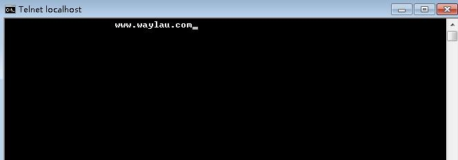
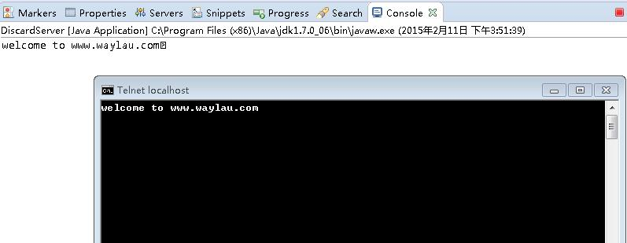
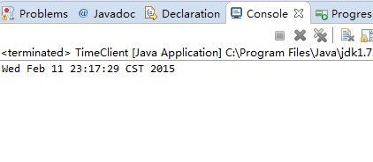
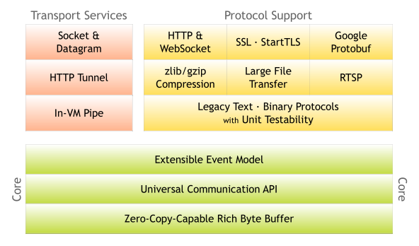

# 介紹

# Netty 4.x User Guide 中文翻译《Netty 4.x 用户指南》


Chinese translation of [Netty 4.x User Guide](http://netty.io/wiki/user-guide-for-4.x.html) . You can also see the demos of the guide [here](https://github.com/waylau/netty-4-user-guide-demos). There is a GitBook version of the book: [`waylau.gitbooks.io/netty-4-user-guide/`](http://waylau.gitbooks.io/netty-4-user-guide/) or [`www.waylau.com/netty-4-user-guide/`](http://www.waylau.com/netty-4-user-guide/) Let's READ!

《Netty 4.x 用户指南》中文翻译（包含了官方文档以及其他文章）。至今为止，Netty 的最新版本为 4.0.34.Final(2016-1-30)对此进行翻译，并在原文的基础上，插入配图，图文并茂方便用户理解。

作为提升，也推荐阅读《[Netty 实战(精髓)](https://github.com/waylau/essential-netty-in-action)》。与之类似的 NIO 框架还有 MINA，可以参阅《[Apache MINA 2 用户指南](https://github.com/waylau/apache-mina-2.x-user-guide)》。

### Get Started 如何开始阅读

选择下面入口之一：

*   [`github.com/waylau/netty-4-user-guide/`](https://github.com/waylau/netty-4-user-guide/) 的 SUMMARY.md（源码）
*   [`waylau.gitbooks.io/netty-4-user-guide/`](http://waylau.gitbooks.io/netty-4-user-guide/) 点击 Read 按钮（同步更新，国内访问速度一般）
*   [`waylau.com/netty-4-user-guide/`](http://waylau.com/netty-4-user-guide/)（国内访问速度快，定期更新。最后更新于 2016-3-1）

### Code 源码

书中所有示例源码，移步至[`github.com/waylau/netty-4-user-guide-demos`](https://github.com/waylau/netty-4-user-guide-demos)

### Issue 意见、建议

如有勘误、意见或建议欢迎拍砖 [`github.com/waylau/netty-4-user-guide/issues`](https://github.com/waylau/netty-4-user-guide/issues)

### Contact 联系作者:

*   Blog: [waylau.com](http://waylau.com)
*   Gmail: waylau521(at)gmail.com
*   Weibo: [waylau521](http://weibo.com/waylau521)
*   Twitter: [waylau521](https://twitter.com/waylau521)
*   Github : [waylau](https://github.com/waylau)

# The Problem 问题

# The Problem 问题

今天，我们使用通用的应用程序或者类库来实现互相通讯，比如，我们经常使用一个 HTTP 客户端库来从 web 服务器上获取信息，或者通过 web 服务来执行一个远程的调用。

然而，有时候一个通用的协议或他的实现并没有很好的满足需求。比如我们无法使用一个通用的 HTTP 服务器来处理大文件、电子邮件以及近实时消息，比如金融信息和多人游戏数据。我们需要一个高度优化的协议来处理一些特殊的场景。例如你可能想实现一个优化了的 Ajax 的聊天应用、媒体流传输或者是大文件传输器，你甚至可以自己设计和实现一个全新的协议来准确地实现你的需求。

另一个不可避免的情况是当你不得不处理遗留的专有协议来确保与旧系统的互操作性。在这种情况下，重要的是我们如何才能快速实现协议而不牺牲应用的稳定性和性能。

# The Solution 解决

# The Solution 解决

[Netty](http://netty.io/) 是一个提供 asynchronous event-driven （异步事件驱动）的网络应用框架，是一个用以快速开发高性能、高可靠性协议的服务器和客户端。

换句话说，Netty 是一个 NIO 客户端服务器框架，使用它可以快速简单地开发网络应用程序，比如服务器和客户端的协议。Netty 大大简化了网络程序的开发过程比如 TCP 和 UDP 的 socket 服务的开发。

“快速和简单”并不意味着应用程序会有难维护和性能低的问题，Netty 是一个精心设计的框架，它从许多协议的实现中吸收了很多的经验比如 FTP、SMTP、HTTP、许多二进制和基于文本的传统协议.因此，Netty 已经成功地找到一个方式,在不失灵活性的前提下来实现开发的简易性，高性能，稳定性。

有一些用户可能已经发现其他的一些网络框架也声称自己有同样的优势，所以你可能会问是 Netty 和它们的不同之处。答案就是 Netty 的哲学设计理念。Netty 从开始就为用户提供了用户体验最好的 API 以及实现设计。正是因为 Netty 的哲学设计理念，才让您得以轻松地阅读本指南并使用 Netty。

# Getting Started 开始

# Getting Started 开始

本章围绕 Netty 的核心架构，通过简单的示例带你快速入门。当你读完本章节，你马上就可以用 Netty 写出一个客户端和服务器。

如果你在学习的时候喜欢“top-down（自顶向下）”，那你可能需要要从第二章《Architectural Overview （架构总览）》开始，然后再回到这里。

# Before Getting Started 开始之前

# Before Getting Started 开始之前

在运行本章示例之前，需要准备：最新版的 Netty 以及 JDK 1.6 或以上版本。最新版的 Netty 在这[下载](http://netty.io/downloads.html)。自行下载 JDK。

阅读本章节过程中，你可能会对相关类有疑惑，关于这些类的详细的信息请请参考 API 说明文档。为了方便，所有文档中涉及到的类名字都会被关联到一个在线的 API 说明。当然，如果有任何错误信息、语法错误或者你有任何好的建议来改进文档说明，那么请[联系 Netty 社区](http://netty.io/community.html)。

*译者注：对本翻译有任何疑问，在[`github.com/waylau/netty-4-user-guide/issues`](https://github.com/waylau/netty-4-user-guide/issues)提问*

# Writing a Discard Server 写个抛弃服务器

# Writing a Discard Server 写个抛弃服务器

世上最简单的协议不是'Hello, World!' 而是 [DISCARD(抛弃服务)](http://tools.ietf.org/html/rfc863)。这个协议将会抛弃任何收到的数据，而不响应。

为了实现 DISCARD 协议，你只需忽略所有收到的数据。让我们从 handler （处理器）的实现开始，handler 是由 Netty 生成用来处理 I/O 事件的。

```
 import io.netty.buffer.ByteBuf;

import io.netty.channel.ChannelHandlerContext;
import io.netty.channel.ChannelInboundHandlerAdapter;

/**
 * 处理服务端 channel.
 */
public class DiscardServerHandler extends ChannelInboundHandlerAdapter { // (1)

    @Override
    public void channelRead(ChannelHandlerContext ctx, Object msg) { // (2)
        // 默默地丢弃收到的数据
        ((ByteBuf) msg).release(); // (3)
    }

    @Override
    public void exceptionCaught(ChannelHandlerContext ctx, Throwable cause) { // (4)
        // 当出现异常就关闭连接
        cause.printStackTrace();
        ctx.close();
    }
} 
```

1.DiscardServerHandler 继承自 [ChannelInboundHandlerAdapter](http://netty.io/4.0/api/io/netty/channel/ChannelInboundHandlerAdapter.html)，这个类实现了 [ChannelInboundHandler](http://netty.io/4.0/api/io/netty/channel/ChannelInboundHandler.html)接口，ChannelInboundHandler 提供了许多事件处理的接口方法，然后你可以覆盖这些方法。现在仅仅只需要继承 ChannelInboundHandlerAdapter 类而不是你自己去实现接口方法。

2.这里我们覆盖了 chanelRead() 事件处理方法。每当从客户端收到新的数据时，这个方法会在收到消息时被调用，这个例子中，收到的消息的类型是 [ByteBuf](http://netty.io/4.0/api/io/netty/buffer/ByteBuf.html)

3.为了实现 DISCARD 协议，处理器不得不忽略所有接受到的消息。ByteBuf 是一个引用计数对象，这个对象必须显示地调用 release() 方法来释放。请记住处理器的职责是释放所有传递到处理器的引用计数对象。通常，channelRead() 方法的实现就像下面的这段代码：

```
 @Override
    public void channelRead(ChannelHandlerContext ctx, Object msg) {
        try {
            // Do something with msg
        } finally {
            ReferenceCountUtil.release(msg);
        }
    } 
```

4.exceptionCaught() 事件处理方法是当出现 Throwable 对象才会被调用，即当 Netty 由于 IO 错误或者处理器在处理事件时抛出的异常时。在大部分情况下，捕获的异常应该被记录下来并且把关联的 channel 给关闭掉。然而这个方法的处理方式会在遇到不同异常的情况下有不同的实现，比如你可能想在关闭连接之前发送一个错误码的响应消息。

目前为止一切都还不错，我们已经实现了 DISCARD 服务器的一半功能，剩下的需要编写一个 main() 方法来启动服务端的 DiscardServerHandler。

```
import io.netty.bootstrap.ServerBootstrap;

import io.netty.channel.ChannelFuture;
import io.netty.channel.ChannelInitializer;
import io.netty.channel.ChannelOption;
import io.netty.channel.EventLoopGroup;
import io.netty.channel.nio.NioEventLoopGroup;
import io.netty.channel.socket.SocketChannel;
import io.netty.channel.socket.nio.NioServerSocketChannel;

/**
 * 丢弃任何进入的数据
 */
public class DiscardServer {

    private int port;

    public DiscardServer(int port) {
        this.port = port;
    }

    public void run() throws Exception {
        EventLoopGroup bossGroup = new NioEventLoopGroup(); // (1)
        EventLoopGroup workerGroup = new NioEventLoopGroup();
        try {
            ServerBootstrap b = new ServerBootstrap(); // (2)
            b.group(bossGroup, workerGroup)
             .channel(NioServerSocketChannel.class) // (3)
             .childHandler(new ChannelInitializer<SocketChannel>() { // (4)
                 @Override
                 public void initChannel(SocketChannel ch) throws Exception {
                     ch.pipeline().addLast(new DiscardServerHandler());
                 }
             })
             .option(ChannelOption.SO_BACKLOG, 128)          // (5)
             .childOption(ChannelOption.SO_KEEPALIVE, true); // (6)

            // 绑定端口，开始接收进来的连接
            ChannelFuture f = b.bind(port).sync(); // (7)

            // 等待服务器  socket 关闭 。
            // 在这个例子中，这不会发生，但你可以优雅地关闭你的服务器。
            f.channel().closeFuture().sync();
        } finally {
            workerGroup.shutdownGracefully();
            bossGroup.shutdownGracefully();
        }
    }

    public static void main(String[] args) throws Exception {
        int port;
        if (args.length > 0) {
            port = Integer.parseInt(args[0]);
        } else {
            port = 8080;
        }
        new DiscardServer(port).run();
    }
} 
```

1.[NioEventLoopGroup](http://netty.io/4.0/api/io/netty/channel/nio/NioEventLoopGroup.html) 是用来处理 I/O 操作的多线程事件循环器，Netty 提供了许多不同的 [EventLoopGroup](http://netty.io/4.0/api/io/netty/channel/EventLoopGroup.html) 的实现用来处理不同的传输。在这个例子中我们实现了一个服务端的应用，因此会有 2 个 NioEventLoopGroup 会被使用。第一个经常被叫做‘boss’，用来接收进来的连接。第二个经常被叫做‘worker’，用来处理已经被接收的连接，一旦‘boss’接收到连接，就会把连接信息注册到‘worker’上。如何知道多少个线程已经被使用，如何映射到已经创建的 [Channel](http://netty.io/4.0/api/io/netty/channel/Channel.html)上都需要依赖于 EventLoopGroup 的实现，并且可以通过构造函数来配置他们的关系。

2.[ServerBootstrap](http://netty.io/4.0/api/io/netty/bootstrap/ServerBootstrap.html) 是一个启动 NIO 服务的辅助启动类。你可以在这个服务中直接使用 Channel，但是这会是一个复杂的处理过程，在很多情况下你并不需要这样做。

3.这里我们指定使用 [NioServerSocketChannel](http://netty.io/4.0/api/io/netty/channel/socket/nio/NioServerSocketChannel.html) 类来举例说明一个新的 Channel 如何接收进来的连接。

4.这里的事件处理类经常会被用来处理一个最近的已经接收的 Channel。[ChannelInitializer](http://netty.io/4.0/api/io/netty/channel/ChannelInitializer.html) 是一个特殊的处理类，他的目的是帮助使用者配置一个新的 Channel。也许你想通过增加一些处理类比如 DiscardServerHandler 来配置一个新的 Channel 或者其对应的[ChannelPipeline](http://netty.io/4.0/api/io/netty/channel/ChannelPipeline.html) 来实现你的网络程序。当你的程序变的复杂时，可能你会增加更多的处理类到 pipline 上，然后提取这些匿名类到最顶层的类上。

5.你可以设置这里指定的 Channel 实现的配置参数。我们正在写一个 TCP/IP 的服务端，因此我们被允许设置 socket 的参数选项比如 tcpNoDelay 和 keepAlive。请参考 [ChannelOption](http://netty.io/4.0/api/io/netty/channel/ChannelOption.html) 和详细的 [ChannelConfig](http://netty.io/4.0/api/io/netty/channel/ChannelConfig.html) 实现的接口文档以此可以对 ChannelOption 的有一个大概的认识。

6.你关注过 option() 和 childOption() 吗？option() 是提供给[NioServerSocketChannel](http://netty.io/4.0/api/io/netty/channel/socket/nio/NioServerSocketChannel.html) 用来接收进来的连接。childOption() 是提供给由父管道 [ServerChannel](http://netty.io/4.0/api/io/netty/channel/ServerChannel.html) 接收到的连接，在这个例子中也是 NioServerSocketChannel。

7.我们继续，剩下的就是绑定端口然后启动服务。这里我们在机器上绑定了机器所有网卡上的 8080 端口。当然现在你可以多次调用 bind() 方法(基于不同绑定地址)。

恭喜！你已经熟练地完成了第一个基于 Netty 的服务端程序。

# Looking into the Received Data 查看收到的数据

# Looking into the Received Data 查看收到的数据

现在我们已经编写出我们第一个服务端，我们需要测试一下他是否真的可以运行。最简单的测试方法是用 telnet 命令。例如，你可以在命令行上输入`telnet localhost 8080`或者其他类型参数。




然而我们能说这个服务端是正常运行了吗？事实上我们也不知道，因为他是一个 discard 服务，你根本不可能得到任何的响应。为了证明他仍然是在正常工作的，让我们修改服务端的程序来打印出他到底接收到了什么。

我们已经知道 channelRead() 方法是在数据被接收的时候调用。让我们放一些代码到 DiscardServerHandler 类的 channelRead() 方法。

```
@Override
public void channelRead(ChannelHandlerContext ctx, Object msg) {
    ByteBuf in = (ByteBuf) msg;
    try {
        while (in.isReadable()) { // (1)
            System.out.print((char) in.readByte());
            System.out.flush();
        }
    } finally {
        ReferenceCountUtil.release(msg); // (2)
    }
} 
```

1.这个低效的循环事实上可以简化为:System.out.println(in.toString(io.netty.util.CharsetUtil.US_ASCII))

2.或者，你可以在这里调用 in.release()。

如果你再次运行 telnet 命令，你将会看到服务端打印出了他所接收到的消息。



完整的 discard server 代码放在了[io.netty.example.discard](http://netty.io/4.0/xref/io/netty/example/discard/package-summary.html)包下面。

*译者注：翻译版本的项目源码见 [`github.com/waylau/netty-4-user-guide-demos`](https://github.com/waylau/netty-4-user-guide-demos) 中的`com.waylau.netty.demo.discard` 包下*

# Writing an Echo Server 写个应答服务器

# Writing an Echo Server 写个应答服务器

到目前为止，我们虽然接收到了数据，但没有做任何的响应。然而一个服务端通常会对一个请求作出响应。让我们学习怎样在 [ECHO](http://tools.ietf.org/html/rfc862) 协议的实现下编写一个响应消息给客户端，这个协议针对任何接收的数据都会返回一个响应。

和 discard server 唯一不同的是把在此之前我们实现的 channelRead() 方法，返回所有的数据替代打印接收数据到控制台上的逻辑。因此，需要把 channelRead() 方法修改如下：

```
 @Override
    public void channelRead(ChannelHandlerContext ctx, Object msg) {
        ctx.write(msg); // (1)
        ctx.flush(); // (2)
    } 
```

1.  [ChannelHandlerContext](http://netty.io/4.0/api/io/netty/channel/ChannelHandlerContext.html) 对象提供了许多操作，使你能够触发各种各样的 I/O 事件和操作。这里我们调用了 write(Object) 方法来逐字地把接受到的消息写入。请注意不同于 DISCARD 的例子我们并没有释放接受到的消息，这是因为当写入的时候 Netty 已经帮我们释放了。
2.  ctx.write(Object) 方法不会使消息写入到通道上，他被缓冲在了内部，你需要调用 ctx.flush() 方法来把缓冲区中数据强行输出。或者你可以用更简洁的 cxt.writeAndFlush(msg) 以达到同样的目的。

如果你再一次运行 telnet 命令，你会看到服务端会发回一个你已经发送的消息。

完整的 echo 服务的代码放在了 [io.netty.example.echo](http://netty.io/4.0/xref/io/netty/example/echo/package-summary.html)包下面。

*译者注：翻译版本的项目源码见 [`github.com/waylau/netty-4-user-guide-demos`](https://github.com/waylau/netty-4-user-guide-demos) 中的`com.waylau.netty.demo.echo` 包下*

# Writing a Time Server 写个时间服务器

# Writing a Time Server 写个时间服务器

在这个部分被实现的协议是 [TIME](http://tools.ietf.org/html/rfc868) 协议。和之前的例子不同的是在不接受任何请求时他会发送一个含 32 位的整数的消息，并且一旦消息发送就会立即关闭连接。在这个例子中，你会学习到如何构建和发送一个消息，然后在完成时关闭连接。

因为我们将会忽略任何接收到的数据，而只是在连接被创建发送一个消息，所以这次我们不能使用 channelRead() 方法了，代替他的是，我们需要覆盖 channelActive() 方法，下面的就是实现的内容：

```
public class TimeServerHandler extends ChannelInboundHandlerAdapter {

    @Override
    public void channelActive(final ChannelHandlerContext ctx) { // (1)
        final ByteBuf time = ctx.alloc().buffer(4); // (2)
        time.writeInt((int) (System.currentTimeMillis() / 1000L + 2208988800L));

        final ChannelFuture f = ctx.writeAndFlush(time); // (3)
        f.addListener(new ChannelFutureListener() {
            @Override
            public void operationComplete(ChannelFuture future) {
                assert f == future;
                ctx.close();
            }
        }); // (4)
    }

    @Override
    public void exceptionCaught(ChannelHandlerContext ctx, Throwable cause) {
        cause.printStackTrace();
        ctx.close();
    }
} 
```

1.channelActive() 方法将会在连接被建立并且准备进行通信时被调用。因此让我们在这个方法里完成一个代表当前时间的 32 位整数消息的构建工作。

2.为了发送一个新的消息，我们需要分配一个包含这个消息的新的缓冲。因为我们需要写入一个 32 位的整数，因此我们需要一个至少有 4 个字节的 [ByteBuf](http://netty.io/4.0/api/io/netty/buffer/ByteBuf.html)。通过 ChannelHandlerContext.alloc() 得到一个当前的[ByteBufAllocator](http://netty.io/4.0/api/io/netty/buffer/ByteBufAllocator.html)，然后分配一个新的缓冲。

3.和往常一样我们需要编写一个构建好的消息。但是等一等，flip 在哪？难道我们使用 NIO 发送消息时不是调用 java.nio.ByteBuffer.flip() 吗？ByteBuf 之所以没有这个方法因为有两个指针，一个对应读操作一个对应写操作。当你向 ByteBuf 里写入数据的时候写指针的索引就会增加，同时读指针的索引没有变化。读指针索引和写指针索引分别代表了消息的开始和结束。

比较起来，NIO 缓冲并没有提供一种简洁的方式来计算出消息内容的开始和结尾，除非你调用 flip 方法。当你忘记调用 flip 方法而引起没有数据或者错误数据被发送时，你会陷入困境。这样的一个错误不会发生在 Netty 上，因为我们对于不同的操作类型有不同的指针。你会发现这样的使用方法会让你过程变得更加的容易，因为你已经习惯一种没有使用 flip 的方式。

另外一个点需要注意的是 ChannelHandlerContext.write() (和 writeAndFlush() )方法会返回一个 [ChannelFuture](http://netty.io/4.0/api/io/netty/channel/ChannelFuture.html) 对象，一个 ChannelFuture 代表了一个还没有发生的 I/O 操作。这意味着任何一个请求操作都不会马上被执行，因为在 Netty 里所有的操作都是异步的。举个例子下面的代码中在消息被发送之前可能会先关闭连接。

```
 Channel ch = ...;
    ch.writeAndFlush(message);
    ch.close(); 
```

因此你需要在 write() 方法返回的 ChannelFuture 完成后调用 close() 方法，然后当他的写操作已经完成他会通知他的监听者。请注意,close() 方法也可能不会立马关闭，他也会返回一个 ChannelFuture。

4.当一个写请求已经完成是如何通知到我们？这个只需要简单地在返回的 ChannelFuture 上增加一个[ChannelFutureListener](http://netty.io/4.0/api/io/netty/channel/ChannelFutureListener.html)。这里我们构建了一个匿名的 ChannelFutureListener 类用来在操作完成时关闭 Channel。

或者，你可以使用简单的预定义监听器代码:

```
f.addListener(ChannelFutureListener.CLOSE); 
```

为了测试我们的 time 服务如我们期望的一样工作，你可以使用 UNIX 的 rdate 命令

```
$ rdate -o <port> -p <host> 
```

Port 是你在 main()函数中指定的端口，host 使用 locahost 就可以了。

# Writing a Time Client 写个时间客户端

# Writing a Time Client 写个时间客户端

不像 DISCARD 和 ECHO 的服务端，对于 TIME 协议我们需要一个客户端,因为人们不能把一个 32 位的二进制数据翻译成一个日期或者日历。在这一部分，我们将会讨论如何确保服务端是正常工作的，并且学习怎样用 Netty 编写一个客户端。

在 Netty 中,编写服务端和客户端最大的并且唯一不同的使用了不同的[BootStrap](http://netty.io/4.0/api/io/netty/bootstrap/Bootstrap.html) 和 [Channel](http://netty.io/4.0/api/io/netty/channel/Channel.html)的实现。请看一下下面的代码：

```
public class TimeClient {

    public static void main(String[] args) throws Exception {

        String host = args[0];
        int port = Integer.parseInt(args[1]);
        EventLoopGroup workerGroup = new NioEventLoopGroup();

        try {
            Bootstrap b = new Bootstrap(); // (1)
            b.group(workerGroup); // (2)
            b.channel(NioSocketChannel.class); // (3)
            b.option(ChannelOption.SO_KEEPALIVE, true); // (4)
            b.handler(new ChannelInitializer<SocketChannel>() {
                @Override
                public void initChannel(SocketChannel ch) throws Exception {
                    ch.pipeline().addLast(new TimeClientHandler());
                }
            });

            // 启动客户端
            ChannelFuture f = b.connect(host, port).sync(); // (5)

            // 等待连接关闭
            f.channel().closeFuture().sync();
        } finally {
            workerGroup.shutdownGracefully();
        }
    }
} 
```

1.BootStrap 和 [ServerBootstrap](http://netty.io/4.0/api/io/netty/bootstrap/ServerBootstrap.html) 类似,不过他是对非服务端的 channel 而言，比如客户端或者无连接传输模式的 channel。

2.如果你只指定了一个 [EventLoopGroup](http://netty.io/4.0/api/io/netty/channel/EventLoopGroup.html)，那他就会即作为一个 boss group ，也会作为一个 workder group，尽管客户端不需要使用到 boss worker 。

3.代替[NioServerSocketChannel](http://netty.io/4.0/api/io/netty/channel/socket/nio/NioServerSocketChannel.html)的是[NioSocketChannel](http://netty.io/4.0/api/io/netty/channel/socket/nio/NioSocketChannel.html),这个类在客户端 channel 被创建时使用。

4.不像在使用 ServerBootstrap 时需要用 childOption() 方法，因为客户端的 [SocketChannel](http://netty.io/4.0/api/io/netty/channel/socket/SocketChannel.html) 没有父亲。

5.我们用 connect() 方法代替了 bind() 方法。

正如你看到的，他和服务端的代码是不一样的。[ChannelHandler](http://netty.io/4.0/api/io/netty/channel/ChannelHandler.html) 是如何实现的?他应该从服务端接受一个 32 位的整数消息，把他翻译成人们能读懂的格式，并打印翻译好的时间，最后关闭连接:

```
import java.util.Date;

public class TimeClientHandler extends ChannelInboundHandlerAdapter {
    @Override
    public void channelRead(ChannelHandlerContext ctx, Object msg) {
        ByteBuf m = (ByteBuf) msg; // (1)
        try {
            long currentTimeMillis = (m.readUnsignedInt() - 2208988800L) * 1000L;
            System.out.println(new Date(currentTimeMillis));
            ctx.close();
        } finally {
            m.release();
        }
    }

    @Override
    public void exceptionCaught(ChannelHandlerContext ctx, Throwable cause) {
        cause.printStackTrace();
        ctx.close();
    }
} 
```

1.在 TCP/IP 中，Netty 会把读到的数据放到 ByteBuf 的数据结构中。



这样看起来非常简单，并且和服务端的那个例子的代码也相差不多。然而，处理器有时候会因为抛出 IndexOutOfBoundsException 而拒绝工作。在下个部分我们会讨论为什么会发生这种情况。

# Dealing with a Stream-based Transport 处理一个基于流的传输

# Dealing with a Stream-based Transport 处理一个基于流的传输

## One Small Caveat of Socket Buffer 关于 Socket Buffer 的一个小警告

基于流的传输比如 TCP/IP, 接收到数据是存在 socket 接收的 buffer 中。不幸的是，基于流的传输并不是一个数据包队列，而是一个字节队列。意味着，即使你发送了 2 个独立的数据包，操作系统也不会作为 2 个消息处理而仅仅是作为一连串的字节而言。因此这是不能保证你远程写入的数据就会准确地读取。举个例子，让我们假设操作系统的 TCP/TP 协议栈已经接收了 3 个数据包：


由于基于流传输的协议的这种普通的性质，在你的应用程序里读取数据的时候会有很高的可能性被分成下面的片段


因此，一个接收方不管他是客户端还是服务端，都应该把接收到的数据整理成一个或者多个更有意思并且能够让程序的业务逻辑更好理解的数据。在上面的例子中，接收到的数据应该被构造成下面的格式：


## The First Solution 办法一

回到 TIME 客户端例子。同样也有类似的问题。一个 32 位整型是非常小的数据，他并不见得会被经常拆分到到不同的数据段内。然而，问题是他确实可能会被拆分到不同的数据段内，并且拆分的可能性会随着通信量的增加而增加。

最简单的方案是构造一个内部的可积累的缓冲，直到 4 个字节全部接收到了内部缓冲。下面的代码修改了 TimeClientHandler 的实现类修复了这个问题

```
public class TimeClientHandler extends ChannelInboundHandlerAdapter {
    private ByteBuf buf;

    @Override
    public void handlerAdded(ChannelHandlerContext ctx) {
        buf = ctx.alloc().buffer(4); // (1)
    }

    @Override
    public void handlerRemoved(ChannelHandlerContext ctx) {
        buf.release(); // (1)
        buf = null;
    }

    @Override
    public void channelRead(ChannelHandlerContext ctx, Object msg) {
        ByteBuf m = (ByteBuf) msg;
        buf.writeBytes(m); // (2)
        m.release();

        if (buf.readableBytes() >= 4) { // (3)
            long currentTimeMillis = (buf.readUnsignedInt() - 2208988800L) * 1000L;
            System.out.println(new Date(currentTimeMillis));
            ctx.close();
        }
    }

    @Override
    public void exceptionCaught(ChannelHandlerContext ctx, Throwable cause) {
        cause.printStackTrace();
        ctx.close();
    }
} 
```

1.[ChannelHandler](http://netty.io/4.0/api/io/netty/channel/ChannelHandler.html) 有 2 个生命周期的监听方法：handlerAdded()和 handlerRemoved()。你可以完成任意初始化任务只要他不会被阻塞很长的时间。

2.首先，所有接收的数据都应该被累积在 buf 变量里。

3.然后，处理器必须检查 buf 变量是否有足够的数据，在这个例子中是 4 个字节，然后处理实际的业务逻辑。否则，Netty 会重复调用 channelRead() 当有更多数据到达直到 4 个字节的数据被积累。

## The Second Solution 方法二

尽管第一个解决方案已经解决了 TIME 客户端的问题了，但是修改后的处理器看起来不那么的简洁，想象一下如果由多个字段比如可变长度的字段组成的更为复杂的协议时，你的 [ChannelInboundHandler](http://netty.io/4.0/api/io/netty/channel/ChannelInboundHandler.html) 的实现将很快地变得难以维护。

正如你所知的，你可以增加多个 [ChannelHandler](http://netty.io/4.0/api/io/netty/channel/ChannelHandler.html) 到[ChannelPipeline](http://netty.io/4.0/api/io/netty/channel/ChannelPipeline.html) ,因此你可以把一整个 ChannelHandler 拆分成多个模块以减少应用的复杂程度，比如你可以把 TimeClientHandler 拆分成 2 个处理器：

*   TimeDecoder 处理数据拆分的问题
*   TimeClientHandler 原始版本的实现

幸运地是，Netty 提供了一个可扩展的类，帮你完成 TimeDecoder 的开发。

```
public class TimeDecoder extends ByteToMessageDecoder { // (1)
    @Override
    protected void decode(ChannelHandlerContext ctx, ByteBuf in, List<Object> out) { // (2)
        if (in.readableBytes() < 4) {
            return; // (3)
        }

        out.add(in.readBytes(4)); // (4)
    }
} 
```

1.[ByteToMessageDecoder](http://netty.io/4.0/api/io/netty/handler/codec/ByteToMessageDecoder.html) 是 [ChannelInboundHandler](http://netty.io/4.0/api/io/netty/channel/ChannelInboundHandler.html) 的一个实现类，他可以在处理数据拆分的问题上变得很简单。

2.每当有新数据接收的时候，ByteToMessageDecoder 都会调用 decode() 方法来处理内部的那个累积缓冲。

3.Decode() 方法可以决定当累积缓冲里没有足够数据时可以往 out 对象里放任意数据。当有更多的数据被接收了 ByteToMessageDecoder 会再一次调用 decode() 方法。

4.如果在 decode() 方法里增加了一个对象到 out 对象里，这意味着解码器解码消息成功。ByteToMessageDecoder 将会丢弃在累积缓冲里已经被读过的数据。请记得你不需要对多条消息调用 decode()，ByteToMessageDecoder 会持续调用 decode() 直到不放任何数据到 out 里。

现在我们有另外一个处理器插入到 [ChannelPipeline](http://netty.io/4.0/api/io/netty/channel/ChannelPipeline.html) 里，我们应该在 TimeClient 里修改 ChannelInitializer 的实现：

```
b.handler(new ChannelInitializer<SocketChannel>() {
    @Override
    public void initChannel(SocketChannel ch) throws Exception {
        ch.pipeline().addLast(new TimeDecoder(), new TimeClientHandler());
    }
}); 
```

如果你是一个大胆的人，你可能会尝试使用更简单的解码类[ReplayingDecoder](http://netty.io/4.0/api/io/netty/handler/codec/ReplayingDecoder.html)。不过你还是需要参考一下 API 文档来获取更多的信息。

```
public class TimeDecoder extends ReplayingDecoder<Void> {
    @Override
    protected void decode(
            ChannelHandlerContext ctx, ByteBuf in, List<Object> out) {
        out.add(in.readBytes(4));
    }
} 
```

此外，Netty 还提供了更多开箱即用的解码器使你可以更简单地实现更多的协议，帮助你避免开发一个难以维护的处理器实现。请参考下面的包以获取更多更详细的例子：

*   对于二进制协议请看 [io.netty.example.factorial](http://netty.io/4.0/xref/io/netty/example/factorial/package-summary.html)
*   对于基于文本协议请看 [io.netty.example.telnet](http://netty.io/4.0/xref/io/netty/example/telnet/package-summary.html)

*译者注：翻译版本的项目源码见 [`github.com/waylau/netty-4-user-guide-demos`](https://github.com/waylau/netty-4-user-guide-demos) 中的`com.waylau.netty.demo.factorial` 和 `com.waylau.netty.demo.telnet` 包下*

# Speaking in POJO instead of ByteBuf 用 POJO 代替 ByteBuf

# Speaking in POJO instead of ByteBuf 用 POJO 代替 ByteBuf

我们回顾了迄今为止的所有例子使用 [ByteBuf](http://netty.io/4.0/api/io/netty/buffer/ByteBuf.html) 作为协议消息的主要数据结构。在本节中,我们将改善的 TIME 协议客户端和服务器例子，使用 POJO 代替 ByteBuf。

在 [ChannelHandler](http://netty.io/4.0/api/io/netty/channel/ChannelHandler.html) 使用 POIO 的好处很明显：通过从 ChannelHandler 中提取出 ByteBuf 的代码，将会使 ChannelHandler 的实现变得更加可维护和可重用。在 TIME 客户端和服务器的例子中，我们读取的仅仅是一个 32 位的整形数据，直接使用 ByteBuf 不会是一个主要的问题。然而，你会发现当你需要实现一个真实的协议，分离代码变得非常的必要。

首先，让我们定义一个新的类型叫做 UnixTime。

```
public class UnixTime {

    private final long value;

    public UnixTime() {
        this(System.currentTimeMillis() / 1000L + 2208988800L);
    }

    public UnixTime(long value) {
        this.value = value;
    }

    public long value() {
        return value;
    }

    @Override
    public String toString() {
        return new Date((value() - 2208988800L) * 1000L).toString();
    }
} 
```

现在我们可以修改下 TimeDecoder 类，返回一个 UnixTime，以替代 ByteBuf

```
@Override
protected void decode(ChannelHandlerContext ctx, ByteBuf in, List<Object> out) {
    if (in.readableBytes() < 4) {
        return;
    }

    out.add(new UnixTime(in.readUnsignedInt()));
} 
```

下面是修改后的解码器，TimeClientHandler 不再任何的 ByteBuf 代码了。

```
@Override
public void channelRead(ChannelHandlerContext ctx, Object msg) {
    UnixTime m = (UnixTime) msg;
    System.out.println(m);
    ctx.close();
} 
```

是不是变得更加简单和优雅了？相同的技术可以被运用到服务端。让我们修改一下 TimeServerHandler 的代码。

```
@Override
public void channelActive(ChannelHandlerContext ctx) {
    ChannelFuture f = ctx.writeAndFlush(new UnixTime());
    f.addListener(ChannelFutureListener.CLOSE);
} 
```

现在,唯一缺少的功能是一个编码器,是[ChannelOutboundHandler](http://netty.io/4.0/api/io/netty/channel/ChannelOutboundHandler.html)的实现，用来将 UnixTime 对象重新转化为一个 ByteBuf。这是比编写一个解码器简单得多,因为没有需要处理的数据包编码消息时拆分和组装。

```
public class TimeEncoder extends ChannelOutboundHandlerAdapter {
    @Override
    public void write(ChannelHandlerContext ctx, Object msg, ChannelPromise promise) {
        UnixTime m = (UnixTime) msg;
        ByteBuf encoded = ctx.alloc().buffer(4);
        encoded.writeInt((int)m.value());
        ctx.write(encoded, promise); // (1)
    }
} 
```

1.在这几行代码里还有几个重要的事情。第一，通过 [ChannelPromise](http://netty.io/4.0/api/io/netty/channel/ChannelPromise.html)，当编码后的数据被写到了通道上 Netty 可以通过这个对象标记是成功还是失败。第二， 我们不需要调用 cxt.flush()。因为处理器已经单独分离出了一个方法 void flush(ChannelHandlerContext cxt),如果像自己实现 flush() 方法内容可以自行覆盖这个方法。

进一步简化操作，你可以使用 [MessageToByteEncode](http://netty.io/4.0/api/io/netty/handler/codec/MessageToByteEncoder.html):

```
public class TimeEncoder extends MessageToByteEncoder<UnixTime> {
    @Override
    protected void encode(ChannelHandlerContext ctx, UnixTime msg, ByteBuf out) {
        out.writeInt((int)msg.value());
    }
} 
```

最后的任务就是在 TimeServerHandler 之前把 TimeEncoder 插入到 ChannelPipeline。 但这是不那么重要的工作。

# Shutting Down Your Application 关闭你的应用

# Shutting Down Your Application 关闭你的应用

关闭一个 Netty 应用往往只需要简单地通过 shutdownGracefully() 方法来关闭你构建的所有的 [EventLoopGroup](http://netty.io/4.0/api/io/netty/channel/EventLoopGroup.html)。当 EventLoopGroup 被完全地终止,并且对应的所有 [channel](http://netty.io/4.0/api/io/netty/channel/Channel.html) 都已经被关闭时，Netty 会返回一个[Future](http://netty.io/4.0/api/io/netty/util/concurrent/Future.html)对象来通知你。

# Summary 总结

# Summary 总结

在这一章节中，我们快速地回顾下如果在熟练掌握 Netty 的情况下编写出一个健壮能运行的网络应用程序。在 Netty 接下去的章节中还会有更多更相信的信息。我们也鼓励你去重新复习下在 [io.netty.example](https://github.com/netty/netty/tree/4.0/example/src/main/java/io/netty/example) 包下的例子。请注意[社区](http://netty.io/community.html)一直在等待你的问题和想法以帮助 Netty 的持续改进，Netty 的文档也是基于你们的快速反馈上。

*译者注：翻译版本的项目源码见 [`github.com/waylau/netty-4-user-guide-demos`](https://github.com/waylau/netty-4-user-guide-demos)。如对本翻译有任何建议，可以在[`github.com/waylau/netty-4-user-guide/issues`](https://github.com/waylau/netty-4-user-guide/issues)留言*

# Architectural Overview 架构总览

# Architectural Overview 架构总览



在本章中，我们将研究 Netty 提供的核心功能以及他们是如何构成一个完整的网络应用开发堆栈顶部的核心。你阅读本章时，请把这个图记住。

# Rich Buffer Data Structure 丰富的缓冲实现

# Rich Buffer Data Structure 丰富的缓冲实现

Netty 使用自建的 buffer API，而不是使用 NIO 的 [ByteBuffer](http://docs.oracle.com/javase/7/docs/api/java/nio/ByteBuffer.html?is-external=true) 来表示一个连续的字节序列。与 ByteBuffer 相比这种方式拥有明显的优势。Netty 使用新的 buffer 类型 [ByteBuf](http://netty.io/4.0/api/io/netty/buffer/ByteBuf.html)，被设计为一个可从底层解决 ByteBuffer 问题，并可满足日常网络应用开发需要的缓冲类型。这些很酷的特性包括：

*   如果需要，允许使用自定义的缓冲类型。
*   复合缓冲类型中内置的透明的零拷贝实现。
*   开箱即用的动态缓冲类型，具有像 [StringBuffer](http://docs.oracle.com/javase/7/docs/api/java/lang/StringBuffer.html?is-external=true) 一样的动态缓冲能力。
*   不再需要调用的 flip()方法。
*   正常情况下具有比 ByteBuffer 更快的响应速度。

更多信息请参考：[io.netty.buffer 包描述](http://netty.io/4.0/api/io/netty/buffer/package-summary.html#package_description)

### Extensibility 可扩展性

ByteBuf 具有丰富的操作集,可以快速的实现协议的优化。例如，ByteBuf 提供各种操作用于访问无符号值和字符串，以及在缓冲区搜索一定的字节序列。你也可以扩展或包装现有的缓冲类型用来提供方便的访问。自定义缓冲仍然实现自 ByteBuf 接口，而不是引入一个不兼容的类型

### Transparent Zero Copy 透明的零拷贝

举一个网络应用到极致的表现，你需要减少内存拷贝操作次数。你可能有一组缓冲区可以被组合以形成一个完整的消息。网络提供了一种复合缓冲，允许你从现有的任意数的缓冲区创建一个新的缓冲区而无需内存拷贝。例如，一个信息可以由两部分组成；header 和 body。在一个模块化的应用，当消息发送出去时，这两部分可以由不同的模块生产和装配。

```
 +--------+----------+
 | header |   body   |
 +--------+----------+

```

如果你使用的是 ByteBuffer ，你必须要创建一个新的大缓存区用来拷贝这两部分到这个新缓存区中。或者，你可以在 NiO 做一个收集写操作，但限制你将复合缓冲类型作为 ByteBuffer 的数组而不是一个单一的缓冲区，打破了抽象，并且引入了复杂的状态管理。此外，如果你不从 NIO channel 读或写，它是没有用的。

```
// 复合类型与组件类型不兼容。
ByteBuffer[] message = new ByteBuffer[] { header, body }; 
```

通过对比， ByteBuf 不会有警告，因为它是完全可扩展并有一个内置的复合缓冲区。

```
// 复合类型与组件类型是兼容的。
ByteBuf message = Unpooled.wrappedBuffer(header, body);

// 因此，你甚至可以通过混合复合类型与普通缓冲区来创建一个复合类型。
ByteBuf messageWithFooter = Unpooled.wrappedBuffer(message, footer);

// 由于复合类型仍是 ByteBuf，访问其内容很容易，
//并且访问方法的行为就像是访问一个单独的缓冲区，
//即使你想访问的区域是跨多个组件。
//这里的无符号整数读取位于 body 和 footer
messageWithFooter.getUnsignedInt(
     messageWithFooter.readableBytes() - footer.readableBytes() - 1); 
```

### Automatic Capacity Extension 自动容量扩展

许多协议定义可变长度的消息，这意味着没有办法确定消息的长度，直到你构建的消息。或者，在计算长度的精确值时，带来了困难和不便。这就像当你建立一个字符串。你经常估计得到的字符串的长度，让 StringBuffer 扩大了其本身的需求。

```
// 一种新的动态缓冲区被创建。在内部，实际缓冲区是被“懒”创建，从而避免潜在的浪费内存空间。
ByteBuf b = Unpooled.buffer(4);

// 当第一个执行写尝试，内部指定初始容量 4 的缓冲区被创建
b.writeByte('1');

b.writeByte('2');
b.writeByte('3');
b.writeByte('4');

// 当写入的字节数超过初始容量 4 时，
//内部缓冲区自动分配具有较大的容量
b.writeByte('5'); 
```

### Better Performance 更好的性能

最频繁使用的缓冲区 ByteBuf 的实现是一个非常薄的字节数组包装器（比如，一个字节）。与 ByteBuffer 不同，它没有复杂的边界和索引检查补偿，因此对于 JVM 优化缓冲区的访问更加简单。更多复杂的缓冲区实现是用于拆分或者组合缓存，并且比 ByteBuffer 拥有更好的性能。

# Universal Asynchronous I/O API 统一的异步 I/O API

# Universal Asynchronous I/O API 统一的异步 I/O API

传统的 Java I/O API 在应对不同的传输协议时需要使用不同的类型和方法。例如：java.net.Socket 和 java.net.DatagramSocket 它们并不具有相同的超类型，因此，这就需要使用不同的调用方式执行 socket 操作。

这种模式上的不匹配使得在更换一个网络应用的传输协议时变得繁杂和困难。由于（Java I/O API）缺乏协议间的移植性，当你试图在不修改网络传输层的前提下增加多种协议的支持，这时便会产生问题。并且理论上讲，多种应用层协议可运行在多种传输层协议之上例如 TCP/IP,UDP/IP,SCTP 和串口通信。

让这种情况变得更糟的是，Java 新的 I/O（NIO）API 与原有的阻塞式的 I/O（OIO）API 并不兼容，NIO.2(AIO)也是如此。由于所有的 API 无论是在其设计上还是性能上的特性都与彼此不同，在进入开发阶段，你常常会被迫的选择一种你需要的 API。

例如，在用户数较小的时候你可能会选择使用传统的 OIO(Old I/O) API，毕竟与 NIO 相比使用 OIO 将更加容易一些。然而，当你的业务呈指数增长并且服务器需要同时处理成千上万的客户连接时你便会遇到问题。这种情况下你可能会尝试使用 NIO，但是复杂的 NIO Selector 编程接口又会耗费你大量时间并最终会阻碍你的快速开发。

Netty 有一个叫做 [Channel](http://netty.io/4.0/api/io/netty/channel/package-summary.html#package_description) 的统一的异步 I/O 编程接口，这个编程接口抽象了所有点对点的通信操作。也就是说，如果你的应用是基于 Netty 的某一种传输实现，那么同样的，你的应用也可以运行在 Netty 的另一种传输实现上。Netty 提供了几种拥有相同编程接口的基本传输实现：

*   基于 NIO 的 TCP/IP 传输 (见 io.netty.channel.nio),
*   基于 OIO 的 TCP/IP 传输 (见 io.netty.channel.oio),
*   基于 OIO 的 UDP/IP 传输, 和
*   本地传输 (见 io.netty.channel.local).

切换不同的传输实现通常只需对代码进行几行的修改调整，例如选择一个不同的 [ChannelFactory](http://netty.io/4.0/api/io/netty/bootstrap/ChannelFactory.html) 实现。

此外，你甚至可以利用新的传输实现没有写入的优势，只需替换一些构造器的调用方法即可，例如串口通信。而且由于核心 API 具有高度的可扩展性，你还可以完成自己的传输实现。

# Event Model based on the Interceptor Chain Pattern 基于拦截链模式的事件模型

# Event Model based on the Interceptor Chain Pattern 基于拦截链模式的事件模型

一个定义良好并具有扩展能力的事件模型是事件驱动开发的必要条件。Netty 具有定义良好的 I/O 事件模型。由于严格的层次结构区分了不同的事件类型，因此 Netty 也允许你在不破坏现有代码的情况下实现自己的事件类型。这是与其他框架相比另一个不同的地方。很多 NIO 框架没有或者仅有有限的事件模型概念；在你试图添加一个新的事件类型的时候常常需要修改已有的代码，或者根本就不允许你进行这种扩展。

在一个 [ChannelPipeline](http://netty.io/4.0/api/io/netty/channel/ChannelPipeline.html) 内部一个 ChannelEvent 被一组[ChannelHandler](http://netty.io/4.0/api/io/netty/channel/ChannelHandler.html) 处理。这个管道是 [Intercepting Filter (拦截过滤器)](http://java.sun.com/blueprints/corej2eepatterns/Patterns/InterceptingFilter.html)模式的一种高级形式的实现，因此对于一个事件如何被处理以及管道内部处理器间的交互过程，你都将拥有绝对的控制力。例如，你可以定义一个从 socket 读取到数据后的操作：

```
public class MyReadHandler implements SimpleChannelHandler {
       public void messageReceived(ChannelHandlerContext ctx, MessageEvent evt) {
         Object message = evt.getMessage();
           // Do something with the received message.
            ...

         // And forward the event to the next handler.
         ctx.sendUpstream(evt);
    }
} 
```

同时你也可以定义一种操作响应其他处理器的写操作请求：

```
public class MyWriteHandler implements SimpleChannelHandler {
      public void writeRequested(ChannelHandlerContext ctx, MessageEvent evt) {
        Object message = evt.getMessage();
          // Do something with the message to be written.
            ...

        // And forward the event to the next handler.
        ctx.sendDownstream(evt);
    }
} 
```

有关事件模型的更多信息，请参考 API 文档 ChannelEvent 和 ChannelPipeline 部分。

# Advanced Components for More Rapid Development 适用快速开发的高级组件

# Advanced Components for More Rapid Development 适用快速开发的高级组件

上述所提及的核心组件已经足够实现各种类型的网络应用，除此之外，Netty 也提供了一系列的高级组件来加速你的开发过程。

## Codec 框架

就像“使用 POJO 代替 ChannelBuffer”一节所展示的那样，从业务逻辑代码中分离协议处理部分总是一个很不错的想法。然而如果一切从零开始便会遭遇到实现上的复杂性。你不得不处理分段的消息。一些协议是多层的（例如构建在其他低层协议之上的协议）。一些协议过于复杂以致难以在一台独立状态机上实现。

因此，一个好的网络应用框架应该提供一种可扩展，可重用，可单元测试并且是多层的 codec 框架，为用户提供易维护的 codec 代码。

Netty 提供了一组构建在其核心模块之上的 codec 实现，这些简单的或者高级的 codec 实现帮你解决了大部分在你进行协议处理开发过程会遇到的问题，无论这些协议是简单的还是复杂的，二进制的或是简单文本的。

## SSL / TLS 支持

不同于传统阻塞式的 I/O 实现，在 NIO 模式下支持 SSL 功能是一个艰难的工作。你不能只是简单的包装一下流数据并进行加密或解密工作，你不得不借助于 javax.net.ssl.SSLEngine，SSLEngine 是一个有状态的实现，其复杂性不亚于 SSL 自身。你必须管理所有可能的状态，例如密码套件，密钥协商（或重新协商），证书交换以及认证等。此外，与通常期望情况相反的是 SSLEngine 甚至不是一个绝对的线程安全实现。

在 Netty 内部，[SslHandler](http://netty.io/4.0/api/io/netty/handler/ssl/SslHandler.html) 封装了所有艰难的细节以及使用 SSLEngine 可 能带来的陷阱。你所做的仅是配置并将该 SslHandler 插入到你的 [ChannelPipeline](http://netty.io/4.0/api/io/netty/channel/ChannelPipeline.html) 中。同样 Netty 也允许你实现像 [StartTlS](http://en.wikipedia.org/wiki/Starttls) 那样所拥有的高级特性，这很容易。

## HTTP 实现

HTTP 无 疑是互联网上最受欢迎的协议，并且已经有了一些例如 Servlet 容器这样的 HTTP 实现。因此，为什么 Netty 还要在其核心模块之上构建一套 HTTP 实现？

与现有的 HTTP 实现相比 Netty 的 HTTP 实现是相当与众不同的。在 HTTP 消息的低层交互过程中你将拥有绝对的控制力。这是因为 Netty 的 HTTP 实现只是一些 HTTP codec 和 HTTP 消息类的简单组合，这里不存在任何限制——例如那种被迫选择的线程模型。你可以随心所欲的编写那种可以完全按照你期望的工作方式工作的客户端或服务器端代码。这包括线程模型，连接生命期，快编码，以及所有 HTTP 协议允许你做的，所有的一切，你都将拥有绝对的控制力。

由于这种高度可定制化的特性，你可以开发一个非常高效的 HTTP 服务器，例如：

*   要求持久化链接以及服务器端推送技术的聊天服务（如，[Comet](http://en.wikipedia.org/wiki/Comet_%28programming%29) )
*   需要保持链接直至整个文件下载完成的媒体流服务（如，2 小时长的电影）
*   需要上传大文件并且没有内存压力的文件服务（如，上传 1GB 文件的请求）
*   支持大规模混合客户端应用用于连接以万计的第三方异步 web 服务。

## WebSockets 实现

[WebSockets](http://en.wikipedia.org/wiki/WebSockets) 允许双向，全双工通信信道，在 TCP socket 中。它被设计为允许一个 Web 浏览器和 Web 服务器之间通过数据流交互。

WebSocket 协议已经被 IETF 列为 [RFC 6455](http://tools.ietf.org/html/rfc6455)规范。

Netty 实现了 RFC 6455 和一些老版本的规范。请参阅[io.netty.handler.codec.http.websocketx](http://netty.io/4.0/api/io/netty/handler/codec/http/websocketx/package-frame.html)包和相关的[例子](http://static.netty.io/3.5/xref/org/jboss/netty/example/http/websocketx/server/package-summary.html)。

## Google Protocol Buffer 整合

[Google Protocol Buffers](http://code.google.com/apis/protocolbuffers/docs/overview.html) 是快速实现一个高效的二进制协议的理想方案。通过使用 [ProtobufEncoder](http://netty.io/4.0/api/io/netty/handler/codec/protobuf/ProtobufEncoder.html) 和 [ProtobufDecoder](http://netty.io/4.0/api/io/netty/handler/codec/protobuf/ProtobufDecoder.html)，你可以把 Google Protocol Buffers 编译器 (protoc) 生成的消息类放入到 Netty 的 codec 实现中。请参考“[LocalTime](http://docs.jboss.org/netty/3.2/xref/org/jboss/netty/example/localtime/package-summary.html)”实例，这个例子也同时显示出开发一个由简单协议定义 的客户及服务端是多么的容易。

*译者注：翻译版本的项目源码见 [`github.com/waylau/netty-4-user-guide-demos`](https://github.com/waylau/netty-4-user-guide-demos)*

# Summary 总结

# Summary 总结

在这一章节，我们从功能特性的角度回顾了 Netty 的整体架构。Netty 有一个简单却不失强大的架构。这个架构由三部分组成——缓冲（buffer），通道（channel），事件模型（event model）——所有的高级特性都构建在这三个核心组件之上。一旦你理解了它们之间的工作原理，你便不难理解在本章简要提及的更多高级特性。

你可能对 Netty 的整体架构以及每一部分的工作原理仍旧存有疑问。如果是这样，最好的方式是[告诉我们](http://netty.io/community.html) 应该如何改进这份指南。

*译者注：对本翻译有任何疑问，在[`github.com/waylau/netty-4-user-guide/issues`](https://github.com/waylau/netty-4-user-guide/issues)提问*