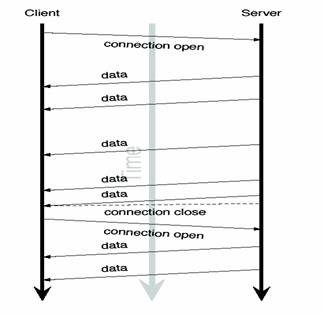

# REST Overview 总览

# REST Overview

## About REST

REST 是英文 Representational State Transfer 的缩写，有中文翻译为“表述性状态转移”。REST 这个术语是由 [Roy Fielding](http://www.ics.uci.edu/~fielding/) 在他的博士论文 《 [Architectural Styles and the Design of Network-based Software Architectures](http://www.ics.uci.edu/~fielding/pubs/dissertation/top.htm) 》中提出的。REST 并非标准，而是一种开发 Web 应用的架构风格，可以将其理解为一种设计模式。REST 基于 HTTP，URI，以及 XML 这些现有的广泛流行的协议和标准，伴随着 REST，HTTP 协议得到了更加正确的使用。

相较于基于 SOAP 和 WSDL 的 Web 服务，REST 模式提供了更为简洁的实现方案。REST Web 服务(RESTful web services)是松耦合的，这特别适用于为客户创建在互联网传播的轻量级的 Web 服务 API。REST 应用是围绕“资源表述的转移（the transfer of representations of resources）”为中心来做请求和响应。数据和功能均被视为资源，并使用统一资源标识符（URI）来访问资源。网页里面的链接就是典型的 URI。该资源由文档表述，并通过使用一组简单的、定义明确的操作来执行。

例如，一个 REST 资源可能是一个城市当前的天气情况。该资源的表述可能是一个 XML 文档，图像文件，或 HTM L 页面。客户端可以检索特定表述，通过更新其数据修改的资源，或者完全删除该资源。

目前，越来越多的 Web 服务开始采用 REST 风格设计和实现，真实世界中比较著名的 REST 服务包括：Google AJAX 搜索 API、Amazon Simple Storage Service (Amazon S3) 等。

基于 REST 的 Web 服务遵循一些基本的设计原则，使得 RESTful 应用更加简单、轻量，开发速度也更快：

*   **通过 URI 来标识资源**:系统中的每一个对象或是资源都可以通过一个唯一的 URI 来进行寻址，URI 的结构应该简单、可预测且易于理解，比如定义目录结构式的 URI。
*   **统一接口**：以遵循 RFC-2616 所定义的协议的方式显式地使用 HTTP 方法，建立创建、检索、更新和删除（CRUD：Create, Retrieve, Update and Delete）操作与 HTTP 方法之间的一对一映射：
    *   若要在服务器上创建资源，应该使用 POST 方法；
    *   若要检索某个资源，应该使用 GET 方法；
    *   若要更新或者添加资源，应该使用 PUT 方法；
    *   若要删除某个资源，应该使用 DELETE 方法。
*   **资源多重表述**:URI 所访问的每个资源都可以使用不同的形式加以表示（比如 XML 或者 JSON），具体的表现形式取决于访问资源的客户端，客户端与服务提供者使用一种内容协商的机制（请求头与 MIME 类型）来选择合适的数据格式，最小化彼此之间的数据耦合。*在 REST 的世界中，资源即状态，而互联网就是一个巨大的状态机，每个网页是其一个状态；URI 是状态的表述；REST 风格的应用则是从一个状态迁移到下一个状态的状态转移过程。早期互联网只有静态页面的时候，通过超链接在静态网页间浏览跳转的 page->link->page->link… 模式就是一种典型的状态转移过程。也就是说早期的互联网就是天然的 REST*
*   **无状态**:对服务器端的请求应该是无状态的，完整、独立的请求不要求服务器在处理请求时检索任何类型的应用程序上下文或状态。无状态约束使服务器的变化对客户端是不可见的，因为在两次连续的请求中，客户端并不依赖于同一台服务器。一个客户端从某台服务器上收到一份包含链接的文档，当它要做一些处理时，这台服务器宕掉了，可能是硬盘坏掉而被拿去修理，可能是软件需要升级重启——如果这个客户端访问了从这台服务器接收的链接，它不会察觉到后台的服务器已经改变了。通过超链接实现有状态交互，即请求消息是自包含的（每次交互都包含完整的信息），有多种技术实现了不同请求间状态信息的传输，例如 URI 重新，cookies 和隐藏表单字段等，状态可以嵌入到应答消息里，这样一来状态在接下来的交互中仍然有效。*REST 风格应用可以实现交互，但它却天然地具有服务器无状态的特征。在状态迁移的过程中，服务器不需要记录任何 Session，所有的状态都通过 URI 的形式记录在了客户端。更准确地说，这里的无状态服务器，是指服务器不保存会话状态(Session)；而资源本身则是天然的状态，通常是需要被保存的；这里所指无状态服务器均指无会话状态服务器。*

HTTP 请求方法在 RESTful Web 服务中的典型应用

| 资源 | GET | PUT | POST | DELETE |
| 一组资源的 URI，比如`http://www.waylau.com/resources/` | **列出** URI，以及该资源组中每个资源的详细信息（后者可选）。 | 使用给定的一组资源**替换**当前整组资源。 | 在本组资源中**创建/追加**一个新的资源。 该操作往往返回新资源的 URL。 | **删除** 整组资源。 |
| 单个资源的 URI，比如`http://www.waylau.com/resources/142` | **获取** 指定的资源的详细信息，格式可以自选一个合适的网络媒体类型（比如：XML、JSON 等） | **替换/创建** 指定的资源。并将其追加到相应的资源组中。 | 把指定的资源当做一个资源组，并在其下**创建/追加**一个新的元素，使其隶属于当前资源。 | **删除** 指定的元素。 |

## Java REST

针对 REST 在 Java 中的规范，主要是 JAX-RS（Java API for RESTful Web Services），该规范使得 Java 程序员可以使用一套固定的接口来开发 REST 应用，避免了依赖于第三方框架。同时，JAX-RS 使用 POJO 编程模型和基于标注的配置，并集成了 JAXB，从而可以有效缩短 REST 应用的开发周期。Java EE 6 引入了对 [JSR-311](https://jsr311.java.net/) 的支持，Java EE 7 支持[JSR-339](http://jcp.org/en/jsr/detail?id=339) 规范。

JAX-RS 定义的 API 位于 javax.ws.rs 包中。

伴随着 JSR 311 规范的发布，Sun 同步发布该规范的参考实现 [Jersey](https://jersey.java.net/)。JAX-RS 的具体实现第三方还包括 Apache 的 [CXF](http://cxf.apache.org/) 以及 JBoss 的 [RESTEasy](http://resteasy.jboss.org/) 等。未实现该规范的其他 REST 框架还包括 [SpringMVC](http://spring.io/) 等。

截至目前， JAX-RS 最新的版本是 2.0 （[JSR-339](http://jcp.org/en/jsr/detail?id=339)）

## Why Jersey

在 Java 中，既然 规范的制定者和实现者都是 Sun 公司（现在是 Oracle）,那么 Jersey 毫无疑问就是事实上的标准，对于 Java REST 的初学者来说尽量要跟着标准走。当然，所有规范的实现，在用法上基本上没有差别，只是相对来说 Jersey 的实现更全面一些。

本书所有的例子都是基于 Jersey 的，有关 Jersey 的参考，可详见《[Jersey 2.x 用户指南](https://github.com/waylau/Jersey-2.x-User-Guide)》。

# Getting Started 开始

本章通过简单的示例带你快速入门。当你读完本章节，你马上就可以用 Jersey 写出 Web 应用。

## Before Getting Started 开始之前

因为我们的示例都是通过 Maven 进行管理，所谓，在开始之前，假设你已经具备 Maven 的基础知识。如果你是 Maven 新手，可以参考[`www.waylau.com/apache-maven-3-1-0-installation-deployment-and-use/`](http://www.waylau.com/apache-maven-3-1-0-installation-deployment-and-use/) 进行 Maven 的安装，参考[`www.waylau.com/build-java-project-with-maven/`](http://www.waylau.com/build-java-project-with-maven/)快速进行 Maven 入门。

## Requirements 需要环境

*   JDK 7+
*   Maven 3.2.x

OK,这就是所有必需的环境。当然，你可以根据自己的喜好选择使用 IDE。本书使用 [Eclipse](http://www.eclipse.org/) 4.4。

## First REST App

在工作目录，创建第一个 Maven 管理的应用，执行

```java
mvn archetype:generate -DarchetypeArtifactId=jersey-quickstart-webapp -DarchetypeGroupId=org.glassfish.jersey.archetypes -DinteractiveMode=false -DgroupId=com.waylau -DartifactId=simple-service-webapp -Dpackage=com.waylau.rest -DarchetypeVersion=2.16 
```


项目打包成 WAR,执行:

```java
mvn clean package 
```

打包成功后，打包的 WAR（位于`./target/simple-service-webapp.war`）可以将它部署到您任意的 Servlet 容器，比如 [Tomcat](http://tomcat.apache.org/)、 [Jetty](http://www.eclipse.org/jetty/)、JBoss 等。


浏览器访问该项目


点击“Jersey resource”,可以在页面输出资源“Got it!”


**注意**：部署 Jersey 项目，Servlet 容器版本应该是不低于 2.5，如果想支持更高的特性(比如 JAX-RS 2.0 Async Support) ，Servlet 容器版本应该是不低于 3.0

自此，第一个 REST 项目完成。

## Source code 源码

见 `simple-service-webapp`。

# Exploring the Newly Created Project 探索新项目

`simple-service-webapp`这个是由 Jersey 提供 Maven archetype 用来创建的 web 项目，在你的项目里面随意调整 pom.xml 内的 groupId，包号和版本号就可以成为一个新的项目。此时，simple-service-webapp 已经创建， 符合 Maven 的项目结构：

*   标准的管理配置文件 pom.xml
*   源文件路径 src/main/java
*   资源文件路径 src/main/resources
*   web 应用文件 src/main/webapp

该项目包含一个名为 MyResouce 的 JAX-RS 资源类。在 src/main/webapp/WEB-INF 下，它包含了标准的 JavaEE Web 应用的 web.xml 部署描述符。项目中的最后一个组件是一个 index.jsp 页面作为这次 MyResource 资源类打包和部署的应用程序客户端。

MyResource 类是 JAX-RS 的一个实现的源代码，如下：

```java
 package com.waylau.rest;

    import javax.ws.rs.GET;
    import javax.ws.rs.Path;
    import javax.ws.rs.Produces;
    import javax.ws.rs.core.MediaType;

    /**
     * 根资源 (暴露在"myresource"路径)
     */
    @Path("myresource")
    public class MyResource {

        /**
         * 方法处理 HTTP GET 请求。返回的对象以"text/plain"媒体类型
         * 给客户端
         *
         * @return String 以 text/plain 形式响应
         */
        @GET
        @Produces(MediaType.TEXT_PLAIN)
        public String getIt() {
            return "Got it!";
        }
    } 
```

一个 JAX-RS 资源是一个可以处理绑定了资源的 URI 的 HTTP 请求的带有注解的 POJO。在我们的例子中，单一的资源暴露了一个公开的方法，能够处理 HTTP GET 请求，绑定在`/myresource` URI 路径下，可以产生媒体类型为“text/plain”的响应消息。在这个示例中，资源返回相同的“Got it!”应对所有客户端的要求。

# Rapid Development 快速开发

为了快速开发，首先是需要一款趁手的 IDE。 IDE 的选取以个人喜好为主，只要是自己熟悉的就好。本书的实例是使用 [Eclipse](http://www.eclipse.org/) 作为 IDE。

## 安装 M2Eclipse 插件

一般 Eclipse 都集成 Maven 的插件，如果没有，要想在 Eclipse 中使用 Maven，需要 安装 M2Eclipse 插件。有关 M2Eclipse 的安装可以参考[`www.eclipse.org/m2e/`](http://www.eclipse.org/m2e/)。安装完后就能导入 Maven 项目，使用 Maven 的命令行。


## 内嵌 Servlet 容器

放了方便运行项目，可以将 Servlet 容器嵌入进项目中。下面谈下几种 常见的 Servlet 容器的嵌入。

### 嵌入 Tomcat

设置插件

```java
<plugin>
    <groupId>org.apache.tomcat.maven</groupId>
    <artifactId>tomcat7-maven-plugin</artifactId>
    <version>${tomcat7.version}</version>
</plugin> 
```

执行

```java
mvn tomcat7:run 
```


项目启动成功，可以看到输出：

```java
[INFO] Scanning for projects...
[INFO] 
[INFO] Using the builder org.apache.maven.lifecycle.internal.builder.singlethreaded.SingleThreadedBuilder with a thread count of 1
[INFO]                                                                         
[INFO] ------------------------------------------------------------------------
[INFO] Building servlet-container 1.0-SNAPSHOT
[INFO] ------------------------------------------------------------------------
[INFO] 
[INFO] >>> tomcat7-maven-plugin:2.2:run (default-cli) @ servlet-container >>>
[INFO] 
[INFO] --- maven-resources-plugin:2.6:resources (default-resources) @ servlet-container ---
[INFO] Using 'UTF-8' encoding to copy filtered resources.
[INFO] skip non existing resourceDirectory D:\workspaceGithub\rest-in-action\samples\servlet-container\src\main\resources
[INFO] 
[INFO] --- maven-compiler-plugin:2.5.1:compile (default-compile) @ servlet-container ---
[INFO] Compiling 1 source file to D:\workspaceGithub\rest-in-action\samples\servlet-container\target\classes
[INFO] 
[INFO] <<< tomcat7-maven-plugin:2.2:run (default-cli) @ servlet-container <<<
[INFO] 
[INFO] --- tomcat7-maven-plugin:2.2:run (default-cli) @ servlet-container ---
[INFO] Running war on http://localhost:8080/servlet-container
[INFO] Creating Tomcat server configuration at D:\workspaceGithub\rest-in-action\samples\servlet-container\target\tomcat
[INFO] create webapp with contextPath: /servlet-container
三月 02, 2015 2:25:06 下午 org.apache.coyote.AbstractProtocol init
INFO: Initializing ProtocolHandler ["http-bio-8080"]
三月 02, 2015 2:25:07 下午 org.apache.catalina.core.StandardService startInternal
INFO: Starting service Tomcat
三月 02, 2015 2:25:07 下午 org.apache.catalina.core.StandardEngine startInternal
INFO: Starting Servlet Engine: Apache Tomcat/7.0.47
三月 02, 2015 2:25:11 下午 org.apache.coyote.AbstractProtocol start
INFO: Starting ProtocolHandler ["http-bio-8080"] 
```

在浏览器里访问 [`localhost:8080/servlet-container/`](http://localhost:8080/servlet-container/) 就能看到主页面了。


### 嵌入 Jetty

设置插件

```java
<plugin>
    <groupId>org.eclipse.jetty</groupId>
    <artifactId>jetty-maven-plugin</artifactId>
    <version>${jetty.version}</version>
</plugin> 
```

**注意**：使用该插件需要 Maven 3 和 Java 1.7 及以上版本

执行

```java
mvn jetty:run 
```


项目启动成功，可以看到输出：

```java
[INFO] Scanning for projects...
[INFO] 
[INFO] Using the builder org.apache.maven.lifecycle.internal.builder.singlethreaded.SingleThreadedBuilder with a thread count of 1
[INFO]                                                                         
[INFO] ------------------------------------------------------------------------
[INFO] Building servlet-container 1.0-SNAPSHOT
[INFO] ------------------------------------------------------------------------
[INFO] 
[INFO] >>> jetty-maven-plugin:9.2.9.v20150224:run (default-cli) @ servlet-container >>>
[INFO] 
[INFO] --- maven-resources-plugin:2.6:resources (default-resources) @ servlet-container ---
[INFO] Using 'UTF-8' encoding to copy filtered resources.
[INFO] skip non existing resourceDirectory D:\workspaceGithub\rest-in-action\samples\servlet-container\src\main\resources
[INFO] 
[INFO] --- maven-compiler-plugin:2.5.1:compile (default-compile) @ servlet-container ---
[INFO] Nothing to compile - all classes are up to date
[INFO] 
[INFO] --- maven-resources-plugin:2.6:testResources (default-testResources) @ servlet-container ---
[INFO] Using 'UTF-8' encoding to copy filtered resources.
[INFO] skip non existing resourceDirectory D:\workspaceGithub\rest-in-action\samples\servlet-container\src\test\resources
[INFO] 
[INFO] --- maven-compiler-plugin:2.5.1:testCompile (default-testCompile) @ servlet-container ---
[INFO] No sources to compile
[INFO] 
[INFO] <<< jetty-maven-plugin:9.2.9.v20150224:run (default-cli) @ servlet-container <<<
[INFO] 
[INFO] --- jetty-maven-plugin:9.2.9.v20150224:run (default-cli) @ servlet-container ---
2015-03-02 15:06:54.654:INFO::main: Logging initialized @1764ms
[INFO] Configuring Jetty for project: servlet-container
[INFO] webAppSourceDirectory not set. Trying src\main\webapp
[INFO] Reload Mechanic: automatic
[INFO] Classes = D:\workspaceGithub\rest-in-action\samples\servlet-container\target\classes
[INFO] Context path = /
[INFO] Tmp directory = D:\workspaceGithub\rest-in-action\samples\servlet-container\target\tmp
[INFO] Web defaults = org/eclipse/jetty/webapp/webdefault.xml
[INFO] Web overrides =  none
[INFO] web.xml file = file:/D:/workspaceGithub/rest-in-action/samples/servlet-container/src/main/webapp/WEB-INF/web.xml
[INFO] Webapp directory = D:\workspaceGithub\rest-in-action\samples\servlet-container\src\main\webapp
2015-03-02 15:06:54.713:INFO:oejs.Server:main: jetty-9.2.9.v20150224
2015-03-02 15:06:55.885:INFO:oejsh.ContextHandler:main: Started o.e.j.m.p.JettyWebAppContext@2863c{/,file:/D:/workspaceGithub/rest-in-action/samples/servlet-container/src/main/webapp/,AVAILABLE}{file:/D:/workspaceGithub/rest-in-action/samples/servlet-container/src/main/webapp/}
2015-03-02 15:06:55.886:WARN:oejsh.RequestLogHandler:main: !RequestLog
[INFO] Started Jetty Server
2015-03-02 15:06:55.911:INFO:oejs.ServerConnector:main: Started ServerConnector@1dde93{HTTP/1.1}{0.0.0.0:8080}
2015-03-02 15:06:55.912:INFO:oejs.Server:main: Started @3022ms 
```

在浏览器里访问 [`localhost:8080`](http://localhost:8080)就能看到主页面了。这里 Jetty 启动项目是默认是不显示项目名称的。


## Source code 源码

见 `servlet-container`。

## 参考：

*   [`www.eclipse.org/jetty/documentation/current/jetty-maven-plugin.html`](http://www.eclipse.org/jetty/documentation/current/jetty-maven-plugin.html)
*   [`tomcat.apache.org/maven-plugin.html`](http://tomcat.apache.org/maven-plugin.html)
*   Tomcat Maven Plugin 使用 [`www.waylau.com/tomcat-maven-plugin/`](http://www.waylau.com/tomcat-maven-plugin/)

# Custom ResourceConfig 自定义资源配置

## 观察 web.xml

之前的 web.xml 配置是这样的：

```java
<web-app version="2.5"   xsi:schemaLocation="http://java.sun.com/xml/ns/javaee http://java.sun.com/xml/ns/javaee/web-app_2_5.xsd">
    <servlet>
        <servlet-name>Jersey Web Application</servlet-name>
        <servlet-class>org.glassfish.jersey.servlet.ServletContainer</servlet-class>
        <init-param>
            <param-name>jersey.config.server.provider.packages</param-name>
            <param-value>com.waylau.rest</param-value>
        </init-param>
        <load-on-startup>1</load-on-startup>
    </servlet>
    <servlet-mapping>
        <servlet-name>Jersey Web Application</servlet-name>
        <url-pattern>/webapi/*</url-pattern>
    </servlet-mapping>
</web-app> 
```

其中

```java
<init-param>
    <param-name>jersey.config.server.provider.packages</param-name>
    <param-value>com.waylau.rest</param-value>
</init-param> 
```

这段说的是，如果配置属性无需设置，要部署应用程序只包括存储在特定的包的资源和提供者，那么你可以指示 Jersey 自动扫描这些包，这样就能自动注册找到的任何资源和提供者,这样就能找到了 `com.waylau.rest`包下的 MyResource 资源并且注册。

## 自定义配置

当需要更多的配置，上述方法显然不能满足。可以重写 [Application](http://jax-rs-spec.java.net/nonav/2.0/apidocs/javax/ws/rs/core/Application.html) 类。

```java
package com.waylau.rest;

import org.glassfish.jersey.server.ResourceConfig;

/**
 * REST 主应用
 * 
 * @author waylau.com
 * 2015 年 3 月 3 日
 */
public class RestApplication extends ResourceConfig {

    public RestApplication() {
        //资源类所在的包路径  
        packages("com.waylau.rest"); 
    }
} 
```

为了规范，我们在建立 `com.waylau.rest.resource` 包，用来专门放资源来。接着把我们的资源 MyResource 移到该包下面。

```java
public class RestApplication extends ResourceConfig {

    public RestApplication() {
        //资源类所在的包路径  
        packages("com.waylau.rest.resource"); 
    }
} 
```

最终，RestApplication 在 web.xml 配置是这样的：

```java
<init-param>
    <param-name>javax.ws.rs.Application</param-name>
    <param-value>com.waylau.rest.RestApplication</param-value>
</init-param> 
```

## 运行测试

启动项目，访问 [`localhost:8080/`](http://localhost:8080/),点击“Jersey resource”，显示“Got it!”，说明配置成功。

## 源码

见`custom-resourceconfig` 项目

# Handle JSON and XML 处理 JSON 和 XML

## 一个 POJO 对象

为了项目更加清晰，我们建立 `com.waylau.rest.bean`,在该包下面创建一个 POJO 对象 MyBean：

```java
public class MyBean {

    private String name;
    private int age;

    public String getName() {
        return name;
    }
    public void setName(String name) {
        this.name = name;
    }
    public int getAge() {
        return age;
    }
    public void setAge(int age) {
        this.age = age;
    }
} 
```

## JSON 处理

我们想把这个对象返回给客户端，在 MyResource 资源下，写了

```java
/**
 * 方法处理 HTTP GET 请求。返回的对象以"application/json"媒体类型
 * 给客户端
 *
 * @return MyPojo 以 application/json 形式响应
 */
@GET
@Path("pojojson")
@Produces(MediaType.APPLICATION_JSON)
public MyBean getPojoJson() {
    MyBean pojo = new MyBean();
    pojo.setName("waylau.com");
    pojo.setAge(28);
    return pojo;
} 
```

其中 `@Produces(MediaType.APPLICATION_XML)`意思是以 JSON 形式将对象返回给客户端。

在 index.jsp 里面，我们写了一个调用该 API 的方法

```java
<p><a href="webapi/myresource/pojojson">POJO JSON</a> 
```

启动项目，点击“POJO JSON”,后台提示如下错误

```java
org.glassfish.jersey.message.internal.WriterInterceptorExecutor$TerminalWriterInterceptor aroundWriteTo
SEVERE: MessageBodyWriter not found for media type=application/json, type=class com.waylau.rest.bean.MyPojo, genericType=class com.waylau.rest.bean.MyPojo. 
```

那是因为 POJO 对象未被序列化成 JSON 对象，所以找不到，下面介绍几种常用的序列化手段。

### 采用 MOXy

需要添加 jersey-media-moxy 依赖库在你的 pom.xml 来使用 MOXy

```java
<dependency>
    <groupId>org.glassfish.jersey.media</groupId>
    <artifactId>jersey-media-moxy</artifactId>
</dependency> 
```

由于 JSON 绑定特性是在自动发现的列表里，所以无需再注册该特性就使用了。（关于“自动发现”，详见《[Jersey 2.x 用户指南](https://github.com/waylau/Jersey-2.x-User-Guide)》“4.3.自动发现的特性”一节）

启动项目，点击“POJO JSON”,页面输出

```java
{"age":28,"name":"waylau.com"} 
```


### 采用 Jackson (2.x)

使用 Jackson 2.x 需添加 jersey-media-json-jackson 模块到 pom.xml:

```java
<dependency>
    <groupId>org.glassfish.jersey.media</groupId>
    <artifactId>jersey-media-json-jackson</artifactId>
</dependency> 
```

## XML 处理

我们想把这个对象返回给客户端，在 MyResource 资源下，写了

```java
/**
 * 方法处理 HTTP GET 请求。返回的对象以"application/xml"媒体类型
 * 给客户端
 *
 * @return MyPojo 以 application/xml 形式响应
 */
@GET
@Path("pojoxml")
@Produces(MediaType.APPLICATION_XML)
public MyBean getPojoXml() {
    MyBean pojo = new MyBean();
    pojo.setName("waylau.com");
    pojo.setAge(28);
    return pojo;
} 
```

其中 `@Produces(MediaType.APPLICATION_XML)`意思是以 XML 形式将对象返回给客户端

在 index.jsp 里面，我们写了一个调用该 API 的方法

```java
<p><a href="webapi/myresource/pojoxml">POJO XML</a> 
```

启动项目，点击“POJO XML”,后台提示如下错误

```java
org.glassfish.jersey.message.internal.WriterInterceptorExecutor$TerminalWriterInterceptor aroundWriteTo
SEVERE: MessageBodyWriter not found for media type=application/xml, type=class com.waylau.rest.bean.MyPojo, genericType=class com.waylau.rest.bean.MyPojo. 
```

那是因为 POJO 对象未被序列化成 XML 对象，所以找不到，解决方法很简单，在 MyBean 上面加上`@XmlRootElement`注解即可

```java
@XmlRootElement
public class MyBean {

    private String name;
    private int age;

    public String getName() {
        return name;
    }
    public void setName(String name) {
        this.name = name;
    }
    public int getAge() {
        return age;
    }
    public void setAge(int age) {
        this.age = age;
    }
} 
```

[@XmlRootElement](http://jaxb.java.net/nonav/2.2.7/docs/api/javax/xml/bind/annotation/XmlRootElement.html) 作用是将一个类或一个枚举类型映射为一个 XML 元素。

再次启动项目，点击“POJO XML”,显示正常


## 源码

见 `handle-json-xml`项目。

# Java SE Deployment Environments 使用 Java SE 部署环境

# 使用 Java SE 部署环境

上面几个例子，我们是使用了内嵌的 Tomcat 或者 Jetty 的服务器形式，用来运行和测试项目。最终，项目也会打包成 WAR 部署在 Tomcat 或者 Jetty 等 Servlet 容器中。这种部署形式被称为基于 Servlet 的部署（ Servlet-based Deployment）。这种部署环境也是最广泛使用的。

有时，我们会有这样的需求，当 Web 应用不是很复杂，对应用性能要求不是很高时，需要将 Http Server 内嵌在我们的 Java 程序中， 只要运行 Java 程序，相应的 Http Server 也就跟着启动了，而且启动速度很快。这就是本文所介绍的基于 Java SE 部署环境（Java SE Deployment）来提供 REST 服务。

## HTTP 服务器

基于 Java 的 HTTP 服务器展现了一种简约、灵活的部署 Jersey 应用程序的方式。HTTP 服务器通常是嵌入在应用程序中，并通过配置,以编程形式来启动。一般来说,Jersey 容器为特定的 HTTP 服务器提供了一个定制化的工厂方法，用来返回一个正确初始化的 HTTP 服务器实例。

下面展示了常见 HTTP 服务器的内嵌在 Jersey 应用中的使用方法：

### JDK Http Server

从 Java SE 6 开始,Java 运行时附带一个内置的轻量级的 HTTP 服务器。Jersey 通过 jersey-container-jdk-http 容器扩展模块，提供集成这个 Java SE HTTP 服务器。此时，不是直接创建 [HttpServer](http://docs.oracle.com/javase/6/docs/jre/api/net/httpserver/spec/com/sun/net/httpserver/HttpServer.html) 实例,而是使用 [JdkHttpServerFactory](https://jersey.java.net/apidocs/2.21/jersey/org/glassfish/jersey/jdkhttp/JdkHttpServerFactory.html) 的 createHttpServer()方法,它根据 Jersey 容器配置和 Application 子类提供的初始化来创建 HttpServer 实例 。

创建一个 内嵌 Jersey 的 jdk http server 非常简单:

Jersey 和 JDK HTTP Server 用法：

```java
URI baseUri = UriBuilder.fromUri("http://localhost/").port(9998).build();
ResourceConfig config = new ResourceConfig(MyResource.class);
HttpServer server = JdkHttpServerFactory.createHttpServer(baseUri, config); 
```

JDK HTTP 容器依赖：

```java
<dependency>
    <groupId>org.glassfish.jersey.containers</groupId>
    <artifactId>jersey-container-jdk-http</artifactId>
    <version>2.21</version>
</dependency> 
```

### Grizzly HTTP Server

[Grizzly](http://grizzly.java.net/) 是一个建立在 Java [NIO](http://docs.oracle.com/javase/6/docs/api/java/nio/package-summary.html) 之上的支持多协议的框架。Grizzly 旨在简化强大的和可扩展的服务器开发。Jersey 提供了一个容器的扩展模块，可以使用 Grizzly 作为运行 JAX-RS 应用普通的 HTTP 容器支持。从 Grizzly 服务器运行 JAX-RS 或 Jersey 的应用是一种最轻量和最容易的方法，用来展现 RESTful 服务。

Grizzly 容器支持 HTTP 注射 Grizzly 的特性 org.glassfish.grizzly.http.server.Request 和 org.glassfish.grizzly.http.server.Response 实例到 JAX-RS 和 Jersey 应用资源和供应者。然而，由于 Grizzly 的 Request 是非代理性的，Grizzly Request 的注入到单例（默认）的 JAX-RS /和 Jersey 提供者只可能通过 javax.inject.Provider 实例。（Grizzly Response 会遭受同样的限制。）

Jersey 和 Grizzly HTTP Server 用法：

```java
URI baseUri = UriBuilder.fromUri("http://localhost/").port(9998).build();
ResourceConfig config = new ResourceConfig(MyResource.class);
HttpServer server = GrizzlyHttpServerFactory.createHttpServer(baseUri, config); 
```

容器扩展模块依赖要加入:

```java
<dependency>
    <groupId>org.glassfish.jersey.containers</groupId>
    <artifactId>jersey-container-grizzly2-http</artifactId>
    <version>2.21</version>
</dependency> 
```

**注意**：通过[测试框架](https://jersey.java.net/documentation/latest/test-framework.html)， Jersey 使用 Grizzly 已经广泛的在项目单元和端到端进行了测试。

### Simple 服务器

[Simple](http://www.simpleframework.org/) 是一个框架允许开发者创建 HTTP 服务器，并嵌入到应用中。同样的，通过从 jersey-container-simple-http 容器扩展模块调用工厂方法实现创建服务器实例。

Simple 的框架支持 HTTP 容器注入 Simple 框架特性 的 org.simpleframework.http.Request 和 org.simpleframework.http.Response 实例到 JAX-RS 和 Jersey 应用资源和供应者。

Jersey 和 Simple 框架用法：

```java
URI baseUri = UriBuilder.fromUri("http://localhost/").port(9998).build();
ResourceConfig config = new ResourceConfig(MyResource.class);
SimpleContainer server = SimpleContainerFactory.create(baseUri, config); 
```

容器扩展模块依赖要加入:

```java
<dependency>
    <groupId>org.glassfish.jersey.containers</groupId>
    <artifactId>jersey-container-simple-http</artifactId>
    <version>2.21</version>
</dependency> 
```

**注意**：Simple HTTP 容器不支持部署在除了根路径是 ("/")以外的上下文路径。非根路径的上下文路径在部署中是被忽略的。

### Jetty HTTP Server

Jetty 是流行的 Servlet 容器和 HTTP 服务器。在此我们不深究 Jetty 作为 Servlet 容器的能力（尽管我们在我们的测试和实例使用它），因为作为基于 Servlet 部署模型并没有什么特别，具体会在 第 4.7 节，“[基于 Servlet 部署](https://jersey.java.net/documentation/latest/deployment.html#deployment.servlet)”部分进行描述。我们将在这里只重点描述如何使用 Jetty 的 HTTP 服务器。

Jetty HTTP 容器支持注入 Jetty 特性的 org.eclipse.jetty.server.Request 和 org.eclipse.jetty.server.Response 实例到 JAX-RS 和 Jersey 应用资源和供应者。然而，由于 Jetty HTTP Request 是非代理性的，Jetty Request 的注入到单例（默认）的 JAX-RS /和 Jersey 提供者只可能通过 javax.inject.Provider 实例。（Jetty Response 会遭受同样的限制。）

Jersey 和 Jetty HTTP Server 用法：

```java
URI baseUri = UriBuilder.fromUri("http://localhost/").port(9998).build();
ResourceConfig config = new ResourceConfig(MyResource.class);
Server server = JettyHttpContainerFactory.createServer(baseUri, config); 
```

容器扩展模块依赖要加入（**译者注：**原文中依赖包有误，这里做了更正）:

```java
<dependency>
    <groupId>org.glassfish.jersey.containers</groupId>
    <artifactId>jersey-container-jetty-http</artifactId>
    <version>2.21</version>
</dependency> 
```

**注意**：Jetty HTTP 容器不支持部署在除了根路径是 ("/")以外的上下文路径。非根路径的上下文路径在部署中是被忽略的。

## 构建 REST 程序

回顾之前的内容，从《处理 JSON 和 XML》的源代码，我们进行了修改：

### 实体

MyBean.java

```java
@XmlRootElement
public class MyBean {

    private String name;
    private int age;

    public String getName() {
        return name;
    }
    public void setName(String name) {
        this.name = name;
    }
    public int getAge() {
        return age;
    }
    public void setAge(int age) {
        this.age = age;
    }
} 
```

MyBean 作为我们数据相应的实体。

### 资源

MyResource.java

```java
@Path("myresource")
public class MyResource {

    /**
     * 方法处理 HTTP GET 请求。返回的对象以"text/plain"媒体类型
     * 给客户端
     *
     * @return String 以 text/plain 形式响应
     */
    @GET
    @Produces(MediaType.TEXT_PLAIN)
    public String getIt() {
        return "Got it!";
    }

    /**
     * 方法处理 HTTP GET 请求。返回的对象以"application/xml"媒体类型
     * 给客户端
     *
     * @return MyPojo 以 application/xml 形式响应
     */
    @GET
    @Path("pojoxml")
    @Produces(MediaType.APPLICATION_XML)
    public MyBean getPojoXml() {
        MyBean pojo = new MyBean();
        pojo.setName("waylau.com");
        pojo.setAge(28);
        return pojo;
    }

    /**
     * 方法处理 HTTP GET 请求。返回的对象以"application/json"媒体类型
     * 给客户端
     *
     * @return MyPojo 以 application/json 形式响应
     */
    @GET
    @Path("pojojson")
    @Produces(MediaType.APPLICATION_JSON)
    public MyBean getPojoJson() {
        MyBean pojo = new MyBean();
        pojo.setName("waylau.com");
        pojo.setAge(28);
        return pojo;
    }
} 
```

分别向外暴露各种类型资源，包括：本文、XML、JSON

### 应用配置

RestApplication.java

```java
public class RestApplication extends ResourceConfig {

    public RestApplication() {
        // 资源类所在的包路径  
        packages("com.waylau.rest.resource");

        // 注册 MultiPart
        register(MultiPartFeature.class);
    }
} 
```

该配置说明了要扫描的资源包的路径`com.waylau.rest.resource`，以及支持 JSON 转换 MultiPartFeature

### 主应用

App.java

```java
public class App {
    // HTTP server 所要监听的 uri
    public static final String BASE_URI = "http://192.168.11.125:8081/";

    /**
     * Main method.
     * 
     * @param args
     * @throws IOException
     */
    public static void main(String[] args) throws IOException {

        // 若使用 Jdk Http Server 请去掉下面的注释
        // JdkHttpServerFactory.createHttpServer(URI.create(BASE_URI), new
        // RestApplication());

        // 若使用 Grizzly Http Server 请去掉下面的注释
        // GrizzlyHttpServerFactory.createHttpServer(URI.create(BASE_URI), new
        // RestApplication());

        // 若使用 Simple Http Server 请去掉下面的注释
        // SimpleContainerFactory.create(URI.create(BASE_URI), new
        // RestApplication());
        // 若使用 Jetty Http Server 请去掉下面的注释
        JettyHttpContainerFactory.createServer(URI.create(BASE_URI),
                new RestApplication());
    }
} 
```

各种服务器的用法在上面已经说了，这里就不再解析。

## 源码

见 `javase-rest` 项目

## 参考：

*   [Jersey 2.x 用户指南](https://github.com/waylau/Jersey-2.x-User-Guide)

# Simulation of CURD 模拟 CURD 操作

下面，我们要尝试下管理系统中最常用的几个 CURD 操作，来模拟一个“用户管理”。

## 服务端

在服务端，我们要提供 REST 风格的 API。

### UserBean

先创建一个用户对象 UserBean.java

```java
@XmlRootElement
public class UserBean {

    private int userId;
    private String name;
    private int age;

    public int getUserId() {
        return userId;
    }

    public void setUserId(int userId) {
        this.userId = userId;
    }

    public String getName() {
        return name;
    }

    public void setName(String name) {
        this.name = name;
    }

    public int getAge() {
        return age;
    }

    public void setAge(int age) {
        this.age = age;
    }
} 
```

### UserResource

新建一个资源类 UserResource.java 。加`@Path("users")`注解用来说明 资源根路径是 `users`.

添加

```java
private static Map<Integer,UserBean> userMap  = new HashMap<Integer,UserBean>(); 
```

用来在内存中存储数据。可以在 userMap 获取我们想要查询的数据。

完整的代码如下：

```java
@Path("users")
public class UserResource {

    private static Map<Integer,UserBean> userMap  = new HashMap<Integer,UserBean>();
    /** 
     * 增加 
     * @param user 
     */  
    @POST  
    @Consumes(MediaType.APPLICATION_JSON)  
    public List<UserBean> createUser(UserBean user)  
    {  
        userMap.put(user.getUserId(), user );  
        return getAllUsers(); 
    }  

    /** 
     * 删除 
     * @param id 
     */  
    @DELETE  
    @Path("{id}")  
    public List<UserBean> deleteUser(@PathParam("id")int id){  
        userMap.remove(id); 
        return getAllUsers(); 
    }  

    /** 
     * 修改 
     * @param user 
     */  
    @PUT  
    @Consumes(MediaType.APPLICATION_JSON)  
    public List<UserBean> updateUser(UserBean user){  
        userMap.put(user.getUserId(), user );  
        return getAllUsers(); 
    }  

    /** 
     * 根据 id 查询 
     * @param id 
     * @return 
     */  
    @GET  
    @Path("{id}")  
    @Produces(MediaType.APPLICATION_JSON)  
    public UserBean getUserById(@PathParam("id") int id){  
        UserBean u = userMap.get(id);  
        return u;  
    }  

    /** 
     * 查询所有 
     * @return 
     */  
    @GET  
    @Produces(MediaType.APPLICATION_JSON)  
    public List<UserBean> getAllUsers(){       
        List<UserBean> users = new ArrayList<UserBean>();     
        users.addAll( userMap.values() );    
        return users;  
    }  
} 
```

为了简单起见，我们约定 POST 就是处理新增，PUT 用来做修改，DELETE 删除，GET 就是查询。

自此，服务端接口开发完毕。

## 客户端

为了快速测试接口，可以用第三方 REST 客户端测试程序，我这里用的是 RESTClient 插件，可以在火狐中安装使用。

### 增加用户

我们先增加一个用户对象，使用 JSON 格式：

```java
{
    "userId": 1,
    "age": 28,
    "name": "waylau.com"
} 
```

提示报错：`415` 未支持媒体格式的错误。


由于我们在新增的接口里面设置的是

```java
@Consumes(MediaType.APPLICATION_JSON) 
```

规定只接收 JSON 格式，而 默认的 “Conten-Type” 是“text/html”所以在还需要在 header 里设置一下 为 “application/json”：


就可以了。我们在添加一个用户对象

```java
{
    "userId": 2,
    "age": 24,
    "name": "www.waylau.com"
} 
```

响应的数据里面就能看到我们的添加的用户了。


### 修改用户

修改用户 1 的数据：

```java
{
    "userId": 1,
    "age": 24,
    "name": "小柳哥"
} 
```

用 PUT 请求：


在返回的数据里面可以看到用户 1 被修改

### 查询用户

在根据 ID 查询的接口里面

```java
@GET  
@Path("{id}")  
@Produces(MediaType.APPLICATION_JSON)  
public UserBean getUserById(@PathParam("id") int id){  
    UserBean u = userMap.get(id);  
    return u;  
} 
```

`@Path("{id}")`指 id 这个子路径是一个变量。我们查询用户 1 时，要将用户 1 的 userId 放在请求的 URI 里面`http://localhost:8080/webapi/users/1`


### 删除用户

与上面类似，也是用到了`@Path("{id}")`


我们看到用户 1 被删除了。

自此整个应用完成了。这个“用户管理”够简单吧~

## 源码

见 `simulation-curd`。

# Parameter Annotations 常用参数注解

在前面的章节中，我们已经了解了几个参数注解，比如 通过 [@PathParam](http://jax-rs-spec.java.net/nonav/$%7Bjaxrs.api.version%7D/apidocs/javax/ws/rs/PathParam.html) 来获取 URL 请求中的路径参数。

## @QueryParam

[@QueryParam](http://jax-rs-spec.java.net/nonav/2.0/apidocs/javax/ws/rs/QueryParam.html) 用于从请求 URL 的查询组件中提取查询参数。我们在 MyResource 里面添加下面的方法：

```java
@PUT
@Path("pojo")
@Consumes(MediaType.APPLICATION_JSON)  
@Produces(MediaType.APPLICATION_JSON)
public MyBean putPojo(@QueryParam("age") int age, 
        @QueryParam("name") String name) {
    MyBean pojo = new MyBean();
    pojo.setName(name);
    pojo.setAge(age);
    return pojo;
} 
```

这个 PUT 方法，将会接收从 URL 传递过来的参数 age,name ，而后将这些参数赋给对象 MyBean ，并且返回。

启动服务，在 RESTClient 里面发送 PUT 请求 [`localhost:8080/webapi/myresource/pojo?age=28&name=waylau`](http://localhost:8080/webapi/myresource/pojo?age=28&name=waylau) 。成功后就能接收到一个 JSON 数据对象。

```java
{
   "age": 28,
   "name": "waylau"
} 
```


## @DefaultValue

如果需要为参数设置默认值，可以使用 [@DefaultValue](http://jax-rs-spec.java.net/nonav/2.0/apidocs/javax/ws/rs/DefaultValue.html)，如：

我们在 MyResource 里面添加下面的方法：

```java
@POST
@Path("pojo")
@Consumes(MediaType.APPLICATION_JSON)  
@Produces(MediaType.APPLICATION_JSON)
public MyBean postPojoDefault(@DefaultValue("21") @QueryParam("age") int age, 
        @DefaultValue("www.waylau.com")@QueryParam("name") String name) {
    MyBean pojo = new MyBean();
    pojo.setName(name);
    pojo.setAge(age);
    return pojo;
} 
```

启动服务，在 RESTClient 里面发送 POST 请求调用 `http://localhost:8080/webapi/myresource/pojo` 接口，如果该请求包含参数，则将参数值以对象形式放回，否则，将默认值以对象形式放回

例如，当我们的请求是[`localhost:8080/webapi/myresource/pojo?age=26&name=waylau`](http://localhost:8080/webapi/myresource/pojo?age=26&name=waylau)

则返回

```java
{
   "age": 26,
   "name": "waylau"
} 
```

当我们的请求是[`localhost:8080/webapi/myresource/pojo`](http://localhost:8080/webapi/myresource/pojo)

则返回默认值

```java
{
   "age": 21,
   "name": "www.waylau.com"
} 
```

## @FormParam

[@FormParam](http://jax-rs-spec.java.net/nonav/2.0/apidocs/javax/ws/rs/FormParam.html) 顾名思义是处理 HTML 表单请求的。要求所请求 MIME 媒体类型为 `application/x-www-form-urlencoded`，并且符合指定的 HTML 编码的形式，此参数提取对于 HTML 表单 POST 请求是非常有用的。比如，我们要处理一个登陆表单，处理如下：

```java
@POST
@Consumes(MediaType.APPLICATION_FORM_URLENCODED)
@Produces(MediaType.APPLICATION_JSON)
public Response login(@FormParam("username") String username,
        @FormParam("password") String password) {
    //业务逻辑省略...
    return null;
} 
```

## 其他

其他的参数注解还包括

*   [@MatrixParam](http://jax-rs-spec.java.net/nonav/2.0/apidocs/javax/ws/rs/MatrixParam.html) 从 URL 路径提取信息
*   [@HeaderParam](http://jax-rs-spec.java.net/nonav/2.0/apidocs/javax/ws/rs/HeaderParam.html) 从 HTTP 头部提取信息
*   [@CookieParam](http://jax-rs-spec.java.net/nonav/2.0/apidocs/javax/ws/rs/CookieParam.html)从关联在 HTTP 头部的 cookies 里提取信息
*   [@BeanParam](http://jax-rs-spec.java.net/nonav/2.0/apidocs/javax/ws/rs/BeanParam.html) 允许注入参数到一个 bean
*   [@Context](http://jax-rs-spec.java.net/nonav/2.0/apidocs/javax/ws/rs/core/Context.html) 一般可以用于获得一个 Java 类型关联请求或响应的上下文。

## 源码

见 `parameter-annotations`。

# File Upload and Download 文件上传、下载

文件上传下载，是一般管理系统中经常会使用的操作。下面介绍下 REST 里面是如何实现的。

## FileResource

我们在`com.waylau.rest.resource` 目录下创建 FileResource 资源类,在里面写两个路径，filepath 是文件下载路径，serverLocation 是文件上传的目录。当然 “小柳哥.txt” 这个文件是必须存在的。

```java
private static final String filepath = "D:/测试文档/小柳哥.txt";
private static final String serverLocation = "D:/测试文档/"; 
```

## 文件下载

### 下载服务端

在 FileResource 资源类中添加 文件下载的代码如下：

```java
@GET
@Path("download")
@Consumes(MediaType.APPLICATION_JSON)
@Produces(MediaType.APPLICATION_OCTET_STREAM)
public Response downloadFile() {

    File file = new File(filepath);
    if (file.isFile() && file.exists()) {
        String mt = new MimetypesFileTypeMap().getContentType(file);
        String fileName = file.getName();

        return Response
                .ok(file, mt)
                .header("Content-disposition",
                        "attachment;filename=" + fileName)
                .header("ragma", "No-cache")
                .header("Cache-Control", "no-cache").build();

    } else {
        return Response.status(Response.Status.NOT_FOUND)
                .entity("下载失败，未找到该文件").build();
    }
} 
```

`@Produces(MediaType.APPLICATION_OCTET_STREAM)` 这里就说明了，文件将会以文件流的形式返回给客户端。

### 下载客户端

在 index.jsp 里面添加

```java
<p><a href="webapi/files/download">Download</a> 
```

### 测试

好了，代码写完，我们启动项目测试下。点击 “Download”， 此时，发现文件的名称不见了。


这是因为系统解析不了编码导致的。需要将文件名称编码做下转化即可：

```java
//处理文件名称编码
fileName = new String(fileName.getBytes("utf-8"),"ISO8859-1"); 
```

再次启动测试：


OK ，下载程序写完。

### 处理大数量传参下载的问题

有时难免要传递的参数较大，GET 请求难以胜任，只能用 POST 来请求下载。

下面例子就是用一个隐藏的 Form 表单来传参进行文件的下载：

```java
var exportUrl = 'rest/files/excel/easyui-datagird'
var form=$("<form>");//定义一个 form 表单
form.attr("style","display:none");
form.attr("target","");
form.attr("method","post");
form.attr("action",exportUrl);
var input1=$("<input>");
input1.attr("type","hidden");
input1.attr("name","fileName");
input1.attr("value",fileName);
var input2=$("<input>");
input2.attr("type","hidden");
input2.attr("name","columns");
input2.attr("value",JSON.stringify(columns));
var input3=$("<input>");
input3.attr("type","hidden");
input3.attr("name","rowsData");
input3.attr("value",JSON.stringify(rows));
$("body").append(form);//将表单放置在页面中
form.append(input1);
form.append(input2);
form.append(input3);
form.submit().remove();;//表单提交并 
```

其中，input 就是用来传递参数的。input 的 name 属性是参数的名称，value 属性是参数的值。

服务端要做如下的处理：

```java
@POST
@Path("excel/easyui-datagird")
@Consumes(MediaType.APPLICATION_FORM_URLENCODED)
@Produces(MediaType.APPLICATION_OCTET_STREAM)
public Response jsonToExcle(@FormParam("fileName") String fileName,
        @FormParam("columns") String columns,
        @FormParam("rowsData") String rowsData) {
    //这里是处理的业务逻辑代码
} 
```

## 文件上传

上传文件稍微要复杂，需要 multipart/form-data 请求。

### 依赖

添加 jersey-media-multipart 到 pom.xml

```java
<dependency>
    <groupId>org.glassfish.jersey.media</groupId>
    <artifactId>jersey-media-multipart</artifactId>
</dependency> 
```

并在 RestApplication 里面注册 MultiPart

```java
public class RestApplication extends ResourceConfig {

    public RestApplication() {
        //资源类所在的包路径  
        packages("com.waylau.rest.resource");

        //注册 MultiPart
        register(MultiPartFeature.class);
    }
} 
```

### 上传服务端

在 FileResource 资源类中添加 文件下载的代码如下：

```java
 @POST
@Path("upload")
@Consumes(MediaType.MULTIPART_FORM_DATA)
@Produces("application/json")
public Response uploadFile(
        @FormDataParam("file") InputStream fileInputStream,
        @FormDataParam("file") FormDataContentDisposition contentDispositionHeader) 
            throws IOException {

    String fileName = contentDispositionHeader.getFileName();

    File file = new File(serverLocation + fileName); 
    File parent = file.getParentFile(); 
    //判断目录是否存在，不在创建 
    if(parent!=null&&!parent.exists()){ 
        parent.mkdirs(); 
    } 
    file.createNewFile(); 

    OutputStream outpuStream = new FileOutputStream(file);
    int read = 0;
    byte[] bytes = new byte[1024];

    while ((read = fileInputStream.read(bytes)) != -1) {
        outpuStream.write(bytes, 0, read);
    }

    outpuStream.flush();
    outpuStream.close();

    fileInputStream.close();

    return Response.status(Response.Status.OK)
            .entity("Upload Success!").build();
} 
```

### 上传客户端

在 index.jsp 写一个上传的 Form 表单

```java
<h3>Upload a File</h3>
<form action="webapi/files/upload" method="post" enctype="multipart/form-data">
   <p>
    Select a file : <input type="file" name="file" size="50" />
   </p>
   <input type="submit" value="Upload It" />
</form> 
```

### 测试

选择文件，点击“Upload It”，上传成功


## 源码

见 `file-upload-down`。

## 参考

*   突破 URL 传值限制 [`www.waylau.com/url-length-limitation/`](http://www.waylau.com/url-length-limitation/)

# Build Real-Time Web App with SSE 用 SSE 构建实时 Web 应用

# 用 SSE 构建实时 Web 应用

在标准的 HTTP 请求-响应的情况下,客户端打开一个连接,发送一个 HTTP 请求(例如 HTTP GET 请求)到服务端,然后接收到 HTTP 回来的响应，一旦这个响应完全被发送或者接收，服务端就关闭连接。当客户端需要请求所有数据时,这通常总是由一个客户发起。


相反, Server-Sent Events (SSE) 是一种机制,一旦由客户端建立客户机-服务器的连接，就能让服务端异步地将数据从服务端推到客户端。当连接由客户端建立完成,服务端就提供数据,并决定新数据“块"可用时将其发送到客户端。当一个新的数据事件发生在服务端时,这个事件被服务端发送到客户端。因此,名称被称为 Server-Sent Events（服务器推送事件）。下面是支持服务端到客户端交互的技术总览:

*   插件提供 socket 方式：比如利用 Flash XMLSocket，Java Applet 套接口，Activex 包装的 socket。

    *   优点：原生 socket 的支持，与 PC 端的实现方式相似；
    *   缺点：浏览器端需要装相应的插件；与 js 进行交互时复杂
*   Polling：轮询，重复发送新的请求到服务端。如果服务端没有新的数据，就发送适当的指示并关闭连接。然后客户端等待一段时间后,发送另一个请求(例如,一秒后)

    *   优点：实现简单，无需做过多的更改
    *   缺点：轮询的间隔过长，会导致用户不能及时接收到更新的数据；轮询的间隔过短，会导致查询请求过多，增加服务器端的负担。


*   Long-polling：长轮询，客户端发送一个请求到服务端，如果服务端没有新的数据，就保持住这个连接直到有数据。一旦服务端有了数据（消息）给客户端，它就使用这个连接发送数据给客户端。接着连接关闭。
    *   优点：比 Polling 做了优化，有较好的时效性
    *   缺点：需第三方库支持，实现较为复杂；每次连接只能发送一个数据，多个数据发送时耗费服务器性能


*   基于 iframe 及 htmlfile 的流（streaming）方式：iframe 流方式是在页面中插入一个隐藏的 iframe，利用其 src 属性在服务器和客户端之间创建一条长链接，服务器向 iframe 传输数据（通常是 HTML，内有负责插入信息的 javascript），来实时更新页面。
    *   优点：消息能够实时到达；
    *   缺点：服务器维持着长连接期会消耗资源；iframe 不规范的用法；数据推送过程会有加载进度条显示，界面体验不好



*   Server-Sent events：SSE 与 长轮询机制类似,区别是每个连接不只发送一个消息。客户端发送一个请求，服务端就保持这个连接直到有一个新的消息已经准备好了,那么它将消息发送回客户端,同时仍然保持这个连接是打开,这样这个连接就可以用于另一个可用消息的发送。一旦准备好了一个新消息,通过同一初始连接发送回客户端。客户端单独处理来自服务端传回的消息后不关闭连接。所以,SSE 通常重用一个连接处理多个消息(称为事件)。SSE 还定义了一个专门的媒体类型 [text/event-stream](http://www.w3.org/TR/2009/WD-eventsource-20091029/#text-event-stream),描述一个从服务端发送到客户端的简单格式。SSE 还提供在大多数现代浏览器里的标准 javascript 客户端 API 实现。关于 SSE 的更多信息,请参见 [SSE API 规范](http://www.w3.org/TR/2009/WD-eventsource-20091029/)。
    *   优点：HTML5 标准；实现较为简单；一个连接可以发送多个数据
    *   缺点：IE 不支持 EventSource(可以使用第三方的 js 库来解决，具体可以本章中的源码) ；服务器只能单向推送数据到客户端


*   WebSocket: WebSocket 与上述技术都不同，因为它提供了一个真正的全双工连接。发起者是一个客户端，发送一个带特殊 HTTP 头的请求到服务端,通知服务器， HTTP 连接可能“升级”到一个全双工的 TCP/IP WebSocket 连接。如果服务端支持 WebSocket,它可能会选择升级到 WebSocket。一旦建立 WebSocket 连接,它可用于客户机和服务器之间的双向通信。客户端和服务器可以随意向对方发送数据。此时，新的 WebSocket 连接上的交互不再是基于 HTTP 协议了。 WebSocket 可以用于需要快速在两个方向上交换小块数据的在线游戏或任何其他应用程序。(示例可以参考[`www.waylau.com/netty-websocket-chat/`](http://www.waylau.com/netty-websocket-chat/))
    *   优点：HTML5 标准；大多数浏览器支持；真正全双工；性能强
    *   缺点：实现相对复杂；ws 协议


## SSE vs. WebSocket

概括来说，WebSocket 能做的，SSE 也能做，反之亦然，但在完成某些任务方面，它们各有千秋。

WebSocket 是一种更为复杂的服务端实现技术，但它是真正的双向传输技术，既能从服务端向客户端推送数据，也能从客户端向服务端推送数据。

WebSocket 和 SSE 的浏览器支持率差不多,除了 IE。IE 是个例外，即便 IE11 都还不支持原生 SSE，IE10 添加了 WebSocket 支持，可见上图。

与 WebSocket 相比，SSE 有一些显著的优势。我认为它最大的优势就是便利：不需要添加任何新组件，用任何你习惯的后端语言和框架就能继续使用。你不用为新建虚拟机、弄一个新的 IP 或新的端口号而劳神，就像在现有网站中新增一个页面那样简单。我喜欢把这称为既存基础设施优势。

SSE 的第二个优势是服务端的简洁。我们将在下节中看到，服务端代码只需几行。相对而言，WebSocket 则很复杂，不借助辅助类库基本搞不定。

因为 SSE 能在现有的 HTTP/HTTPS 协议上运作，所以它能直接运行于现有的代理服务器和认证技术。而对 WebSocket 而言，代理服务器需要做一些开发（或其他工作）才能支持，在写这本书时，很多服务器还没有（虽然这种状况会改善）。SSE 还有一个优势：它是一种文本协议，脚本调试非常容易。事实上，在本书中，我们会在开发和测试时用 curl，甚至直接在命令行中运行后端脚本。

不过，这就引出了 WebSocket 相较 SSE 的一个潜在优势：WebSocket 是二进制协议，而 SSE 是文本协议（通常使用 UTF-8 编码）。当然，我们可以通过 SSE 连接传输二进制数据：在 SSE 中，只有两个具有特殊意义的字符，它们是 CR 和 LF，而对它们进行转码并不难。但用 SSE 传输二进制数据时数据会变大，如果需要从服务端到客户端传输大量的二进制数据，最好还是用 WebSocket。

WebSocket 相较 SSE 最大的优势在于它是双向交流的，这意味向服务端发送数据就像从服务端接收数据一样简单。用 SSE 时，一般通过一个独立的 Ajax 请求从客户端向服务端传送数据。相对于 WebSocket，这样使用 Ajax 会增加开销，但也就多一点点而已。如此一来，问题就变成了“什么时候需要关心这个差异？”如果需要以 1 次/秒或者更快的频率向服务端传输数据，那应该用 WebSocket。0.2 次/秒到 1 次/秒的频率是一个灰色地带，用 WebSocket 和用 SSE 差别不大；但如果你期望重负载，那就有必要确定基准点。频率低于 0.2 次/秒左右时，两者差别不大。

从服务端向客户端传输数据的性能如何？如果是文本数据而非二进制数据（如前文所提到的），SSE 和 WebSocket 没什么区别。它们都用 TCP/IP 套接字，都是轻量级协议。延迟、带宽、服务器负载等都没有区别。

在旧版本浏览器上的兼容，WebSocket 难兼容，SSE 易兼容。

## SSE 的应用场景

看了上述的定义，可以知道 SSE 适合应用于服务端单向推送信息到客户端的场景。 Jersey 的 SSE 大致可以分为发布-订阅模式和广播模式。

为使用 Jersey SSE, 添加如下依赖:

```java
<dependency>
    <groupId>org.glassfish.jersey.media</groupId>
    <artifactId>jersey-media-sse</artifactId>
</dependency> 
```

### 发布-订阅模式

#### 服务端代码：

```java
@Path("see-events")
public class SseResource {

    private EventOutput eventOutput = new EventOutput();
    private OutboundEvent.Builder eventBuilder;
    private OutboundEvent event ;

    /**
     * 提供 SSE 事件输出通道的资源方法
     * @return eventOutput
     */
     @GET
    @Produces(SseFeature.SERVER_SENT_EVENTS)
    public EventOutput getServerSentEvents() {

         // 不断循环执行
        while (true) {
            SimpleDateFormat df = new SimpleDateFormat("yyyy-MM-dd HH:mm:ss");//设置日期格式
            String now =  df.format(new Date()); //获取当前系统时间
            String message = "Server Time:" + now;
            System.out.println( message );

            eventBuilder = new OutboundEvent.Builder();
            eventBuilder.id(now);
            eventBuilder.name("message");
            eventBuilder.data(String.class,
                    message );  // 推送服务器时间的信息给客户端
            event = eventBuilder.build();
            try {
                eventOutput.write(event);
            } catch (IOException e) {
                e.printStackTrace();
            } finally {
                try {
                    eventOutput.close();
                    return eventOutput;
                } catch (IOException e) {
                    e.printStackTrace();
                }
            }
        }
    }
} 
```

上面的代码定义了资源部署在 URI "see-events"。这个资源有一个 @GET 资源方法返回作为一个实体 EventOutput ——通用 Jersey ChunkedOutput API 的扩展用于输出分块消息处理。

#### 客户端代码：

```java
//判断浏览器是否支持 EventSource
if (typeof (EventSource) !== "undefined") {
    var source = new EventSource("webapi/see-events");

    // 当通往服务器的连接被打开
    source.onopen = function(event) {
        console.log("连接开启！");

    };

    // 当接收到消息。只能是事件名称是 message
    source.onmessage = function(event) {
        console.log(event.data);
        var data = event.data;
        var lastEventId = event.lastEventId;
        document.getElementById("x").innerHTML += "\n" + 'lastEventId:'+lastEventId+';data:'+data;
    };

    //可以是任意命名的事件名称
    /*
    source.addEventListener('message', function(event) {
        console.log(event.data);
        var data = event.data;
        var lastEventId = event.lastEventId;
        document.getElementById("x").innerHTML += "\n" + 'lastEventId:'+lastEventId+';data:'+data;
    });
    */

    // 当错误发生
    source.onerror = function(event) {
        console.log("连接错误！");

    };
} else {
    document.getElementById("result").innerHTML = "Sorry, your browser does not support server-sent events..."
} 
```

首先要判断浏览器是否支持 EventSource，而后，EventSource 对象分别监听 onopen、onmessage、onerror 事件。其中， `source.onmessage = function(event) {}` 和 `source.addEventListener('message', function(event) {}` 是一样的，区别是，后者可以支持监听不同名称的事件,而 onmessage 属性只支持一个事件处理方法。。

#### 效果

运行项目

```java
mvn jetty:run 
```

浏览器访问 [`localhost:8080`](http://localhost:8080)


### 广播模式

#### 服务端代码：

```java
@Singleton
@Path("sse-chat")
public class SseChatResource {

    private SseBroadcaster broadcaster = new SseBroadcaster();

    /**
     * 提供 SSE 事件输出通道的资源方法
     * @return eventOutput
     */
    @GET
    @Produces(SseFeature.SERVER_SENT_EVENTS)
    public EventOutput listenToBroadcast() {
        EventOutput eventOutput = new EventOutput();
        this.broadcaster.add(eventOutput);
        return eventOutput;
    }

    /**
     * 提供 写入 SSE 事件通道的资源方法
     * @param message
     * @param name
     */
    @POST
    @Produces(MediaType.TEXT_PLAIN)
    public void broadcastMessage(@DefaultValue("waylau.com") @QueryParam("message")  String message,
            @DefaultValue("waylau") @QueryParam("name")  String name) {
        SimpleDateFormat df = new SimpleDateFormat("yyyy-MM-dd HH:mm:ss");//设置日期格式
        String now =  df.format(new Date()); //获取当前系统时间
        message = now +":"+ name +":"+ message;  // 发送的消息带上当前的时间

        OutboundEvent.Builder eventBuilder = new OutboundEvent.Builder();
        OutboundEvent event = eventBuilder.name("message")
            .mediaType(MediaType.TEXT_PLAIN_TYPE)
            .data(String.class, message)
            .build();

        // 发送广播
        broadcaster.broadcast(event);
     }
} 
```

让我们一起探索这个例子。SseChatResource 资源类注释 用 [@Singleton](http://docs.oracle.com/javaee/7/api/javax/inject/Singleton.html) 注解,告诉 Jersey 运行时,只有一个实例的资源类应该用于所有传入请求 `/sse-chat` 路径。这是需要我们想让一个应用程序范围单一引用私有的 broadcaster 字段,这样我们为所有请求可以使用相同的实例。客户端想监听 SSE 事件，先发送 GET 请求到 sse-chat 的 listenToBroadcast() 资源方法处理。方法创建一个新的 EventOutput 用于展示请求的客户端的连接，并通过 add(EventOutput) 注册 eventOutput 实例到单例 broadcaster。方法返回 eventOutput 导致 Jersey 使请求的客户端事件与 eventOutput 实例绑定,向客户机发送响应 HTTP 头。客户端连接保持开放,客户端等待准备接收新的 SSE 事件。所有的事件通过 broadcaster 写入 eventOutput。这样开发人员可以方便地处理发送新的事件到所有订阅的客户端。

当客户机想要广播新消息给所有的已经监听 SSE 连接的客户端,它发送一个 POST 请求 SseChatResource 资源消息内容。 SseChatResource 资源上调用方法 broadcastMessage，消息内容作为输入参数。一个新的 SSE 出站事件是建立在标准方法并传递给 broadcaster。 broadcaster 内部调用 write(OutboundEvent) 在所有注册了的 EventOutput 上。当该方法只是返回一个标准文本响应给客户端，来通知客户端已经成功广播了消息。正如您可以看到的, broadcastMessage 资源方法只是一个简单的 JAX-RS 资源的方法。

为了实现这种情况下,您可能已经注意到,Jersey SseBroadcaster 完成用例不是强制性的。单个 [EventOutput](https://jersey.java.net/apidocs/2.21/jersey/org/glassfish/jersey/media/sse/EventOutput.html) 可以只是存储在收集器里，并且迭代 broadcastMessage 方法。然而,SseBroadcaster 内部识别和处理客户端断开连接。当客户端关闭连接， broadcaster 可检测并删除过期的内部收集器里面注册了 [EventOutput](https://jersey.java.net/apidocs/2.21/jersey/org/glassfish/jersey/media/sse/EventOutput.html)的连接，以及释放所有服务器端资源关联的陈旧的连接。此外,SseBroadcaster 实现线程安全的,这样客户可以在任何时间和连接和断开 SseBroadcaster 总是广播消息最近收集的注册和活跃的客户端。

#### 客户端代码：

```java
//判断浏览器是否支持 EventSource
if (typeof (EventSource) !== "undefined") {
    var source = new EventSource("webapi/sse-chat");

    // 当通往服务器的连接被打开
    source.onopen = function(event) {
        var ta = document.getElementById('response_text');
        ta.value = '连接开启!';
    };

    // 当接收到消息。只能是事件名称是 message
    source.onmessage = function(event) {
        var ta = document.getElementById('response_text');
        ta.value = ta.value + '\n' + event.data;
    };

    //可以是任意命名的事件名称
    /*
    source.addEventListener('message', function(event) {
         var ta = document.getElementById('response_text');
         ta.value = ta.value + '\n' + event.data;
    });
    */

    // 当错误发生
    source.onerror = function(event) {
        var ta = document.getElementById('response_text');
        ta.value = ta.value + '\n' + "连接出错！";

    };
} else {
    alert("Sorry, your browser does not support server-sent events");
}

function send(message) {
    var xmlhttp;
    var name = document.getElementById('name_id').value;

    if (window.XMLHttpRequest)
    {// code for IE7+, Firefox, Chrome, Opera, Safari
        xmlhttp=new XMLHttpRequest();
    }
    else
    {// code for IE6, IE5
        xmlhttp=new ActiveXObject("Microsoft.XMLHTTP");
    }

    xmlhttp.open("POST","webapi/sse-chat?message=" + message +'&name=' + name ,true);
    xmlhttp.send();
} 
```

EventSource 的用法与发布-订阅模式类似。而 send(message) 方法是将消息已 POST 请求发送给服务端，而后将该消息进行广播，从而达到了聊天室的效果。

#### 效果


## 相关问题

### 异步请求

报如下错误：

```java
八月 18, 2015 7:48:28 下午 org.glassfish.jersey.servlet.internal.ResponseWriter suspend
WARNING: Attempt to put servlet request into asynchronous mode has failed. Please check your servlet configuration - all Servlet instances and Servlet filters involved in the request processing must explicitly declare support for asynchronous request processing.
java.lang.IllegalStateException: !asyncSupported
    at org.eclipse.jetty.server.Request.startAsync(Request.java:2072)
    at org.glassfish.jersey.servlet.async.AsyncContextDelegateProviderImpl$ExtensionImpl.getAsyncContext(AsyncContextDelegateProviderImpl.java:112)
    at org.glassfish.jersey.servlet.async.AsyncContextDelegateProviderImpl$ExtensionImpl.suspend(AsyncContextDelegateProviderImpl.java:96)
    at org.glassfish.jersey.servlet.internal.ResponseWriter.suspend(ResponseWriter.java:121)
    at org.glassfish.jersey.server.ServerRuntime$Responder.writeResponse(ServerRuntime.java:747)
    at org.glassfish.jersey.server.ServerRuntime$Responder.processResponse(ServerRuntime.java:424)
    at org.glassfish.jersey.server.ServerRuntime$Responder.process(ServerRuntime.java:414)
    at org.glassfish.jersey.server.ServerRuntime$2.run(ServerRuntime.java:312)
    at org.glassfish.jersey.internal.Errors$1.call(Errors.java:271)
    at org.glassfish.jersey.internal.Errors$1.call(Errors.java:267)
    at org.glassfish.jersey.internal.Errors.process(Errors.java:315)
    at org.glassfish.jersey.internal.Errors.process(Errors.java:297)
    at org.glassfish.jersey.internal.Errors.process(Errors.java:267)
    at org.glassfish.jersey.process.internal.RequestScope.runInScope(RequestScope.java:317)
    at org.glassfish.jersey.server.ServerRuntime.process(ServerRuntime.java:292)
    at org.glassfish.jersey.server.ApplicationHandler.handle(ApplicationHandler.java:1139)
    at org.glassfish.jersey.servlet.WebComponent.service(WebComponent.java:460)
    at org.glassfish.jersey.servlet.ServletContainer.service(ServletContainer.java:386)
    at org.glassfish.jersey.servlet.ServletContainer.service(ServletContainer.java:334)
    at org.glassfish.jersey.servlet.ServletContainer.service(ServletContainer.java:221)
    at org.eclipse.jetty.servlet.ServletHolder.handle(ServletHolder.java:808)
    at org.eclipse.jetty.servlet.ServletHandler.doHandle(ServletHandler.java:587)
    at org.eclipse.jetty.server.handler.ScopedHandler.handle(ScopedHandler.java:143)
    at org.eclipse.jetty.security.SecurityHandler.handle(SecurityHandler.java:577)
    at org.eclipse.jetty.server.session.SessionHandler.doHandle(SessionHandler.java:223)
    at org.eclipse.jetty.server.handler.ContextHandler.doHandle(ContextHandler.java:1127)
    at org.eclipse.jetty.servlet.ServletHandler.doScope(ServletHandler.java:515)
    at org.eclipse.jetty.server.session.SessionHandler.doScope(SessionHandler.java:185)
    at org.eclipse.jetty.server.handler.ContextHandler.doScope(ContextHandler.java:1061)
    at org.eclipse.jetty.server.handler.ScopedHandler.handle(ScopedHandler.java:141)
    at org.eclipse.jetty.server.handler.ContextHandlerCollection.handle(ContextHandlerCollection.java:215)
    at org.eclipse.jetty.server.handler.HandlerCollection.handle(HandlerCollection.java:110)
    at org.eclipse.jetty.server.handler.HandlerWrapper.handle(HandlerWrapper.java:97)
    at org.eclipse.jetty.server.Server.handle(Server.java:497)
    at org.eclipse.jetty.server.HttpChannel.handle(HttpChannel.java:310)
    at org.eclipse.jetty.server.HttpConnection.onFillable(HttpConnection.java:257)
    at org.eclipse.jetty.io.AbstractConnection$2.run(AbstractConnection.java:540)
    at org.eclipse.jetty.util.thread.QueuedThreadPool.runJob(QueuedThreadPool.java:635)
    at org.eclipse.jetty.util.thread.QueuedThreadPool$3.run(QueuedThreadPool.java:555)
    at java.lang.Thread.run(Thread.java:722) 
```

是指服务器不支持异步请求。解决方法是在 web.xml 中添加

```java
<async-supported>true</async-supported> 
```

最后的 web.xml 为：

```java
<web-app 

    xsi:schemaLocation="http://xmlns.jcp.org/xml/ns/javaee http://xmlns.jcp.org/xml/ns/javaee/web-app_3_1.xsd"
    id="WebApp_ID" version="3.1">

    <servlet>
        <servlet-name>Jersey Web Application</servlet-name>
        <servlet-class>org.glassfish.jersey.servlet.ServletContainer</servlet-class>
        <init-param>
            <param-name>javax.ws.rs.Application</param-name>
            <param-value>com.waylau.rest.RestApplication</param-value>
        </init-param>
        <load-on-startup>1</load-on-startup>
        <async-supported>true</async-supported>
    </servlet>
    <servlet-mapping>
        <servlet-name>Jersey Web Application</servlet-name>
        <url-pattern>/webapi/*</url-pattern>
    </servlet-mapping>
</web-app> 
```

### 跨域请求

由于浏览器同源策略，凡是发送请求 url 的协议、域名、端口三者之间任意一与当前页面地址不同即为跨域。

| URL | 说明 | 是否允许通信 |
| http://www.a.com/a.js http://www.a.com/b.js | 同一域名下 | 允许 |
| http://www.a.com/lab/a.js http://www.a.com/script/b.js | 同一域名下不同文件夹 | 允许 |
| http://www.a.com:8000/a.js http://www.a.com/b.js | 同一域名，不同端口 | 不允许 |
| http://www.a.com/a.js https://www.a.com/b.js | 同一域名，不同协议 | 不允许 |
| http://www.a.com/a.js http://70.32.92.74/b.js | 域名和域名对应 ip | 不允许 |
| http://www.a.com/a.js http://script.a.com/b.js | 主域相同，子域不同 | 不允许 |
| http://www.a.com/a.js http://a.com/b.js | 同一域名，不同二级域名（同上） | 不允许（cookie 这种情况下也不允许访问） |
| http://www.cnblogs.com/a.js http://www.a.com/b.js | 不同域名 | 不允许 |

出于安全考虑，默认是不允许跨域访问的，会报如下异常：


解决是服务器启动 [CORS](http://www.w3.org/TR/cors/)。

先是做一个过滤器 CrossDomainFilter.java，将响应头“Access-Control-Allow-Origin”设置为“*”

```java
@Override
public void filter(ContainerRequestContext requestContext,
        ContainerResponseContext responseContext) throws IOException {

    // 响应头添加了对允许访问的域，* 代表是全部域
    responseContext.getHeaders().add("Access-Control-Allow-Origin", "*"); 

} 
```

在 RestApplication 里，注册该过滤器即可。

```java
public class RestApplication extends ResourceConfig {

    public RestApplication() {
        // 资源类所在的包路径  
        packages("com.waylau.rest.resource");

        // 注册 MultiPart
        register(MultiPartFeature.class);

        // 注册 CORS 过滤器
        register(CrossDomainFilter.class);
    }
} 
```

这样，就能跨域访问了，如下，192.168.11.103 可以访问 192.168.11.125 站下的资源


## 源码

见 `sse-real-time-web` 项目

## 参考：

*   Data Push Apps with HTML5 SSE（by Darren Cook）
*   [Jersey 2.x 用户指南](https://github.com/waylau/Jersey-2.x-User-Guide)
*   [`www.ibm.com/developerworks/cn/web/wa-lo-comet/`](http://www.ibm.com/developerworks/cn/web/wa-lo-comet/)
*   [`developer.mozilla.org/en-US/docs/Web/HTTP/Access_control_CORS`](https://developer.mozilla.org/en-US/docs/Web/HTTP/Access_control_CORS)